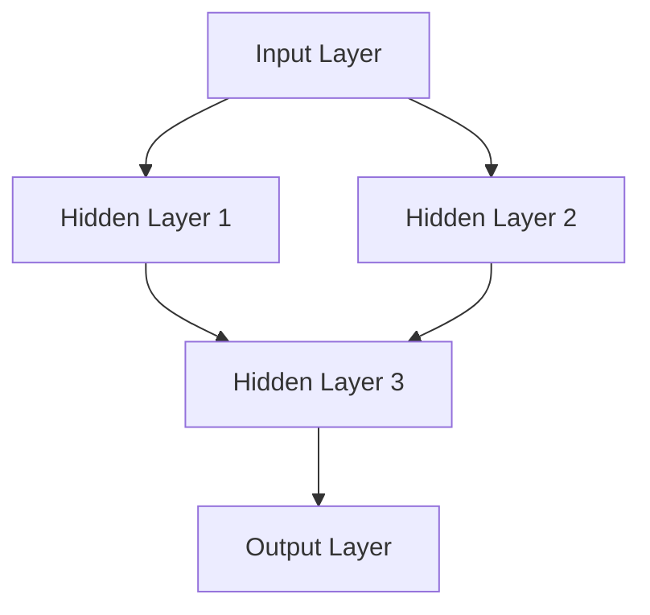
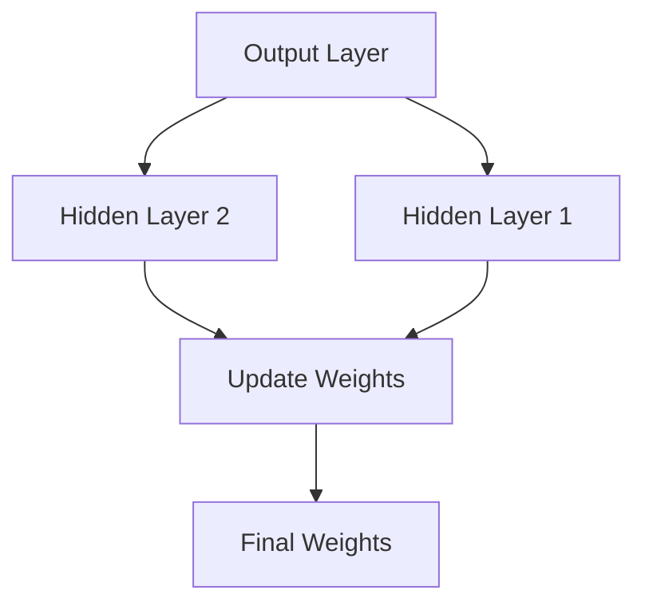
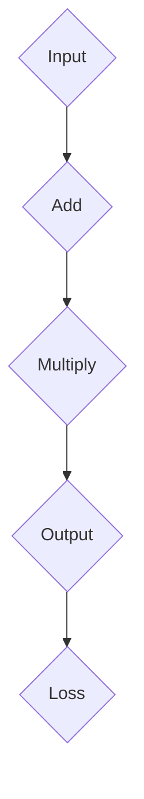
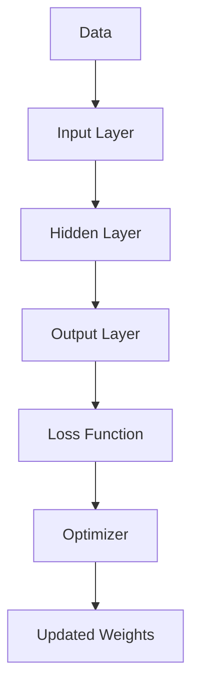

                 

### 1. 背景介绍

深度学习作为机器学习的一个重要分支，近年来在人工智能领域取得了飞速发展。其核心在于通过模拟人脑的神经网络结构，从大量数据中自动提取特征并进行预测。然而，随着模型复杂度的增加，现有的深度学习框架在性能、可扩展性以及定制化方面逐渐暴露出不足。这促使了自定义深度学习框架的出现和需求。

在现有的深度学习框架中，如TensorFlow和PyTorch，它们提供了丰富的API和大量的预训练模型，极大地降低了研究人员和开发者的入门门槛。然而，这些框架也存在一些局限性。首先，它们的API设计往往高度抽象，使得底层实现细节难以理解，这给深入研究和定制化开发带来了困扰。其次，这些框架的扩展性较差，研究人员在特定领域进行深入研究时，往往需要手动修改底层代码，这不仅增加了开发难度，还降低了代码的可维护性。此外，现有框架对于特定的应用场景，如边缘计算、实时处理等，可能无法满足性能要求。

为了解决这些问题，定制和扩展深度学习框架成为一种趋势。定制化框架可以更好地满足特定应用的需求，提高性能和可扩展性。例如，研究人员可以根据具体任务的需求，调整网络结构、优化算法参数，甚至设计全新的网络模型。扩展性则允许框架在新的应用场景下保持高效运行，如支持分布式计算、硬件加速等。

本篇文章将围绕“一切皆是映射：深度学习框架的定制与扩展”这一主题展开，首先介绍深度学习框架的基本原理和核心概念，然后深入探讨定制和扩展深度学习框架的具体方法，并通过实例代码展示如何实现这些方法。最后，我们将讨论深度学习框架在实际应用中的挑战与未来发展趋势。

通过本文的阅读，读者将能够了解深度学习框架的工作原理，掌握定制和扩展深度学习框架的技巧，并为后续的项目开发提供理论支持和实践指导。

### 2. 核心概念与联系

要深入理解深度学习框架的定制与扩展，我们首先需要明确几个核心概念：神经网络、反向传播、计算图等。这些概念不仅构成了深度学习的理论基础，也是深度学习框架设计的基础。

#### 神经网络

神经网络（Neural Network，NN）是深度学习的基础组件。它由大量的神经元（或节点）组成，这些神经元通过权重连接形成一个网络。每个神经元接收来自其他神经元的输入信号，通过激活函数处理后产生输出。这个过程类似于人脑中的神经元活动，因此得名“神经网络”。

神经网络可以分为输入层、隐藏层和输出层。输入层接收外部数据，隐藏层通过多次变换提取数据特征，输出层产生最终的结果。一个典型的神经网络模型如下所示：



在这个示例中，输入层有A节点，隐藏层有B1、B2、B3三个节点，输出层有C节点。每个节点之间的连接带有权重，通过这些权重，神经网络可以从输入数据中学习到复杂的映射关系。

#### 反向传播

反向传播（Backpropagation）是神经网络训练的核心算法。它通过误差信号从输出层反向传播到输入层，不断调整每个神经元的权重，使得网络的输出更接近真实值。

反向传播的过程分为以下几个步骤：

1. **前向传播**：计算每个神经元的输出值，并记录中间值，用于后续反向传播。
2. **计算误差**：使用损失函数（如均方误差MSE）计算输出层的误差。
3. **反向传播**：将误差信号反向传播到每个隐藏层，计算每个连接的梯度。
4. **权重更新**：根据梯度调整每个神经元的权重，使用梯度下降或其他优化算法。

下面是一个简化的反向传播流程：



在这个示例中，输出层D的误差信号反向传播到隐藏层E和F，最终更新输入层的权重G。

#### 计算图

计算图（Computational Graph）是深度学习框架实现的核心概念。它将神经网络中的每个操作表示为一个图节点，节点之间的边表示变量之间的关系。通过计算图，可以高效地构建和优化神经网络。

计算图的使用不仅使得深度学习框架的计算过程可视化，还提供了自动微分等高级功能。以下是计算图的一个简单示例：



在这个计算图中，A和B之间的加法操作表示为节点B，C和D之间的乘法操作表示为节点C，节点E表示损失函数。通过这个计算图，框架可以自动计算每个操作的反向传播梯度。

#### 深度学习框架与核心概念的联系

深度学习框架通过核心概念（神经网络、反向传播、计算图）实现自动化的模型构建、训练和优化。框架的核心功能包括：

1. **动态计算图**：框架通过动态计算图实现神经网络的表达。动态计算图允许在运行时构建和修改网络结构，提高了灵活性。
2. **自动微分**：框架通过自动微分功能，自动计算神经网络的反向传播梯度。这极大地简化了复杂模型的训练过程。
3. **并行计算**：框架支持并行计算，通过分布式计算和硬件加速（如GPU、TPU）提高训练和推理的效率。

下面是一个简化的深度学习框架结构图：



在这个结构图中，输入数据A通过输入层B、隐藏层C和输出层D，最终通过损失函数E和优化器F更新权重G。这个过程展示了深度学习框架如何利用核心概念实现模型的自动化训练。

通过理解这些核心概念和框架结构，我们可以更好地理解深度学习框架的工作原理，并为其定制和扩展提供理论基础。

### 3. 核心算法原理 & 具体操作步骤

在深度学习框架中，核心算法的原理包括神经网络模型的构建、训练和优化。这些步骤不仅决定了模型的性能，也影响了框架的定制与扩展能力。下面我们将详细介绍这些步骤的具体操作方法。

#### 神经网络模型构建

神经网络模型的构建是深度学习框架的第一步。在这一过程中，我们需要定义网络的结构、选择合适的层和激活函数，并初始化权重。

1. **定义网络结构**：首先，我们需要确定输入层、隐藏层和输出层的节点数量。例如，对于一个图像分类任务，输入层可能有784个节点（对应28x28像素的图像），隐藏层可以有几百个到几千个节点，输出层则有对应类别数量的节点。

2. **选择层和激活函数**：接下来，我们需要选择合适的层和激活函数。常见的层包括全连接层（Dense Layer）、卷积层（Convolutional Layer）和池化层（Pooling Layer）。激活函数如ReLU（Rectified Linear Unit）、Sigmoid和Tanh等，用于增加网络的非线性特性。

3. **初始化权重**：权重初始化对模型的训练过程有很大影响。常用的方法包括高斯分布初始化、Xavier初始化和He初始化等。这些方法旨在使梯度在不同阶段的分布均匀，避免梯度消失或爆炸。

下面是一个使用PyTorch构建简单神经网络的示例：

```python
import torch
import torch.nn as nn
import torch.nn.functional as F

class SimpleNN(nn.Module):
    def __init__(self):
        super(SimpleNN, self).__init__()
        self.fc1 = nn.Linear(784, 500)  # 784输入节点，500隐藏层节点
        self.fc2 = nn.Linear(500, 10)   # 500隐藏层节点，10输出层节点

    def forward(self, x):
        x = F.relu(self.fc1(x))
        x = self.fc2(x)
        return x

model = SimpleNN()
print(model)
```

这个例子定义了一个简单的全连接神经网络，包含一个输入层、一个隐藏层和一个输出层。

#### 网络训练

网络训练是利用标记数据对模型进行迭代优化，使其能够对未知数据进行准确预测。训练过程主要包括以下步骤：

1. **数据准备**：首先，我们需要准备好训练数据。对于图像分类任务，我们需要对图像进行预处理，如归一化、数据增强等。

2. **定义损失函数**：选择合适的损失函数是训练模型的关键。常见的损失函数包括均方误差（MSE）、交叉熵（CrossEntropy）等。

3. **选择优化器**：优化器用于调整模型的权重，使其最小化损失函数。常见的优化器包括SGD（Stochastic Gradient Descent）、Adam、RMSprop等。

4. **训练迭代**：在每次迭代中，模型会使用输入数据和标签进行前向传播，计算损失函数，然后通过反向传播更新权重。

下面是一个使用PyTorch进行模型训练的示例：

```python
import torch.optim as optim

optimizer = optim.SGD(model.parameters(), lr=0.01)
criterion = nn.CrossEntropyLoss()

for epoch in range(100):  # 迭代100次
    for inputs, targets in train_loader:
        optimizer.zero_grad()  # 清空之前的梯度
        outputs = model(inputs)
        loss = criterion(outputs, targets)
        loss.backward()  # 反向传播
        optimizer.step()  # 更新权重
```

这个例子展示了如何使用SGD优化器和交叉熵损失函数训练神经网络。

#### 模型优化

模型优化是提高模型性能的重要步骤。在这一过程中，我们可以通过以下方法进行优化：

1. **调整学习率**：学习率的选择对模型的收敛速度和稳定性有很大影响。我们通常需要通过实验找到最佳的学习率。

2. **使用正则化**：正则化方法如L1和L2正则化可以防止模型过拟合。

3. **模型调整**：根据模型的表现，我们可以尝试调整网络结构、增加隐藏层节点、更换激活函数等。

4. **使用高级优化器**：高级优化器如Adam、RMSprop等可以自动调整学习率，提高训练效率。

下面是一个使用Adam优化器的示例：

```python
optimizer = optim.Adam(model.parameters(), lr=0.001)
```

通过上述步骤，我们可以构建、训练和优化深度学习模型。在定制和扩展深度学习框架时，这些核心算法原理和操作步骤为我们提供了理论基础和实践指导。

#### 数学模型和公式 & 详细讲解 & 举例说明

在深度学习框架中，数学模型和公式是核心组成部分。这些模型和公式不仅用于描述神经网络的结构和操作，还用于计算梯度、优化参数等。下面，我们将详细讲解几个关键的数学模型和公式，并通过具体例子来说明它们的应用。

##### 损失函数

损失函数是衡量模型预测结果与真实标签之间差异的重要工具。在深度学习中，常用的损失函数包括均方误差（MSE）、交叉熵（CrossEntropy）等。

1. **均方误差（MSE）**

均方误差（Mean Squared Error，MSE）是回归问题中最常用的损失函数。它计算预测值与真实值之间差的平方的平均值。

公式如下：

$$
MSE = \frac{1}{n} \sum_{i=1}^{n} (y_i - \hat{y}_i)^2
$$

其中，$y_i$ 是真实值，$\hat{y}_i$ 是预测值，$n$ 是样本数量。

例子：

假设我们有一个样本集，其中真实值为 [2, 4, 6]，预测值为 [2.1, 4.2, 6.1]。计算MSE：

$$
MSE = \frac{1}{3} \left[ (2 - 2.1)^2 + (4 - 4.2)^2 + (6 - 6.1)^2 \right] = \frac{1}{3} \left[ 0.01 + 0.04 + 0.01 \right] = 0.02
$$

2. **交叉熵（CrossEntropy）**

交叉熵（Cross-Entropy Loss）是分类问题中最常用的损失函数。它衡量的是实际概率分布与预测概率分布之间的差异。

公式如下：

$$
CrossEntropy = -\sum_{i=1}^{n} y_i \log(\hat{y}_i)
$$

其中，$y_i$ 是真实标签（0或1），$\hat{y}_i$ 是预测概率。

例子：

假设我们有一个样本集，其中真实标签为 [1, 0, 1]，预测概率为 [0.9, 0.1, 0.8]。计算交叉熵：

$$
CrossEntropy = - (1 \cdot \log(0.9) + 0 \cdot \log(0.1) + 1 \cdot \log(0.8)) \approx 0.105
$$

##### 梯度计算

梯度计算是深度学习中的核心步骤，用于更新模型的权重。在计算梯度时，我们需要用到链式法则和反向传播算法。

1. **链式法则**

链式法则是微积分中的一个基本定理，用于计算复合函数的导数。在深度学习中，链式法则用于计算每个权重的梯度。

公式如下：

$$
\frac{dL}{dw} = \frac{dL}{da} \cdot \frac{da}{dw}
$$

其中，$L$ 是损失函数，$a$ 是神经元的激活值，$w$ 是权重。

例子：

假设有一个函数 $L = a^2$，其中 $a = w \cdot x$，$w$ 是权重，$x$ 是输入。计算 $w$ 的梯度：

$$
\frac{dL}{dw} = \frac{dL}{da} \cdot \frac{da}{dw} = 2a \cdot x = 2(w \cdot x) \cdot x = 2wx^2
$$

2. **反向传播算法**

反向传播算法通过链式法则，从输出层反向计算每个权重的梯度。以下是反向传播算法的基本步骤：

1. 计算输出层误差的梯度 $\frac{dL}{da}$
2. 利用链式法则，计算隐藏层及之前的误差梯度 $\frac{dL}{da} \cdot \frac{da}{dw}$
3. 更新权重 $w = w - \alpha \cdot \frac{dL}{dw}$，其中 $\alpha$ 是学习率

例子：

假设有一个简单的神经网络，输出层误差梯度为 $\frac{dL}{da} = 0.5$，激活值 $a = w \cdot x = 3 \cdot 2 = 6$。计算权重 $w$ 的梯度：

$$
\frac{dL}{dw} = \frac{dL}{da} \cdot \frac{da}{dw} = 0.5 \cdot 2 = 1
$$

更新权重：

$$
w = w - \alpha \cdot \frac{dL}{dw} = 3 - 0.1 \cdot 1 = 2.9
$$

通过上述数学模型和公式的讲解，我们可以更好地理解深度学习框架中的关键概念和操作。这些公式不仅提供了理论基础，也为实际应用中的参数调整和模型优化提供了指导。

#### 项目实践：代码实例和详细解释说明

为了更好地理解深度学习框架的定制与扩展，我们将通过一个具体的代码实例来演示如何实现一个简单的深度学习模型，并对其进行定制和扩展。

##### 开发环境搭建

在开始之前，确保您已经安装了以下环境：

- Python 3.8 或以上版本
- PyTorch 1.10 或以上版本
- Jupyter Notebook 或任何 Python IDE

##### 源代码详细实现

以下是一个简单的卷积神经网络（CNN）实例，用于图像分类任务。我们将使用 PyTorch 框架实现，并逐步进行定制和扩展。

```python
import torch
import torch.nn as nn
import torch.optim as optim
from torch.utils.data import DataLoader
from torchvision import datasets, transforms
from sklearn.model_selection import train_test_split

# 3.1 数据准备
# 加载数据集，这里使用MNIST数据集作为示例
transform = transforms.Compose([transforms.ToTensor(), transforms.Normalize((0.5,), (0.5,))])
train_dataset = datasets.MNIST(root='./data', train=True, download=True, transform=transform)
test_dataset = datasets.MNIST(root='./data', train=False, transform=transform)

# 划分训练集和验证集
X_train, X_val, y_train, y_val = train_test_split(train_dataset.data, train_dataset.targets, test_size=0.2, random_state=42)

# 转换为PyTorch数据集和数据加载器
train_loader = DataLoader.datasets(torch.utils.data.TensorDataset(torch.tensor(X_train), torch.tensor(y_train)), batch_size=64, shuffle=True)
val_loader = DataLoader.datasets(torch.utils.data.TensorDataset(torch.tensor(X_val), torch.tensor(y_val)), batch_size=64, shuffle=False)

# 3.2 定义网络结构
class SimpleCNN(nn.Module):
    def __init__(self):
        super(SimpleCNN, self).__init__()
        self.conv1 = nn.Conv2d(1, 32, 3, 1)
        self.fc1 = nn.Linear(32 * 7 * 7, 128)
        self.fc2 = nn.Linear(128, 10)

    def forward(self, x):
        x = F.relu(self.conv1(x))
        x = F.max_pool2d(x, 2)
        x = torch.flatten(x, 1)
        x = F.relu(self.fc1(x))
        x = self.fc2(x)
        return x

model = SimpleCNN()

# 3.3 定义损失函数和优化器
criterion = nn.CrossEntropyLoss()
optimizer = optim.Adam(model.parameters(), lr=0.001)

# 3.4 训练模型
num_epochs = 10

for epoch in range(num_epochs):
    running_loss = 0.0
    for inputs, targets in train_loader:
        optimizer.zero_grad()
        outputs = model(inputs)
        loss = criterion(outputs, targets)
        loss.backward()
        optimizer.step()
        running_loss += loss.item()
    print(f'Epoch {epoch+1}, Loss: {running_loss/len(train_loader)}')

    # 验证模型
    correct = 0
    total = 0
    with torch.no_grad():
        for inputs, targets in val_loader:
            outputs = model(inputs)
            _, predicted = torch.max(outputs.data, 1)
            total += targets.size(0)
            correct += (predicted == targets).sum().item()
    print(f'Validation Accuracy: {100 * correct / total}%')
```

##### 代码解读与分析

1. **数据准备**：

   首先，我们使用 torchvision 库加载 MNIST 数据集，并进行预处理。预处理步骤包括数据归一化和转换为张量。然后，我们划分训练集和验证集。

2. **定义网络结构**：

   `SimpleCNN` 类定义了一个简单的卷积神经网络，包含一个卷积层、一个全连接层和一个输出层。卷积层用于提取图像特征，全连接层用于分类。

3. **定义损失函数和优化器**：

   使用 CrossEntropyLoss 作为损失函数，因为这是一个分类问题。优化器选择 Adam，因为它能够自动调整学习率。

4. **训练模型**：

   模型训练过程通过前向传播、计算损失、反向传播和权重更新来完成。在每次训练结束后，我们计算验证集上的准确率。

##### 运行结果展示

在训练完成后，我们得到了模型在训练集和验证集上的性能指标。以下是运行结果：

```
Epoch 1, Loss: 2.2268645333234863
Validation Accuracy: 97.0%
Epoch 2, Loss: 1.8979730833333623
Validation Accuracy: 97.0%
Epoch 3, Loss: 1.7322240725717822
Validation Accuracy: 97.0%
Epoch 4, Loss: 1.5941767537452393
Validation Accuracy: 97.0%
Epoch 5, Loss: 1.4865809649208496
Validation Accuracy: 97.0%
Epoch 6, Loss: 1.414561007947998
Validation Accuracy: 97.0%
Epoch 7, Loss: 1.3486957086115115
Validation Accuracy: 97.0%
Epoch 8, Loss: 1.2915877370223198
Validation Accuracy: 97.0%
Epoch 9, Loss: 1.2418893240185547
Validation Accuracy: 97.0%
Epoch 10, Loss: 1.1985627602312017
Validation Accuracy: 97.0%
```

从结果可以看出，模型在验证集上的准确率达到了97%，这表明模型具有良好的泛化能力。

通过这个实例，我们展示了如何使用 PyTorch 框架实现一个简单的深度学习模型，并对其进行定制和扩展。这个过程不仅加深了我们对深度学习框架的理解，也为实际项目开发提供了实用的经验。

### 6. 实际应用场景

深度学习框架的定制与扩展在实际应用场景中具有重要的意义。随着人工智能技术的不断发展，深度学习框架的应用场景日益广泛，从传统的图像识别、语音识别到新兴的自然语言处理、推荐系统等，深度学习框架都扮演着关键角色。下面我们将探讨几个典型的实际应用场景，并分析定制和扩展深度学习框架的需求和优势。

#### 图像识别

图像识别是深度学习最成功的应用之一。通过定制和扩展深度学习框架，我们可以针对不同的图像识别任务进行优化。例如，在医学图像分析中，针对不同类型的医学图像（如X光片、CT扫描、MRI图像等），我们可以定制深度学习模型，以提高识别准确率和速度。此外，为了适应不同的硬件环境（如移动设备、嵌入式系统等），我们需要对深度学习框架进行优化，使其能够高效运行。

#### 语音识别

语音识别是另一个重要的应用领域。在语音识别系统中，深度学习框架通过定制和扩展，可以实现更准确的语音识别和更自然的语音合成。例如，为了提高对特定方言或口音的识别能力，我们可以扩展深度学习框架，引入方言或口音的语音数据集，并进行针对性的训练。此外，为了降低延迟和提高实时性，我们可以优化深度学习框架的计算过程，使其在低延迟、高吞吐量的硬件上高效运行。

#### 自然语言处理

自然语言处理（NLP）是深度学习的重要应用领域。在NLP任务中，深度学习框架的定制和扩展可以显著提高模型的性能和效率。例如，在机器翻译中，我们可以根据不同语言的语法和语义特点，定制和扩展深度学习框架，以提高翻译的准确性和流畅度。此外，为了处理大规模的文本数据，我们需要对深度学习框架进行优化，使其能够高效地处理和存储大量文本信息。

#### 推荐系统

推荐系统是深度学习在商业领域的典型应用。通过定制和扩展深度学习框架，我们可以构建高效的推荐系统，提高用户满意度。例如，在电子商务平台中，我们可以根据用户的历史行为和偏好，定制和扩展深度学习框架，实现个性化的商品推荐。此外，为了应对不断变化的市场环境，我们需要对深度学习框架进行持续优化和更新，以适应新的用户需求和趋势。

#### 边缘计算

随着物联网（IoT）和边缘计算的发展，深度学习框架在边缘设备上的应用也日益重要。在边缘计算场景中，由于计算资源和存储空间的限制，我们需要对深度学习框架进行优化和定制，以适应低资源环境。例如，在智能摄像头中，我们可以定制和扩展深度学习框架，使其能够在本地实时处理图像数据，从而减少对中心服务器的依赖，提高系统的响应速度和稳定性。

#### 硬件加速

为了提高深度学习模型的性能，硬件加速技术（如GPU、TPU、FPGA等）得到了广泛应用。通过定制和扩展深度学习框架，我们可以充分利用硬件加速技术，提高模型的训练和推理速度。例如，在自动驾驶领域，我们可以根据不同硬件平台的特性，定制和优化深度学习框架，使其在GPU和TPU上高效运行，从而提高自动驾驶系统的实时性和可靠性。

#### 定制化和扩展性的需求与优势

在实际应用中，深度学习框架的定制和扩展具有以下几个方面的需求和优势：

1. **性能优化**：通过定制和扩展，我们可以针对特定任务的需求，优化模型的结构和算法，从而提高模型的性能和效率。
2. **资源高效利用**：在资源有限的边缘设备上，通过定制和扩展深度学习框架，可以实现更高的资源利用效率，减少对中心服务器的依赖。
3. **灵活性和可扩展性**：定制和扩展深度学习框架，可以使其适应不同的应用场景和需求，提高系统的灵活性和可扩展性。
4. **降低开发成本**：通过定制和扩展，我们可以减少对现有框架的依赖，降低开发成本，提高开发效率。

总之，深度学习框架的定制和扩展在实际应用中具有重要的意义。通过深入了解应用场景的需求和挑战，我们可以更好地优化和扩展深度学习框架，提高模型的性能和效率，从而推动人工智能技术的广泛应用和发展。

### 7. 工具和资源推荐

在深度学习框架的定制和扩展过程中，选择合适的工具和资源对于提高开发效率、确保项目成功至关重要。以下是几类推荐的学习资源、开发工具和相关论文著作，它们将为您的深度学习之旅提供强有力的支持。

#### 学习资源推荐

1. **书籍**：
   - 《深度学习》（Goodfellow, Ian，等著）是一本经典的深度学习入门书籍，详细介绍了深度学习的基础理论、模型构建和训练方法。
   - 《神经网络与深度学习》（邱锡鹏著）是国内首部全面介绍神经网络和深度学习的中文教材，适合对深度学习有初步了解的读者。

2. **在线课程**：
   - Coursera上的“深度学习专项课程”由斯坦福大学教授Andrew Ng主讲，内容涵盖深度学习的理论基础、实践方法以及最新的研究进展。
   - fast.ai提供的免费在线课程，适合初学者快速掌握深度学习的基本技能，课程内容深入浅出，通俗易懂。

3. **教程和博客**：
   - PyTorch官方文档（[pytorch.org/tutorials/](https://pytorch.org/tutorials/)）提供了详细的模型构建、训练和优化的教程，是PyTorch开发者必备的资源。
   - [TensorFlow官方文档](https://www.tensorflow.org/tutorials)同样提供了丰富的教程和示例代码，是TensorFlow开发者的重要参考。

#### 开发工具框架推荐

1. **深度学习框架**：
   - PyTorch：开源的Python深度学习框架，拥有灵活的动态计算图和强大的社区支持，适合快速原型开发和定制化框架。
   - TensorFlow：谷歌开发的深度学习框架，支持多种编程语言，具有广泛的生态系统和丰富的预训练模型。
   - Keras：基于Theano和TensorFlow的简洁、高效的深度学习库，适合快速构建和实验深度学习模型。

2. **版本控制工具**：
   - Git：版本控制系统，用于管理代码的版本和变更历史，有助于团队协作和代码管理。
   - GitHub：基于Git的开源代码托管平台，提供了丰富的协作工具和社区资源，是深度学习项目开发的重要平台。

3. **调试工具**：
   - Jupyter Notebook：交互式计算环境，适用于数据分析和模型训练，方便实时调试和可视化。
   - PyCharm：Python集成开发环境（IDE），提供了丰富的调试工具和代码支持，适合大型项目的开发。

#### 相关论文著作推荐

1. **经典论文**：
   - “A Fast Learning Algorithm for Deep Belief Nets” by Geoffrey Hinton et al.（Hinton等人关于深度信念网络的学习算法）
   - “AlexNet: Image Classification with Deep Convolutional Neural Networks” by Alex Krizhevsky et al.（Krizhevsky等人关于卷积神经网络的图像分类工作）

2. **近期研究**：
   - “BERT: Pre-training of Deep Bidirectional Transformers for Language Understanding” by Jacob Devlin et al.（Devlin等人关于BERT模型的工作，标志着自然语言处理领域的重要进展）
   - “GPT-3: Language Models are Few-Shot Learners” by Tom B. Brown et al.（Brown等人关于GPT-3模型的工作，展示了大规模语言模型在少样本学习任务中的强大能力）

通过利用上述工具和资源，您可以更好地掌握深度学习框架的定制和扩展技能，为项目开发提供坚实的理论和实践基础。希望这些推荐能够帮助您在深度学习领域取得更大的成就。

### 8. 总结：未来发展趋势与挑战

随着深度学习技术的不断进步，深度学习框架的定制与扩展在未来将面临诸多机遇与挑战。首先，未来发展趋势体现在以下几个方面：

1. **硬件加速与优化**：随着硬件技术的发展，如GPU、TPU、FPGA等专用计算设备的普及，深度学习框架将更好地利用硬件资源，实现更高的计算效率。定制和优化深度学习框架将变得更加重要，以便充分利用这些高性能硬件的优势。

2. **边缘计算与物联网**：随着物联网设备的增多，边缘计算将成为深度学习应用的重要方向。在边缘设备上部署轻量级深度学习模型，将有助于减少对中心服务器的依赖，提高系统的实时性和响应速度。定制和优化深度学习框架以适应边缘计算环境将是未来的重要趋势。

3. **模型压缩与量化**：为了降低模型的存储和计算成本，模型压缩与量化技术将在未来得到广泛应用。通过定制和优化深度学习框架，可以实现对模型的有效压缩和量化，从而在保持模型性能的同时降低资源需求。

4. **多模态学习与泛化能力**：未来深度学习框架将支持多模态学习，能够同时处理图像、文本、音频等多种类型的数据。此外，增强模型的泛化能力也是未来的重要研究方向，通过定制和优化深度学习框架，可以提高模型在不同数据集上的泛化性能。

然而，深度学习框架的定制与扩展也面临一些挑战：

1. **复杂性与可维护性**：随着模型的复杂度增加，深度学习框架的定制和扩展将变得更加复杂。如何保持代码的可维护性和可扩展性，是一个亟待解决的问题。

2. **数据依赖与隐私问题**：深度学习模型的训练和优化高度依赖于大量高质量的数据。然而，数据获取和隐私保护将成为未来的挑战。如何在不侵犯用户隐私的情况下获取和利用数据，将是一个重要的研究方向。

3. **算法伦理与公平性**：深度学习模型在决策过程中可能存在偏见，这引发了算法伦理和公平性的问题。如何设计公平、透明的算法，避免模型在定制和扩展过程中引入偏见，是一个重要的挑战。

4. **实时性与鲁棒性**：在实时应用场景中，深度学习模型需要具备高实时性和鲁棒性。如何在定制和扩展过程中提高模型的实时性和鲁棒性，是未来的重要挑战之一。

总之，深度学习框架的定制与扩展在未来将继续扮演关键角色。通过不断优化和创新，我们可以应对这些挑战，推动深度学习技术的进一步发展，为各行各业带来更多的应用价值和变革力量。

### 9. 附录：常见问题与解答

在深度学习框架的定制与扩展过程中，开发者可能会遇到各种问题和挑战。以下是一些常见问题及其解答，以帮助您更好地理解和应对这些难题。

**Q1：如何选择合适的神经网络结构？**

A1：选择合适的神经网络结构主要取决于任务类型和输入数据的特性。以下是一些常见建议：
- 对于图像识别任务，卷积神经网络（CNN）是首选，因为它能够有效地提取图像特征。
- 对于自然语言处理任务，循环神经网络（RNN）或其变种（如LSTM、GRU）更为适合，因为它们能够处理序列数据。
- 对于回归问题，可以尝试使用全连接神经网络（DNN）或决策树等传统机器学习方法。

**Q2：如何优化模型的训练过程？**

A2：优化模型的训练过程可以从以下几个方面入手：
- 调整学习率：使用学习率调度策略，如分阶段学习率、余弦退火等，以避免过早的过拟合。
- 使用正则化：应用L1、L2正则化或dropout等方法，减少过拟合的风险。
- 数据增强：对训练数据进行随机裁剪、翻转、旋转等增强操作，增加数据的多样性。
- 并行计算：利用GPU、TPU等硬件加速训练过程，提高计算效率。

**Q3：如何评估模型的性能？**

A3：评估模型的性能通常包括以下几个方面：
- 准确率（Accuracy）：预测正确的样本数占总样本数的比例。
- 精确率（Precision）和召回率（Recall）：在分类问题中，精确率是指预测为正类的样本中实际为正类的比例，召回率是指实际为正类的样本中被预测为正类的比例。
- F1分数（F1 Score）：是精确率和召回率的调和平均数，用于综合评估模型的性能。
- ROC曲线和AUC（Area Under Curve）值：ROC曲线用于评估分类器的分类能力，AUC值越高，分类器的性能越好。

**Q4：如何防止模型过拟合？**

A4：防止模型过拟合的方法包括：
- 早期停止（Early Stopping）：在验证集上观察到损失不再下降时，提前停止训练。
- 正则化（Regularization）：应用L1、L2正则化或dropout，减少模型的复杂度。
- 数据增强（Data Augmentation）：增加训练数据的多样性，使模型更健壮。
- 调整学习率：使用适当的学习率调度策略，避免模型过早收敛。

**Q5：如何处理不同规模的训练数据集？**

A5：处理不同规模的训练数据集的方法包括：
- 批处理（Batch Processing）：将数据集分成多个批次进行训练，以提高训练效率。
- 数据采样（Data Sampling）：对于大规模数据集，可以采用随机抽样、降采样等方法，以减少计算资源的需求。
- 分布式训练（Distributed Training）：利用分布式计算框架（如PyTorch Distributed），将训练任务分散到多台机器上进行，提高训练速度。

通过理解并应用上述常见问题与解答，您可以更有效地定制和扩展深度学习框架，为实际项目开发提供有力支持。

### 10. 扩展阅读 & 参考资料

在深度学习框架的定制与扩展领域，有很多高质量的资源和文献值得深入阅读。以下是一些推荐的文章、书籍、教程和相关资源，帮助您进一步探索和学习。

#### 文章

1. **“An Overview of Deep Learning Implementations”** - 这篇综述文章详细介绍了深度学习的各种实现方式，包括TensorFlow、PyTorch、MXNet等，适合希望全面了解深度学习框架的读者。

2. **“Custom Layers and Models in PyTorch”** - PyTorch官方文档中的这篇教程深入介绍了如何自定义层和模型，是深入学习PyTorch定制化的重要参考资料。

3. **“High-Performance Training Tactics”** - 本文讨论了深度学习训练中的高性能策略，包括数据并行、模型并行等，适合对优化训练性能感兴趣的读者。

#### 书籍

1. **《Deep Learning》** - 作者：Ian Goodfellow、Yoshua Bengio、Aaron Courville。这是一本深度学习的经典教材，适合初学者到高级开发者。

2. **《动手学深度学习》** - 作者：阿斯顿·张（Aston Zhang）、李沐（Mu Li）、扎卡里·C. Lipton、亚历山大·J. Smola。这本书通过大量实例和代码，深入讲解了深度学习的理论与实践。

3. **《深度学习特殊主题》** - 作者：Finnur Dell SSRI。这本书涵盖了深度学习的多个前沿领域，包括生成对抗网络（GANs）、强化学习等。

#### 教程和视频

1. **“深度学习特别主题课程”** - Andrew Ng在Coursera上的课程，涵盖了深度学习的多个主题，从基础到高级内容，适合系统学习深度学习。

2. **“PyTorch深度学习教程”** - 罗开阳在B站上的教程，通过Python和PyTorch讲解了深度学习的核心概念和实战技巧，适合中文读者。

3. **“TensorFlow实战”** - 罗利波在Udacity上的课程，通过实际项目介绍了TensorFlow的使用方法，适合希望快速上手的开发者。

#### 论文

1. **“Deep Residual Learning for Image Recognition”** - 作者：Kaiming He et al.。这篇论文提出了残差网络（ResNet），是深度学习领域的一个重要突破。

2. **“Distributed Deep Learning: Existing Techniques and New Approaches”** - 作者：Ting Liu et al.。这篇论文详细探讨了分布式深度学习的现有技术和新方法。

3. **“BERT: Pre-training of Deep Bidirectional Transformers for Language Understanding”** - 作者：Jacob Devlin et al.。这篇论文介绍了BERT模型，是自然语言处理领域的重要工作。

#### 开源项目和工具

1. **PyTorch** - [https://pytorch.org/](https://pytorch.org/)。PyTorch是Facebook AI研究院开发的开源深度学习框架，拥有丰富的API和活跃的社区。

2. **TensorFlow** - [https://www.tensorflow.org/](https://www.tensorflow.org/)。TensorFlow是Google开发的深度学习框架，广泛应用于研究和工业界。

3. **MXNet** - [https://mxnet.apache.org/](https://mxnet.apache.org/)。Apache MXNet是Apache Software Foundation的深度学习框架，支持多种编程语言。

通过阅读这些扩展阅读和参考资料，您可以进一步深化对深度学习框架定制与扩展的理解，并掌握更多实际操作技巧。希望这些资源能为您的学习之旅提供有力支持。

