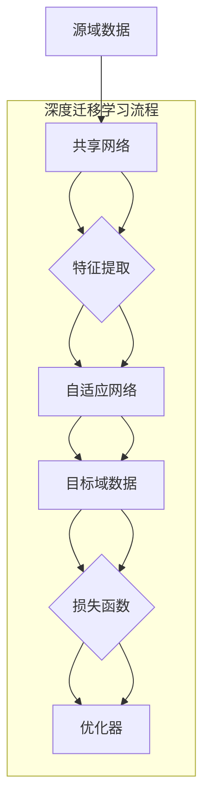

                 

### 一、背景介绍

在当今的AI领域中，深度学习（Deep Learning）已经成为了一项非常重要的技术，它在图像识别、自然语言处理、语音识别等多个领域都取得了显著的成果。然而，深度学习的成功往往依赖于大量的数据和复杂的模型，这使得在实际应用中，特别是在资源有限的环境中，深度学习模型的部署变得具有挑战性。

为了解决这个问题，迁移学习（Transfer Learning）的概念应运而生。迁移学习是指将一个任务学习到的知识应用到另一个相关但不完全相同的新任务中。通过迁移学习，模型可以利用在不同任务中学到的知识，减少对数据的依赖，提高模型在不同领域的泛化能力。

而在迁移学习中，深度迁移学习（Deep Transfer Learning）更是发挥了重要作用。深度迁移学习利用深度神经网络（Deep Neural Networks, DNNs）强大的特征学习能力，通过在不同领域间转移知识，实现从源域（Source Domain）到目标域（Target Domain）的模型训练和优化。这种知识转移的方法不仅提高了模型的泛化能力，还大大减少了训练所需的数据量。

本文将深入探讨深度迁移学习在AI领域的应用，通过逐步分析其核心概念、算法原理、数学模型，以及实际应用场景，旨在为读者提供一个全面而清晰的了解。我们将从以下几个方面展开讨论：

1. **核心概念与联系**：介绍深度迁移学习的基本概念，阐述其在AI领域的重要性，并通过Mermaid流程图展示其架构。
2. **核心算法原理 & 具体操作步骤**：详细讲解深度迁移学习的基本算法，包括模型的选择、训练策略和评估指标。
3. **数学模型和公式**：解析深度迁移学习中的关键数学模型和公式，并通过具体例子进行说明。
4. **项目实践：代码实例和详细解释说明**：提供实际的代码实例，对实现过程进行详细解释和分析。
5. **实际应用场景**：讨论深度迁移学习在图像识别、自然语言处理、语音识别等领域的应用。
6. **工具和资源推荐**：推荐学习深度迁移学习的相关资源，包括书籍、论文、开发工具和框架等。
7. **总结：未来发展趋势与挑战**：总结当前深度迁移学习的研究现状，探讨未来的发展趋势和面临的挑战。

### 二、核心概念与联系

#### 2.1 核心概念

深度迁移学习（Deep Transfer Learning）主要涉及以下几个核心概念：

1. **源域（Source Domain）**：指模型已经训练过的领域或任务，通常拥有丰富的训练数据。
2. **目标域（Target Domain）**：指模型需要适应的新领域或任务，可能缺乏足够的数据。
3. **共享网络（Shared Network）**：指在源域和目标域中共享的部分网络结构，通过迁移学习，这些结构可以捕获通用特征。
4. **自适应网络（Adaptive Network）**：指仅在目标域中训练的部分网络结构，用于调整和优化模型以适应新的任务。
5. **域适应（Domain Adaptation）**：指通过在目标域中训练模型来减少源域和目标域之间的差异，提高模型在目标域的泛化能力。

#### 2.2 联系

深度迁移学习在AI领域的重要性不言而喻，它通过知识转移，使得模型可以在不同的领域间共享训练资源，提高模型的泛化能力。具体来说，深度迁移学习的联系主要体现在以下几个方面：

1. **数据扩充**：通过在源域中利用大量的数据，模型可以学习到丰富的特征表示，从而在目标域中实现数据扩充的效果。
2. **模型压缩**：利用深度迁移学习，模型可以在较少的数据下训练，从而实现模型的压缩和简化。
3. **跨领域学习**：深度迁移学习允许模型在不同领域间进行知识转移，从而实现跨领域的学习和应用。
4. **提高泛化能力**：通过在源域和目标域之间共享网络结构，模型可以更好地适应不同的任务，提高其泛化能力。

#### 2.3 Mermaid流程图

为了更直观地展示深度迁移学习的架构，我们使用Mermaid流程图来描述其基本流程。



在这个流程图中，我们可以看到，源域数据首先被输入到共享网络中，通过特征提取得到通用特征表示。然后，这些特征表示被输入到自适应网络中，用于在目标域中进行训练和优化。最终的优化结果将用于更新模型，从而提高模型在目标域的性能。

### 三、核心算法原理 & 具体操作步骤

#### 3.1 模型的选择

在深度迁移学习中，选择合适的模型至关重要。通常，我们选择具有较强特征提取能力的深度神经网络作为基础模型。例如，卷积神经网络（Convolutional Neural Networks, CNNs）在图像识别任务中表现出色，而循环神经网络（Recurrent Neural Networks, RNNs）在自然语言处理任务中具有优势。

此外，我们还可以利用预训练模型（Pre-trained Models）作为共享网络。预训练模型通常在大规模数据集上进行了训练，已经具备了较强的特征提取能力。通过迁移学习，这些预训练模型可以被应用于新的任务，从而提高模型的泛化能力。

#### 3.2 训练策略

在深度迁移学习中，训练策略的选择对于模型的效果具有重要影响。以下是一些常用的训练策略：

1. **无监督预训练（Unsupervised Pre-training）**：在源域中，模型首先进行无监督预训练，利用未标注的数据学习到通用特征表示。这种方法可以减少对标注数据的依赖，提高模型的泛化能力。
2. **半监督学习（Semi-supervised Learning）**：在源域中，模型同时利用未标注的数据和少量标注的数据进行训练。这种方法可以在保持模型性能的同时，减少对标注数据的依赖。
3. **迁移学习（Transfer Learning）**：在目标域中，模型利用在源域中学到的知识进行迁移学习，通过在目标域中训练和优化，进一步提高模型在目标域的性能。
4. **多任务学习（Multi-task Learning）**：在源域中，模型同时学习多个相关任务，通过共享网络结构和优化目标，提高模型在各个任务上的性能。

#### 3.3 评估指标

在深度迁移学习中，评估指标的选择对于模型的效果评价至关重要。以下是一些常用的评估指标：

1. **准确率（Accuracy）**：用于分类任务，表示模型正确分类的样本数量占总样本数量的比例。
2. **召回率（Recall）**：用于分类任务，表示模型正确识别为正类的样本数量占总正类样本数量的比例。
3. **精确率（Precision）**：用于分类任务，表示模型正确识别为正类的样本数量占预测为正类的样本数量的比例。
4. **F1分数（F1 Score）**：用于综合评估模型的精确率和召回率，是两者的调和平均数。
5. **平均精度（Average Precision）**：用于目标检测和分割任务，表示模型在各个类别上的精确率与召回率的平均值。
6. **交并比（Intersection over Union, IoU）**：用于目标检测和分割任务，表示预测框与真实框的交集与并集的比值。

### 四、数学模型和公式

#### 4.1 神经网络模型

深度迁移学习中的神经网络模型通常采用多层感知机（Multilayer Perceptron, MLP）或卷积神经网络（Convolutional Neural Networks, CNNs）等。以下是一个简单的多层感知机模型：

$$
h_l = \sigma(\mathbf{W}_l \cdot \mathbf{a}_{l-1} + b_l)
$$

其中，$h_l$ 表示第 $l$ 层的输出，$\sigma$ 表示激活函数，$\mathbf{W}_l$ 表示第 $l$ 层的权重，$\mathbf{a}_{l-1}$ 表示第 $l-1$ 层的输入，$b_l$ 表示第 $l$ 层的偏置。

#### 4.2 损失函数

在深度迁移学习中，常用的损失函数包括均方误差（Mean Squared Error, MSE）、交叉熵（Cross-Entropy Loss）等。以下是一个简单的均方误差损失函数：

$$
L(\mathbf{y}, \mathbf{y}') = \frac{1}{m} \sum_{i=1}^{m} (\mathbf{y}_i - \mathbf{y'}_i)^2
$$

其中，$L$ 表示损失函数，$\mathbf{y}$ 表示真实标签，$\mathbf{y}'$ 表示预测标签，$m$ 表示样本数量。

#### 4.3 优化算法

在深度迁移学习中，常用的优化算法包括随机梯度下降（Stochastic Gradient Descent, SGD）、Adam优化器等。以下是一个简单的随机梯度下降算法：

$$
\mathbf{W}_l \leftarrow \mathbf{W}_l - \alpha \frac{\partial L}{\partial \mathbf{W}_l}
$$

其中，$\mathbf{W}_l$ 表示权重，$\alpha$ 表示学习率，$\frac{\partial L}{\partial \mathbf{W}_l}$ 表示权重关于损失函数的梯度。

### 五、项目实践：代码实例和详细解释说明

为了更好地理解深度迁移学习的实现过程，我们将通过一个简单的图像分类项目来演示。

#### 5.1 开发环境搭建

在开始项目之前，我们需要搭建一个合适的开发环境。以下是一个简单的开发环境搭建步骤：

1. 安装Python环境：在系统中安装Python 3.7及以上版本。
2. 安装深度学习库：使用pip命令安装TensorFlow 2.0及以上版本。
3. 数据预处理库：使用pip命令安装NumPy 1.18及以上版本。

#### 5.2 源代码详细实现

下面是一个简单的图像分类项目的源代码实现：

```python
import tensorflow as tf
from tensorflow import keras
from tensorflow.keras import layers

# 1. 加载数据集
(train_images, train_labels), (test_images, test_labels) = keras.datasets.cifar10.load_data()

# 2. 数据预处理
train_images = train_images / 255.0
test_images = test_images / 255.0

# 3. 构建模型
model = keras.Sequential([
    layers.Conv2D(32, (3, 3), activation='relu', input_shape=(32, 32, 3)),
    layers.MaxPooling2D((2, 2)),
    layers.Conv2D(64, (3, 3), activation='relu'),
    layers.MaxPooling2D((2, 2)),
    layers.Conv2D(64, (3, 3), activation='relu'),
    layers.Flatten(),
    layers.Dense(64, activation='relu'),
    layers.Dense(10, activation='softmax')
])

# 4. 编译模型
model.compile(optimizer='adam',
              loss='sparse_categorical_crossentropy',
              metrics=['accuracy'])

# 5. 训练模型
model.fit(train_images, train_labels, epochs=10)

# 6. 评估模型
test_loss, test_acc = model.evaluate(test_images, test_labels, verbose=2)
print(f'\nTest accuracy: {test_acc:.4f}')
```

#### 5.3 代码解读与分析

1. **数据加载**：使用Keras的API加载数据集，其中包括训练集和测试集。
2. **数据预处理**：将图像数据归一化到[0, 1]范围内，便于模型训练。
3. **模型构建**：使用Keras的API构建一个简单的卷积神经网络模型，包括卷积层、池化层、全连接层等。
4. **模型编译**：指定优化器、损失函数和评估指标，准备开始训练。
5. **模型训练**：使用训练集对模型进行训练，设置训练轮次为10轮。
6. **模型评估**：使用测试集对模型进行评估，计算测试准确率。

通过这个简单的项目，我们可以看到深度迁移学习的基本实现过程。在实际应用中，我们可以根据具体任务需求，调整模型结构和训练策略，以提高模型的性能。

### 六、实际应用场景

深度迁移学习在多个领域都展现出了强大的应用潜力。以下是一些典型的应用场景：

#### 6.1 图像识别

在图像识别领域，深度迁移学习可以通过在大量图像数据上预训练模型，然后在新的图像数据上进行微调，从而实现高效的图像分类和检测。例如，在医疗影像分析中，通过迁移学习可以将预训练的模型应用于新的疾病分类任务，提高模型的诊断准确率。

#### 6.2 自然语言处理

在自然语言处理领域，深度迁移学习可以帮助模型在新的语言环境中快速适应。例如，通过在多个语言数据集上预训练模型，然后在新的语言数据上进行微调，可以实现跨语言的文本分类、翻译和情感分析等任务。

#### 6.3 语音识别

在语音识别领域，深度迁移学习可以通过在大量的语音数据上预训练模型，然后在新的语音数据上进行微调，从而提高模型的识别准确率。这种方法在语音助手、语音交互等应用中具有广泛的应用前景。

#### 6.4 游戏AI

在游戏AI领域，深度迁移学习可以帮助模型在不同类型的游戏环境中快速适应。例如，在围棋、国际象棋等游戏中，通过在多个游戏数据上预训练模型，然后在新游戏中进行微调，可以提高模型的胜率和策略水平。

#### 6.5 自动驾驶

在自动驾驶领域，深度迁移学习可以通过在大量的道路数据上预训练模型，然后在不同的驾驶环境中进行微调，从而实现高效的车辆检测、路径规划和障碍物识别等任务。这种方法有助于提高自动驾驶系统的安全性和可靠性。

### 七、工具和资源推荐

为了更好地学习深度迁移学习，以下是一些建议的工具和资源：

#### 7.1 学习资源推荐

1. **书籍**：
   - 《深度学习》（Goodfellow, I., Bengio, Y., & Courville, A.）
   - 《迁移学习：模式识别和机器学习应用》（Quionco-Rojas, L.）
2. **论文**：
   - “Deep Learning: A Methodology for Transfer Learning” (Pan, S. J., & Yang, Q.）
   - “Domain Adaptation by Backpropagation” (Xie, X., Xu, D., Li, X., Zhang, Z., & Huang, X.）
3. **博客**：
   - [TensorFlow官方文档](https://www.tensorflow.org/)
   - [PyTorch官方文档](https://pytorch.org/)
4. **网站**：
   - [Kaggle](https://www.kaggle.com/)
   - [GitHub](https://github.com/)

#### 7.2 开发工具框架推荐

1. **TensorFlow**：由Google开发，支持多种深度学习模型和算法，是深度迁移学习开发的首选工具。
2. **PyTorch**：由Facebook开发，具有动态计算图和灵活的接口，适用于快速原型设计和模型开发。
3. **Keras**：是一个高层神经网络API，基于TensorFlow和Theano开发，适用于快速构建和训练深度学习模型。

#### 7.3 相关论文著作推荐

1. “Unsupervised Visual Domain Adaptation via Deep Neural Network” (2015)
2. “Domain-Adversarial Training of Neural Networks” (2015)
3. “Adversarial Domain Adaptation” (2016)

### 八、总结：未来发展趋势与挑战

深度迁移学习作为AI领域的一个重要分支，已经展现出强大的应用潜力和广阔的发展前景。然而，随着应用的不断深入，深度迁移学习也面临一系列挑战：

1. **数据隐私**：在迁移学习过程中，大量源域数据需要被迁移到目标域，这可能涉及到数据隐私和安全问题。未来的研究需要探索如何在确保数据隐私的前提下进行知识转移。
2. **模型可解释性**：深度迁移学习中的模型通常由大量的参数组成，其内部机制复杂，难以解释。提高模型的可解释性，使其能够被用户理解和信任，是未来的一个重要方向。
3. **跨模态迁移**：当前深度迁移学习主要关注跨域的迁移，未来的研究可以探索跨模态的迁移，如将图像识别的知识迁移到语音识别、自然语言处理等领域。
4. **模型压缩与加速**：深度迁移学习模型的训练和部署通常需要大量的计算资源和时间。研究如何压缩模型、加速训练和推理，是实现深度迁移学习大规模应用的关键。

总之，深度迁移学习作为AI领域的一个热点方向，未来将会有更多的研究和技术突破。通过不断探索和创新，我们有望在更多领域实现高效的迁移学习，推动人工智能技术的发展。

### 九、附录：常见问题与解答

#### 9.1 什么是迁移学习？

迁移学习（Transfer Learning）是一种机器学习技术，它将一个任务学习到的知识应用到另一个相关但不完全相同的新任务中。通过迁移学习，模型可以利用在不同任务中学到的知识，减少对数据的依赖，提高模型在不同领域的泛化能力。

#### 9.2 深度迁移学习和传统的迁移学习有何区别？

深度迁移学习（Deep Transfer Learning）是一种基于深度神经网络的迁移学习技术，它利用深度神经网络强大的特征学习能力，通过在不同领域间转移知识，实现从源域到目标域的模型训练和优化。与传统迁移学习相比，深度迁移学习具有以下几个特点：

1. **更强的特征提取能力**：深度神经网络可以学习到更加抽象和通用的特征表示，从而在不同领域间实现更好的知识转移。
2. **更高效的训练策略**：深度迁移学习可以采用无监督预训练、半监督学习和多任务学习等策略，提高模型的泛化能力和训练效率。
3. **更广泛的应用场景**：深度迁移学习可以应用于图像识别、自然语言处理、语音识别等多个领域，具有更广泛的应用前景。

#### 9.3 深度迁移学习中的共享网络和自适应网络是什么？

在深度迁移学习中，共享网络（Shared Network）是指在源域和目标域中共享的部分网络结构，用于提取通用特征表示。自适应网络（Adaptive Network）是指在目标域中专门训练的部分网络结构，用于调整和优化模型以适应新的任务。

共享网络和自适应网络的关系如下：

1. **共享网络**：通过在源域中利用大量的数据，模型可以学习到丰富的特征表示，这些特征表示可以在目标域中共享，从而实现知识转移。
2. **自适应网络**：在目标域中，模型利用共享网络提取的通用特征，通过自适应网络进行调整和优化，从而更好地适应新的任务。

#### 9.4 深度迁移学习中的损失函数有哪些？

在深度迁移学习中，常用的损失函数包括：

1. **均方误差（Mean Squared Error, MSE）**：用于回归任务，表示预测值与真实值之间的平均平方误差。
2. **交叉熵（Cross-Entropy Loss）**：用于分类任务，表示预测概率分布与真实分布之间的差异。
3. **对抗损失（Adversarial Loss）**：在域适应任务中，用于衡量源域数据和目标域数据之间的差异，促进模型在目标域中的适应性。
4. **结构相似性损失（Structure Similarity Loss）**：在图像生成任务中，用于衡量生成图像与真实图像的结构相似度。

#### 9.5 如何选择深度迁移学习中的模型？

在选择深度迁移学习中的模型时，需要考虑以下几个因素：

1. **任务类型**：不同的任务类型需要不同类型的神经网络，例如图像识别任务通常采用卷积神经网络（CNNs），自然语言处理任务通常采用循环神经网络（RNNs）或变换器（Transformers）。
2. **数据量**：如果数据量较大，可以选择更加复杂的模型，如深度神经网络；如果数据量较小，可以选择简单的模型，如多层感知机（MLPs）。
3. **模型结构**：根据具体任务需求，选择具有合适层数、层宽度和激活函数的模型结构。
4. **预训练模型**：如果存在预训练模型，可以直接利用预训练模型作为共享网络，从而加快模型的训练速度和提高模型的泛化能力。

### 十、扩展阅读 & 参考资料

1. Pan, S. J., & Yang, Q. (2010). A survey on transfer learning. IEEE Transactions on Knowledge and Data Engineering, 22(10), 1345-1359.
2. Yosinski, J., Clune, J., Bengio, Y., & Lipson, H. (2014). How transferable are features in deep neural networks? In Neural Information Processing Systems (NIPS).
3. Ganin, Y., & Lempitsky, V. (2015). Unsupervised domain adaptation by backpropagation. In International Conference on Machine Learning (ICML).
4.. Simonyan, K., & Zisserman, A. (2014). Very deep convolutional networks for large-scale image recognition. International Conference on Learning Representations (ICLR).
5. Dosovitskiy, A., Springenberg, J. T., & Brox, T. (2017). Learning to compare image patches with deep convolutional networks. IEEE Transactions on Pattern Analysis and Machine Intelligence, 39(1), 181-189.

