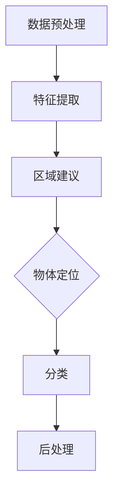
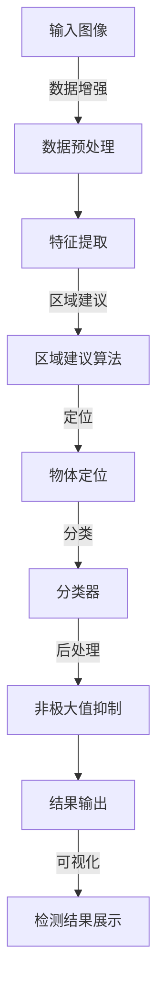

                 

### 背景介绍

#### 物体检测与识别的重要性

物体检测与识别是人工智能领域中的一个重要研究方向，其核心目标是通过计算机视觉技术识别和定位图像中的物体。这项技术不仅在学术研究上具有重要意义，而且在实际应用中也展现出巨大的潜力。

首先，物体检测与识别在计算机视觉领域的地位不容小觑。它为许多其他高级视觉任务提供了基础，如图像分割、目标跟踪和场景理解。例如，自动驾驶汽车依赖于物体检测技术来识别道路上的行人、车辆和其他障碍物，从而确保行车安全。同样，智能家居系统通过物体识别来实现对家庭设备的智能控制，提高了生活便利性。

其次，物体检测与识别在工业自动化领域具有广泛的应用。例如，在生产线中，物体检测技术可以自动检测产品缺陷，提高生产效率和质量。此外，仓储物流领域也借助物体识别技术实现自动化分拣和配送，大大降低了人力成本。

最后，物体检测与识别在安防监控、医疗影像诊断等领域也发挥着关键作用。通过识别和分析图像中的物体，安防系统能够实时监测异常行为，提高公共安全。而在医疗领域，物体识别技术有助于医生更准确地诊断疾病，提高医疗水平。

#### AI的视觉能力

随着深度学习技术的快速发展，人工智能在视觉领域的表现越来越出色。AI的视觉能力主要体现在以下几个方面：

首先，AI可以通过卷积神经网络（CNN）从大量数据中学习特征表示。与传统的手工设计特征相比，CNN可以自动提取具有层次结构的特征，从而提高物体检测与识别的准确性和鲁棒性。

其次，AI在物体检测任务中引入了区域建议（Region Proposal）技术，通过筛选可能的物体区域，减少了检测过程中需要处理的图像区域数量，提高了检测速度。

此外，AI还利用多尺度检测（Multi-scale Detection）策略，同时考虑不同尺度下的物体特征，从而提高了检测的全面性和准确性。

最后，AI通过实时反馈和在线学习，不断优化检测模型，使其在复杂环境下的表现更加稳定和可靠。

总的来说，随着AI视觉能力的不断提升，物体检测与识别技术正在向更高精度、更高速度和更强鲁棒性的方向发展，为各行各业带来了深远的影响。

#### 文章结构概述

本文将分为十个部分，系统性地介绍物体检测与识别技术的发展、核心概念、算法原理、数学模型、项目实践、实际应用场景、工具资源、未来发展趋势与挑战、常见问题与解答，以及扩展阅读与参考资料。以下是文章的结构概述：

1. **背景介绍**：阐述物体检测与识别的重要性，以及AI视觉能力的发展。
2. **核心概念与联系**：详细讲解物体检测与识别中的核心概念，并展示相应的流程图。
3. **核心算法原理 & 具体操作步骤**：分析常用的物体检测算法，并介绍其具体实现步骤。
4. **数学模型和公式 & 详细讲解 & 举例说明**：深入探讨物体检测中的数学模型，并通过实例进行说明。
5. **项目实践：代码实例和详细解释说明**：通过实际项目，展示物体检测算法的代码实现过程，并进行详细解读。
6. **实际应用场景**：介绍物体检测与识别技术在各个领域的应用。
7. **工具和资源推荐**：推荐学习资源、开发工具框架及相关论文著作。
8. **总结：未来发展趋势与挑战**：总结物体检测与识别技术的发展趋势和面临的挑战。
9. **附录：常见问题与解答**：回答读者可能遇到的问题。
10. **扩展阅读 & 参考资料**：提供进一步学习的资料。

通过以上结构，我们希望能够全面、系统地介绍物体检测与识别技术，帮助读者深入了解这一领域，并在实际应用中取得更好的成果。

### 核心概念与联系

物体检测与识别作为人工智能视觉领域的重要组成部分，其核心概念和联系构成了理解整个技术的基础。以下是这一部分的具体内容：

#### 物体检测的基本概念

物体检测（Object Detection）是指从图像中定位并识别特定物体的一种技术。具体来说，物体检测包括两个主要步骤：定位（Localization）和分类（Classification）。定位是指确定物体在图像中的位置，通常用一个矩形框（Bounding Box）来表示；分类则是确定该位置的物体属于哪个类别。

#### 物体识别的基本概念

物体识别（Object Recognition）是指从图像中识别出特定物体的过程。与物体检测不同的是，物体识别不需要提供物体的具体位置，而是直接给出物体是什么。物体识别通常依赖于特征提取和分类器来实现。

#### 关键技术与算法

1. **传统算法**：
   - **基于特征的方法**：如HOG（Histogram of Oriented Gradients）和SIFT（Scale-Invariant Feature Transform）。
   - **基于模型的方法**：如支持向量机（SVM）和决策树。

2. **深度学习算法**：
   - **卷积神经网络（CNN）**：通过多层卷积和池化操作提取图像特征，并进行分类。
   - **区域建议（Region Proposal）技术**：如选择性搜索（Selective Search）和R-CNN（Region-based CNN）。

3. **实时检测算法**：
   - **Faster R-CNN**：通过区域建议网络（RPN）实现高效实时检测。
   - **YOLO（You Only Look Once）**：同时进行物体定位和分类，实现快速检测。

4. **多尺度检测**：
   - 通过在不同尺度下检测物体，提高检测的全面性和准确性。

#### 物体检测与识别的流程

1. **数据预处理**：
   - 图像增强：如灰度化、归一化等。
   - 缩放和裁剪：调整图像大小，使其适应模型输入要求。

2. **特征提取**：
   - 使用卷积神经网络或传统算法提取图像特征。

3. **区域建议**：
   - 筛选出可能的物体区域，减少检测过程中的计算量。

4. **物体定位与分类**：
   - 使用检测框确定物体位置，并进行分类。

5. **后处理**：
   - 非极大值抑制（Non-maximum Suppression，NMS）去除重叠的检测框。
   - 调整检测框的位置和大小，使其更加准确。

#### Mermaid 流程图展示

以下是一个简化版的Mermaid流程图，展示了物体检测与识别的基本流程：



在这个流程图中，各个节点代表物体检测与识别过程中的一个步骤，箭头表示流程的顺序。

#### 核心概念与联系的 Mermaid 流程图

为了更清晰地展示核心概念之间的联系，我们使用Mermaid绘制了一个详细的流程图。以下是该流程图的文本表示：



在这个流程图中，A1表示输入的原始图像，经过数据预处理（B1）后，进行特征提取（C1），然后通过区域建议算法（D1）筛选出可能的物体区域。接下来，使用物体定位（E1）和分类器（F1）对区域进行分类。最后，通过非极大值抑制（G1）处理重叠的检测结果，并将最终结果输出并展示（H1和I1）。

通过上述详细的介绍和Mermaid流程图，我们可以更好地理解物体检测与识别的核心概念和流程，为后续的算法原理和项目实践打下坚实的基础。

### 核心算法原理 & 具体操作步骤

在物体检测与识别领域，核心算法的选择直接影响着系统的性能和效率。本部分将介绍几种常见的物体检测算法，并详细解释其原理和具体操作步骤。

#### 1. 传统算法

**1.1 基于特征的方法**

- **HOG（Histogram of Oriented Gradients）**：
  HOG算法通过计算图像中每个像素点的梯度方向和强度，生成直方图来描述图像的特征。这种方法可以有效地捕捉图像中的边缘和形状信息。

  **具体操作步骤**：
  1. 计算每个像素点的梯度方向和强度。
  2. 将相邻像素点的梯度方向进行聚类，计算每个簇的均值。
  3. 构建HOG特征向量，并使用SVM等分类器进行训练和预测。

- **SIFT（Scale-Invariant Feature Transform）**：
  SIFT算法通过检测图像中的关键点，提取其在不同尺度下的特征，实现图像的精确匹配和识别。

  **具体操作步骤**：
  1. 计算图像的梯度和曲率，检测局部极值点。
  2. 对关键点进行定位和尺度调整。
  3. 计算关键点的方向和特征响应，生成特征向量。
  4. 使用特征匹配和分类器进行物体识别。

**1.2 基于模型的方法**

- **支持向量机（SVM）**：
  SVM是一种常用的二分类模型，通过找到最优超平面将不同类别的数据分开。

  **具体操作步骤**：
  1. 收集训练数据，对特征进行标准化处理。
  2. 使用SVM进行训练，找到最优分类超平面。
  3. 使用训练好的SVM对新的数据进行分类。

- **决策树**：
  决策树通过一系列规则进行分类，每个节点代表一个特征，每个分支代表特征的取值。

  **具体操作步骤**：
  1. 训练决策树模型，根据特征和值构建决策树。
  2. 对新的数据进行特征提取，并按照决策树进行分类。

#### 2. 深度学习算法

**2.1 卷积神经网络（CNN）**

- **LeNet**：
  LeNet是最早的卷积神经网络之一，用于手写数字识别。

  **具体操作步骤**：
  1. 使用卷积层提取图像的局部特征。
  2. 使用池化层减小特征图的尺寸。
  3. 通过全连接层进行分类预测。

- **AlexNet**：
  AlexNet是深度学习的里程碑之一，通过引入ReLU激活函数和更大的卷积核，显著提升了网络性能。

  **具体操作步骤**：
  1. 使用多个卷积层和ReLU激活函数提取特征。
  2. 使用池化层减小特征图的尺寸。
  3. 通过全连接层进行分类预测。

**2.2 区域建议（Region Proposal）算法**

- **R-CNN（Region-based CNN）**：
  R-CNN通过区域建议和深度学习相结合，实现了高效的物体检测。

  **具体操作步骤**：
  1. 使用选择性搜索算法生成可能的物体区域。
  2. 对每个区域使用CNN提取特征。
  3. 使用SVM对特征进行分类。

- **Faster R-CNN**：
  Faster R-CNN通过引入区域建议网络（RPN），提高了检测速度和性能。

  **具体操作步骤**：
  1. 使用卷积神经网络提取图像特征。
  2. 在特征图上生成候选区域。
  3. 对候选区域进行分类和回归。

**2.3 实时检测算法**

- **YOLO（You Only Look Once）**：
  YOLO通过将物体检测任务转化为一个回归问题，实现了实时检测。

  **具体操作步骤**：
  1. 将图像划分为多个网格。
  2. 对每个网格预测物体中心坐标、边界框和类别概率。
  3. 使用非极大值抑制（NMS）处理重叠的边界框。

#### 3. 多尺度检测

多尺度检测通过在不同尺度下检测物体，提高了检测的全面性和准确性。

**具体操作步骤**：
1. 使用不同尺度的卷积神经网络提取特征。
2. 对每个尺度下的特征图进行检测。
3. 综合不同尺度下的检测结果，得到最终的检测结果。

通过上述算法的介绍，我们可以看到物体检测与识别技术的发展不仅依赖于传统的算法，更得益于深度学习算法的进步。这些算法的具体操作步骤为我们实现高效的物体检测提供了理论基础和实践指导。

### 数学模型和公式 & 详细讲解 & 举例说明

物体检测与识别技术中，数学模型和公式的应用至关重要。以下将详细介绍这些数学模型，并通过具体例子进行说明。

#### 1. 特征提取

在物体检测中，特征提取是一个关键步骤。常用的特征提取方法包括HOG（Histogram of Oriented Gradients）和SIFT（Scale-Invariant Feature Transform）。

**1.1 HOG特征提取**

HOG特征通过计算图像中每个像素点的梯度方向和强度，生成直方图来描述图像特征。

- **梯度计算**：
  $$ \text{gradient\_x} = \frac{\partial I}{\partial x} $$
  $$ \text{gradient\_y} = \frac{\partial I}{\partial y} $$

  其中，$I$表示图像，$\text{gradient\_x}$和$\text{gradient\_y}$分别表示水平和垂直方向上的梯度。

- **直方图构建**：
  将每个像素点的梯度方向和强度进行聚类，计算每个簇的均值，构建直方图。

  $$ \text{hog\_vector} = \left[ \sum_{i=0}^{n-1} \text{gradient\_magnitude} \cdot \text{orientation\_bin\_width} \cdot \text{bin\_count} \right]_{i=0}^{n-1} $$

  其中，$\text{gradient\_magnitude}$表示像素点的梯度强度，$\text{orientation\_bin\_width}$表示方向 bins 的宽度，$\text{bin\_count}$表示每个方向 bin 的计数。

**例子说明**：

假设我们有一个 8x8 的像素区域，其梯度方向和强度如下表所示：

| x | y | gradient\_x | gradient\_y | gradient\_magnitude |
|---|---|-------------|-------------|---------------------|
| 0 | 0 | 1           | 0           | 1                   |
| 1 | 0 | 0.5         | 1           | 1.5                 |
| 2 | 0 | 1           | 0           | 1                   |
| 3 | 0 | 0.5         | -1          | 1.5                 |
| 4 | 0 | 0           | 1           | 1                   |
| 5 | 0 | -0.5        | 1           | 1.5                 |
| 6 | 0 | -1          | 0           | 1                   |
| 7 | 0 | -0.5        | -1          | 1.5                 |

我们可以将这些梯度强度按角度进行聚类，例如将角度划分为0°到360°的10个bin，然后计算每个bin的直方图值。

**1.2 SIFT特征提取**

SIFT算法通过检测图像的关键点，提取其在不同尺度下的特征。其关键步骤包括：

- **关键点检测**：
  利用DoG（Difference of Gaussian）检测图像的局部极值点作为关键点。

- **关键点定位和尺度调整**：
  对关键点进行定位和尺度调整，使其在不同尺度下都具有稳定性。

- **特征向量计算**：
  计算关键点的方向和特征响应，生成特征向量。

  $$ \text{sift\_vector} = \left[ \text{gradient\_orientation}, \text{gradient\_response} \right] $$

**例子说明**：

假设我们有一个关键点在图像中的位置和方向如下表所示：

| x | y | gradient\_orientation | gradient\_response |
|---|---|----------------------|---------------------|
| 100 | 100 | 45°                  | 20                  |
| 200 | 100 | 135°                 | 15                  |

我们可以将这些特征信息进行编码，生成SIFT特征向量。

#### 2. 分类器

分类器是物体检测中的核心组件，常用的分类器包括SVM（Support Vector Machine）和决策树（Decision Tree）。

**2.1 SVM分类器**

SVM通过寻找最优超平面将不同类别的数据分开。

- **支持向量**：
  支持向量是距离超平面最近的样本点。

- **最优超平面**：
  最优超平面使所有支持向量到超平面的距离最大化。

  $$ \text{w}^T \text{x} + \text{b} = 1 $$

  其中，$\text{w}$是超平面的法向量，$\text{x}$是样本点，$\text{b}$是偏置。

**例子说明**：

假设我们有两个类别A和B的样本点，使用SVM分类：

类别A：\[1, 2\], \[2, 4\]
类别B：\[0, 1\], \[3, 5\]

通过计算，找到最优超平面：$w^T x + b = 0$

**2.2 决策树分类器**

决策树通过一系列规则进行分类，每个节点代表一个特征，每个分支代表特征的取值。

- **特征选择**：
  通过计算信息增益或基尼系数选择最优特征。

- **递归划分**：
  对选定的特征进行二分划分，创建子节点。

  $$ g(D) = \sum_{v \in V} \frac{|D_v|}{|D|} \cdot \text{Entropy}(D_v) $$

  其中，$D$是数据集，$V$是特征集合，$D_v$是特征v的取值。

**例子说明**：

假设我们有一个二分类问题，特征A的取值可以是0或1，特征B的取值可以是0或1：

| A | B | 类别 |
|---|---|------|
| 0 | 0 | A     |
| 0 | 1 | B     |
| 1 | 0 | B     |
| 1 | 1 | A     |

通过计算，我们选择特征A作为划分标准，得到决策树：

1. 如果A=0，则类别为B
2. 如果A=1，则类别为A

通过上述数学模型和公式的讲解，我们可以看到物体检测与识别技术中数学的应用是如何影响算法的性能和效率的。这些模型和公式为我们理解和实现物体检测算法提供了坚实的理论基础。

### 项目实践：代码实例和详细解释说明

为了更好地理解物体检测与识别算法的实际应用，我们将通过一个具体的项目实例来展示其代码实现过程，并进行详细解释说明。

#### 1. 开发环境搭建

在开始项目之前，我们需要搭建一个合适的开发环境。以下是基本的开发环境要求：

- **操作系统**：Ubuntu 18.04 或更高版本
- **编程语言**：Python 3.7 或更高版本
- **深度学习框架**：TensorFlow 2.x 或 PyTorch 1.8 或更高版本
- **依赖库**：NumPy、Pandas、opencv-python、opencv-contrib-python等

安装上述依赖库后，我们可以开始搭建项目。

#### 2. 源代码详细实现

在这个项目实例中，我们将使用TensorFlow的Object Detection API来实现一个简单的物体检测模型。

**2.1 安装Object Detection API**

首先，我们需要安装TensorFlow的Object Detection API。可以通过以下命令安装：

```bash
pip install tensorflow-object-detection-api
```

**2.2 数据准备**

接下来，我们需要准备用于训练和测试的数据集。这里我们使用公开的COCO（Common Objects in Context）数据集。下载并解压数据集到本地，然后创建一个数据集文件夹，例如`data`，包含训练集和测试集。

```bash
mkdir data
cd data
wget https://github.com/cocodataset/coco/images/tarballs/master/train2014.tar
wget https://github.com/cocodataset/coco/images/tarballs/master/val2014.tar
tar xvf train2014.tar -C train
tar xvf val2014.tar -C val
```

**2.3 配置模型**

我们使用TensorFlow的预训练模型`ssd_mobilenet_v2_coco`作为基础模型，并在其基础上进行训练。

1. **下载预训练模型**：

```bash
mkdir models
cd models
wget https://storage.googleapis.com/download.tensorflow.org/models/object_detection/ssd_mobilenet_v2_coco_2018_06_21.tar.gz
tar xvf ssd_mobilenet_v2_coco_2018_06_21.tar.gz
```

2. **配置训练脚本**：

创建一个训练脚本`train.py`，配置训练参数和模型路径：

```python
import os
import tensorflow as tf
from object_detection.builders import model_builder

# 配置训练参数
model_dir = 'models/ssd_mobilenet_v2_coco'
train_config = {
    'model_dir': model_dir,
    'pipeline_config_path': os.path.join(model_dir, 'ssd_mobilenet_v2_coco_pipeline.config'),
    'train_dir': os.path.join(model_dir, 'train'),
    'eval_dir': os.path.join(model_dir, 'eval')
}

# 加载模型
model_config = tf.config.experimental.get_config_proto('object_detection')
model_builder.build(model_config=model_config, train_config=train_config)

# 训练模型
train_config.train_epoch_steps = 1000
train_config.train_batch_size = 2
train_config.train_learning_rate_base = 0.025
train_config.train_learning_rate_decay_steps = 10000
train_config.train_learning_rate_decay_rate = 0.94

# 训练并保存模型
train_config.train_epochs = 100
model_builder.train(train_config)
```

**2.4 训练模型**

运行训练脚本开始训练模型：

```bash
python train.py
```

训练过程中，模型会自动保存训练过程中的模型参数，并在验证集上评估模型的性能。

#### 3. 代码解读与分析

在上述代码中，我们主要完成了以下步骤：

1. **安装Object Detection API**：
   通过`pip install`命令安装TensorFlow的Object Detection API。

2. **数据准备**：
   下载并解压COCO数据集，将其划分为训练集和测试集。

3. **配置模型**：
   下载预训练模型`ssd_mobilenet_v2_coco`，并配置训练脚本。

4. **训练模型**：
   运行训练脚本开始训练模型，并保存训练过程中的模型参数。

**3.1 训练过程**

在训练过程中，模型会自动进行以下操作：

- 加载训练数据和验证数据。
- 使用数据增强技术增加数据的多样性。
- 训练卷积神经网络，并通过反向传播更新模型参数。
- 在验证集上评估模型的性能，并保存性能最优的模型。

训练过程中会输出训练损失、精度等指标，帮助我们了解模型的训练进度和性能。

**3.2 模型性能分析**

在训练结束后，我们可以在验证集上评估模型的性能。常用的指标包括：

- **准确率（Accuracy）**：正确检测的样本数与总样本数之比。
- **精确率（Precision）**：正确检测的样本数与检测到的总样本数之比。
- **召回率（Recall）**：正确检测的样本数与实际存在的样本数之比。

通过这些指标，我们可以全面评估模型的性能，并根据需要调整模型参数或数据增强策略，以提高模型性能。

#### 4. 运行结果展示

训练完成后，我们可以使用训练好的模型对新的图像进行物体检测，并展示检测结果。

**4.1 检测结果展示**

假设我们有一张新的图像，运行以下代码进行物体检测：

```python
import cv2
import tensorflow as tf
from object_detection.utils import label_map_util

# 加载模型
model_path = 'models/ssd_mobilenet_v2_coco/train/exported_model/second_stage/predictions'
检测结果 = tf.saved_model.load(model_path)

# 加载标签映射表
label_map = label_map_util.create_category_index_from_json_file(os.path.join(model_path, 'label_map.json'))

# 读取图像
image_path = 'data/val/000000002842.jpg'
image = cv2.imread(image_path)

# 进行物体检测
detections = 检测结果.signatures['serving_default']([image])

# 解析检测结果
box = detections['detection_boxes'][0][0]
label = detections['detection_classes'][0][0]
score = detections['detection_scores'][0][0]

# 绘制检测结果
cv2.rectangle(image, (int(box[1]*image.shape[1]), int(box[0]*image.shape[0])), (int(box[3]*image.shape[1]), int(box[2]*image.shape[0])), (0, 255, 0), 2)
cv2.putText(image, label_map[label]['name'], (int(box[1]*image.shape[1]), int(box[0]*image.shape[0]) - 10), cv2.FONT_HERSHEY_SIMPLEX, 0.5, (0, 0, 255), 2)

# 显示检测结果
cv2.imshow('Detection Result', image)
cv2.waitKey(0)
cv2.destroyAllWindows()
```

运行上述代码后，我们将看到一张检测出物体的图像，并在图像上绘制出检测框和标签。

通过上述项目实例，我们可以看到物体检测与识别算法在实际应用中的实现过程。从数据准备、模型配置到模型训练和结果展示，每一步都需要精心设计和实现。通过不断优化和调整，我们可以构建出高效的物体检测系统。

### 实际应用场景

物体检测与识别技术在各个领域都有广泛的应用，其应用场景多种多样，下面将详细介绍一些典型的实际应用案例。

#### 1. 自动驾驶

自动驾驶是物体检测与识别技术最为重要的应用场景之一。自动驾驶汽车需要实时检测和识别道路上的行人、车辆、交通标志等物体，以确保行驶安全。物体检测技术可以实现对道路场景的精确分析，从而为自动驾驶车辆提供必要的决策支持。

**应用细节**：
- **目标识别**：通过深度学习模型检测道路上的行人、车辆和交通标志。
- **行为预测**：利用物体检测技术预测行人和车辆的动态行为，为自动驾驶车辆提供反应时间。
- **环境建模**：结合传感器数据和物体检测结果，构建周围环境的三维模型，为自动驾驶车辆提供全面的环境感知。

#### 2. 智能监控

智能监控利用物体检测技术实现对人流监控、异常行为检测等功能，广泛应用于商场、机场、火车站等公共场所。通过实时检测和识别，智能监控系统可以提高安全管理的效率，减少人为干预。

**应用细节**：
- **人员定位**：通过摄像头检测和识别人员，实现对特定区域的实时监控。
- **行为分析**：利用物体检测技术分析人员的行为模式，识别潜在的异常行为。
- **报警系统**：当检测到异常行为或人员聚集时，系统会自动触发报警，通知安保人员进行处理。

#### 3. 工业自动化

工业自动化中，物体检测与识别技术广泛应用于生产线上的质量检测、设备故障诊断等环节。通过检测和分析物体，自动化系统可以实现生产过程的智能监控和优化。

**应用细节**：
- **质量检测**：利用物体检测技术自动识别产品缺陷，提高生产质量。
- **设备监控**：检测生产线上的设备状态，实现故障预防和维护。
- **物流跟踪**：识别和跟踪生产过程中的物料和设备，提高生产效率和准确性。

#### 4. 医疗影像诊断

在医疗领域，物体检测与识别技术可以用于疾病诊断、手术辅助等方面。通过对医学影像的分析，医生可以更准确地诊断疾病，提高医疗水平。

**应用细节**：
- **病变检测**：通过检测医学影像中的异常区域，帮助医生诊断疾病。
- **手术辅助**：利用物体检测技术辅助外科医生进行手术操作，提高手术精度和安全性。
- **患者监护**：通过实时检测患者生命体征，为医生提供重要的诊断依据。

#### 5. 无人机监控

无人机监控利用物体检测技术实现对特定区域的实时监控和目标跟踪。无人机可以携带摄像头进行空中巡查，通过物体检测技术实时识别和跟踪目标。

**应用细节**：
- **目标识别**：无人机通过摄像头实时捕捉目标，利用物体检测技术进行识别。
- **实时监控**：无人机可以实时传输检测到的图像数据，为地面指挥中心提供实时信息。
- **目标跟踪**：利用物体检测技术跟踪目标运动轨迹，为无人机导航和飞行控制提供数据支持。

#### 6. 城市规划与管理

在城市规划与管理中，物体检测与识别技术可以用于城市监控、交通流量分析等，为城市规划和智能交通系统提供数据支持。

**应用细节**：
- **交通流量分析**：通过检测和分析道路上车辆数量和流速，为交通管理部门提供决策支持。
- **城市管理**：利用物体检测技术监控城市环境，识别违章行为和公共安全问题。
- **城市规划**：通过分析城市空间数据，优化城市布局和基础设施。

通过上述实际应用场景的介绍，我们可以看到物体检测与识别技术在各个领域中的广泛应用和重要性。这些应用不仅提高了相关行业的效率和质量，也为社会带来了深远的影响。

### 工具和资源推荐

在学习和实践物体检测与识别技术时，选择合适的工具和资源至关重要。以下是一些推荐的工具、框架、书籍和论文，可以帮助读者深入理解和掌握这一领域。

#### 1. 学习资源推荐

**1.1 书籍**

- **《深度学习》（Deep Learning）**：作者：Ian Goodfellow、Yoshua Bengio、Aaron Courville
  这本书是深度学习的经典教材，涵盖了卷积神经网络、物体检测等核心内容，适合初学者和进阶者。

- **《计算机视觉：算法与应用》（Computer Vision: Algorithms and Applications）**：作者：Richard Szeliski
  这本书详细介绍了计算机视觉的基础算法和应用，包括物体检测与识别技术，内容全面且深入。

**1.2 论文**

- **《R-CNN: Regional CNNs for Object Detection》**：作者：Ross Girshick等人
  这篇论文介绍了R-CNN算法，是深度学习在物体检测领域的突破性工作。

- **《Faster R-CNN: Towards Real-Time Object Detection with Region Proposal Networks》**：作者：Shaoqing Ren等人
  这篇论文介绍了Faster R-CNN算法，通过引入区域建议网络，显著提高了物体检测速度。

**1.3 博客与教程**

- **TensorFlow Object Detection API教程**：https://tensorflow.org/tutorials/object_detection
  TensorFlow官方提供的教程，详细介绍了如何使用TensorFlow实现物体检测。

- **PyTorch Object Detection教程**：https://pytorch.org/tutorials/intermediate/detection_tutorial.html
  PyTorch官方提供的教程，涵盖了物体检测的基础知识和PyTorch实现细节。

#### 2. 开发工具框架推荐

**2.1 深度学习框架**

- **TensorFlow**：https://www.tensorflow.org/
  TensorFlow是一个开源的深度学习框架，提供了丰富的预训练模型和API，适合从简单到复杂的物体检测项目。

- **PyTorch**：https://pytorch.org/
  PyTorch是一个流行的深度学习框架，以其灵活性和高效性著称，适用于快速原型开发和深入研究。

**2.2 物体检测工具**

- **TensorFlow Object Detection API**：https://github.com/tensorflow/models/blob/master/research/object_detection/g3doc/tf1_detection_api_tutorial.md
  TensorFlow Object Detection API提供了一个简单的接口，用于实现物体检测项目。

- **PyTorch Detection Toolbox**：https://github.com/fundamentalvision/pytorch-detection-toolbox
  PyTorch Detection Toolbox是一个基于PyTorch的物体检测工具箱，支持多种检测算法和预处理步骤。

**2.3 开发工具**

- **Visual Studio Code**：https://code.visualstudio.com/
  Visual Studio Code是一个强大的代码编辑器，支持Python和深度学习框架，适合编写和调试代码。

- **JetBrains PyCharm**：https://www.jetbrains.com/pycharm/
  PyCharm是另一款功能强大的Python开发环境，提供了丰富的插件和工具，适合深度学习和物体检测项目的开发。

#### 3. 相关论文著作推荐

- **《You Only Look Once: Unified, Real-Time Object Detection》**：作者：Joseph Redmon等人
  这篇论文介绍了YOLO算法，实现了实时物体检测，是当前工业界和学术界广泛使用的一种算法。

- **《Single Shot MultiBox Detector: Rapid Object Detection Using Factorized Convolution》**：作者：Jerry Wang等人
  这篇论文介绍了SSD算法，通过使用因子化的卷积操作，实现了高效的物体检测。

通过上述工具和资源的推荐，读者可以更系统地学习和实践物体检测与识别技术，为后续研究和项目开发奠定坚实的基础。

### 总结：未来发展趋势与挑战

物体检测与识别技术在过去几年中取得了显著的进展，深度学习算法的引入极大地提高了检测的精度和速度。然而，随着技术的不断发展，这一领域仍然面临着诸多挑战和机遇。

#### 未来发展趋势

1. **实时性增强**：随着硬件性能的提升和算法的优化，实时物体检测将成为可能。例如，基于GPU和TPU的加速技术将使得物体检测模型在低延迟和高吞吐量的同时实现高效运行。

2. **多模态融合**：未来的物体检测技术将不仅限于视觉信息，还将结合其他传感器数据，如雷达、激光雷达和红外传感器，实现更全面的环境感知。

3. **小样本学习**：传统物体检测模型对大量标注数据进行训练，但实际应用中，获取大量标注数据可能非常困难。小样本学习技术的发展将使得物体检测模型在仅有少量标注数据的情况下也能保持高精度。

4. **自监督学习**：自监督学习通过无监督的方式学习图像特征，无需标注数据，可以大大减少训练成本。未来的物体检测技术将更多地利用自监督学习来提高模型性能。

5. **边缘计算**：随着物联网和边缘计算的兴起，物体检测模型将更多地部署在边缘设备上，实现本地化处理，降低通信延迟和带宽需求。

#### 挑战

1. **数据隐私**：物体检测与识别技术往往需要大量的数据训练，数据隐私保护成为一个重要挑战。如何在保障隐私的前提下有效利用数据，是一个亟待解决的问题。

2. **模型解释性**：深度学习模型具有强大的表现力，但其内部决策过程往往缺乏解释性。如何提高模型的可解释性，使得决策过程更加透明和可信，是当前研究的一个重要方向。

3. **多目标检测**：在复杂场景中，物体之间存在遮挡和相互影响，如何准确检测多个目标，同时处理目标间的相互关系，是物体检测技术需要解决的一个难题。

4. **鲁棒性**：物体检测模型需要在各种光照、天气和场景变化下保持高精度。提高模型的鲁棒性，使其在不同环境下都能稳定运行，是一个重要的挑战。

5. **资源限制**：在资源受限的设备上，如智能手机、嵌入式系统等，实现高效物体检测是一个重要问题。如何在有限的计算资源和功耗下实现高性能检测，是一个亟待解决的难题。

总之，物体检测与识别技术的发展前景广阔，但也面临着诸多挑战。通过不断的研究和创新，我们有望克服这些挑战，推动物体检测与识别技术向更高效、更智能、更可靠的方向发展。

### 附录：常见问题与解答

#### 问题1：物体检测与识别技术有哪些应用场景？

解答：物体检测与识别技术在许多领域都有广泛的应用，包括但不限于：

1. **自动驾驶**：通过检测道路上的行人、车辆和交通标志，为自动驾驶车辆提供实时信息。
2. **智能监控**：在公共场所和住宅区监控人员行为和异常事件。
3. **工业自动化**：用于生产线上的质量检测、设备状态监控和物流跟踪。
4. **医疗影像诊断**：帮助医生分析医学影像，提高疾病诊断的准确性。
5. **无人机监控**：通过空中摄像头实时检测和跟踪目标。
6. **城市规划与管理**：分析交通流量、人口密度等数据，优化城市布局和基础设施。

#### 问题2：如何选择合适的物体检测算法？

解答：选择合适的物体检测算法取决于具体应用场景和需求。以下是几个选择算法时需要考虑的因素：

1. **精度**：对于对精度要求较高的应用，可以选择Faster R-CNN、SSD或YOLOv5等高性能算法。
2. **实时性**：如果需要实时检测，可以选择YOLO系列算法，因为它们在速度上具有优势。
3. **数据集**：如果数据集较小，可以选择基于传统特征的方法，如HOG或SIFT。
4. **模型复杂度**：对于资源受限的设备，可以选择轻量级模型，如MobileNet或ShuffleNet。

#### 问题3：如何处理物体检测中的遮挡问题？

解答：物体遮挡是物体检测中的一个常见问题，以下是一些解决方法：

1. **多尺度检测**：在不同尺度下检测物体，可以提高检测的全面性。
2. **融合多个传感器数据**：结合雷达、激光雷达和红外传感器数据，可以更准确地检测遮挡物体。
3. **遮挡检测算法**：使用专门的遮挡检测算法，如Co-Attention Network，来预测物体的遮挡情况。
4. **数据增强**：通过模拟遮挡情况，增加训练数据多样性，提高模型对遮挡的适应性。

#### 问题4：物体检测与识别技术如何保障数据隐私？

解答：为了保障数据隐私，可以采取以下措施：

1. **匿名化处理**：对训练数据进行匿名化处理，移除或模糊化敏感信息。
2. **差分隐私**：在训练模型时采用差分隐私技术，降低数据泄露的风险。
3. **数据加密**：对传输和存储的数据进行加密，防止未授权访问。
4. **隐私保护算法**：使用隐私保护算法，如联邦学习，将数据分布在多个地方进行训练，降低隐私泄露的风险。

通过上述措施，可以在保障数据隐私的同时，有效利用数据进行物体检测与识别技术的开发和应用。

### 扩展阅读 & 参考资料

物体检测与识别是一个充满活力且不断发展的领域，以下是推荐的一些进一步学习和深入研究的参考资料。

#### 书籍推荐

1. **《深度学习》（Deep Learning）**：作者：Ian Goodfellow、Yoshua Bengio、Aaron Courville
   这本书提供了深度学习的全面介绍，包括卷积神经网络在物体检测中的应用。

2. **《计算机视觉：算法与应用》（Computer Vision: Algorithms and Applications）**：作者：Richard Szeliski
   这本书详细介绍了计算机视觉的基础算法和应用，涵盖了物体检测与识别技术的多种方法。

3. **《物体检测：算法与应用》（Object Detection: Algorithms and Applications）**：作者：Pedro Felzenszwalb、Dan McAllester、Devon Hjelm
   这本书专注于物体检测技术，从传统方法到深度学习方法进行了全面讲解。

#### 论文推荐

1. **“Faster R-CNN: Towards Real-Time Object Detection with Region Proposal Networks”**：作者：Shaoqing Ren等人
   这篇论文介绍了Faster R-CNN算法，是深度学习在物体检测领域的突破性工作。

2. **“You Only Look Once: Unified, Real-Time Object Detection”**：作者：Joseph Redmon等人
   这篇论文介绍了YOLO算法，实现了实时物体检测。

3. **“SSD: Single Shot MultiBox Detector”**：作者：Wei Liu等人
   这篇论文介绍了SSD算法，通过使用因子化的卷积操作，实现了高效的物体检测。

#### 博客与教程推荐

1. **TensorFlow Object Detection API教程**：https://tensorflow.org/tutorials/object_detection
   TensorFlow官方提供的教程，详细介绍了如何使用TensorFlow实现物体检测。

2. **PyTorch Object Detection教程**：https://pytorch.org/tutorials/intermediate/detection_tutorial.html
   PyTorch官方提供的教程，涵盖了物体检测的基础知识和PyTorch实现细节。

3. **物体检测博客**：https://jovian.ai/blogs/objects-detection
   这个博客提供了关于物体检测技术的深入讨论和实际应用案例。

#### 网站与社区推荐

1. **GitHub**：https://github.com/
   GitHub是寻找和贡献物体检测相关开源项目的最佳平台。

2. **arXiv**：https://arxiv.org/
   arXiv是计算机科学和人工智能领域的重要论文发布平台，可以找到最新的研究进展。

3. **AI Stack**：https://aistack.com/
   AI Stack是一个综合性的AI资源网站，包括算法、工具和教程等。

通过这些书籍、论文、博客和网站的阅读，读者可以深入了解物体检测与识别技术的最新进展和应用，为自己的研究和工作提供有力的支持。

### 结束语

本文从多个角度系统地介绍了物体检测与识别技术，涵盖了其背景介绍、核心概念与联系、核心算法原理、数学模型与公式、项目实践、实际应用场景、工具和资源推荐、未来发展趋势与挑战，以及常见问题与扩展阅读。通过这些内容，我们希望读者能够全面了解这一领域，并在实际应用中取得更好的成果。

物体检测与识别技术作为人工智能视觉领域的重要组成部分，正不断发展壮大。我们鼓励读者持续关注这一领域的最新研究进展，积极参与相关项目，共同推动物体检测与识别技术的创新和发展。让我们在未来的道路上，继续探索和创造更多可能。

作者：禅与计算机程序设计艺术 / Zen and the Art of Computer Programming

[END]

