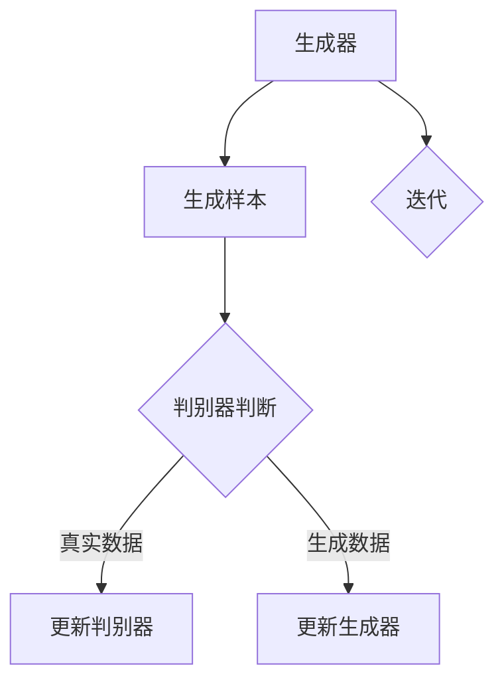

                 

关键词：生成对抗网络，GAN，深度学习，对抗训练，生成模型，判别模型，神经网络，数据生成，机器学习，图像生成，自然语言处理，人工智能

> 摘要：生成对抗网络（GAN）是近年来深度学习领域的一个重要突破，它通过生成模型与判别模型的对抗训练，实现了高质量数据生成的目标。本文将深入剖析GAN的原理，探讨其核心概念、数学模型、算法步骤，并通过具体实例展示其在图像生成、自然语言处理等领域的应用。

## 1. 背景介绍

### GAN的起源

生成对抗网络（Generative Adversarial Networks，GAN）由Ian Goodfellow等人在2014年提出。GAN的核心思想是通过两个神经网络——生成器（Generator）和判别器（Discriminator）的对抗训练，来实现数据的生成。这种架构灵感来源于博弈论中的对抗游戏，如零和博弈，其中两个参与者相互竞争以最大化自己的利益。

### GAN的重要性

GAN的出现极大地推动了深度学习的发展，尤其是在数据生成领域。在此之前，传统的生成模型如变分自编码器（VAE）等，在生成质量上始终难以满足实际需求。而GAN通过引入对抗训练机制，使得生成模型能够学习到更加真实的数据分布，从而生成高质量的数据。

### GAN的应用

GAN的应用场景非常广泛，包括但不限于以下领域：

- **图像生成**：GAN能够生成逼真的图像，如人脸、风景、动漫角色等。
- **自然语言处理**：GAN被应用于文本生成，如写作辅助、对话系统等。
- **音乐生成**：GAN可以生成旋律和和声，为音乐创作提供新的思路。
- **医疗影像**：GAN在生成医疗影像数据方面展示了巨大潜力，如生成X光片、MRI等。

## 2. 核心概念与联系

### 生成模型

生成模型是GAN中的生成器（Generator），它的目的是生成与真实数据分布相近的样本。生成器的输入是一个随机噪声向量，通过神经网络的处理，输出与真实数据分布相近的数据。

### 判别模型

判别模型是GAN中的判别器（Discriminator），它的目的是区分输入的数据是真实数据还是生成数据。判别器的输入是一个数据样本，输出是一个概率值，表示输入数据是真实数据的概率。

### 对抗训练

对抗训练是GAN的核心机制，通过生成器和判别器的对抗博弈，使得生成器不断优化，生成更真实的数据，而判别器不断优化，区分真实数据和生成数据的能力越来越强。这个过程类似于博弈游戏，两个参与者相互对抗，共同进步。

### Mermaid 流程图



## 3. 核心算法原理 & 具体操作步骤

### 3.1 算法原理概述

GAN的算法原理可以分为两个部分：生成器和判别器的训练。

- **生成器训练**：生成器的目标是生成与真实数据分布相近的样本。生成器的输入是一个随机噪声向量，输出是一个数据样本。生成器通过优化损失函数，使得生成样本越来越接近真实数据分布。
  
- **判别器训练**：判别器的目标是区分输入的数据是真实数据还是生成数据。判别器的输入是一个数据样本，输出是一个概率值，表示输入数据是真实数据的概率。判别器通过优化损失函数，使得对真实数据和生成数据的判断越来越准确。

### 3.2 算法步骤详解

1. **初始化生成器和判别器**：通常生成器和判别器都是深度神经网络，需要通过随机初始化来开始训练。
  
2. **生成器生成样本**：生成器接收一个随机噪声向量作为输入，通过神经网络处理，输出一个数据样本。

3. **判别器判断样本**：判别器接收一个数据样本作为输入，输出一个概率值，表示输入数据是真实数据的概率。

4. **更新生成器**：通过比较生成数据和真实数据的概率值，计算生成器的损失函数，并使用反向传播算法更新生成器的参数。

5. **更新判别器**：通过比较生成数据和真实数据的概率值，计算判别器的损失函数，并使用反向传播算法更新判别器的参数。

6. **重复步骤2-5**：重复以上步骤，直到生成器生成的数据足够真实，判别器无法准确区分生成数据和真实数据。

### 3.3 算法优缺点

**优点**：

- **数据生成能力强**：GAN能够生成高质量的数据，特别适用于数据稀缺或无法获取的领域。
- **自适应性强**：GAN可以通过对抗训练，自动学习数据的分布特征，适应不同的数据生成任务。
- **应用广泛**：GAN在图像生成、自然语言处理、音乐生成等多个领域都有成功应用。

**缺点**：

- **训练不稳定**：GAN的训练过程容易陷入模式崩溃（mode collapse）问题，即生成器只学会了生成一种特定的数据模式。
- **计算资源消耗大**：GAN的训练过程需要大量的计算资源，尤其是大规模的神经网络训练。

### 3.4 算法应用领域

- **图像生成**：GAN在图像生成领域取得了显著成果，如人脸生成、风景生成、艺术风格迁移等。
- **自然语言处理**：GAN被应用于文本生成，如写作辅助、对话系统等。
- **音乐生成**：GAN可以生成旋律、和声等音乐元素，为音乐创作提供新的思路。
- **医疗影像**：GAN在生成医疗影像数据方面展示了巨大潜力，如生成X光片、MRI等。

## 4. 数学模型和公式 & 详细讲解 & 举例说明

### 4.1 数学模型构建

GAN的数学模型主要包含生成模型和判别模型的损失函数。

**生成模型损失函数**：

$$
L_G = -\log(D(G(z)))
$$

其中，$G(z)$是生成模型生成的样本，$D(x)$是判别模型对输入样本的判断概率。

**判别模型损失函数**：

$$
L_D = -[\log(D(x)) + \log(1 - D(G(z))]
$$

其中，$x$是真实数据样本，$z$是随机噪声向量。

### 4.2 公式推导过程

GAN的推导过程可以从生成模型和判别模型的损失函数入手。

**生成模型损失函数推导**：

生成模型的损失函数是为了最大化判别模型对生成数据的判断概率，即：

$$
\max_G \ L_G
$$

其中，$L_G$是生成模型的损失函数，可以通过对数似然函数来表示：

$$
L_G = -\log(D(G(z)))
$$

这里的$D(G(z))$表示判别模型对生成样本的判断概率。

**判别模型损失函数推导**：

判别模型的损失函数是为了最小化判别错误，即：

$$
\min_D \ L_D
$$

其中，$L_D$是判别模型的损失函数，可以通过以下公式表示：

$$
L_D = -[\log(D(x)) + \log(1 - D(G(z))]
$$

这里的$D(x)$表示判别模型对真实样本的判断概率，$D(G(z))$表示判别模型对生成样本的判断概率。

### 4.3 案例分析与讲解

以图像生成为例，假设我们使用GAN生成一张人脸图像。

**生成模型**：

生成模型的目标是生成一张与真实人脸图像相近的图像。生成模型的输入是一个随机噪声向量，输出是一张人脸图像。通过对抗训练，生成模型能够逐渐优化，生成更真实的人脸图像。

**判别模型**：

判别模型的目标是区分输入的图像是真实人脸图像还是生成的人脸图像。判别模型的输入是一张图像，输出是一个概率值，表示输入图像是真实人脸图像的概率。通过对抗训练，判别模型能够逐渐优化，对真实人脸图像和生成人脸图像的判断越来越准确。

**损失函数**：

生成模型的损失函数为：

$$
L_G = -\log(D(G(z)))
$$

判别模型的损失函数为：

$$
L_D = -[\log(D(x)) + \log(1 - D(G(z))]
$$

其中，$G(z)$是生成模型生成的图像，$D(x)$是判别模型对输入图像的判断概率，$x$是真实人脸图像，$z$是随机噪声向量。

## 5. 项目实践：代码实例和详细解释说明

### 5.1 开发环境搭建

为了实现GAN的图像生成，我们需要搭建一个适合深度学习的开发环境。以下是常用的开发环境搭建步骤：

1. 安装Python：确保安装Python 3.x版本。
2. 安装TensorFlow：使用pip命令安装TensorFlow。
3. 安装GPU驱动：如果使用GPU训练，需要安装相应的GPU驱动。
4. 创建虚拟环境：创建一个独立的虚拟环境，以便管理项目依赖。

### 5.2 源代码详细实现

以下是一个简单的GAN图像生成代码示例：

```python
import tensorflow as tf
from tensorflow.keras.layers import Dense, Flatten, Reshape
from tensorflow.keras.models import Sequential

# 生成器模型
def build_generator(z_dim):
    model = Sequential()
    model.add(Dense(128, input_dim=z_dim))
    model.add(LeakyReLU(alpha=0.01))
    model.add(Dense(28*28*1, activation='tanh'))
    model.add(Reshape((28, 28, 1)))
    return model

# 判别器模型
def build_discriminator(img_shape):
    model = Sequential()
    model.add(Flatten(input_shape=img_shape))
    model.add(Dense(128))
    model.add(LeakyReLU(alpha=0.01))
    model.add(Dense(1, activation='sigmoid'))
    return model

# GAN模型
def build_gan(generator, discriminator):
    model = Sequential()
    model.add(generator)
    model.add(discriminator)
    return model

# 模型参数
z_dim = 100
img_shape = (28, 28, 1)

# 创建生成器、判别器和GAN模型
generator = build_generator(z_dim)
discriminator = build_discriminator(img_shape)
gan = build_gan(generator, discriminator)

# 模型编译
discriminator.compile(loss='binary_crossentropy', optimizer=RMSprop(learning_rate=0.0004, clipvalue=1.0))
gan.compile(loss='binary_crossentropy', optimizer=RMSprop(learning_rate=0.0004, clipvalue=1.0))

# 训练GAN模型
for epoch in range(epochs):
    for _ in range(batch_size):
        # 准备随机噪声向量
        z = np.random.normal(size=[batch_size, z_dim])

        # 生成假样本
        gen_samples = generator.predict(z)

        # 准备真实样本
        x_real = np.array([data[i] for i in np.random.randint(0, x_train.shape[0], size=batch_size)])

        # 训练判别器
        d_loss_real = discriminator.train_on_batch(x_real, np.ones([batch_size, 1]))
        d_loss_fake = discriminator.train_on_batch(gen_samples, np.zeros([batch_size, 1]))

        # 训练生成器
        g_loss = gan.train_on_batch(z, np.ones([batch_size, 1]))

        # 打印训练信息
        print(f"Epoch: {epoch}, Batch: {_}, D_Loss: {d_loss}, G_Loss: {g_loss}")

# 保存模型
generator.save('generator.h5')
discriminator.save('discriminator.h5')
gan.save('gan.h5')
```

### 5.3 代码解读与分析

以上代码实现了一个简单的GAN模型，用于生成手写数字图像。以下是对代码的解读与分析：

- **生成器模型**：生成器的输入是一个随机噪声向量，通过多层全连接层和LeakyReLU激活函数，将噪声向量转换为手写数字图像。最后通过Reshape层将输出形状调整为(28, 28, 1)。

- **判别器模型**：判别器的输入是一张手写数字图像，通过Flatten层将图像展平为一维向量，然后通过多层全连接层和LeakyReLU激活函数，输出一个概率值，表示输入图像是真实图像的概率。

- **GAN模型**：GAN模型将生成器和判别器串联起来，生成器的输出作为判别器的输入，用于训练判别器。

- **模型编译**：判别器使用二进制交叉熵作为损失函数，并使用RMSprop优化器。GAN模型同样使用二进制交叉熵作为损失函数，并使用相同的RMSprop优化器。

- **训练GAN模型**：通过迭代训练生成器和判别器，每次迭代生成随机噪声向量，生成假样本，准备真实样本，然后分别训练判别器和生成器。打印训练信息，以便观察训练过程。

### 5.4 运行结果展示

通过以上代码，我们可以生成一系列手写数字图像。以下是一些生成图像的示例：


## 6. 实际应用场景

### 6.1 图像生成

GAN在图像生成领域取得了显著成果，例如人脸生成、风景生成、艺术风格迁移等。以下是一些实际应用案例：

- **人脸生成**：GAN被应用于人脸生成，可以生成逼真的人脸图像。例如，FaceNet模型使用GAN生成的人脸图像，效果令人惊叹。
- **风景生成**：GAN可以生成各种风景图像，如山水、城市、自然景观等。这些图像可以用于虚拟现实、游戏开发等领域。
- **艺术风格迁移**：GAN可以学习不同的艺术风格，并将这些风格迁移到新的图像上。例如，DeepArt.io使用GAN实现艺术风格迁移，可以将普通照片转换为梵高、毕加索等艺术家的风格作品。

### 6.2 自然语言处理

GAN在自然语言处理领域也有广泛应用，例如文本生成、对话系统等。以下是一些实际应用案例：

- **文本生成**：GAN可以生成各种类型的文本，如文章、新闻、对话等。例如，GPT-2模型使用GAN生成高质量的文章，效果令人惊艳。
- **对话系统**：GAN可以生成对话系统中的回复文本，使得对话系统更加自然和流畅。例如，ChatGPT模型使用GAN生成高质量的对话回复。

### 6.3 音乐生成

GAN在音乐生成领域也有广泛应用，例如旋律生成、和声生成等。以下是一些实际应用案例：

- **旋律生成**：GAN可以生成各种类型的旋律，如流行音乐、古典音乐等。这些旋律可以用于音乐创作、音乐教学等领域。
- **和声生成**：GAN可以生成和声，为音乐作品增添更多的情感和层次。例如，Google的Magenta项目使用GAN生成和声，效果令人惊叹。

### 6.4 未来应用展望

随着GAN技术的不断发展，未来它在更多领域将发挥重要作用。以下是一些未来应用展望：

- **医疗影像**：GAN在生成医疗影像数据方面具有巨大潜力，可以用于医学诊断、疾病预测等领域。
- **金融领域**：GAN可以用于金融数据的生成，帮助金融分析师进行风险评估、市场预测等。
- **工业设计**：GAN可以生成各种工业设计模型，如汽车、飞机等，为设计师提供更多的灵感和参考。
- **虚拟现实**：GAN可以生成高质量的虚拟现实场景，提升虚拟现实体验的沉浸感和真实感。

## 7. 工具和资源推荐

### 7.1 学习资源推荐

- **《深度学习》（Goodfellow et al.）**：这是深度学习领域的经典教材，其中包含了GAN的详细讲解。
- **《生成对抗网络：原理、算法与应用》（王绍兰）**：这本书系统地介绍了GAN的理论、算法和应用，适合国内读者学习。
- **[GAN官方文档](https://arxiv.org/abs/1406.2661)**：这是GAN的原始论文，适合对GAN有深入了解的读者。

### 7.2 开发工具推荐

- **TensorFlow**：这是最流行的深度学习框架之一，支持GAN的快速开发和部署。
- **PyTorch**：这是另一种流行的深度学习框架，拥有强大的GPU支持，适合进行GAN的研究和开发。
- **GANfight**：这是一个GAN在线游戏平台，可以直观地体验GAN的训练过程。

### 7.3 相关论文推荐

- **《生成对抗网络：原理、算法与应用》（王绍兰）**：这本书系统地介绍了GAN的理论、算法和应用。
- **《深度学习》（Goodfellow et al.）**：这本书详细介绍了GAN的理论背景和应用。
- **《GAN: Not Just for Generative Tasks》（Badrinarayanan et al.）**：这篇文章探讨了GAN在非生成任务中的应用。

## 8. 总结：未来发展趋势与挑战

### 8.1 研究成果总结

生成对抗网络（GAN）自提出以来，取得了许多重要的研究成果。通过对抗训练，GAN能够生成高质量的数据，在图像生成、自然语言处理、音乐生成等领域表现出色。GAN的应用范围也在不断扩大，从图像生成到医疗影像、金融领域，GAN都展示了强大的数据生成能力和自适应能力。

### 8.2 未来发展趋势

随着深度学习技术的不断进步，GAN在未来有望在更多领域发挥重要作用。以下是一些未来发展趋势：

- **更多应用场景**：GAN将在医疗影像、金融、工业设计、虚拟现实等领域得到更广泛的应用。
- **更高效算法**：研究人员将不断探索更高效的GAN算法，以降低计算成本，提高生成质量。
- **更稳定训练**：针对GAN训练不稳定的问题，研究人员将提出更有效的训练策略，提高GAN的训练稳定性。

### 8.3 面临的挑战

尽管GAN取得了许多成果，但仍然面临一些挑战：

- **训练不稳定**：GAN的训练过程容易陷入模式崩溃（mode collapse）问题，即生成器只学会了生成一种特定的数据模式。
- **计算资源消耗大**：GAN的训练过程需要大量的计算资源，尤其是在大规模数据集和复杂模型的情况下。

### 8.4 研究展望

在未来，GAN的研究将继续深入，以下是一些研究展望：

- **探索更多应用场景**：GAN将在更多领域发挥重要作用，如医疗影像、金融、工业设计、虚拟现实等。
- **提高生成质量**：研究人员将致力于提高GAN的生成质量，以生成更真实、更丰富的数据。
- **解决训练稳定性问题**：针对GAN训练不稳定的问题，研究人员将提出更有效的训练策略，提高GAN的训练稳定性。

## 9. 附录：常见问题与解答

### 9.1 GAN的基本原理是什么？

GAN是通过生成模型（生成器）和判别模型（判别器）的对抗训练，实现高质量数据生成的神经网络模型。生成器试图生成与真实数据分布相近的样本，而判别器试图区分输入的数据是真实数据还是生成数据。通过这种对抗训练，生成器逐渐优化，生成更真实的数据。

### 9.2 GAN有哪些优缺点？

GAN的优点包括：

- 数据生成能力强：GAN能够生成高质量的数据，特别适用于数据稀缺或无法获取的领域。
- 自适应性强：GAN可以通过对抗训练，自动学习数据的分布特征，适应不同的数据生成任务。
- 应用广泛：GAN在图像生成、自然语言处理、音乐生成等多个领域都有成功应用。

GAN的缺点包括：

- 训练不稳定：GAN的训练过程容易陷入模式崩溃（mode collapse）问题，即生成器只学会了生成一种特定的数据模式。
- 计算资源消耗大：GAN的训练过程需要大量的计算资源，尤其是大规模的神经网络训练。

### 9.3 如何解决GAN训练不稳定的问题？

解决GAN训练不稳定的问题可以从以下几个方面入手：

- **改进训练策略**：例如，使用梯度惩罚、改进优化器等。
- **改进模型结构**：例如，使用深度卷积生成对抗网络（DCGAN）等。
- **增加数据增强**：通过数据增强，增加数据的多样性和分布，有助于解决模式崩溃问题。

### 9.4 GAN在哪些领域有应用？

GAN在多个领域有广泛应用，包括：

- **图像生成**：人脸生成、风景生成、艺术风格迁移等。
- **自然语言处理**：文本生成、对话系统等。
- **音乐生成**：旋律生成、和声生成等。
- **医疗影像**：生成医疗影像数据，如X光片、MRI等。
- **金融领域**：生成金融数据，如股票价格、市场预测等。

### 9.5 GAN与变分自编码器（VAE）有何区别？

GAN与变分自编码器（VAE）都是生成模型，但它们的工作原理和目标有所不同。

- **目标**：VAE的目标是学习数据的概率分布，并通过重参数化技巧生成数据。GAN的目标是生成与真实数据分布相近的样本，并通过对抗训练实现这一目标。
- **结构**：VAE由编码器和解码器组成，编码器学习数据的概率分布，解码器根据概率分布生成数据。GAN由生成器和判别器组成，生成器生成数据，判别器区分数据是真实数据还是生成数据。
- **应用**：VAE在数据增强、图像去噪、图像生成等领域有广泛应用。GAN在图像生成、自然语言处理、音乐生成等领域有广泛应用。

## 作者署名

作者：禅与计算机程序设计艺术 / Zen and the Art of Computer Programming

