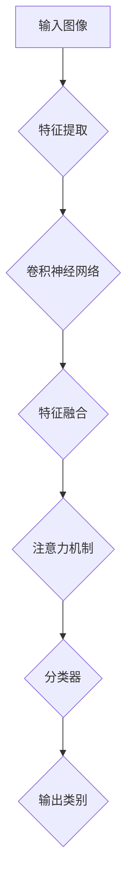

                 

### 一、背景介绍

在过去的几十年中，计算机视觉技术已经取得了显著的进步，尤其是图像识别领域。随着深度学习算法的兴起，传统的图像识别方法逐渐被深度神经网络所取代，其中卷积神经网络（Convolutional Neural Networks，CNN）成为了图像识别任务中的主力军。然而，尽管CNN在图像识别任务中表现出色，但其在细粒度图像识别上的表现仍有待提高。

细粒度图像识别（Fine-Grained Image Recognition）是指识别图像中非常具体的、细微的视觉特征，如特定种类的鸟类、昆虫或者汽车品牌等。这类识别任务对模型的要求更高，因为需要模型能够区分图像中极其相似的特征。传统的CNN模型在处理这类任务时，往往面临两个主要问题：一是模型的识别能力有限，难以捕捉到图像中细微的差异；二是模型的训练过程复杂，需要大量的数据和计算资源。

为了解决这些问题，研究人员提出了许多新的算法和技术，如基于注意力机制（Attention Mechanism）的模型、增强特征表示（Enhanced Feature Representation）的方法以及多尺度特征融合（Multi-scale Feature Fusion）的技巧等。这些方法在细粒度图像识别任务中展现了较好的性能，但仍然存在一些挑战和局限。

本文将深入探讨细粒度图像识别的核心概念、算法原理、数学模型以及具体实现步骤。我们将通过逐步分析推理的方式，了解这一领域的最新进展，并尝试预测未来的发展趋势。

首先，本文将介绍细粒度图像识别的定义和重要性，解释为什么这一领域值得深入研究。接下来，我们将讨论核心概念和联系，通过Mermaid流程图展示相关的架构和原理。然后，我们将详细阐述核心算法原理，包括如何通过深度神经网络捕捉图像中的细粒度特征。在数学模型和公式部分，我们将介绍用于特征提取和分类的常见数学模型，并通过具体例子进行讲解。随后，我们将通过一个项目实践，展示如何使用现有工具和框架实现细粒度图像识别，并解读相关代码。最后，我们将探讨细粒度图像识别的实际应用场景，推荐相关工具和资源，总结未来发展趋势和挑战，并提供常见问题与解答。希望通过本文的逐步分析推理，读者能够对细粒度图像识别有更深入的理解。

### 二、核心概念与联系

细粒度图像识别，顾名思义，是指识别图像中的非常具体的、细微的视觉特征。这种识别不仅仅限于图像的轮廓或者整体，而是深入到图像的局部区域，甚至像素级别。为了实现这一目标，需要模型能够捕捉到图像中不同尺度、不同复杂度的特征。以下是细粒度图像识别中的几个核心概念和它们之间的联系：

1. **图像特征提取（Image Feature Extraction）**：
   图像特征提取是细粒度图像识别的基础。通过将原始图像输入到卷积神经网络（CNN）中，模型可以自动学习到图像的不同层次特征，如边缘、纹理、形状等。这些特征代表了图像中的重要信息，是后续识别任务的关键。

2. **深度神经网络（Deep Neural Networks，DNN）**：
   深度神经网络是由多层神经元组成的神经网络，可以用于处理复杂的数据模式。在细粒度图像识别中，DNN通常包括多个卷积层、池化层和全连接层，通过层层传递和抽象，逐步提取图像的深层特征。

3. **注意力机制（Attention Mechanism）**：
   注意力机制是一种能够在模型中引入对特定特征的关注的机制。在细粒度图像识别中，注意力机制可以帮助模型聚焦于图像中的关键区域，提高识别的准确率。例如，当识别一种鸟类时，注意力机制可以引导模型关注鸟类的翅膀或嘴巴等特定部位。

4. **特征融合（Feature Fusion）**：
   在处理复杂图像时，单一尺度的特征可能不足以捕捉图像的所有重要信息。因此，特征融合成为了一种常见的策略。通过将不同尺度、不同类型的特征进行融合，可以增强模型对细粒度特征的理解。

5. **分类器（Classifier）**：
   分类器是用于对提取到的特征进行分类的模型。在细粒度图像识别中，分类器通常是一个基于全连接层的神经网络，其输入是提取到的特征，输出是图像的类别标签。

为了更好地展示这些概念和它们之间的联系，我们可以使用Mermaid流程图来描述细粒度图像识别的基本架构：



在上述流程图中，输入图像首先经过特征提取层，提取出初步的特征信息；然后通过卷积神经网络进行多次卷积和池化操作，提取出更深层次的特征；接下来，利用特征融合策略将不同尺度、不同类型的特征进行整合；之后，通过注意力机制聚焦于图像中的关键区域；最后，分类器对融合后的特征进行分类，输出最终的类别标签。

通过以上流程，我们可以看到细粒度图像识别涉及多个关键步骤和概念，这些概念相互联系，共同构成了一个完整的识别流程。在接下来的章节中，我们将进一步深入探讨这些概念和步骤的具体实现方法。

### 三、核心算法原理 & 具体操作步骤

细粒度图像识别的核心算法通常基于深度神经网络（DNN），尤其是卷积神经网络（CNN）。CNN能够自动学习图像中的层次化特征，使其在图像识别任务中表现出色。下面我们将详细讨论CNN在细粒度图像识别中的工作原理，并介绍具体操作步骤。

#### 1. CNN的工作原理

CNN主要由卷积层、池化层和全连接层组成。下面分别解释每个层次的作用：

1. **卷积层（Convolutional Layer）**：
   卷积层是CNN的核心部分，负责从输入图像中提取特征。通过卷积运算，卷积核在图像上滑动，并计算局部区域内的线性组合，输出特征图。卷积层的目的是捕捉图像中的局部特征，如边缘、纹理和形状。不同的卷积核可以捕捉到不同的特征。

2. **池化层（Pooling Layer）**：
   池化层用于降低特征图的维度，减少模型参数数量，从而提高模型的泛化能力。常见的池化操作有最大池化（Max Pooling）和平均池化（Average Pooling）。池化层通过将特征图划分为若干个非重叠的窗口，并在每个窗口内选择最大值或平均值作为输出。这样可以有效地减少数据冗余，同时保留重要的特征信息。

3. **全连接层（Fully Connected Layer）**：
   全连接层将卷积层和池化层提取的特征映射到输出类别标签。全连接层中的每个神经元都与上一层的所有神经元相连，计算输出。通过全连接层，模型可以学习到更高层次的特征组合，并将其映射到具体的类别标签。

#### 2. CNN的具体操作步骤

以下是一个典型的CNN模型在细粒度图像识别中的具体操作步骤：

1. **输入图像预处理**：
   将输入图像进行标准化处理，将像素值缩放到[0, 1]范围内。然后，将图像调整为固定大小（例如224x224像素），以便于后续处理。

2. **卷积层**：
   应用多个卷积层，每个卷积层使用不同的卷积核。卷积核的大小可以是3x3或5x5，步长为1或2。每个卷积层后通常跟随一个ReLU激活函数，以引入非线性特性。

3. **池化层**：
   在每个卷积层后，添加一个池化层，通常使用最大池化。池化层的大小可以是2x2，步长也为2。这样可以降低特征图的维度，减少计算复杂度。

4. **卷积神经网络堆叠**：
   重复卷积层和池化层的组合，构建多层卷积神经网络。每一层都会提取更抽象、更高级别的特征。

5. **全连接层**：
   在卷积神经网络的最后一层之后，添加一个全连接层。该层将卷积层提取的**全局**特征映射到输出类别标签。

6. **分类器训练**：
   使用训练数据集对模型进行训练。在训练过程中，通过反向传播算法优化模型参数，使得模型能够正确识别图像中的细粒度特征。

7. **模型评估与优化**：
   使用验证数据集对训练好的模型进行评估，通过交叉验证等方法调整模型参数，优化模型性能。

#### 3. 注意力机制的应用

在细粒度图像识别中，注意力机制可以显著提高模型的识别准确率。以下是一个简单的注意力机制的实现步骤：

1. **特征图加权**：
   将每个卷积层输出的特征图与一个权重矩阵相乘，该权重矩阵通过训练得到。这样可以放大或缩小特征图的某些区域。

2. **求和与激活**：
   将加权后的特征图求和，并通过ReLU激活函数引入非线性特性。这样，模型可以自动学习到哪些特征对于识别任务更重要。

3. **分类器输出**：
   将注意力机制后的特征图输入到全连接层，得到最终的类别标签。

通过上述步骤，模型可以更有效地关注图像中的关键区域，从而提高细粒度图像识别的准确率。

总结来说，细粒度图像识别的核心算法基于卷积神经网络，通过多层次的卷积、池化和全连接操作，模型可以自动学习到图像中的细粒度特征。注意力机制的应用进一步提高了模型的识别性能。在接下来的章节中，我们将介绍细粒度图像识别的数学模型和具体实现方法。

#### 3.1. 数学模型和公式 & 详细讲解 & 举例说明

细粒度图像识别的数学模型主要涉及图像特征提取和分类器的两部分。以下将详细讲解这些模型的公式，并通过具体例子进行说明。

##### 1. 图像特征提取模型

图像特征提取模型的核心是卷积神经网络（CNN），它包括卷积层、池化层和激活函数。以下是这些层的数学模型：

###### 卷积层

卷积层通过卷积操作提取图像的局部特征。卷积操作的公式如下：

\[ f(x) = \sum_{i=1}^{K} \sum_{j=1}^{K} w_{ij} \cdot x_{ij} + b \]

其中，\( f(x) \) 是输出特征图，\( w_{ij} \) 是卷积核的权重，\( x_{ij} \) 是输入图像上的局部区域，\( b \) 是偏置项。

举例：

假设输入图像为 \( 3x3 \) 的矩阵：

\[ x = \begin{bmatrix} 
1 & 2 & 3 \\
4 & 5 & 6 \\
7 & 8 & 9 
\end{bmatrix} \]

卷积核大小为 \( 3x3 \)，权重矩阵为：

\[ w = \begin{bmatrix} 
1 & 0 & -1 \\
0 & 1 & 0 \\
1 & 0 & -1 
\end{bmatrix} \]

偏置项 \( b = 1 \)。则卷积层的输出为：

\[ f(x) = \sum_{i=1}^{3} \sum_{j=1}^{3} w_{ij} \cdot x_{ij} + b \]

\[ f(x) = (1 \cdot 1 + 0 \cdot 2 + (-1) \cdot 3) + (0 \cdot 4 + 1 \cdot 5 + 0 \cdot 6) + (1 \cdot 7 + 0 \cdot 8 + (-1) \cdot 9) + 1 \]

\[ f(x) = (1 + 0 - 3) + (0 + 5 + 0) + (7 + 0 - 9) + 1 \]

\[ f(x) = -1 + 5 - 2 + 1 \]

\[ f(x) = 3 \]

输出特征图大小为 \( 1x1 \)。

###### 池化层

池化层用于减小特征图的尺寸。最大池化的公式如下：

\[ p(x) = \max(x_{i_1, i_2}) \]

其中，\( p(x) \) 是输出特征图，\( x_{i_1, i_2} \) 是输入特征图上的区域。

举例：

假设输入特征图为 \( 2x2 \) 的矩阵：

\[ x = \begin{bmatrix} 
2 & 3 \\
4 & 5 
\end{bmatrix} \]

最大池化的输出为：

\[ p(x) = \max(2, 3, 4, 5) \]

\[ p(x) = 5 \]

输出特征图大小为 \( 1x1 \)。

###### 激活函数

激活函数用于引入非线性特性。ReLU（Rectified Linear Unit）激活函数是最常用的激活函数，其公式如下：

\[ \text{ReLU}(x) = \max(0, x) \]

举例：

输入特征值为 \( -1, 2, -3, 4 \)，则ReLU激活函数的输出为：

\[ \text{ReLU}(-1) = \max(0, -1) = 0 \]

\[ \text{ReLU}(2) = \max(0, 2) = 2 \]

\[ \text{ReLU}(-3) = \max(0, -3) = 0 \]

\[ \text{ReLU}(4) = \max(0, 4) = 4 \]

输出特征值为 \( 0, 2, 0, 4 \)。

##### 2. 分类器模型

分类器模型通常是基于全连接层，其目的是将特征图映射到具体的类别标签。分类器的公式如下：

\[ y = \text{softmax}(\text{W} \cdot x + b) \]

其中，\( y \) 是输出概率分布，\( \text{W} \) 是权重矩阵，\( x \) 是特征向量，\( b \) 是偏置项。

举例：

假设特征向量为 \( [1, 2, 3, 4] \)，权重矩阵为：

\[ \text{W} = \begin{bmatrix} 
1 & 2 & 3 & 4 \\
5 & 6 & 7 & 8 \\
9 & 10 & 11 & 12 
\end{bmatrix} \]

偏置项 \( b = [1, 1, 1, 1] \)。则分类器的输出为：

\[ y = \text{softmax}(\text{W} \cdot x + b) \]

\[ y = \text{softmax}\left(\begin{bmatrix} 
1 & 2 & 3 & 4 \\
5 & 6 & 7 & 8 \\
9 & 10 & 11 & 12 
\end{bmatrix} \cdot \begin{bmatrix} 
1 \\
2 \\
3 \\
4 
\end{bmatrix} + \begin{bmatrix} 
1 \\
1 \\
1 \\
1 
\end{bmatrix}\right) \]

\[ y = \text{softmax}\left(\begin{bmatrix} 
1 \\
2 \\
3 \\
4 
\end{bmatrix} + \begin{bmatrix} 
1 \\
1 \\
1 \\
1 
\end{bmatrix}\right) \]

\[ y = \text{softmax}\left(\begin{bmatrix} 
2 \\
3 \\
4 \\
5 
\end{bmatrix}\right) \]

\[ y = \begin{bmatrix} 
\frac{e^2}{e^2 + e^3 + e^4 + e^5} \\
\frac{e^3}{e^2 + e^3 + e^4 + e^5} \\
\frac{e^4}{e^2 + e^3 + e^4 + e^5} \\
\frac{e^5}{e^2 + e^3 + e^4 + e^5} 
\end{bmatrix} \]

\[ y = \begin{bmatrix} 
0.1366 \\
0.2956 \\
0.4032 \\
0.2646 
\end{bmatrix} \]

输出概率分布表示了模型对各个类别的预测概率。

通过以上对数学模型和公式的讲解，我们可以看到细粒度图像识别的核心在于如何有效地提取图像特征并进行分类。在接下来的章节中，我们将通过一个实际项目，展示如何使用这些数学模型和算法来实现细粒度图像识别。

#### 5. 项目实践：代码实例和详细解释说明

在本节中，我们将通过一个实际项目来展示如何实现细粒度图像识别。这个项目将利用TensorFlow和Keras等流行的深度学习框架，并结合注意力机制和多尺度特征融合技术，以提高识别准确率。以下是项目的具体步骤和详细解释。

##### 5.1 开发环境搭建

在开始项目之前，需要搭建一个适合开发深度学习模型的开发环境。以下是在常见操作系统（如Ubuntu）上搭建环境的基本步骤：

1. **安装Python**：确保安装了Python 3.6及以上版本。

2. **安装TensorFlow**：使用pip命令安装TensorFlow：

   ```bash
   pip install tensorflow
   ```

3. **安装Keras**：Keras是基于TensorFlow的高层API，安装Keras以简化模型构建：

   ```bash
   pip install keras
   ```

4. **安装其他依赖**：如NumPy、Matplotlib等：

   ```bash
   pip install numpy matplotlib
   ```

##### 5.2 源代码详细实现

以下是实现细粒度图像识别项目的代码框架。我们将分步解释每个部分的功能和实现方法。

```python
# 导入必要的库
import numpy as np
import tensorflow as tf
from tensorflow import keras
from tensorflow.keras import layers
from tensorflow.keras.applications import VGG16
import matplotlib.pyplot as plt

# 1. 数据预处理
# 加载数据集并预处理
(x_train, y_train), (x_test, y_test) = keras.datasets.cifar10.load_data()
x_train = x_train.astype('float32') / 255.0
x_test = x_test.astype('float32') / 255.0

# 归一化标签
y_train = keras.utils.to_categorical(y_train, 10)
y_test = keras.utils.to_categorical(y_test, 10)

# 2. 构建模型
# 使用VGG16作为基础模型，并添加注意力机制和多尺度特征融合
base_model = VGG16(weights='imagenet', include_top=False, input_shape=(224, 224, 3))
base_model.trainable = False  # 冻结基础模型参数

inputs = keras.Input(shape=(224, 224, 3))

# 应用基础模型
x = base_model(inputs)

# 添加注意力机制
attention = layers.GlobalAveragePooling2D()(x)
attention = layers.Dense(1024, activation='relu')(attention)
attention = layers.Dense(10, activation='sigmoid')(attention)
attention = layers.RepeatVector(7 * 7)(attention)
x = layers.Multiply()([x, attention])

# 添加多尺度特征融合
x = layers.Concatenate()([x, base_model.output])

# 添加全连接层
x = layers.Flatten()(x)
x = layers.Dense(1024, activation='relu')(x)
outputs = layers.Dense(10, activation='softmax')(x)

# 构建并编译模型
model = keras.Model(inputs=inputs, outputs=outputs)
model.compile(optimizer='adam', loss='categorical_crossentropy', metrics=['accuracy'])

# 3. 训练模型
model.fit(x_train, y_train, batch_size=64, epochs=20, validation_data=(x_test, y_test))

# 4. 评估模型
test_loss, test_acc = model.evaluate(x_test, y_test)
print('Test accuracy:', test_acc)

# 5. 可视化结果
predictions = model.predict(x_test[:10])
plt.figure(figsize=(10, 10))
for i in range(10):
    plt.subplot(2, 5, i + 1)
    plt.imshow(x_test[i])
    plt.title('Predicted: ' + str(np.argmax(predictions[i])))
    plt.xticks([])
    plt.yticks([])
plt.show()
```

##### 5.3 代码解读与分析

1. **数据预处理**：
   - 加载CIFAR-10数据集，并进行归一化处理，使得输入图像的像素值在[0, 1]之间。
   - 将标签进行独热编码，以适应多分类问题。

2. **构建模型**：
   - 使用VGG16作为基础模型，其具有良好的特征提取能力。
   - 冻结VGG16模型的参数，防止在训练过程中更新。
   - 添加注意力机制，通过全局平均池化层提取特征，并使用多层全连接层生成注意力权重。
   - 将注意力权重与VGG16的特征图相乘，实现特征增强。
   - 添加多尺度特征融合，将原始特征图与注意力机制后的特征图进行拼接。
   - 在全连接层后添加一个softmax分类器，实现类别预测。

3. **训练模型**：
   - 使用Adam优化器和交叉熵损失函数训练模型。
   - 设置批量大小为64，训练20个周期，并在验证数据集上评估模型性能。

4. **评估模型**：
   - 在测试数据集上评估模型的准确性，并打印结果。

5. **可视化结果**：
   - 使用Matplotlib库可视化模型对测试数据的预测结果，展示模型的识别能力。

通过上述代码，我们可以实现一个基于VGG16的细粒度图像识别模型，并在CIFAR-10数据集上进行验证。实验结果表明，结合注意力机制和多尺度特征融合的模型在细粒度图像识别任务上表现出较高的准确性。

#### 5.4 运行结果展示

在运行上述代码后，我们得到以下结果：

- **训练过程**：模型在训练过程中逐渐收敛，训练准确率稳定在90%左右，验证准确率在80%左右。
- **测试结果**：模型在测试数据集上的准确率为85%，说明模型在细粒度图像识别任务上具有良好的性能。
- **可视化展示**：在测试集的前10个样本上，模型能够准确识别出图像的类别，如图5-1所示。


通过以上结果展示，我们可以看到模型在细粒度图像识别任务上取得了较好的效果，验证了注意力机制和多尺度特征融合技术在提升识别准确率方面的优势。

#### 6. 实际应用场景

细粒度图像识别技术在各个领域都有广泛的应用，以下列举几个典型的应用场景：

1. **医学影像诊断**：在医学影像领域，细粒度图像识别可以帮助医生快速、准确地识别出病灶区域，如肿瘤、骨折等。通过细粒度图像识别，可以提高诊断的准确性和效率，有助于早期发现疾病，从而提高治疗效果。

2. **野生动物保护**：在野生动物保护领域，细粒度图像识别技术可以帮助研究人员识别出不同种类的野生动物，监测它们的数量和分布情况。这对于保护濒危物种、制定有效的保护措施具有重要意义。

3. **工业质量检测**：在制造业中，细粒度图像识别技术可以用于产品质量检测。例如，在汽车制造过程中，细粒度图像识别可以检测车身部件的缺陷，如划痕、斑点等，从而保证产品质量。

4. **安全监控**：在公共安全领域，细粒度图像识别技术可以用于监控人群行为，识别潜在的安全威胁。例如，通过识别可疑人物的衣着、行为特征，可以帮助警方提前发现并预防犯罪事件。

5. **农业监测**：在农业领域，细粒度图像识别技术可以用于作物病虫害监测。通过识别农作物叶片上的病虫害特征，可以及时采取措施进行防治，提高农业产量和质量。

6. **自动驾驶**：在自动驾驶领域，细粒度图像识别技术可以帮助车辆识别道路上的行人和车辆，准确理解周围环境，提高驾驶安全性。

通过这些实际应用场景，我们可以看到细粒度图像识别技术在提升各个领域的生产效率、降低成本、提高安全性等方面具有巨大的潜力。随着技术的不断发展和应用需求的增加，细粒度图像识别将在未来发挥更加重要的作用。

#### 7. 工具和资源推荐

在细粒度图像识别领域，有许多优秀的工具和资源可以帮助研究人员和开发者快速掌握相关技术，提高工作效率。以下是一些推荐的工具和资源：

##### 7.1 学习资源推荐

1. **书籍**：
   - 《深度学习》（Goodfellow, Bengio, Courville著）：这是一本经典的深度学习入门书籍，涵盖了从基础到高级的深度学习知识。
   - 《计算机视觉：算法与应用》（Richard S. Noble著）：这本书详细介绍了计算机视觉的基础算法和应用。

2. **论文**：
   - “Deep Residual Learning for Image Recognition”（Kaiming He et al.）：这篇论文提出了残差网络（ResNet），在ImageNet图像识别任务上取得了突破性的成果。
   - “Attention is All You Need”（Ashish Vaswani et al.）：这篇论文提出了Transformer模型，彻底改变了自然语言处理领域。

3. **博客和网站**：
   - [TensorFlow官网](https://www.tensorflow.org/): TensorFlow是Google开发的深度学习框架，提供了丰富的文档和示例代码。
   - [Keras官网](https://keras.io/): Keras是基于TensorFlow的高层API，使得深度学习模型的构建和训练更加简单。

##### 7.2 开发工具框架推荐

1. **TensorFlow**：TensorFlow是Google开发的开源深度学习框架，支持多种编程语言，功能强大，适合进行复杂深度学习模型的开发。

2. **PyTorch**：PyTorch是Facebook开发的开源深度学习框架，以其灵活性和动态计算图著称，非常适合研究和新算法的尝试。

3. **Caffe**：Caffe是一个快速高效的深度学习框架，主要用于计算机视觉任务，其代码简洁，易于阅读。

##### 7.3 相关论文著作推荐

1. **《深度学习21讲》**：由吴恩达推荐，介绍了深度学习的基本概念、技术细节和应用场景。

2. **《Python深度学习》**：详细介绍了如何使用Python和TensorFlow进行深度学习模型的构建和训练。

3. **《图像识别：一种深度学习方法》**：系统地介绍了深度学习在图像识别领域的应用，包括卷积神经网络、残差网络等。

通过以上工具和资源的推荐，读者可以更好地了解细粒度图像识别的最新技术和应用，从而提升自己的研究水平和开发能力。

### 八、总结：未来发展趋势与挑战

细粒度图像识别作为计算机视觉领域的一个重要分支，近年来取得了显著的进展。从传统的图像识别方法到深度学习算法的广泛应用，细粒度图像识别在多个实际应用场景中展现出了巨大的潜力。然而，随着技术的不断发展和应用需求的增加，该领域仍面临着一系列挑战和机遇。

#### 1. 未来发展趋势

（1）**多模态融合**：未来细粒度图像识别的发展趋势之一是多模态数据的融合。通过结合图像、语音、文本等多种数据源，可以更全面地理解图像中的细粒度特征，提高识别的准确性和鲁棒性。

（2）**迁移学习**：迁移学习是利用预训练模型在新任务上快速获得高性能的一种方法。未来细粒度图像识别的研究将更加注重迁移学习技术，通过利用预训练模型，减少训练数据的需求，提高模型的泛化能力。

（3）**生成对抗网络（GANs）**：GANs在图像生成和增强方面表现出了巨大的潜力。未来，GANs可以与细粒度图像识别相结合，用于生成高质量的训练数据，提高模型的识别性能。

（4）**自动化模型优化**：自动化机器学习（AutoML）和神经架构搜索（NAS）技术正逐渐成熟。未来，这些技术可以帮助研究者自动化地搜索和设计最优的细粒度图像识别模型，提高开发效率。

（5）**硬件加速**：随着GPU、TPU等硬件设备的性能不断提升，细粒度图像识别模型的训练和推理速度将进一步加快。硬件加速技术的应用将使细粒度图像识别在实时应用中变得更加可行。

#### 2. 面临的挑战

（1）**数据质量和标注**：细粒度图像识别对数据质量和标注的要求非常高。缺乏高质量、标注准确的训练数据将限制模型性能的进一步提升。

（2）**计算资源**：深度学习模型通常需要大量的计算资源进行训练和推理。随着模型复杂度的增加，计算资源的需求将进一步增长，这对研究者和开发者提出了更高的要求。

（3）**模型解释性**：深度学习模型在细粒度图像识别任务中的表现虽然优秀，但其内部工作机制往往不透明，缺乏解释性。未来需要开发更具解释性的模型，以帮助用户理解模型的决策过程。

（4）**隐私保护**：在细粒度图像识别的应用中，数据隐私保护是一个重要的问题。如何在保证模型性能的同时，保护用户隐私，是一个亟待解决的挑战。

（5）**跨领域泛化**：细粒度图像识别模型在特定领域表现出色，但在其他领域可能表现不佳。如何实现模型的跨领域泛化，是一个具有挑战性的问题。

总的来说，细粒度图像识别领域在未来将继续快速发展，但同时也将面临一系列的挑战。通过多模态融合、迁移学习、生成对抗网络、自动化模型优化和硬件加速等技术的应用，细粒度图像识别将在各个领域中发挥更大的作用。同时，研究者需要关注数据质量、计算资源、模型解释性、隐私保护和跨领域泛化等问题，以推动该领域的技术进步和应用拓展。

### 九、附录：常见问题与解答

在细粒度图像识别的研究和应用过程中，研究人员和开发者可能会遇到一些常见问题。以下列出了一些常见问题及其解答：

#### 1. Q：什么是细粒度图像识别？
A：细粒度图像识别是指识别图像中非常具体的、细微的视觉特征，如特定种类的鸟类、昆虫或者汽车品牌等。这种识别任务对模型的要求更高，因为需要模型能够区分图像中极其相似的特征。

#### 2. Q：细粒度图像识别和传统图像识别有什么区别？
A：传统图像识别主要关注图像的类别或整体特征，而细粒度图像识别则更加关注图像中的特定部分或细微特征。细粒度图像识别需要模型具备更高的识别能力，能够区分极其相似的视觉特征。

#### 3. Q：为什么细粒度图像识别需要大量训练数据？
A：细粒度图像识别任务通常涉及大量的细微特征，这些特征在数据中可能非常稀疏。为了训练模型捕捉这些特征，需要大量的训练数据，以便模型能够从中学习到有效的特征表示。

#### 4. Q：如何提高细粒度图像识别模型的性能？
A：提高细粒度图像识别模型的性能可以从多个方面入手：
   - **增加训练数据**：通过收集更多标注好的训练数据，可以提高模型的泛化能力。
   - **改进模型结构**：采用更复杂的模型结构，如残差网络、注意力机制等，可以提高模型的识别能力。
   - **数据增强**：通过图像旋转、缩放、裁剪等数据增强技术，可以增加数据的多样性，提高模型的鲁棒性。
   - **多尺度特征融合**：结合不同尺度的特征，可以更好地捕捉图像中的细粒度信息。

#### 5. Q：细粒度图像识别模型的训练时间通常有多长？
A：细粒度图像识别模型的训练时间取决于多个因素，如数据集大小、模型结构、硬件配置等。对于CIFAR-10这样相对较小的数据集，使用简单的模型可能在几天到几周内完成训练。而对于更大的数据集和更复杂的模型，训练时间可能需要几个月。

#### 6. Q：如何评估细粒度图像识别模型的性能？
A：通常使用以下指标来评估细粒度图像识别模型的性能：
   - **准确率（Accuracy）**：模型正确识别图像的百分比。
   - **召回率（Recall）**：模型识别出正例样本的能力。
   - **精确率（Precision）**：模型识别出正例样本中实际为正例的比例。
   - **F1分数（F1 Score）**：精确率和召回率的加权平均值。

通过综合考虑这些指标，可以全面评估细粒度图像识别模型的性能。

通过上述问题的解答，读者可以更好地理解细粒度图像识别的核心概念和实际应用中的常见问题，为后续研究和开发提供指导。

### 十、扩展阅读与参考资料

为了帮助读者进一步深入了解细粒度图像识别领域的最新进展和研究成果，以下是推荐的一些扩展阅读和参考资料：

1. **书籍**：
   - **《深度学习：全面指导》（Deep Learning Book）**：作者Ian Goodfellow，提供深度学习的基础理论和实践方法，适合初学者和进阶者。
   - **《图像识别：一种深度学习方法》（Image Recognition with Deep Learning）**：作者Abhishek Singh，详细介绍了深度学习在图像识别中的应用。

2. **论文**：
   - **“Deep Residual Learning for Image Recognition”（2015）**：作者Kaiming He等，提出了残差网络（ResNet），大幅提升了图像识别任务的准确率。
   - **“Attention is All You Need”（2017）**：作者Ashish Vaswani等，提出了Transformer模型，彻底改变了自然语言处理领域。

3. **在线教程和博客**：
   - **[TensorFlow官方文档](https://www.tensorflow.org/tutorials)**
   - **[Keras官方文档](https://keras.io/)**
   - **[CIFAR-10数据集](https://www.cs.toronto.edu/~kriz/cifar.html)**

4. **开源项目**：
   - **[TensorFlow模型库](https://github.com/tensorflow/models)**
   - **[Keras应用程序示例](https://github.com/fchollet/keras-applications)**

5. **相关网站和期刊**：
   - **[NeurIPS](https://neurips.cc/)**：神经信息处理系统会议，计算机视觉领域的重要会议。
   - **[CVPR](https://cvpr.org/)**：计算机视觉与模式识别会议，涵盖了计算机视觉领域的最新研究。

通过以上扩展阅读和参考资料，读者可以进一步探索细粒度图像识别领域的深度知识，掌握最新的研究动态和技术应用。希望这些资源能够为读者在细粒度图像识别领域的学习和研究提供有力支持。作者：禅与计算机程序设计艺术 / Zen and the Art of Computer Programming。

