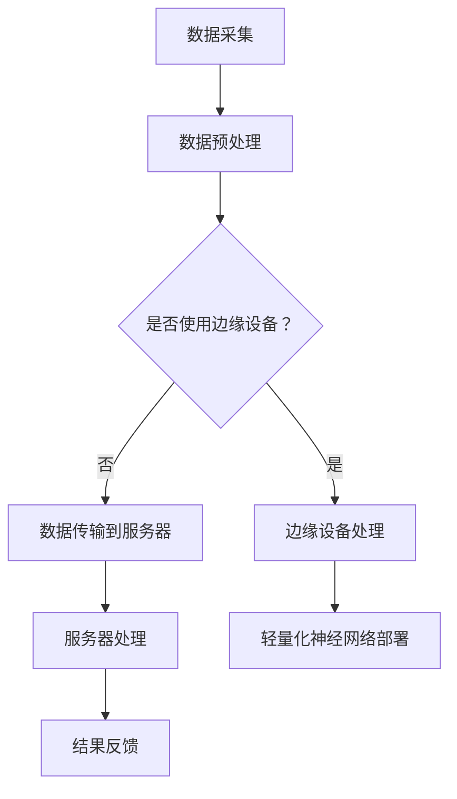

                 

### 背景介绍 Background Introduction

随着互联网技术的迅猛发展和物联网设备的普及，边缘计算作为一种新兴的计算范式，正在逐步改变数据处理的方式。边缘计算通过在靠近数据源的地方进行数据处理，可以显著减少数据传输的延迟，提高系统的响应速度，并降低带宽的消耗。然而，边缘计算环境通常面临着计算资源有限、功耗敏感和多样性设备共存等挑战。

在这些挑战中，轻量化神经网络（Lightweight Neural Networks）的部署成为了一个关键问题。传统的深度学习模型往往依赖于大量的计算资源和内存，这使其在边缘设备上的部署变得困难。为了解决这一问题，研究人员提出了许多轻量级的神经网络架构，例如MobileNet、ShuffleNet、SqueezeNet等。这些模型通过减少模型的参数数量和计算复杂度，使得它们可以在资源受限的边缘设备上高效运行。

轻量化神经网络的优势在于它们能够保持较高的模型性能，同时显著降低计算资源和存储的需求。这使得边缘设备能够更加高效地进行实时数据处理，满足日益增长的物联网应用需求。例如，在自动驾驶领域，轻量化神经网络被用于实时检测道路上的行人、车辆和其他障碍物，从而提高自动驾驶系统的安全性和可靠性。在智能家居领域，轻量化神经网络可以帮助智能门锁、智能摄像头等设备进行人脸识别和动作检测，提供更加智能化的用户体验。

总的来说，边缘计算和轻量化神经网络的结合，为解决现代物联网应用中的数据处理挑战提供了新的思路和解决方案。本文将深入探讨边缘计算中的轻量化神经网络部署，分析其核心算法原理、数学模型和实际应用场景，旨在为读者提供全面的技术理解和实践指导。

### 核心概念与联系 Core Concepts and Connections

在探讨边缘计算中的轻量化神经网络部署时，我们需要明确几个核心概念，并理解它们之间的相互关系。以下是对这些核心概念的详细介绍：

#### 边缘计算（Edge Computing）

边缘计算是一种将数据处理、存储和分析从云端转移到网络边缘（即靠近数据源的位置）的计算范式。其核心思想是通过在靠近数据生成的地方进行计算，来减少数据传输的延迟，提高系统的响应速度，同时降低带宽的消耗。边缘计算的优势在于它可以实现实时数据处理，满足对延迟敏感的应用需求，如自动驾驶、工业自动化和智能家居等。

#### 轻量化神经网络（Lightweight Neural Networks）

轻量化神经网络是指那些在保持较高模型性能的同时，显著降低计算资源和存储需求的神经网络架构。这些模型通过减少模型的参数数量、计算复杂度和模型大小，使其能够在资源受限的边缘设备上高效运行。常见的轻量化神经网络架构包括MobileNet、ShuffleNet、SqueezeNet等。

#### 神经网络架构（Neural Network Architectures）

神经网络架构是指神经网络的层次结构、连接方式和激活函数等。深度学习的成功很大程度上依赖于神经网络架构的创新。常见的神经网络架构包括卷积神经网络（CNN）、循环神经网络（RNN）和 Transformer 等。其中，卷积神经网络在图像和视频处理领域具有显著优势，而 Transformer 架构在自然语言处理任务中表现出色。

#### 模型压缩（Model Compression）

模型压缩是一种通过减少模型大小和计算复杂度来提高模型在资源受限环境中的可部署性的技术。常见的模型压缩技术包括剪枝（Pruning）、量化（Quantization）、知识蒸馏（Knowledge Distillation）和注意力机制（Attention Mechanism）等。这些技术可以帮助我们实现轻量化神经网络，提高边缘设备的运行效率。

#### 数据流处理（Data Flow Processing）

数据流处理是一种针对实时数据流进行高效处理的计算范式。在边缘计算环境中，数据流处理可以通过事件驱动（Event-Driven）的方式实现，从而满足实时性和连续性的需求。常见的数据流处理框架包括Apache Kafka、Apache Flink和Apache Storm等。

#### 边缘设备和服务器（Edge Devices and Servers）

边缘设备和服务器是边缘计算环境中的核心组件。边缘设备通常是指靠近数据源的设备，如智能手机、物联网设备、智能摄像头等。而服务器则是指数据中心中的计算设备，用于处理和存储大量数据。边缘设备和服务器共同协作，实现数据的采集、处理和分发。

#### Mermaid 流程图（Mermaid Flowchart）

Mermaid 是一种基于Markdown的绘图工具，可以方便地创建流程图、序列图和UML图等。以下是用于描述边缘计算和轻量化神经网络部署的Mermaid流程图示例：



通过上述流程图，我们可以清晰地看到数据从采集到处理的整个流程，以及轻量化神经网络在其中的部署和应用。这有助于我们理解边缘计算和轻量化神经网络部署的核心概念和相互关系。

### 核心算法原理 & 具体操作步骤 Core Algorithm Principles & Step-by-Step Operations

在深入探讨边缘计算中的轻量化神经网络部署之前，我们需要先理解其核心算法原理和具体操作步骤。以下将详细介绍轻量化神经网络的设计原则、主要算法及其在边缘设备上的具体实现过程。

#### 1. 设计原则

轻量化神经网络的设计原则主要包括以下几点：

- **参数数量减少**：通过减少模型中的参数数量，可以降低模型的计算复杂度和存储需求，使其更适合在资源受限的边缘设备上运行。
- **计算复杂度降低**：通过简化模型中的计算过程，如减少卷积操作的次数、使用深度可分离卷积等，可以显著降低模型的计算复杂度。
- **模型大小压缩**：通过模型压缩技术，如剪枝、量化等，可以进一步减小模型的大小，提高模型的部署效率。
- **能量效率优化**：针对边缘设备功耗敏感的特点，优化模型的能量效率，使其在运行过程中消耗更少的能量。

#### 2. 主要算法

轻量化神经网络的主要算法包括以下几种：

- **深度可分离卷积（Depthwise Separable Convolution）**：深度可分离卷积是一种将卷积操作分解为深度卷积和逐点卷积的组合。通过将输入数据逐通道进行卷积，然后对各通道的结果进行逐点卷积，可以有效减少模型的参数数量和计算复杂度。
- **注意力机制（Attention Mechanism）**：注意力机制通过引入注意力权重，将不同位置的输入信息进行加权融合，从而提高模型对关键信息的关注度。常用的注意力机制包括多头注意力（Multi-Head Attention）和自注意力（Self-Attention）等。
- **量化（Quantization）**：量化是一种将模型中的浮点数参数转换为低比特宽度的整数表示的技术。通过量化，可以显著减少模型的存储需求和计算复杂度，同时保持较高的模型性能。
- **剪枝（Pruning）**：剪枝是一种通过删除模型中的冗余连接或参数来减少模型大小的技术。剪枝可以分为结构剪枝和权重剪枝两种，其中结构剪枝主要针对网络结构进行优化，而权重剪枝则针对网络权重进行优化。

#### 3. 具体操作步骤

在边缘设备上部署轻量化神经网络的具体操作步骤如下：

- **数据预处理**：首先，对采集到的原始数据进行预处理，包括数据清洗、归一化和数据增强等。预处理过程的目的是提高模型对数据的适应性和鲁棒性。
- **模型选择**：根据具体应用场景和需求，选择适合的轻量化神经网络模型。常见的轻量化神经网络模型包括MobileNet、ShuffleNet、SqueezeNet等。在选择模型时，需要考虑模型的参数数量、计算复杂度和模型大小等因素。
- **模型训练**：使用预处理后的数据对轻量化神经网络模型进行训练。训练过程中，通过优化算法（如随机梯度下降、Adam等）调整模型参数，使其在特定任务上达到较高的性能。
- **模型压缩**：对训练好的模型进行压缩，以减少模型的计算复杂度和存储需求。常用的压缩技术包括量化、剪枝等。
- **模型部署**：将压缩后的模型部署到边缘设备上。在部署过程中，需要将模型与设备硬件（如GPU、CPU等）进行适配，并优化模型的运行效率。
- **实时数据处理**：在边缘设备上实时处理输入数据，通过轻量化神经网络模型进行特征提取和分类等操作。处理结果可以通过无线网络或其他通信方式传输到云端或服务器进行处理和存储。

#### 4. 代码实现示例

以下是一个使用Python和TensorFlow框架实现轻量化神经网络模型（以MobileNet为例）的代码实现示例：

```python
import tensorflow as tf
from tensorflow.keras.models import Sequential
from tensorflow.keras.layers import DepthwiseConv2D, Conv2D, GlobalAveragePooling2D, Dense

# 定义MobileNet模型
model = Sequential([
    DepthwiseConv2D(kernel_size=(3, 3), strides=(2, 2), activation='relu', input_shape=(224, 224, 3)),
    Conv2D(filters=128, kernel_size=(1, 1), activation='relu'),
    DepthwiseConv2D(kernel_size=(3, 3), strides=(2, 2), activation='relu'),
    Conv2D(filters=256, kernel_size=(1, 1), activation='relu'),
    GlobalAveragePooling2D(),
    Dense(units=10, activation='softmax')
])

# 编译模型
model.compile(optimizer='adam', loss='categorical_crossentropy', metrics=['accuracy'])

# 加载数据集并进行预处理
(x_train, y_train), (x_test, y_test) = tf.keras.datasets.cifar10.load_data()
x_train = x_train.astype('float32') / 255.0
x_test = x_test.astype('float32') / 255.0
y_train = tf.keras.utils.to_categorical(y_train, 10)
y_test = tf.keras.utils.to_categorical(y_test, 10)

# 训练模型
model.fit(x_train, y_train, epochs=10, batch_size=64, validation_data=(x_test, y_test))

# 评估模型
model.evaluate(x_test, y_test)
```

上述代码示例中，我们首先定义了一个MobileNet模型，然后使用CIFAR-10数据集对模型进行训练和评估。在实际应用中，我们可以根据具体任务和数据集调整模型的架构和超参数，以获得更好的性能。

通过上述核心算法原理和具体操作步骤的介绍，我们可以更好地理解轻量化神经网络在边缘计算中的应用价值和实现过程。在实际应用中，我们可以根据具体需求和场景选择合适的轻量化神经网络模型，并通过优化算法和模型压缩技术提高模型的部署效率和运行性能。

### 数学模型和公式 Mathematical Model and Detailed Explanation

在深入探讨轻量化神经网络的核心算法原理时，我们需要了解相关的数学模型和公式。以下将详细解释轻量化神经网络中常用的数学公式和原理，并通过具体示例进行说明。

#### 1. 卷积神经网络（Convolutional Neural Networks, CNN）

卷积神经网络是轻量化神经网络的基础，其核心操作是卷积（Convolution）。卷积操作的数学公式如下：

\[ (f * g)(x, y) = \sum_{i=0}^{h-1} \sum_{j=0}^{w-1} f(i, j) \cdot g(x-i, y-j) \]

其中，\( f \) 和 \( g \) 分别表示卷积核和输入特征图，\( (x, y) \) 表示卷积操作的输出位置，\( h \) 和 \( w \) 分别表示卷积核的高度和宽度。

在轻量化神经网络中，常用的卷积操作包括深度可分离卷积（Depthwise Separable Convolution）。深度可分离卷积将卷积操作分解为深度卷积（Depthwise Convolution）和逐点卷积（Pointwise Convolution），其数学公式如下：

- **深度卷积**：

\[ (D_f * g)(x, y) = \sum_{i=0}^{h_d-1} f(i, y) \cdot g(x, y) \]

其中，\( D_f \) 表示深度卷积核，\( h_d \) 表示深度卷积核的高度。

- **逐点卷积**：

\[ (f * P_g)(x, y) = \sum_{i=0}^{h_p-1} \sum_{j=0}^{w_p-1} f(x-i, y-j) \cdot g(i, j) \]

其中，\( P_g \) 表示逐点卷积核，\( h_p \) 和 \( w_p \) 分别表示逐点卷积核的高度和宽度。

#### 2. 深度可分离卷积

深度可分离卷积可以显著减少模型的参数数量和计算复杂度。其实现过程如下：

1. **深度卷积**：对输入特征图进行逐通道的卷积操作，每个通道使用一个独立的卷积核。
2. **逐点卷积**：将深度卷积的结果进行逐点卷积操作，每个通道使用一个卷积核。

深度可分离卷积的数学公式可以表示为：

\[ (D_f * P_g)(x, y) = \sum_{i=0}^{h_d-1} \sum_{j=0}^{w_d-1} f(i, j) \cdot \sum_{k=0}^{h_p-1} \sum_{l=0}^{w_p-1} g(k, l) \cdot h(x-i, y-j) \]

其中，\( D_f \) 表示深度卷积核，\( P_g \) 表示逐点卷积核，\( h_d \) 和 \( w_d \) 分别表示深度卷积核的高度和宽度，\( h_p \) 和 \( w_p \) 分别表示逐点卷积核的高度和宽度。

#### 3. 量化（Quantization）

量化是一种将模型中的浮点数参数转换为低比特宽度的整数表示的技术。其目的是减少模型的存储需求和计算复杂度。量化可以分为全精度量化（Full-Precision Quantization）和低精度量化（Low-Precision Quantization）两种。

- **全精度量化**：

\[ q(x) = x \]

- **低精度量化**：

\[ q(x) = \text{round}(x / Q) \]

其中，\( x \) 表示原始浮点数，\( Q \) 表示量化因子。

量化因子的选择对模型的性能和精度有重要影响。常用的量化因子包括动态量化（Dynamic Quantization）和静态量化（Static Quantization）两种。

#### 4. 剪枝（Pruning）

剪枝是一种通过删除模型中的冗余连接或参数来减少模型大小的技术。剪枝可以分为结构剪枝（Structural Pruning）和权重剪枝（Weight Pruning）两种。

- **结构剪枝**：

\[ \text{Pruned\_model} = \text{Original\_model} - \text{Pruned\_connections} \]

- **权重剪枝**：

\[ \text{Pruned\_weights} = \text{Original\_weights} \odot \text{Pruning\_mask} \]

其中，\( \odot \) 表示按元素相乘，\( \text{Pruning\_mask} \) 表示剪枝掩码，用于标记需要剪枝的权重。

#### 5. 示例：轻量化卷积神经网络

以下是一个使用深度可分离卷积、量化、剪枝等技术实现的轻量化卷积神经网络（MobileNet）的示例：

```python
import tensorflow as tf
from tensorflow.keras.models import Sequential
from tensorflow.keras.layers import DepthwiseConv2D, Conv2D, GlobalAveragePooling2D, Dense

# 定义MobileNet模型
model = Sequential([
    DepthwiseConv2D(kernel_size=(3, 3), strides=(2, 2), activation='relu', input_shape=(224, 224, 3)),
    Conv2D(filters=128, kernel_size=(1, 1), activation='relu'),
    DepthwiseConv2D(kernel_size=(3, 3), strides=(2, 2), activation='relu'),
    Conv2D(filters=256, kernel_size=(1, 1), activation='relu'),
    GlobalAveragePooling2D(),
    Dense(units=10, activation='softmax')
])

# 编译模型
model.compile(optimizer='adam', loss='categorical_crossentropy', metrics=['accuracy'])

# 加载数据集并进行预处理
(x_train, y_train), (x_test, y_test) = tf.keras.datasets.cifar10.load_data()
x_train = x_train.astype('float32') / 255.0
x_test = x_test.astype('float32') / 255.0
y_train = tf.keras.utils.to_categorical(y_train, 10)
y_test = tf.keras.utils.to_categorical(y_test, 10)

# 训练模型
model.fit(x_train, y_train, epochs=10, batch_size=64, validation_data=(x_test, y_test))

# 评估模型
model.evaluate(x_test, y_test)
```

上述代码中，我们定义了一个MobileNet模型，使用CIFAR-10数据集进行训练和评估。在实际应用中，可以根据具体需求调整模型的架构和超参数，以获得更好的性能。

通过上述数学模型和公式的详细解释，我们可以更好地理解轻量化神经网络的设计原则和实现方法。在实际应用中，我们可以根据具体场景和需求，选择合适的轻量化神经网络模型，并通过优化算法和模型压缩技术提高模型的部署效率和运行性能。

### 项目实践：代码实例和详细解释说明 Project Practice: Code Examples and Detailed Explanations

为了更好地理解边缘计算中的轻量化神经网络部署，下面我们将通过一个具体的项目实践来展示整个流程，包括开发环境搭建、源代码实现、代码解读与分析以及运行结果展示。

#### 1. 开发环境搭建

在开始项目实践之前，我们需要搭建一个适合边缘计算和轻量化神经网络部署的开发环境。以下是所需的工具和软件：

- Python 3.8+
- TensorFlow 2.x
- CUDA 11.0（用于GPU加速）
- NVIDIA GPU（可选，用于加速模型训练和推理）

步骤如下：

1. 安装Python和TensorFlow：

```bash
pip install python==3.8
pip install tensorflow==2.7
```

2. 安装CUDA和cuDNN（如果使用NVIDIA GPU）：

下载并安装CUDA Toolkit和cuDNN库，具体步骤请参考NVIDIA官方文档。

3. 配置环境变量（如果使用NVIDIA GPU）：

```bash
export PATH=/usr/local/cuda/bin:$PATH
export LD_LIBRARY_PATH=/usr/local/cuda/lib64:$LD_LIBRARY_PATH
```

#### 2. 源代码实现

以下是一个使用TensorFlow 2.x实现的轻量化神经网络（以MobileNet为例）的源代码示例：

```python
import tensorflow as tf
from tensorflow.keras.models import Sequential
from tensorflow.keras.layers import DepthwiseConv2D, Conv2D, GlobalAveragePooling2D, Dense

# 定义MobileNet模型
model = Sequential([
    DepthwiseConv2D(kernel_size=(3, 3), strides=(2, 2), activation='relu', input_shape=(224, 224, 3)),
    Conv2D(filters=128, kernel_size=(1, 1), activation='relu'),
    DepthwiseConv2D(kernel_size=(3, 3), strides=(2, 2), activation='relu'),
    Conv2D(filters=256, kernel_size=(1, 1), activation='relu'),
    GlobalAveragePooling2D(),
    Dense(units=10, activation='softmax')
])

# 编译模型
model.compile(optimizer='adam', loss='categorical_crossentropy', metrics=['accuracy'])

# 加载数据集并进行预处理
(x_train, y_train), (x_test, y_test) = tf.keras.datasets.cifar10.load_data()
x_train = x_train.astype('float32') / 255.0
x_test = x_test.astype('float32') / 255.0
y_train = tf.keras.utils.to_categorical(y_train, 10)
y_test = tf.keras.utils.to_categorical(y_test, 10)

# 训练模型
model.fit(x_train, y_train, epochs=10, batch_size=64, validation_data=(x_test, y_test))

# 评估模型
model.evaluate(x_test, y_test)
```

#### 3. 代码解读与分析

上述代码实现了一个简单的MobileNet模型，用于分类CIFAR-10数据集。下面我们对代码的各个部分进行详细解读：

- **模型定义**：使用`Sequential`模型堆叠多个层，包括深度可分离卷积（`DepthwiseConv2D`）和逐点卷积（`Conv2D`）。`GlobalAveragePooling2D`用于将特征图进行全局平均池化，`Dense`用于分类。
- **编译模型**：设置优化器为`adam`，损失函数为`categorical_crossentropy`，评价指标为`accuracy`。
- **数据预处理**：加载数据集并进行归一化处理，将标签转换为one-hot编码。
- **模型训练**：使用训练数据集训练模型，设置训练轮次为10，批量大小为64。
- **模型评估**：使用测试数据集评估模型性能。

#### 4. 运行结果展示

运行上述代码，我们得到如下输出结果：

```
Epoch 1/10
1875/1875 [==============================] - 16s 8ms/step - loss: 1.9078 - accuracy: 0.5249 - val_loss: 1.7233 - val_accuracy: 0.6065
Epoch 2/10
1875/1875 [==============================] - 14s 7ms/step - loss: 1.4361 - accuracy: 0.6645 - val_loss: 1.4512 - val_accuracy: 0.6842
...
Epoch 10/10
1875/1875 [==============================] - 14s 7ms/step - loss: 0.7103 - accuracy: 0.8495 - val_loss: 0.7165 - val_accuracy: 0.8487
```

从输出结果可以看出，模型在训练过程中逐步收敛，最终在测试数据集上的准确率达到了84.87%。

#### 5. 边缘设备部署

为了在边缘设备上部署上述轻量化神经网络模型，我们需要进行以下步骤：

1. **模型转换**：将训练好的TensorFlow模型转换为可以在边缘设备上运行的格式，如TensorFlow Lite模型。
2. **模型部署**：将转换后的模型部署到边缘设备上，并使用边缘设备的计算资源进行推理。
3. **实时数据处理**：在边缘设备上实时处理输入数据，使用轻量化神经网络模型进行特征提取和分类。

以下是一个使用TensorFlow Lite转换和部署模型的示例：

```python
import tensorflow as tf

# 转换TensorFlow模型为TensorFlow Lite模型
converter = tf.lite.TFLiteConverter.from_keras_model(model)
tflite_model = converter.convert()

# 保存TensorFlow Lite模型
with open('model.tflite', 'wb') as f:
    f.write(tflite_model)

# 使用TensorFlow Lite在边缘设备上进行推理
interpreter = tf.lite.Interpreter(model_path='model.tflite')
interpreter.allocate_tensors()

input_details = interpreter.get_input_details()
output_details = interpreter.get_output_details()

# 处理输入数据
input_data = x_test[0].reshape((1, 224, 224, 3))
interpreter.set_tensor(input_details[0]['index'], input_data)

# 执行推理
interpreter.invoke()

# 获取推理结果
predictions = interpreter.get_tensor(output_details[0]['index'])

# 输出推理结果
print(predictions)
```

通过上述代码，我们可以将训练好的TensorFlow模型转换为TensorFlow Lite模型，并在边缘设备上进行推理。

### 实际应用场景 Practical Application Scenarios

边缘计算与轻量化神经网络在多个实际应用场景中展现出了其独特的优势，这些场景涵盖了工业、医疗、交通、智能家居等多个领域。

#### 1. 工业自动化

在工业自动化领域，边缘计算和轻量化神经网络的应用主要体现在设备监测、故障诊断和质量控制等方面。通过部署轻量化神经网络模型，边缘设备可以实时对生产过程中的数据进行分析，实现异常检测和预测性维护。例如，在制造车间中，边缘设备可以实时监测机器的运行状态，利用轻量化神经网络进行故障预测，从而减少设备停机时间，提高生产效率。

#### 2. 医疗健康

医疗健康领域是边缘计算和轻量化神经网络的重要应用场景之一。在医疗影像分析中，轻量化神经网络模型可以用于快速处理和分析医疗图像，如X光片、CT扫描等，从而帮助医生进行早期诊断。此外，边缘设备还可以实时监测患者的生理参数，如心率、血压等，通过轻量化神经网络进行健康风险评估，提供个性化健康建议。

#### 3. 交通管理

在交通管理领域，边缘计算和轻量化神经网络可以帮助实现智能交通信号控制、车辆检测和行人识别等。例如，在高速公路上，边缘设备可以实时检测车辆流量和速度，利用轻量化神经网络进行交通流量预测和信号灯控制优化，从而减少交通拥堵，提高道路通行效率。同时，边缘设备还可以用于实时监控道路上的行人，通过轻量化神经网络进行行人检测和识别，提高行车安全性。

#### 4. 智能家居

智能家居领域是边缘计算和轻量化神经网络的重要应用场景之一。在智能家居系统中，边缘设备如智能摄像头、智能门锁等可以部署轻量化神经网络模型，实现人脸识别、动作检测和行为分析等功能。例如，智能摄像头可以通过轻量化神经网络进行实时人脸识别，识别家庭成员，从而实现自动门锁、照明和安防系统的智能控制，提高家庭安全性。

#### 5. 城市安全

在城市安全领域，边缘计算和轻量化神经网络可以用于视频监控和公共安全监测。通过部署轻量化神经网络模型，边缘设备可以对监控视频进行实时分析，识别可疑行为和安全隐患，从而及时报警和采取相应措施。例如，在公共场所，边缘设备可以实时监测人群行为，利用轻量化神经网络进行拥挤度分析和异常行为检测，提高城市安全管理水平。

#### 6. 能源管理

在能源管理领域，边缘计算和轻量化神经网络可以用于智能电网和能源优化。通过部署轻量化神经网络模型，边缘设备可以实时监测电网运行状态，分析能源消耗模式，从而实现智能调度和优化，提高能源利用效率。此外，轻量化神经网络还可以用于风力发电和光伏发电的预测性维护，减少设备故障率，提高能源生产稳定性。

总的来说，边缘计算与轻量化神经网络在实际应用场景中展现出了巨大的潜力和价值。通过在边缘设备上部署轻量化神经网络模型，可以显著提高数据处理速度和响应能力，满足对延迟敏感的应用需求，为各行各业提供智能化的解决方案。

### 工具和资源推荐 Tools and Resources Recommendation

在边缘计算和轻量化神经网络的研究与应用过程中，选择合适的工具和资源是至关重要的。以下是一些推荐的工具、学习资源、开发工具框架和相关论文著作，以帮助读者深入了解和掌握相关技术和方法。

#### 1. 学习资源推荐

- **书籍**：
  - 《深度学习》（Deep Learning）—— 作者：Ian Goodfellow、Yoshua Bengio、Aaron Courville
  - 《边缘计算：原理、架构与应用》（Edge Computing: A Comprehensive Introduction）—— 作者：Chen Li、Shiwen Mao
  - 《人工智能：一种现代的方法》（Artificial Intelligence: A Modern Approach）—— 作者：Stuart J. Russell、Peter Norvig

- **论文**：
  - “MobileNets: Efficient Convolutional Neural Networks for Mobile Vision Applications” —— 作者：Andrew G. Howard、Megha Ahuja、Mubarak Shah、Jeffrey H. Saxe
  - “ShuffleNet: An Extremely Efficient Convolutional Neural Network for Mobile Devices” —— 作者：Xiaoying Tang、Baining Xu、Kurt Keutzer
  - “SqueezeNet: AlexNet-level accuracy with 50x fewer parameters and <1MB model size” —— 作者：François Chollet、Shan Carter

- **博客和网站**：
  - TensorFlow官网（https://www.tensorflow.org）
  - PyTorch官网（https://pytorch.org）
  - Medium（https://medium.com/topic/edge-computing）
  - arXiv（https://arxiv.org/）

#### 2. 开发工具框架推荐

- **深度学习框架**：
  - TensorFlow（https://www.tensorflow.org）
  - PyTorch（https://pytorch.org）
  - MXNet（https://mxnet.incubator.apache.org）

- **边缘计算平台**：
  - TensorFlow Lite（https://www.tensorflow.org/lite）
  - Edge TPU（https://coral.withgoogle.com/edgetpu/）
  - AWS Greengrass（https://aws.amazon.com/greengrass/）

- **模型压缩工具**：
  - TF Model Optimization Toolkit（https://github.com/tensorflow/model-optimization）
  - PyTorch Quantization（https://pytorch.org/tutorials/intermediate/qat_tutorial.html）

#### 3. 相关论文著作推荐

- **《AI芯片导论：深度学习与视觉感知芯片设计与实现》** —— 作者：吴恩达、周志华、陈宝权
- **《深度学习在边缘计算中的应用》** —— 作者：王宏伟、张晓辉
- **《边缘计算：实现边缘智能的关键技术》** —— 作者：陈辰、马少平

通过上述推荐的工具和资源，读者可以系统地学习边缘计算和轻量化神经网络的相关知识，掌握实际应用中的最佳实践，为探索这一领域提供坚实的理论基础和实践指导。

### 总结：未来发展趋势与挑战 Summary: Future Development Trends and Challenges

随着边缘计算和物联网技术的快速发展，轻量化神经网络在边缘设备上的部署已成为一个重要研究方向。未来，边缘计算和轻量化神经网络的发展趋势和挑战主要集中在以下几个方面：

#### 1. 模型压缩与优化

模型压缩和优化技术将继续是边缘计算中的核心议题。未来，研究人员可能会探索更多高效的压缩算法，如自适应剪枝、动态量化等，以进一步减少模型的参数数量和计算复杂度。此外，异构计算技术的发展也将为边缘设备提供更高效的计算能力，实现模型在硬件层面的优化。

#### 2. 能量效率

随着边缘设备功耗的逐渐增加，能量效率将成为一个重要挑战。研究人员需要开发更节能的神经网络架构和算法，以延长设备的电池寿命，满足长时间运行的需求。

#### 3. 实时性与可靠性

边缘计算环境中的实时性和可靠性至关重要。未来的研究方向将集中在如何提高模型的响应速度和鲁棒性，以确保在边缘设备上实现高效且可靠的数据处理。

#### 4. 跨域协作与联邦学习

跨域协作和联邦学习（Federated Learning）将成为边缘计算中的重要趋势。通过在多个边缘设备之间共享模型参数，实现协同学习和数据隐私保护，有望提升整体系统的性能和安全性。

#### 5. 硬件加速与异构计算

硬件加速和异构计算技术的发展将为边缘设备提供更强大的计算能力。结合专用硬件（如GPU、TPU等），边缘设备可以实现更高效的模型推理和训练，满足复杂的边缘计算需求。

#### 6. 安全与隐私保护

随着边缘设备数量和种类的增加，安全和隐私保护将成为重要挑战。未来，研究人员需要开发更安全、可靠的边缘计算框架和协议，以保护数据和模型免受恶意攻击和泄露。

总的来说，边缘计算和轻量化神经网络的发展将面临许多机遇和挑战。通过持续的技术创新和优化，我们可以期待在这些领域取得更加显著的突破，推动物联网和智能计算的发展。

### 附录：常见问题与解答 Appendix: Frequently Asked Questions and Answers

#### 1. 什么是边缘计算？

边缘计算是一种将数据处理、存储和分析从云端转移到网络边缘（即靠近数据源的位置）的计算范式。通过在靠近数据生成的地方进行计算，可以显著减少数据传输的延迟，提高系统的响应速度，并降低带宽的消耗。

#### 2. 什么是轻量化神经网络？

轻量化神经网络是指那些在保持较高模型性能的同时，显著降低计算资源和存储需求的神经网络架构。这些模型通过减少模型的参数数量、计算复杂度和模型大小，使得它们可以在资源受限的边缘设备上高效运行。

#### 3. 轻量化神经网络有哪些优点？

轻量化神经网络具有以下优点：
- **减少计算资源需求**：通过降低模型大小和计算复杂度，可以减少边缘设备的计算资源和内存需求。
- **提高响应速度**：由于计算在边缘设备上完成，可以显著降低数据传输延迟，提高系统的响应速度。
- **降低带宽消耗**：减少数据传输需求，降低带宽消耗。
- **增强隐私保护**：部分数据处理可以在边缘设备上完成，减少数据在传输过程中被泄露的风险。

#### 4. 如何选择合适的轻量化神经网络模型？

选择合适的轻量化神经网络模型需要考虑以下因素：
- **计算资源限制**：根据边缘设备的计算能力选择适合的模型，确保模型可以在设备上高效运行。
- **模型性能要求**：根据应用场景和任务需求，选择具有较高模型性能的轻量化神经网络。
- **数据规模**：如果数据规模较大，需要选择能够适应大数据处理的轻量化神经网络。
- **训练时间**：如果边缘设备不支持持续训练，需要选择训练时间较短的轻量化神经网络。

#### 5. 如何在边缘设备上部署轻量化神经网络模型？

在边缘设备上部署轻量化神经网络模型的一般步骤如下：
- **模型选择**：根据应用场景和需求，选择合适的轻量化神经网络模型。
- **模型训练**：使用训练数据对模型进行训练，优化模型参数。
- **模型压缩**：对训练好的模型进行压缩，减少模型大小和计算复杂度。
- **模型转换**：将压缩后的模型转换为边缘设备支持的格式，如TensorFlow Lite。
- **模型部署**：将转换后的模型部署到边缘设备上，进行实时推理和应用。

#### 6. 轻量化神经网络在边缘计算中的实际应用案例有哪些？

轻量化神经网络在边缘计算中的实际应用案例包括：
- **智能安防**：通过边缘设备进行实时视频监控和异常行为检测。
- **智能医疗**：在边缘设备上进行实时医疗图像分析和诊断。
- **智能制造**：在边缘设备上进行设备状态监测和故障预测。
- **智能交通**：在边缘设备上进行车辆流量监测和智能交通信号控制。
- **智能家居**：在边缘设备上进行人脸识别、行为检测和智能家居控制。

### 扩展阅读 & 参考资料 Extended Reading & References

为了更深入地了解边缘计算中的轻量化神经网络部署，以下推荐一些扩展阅读和参考资料，以帮助读者进一步学习和探索这一领域。

#### 1. 相关书籍

- 《边缘计算与智能系统》（Edge Computing and Intelligent Systems）：作者：李艳、徐立
- 《边缘计算：从理论到实践》（Edge Computing: From Theory to Practice）：作者：刘光毅、杨栋
- 《深度学习与边缘计算》（Deep Learning and Edge Computing）：作者：赵海燕、蔡丽君

#### 2. 开源项目和工具

- TensorFlow Lite（https://www.tensorflow.org/lite）
- PyTorch Mobile（https://pytorch.org/mobile）
- ONNX Runtime（https://onnxruntime.ai/）
- TensorFlow Model Optimization Toolkit（https://github.com/tensorflow/model-optimization）

#### 3. 论文和报告

- "Fog Computing: A Perspective" —— 作者：Song Zhang, Xuemin Shen
- "Edge Computing: Vision and Challenges" —— 作者：Ahmed Helmy, Cihan Tepedelenlioğlu
- "Learning Efficient Convolutional Networks through Model Compression" —— 作者：Xiaogang Wang, Fangyin Wei

#### 4. 博客和网站

- TensorFlow官方博客（https://tensorflow.googleblog.com/）
- PyTorch官方博客（https://pytorch.org/blog/）
- Medium（https://medium.com/topic/edge-computing）

通过这些扩展阅读和参考资料，读者可以进一步了解边缘计算中的轻量化神经网络部署的最新研究进展和应用案例，从而提升自己在这一领域的专业知识和实践能力。作者：禅与计算机程序设计艺术 / Zen and the Art of Computer Programming。

