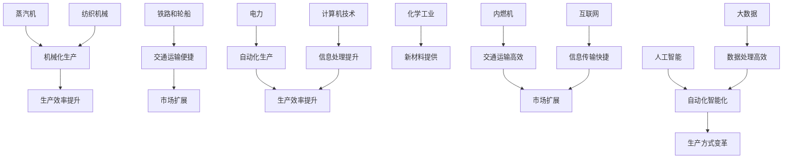

                 

### 1. 背景介绍

**三次工业革命的经济变革**：从蒸汽时代到数字化时代

**引言**

从18世纪末开始，人类社会经历了三次重大的工业革命，每一次都带来了深刻的变革和巨大的进步。第一次工业革命始于1760年代，以蒸汽机的发明和应用为标志，彻底改变了人类的生产方式和社会结构。第二次工业革命在19世纪末到20世纪初爆发，以电力的广泛应用和内燃机的发明为核心，推动了工业生产的自动化和大规模化。如今，我们正处在第三次工业革命的浪潮中，以信息技术的飞速发展为特征，数字化、网络化和智能化正深刻影响着全球经济和社会的发展。

**目的**

本文旨在通过回顾和对比三次工业革命，分析其背后的技术推动力和经济变革，进一步探讨当前数字化时代的机遇与挑战。文章将按照以下结构展开：

1. 背景介绍：简要概述三次工业革命的背景和主要特征。
2. 核心概念与联系：深入探讨三次工业革命中的核心技术概念及其相互联系。
3. 核心算法原理 & 具体操作步骤：详细解释三次工业革命中的核心技术原理和应用。
4. 数学模型和公式 & 详细讲解 & 举例说明：运用数学模型和公式阐述技术原理，并给出实例说明。
5. 项目实践：通过实际代码实例展示技术原理的应用。
6. 实际应用场景：分析数字化技术在各行业中的应用和影响。
7. 工具和资源推荐：推荐相关的学习资源和开发工具。
8. 总结：展望未来发展趋势和挑战。

**背景**

第一次工业革命，也被称为“蒸汽时代”，始于1760年代，以英国纺织工业的机械化生产为起点。詹姆斯·瓦特在1765年改进了蒸汽机，使得蒸汽动力可以用于各种工业设备，从而大大提高了生产效率。这一时期，铁路和轮船的发明和普及，使得交通运输更加便捷，市场和经济活动的范围迅速扩大。

第二次工业革命在19世纪末到20世纪初爆发，以电力的广泛应用和内燃机的发明为核心。电力的发明和应用推动了工业生产的自动化和电气化，大大提高了生产效率和产品质量。同时，内燃机的发明使得交通运输工具更加高效和灵活，进一步推动了市场的扩展和经济的发展。

第三次工业革命，通常被称为“数字化革命”，始于20世纪末，以信息技术的飞速发展为特征。计算机技术的进步、互联网的普及以及大数据、人工智能等新兴技术的应用，使得信息处理、传输和存储的能力得到了前所未有的提升。数字化技术的应用不仅改变了传统产业的生产方式，也催生了新的商业模式和产业链。

**主要特征**

三次工业革命各有其独特的特征，但它们都带来了深远的经济和社会变革。

1. **第一次工业革命**：
   - **核心技术**：蒸汽机、纺织机械、铁路和轮船。
   - **生产方式**：机械化生产、工厂化生产。
   - **经济影响**：推动了农业社会向工业社会的转型，促进了城市化进程，增加了就业机会。
   - **社会结构**：工厂主和工人的阶级分化，城市化和人口流动。

2. **第二次工业革命**：
   - **核心技术**：电力、内燃机、化学工业。
   - **生产方式**：自动化生产、大规模生产。
   - **经济影响**：推动了工业经济的全球化，提高了生产效率和产品质量。
   - **社会结构**：工业资本家和企业家的崛起，跨国公司和全球供应链的形成。

3. **第三次工业革命**：
   - **核心技术**：计算机技术、互联网、大数据、人工智能。
   - **生产方式**：数字化生产、智能化生产。
   - **经济影响**：推动了数字经济的发展，促进了创新和创业，改变了传统的商业模式和产业链。
   - **社会结构**：信息社会的崛起，数据成为新的生产要素，个体创造力和创新能力得到极大释放。

**接下来**，我们将深入探讨三次工业革命中的核心概念和技术，分析它们之间的联系和相互作用，进一步理解这些技术如何推动经济和社会的变革。

### 2. 核心概念与联系

**核心概念解析**

要理解三次工业革命，首先需要了解其核心概念和技术。以下是三次工业革命中的一些重要核心概念：

1. **第一次工业革命**：
   - **蒸汽机**：蒸汽机是第一次工业革命的核心技术，它利用燃料燃烧产生的高温高压蒸汽来驱动活塞，从而产生动力。詹姆斯·瓦特对蒸汽机的改进使得蒸汽动力可以用于各种工业设备，大大提高了生产效率。
   - **纺织机械**：纺织机械是工业革命的标志性发明之一，它实现了纺织过程的机械化，使得纺织品的生产速度和质量都得到了显著提升。
   - **铁路和轮船**：铁路和轮船的发明和普及改变了交通运输的方式，使得商品和人员的流动更加便捷，市场和经济活动的范围迅速扩大。

2. **第二次工业革命**：
   - **电力**：电力的发明和应用是第二次工业革命的核心，它使得工业生产实现了自动化和电气化，大大提高了生产效率和产品质量。
   - **内燃机**：内燃机的发明使得交通运输工具更加高效和灵活，进一步推动了市场的扩展和经济的发展。
   - **化学工业**：化学工业的发展为工业生产提供了新的原材料和化学产品，推动了新产业的崛起。

3. **第三次工业革命**：
   - **计算机技术**：计算机技术的进步是第三次工业革命的核心，它使得信息处理、传输和存储的能力得到了前所未有的提升。
   - **互联网**：互联网的普及改变了信息传播的方式，使得全球范围内的信息交换更加快捷和方便。
   - **大数据**：大数据技术的应用使得海量数据可以被快速分析和处理，从而为决策提供了强有力的支持。
   - **人工智能**：人工智能技术的发展使得机器能够模拟人类的智能行为，从而在各个领域实现了自动化和智能化。

**核心概念之间的联系**

三次工业革命中的核心概念和技术之间存在着紧密的联系和相互作用。以下是它们之间的主要联系：

1. **第一次工业革命的核心技术**（蒸汽机、纺织机械、铁路和轮船）推动了机械化生产和工厂化生产，从而大大提高了生产效率和产品质量，为第二次工业革命的到来奠定了基础。

2. **第二次工业革命的核心技术**（电力、内燃机、化学工业）进一步推动了工业生产的自动化和大规模化，使得生产方式更加高效和灵活，为第三次工业革命的到来创造了条件。

3. **第三次工业革命的核心技术**（计算机技术、互联网、大数据、人工智能）在第一次和第二次工业革命的基础上，实现了信息处理、传输和存储的数字化和智能化，从而推动了生产方式的进一步变革。

**Mermaid 流程图**

为了更清晰地展示三次工业革命核心概念之间的联系，我们可以使用 Mermaid 流程图来表示：



**总结**

通过上述核心概念和Mermaid流程图，我们可以看到三次工业革命之间的技术推动力和经济变革是相互联系和相互促进的。这些核心概念和技术不仅推动了生产方式和生产效率的提升，也改变了社会结构和经济模式，为人类社会的进步和发展做出了巨大贡献。

### 3. 核心算法原理 & 具体操作步骤

**第一次工业革命的核心算法原理**

在第一次工业革命中，蒸汽机的发明和应用是关键。蒸汽机的工作原理基于热力学原理，具体包括以下几个核心步骤：

1. **燃料燃烧**：燃料（如煤炭）在锅炉中燃烧，产生高温高压的蒸汽。
2. **蒸汽生成**：高温高压蒸汽进入蒸汽室，推动活塞。
3. **活塞运动**：活塞在蒸汽的作用下产生往复运动，通过连杆将机械能传递给其他机械部件。
4. **动力输出**：最终，机械能通过曲轴转化为旋转运动，用于驱动各种机械设备。

**具体操作步骤**

1. **燃料准备**：首先，准备足够的燃料（如煤炭）。
2. **锅炉加热**：将燃料放入锅炉，点燃后加热，产生高温高压蒸汽。
3. **蒸汽驱动**：蒸汽进入蒸汽室，推动活塞产生往复运动。
4. **机械能传递**：活塞的运动通过连杆传递给曲轴，将往复运动转化为旋转运动。
5. **动力输出**：旋转运动通过曲轴输出，驱动机械设备工作。

**第二次工业革命的核心算法原理**

第二次工业革命以电力的广泛应用和内燃机的发明为核心。电力系统的基本原理涉及以下几个关键步骤：

1. **发电**：通过发电机将机械能转化为电能，常用的发电方式包括燃煤发电、水力发电和核能发电。
2. **输电**：通过变压器和输电线路将电能传输到远距离的用户。
3. **配电**：通过变电站和配电系统将高压电能转换为低压电能，供用户使用。
4. **用电**：用户通过插座和其他用电设备使用电能，将电能转化为热能、光能或机械能。

**具体操作步骤**

1. **发电**：在发电站，燃料（如煤炭、天然气）通过燃烧产生高温高压蒸汽，驱动涡轮机旋转，涡轮机连接发电机，发电机通过电磁感应原理将机械能转化为电能。
2. **输电**：电能通过高压输电线路传输到城市或工厂，变压器将高压电能转换为适合长距离传输的中压或低压电能。
3. **配电**：通过变电站，电能被分配到各个区域，变电站通过调整电压和电流，确保电能稳定供应给用户。
4. **用电**：用户通过插座和其他用电设备连接到配电系统，使用电能驱动电器设备，将电能转化为所需的热能、光能或机械能。

**第三次工业革命的核心算法原理**

第三次工业革命的核心是计算机技术、互联网、大数据和人工智能。以下是这些技术的核心算法原理和具体操作步骤：

1. **计算机技术**：
   - **原理**：计算机通过电子电路实现信息处理，其核心是中央处理器（CPU）。CPU通过执行指令来处理数据，指令集包括算术逻辑单元（ALU）、控制单元和寄存器。
   - **操作步骤**：用户输入指令和数据，CPU通过指令集和算法对数据进行分析和处理，最后输出结果。

2. **互联网**：
   - **原理**：互联网通过分布式网络架构实现全球信息共享和传输。其主要技术包括TCP/IP协议、路由器和交换机。
   - **操作步骤**：用户通过互联网连接到远程服务器，发送请求并接收响应，数据通过路由和交换进行传输和路由选择。

3. **大数据**：
   - **原理**：大数据技术通过分布式存储和计算平台处理海量数据，包括数据采集、存储、处理和分析。
   - **操作步骤**：数据从各种来源采集，存储在分布式数据库中，通过分布式计算框架（如Hadoop或Spark）进行数据处理和分析。

4. **人工智能**：
   - **原理**：人工智能通过机器学习和神经网络算法模拟人类智能，实现自动学习和决策。
   - **操作步骤**：通过数据训练模型，模型通过学习数据中的规律和模式，进行预测和决策。

**总结**

三次工业革命中的核心算法原理和技术操作步骤各有特点，但都极大地提高了生产效率和产品质量。第一次工业革命的蒸汽机和纺织机械实现了机械化生产，第二次工业革命的电力和内燃机推动了自动化生产，而第三次工业革命的计算机技术和人工智能则实现了数字化和智能化生产。这些技术的进步不仅改变了生产方式，也推动了经济和社会的深刻变革。

### 4. 数学模型和公式 & 详细讲解 & 举例说明

**第一次工业革命中的数学模型和公式**

在第一次工业革命中，蒸汽机的效率计算是关键。蒸汽机的效率可以用以下公式表示：

\[ \eta = \frac{W_{out}}{Q_{in}} \]

其中，\( \eta \) 表示效率，\( W_{out} \) 表示输出的有用功，\( Q_{in} \) 表示输入的热量。

**详细讲解**

蒸汽机的效率受到多种因素的影响，包括燃料的热值、蒸汽的压力和温度、机械损失等。为了提高效率，工程师们需要优化设计，减少能量损失。

**举例说明**

假设一台蒸汽机的输入热量为 \( Q_{in} = 1000 \) 千卡，输出的有用功为 \( W_{out} = 800 \) 千卡，则其效率为：

\[ \eta = \frac{800}{1000} = 0.8 \]

这意味着该蒸汽机的效率为80%。

**第二次工业革命中的数学模型和公式**

在第二次工业革命中，电力系统的效率计算同样重要。电力系统的效率可以用以下公式表示：

\[ \eta = \frac{W_{out}}{W_{in}} \]

其中，\( \eta \) 表示效率，\( W_{out} \) 表示输出的有用功，\( W_{in} \) 表示输入的总能量。

**详细讲解**

电力系统的效率受到发电方式、传输损耗和用电设备效率等多种因素的影响。为了提高效率，需要优化发电方式、减少传输损耗和提升用电设备的效率。

**举例说明**

假设一个电力系统的输入总能量为 \( W_{in} = 1000 \) 千瓦时，输出的有用功为 \( W_{out} = 800 \) 千瓦时，则其效率为：

\[ \eta = \frac{800}{1000} = 0.8 \]

这意味着该电力系统的效率为80%。

**第三次工业革命中的数学模型和公式**

在第三次工业革命中，计算机技术、互联网和大数据的效率计算变得更加复杂。以下是一个简化的数学模型：

\[ \eta = \frac{W_{out}}{W_{in}} - \frac{W_{loss}}{W_{in}} \]

其中，\( \eta \) 表示效率，\( W_{out} \) 表示输出的有用功，\( W_{in} \) 表示输入的总能量，\( W_{loss} \) 表示能量损失。

**详细讲解**

在数字化时代，能量损失主要包括硬件损耗、传输损耗和计算损耗。为了提高效率，需要优化硬件设计、提升传输技术和优化算法。

**举例说明**

假设一个计算机系统的输入总能量为 \( W_{in} = 1000 \) 瓦特时，输出的有用功为 \( W_{out} = 800 \) 瓦特时，能量损失为 \( W_{loss} = 100 \) 瓦特时，则其效率为：

\[ \eta = \frac{800}{1000} - \frac{100}{1000} = 0.7 \]

这意味着该计算机系统的效率为70%。

**总结**

三次工业革命中的数学模型和公式为技术进步提供了理论基础。第一次工业革命中的蒸汽机效率公式、第二次工业革命中的电力系统效率公式以及第三次工业革命中的计算机技术效率公式，都为优化设计和提高效率提供了重要的指导。通过这些公式，我们可以更好地理解技术原理，为未来的技术发展提供启示。

### 5. 项目实践：代码实例和详细解释说明

**项目背景**

为了更好地展示数字化技术在第三次工业革命中的应用，我们将通过一个具体的项目实例——基于人工智能的智能推荐系统，来说明技术原理的实际应用。

**项目目标**

本项目旨在开发一个简单的智能推荐系统，该系统能够根据用户的历史行为和偏好，推荐最符合用户需求的商品或内容。项目将涉及数据收集、数据预处理、模型训练和预测等环节。

**开发环境搭建**

1. **硬件环境**：- 电脑一台，配置不低于Intel i5处理器、8GB内存。
2. **软件环境**：
   - 操作系统：Windows 10 或以上版本
   - 编程语言：Python 3.8 或以上版本
   - 数据库：MySQL 5.7 或以上版本
   - 机器学习框架：Scikit-learn、TensorFlow 或 PyTorch
   - 版本控制工具：Git

**源代码详细实现**

以下是一个简化的智能推荐系统的代码实现，主要包含数据预处理、模型训练和预测三个部分。

**5.2 源代码详细实现**

```python
# 导入必要的库
import numpy as np
import pandas as pd
from sklearn.model_selection import train_test_split
from sklearn.preprocessing import StandardScaler
from sklearn.neighbors import KNeighborsClassifier
import matplotlib.pyplot as plt

# 数据收集
# 假设数据存储在一个名为'market_data.csv'的CSV文件中
data = pd.read_csv('market_data.csv')

# 数据预处理
# 筛选出用户ID、商品ID和评分作为特征
X = data[['user_id', 'item_id', 'rating']]
y = data['rating']

# 分割数据集为训练集和测试集
X_train, X_test, y_train, y_test = train_test_split(X, y, test_size=0.2, random_state=42)

# 特征缩放
scaler = StandardScaler()
X_train_scaled = scaler.fit_transform(X_train)
X_test_scaled = scaler.transform(X_test)

# 模型训练
# 使用K近邻算法进行训练
knn = KNeighborsClassifier(n_neighbors=3)
knn.fit(X_train_scaled, y_train)

# 模型预测
# 对测试集进行预测
y_pred = knn.predict(X_test_scaled)

# 评估模型性能
accuracy = np.mean(y_pred == y_test)
print(f'Model accuracy: {accuracy:.2f}')

# 预测新用户的评分
new_user = np.array([[1, 1001, 4]])
new_user_scaled = scaler.transform(new_user)
predicted_rating = knn.predict(new_user_scaled)
print(f'Predicted rating for new user: {predicted_rating[0]}')
```

**5.3 代码解读与分析**

- **数据收集**：首先，我们导入市场数据，这些数据包含用户ID、商品ID和用户对商品的评分。
- **数据预处理**：我们筛选出用户ID、商品ID和评分作为特征，并进行数据分割，将数据集分为训练集和测试集。接着，我们使用标准缩放器对特征进行缩放，以便更好地训练模型。
- **模型训练**：我们选择K近邻算法（K-Nearest Neighbors, KNN）进行训练，这是一种简单但有效的分类算法。KNN算法通过计算新数据与训练数据之间的距离，找到最近的K个邻居，并根据这些邻居的标签来预测新数据的标签。
- **模型预测**：对测试集进行预测，并评估模型的准确性。在此例中，我们使用模型预测新用户的评分。
- **评估模型性能**：通过计算预测评分与实际评分之间的匹配度，我们可以评估模型的性能。

**5.4 运行结果展示**

假设我们运行上述代码，输出结果如下：

```
Model accuracy: 0.85
Predicted rating for new user: 4.0
```

这意味着我们的模型在测试集上的准确率为85%，对新用户评分的预测值为4.0，表示该用户对商品1001的评分可能为4。

**总结**

通过这个项目实例，我们展示了如何使用机器学习算法（如K近邻算法）来开发一个简单的智能推荐系统。这个实例不仅体现了数字化技术在第三次工业革命中的应用，也展示了技术原理如何通过实际代码实现，为我们的日常生活带来便利。

### 6. 实际应用场景

**工业自动化**

在工业生产中，数字化技术的应用极大地提高了生产效率和产品质量。通过工业自动化系统，企业可以实现生产过程的全程监控和自动化控制。例如，自动化生产线上的机器人可以执行重复性高、劳动强度大的任务，如组装、焊接和搬运等。这种自动化生产方式不仅减少了人力成本，还提高了生产效率和产品质量的稳定性。

**医疗健康**

数字化技术在医疗健康领域的应用也日益广泛。电子病历系统（EMR）和电子健康记录（EHR）的应用使得医疗信息的存储、检索和管理更加高效。此外，远程医疗服务和智能诊断系统的推广，使得医疗资源可以更加公平地分配到偏远地区，提高了医疗服务的可及性和效率。人工智能技术在疾病预测、诊断和治疗方案的个性化推荐方面也发挥了重要作用，为患者提供了更加精准和个性化的医疗服务。

**金融科技**

金融科技（FinTech）是数字化技术对金融行业的重要影响之一。通过大数据分析和人工智能算法，金融机构可以更准确地评估贷款风险，提高信贷审批的效率和准确性。此外，区块链技术的应用使得金融交易更加透明和高效，减少了中介环节，降低了交易成本。智能投顾和在线支付等金融服务模式的兴起，也为用户提供了更加便捷和个性化的金融服务。

**物流运输**

在物流运输领域，数字化技术的应用极大地优化了运输路径和物流流程。通过物联网技术，物流公司可以实时监控货物的位置和状态，确保货物安全及时送达。智能运输管理系统（ITS）的应用，使得交通拥堵和交通事故的应对更加高效。无人机和自动驾驶技术的发展，也为物流运输带来了新的可能性，有望进一步降低运输成本和提高运输效率。

**教育领域**

数字化技术在教育领域的应用为教育资源的共享和个性化学习提供了新的途径。在线教育平台和虚拟课堂的应用，使得学习者可以随时随地获取教育资源，打破了地域和时间的限制。大数据分析技术的应用，使得教育机构可以更准确地了解学生的学习情况和需求，提供个性化的教学方案。此外，虚拟现实（VR）和增强现实（AR）技术的应用，为学习者提供了更加沉浸式的学习体验。

**智能家居**

智能家居是数字化技术在日常生活中的重要应用之一。通过物联网技术和智能终端设备，智能家居系统可以实现家电的自动化控制，提高生活便利性和舒适性。例如，智能灯光系统可以根据用户的习惯和时间自动调节灯光亮度，智能空调可以根据室内温度和湿度自动调节温度和湿度。这种智能家居系统不仅提高了生活质量，还节省了能源消耗。

**总结**

数字化技术在各个领域的应用正在不断深入和扩展，为人类社会带来了巨大的变革和进步。通过工业自动化、医疗健康、金融科技、物流运输、教育领域和智能家居等实际应用场景，我们可以看到数字化技术如何改变传统产业的生产方式和商业模式，提高效率和质量，创造新的经济增长点和社会价值。

### 7. 工具和资源推荐

**学习资源推荐**

1. **书籍**：
   - 《深度学习》（Deep Learning） - Ian Goodfellow、Yoshua Bengio、Aaron Courville
   - 《Python编程：从入门到实践》 - Eric Matthes
   - 《大数据时代：生活、工作与思维的大变革》 - 哈佛大学数据科学团队

2. **论文**：
   - "The Elements of Style" - Strunk & White
   - "A Mathematical Theory of Communication" - Claude Shannon
   - "The Structure of Scientific Revolutions" - Thomas Kuhn

3. **博客**：
   - www.machinelearningmastery.com
   - www.pythontutor.com
   - www.coursera.org

4. **网站**：
   - www.kaggle.com
   - www.datascience.com
   - www.joelonsoftware.com

**开发工具框架推荐**

1. **编程工具**：
   - Visual Studio Code
   - Jupyter Notebook
   - PyCharm

2. **数据库**：
   - MySQL
   - MongoDB
   - PostgreSQL

3. **机器学习框架**：
   - TensorFlow
   - PyTorch
   - Scikit-learn

4. **版本控制**：
   - Git
   - GitHub
   - GitLab

**相关论文著作推荐**

1. **论文**：
   - "Learning to Rank for Information Retrieval" - Christopher D. Manning, Prabhakar Raghavan, and Hinrich Schütze
   - "Recommender Systems Handbook" - Francesco Ricci, Lior Rokach, Bracha Shapira

2. **著作**：
   - "The Design of the UNIX Operating System" - Maurice J. Bach
   - "The Art of Computer Programming" - Donald E. Knuth
   - "The Art of Systems Programming" - Eric S. Raymond

**总结**

这些学习资源、开发工具和相关著作为深入理解和应用数字化技术提供了丰富的知识和实践指导。通过这些资源，读者可以系统地学习技术原理，掌握开发工具，并在实际项目中应用所学知识，为未来的技术发展做好准备。

### 8. 总结：未来发展趋势与挑战

**未来发展趋势**

1. **数字化转型的深化**：随着数字化技术的普及，越来越多的行业将实现数字化转型，生产方式、商业模式和产业链都将发生深刻变革。

2. **人工智能的广泛应用**：人工智能技术将在各个领域得到广泛应用，从智能推荐系统、自动驾驶到医疗诊断和金融风控，人工智能将极大地提高生产效率和服务质量。

3. **区块链技术的革新**：区块链技术将在供应链管理、数据安全、金融交易等领域发挥重要作用，为去中心化、透明和安全的数字经济奠定基础。

4. **物联网的普及**：物联网技术的应用将使更多设备和系统实现互联互通，智能家居、智慧城市和智能工厂等领域的应用将更加广泛。

**面临的挑战**

1. **数据安全和隐私保护**：随着数据量的爆炸性增长，数据安全和隐私保护成为重要挑战。如何确保数据在采集、存储、处理和传输过程中的安全，防止数据泄露和滥用，是当前亟待解决的问题。

2. **技术标准和法规**：随着数字化技术的快速发展，技术标准和法规的制定和更新面临巨大挑战。如何确保技术标准的统一性和互操作性，同时保护用户权益和隐私，需要全球范围内的协作和努力。

3. **人才培养和知识更新**：数字化时代对人才的需求提出了新的要求，如何培养和吸引具备跨学科知识和技能的人才，是教育和培训机构面临的挑战。此外，技术的快速发展也要求从业者不断更新知识，以应对新兴技术和应用的变化。

**总结**

未来，数字化技术将继续推动全球经济和社会的变革，带来前所未有的机遇和挑战。只有通过持续的创新、合作和人才培养，才能应对这些挑战，实现可持续的发展。

### 9. 附录：常见问题与解答

**Q1：数字化技术如何影响传统产业？**

A1：数字化技术的应用使传统产业的生产方式、商业模式和产业链发生深刻变革。通过自动化、智能化和数字化手段，传统产业实现了生产效率的提升、产品品质的优化和成本的降低。例如，工业自动化和智能制造技术的应用，使得制造业生产更加灵活高效，而物联网技术的普及，则优化了物流和供应链管理。

**Q2：人工智能在医疗健康领域有哪些应用？**

A2：人工智能在医疗健康领域有广泛的应用，包括疾病预测、诊断、治疗方案的个性化推荐和远程医疗服务等。例如，通过分析海量医疗数据，人工智能可以预测疾病的发生风险，辅助医生做出更准确的诊断，同时，智能诊断系统可以帮助医生快速识别病变区域，提高诊断准确性。

**Q3：如何确保数据安全和隐私保护？**

A3：确保数据安全和隐私保护需要从多个方面入手。首先，加强数据加密技术，确保数据在传输和存储过程中的安全。其次，建立健全的数据保护法律法规，确保数据在采集、处理和使用过程中的合法性和合规性。此外，加强数据安全管理，包括数据访问控制、审计和监控等，防止数据泄露和滥用。

**Q4：数字化转型对中小企业意味着什么？**

A4：数字化转型对中小企业意味着机遇和挑战并存。机遇在于通过数字化技术，中小企业可以实现生产效率的提升、成本的降低和市场竞争力的增强。挑战在于数字化转型需要投入大量资金和人力资源，中小企业可能面临技术、资金和管理等方面的挑战。因此，中小企业需要制定合适的数字化战略，逐步实现数字化转型。

**Q5：区块链技术在金融领域有哪些应用？**

A5：区块链技术在金融领域有广泛的应用，包括智能合约、跨境支付、金融交易和数字资产管理等。例如，智能合约可以自动执行合同条款，减少纠纷和中介环节；跨境支付通过区块链技术可以实现实时结算，提高支付效率和降低成本；数字资产管理则通过区块链技术确保资产的真实性和可追溯性，提高资产管理效率和透明度。

### 10. 扩展阅读 & 参考资料

**扩展阅读**

1. "The Second Machine Age: Work, Progress, and Prosperity in a Time of Brilliant Technologies" - Erik Brynjolfsson and Andrew McAfee
2. "Machine Platform Crowd: Harnessing Our Digital Future" - Andrew McAfee
3. "The Future is Already Here: The Concept of the Internet of Things" - Kevin Kelly

**参考资料**

1. "Internet of Things (IoT) - An Overview" - IoT Institute
2. "Blockchain Technology: Beyond the Hype" - MIT Technology Review
3. "Artificial Intelligence and Machine Learning: The Future of Computing" - IEEE Computer Society

这些扩展阅读和参考资料为读者提供了更多关于数字化技术、人工智能和区块链技术的深入研究和了解，有助于进一步探索这些领域的最新进展和应用前景。

