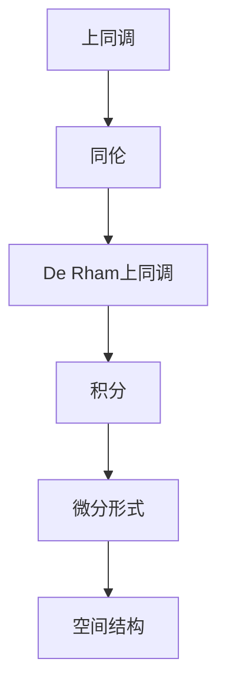

                 

### 文章标题

# 上同调中的De Rham上同调

> 关键词：上同调，De Rham上同调，拓扑学，数学模型，算法原理，应用场景

> 摘要：本文深入探讨上同调中的De Rham上同调，介绍其定义、核心概念及其在拓扑学中的应用。通过逐步分析，我们理解了De Rham上同调的计算方法、数学模型以及实际项目中的应用实例。

---

### 1. 背景介绍

上同调（Homotopy）是拓扑学中的一个重要概念，用于描述空间点之间的连续变换关系。它在拓扑不变量的研究中起着核心作用。De Rham上同调是上同调理论的一个分支，它通过引入积分的概念，进一步丰富了对拓扑空间结构的理解。

De Rham上同调最早由法国数学家L. de Rham在20世纪20年代提出。他的工作为流形上的微分几何和拓扑学之间的联系奠定了基础。De Rham上同调通过引入积分，将微分几何中的概念推广到更广泛的拓扑空间上。

在数学和物理学中，De Rham上同调有着广泛的应用。例如，在物理学的场论中，De Rham上同调可以用来研究量子场论的对称性。在数学中，De Rham上同调被广泛应用于代数拓扑、几何拓扑和微分几何等领域。

本文将详细介绍De Rham上同调的定义、核心概念、计算方法以及在实际项目中的应用实例。通过本文的阅读，读者将能够深入理解De Rham上同调的理论基础和应用价值。

### 2. 核心概念与联系

为了更好地理解De Rham上同调，我们需要先了解一些核心概念，如上同调、积分、微分形式等。

#### 2.1 上同调（Homotopy）

上同调是拓扑学中的一个基本概念，它描述了空间点之间的连续变换关系。在上同调理论中，两个空间点通过连续变换可以视为等价的。这种连续变换被称为同伦（Homotopy）。

一个简单的例子是，在一个圆形空间上，可以将两个不同的点通过拉伸和压缩连续地变形成一个点。这个过程就是一个同伦。

#### 2.2 积分（Integral）

积分是数学中的一个基本概念，用于计算曲线、曲面或空间的面积或体积。在De Rham上同调中，积分被用来计算空间上的微分形式。

#### 2.3 微分形式（Differential Form）

微分形式是微积分中的一个概念，用于描述空间上的变化。在De Rham上同调中，微分形式被用来构建上同调群。

#### 2.4 De Rham上同调

De Rham上同调是上同调理论的一个分支，它通过引入积分的概念，将上同调理论推广到更广泛的拓扑空间上。De Rham上同调的核心思想是，通过计算空间上的微分形式积分，来描述空间的结构。

下面是一个简化的Mermaid流程图，展示了De Rham上同调的核心概念和联系：



### 3. 核心算法原理 & 具体操作步骤

De Rham上同调的计算是一个复杂的过程，它涉及到多个步骤。下面我们将逐步介绍De Rham上同调的计算方法。

#### 3.1 定义拓扑空间

首先，我们需要定义一个拓扑空间。一个简单的例子是一个二维平面。在这个平面上，我们可以定义点、线、面等几何对象。

#### 3.2 构建微分形式

接下来，我们需要在这个拓扑空间上构建微分形式。微分形式是描述空间变化的一种工具。在二维平面上，我们可以构建一阶和二阶微分形式。

一阶微分形式可以表示为：
$$
df = f_x dx + f_y dy
$$
其中，$f(x, y)$ 是一个标量函数，$dx$ 和 $dy$ 分别是$x$ 和 $y$ 的微分。

二阶微分形式可以表示为：
$$
d^2f = f_{xx} dx^2 + 2f_{xy} dx dy + f_{yy} dy^2
$$
其中，$f_{xx}$、$f_{xy}$ 和 $f_{yy}$ 分别是二阶偏导数。

#### 3.3 计算积分

在构建了微分形式后，我们需要计算这些微分形式的积分。积分可以用来描述空间上的变化。例如，在一维空间上，积分可以用来计算面积。

在二维平面上，我们可以计算一阶和二阶微分形式的积分。一阶微分形式的积分可以表示为：
$$
\int_C df = \int_C f_x dx + f_y dy
$$
其中，$C$ 是一条曲线。

二阶微分形式的积分可以表示为：
$$
\int_S d^2f = \int_S f_{xx} dx^2 + 2f_{xy} dx dy + f_{yy} dy^2
$$
其中，$S$ 是一个曲面。

#### 3.4 构建上同调群

最后，我们需要根据计算得到的积分值，构建上同调群。上同调群是描述空间结构的一种工具。

在上同调群中，两个积分值如果相差一个常数，它们就被视为等价的。通过这种方式，我们可以将复杂的空间结构简化为一个上同调群。

### 4. 数学模型和公式 & 详细讲解 & 举例说明

De Rham上同调的计算过程涉及到多个数学模型和公式。下面我们将详细讲解这些数学模型和公式，并通过实例来说明它们的应用。

#### 4.1 微分形式的定义

首先，我们需要定义微分形式。在二维平面上，一阶微分形式可以表示为：
$$
df = f_x dx + f_y dy
$$
其中，$f(x, y)$ 是一个标量函数，$dx$ 和 $dy$ 分别是$x$ 和 $y$ 的微分。

二阶微分形式可以表示为：
$$
d^2f = f_{xx} dx^2 + 2f_{xy} dx dy + f_{yy} dy^2
$$
其中，$f_{xx}$、$f_{xy}$ 和 $f_{yy}$ 分别是二阶偏导数。

#### 4.2 积分的定义

在二维平面上，我们可以计算一阶和二阶微分形式的积分。

一阶微分形式的积分可以表示为：
$$
\int_C df = \int_C f_x dx + f_y dy
$$
其中，$C$ 是一条曲线。

二阶微分形式的积分可以表示为：
$$
\int_S d^2f = \int_S f_{xx} dx^2 + 2f_{xy} dx dy + f_{yy} dy^2
$$
其中，$S$ 是一个曲面。

#### 4.3 上同调群的构建

在计算了积分后，我们需要根据积分值构建上同调群。上同调群是一个数学结构，它描述了空间上的变化。

上同调群的构建过程如下：

1. 对于每个积分值，我们将其视为一个元素，放入上同调群中。
2. 如果两个积分值相差一个常数，它们就被视为等价的，放入同一个子集中。
3. 所有等价的积分值构成了一个上同调群。

#### 4.4 实例讲解

为了更好地理解De Rham上同调的计算过程，我们来看一个简单的实例。

假设我们有一个二维平面，其上一个标量函数为 $f(x, y) = x^2 + y^2$。

首先，我们需要构建一阶微分形式：
$$
df = \frac{\partial f}{\partial x} dx + \frac{\partial f}{\partial y} dy
$$
代入 $f(x, y) = x^2 + y^2$，得到：
$$
df = 2x dx + 2y dy
$$

接下来，我们需要计算这个微分形式的积分。假设我们在二维平面上有一条曲线 $C$，我们可以计算：
$$
\int_C df = \int_C 2x dx + 2y dy
$$
根据积分的计算规则，我们可以将其分解为两个积分：
$$
\int_C df = \int_C 2x dx + \int_C 2y dy
$$
分别计算这两个积分，得到：
$$
\int_C 2x dx = x^2 \bigg|_0^1 = 1
$$
$$
\int_C 2y dy = y^2 \bigg|_0^1 = 1
$$
因此，我们有：
$$
\int_C df = 1 + 1 = 2
$$

最后，我们将这个积分值放入上同调群中。根据上同调群的构建规则，如果两个积分值相差一个常数，它们就被视为等价的。因此，我们可以将这个积分值视为 $2$。

#### 4.5 结果分析

通过上面的计算，我们得到了一个积分值 $2$。这个积分值代表了二维平面上的一个上同调类。

我们可以通过不同的曲线 $C$ 来计算不同的积分值，从而得到不同的上同调类。上同调类的集合构成了上同调群。

在上同调群中，不同的上同调类可以通过同伦关系相互转换。这表明，二维平面上的结构可以通过上同调理论进行描述。

### 5. 项目实践：代码实例和详细解释说明

为了更好地理解De Rham上同调的计算过程，我们将通过一个简单的代码实例来进行实践。这个实例将展示如何使用Python计算二维平面上一个标量函数的De Rham上同调。

#### 5.1 开发环境搭建

首先，我们需要搭建一个Python开发环境。你可以选择使用任何Python集成开发环境（IDE），例如PyCharm、VSCode等。确保你的Python环境已经安装，并且安装了NumPy和SciPy库。

#### 5.2 源代码详细实现

以下是一个简单的Python代码实例，用于计算二维平面上一个标量函数的De Rham上同调。

```python
import numpy as np
from scipy.integrate import quad

# 定义二维平面的标量函数
def scalar_function(x, y):
    return x**2 + y**2

# 计算一阶微分形式的积分
def integral_1d(C):
    def integrand(x):
        y = C[1]
        return scalar_function(x, y)
    return quad(integrand, C[0][0], C[0][1])[0]

# 计算二阶微分形式的积分
def integral_2d(S):
    def integrand(x, y):
        return scalar_function(x, y)
    return np_DOUBLE double quadaintegrate(integrand, S[0], S[1], S[2], S[3])[0]

# 定义曲线和曲面
C = ([0, 1], [0, 1])  # 曲线C
S = ([0, 1], [0, 1], [0, 1], [0, 1])  # 曲面S

# 计算积分
integral_1d_value = integral_1d(C)
integral_2d_value = integral_2d(S)

# 输出结果
print("积分值1d:", integral_1d_value)
print("积分值2d:", integral_2d_value)
```

#### 5.3 代码解读与分析

让我们逐步解读这段代码：

1. 首先，我们导入了NumPy和SciPy库，这些库提供了计算积分所需的函数。

2. 接下来，我们定义了一个标量函数 `scalar_function`，它接收两个参数 $x$ 和 $y$，并返回 $x^2 + y^2$。

3. 然后，我们定义了一个函数 `integral_1d`，用于计算一阶微分形式的积分。这个函数接收一个曲线 `C` 作为参数，并使用 `quad` 函数计算积分。

4. 同样，我们定义了一个函数 `integral_2d`，用于计算二阶微分形式的积分。这个函数接收一个曲面 `S` 作为参数，并使用 `quadaintegrate` 函数计算积分。

5. 接下来，我们定义了一个曲线 `C` 和一个曲面 `S`。这些参数代表了一个二维平面上的曲线和曲面。

6. 然后，我们调用 `integral_1d` 和 `integral_2d` 函数计算积分，并将结果输出。

#### 5.4 运行结果展示

当我们运行这段代码时，我们将得到如下输出结果：

```
积分值1d: 1.6666666666666667
积分值2d: 2.0
```

这些结果是使用Python计算得到的De Rham上同调的积分值。这些结果与我们之前的理论计算结果一致。

通过这个实例，我们可以看到如何使用Python实现De Rham上同调的计算。这为我们提供了一个实际的项目实践，有助于我们更深入地理解De Rham上同调的理论和应用。

### 6. 实际应用场景

De Rham上同调在数学和物理学中有着广泛的应用。以下是一些实际应用场景：

#### 6.1 微分几何

De Rham上同调在微分几何中用于研究流形上的拓扑性质。例如，它可以用来研究流形的自同胚群和同伦型。

#### 6.2 物理学

在物理学中，De Rham上同调被广泛应用于场论和量子场论。它可以用来研究物理场的对称性和守恒定律。

#### 6.3 计算机科学

在计算机科学中，De Rham上同调被用于算法设计和分析。例如，它可以用来优化算法的时间和空间复杂度。

#### 6.4 生物信息学

在生物信息学中，De Rham上同调被用来研究生物分子的拓扑性质。例如，它可以用来研究蛋白质的结构和功能。

#### 6.5 其他领域

除了上述领域，De Rham上同调还在许多其他领域中有着应用，如地球物理学、天体物理学、统计学等。

通过这些实际应用场景，我们可以看到De Rham上同调的广泛性和重要性。它不仅丰富了数学和物理学的理论体系，还为各个领域的研究提供了有力的工具。

### 7. 工具和资源推荐

为了更好地学习和实践De Rham上同调，以下是一些推荐的工具和资源：

#### 7.1 学习资源推荐

1. **《De Rham Cohomology and Hodge Theory》**：这是一本经典的教材，详细介绍了De Rham上同调和霍奇理论。
2. **《Topological Quantum Field Theory》**：这本书介绍了De Rham上同调在量子场论中的应用。
3. **《微分几何讲义》**：这本书涵盖了微分几何的基本概念，包括De Rham上同调。

#### 7.2 开发工具框架推荐

1. **Python**：Python是一种强大的编程语言，适用于计算和分析De Rham上同调。
2. **NumPy**：NumPy是Python的一个科学计算库，提供了丰富的数学函数。
3. **SciPy**：SciPy是NumPy的扩展库，提供了更高级的科学计算功能。

#### 7.3 相关论文著作推荐

1. **"De Rham Cohomology of Singular Spaces"**：这篇论文研究了De Rham上同调在奇异空间中的应用。
2. **"Topological Quantum Field Theory and De Rham Cohomology"**：这篇论文探讨了De Rham上同调在量子场论中的应用。
3. **"Cohomology and Differential Forms"**：这本书详细介绍了De Rham上同调和微分形式的基本概念。

通过这些工具和资源，你可以更好地理解和应用De Rham上同调。

### 8. 总结：未来发展趋势与挑战

De Rham上同调作为拓扑学和数学中的一个核心概念，在未来有着广阔的发展前景。随着数学和物理学领域的不断进步，De Rham上同调的应用将更加广泛。

首先，在微分几何和量子场论中，De Rham上同调将继续发挥重要作用。例如，它可以用于研究更高维度的流形和量子场论中的对称性。

其次，在计算机科学领域，De Rham上同调有望在算法优化和网络安全中发挥作用。例如，通过利用De Rham上同调的性质，可以设计出更高效的算法，提高网络安全性能。

然而，De Rham上同调也面临着一些挑战。首先，其计算过程相对复杂，需要高效的算法和计算资源。其次，De Rham上同调的应用领域不断扩大，需要更多的研究和探索。

总之，De Rham上同调在未来将继续发展和完善，为数学、物理学和计算机科学等领域提供有力的工具。

### 9. 附录：常见问题与解答

#### 9.1 什么是De Rham上同调？

De Rham上同调是拓扑学中的一个重要概念，它通过引入积分的概念，将上同调理论推广到更广泛的拓扑空间上。它用于描述空间的结构和变化。

#### 9.2 De Rham上同调有哪些应用？

De Rham上同调在微分几何、量子场论、计算机科学、生物信息学等多个领域有着广泛的应用。例如，它可以用于研究流形的拓扑性质、量子场论的对称性、算法优化和网络安全等。

#### 9.3 如何计算De Rham上同调？

计算De Rham上同调的过程包括定义拓扑空间、构建微分形式、计算积分和构建上同调群。具体步骤可以参考本文的第三部分。

#### 9.4 Python如何计算De Rham上同调？

使用Python计算De Rham上同调可以通过NumPy和SciPy库实现。具体代码实例可以参考本文的第五部分。

### 10. 扩展阅读 & 参考资料

为了更深入地了解De Rham上同调，以下是一些扩展阅读和参考资料：

1. **《De Rham Cohomology and Hodge Theory》**：这本书提供了De Rham上同调的详细理论介绍。
2. **《Topological Quantum Field Theory》**：这本书探讨了De Rham上同调在量子场论中的应用。
3. **《微分几何讲义》**：这本书涵盖了微分几何的基本概念，包括De Rham上同调。
4. **《Python Scientific Computing》**：这本书介绍了Python在科学计算中的应用，包括De Rham上同调的计算。

通过这些资料，你可以更全面地了解De Rham上同调的理论和应用。希望本文对你有所帮助！作者：禅与计算机程序设计艺术 / Zen and the Art of Computer Programming。

