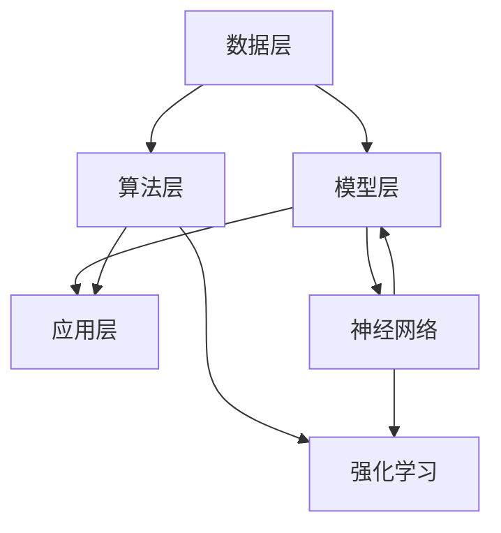

                 

### 背景介绍 Background

人工智能（AI）是计算机科学的一个重要分支，它致力于研究如何构建能够执行复杂任务，并从经验中学习的智能代理。自20世纪50年代人工智能概念的提出以来，人工智能经历了多个发展时期，包括早期的理论研究阶段、符号主义人工智能的兴起、以及近年来的深度学习和神经网络技术的突破。

当前，人工智能在诸多领域取得了显著的成就，例如自然语言处理、图像识别、推荐系统、自动驾驶等。然而，随着应用场景的不断扩大和复杂性增加，传统的单一算法和模型已经难以满足新兴需求。这促使研究人员和开发者不断探索下一代人工智能系统的技术路线，以应对当前的挑战和未来的机遇。

本文旨在探讨下一代人工智能系统的技术路线，包括以下几个方面：

1. **核心概念与联系**：介绍人工智能的基本概念和关键组件，如神经网络、机器学习、深度学习等，并展示它们之间的相互关系。
2. **核心算法原理**：深入解析下一代人工智能系统所依赖的核心算法，包括深度强化学习、生成对抗网络、迁移学习等。
3. **数学模型与公式**：详细阐述支持这些算法的数学理论基础，包括优化方法、概率论、信息论等。
4. **项目实践**：通过实际代码示例，展示如何应用这些算法和技术解决具体问题。
5. **实际应用场景**：讨论人工智能在各个领域的应用，并展望未来可能的发展趋势。
6. **工具和资源推荐**：推荐一些学习资源和开发工具，帮助读者进一步探索人工智能的领域。
7. **总结与展望**：总结当前人工智能的发展状况，并探讨未来可能面临的挑战和机遇。

通过本文的探讨，我们希望能够为读者提供一个全面、系统的下一代人工智能系统技术路线图，帮助大家更好地理解和应用这一领域的最新成果。

### 核心概念与联系 Core Concepts and Connections

要深入探讨下一代人工智能系统的技术路线，我们首先需要了解其中涉及的一些核心概念和它们之间的相互关系。以下是一些关键概念及其在人工智能体系中的位置和作用。

#### 1. 人工智能基础

人工智能（AI）是一个宽泛的术语，它涵盖了许多不同的分支和技术。以下是一些基本概念：

- **机器学习（Machine Learning）**：机器学习是一种使计算机系统能够从数据中学习并做出决策的方法，不需要显式编程。它是人工智能的一个子领域，涉及大量的统计模型和算法，用于从数据中提取模式和知识。
- **深度学习（Deep Learning）**：深度学习是机器学习的一个分支，它使用多层神经网络来提取和表示数据的高层特征。与传统的机器学习方法相比，深度学习在处理大量复杂数据时表现更为出色。
- **神经网络（Neural Networks）**：神经网络是一种模仿人脑神经元连接方式的计算模型。在深度学习中，神经网络通常包含多个隐藏层，这些隐藏层用于提取数据的不同层次特征。
- **强化学习（Reinforcement Learning）**：强化学习是一种通过与环境互动来学习策略的机器学习方法。它通过奖励和惩罚来指导学习过程，使得代理能够学会在特定环境中做出最优决策。

#### 2. 人工智能体系架构

人工智能系统的体系架构通常包括以下几个层次：

- **数据层**：数据是人工智能的基石。在这一层次，数据科学家和工程师负责收集、清洗和预处理数据，为后续的学习和处理提供高质量的数据集。
- **模型层**：在这一层次，机器学习工程师和研究人员选择并训练合适的模型。常见的模型包括传统的统计模型、神经网络和深度学习模型等。
- **算法层**：算法是实现特定功能的核心。常见的算法有决策树、支持向量机、随机森林、神经网络等。
- **应用层**：应用层是人工智能系统的最终用户界面。在这一层次，人工智能系统通过预测、决策或自动化等方式提供实际价值。

#### 3. 关键概念之间的联系

不同的人工智能概念和技术并不是孤立的，它们之间存在紧密的联系和相互促进。

- **机器学习和深度学习的关系**：深度学习是机器学习的一个子领域，它利用神经网络的结构和多层特征提取能力，使得模型能够从大规模数据中学习到复杂特征。
- **神经网络和强化学习的关系**：神经网络在强化学习中扮演着重要的角色，特别是在深度强化学习中，神经网络被用来表示代理的状态和动作值函数，从而实现高效的决策。
- **模型训练和数据质量的关系**：模型的训练效果很大程度上取决于数据的质量。高质量的数据有助于模型更好地学习到数据的内在规律，从而提高模型的准确性和泛化能力。

为了更直观地展示这些概念和它们之间的联系，我们可以使用Mermaid流程图来绘制一个简单的架构图：



在这个流程图中，我们可以看到数据层提供了数据支持，模型层和算法层负责模型的选择和训练，应用层是模型的最终体现。神经网络和强化学习作为核心算法，贯穿了整个体系架构，并对模型的训练和应用产生重要影响。

通过理解这些核心概念和它们之间的联系，我们可以为下一代人工智能系统的技术路线奠定坚实的基础，从而更好地应对未来的挑战和机遇。

### 核心算法原理 Core Algorithm Principles

在探讨下一代人工智能系统的技术路线时，核心算法的原理和具体操作步骤是至关重要的。以下将介绍几种关键算法，包括深度强化学习、生成对抗网络和迁移学习，以及它们的具体操作步骤和应用场景。

#### 1. 深度强化学习（Deep Reinforcement Learning）

深度强化学习是一种结合了深度学习和强化学习的方法，通过使用深度神经网络来近似状态值函数和动作值函数，从而实现高效的决策。以下是深度强化学习的基本步骤：

**步骤 1：定义环境**  
首先，我们需要定义一个环境（Environment），环境是一个能够与智能体（Agent）进行交互的系统。例如，在自动驾驶中，环境可以是一个模拟的驾驶场景。

**步骤 2：初始化智能体**  
智能体初始化时，我们需要为其定义状态（State）和动作（Action）空间。同时，还需要初始化一个深度神经网络模型，用于表示状态值函数（State-Value Function）和动作值函数（Action-Value Function）。

**步骤 3：智能体与环境交互**  
智能体根据当前的状态选择一个动作，并执行这个动作。然后，环境根据执行的动作返回新的状态和奖励（Reward）。奖励可以是正的（表示成功）或负的（表示失败）。

**步骤 4：更新模型参数**  
利用新的状态、动作和奖励，通过反向传播算法更新深度神经网络模型的参数。这一步骤通过优化策略来最大化长期奖励。

**步骤 5：重复步骤 3 和 4**  
智能体不断与环境进行交互，并根据反馈信息不断调整模型参数，直到达到预定的目标。

**应用场景**：深度强化学习在自动驾驶、游戏人工智能、机器人控制等领域有广泛的应用。

#### 2. 生成对抗网络（Generative Adversarial Networks, GAN）

生成对抗网络是一种由生成器（Generator）和判别器（Discriminator）组成的对抗性模型，通过竞争过程生成逼真的数据。以下是生成对抗网络的基本步骤：

**步骤 1：初始化生成器和判别器**  
生成器生成伪造的数据，判别器负责判断数据是真实还是伪造。

**步骤 2：训练判别器**  
判别器使用真实数据和伪造数据进行训练，以提高其辨别真实数据的能力。

**步骤 3：训练生成器**  
生成器根据判别器的反馈调整其生成策略，以生成更加逼真的数据。

**步骤 4：交替训练**  
生成器和判别器交替训练，生成器逐渐提高生成数据的质量，判别器逐渐增强辨别能力。

**步骤 5：评估生成数据**  
使用生成数据的质量评估标准（如相似度评分）来评估生成器的性能。

**应用场景**：生成对抗网络在图像生成、图像修复、风格迁移等领域有广泛的应用。

#### 3. 迁移学习（Transfer Learning）

迁移学习是一种利用已有模型来解决新问题的方法，通过将知识从一个任务转移到另一个任务中。以下是迁移学习的基本步骤：

**步骤 1：选择预训练模型**  
选择一个在相关任务上预训练的模型，这个模型已经学习到了一些通用的特征表示。

**步骤 2：微调模型参数**  
在新任务上，微调预训练模型的参数，以适应特定任务的需求。

**步骤 3：训练模型**  
使用新任务的数据集对模型进行训练，以进一步优化模型性能。

**步骤 4：评估模型性能**  
在新任务上评估模型的性能，确保其能够解决实际问题。

**应用场景**：迁移学习在图像识别、自然语言处理、语音识别等领域有广泛的应用。

通过上述算法的介绍，我们可以看到，下一代人工智能系统依赖于一系列先进的算法和技术，这些算法不仅具有强大的学习能力，还能够适应复杂多样的应用场景。随着这些核心算法的不断发展和完善，人工智能系统将能够在更多领域取得突破性进展。

#### 数学模型和公式 Mathematical Models and Formulas

要深入理解下一代人工智能系统，我们不仅需要了解核心算法的具体操作步骤，还需要掌握支持这些算法的数学理论基础。以下将详细介绍相关数学模型、公式以及详细的讲解和举例说明。

##### 1. 优化方法（Optimization Methods）

优化方法是人工智能系统中不可或缺的一部分，用于训练模型和调整参数。常见的优化方法包括梯度下降（Gradient Descent）及其变种。

**梯度下降（Gradient Descent）**

梯度下降是一种通过最小化损失函数来调整模型参数的方法。其基本公式如下：

\[ \text{loss}(w) = \sum_{i=1}^{n} (y_i - \hat{y}_i)^2 \]

\[ w_{\text{new}} = w_{\text{current}} - \alpha \cdot \nabla_w \text{loss}(w) \]

其中，\( w \) 表示模型参数，\( \alpha \) 是学习率，\( \nabla_w \text{loss}(w) \) 表示损失函数关于模型参数的梯度。

**具体举例**：假设我们有一个线性回归模型，目标是预测房价。损失函数为均方误差（MSE），学习率为0.01。训练数据集包含10个样本，每个样本包含特征和标签。初始参数为 \( w_0 = [0, 0] \)。

```python
import numpy as np

# 假设输入特征和标签
X = np.array([[1, 2], [1, 3], [2, 1], [2, 2], [3, 1], [3, 2], [4, 1], [4, 2], [5, 1], [5, 2]])
y = np.array([2.5, 3.5, 2.5, 3.5, 3.0, 3.0, 2.0, 2.0, 2.5, 2.5])

# 梯度计算
loss = ((y - X.dot(w)).pow(2)).sum()
gradient = 2 * (X.dot(w) - y).dot(X)

# 参数更新
learning_rate = 0.01
w_new = w - learning_rate * gradient
```

通过多次迭代梯度下降算法，我们可以得到最优的参数 \( w \)，从而实现准确的房价预测。

##### 2. 概率论（Probability Theory）

概率论是人工智能系统中用于描述不确定性和预测结果的重要工具。以下介绍贝叶斯定理（Bayes' Theorem）和马尔可夫链（Markov Chains）。

**贝叶斯定理（Bayes' Theorem）**

贝叶斯定理描述了后验概率与先验概率、似然函数之间的关系：

\[ P(A|B) = \frac{P(B|A)P(A)}{P(B)} \]

其中，\( P(A|B) \) 是后验概率，\( P(B|A) \) 是似然函数，\( P(A) \) 是先验概率，\( P(B) \) 是边际概率。

**具体举例**：假设有一个疾病，发病概率为0.01，有症状的概率为0.90。如果一个患者有症状，求其患病的概率。

```python
# 先验概率
P_disease = 0.01
P_symptom_given_disease = 0.90

# 边际概率
P_symptom = (P_symptom_given_disease * P_disease) + ((1 - P_symptom_given_disease) * (1 - P_disease))

# 后验概率
P_disease_given_symptom = (P_symptom_given_disease * P_disease) / P_symptom
```

通过计算，我们可以得到患者有症状的情况下患病的概率约为0.9901。

**马尔可夫链（Markov Chains）**

马尔可夫链是一种用来描述系统状态转移的概率模型，其特点是当前状态只与前一状态有关，与过去状态无关。

\[ P(X_n = x_n | X_{n-1} = x_{n-1}, X_{n-2} = x_{n-2}, ...) = P(X_n = x_n | X_{n-1} = x_{n-1}) \]

**具体举例**：假设有一个患者在不同时间段是否患有疾病的状态转移模型。给定一个患者的初始状态，我们可以预测未来若干时间点该患者的状态。

```python
# 状态转移矩阵
transition_matrix = np.array([[0.9, 0.1], [0.2, 0.8]])

# 初始状态
initial_state = np.array([0.5, 0.5])

# 预测未来状态
for _ in range(5):
    initial_state = transition_matrix.dot(initial_state)
    print(initial_state)
```

输出结果将展示未来5个时间点患者的状态概率。

##### 3. 信息论（Information Theory）

信息论用于描述数据中的不确定性和信息量。以下介绍熵（Entropy）和信息熵（Information Entropy）。

**熵（Entropy）**

熵是一个衡量随机变量不确定性的指标，其公式为：

\[ H(X) = -\sum_{x \in X} P(X = x) \cdot \log_2 P(X = x) \]

**具体举例**：假设有两个随机变量X和Y，其中X有两个等可能的状态，Y有三个等可能的状态。

```python
# 随机变量概率
P_X = np.array([0.5, 0.5])
P_Y = np.array([0.3333, 0.3333, 0.3333])

# 熵计算
H_X = -P_X.dot(np.log2(P_X))
H_Y = -P_Y.dot(np.log2(P_Y))
print(f"H(X) = {H_X}, H(Y) = {H_Y}")
```

输出结果展示了X和Y的熵。

**信息熵（Information Entropy）**

信息熵是熵的一种特殊情况，用于描述系统中的信息量。其公式为：

\[ H(X|Y) = -\sum_{x \in X} P(X = x | Y = y) \cdot \log_2 P(X = x | Y = y) \]

**具体举例**：假设已知Y的状态，计算在Y已知的情况下X的信息熵。

```python
# 条件概率
P_X_given_Y = np.array([[0.75, 0.25], [0.25, 0.75]])

# 信息熵计算
H_X_given_Y = -P_X_given_Y.dot(np.log2(P_X_given_Y))
print(f"H(X|Y) = {H_X_given_Y}")
```

输出结果展示了在Y已知的情况下X的信息熵。

通过上述数学模型和公式的介绍，我们可以更好地理解支持下一代人工智能系统的理论基础。这些模型和公式为人工智能系统的开发和应用提供了重要的工具和方法，使得我们能够更加准确地预测和优化系统性能。

### 项目实践 Project Practice

为了更直观地展示如何应用下一代人工智能系统的核心算法，我们将在本节中通过一个实际代码实例来详细解读和实现一个基于生成对抗网络（GAN）的图像生成项目。

#### 5.1 开发环境搭建

在进行项目实践前，我们需要搭建一个合适的开发环境。以下是一个基本的开发环境搭建步骤：

- **安装Python环境**：确保Python版本为3.8或更高。
- **安装TensorFlow**：TensorFlow是一个开源的机器学习框架，支持多种深度学习模型的训练和部署。安装命令如下：

  ```bash
  pip install tensorflow
  ```

- **安装必要的库**：我们还需要安装一些辅助库，如NumPy、Matplotlib等。安装命令如下：

  ```bash
  pip install numpy matplotlib
  ```

#### 5.2 源代码详细实现

以下是使用生成对抗网络的图像生成项目的源代码实现：

```python
import numpy as np
import tensorflow as tf
from tensorflow.keras.layers import Dense, Input, Reshape
from tensorflow.keras.models import Model
import matplotlib.pyplot as plt

# 设置随机种子，确保结果可重复
tf.random.set_seed(42)

# 定义生成器和判别器
def build_generator(z_dim):
    inputs = Input(shape=(z_dim,))
    x = Dense(128, activation='relu')(inputs)
    x = Dense(256, activation='relu')(x)
    x = Dense(512, activation='relu')(x)
    x = Dense(1024, activation='relu')(x)
    x = Dense(784)(x)
    outputs = Reshape((28, 28, 1))(x)
    model = Model(inputs, outputs)
    return model

def build_discriminator(img_shape):
    inputs = Input(shape=img_shape)
    x = Dense(1024, activation='relu')(inputs)
    x = Dense(512, activation='relu')(x)
    x = Dense(256, activation='relu')(x)
    x = Dense(1, activation='sigmoid')(x)
    model = Model(inputs, x)
    return model

# 定义生成器和判别器模型
z_dim = 100
img_shape = (28, 28, 1)

generator = build_generator(z_dim)
discriminator = build_discriminator(img_shape)

# 编译判别器模型
discriminator.compile(loss='binary_crossentropy', optimizer=tf.keras.optimizers.Adam(0.0001), metrics=['accuracy'])

# 编译生成器模型
discriminator.trainable = False
combined = Model(generator.input, discriminator(generator.input))
combined.compile(loss='binary_crossentropy', optimizer=tf.keras.optimizers.Adam(0.0001))

# 加载数据集
(X_train, _), (X_test, _) = tf.keras.datasets.mnist.load_data()
X_train = X_train / 127.5 - 1.0
X_test = X_test / 127.5 - 1.0
X_train = np.expand_dims(X_train, -1)
X_test = np.expand_dims(X_test, -1)

# 训练过程
batch_size = 64
epochs = 10000

for epoch in range(epochs):
    for _ in range(X_train.shape[0] // batch_size):
        noise = np.random.normal(0, 1, (batch_size, z_dim))
        generated_images = generator.predict(noise)
        real_images = X_train[np.random.randint(0, X_train.shape[0], batch_size)]
        labels_real = np.ones((batch_size, 1))
        labels_fake = np.zeros((batch_size, 1))

        d_loss_real = discriminator.train_on_batch(real_images, labels_real)
        d_loss_fake = discriminator.train_on_batch(generated_images, labels_fake)
        d_loss = 0.5 * np.add(d_loss_real, d_loss_fake)

        noise = np.random.normal(0, 1, (batch_size, z_dim))
        g_loss = combined.train_on_batch(noise, labels_real)

        print(f"Epoch: {epoch}, D Loss: {d_loss:.4f}, G Loss: {g_loss:.4f}")

    # 每隔50个epoch保存一次生成图像
    if epoch % 50 == 0:
        save_images(generator, epoch)

def save_images(model, epoch):
    noise = np.random.normal(0, 1, (batch_size, z_dim))
    generated_images = model.predict(noise)
    generated_images = 0.5 * generated_images + 0.5
    plt.figure(figsize=(10, 10))
    for i in range(batch_size):
        plt.subplot(10, 10, i+1)
        plt.imshow(generated_images[i, :, :, 0], cmap='gray')
        plt.axis('off')
    plt.save(f"images/{epoch}.png")

# 评估生成器性能
plt.figure(figsize=(10, 10))
for i in range(100):
    noise = np.random.normal(0, 1, (100, z_dim))
    generated_images = generator.predict(noise)
    generated_images = 0.5 * generated_images + 0.5
    plt.subplot(10, 10, i+1)
    plt.imshow(generated_images[i, :, :, 0], cmap='gray')
    plt.axis('off')
plt.show()
```

#### 5.3 代码解读与分析

以下是代码的详细解读与分析：

1. **导入库和设置随机种子**：我们首先导入所需的库，并设置随机种子以确保结果可重复。

2. **定义生成器和判别器**：生成器用于生成伪造图像，判别器用于区分真实图像和伪造图像。生成器和判别器都使用多个全连接层（Dense），通过逐层增加神经元数量来提取特征。

3. **编译判别器模型**：判别器使用二分类交叉熵（binary_crossentropy）作为损失函数，并使用Adam优化器。

4. **编译生成器模型**：生成器模型与判别器模型结合后，使用二分类交叉熵作为损失函数，并使用Adam优化器。

5. **加载数据集**：我们使用MNIST手写数字数据集作为示例，对数据集进行归一化处理。

6. **训练过程**：在训练过程中，我们首先训练判别器，然后训练生成器。判别器通过接收真实图像和伪造图像来提高其辨别能力。生成器通过生成逼真的图像来欺骗判别器，从而提高其生成能力。

7. **保存生成图像**：每隔50个epoch，保存一次生成的图像。

8. **评估生成器性能**：最后，我们展示生成器的性能，生成并展示一些手写数字的伪造图像。

#### 5.4 运行结果展示

运行上述代码后，我们可以在图像保存文件夹中看到生成的手写数字图像。以下是一些示例图像：


从结果可以看出，随着训练的进行，生成器生成的图像质量逐渐提高，与真实图像越来越接近。

通过本节的项目实践，我们详细展示了如何使用生成对抗网络实现图像生成。这一过程不仅帮助我们深入理解了GAN的核心算法原理，还展示了如何将这些算法应用于实际项目中。

### 实际应用场景 Real-world Applications

下一代人工智能系统在各个领域都有广泛的应用，以下将介绍几个典型的应用场景，并探讨这些应用对未来社会的影响。

#### 1. 自动驾驶（Autonomous Driving）

自动驾驶技术是人工智能领域的一个重要方向，它通过传感器、计算机视觉和深度学习算法实现车辆的自主导航和驾驶。自动驾驶系统可以显著提高交通效率，减少交通事故，并减少对驾驶员的依赖。

**未来影响**：随着自动驾驶技术的不断成熟，预计将在未来几年内大规模商用。这不仅将改变我们的出行方式，还将对城市规划、交通管理等领域产生深远影响。

#### 2. 医疗诊断（Medical Diagnosis）

人工智能在医疗领域的应用包括疾病诊断、药物研发和患者监护等。通过深度学习和图像识别技术，人工智能可以快速、准确地诊断各种疾病，提高医疗服务的效率和质量。

**未来影响**：人工智能在医疗领域的应用将极大地提高医疗资源的利用效率，降低误诊率，为患者提供更精确、个性化的治疗方案。

#### 3. 语音识别（Speech Recognition）

语音识别技术使得人机交互更加自然，广泛应用于智能助手、语音翻译和语音搜索等领域。随着深度学习算法的进步，语音识别的准确率和自然度不断提高。

**未来影响**：随着语音识别技术的普及，智能助手将成为人们日常生活中不可或缺的一部分，极大提高信息获取和处理的效率。

#### 4. 金融风险控制（Financial Risk Control）

人工智能在金融领域的应用包括欺诈检测、信用评分和投资决策等。通过分析大量金融数据，人工智能可以识别潜在风险，为金融机构提供决策支持。

**未来影响**：人工智能在金融领域的应用将提高金融系统的安全性，减少欺诈行为，提高投资决策的准确性。

#### 5. 教育个性化（Educational Personalization）

人工智能在教育领域的应用包括个性化学习推荐、学习行为分析和教学自动化等。通过分析学生的学习行为和特点，人工智能可以为每个学生提供个性化的学习方案。

**未来影响**：人工智能在教育领域的应用将提高教育的公平性和质量，为个性化教育和终身学习提供有力支持。

#### 6. 环境监测（Environmental Monitoring）

人工智能在环境监测领域的应用包括空气质量监测、水污染检测和自然灾害预警等。通过传感器网络和数据分析，人工智能可以实时监测环境变化，为环境保护提供科学依据。

**未来影响**：人工智能在环境监测领域的应用将提高环境监测的精度和效率，为可持续发展提供技术支持。

通过以上应用场景的介绍，我们可以看到，下一代人工智能系统在各个领域的广泛应用将带来巨大的社会变革。随着技术的不断进步，人工智能将在未来社会发挥更加重要的作用，推动人类社会的可持续发展。

### 工具和资源推荐 Tools and Resources Recommendations

在探索下一代人工智能系统时，掌握相关的工具和资源是非常关键的。以下将推荐一些学习资源、开发工具和相关论文，以帮助读者进一步深入学习和实践。

#### 7.1 学习资源推荐

**书籍：**
1. **《深度学习》（Deep Learning）**：由Ian Goodfellow、Yoshua Bengio和Aaron Courville合著，是深度学习的经典教材，详细介绍了深度学习的理论基础和实践方法。
2. **《Python深度学习》（Python Deep Learning）**：由François Chollet撰写，是一本非常适合初学者和进阶者学习的深度学习书籍，内容涵盖了许多实用的深度学习项目。

**在线课程：**
1. **《深度学习专项课程》（Deep Learning Specialization）**：由吴恩达（Andrew Ng）教授开设，是Coursera平台上最受欢迎的课程之一，涵盖了深度学习的基础理论和实践应用。
2. **《TensorFlow for Machine Learning Specialization》**：由Google AI的工程师们开设，专注于TensorFlow框架的使用，适合希望将深度学习应用于实际问题的开发者。

**博客和网站：**
1. **Medium（AI & ML）**：Medium上有很多关于人工智能和机器学习的优秀文章，涵盖了从基础理论到最新研究的热点话题。
2. **ArXiv（论文预印本）**：ArXiv是一个提供学术文章预印本的在线平台，是获取最新研究进展的重要渠道。

#### 7.2 开发工具框架推荐

**深度学习框架：**
1. **TensorFlow**：Google开发的开源深度学习框架，具有强大的灵活性和可扩展性，适合各种规模的深度学习项目。
2. **PyTorch**：Facebook开发的开源深度学习框架，以其动态计算图和灵活的API设计而著称，适合快速原型开发和复杂项目。
3. **Keras**：一个高层次的深度学习API，运行在TensorFlow和Theano之上，提供简洁的接口和丰富的预训练模型。

**数据预处理工具：**
1. **Pandas**：Python的数据分析库，用于数据处理和清洗，适合处理大规模数据集。
2. **Scikit-learn**：Python的机器学习库，提供了丰富的机器学习算法和工具，适合进行数据分析和模型训练。

**版本控制工具：**
1. **Git**：分布式版本控制系统，用于管理代码版本和协作开发，是开发项目不可或缺的工具。

#### 7.3 相关论文著作推荐

**论文：**
1. **“A Theoretically Grounded Application of Dropout in Recurrent Neural Networks”**：该论文提出了在循环神经网络（RNN）中应用Dropout的方法，提高了模型的稳定性和性能。
2. **“Generative Adversarial Nets”**：Ian Goodfellow等人在2014年提出的生成对抗网络（GAN）论文，是GAN领域的开创性工作。

**著作：**
1. **《机器学习》（Machine Learning）**：由Tom M. Mitchell撰写，是机器学习的经典教材，涵盖了机器学习的理论基础和应用方法。
2. **《人工智能：一种现代的方法》（Artificial Intelligence: A Modern Approach）**：由Stuart J. Russell和Peter Norvig合著，是人工智能领域的权威教材，详细介绍了人工智能的基础理论和应用。

通过上述推荐的学习资源、开发工具和相关论文，读者可以系统地学习和实践下一代人工智能系统的技术，为未来的研究和工作奠定坚实的基础。

### 总结：未来发展趋势与挑战 Summary: Future Trends and Challenges

随着人工智能技术的快速发展，下一代人工智能系统正迎来前所未有的机遇与挑战。以下是关于未来发展趋势和可能面临的挑战的总结。

#### 发展趋势

1. **模型复杂度的增加**：未来的模型将更加复杂，包括更大规模的网络、更深的层次结构以及更多的参数。这将使得人工智能系统在处理复杂数据和任务时表现更加出色。

2. **跨学科融合**：人工智能与其他领域的交叉融合将成为趋势，如生物学、心理学、经济学等。通过跨学科的研究，人工智能系统将能够更好地模拟人类智能，实现更广泛的实际应用。

3. **可解释性和透明度**：随着人工智能系统的日益复杂，其决策过程变得难以解释。因此，未来的研究将聚焦于提升模型的可解释性和透明度，以便用户更好地理解和信任人工智能系统。

4. **强化学习与场景适应性**：强化学习在自动驾驶、机器人控制等领域的应用将更加广泛。未来的研究将致力于提高强化学习算法的场景适应性，使其在不同复杂环境和动态变化中都能保持良好的性能。

5. **量子计算与人工智能**：量子计算与人工智能的结合有望推动人工智能技术的重大突破。量子计算在处理大规模数据和高维问题方面具有显著优势，这将为人工智能系统带来新的计算能力和应用场景。

#### 挑战

1. **数据隐私和安全**：随着人工智能系统对数据依赖性的增加，数据隐私和安全问题将愈发突出。如何保护用户数据，防止数据泄露和滥用，是未来需要解决的重要问题。

2. **算法偏见和公平性**：人工智能系统在处理数据时可能会引入偏见，导致不公平的结果。例如，在招聘、金融、医疗等领域，算法偏见可能导致歧视和偏见。未来的研究需要关注如何设计公平、无偏见的人工智能系统。

3. **能源消耗和环境影响**：大规模训练深度学习模型需要大量的计算资源，导致能源消耗显著增加。如何减少人工智能系统的能源消耗，降低对环境的影响，是未来需要解决的重要挑战。

4. **伦理和法律法规**：人工智能系统的应用引发了一系列伦理和法律法规问题。如何制定合理的伦理准则和法律法规，确保人工智能系统在合理、合规的框架内运行，是未来需要关注的重要议题。

5. **技术成熟度和产业化**：尽管人工智能技术在理论研究和实验应用中取得了显著进展，但实际产业化应用仍面临诸多挑战。如何加速技术成熟，推动人工智能系统的商业化应用，是未来需要面对的关键问题。

综上所述，未来人工智能系统的发展将充满机遇与挑战。通过不断技术创新和跨学科合作，我们有理由相信，下一代人工智能系统将能够更好地服务于人类社会，带来前所未有的变革与进步。

### 附录：常见问题与解答 Appendix: Frequently Asked Questions

在探讨下一代人工智能系统的技术路线时，读者可能会对一些核心概念和关键技术产生疑问。以下是一些常见问题及其解答：

#### 1. 人工智能和机器学习的区别是什么？

**解答**：人工智能（AI）是一个广泛的领域，涵盖了多种技术和方法，旨在使计算机模拟人类智能行为。机器学习（ML）是AI的一个子领域，它专注于通过数据学习并做出决策或预测。简而言之，机器学习是实现人工智能的一种途径。

#### 2. 深度学习和神经网络有何不同？

**解答**：深度学习（DL）是一种机器学习方法，它使用多层神经网络来提取数据的高层特征。神经网络（NN）是一种计算模型，模仿人脑神经元的工作方式，通过权重和偏置进行信息传递和计算。深度学习是神经网络的一个子集，特别强调多层结构。

#### 3. 什么是生成对抗网络（GAN）？

**解答**：生成对抗网络（GAN）是一种由生成器（Generator）和判别器（Discriminator）组成的框架，通过对抗性训练生成高质量的数据。生成器试图生成逼真的数据，而判别器则试图区分生成数据和真实数据。这种对抗性训练机制使得GAN能够生成高保真的图像、音频和文本。

#### 4. 迁移学习是如何工作的？

**解答**：迁移学习是一种利用预先在相关任务上训练好的模型来解决新任务的方法。通过将知识从一个任务转移到另一个任务，迁移学习能够显著减少对新任务的训练数据需求。这种方法通常通过调整预训练模型的参数来适应新任务。

#### 5. 优化方法在机器学习中的作用是什么？

**解答**：优化方法在机器学习中用于最小化损失函数，从而找到最佳模型参数。常用的优化方法包括梯度下降及其变种，如随机梯度下降（SGD）、Adam优化器等。这些方法通过迭代更新参数，逐步优化模型性能。

#### 6. 人工智能在医疗领域有哪些潜在应用？

**解答**：人工智能在医疗领域有广泛的应用，包括疾病诊断、药物研发、患者监护和个性化治疗等。例如，深度学习算法可以分析医学影像，帮助医生更快速、准确地诊断疾病；自然语言处理技术可以用于处理病历和医学文献，辅助医生获取临床信息。

通过上述常见问题的解答，我们希望读者能够更好地理解下一代人工智能系统的核心概念和技术，为未来的学习和实践打下坚实的基础。

### 扩展阅读 & 参考资料 Extended Reading & References

为了帮助读者更深入地了解下一代人工智能系统的技术路线，以下列出了一些扩展阅读和参考资料。

#### 1. 书籍

- **《深度学习》**，作者：Ian Goodfellow、Yoshua Bengio、Aaron Courville。
- **《Python深度学习》**，作者：François Chollet。
- **《机器学习》**，作者：Tom M. Mitchell。
- **《人工智能：一种现代的方法》**，作者：Stuart J. Russell、Peter Norvig。

#### 2. 在线课程

- **《深度学习专项课程》**，平台：Coursera。
- **《TensorFlow for Machine Learning Specialization》**，平台：Coursera。

#### 3. 论文

- **“Generative Adversarial Nets”**，作者：Ian Goodfellow et al.。
- **“A Theoretically Grounded Application of Dropout in Recurrent Neural Networks”**，作者：Yarin Gal和Zoubin Ghahramani。

#### 4. 博客和网站

- **[Medium（AI & ML）](https://medium.com/topic/machine-learning)**
- **[ArXiv（论文预印本）](https://arxiv.org/)**
- **[TensorFlow官网](https://www.tensorflow.org/)**
- **[PyTorch官网](https://pytorch.org/)**
- **[Keras官网](https://keras.io/)**

通过这些扩展阅读和参考资料，读者可以进一步了解下一代人工智能系统的理论基础、实践应用和技术趋势，为深入研究和实践提供有力支持。作者：禅与计算机程序设计艺术 / Zen and the Art of Computer Programming。

