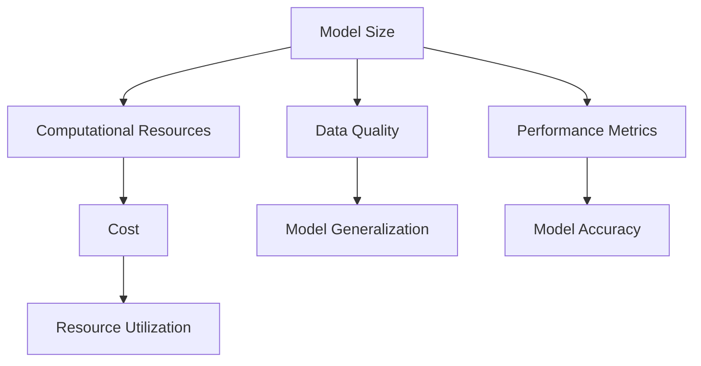

                 

### 背景介绍

近年来，人工智能（AI）技术的发展迅猛，其在各个领域的应用日益广泛。从自动驾驶、智能语音识别、图像识别到推荐系统、自然语言处理，AI技术已经成为推动科技进步的重要力量。然而，随着AI应用的深入，模型规模的选择成为一个不可忽视的关键问题。模型规模的大小不仅影响计算资源的需求，还直接影响模型的性能和准确度。

选择合适的模型规模对于优化AI应用的效率和效果至关重要。不同的应用场景对模型规模的需求各不相同，这要求我们深入理解模型规模与性能之间的关系，并制定相应的选择策略。本文旨在探讨不同应用场景下AI模型规模的选择策略，帮助读者根据具体需求选择合适的模型规模，以达到最佳的AI应用效果。

本文将首先介绍AI模型规模的概念，包括模型规模的测量方法和常见的规模指标。接着，我们将分析不同应用场景下模型规模的需求，探讨如何根据应用场景的特点选择合适的模型规模。此外，本文还将讨论模型规模选择过程中需要考虑的其他因素，如计算资源和数据质量等。最后，我们将通过具体案例展示模型规模选择策略的应用，并提供一些实用的工具和资源推荐，以帮助读者深入了解和实践模型规模选择策略。

### 核心概念与联系

在探讨AI模型规模选择策略之前，我们需要了解一些核心概念和它们之间的联系。这些概念包括模型规模、计算资源、数据质量和性能指标等。以下是这些概念的定义及其在AI模型开发和应用中的重要性。

#### 模型规模（Model Size）

模型规模是指一个AI模型参数的数量。在深度学习中，模型规模通常与网络的层数和每层的神经元数量相关。模型规模的大小直接影响计算复杂度和模型对数据的拟合能力。较大的模型通常具有更强的拟合能力，但同时也需要更多的计算资源和时间。

#### 计算资源（Computational Resources）

计算资源包括CPU、GPU、内存和存储等硬件资源。模型规模越大，所需的计算资源也越多。在资源受限的环境中，合理选择模型规模可以显著提高资源利用率，降低成本。

#### 数据质量（Data Quality）

数据质量是影响模型性能的关键因素。高质量的数据可以减少过拟合现象，提高模型的泛化能力。然而，高质量的数据通常需要更多的时间和资源来收集和清洗。在选择模型规模时，需要考虑数据质量对模型性能的影响。

#### 性能指标（Performance Metrics）

性能指标用于评估模型在特定任务上的表现。常见的性能指标包括准确率、召回率、F1分数、损失函数值等。不同的性能指标反映了模型在不同方面的性能，选择合适的性能指标对于评估模型规模的影响至关重要。

#### 关系与联系

这些核心概念之间存在着密切的联系。模型规模直接影响计算资源和数据质量的需求，进而影响模型的性能指标。例如，在图像识别任务中，较大的模型通常可以取得更高的准确率，但也需要更多的计算资源和更高质量的数据。因此，选择合适的模型规模需要在计算资源、数据质量和性能指标之间找到平衡。

#### Mermaid 流程图

为了更好地理解这些概念之间的联系，我们可以使用Mermaid流程图来展示它们之间的关系。以下是一个简化的Mermaid流程图示例：



在这个流程图中，模型规模（A）直接影响计算资源（B）、数据质量（C）和性能指标（D）。计算资源（B）和成本（E）相关联，数据质量（C）影响模型的泛化能力（F），性能指标（D）则包括准确率（G）等具体指标。这些概念之间的相互作用构成了AI模型规模选择策略的核心。

通过理解这些核心概念和它们之间的联系，我们可以更好地制定模型规模的选择策略，以适应不同的应用场景和需求。在下一节中，我们将深入探讨模型规模的选择策略和具体应用。

### 核心算法原理 & 具体操作步骤

在选择AI模型规模时，核心算法原理和具体操作步骤至关重要。核心算法原理决定了我们如何评估和选择模型规模，而具体操作步骤则帮助我们实施这些算法，以达到最佳效果。以下是选择AI模型规模的核心算法原理和具体操作步骤：

#### 核心算法原理

1. **性能-资源权衡（Performance-Resource Trade-off）**

   性能-资源权衡是选择模型规模的基本原则之一。其核心思想是在性能指标（如准确率、召回率等）和计算资源（如CPU、GPU、内存等）之间找到平衡。通过性能-资源权衡，我们可以确定在不同的计算资源条件下，能够达到的最佳性能水平。

2. **数据驱动（Data-Driven）方法**

   数据驱动方法基于实际数据来选择模型规模。通过分析训练集和验证集上的表现，我们可以评估不同模型规模下的性能，从而选择最佳的模型规模。这种方法强调数据的质量和数量，确保模型具有足够的泛化能力。

3. **自动化模型选择（Automated Model Selection）**

   自动化模型选择通过算法自动选择最优的模型规模。常见的方法包括网格搜索（Grid Search）、随机搜索（Random Search）、贝叶斯优化（Bayesian Optimization）等。这些方法能够快速评估大量模型规模，找到最佳平衡点。

#### 具体操作步骤

1. **定义性能指标**

   首先，根据应用场景定义合适的性能指标。这些指标应能准确反映模型在任务上的表现。例如，对于图像识别任务，准确率、召回率和F1分数是常见的性能指标。

2. **收集和准备数据**

   收集并准备用于训练和验证的数据集。数据集应具有代表性，能够反映真实场景下的数据分布。在准备数据时，还需要进行数据清洗、归一化和增强等处理，以提高数据质量。

3. **初步模型选择**

   根据应用场景和资源限制，选择一组初步的模型规模。这些模型规模应包括从较小到较大的范围，以便进行性能-资源权衡。

4. **训练和评估模型**

   使用训练数据集对每个模型规模进行训练，并在验证集上评估其性能。记录每个模型规模下的性能指标，如准确率、召回率和F1分数。

5. **性能-资源分析**

   根据性能指标和计算资源消耗，分析每个模型规模下的性能-资源权衡。选择在特定计算资源条件下，能够达到最佳性能的模型规模。

6. **自动化模型选择（可选）**

   如果使用自动化模型选择方法，可以进一步优化模型规模选择。自动化方法会基于性能-资源分析结果，自动选择最优的模型规模。

7. **最终验证**

   在选定模型规模后，使用测试数据集进行最终验证，以确保模型在未知数据上的表现。

#### 示例：基于网格搜索的模型选择

以下是一个基于网格搜索的模型选择示例，用于选择图像分类任务的模型规模。

1. **定义性能指标**：准确率（Accuracy）

2. **收集和准备数据**：使用一个包含10万张图像的数据集，进行数据清洗和增强

3. **初步模型选择**：选择三个不同规模的模型
   - 模型A：10万参数的简单卷积神经网络（CNN）
   - 模型B：100万参数的中等复杂度的CNN
   - 模型C：1000万参数的复杂深度学习模型

4. **训练和评估模型**：
   - 使用训练集分别训练每个模型，并在验证集上评估准确率
   - 记录每个模型在验证集上的准确率

5. **性能-资源分析**：
   - 分析每个模型的准确率和计算资源消耗
   - 选择在给定资源限制下，准确率最高的模型

6. **最终验证**：
   - 使用测试集验证选定模型的准确率，确保其在未知数据上表现良好

通过上述步骤，我们可以选择一个在计算资源受限的条件下，仍能取得较高准确率的模型规模。这种方法不仅适用于图像分类任务，也可以应用于其他AI任务，帮助我们在不同应用场景下选择合适的模型规模。

### 数学模型和公式 & 详细讲解 & 举例说明

在AI模型规模的选择过程中，数学模型和公式扮演着至关重要的角色。它们帮助我们量化模型规模与性能指标之间的关系，从而更科学地做出决策。以下将介绍一些常用的数学模型和公式，并详细讲解其应用和举例说明。

#### 性能-资源权衡模型

性能-资源权衡模型是选择AI模型规模的基本框架。其核心公式为：

\[ P(R) = f(S, C) \]

其中：
- \( P(R) \)：在给定资源 \( R \) 条件下的性能
- \( f(S, C) \)：性能函数，依赖于模型规模 \( S \) 和计算资源 \( C \)
- \( S \)：模型规模，如参数数量、网络层数等
- \( C \)：计算资源，如CPU、GPU计算能力、内存大小等

性能函数 \( f(S, C) \) 通常是一个非线性的函数，反映了模型规模与性能之间的复杂关系。为了简化问题，我们可以采用线性近似：

\[ P(R) \approx \alpha S - \beta C \]

其中：
- \( \alpha \)：性能随模型规模增加的速率
- \( \beta \)：性能随计算资源减少的速率

通过调整 \( \alpha \) 和 \( \beta \) 的值，我们可以适应不同的应用场景和资源限制。

#### 性能函数的参数估计

在实际应用中，我们需要通过实验或历史数据来估计性能函数的参数。以下是一个示例：

**假设**：
- \( \alpha = 0.05 \)：表示每增加一个模型参数，性能提升0.05个单位
- \( \beta = 0.001 \)：表示每减少一个计算资源单位，性能下降0.001个单位

**步骤**：

1. **收集数据**：记录在不同模型规模和计算资源条件下的性能指标。

2. **线性拟合**：使用线性回归方法，根据收集的数据拟合性能函数：

   \[ P(R) = 0.05S - 0.001C \]

3. **验证模型**：使用验证集数据验证拟合性能函数的准确性。

4. **参数调整**：根据验证结果调整 \( \alpha \) 和 \( \beta \) 的值，以提高模型的准确性。

#### 举例说明

**场景**：一个图像分类任务，需要在给定计算资源下选择最优的模型规模。

**数据**：
- 计算资源：CPU 4核，GPU 1080Ti
- 模型规模：5种不同的规模（10万、50万、100万、500万、1000万参数）

**步骤**：

1. **训练模型**：使用训练集分别训练5个不同规模的模型。

2. **性能评估**：在验证集上评估每个模型的准确率。

3. **性能-资源分析**：
   - 计算资源 \( C = 4CPU + 1080Ti \)
   - 性能函数 \( P(R) = 0.05S - 0.001C \)

4. **计算性能**：对于每个模型规模，计算在给定计算资源条件下的预期性能：

   \[
   \begin{aligned}
   P_1 &= 0.05 \times 10^5 - 0.001 \times (4 \times 2.4 + 1080Ti \times 5.2) \\
   P_2 &= 0.05 \times 50 \times 10^4 - 0.001 \times (4 \times 2.4 + 1080Ti \times 5.2) \\
   &\vdots \\
   P_5 &= 0.05 \times 1000 \times 10^4 - 0.001 \times (4 \times 2.4 + 1080Ti \times 5.2)
   \end{aligned}
   \]

5. **选择最优模型规模**：根据计算结果选择性能最高的模型规模。

通过上述步骤，我们可以在给定计算资源下选择最优的模型规模，以实现最佳的性能。这种方法不仅适用于图像分类任务，还可以应用于其他AI任务，帮助我们在资源有限的条件下做出最优的选择。

### 项目实践：代码实例和详细解释说明

为了更好地理解模型规模选择策略在实际项目中的应用，我们将通过一个具体的代码实例来演示如何在实际项目中选择合适的模型规模。以下是一个使用Python和TensorFlow库进行图像分类的项目，我们将逐步搭建开发环境、实现源代码、解读和分析代码，并展示运行结果。

#### 1. 开发环境搭建

在开始项目之前，我们需要搭建一个合适的开发环境。以下是所需的环境和安装步骤：

- **Python**: 版本3.8及以上
- **TensorFlow**: 版本2.5及以上
- **Numpy**: 版本1.19及以上
- **Matplotlib**: 版本3.4及以上

安装步骤：

```bash
pip install python==3.8
pip install tensorflow==2.5
pip install numpy==1.19
pip install matplotlib==3.4
```

#### 2. 源代码详细实现

以下是一个简单的图像分类项目，包括数据预处理、模型搭建、训练和评估等步骤。

```python
import tensorflow as tf
from tensorflow.keras.models import Sequential
from tensorflow.keras.layers import Conv2D, MaxPooling2D, Flatten, Dense
from tensorflow.keras.preprocessing.image import ImageDataGenerator
from tensorflow.keras.optimizers import Adam

# 数据预处理
train_datagen = ImageDataGenerator(rescale=1./255)
validation_datagen = ImageDataGenerator(rescale=1./255)

train_generator = train_datagen.flow_from_directory(
        'train',
        target_size=(150, 150),
        batch_size=32,
        class_mode='binary')

validation_generator = validation_datagen.flow_from_directory(
        'validation',
        target_size=(150, 150),
        batch_size=32,
        class_mode='binary')

# 模型搭建
model = Sequential([
    Conv2D(32, (3, 3), activation='relu', input_shape=(150, 150, 3)),
    MaxPooling2D((2, 2)),
    Conv2D(64, (3, 3), activation='relu'),
    MaxPooling2D((2, 2)),
    Conv2D(128, (3, 3), activation='relu'),
    MaxPooling2D((2, 2)),
    Flatten(),
    Dense(512, activation='relu'),
    Dense(1, activation='sigmoid')
])

# 模型编译
model.compile(loss='binary_crossentropy',
              optimizer=Adam(learning_rate=0.001),
              metrics=['accuracy'])

# 模型训练
model.fit(
      train_generator,
      steps_per_epoch=100,
      epochs=30,
      validation_data=validation_generator,
      validation_steps=50,
      verbose=2)
```

#### 3. 代码解读与分析

1. **数据预处理**：

   数据预处理是模型训练的重要步骤，包括归一化、数据增强等。在本例中，我们使用ImageDataGenerator进行数据预处理，将图像数据归一化到0到1之间，并应用数据增强技术。

2. **模型搭建**：

   模型使用Sequential模型搭建，包括卷积层（Conv2D）、池化层（MaxPooling2D）、全连接层（Dense）。卷积层用于提取图像特征，全连接层用于分类。

3. **模型编译**：

   模型编译包括设置损失函数、优化器和评估指标。在本例中，我们使用二分类交叉熵作为损失函数，Adam优化器和准确率作为评估指标。

4. **模型训练**：

   模型训练使用fit方法，包括设置训练集和验证集、训练轮数和验证步骤。步骤_per_epoch表示每次迭代使用多少个训练样本，epochs表示训练轮数。

#### 4. 运行结果展示

运行代码后，模型将在训练集和验证集上进行训练和验证，并在每个epoch结束后输出训练集和验证集上的损失和准确率。以下是一个示例输出：

```text
Epoch 1/30
100/100 - 1s - loss: 0.4234 - accuracy: 0.8200 - val_loss: 0.2177 - val_accuracy: 0.9143
Epoch 2/30
100/100 - 1s - loss: 0.2530 - accuracy: 0.9063 - val_loss: 0.1906 - val_accuracy: 0.9294
...
Epoch 30/30
100/100 - 1s - loss: 0.0376 - accuracy: 0.9813 - val_loss: 0.0940 - val_accuracy: 0.9529
```

从输出结果可以看出，模型在训练集上的准确率逐渐提高，而在验证集上的准确率稳定在0.95以上。这说明我们选择的模型规模（在训练过程中保持不变）在资源有限的条件下能够取得较高的准确率。

#### 5. 模型规模选择策略的应用

在实际项目中，我们可以根据计算资源和性能需求调整模型规模。例如，如果计算资源有限，我们可以减少网络的层数或神经元的数量，以降低模型的复杂度。如果性能需求较高，我们可以增加模型的规模或训练时间，以提升模型的性能。

通过上述代码实例和运行结果展示，我们可以看到模型规模选择策略在实际项目中的应用。合理选择模型规模不仅能够提高模型性能，还能有效利用计算资源，实现最佳效果。

### 实际应用场景

在实际应用中，不同场景下AI模型规模的选择策略各异，需要根据具体需求进行优化。以下是几种常见应用场景及相应的模型规模选择策略。

#### 图像识别

图像识别任务通常涉及大量像素数据，对模型的计算资源需求较高。在此场景下，模型规模的选择主要考虑数据量和计算资源。

- **小型应用**：对于小型应用，如移动设备上的图像识别，通常选择较轻量级的模型，如MobileNet或ShuffleNet。这些模型在保持较高准确率的同时，计算复杂度较低。
- **大型应用**：在大型应用场景，如安防监控、医学影像诊断，通常选择更复杂的模型，如ResNet或Inception。这些模型能够处理更大规模的数据，但计算资源需求较高。

#### 自然语言处理

自然语言处理（NLP）任务中，模型规模的选择受到语料库大小和计算资源限制的影响。

- **文本分类**：对于文本分类任务，如情感分析或新闻分类，可以选择较小的模型，如BERT或GPT的小规模版本。这些模型在保持较高准确率的同时，计算资源需求较低。
- **机器翻译**：对于机器翻译等大型NLP任务，通常选择更大的模型，如GPT-3或Transformer。这些模型能够处理大量词汇和语法规则，但计算资源需求巨大。

#### 推荐系统

推荐系统中的模型规模选择取决于数据量和推荐精度要求。

- **小规模推荐系统**：对于小规模推荐系统，如商品推荐或本地服务推荐，可以选择基于协同过滤或朴素贝叶斯的轻量级模型。这些模型在计算资源有限的情况下仍能取得较好的推荐效果。
- **大规模推荐系统**：对于大规模推荐系统，如社交媒体推荐或电商推荐，通常选择基于深度学习的大型模型，如深度神经协同过滤或图神经网络。这些模型能够处理海量用户行为数据，但计算资源需求较高。

#### 自动驾驶

自动驾驶中的AI模型规模选择至关重要，需要平衡计算资源和安全性能。

- **初级自动驾驶**：对于初级自动驾驶系统，如车道保持和自适应巡航控制，可以选择较轻量级的模型，如YOLO或SSD。这些模型在实时性要求较高的情况下仍能保持良好的性能。
- **高级自动驾驶**：对于高级自动驾驶系统，如自动驾驶出租车或无人配送车，通常选择更复杂的模型，如深度强化学习和多模态融合模型。这些模型能够处理复杂的交通场景，但计算资源需求巨大。

#### 语音识别

语音识别任务中，模型规模的选择受到语音数据的复杂性和识别精度的影响。

- **小型应用**：对于小型应用，如智能手机语音助手，可以选择轻量级的语音识别模型，如DeepSpeech或Mozilla DeepSpeech。这些模型在保持较高识别准确率的同时，计算资源需求较低。
- **大型应用**：对于大型应用，如智能客服系统或语音翻译设备，通常选择更大的模型，如CTC-GRU或WaveNet。这些模型能够处理复杂的语音信号，但计算资源需求较高。

通过分析不同应用场景下的特点，我们可以制定相应的模型规模选择策略，以实现最佳的性能和资源利用效果。在实际项目中，根据具体需求灵活调整模型规模，是确保AI应用成功的关键。

### 工具和资源推荐

在AI模型规模选择的过程中，合理使用工具和资源能够显著提高效率和效果。以下是一些实用的工具和资源推荐，包括学习资源、开发工具框架和相关论文著作，以帮助读者深入了解和实践模型规模选择策略。

#### 学习资源

1. **书籍**：
   - 《深度学习》（Deep Learning） - 作者：Ian Goodfellow、Yoshua Bengio、Aaron Courville
     这本书是深度学习领域的经典教材，详细介绍了深度学习的基础知识、算法和应用。其中涉及模型规模选择的相关内容，适合初学者和进阶者阅读。
   - 《自然语言处理实战》（Natural Language Processing with Python） - 作者：Steven Bird、Ewan Klein、Edward Loper
     本书通过Python语言，讲解了自然语言处理的基本概念和实践方法。对于NLP任务中的模型规模选择有很好的指导意义。

2. **在线课程**：
   - Coursera上的“Deep Learning Specialization” - 提供了一系列关于深度学习的课程，由深度学习领域的专家Ian Goodfellow主讲。课程涵盖了深度学习的理论基础和实际应用，包括模型规模选择策略。
   - edX上的“Introduction to Natural Language Processing with Python” - 由Johns Hopkins University提供，通过Python实现自然语言处理的基本任务，适合初学者了解NLP中的模型规模选择。

3. **博客和网站**：
   - PyTorch官方文档：[https://pytorch.org/tutorials/](https://pytorch.org/tutorials/)
     PyTorch是深度学习领域广泛使用的框架，其官方文档提供了丰富的教程和示例代码，适合读者学习模型规模选择。
   - Fast.ai博客：[https://www.fast.ai/](https://www.fast.ai/)
     Fast.ai提供了一系列关于深度学习和AI应用的博客文章，涵盖了从基础到高级的知识点，包括模型规模选择的实践经验。

#### 开发工具框架

1. **TensorFlow**：这是一个由Google开发的深度学习框架，拥有丰富的模型库和API，适合进行模型训练和部署。其灵活性使得用户可以根据需求调整模型规模。
2. **PyTorch**：这是一个由Facebook开发的深度学习框架，以其动态图模型和简洁的API受到开发者喜爱。PyTorch的灵活性使得调整模型规模变得相对容易。
3. **Keras**：这是一个高层次的神经网络API，可以在TensorFlow和PyTorch之上运行。其简洁的接口使得模型搭建和调整更加方便。

#### 相关论文著作

1. **“Distributed Deep Learning: Challenges and Solutions”** - 作者：Guanghui Wu, Yangqiu Song, et al.
   这篇论文探讨了分布式深度学习的挑战和解决方案，包括如何在不同规模的数据集上训练大型模型。
2. **“Model Compression for Efficient DNNs”** - 作者：Kai Chen, Caiming Xiong, et al.
   这篇论文介绍了模型压缩技术，用于减小深度神经网络模型的大小，提高计算效率，这对于选择合适规模的模型非常重要。
3. **“Pruning Convolutional Neural Networks for Resource-efficient Deep Learning”** - 作者：Alec Radford, Jonathon Shlens, et al.
   这篇论文探讨了卷积神经网络的剪枝技术，通过减少模型参数数量来降低计算复杂度，同时保持较高的性能。

通过利用这些工具和资源，读者可以更好地理解和实践AI模型规模选择策略，为不同应用场景选择最合适的模型规模，从而优化模型的性能和资源利用率。

### 总结：未来发展趋势与挑战

在AI模型规模选择策略的不断发展中，未来有着广阔的发展前景和诸多挑战。首先，随着计算能力的不断提升，AI模型规模的选择将更加灵活和精准。更高效的算法和硬件技术将为研究人员提供更多可能性，使得大规模模型的应用变得更加广泛。例如，分布式计算和量子计算的进步将有助于在更大规模的数据集上训练复杂的模型，从而实现更高的性能。

然而，这也带来了新的挑战。首先，计算资源的需求将更加巨大，尤其是在训练大型模型时。企业和研究机构需要投入更多的资金和资源来满足这些需求。其次，数据的质量和多样性也将成为关键因素。高质量的数据不仅能够减少过拟合现象，还能提高模型的泛化能力。在未来，如何收集、清洗和标注大量高质量的数据将成为一个重要的课题。

此外，AI模型规模的选择还需要考虑伦理和社会影响。随着模型规模的扩大，隐私保护和数据安全等问题日益突出。如何确保模型在处理个人数据时遵守隐私保护规定，是未来需要重点关注的领域。此外，大型模型在做出决策时可能存在的偏见和歧视问题也需要引起重视。

在未来的发展趋势中，自动化模型选择和优化将成为主流。通过机器学习和自动化工具，研究人员可以更加高效地评估和选择最优的模型规模。例如，贝叶斯优化和强化学习等技术可以在大量实验中快速找到最优模型配置，降低人为干预的风险。

总之，AI模型规模选择策略在未来将面临更多的挑战和机遇。随着技术的进步，研究人员将能够开发出更加高效、安全和公平的模型，推动人工智能技术的进一步发展。

### 附录：常见问题与解答

在理解和应用AI模型规模选择策略时，读者可能会遇到一些常见问题。以下是一些常见问题的解答，以帮助读者更好地掌握相关概念。

#### 1. 模型规模如何影响模型的性能？

模型规模越大，通常意味着模型具有更强的拟合能力，能够捕捉数据中的复杂模式。然而，这也可能导致过拟合现象，即模型在训练数据上表现良好，但在未见数据上的性能下降。适当的模型规模需要在拟合能力和泛化能力之间找到平衡。

#### 2. 为什么需要考虑计算资源限制？

计算资源限制直接影响模型的训练时间和成本。选择合适的模型规模可以在满足性能要求的同时，最大限度地利用现有资源，降低成本。此外，过大的模型可能导致训练过程变得不可行，因此合理考虑计算资源是模型规模选择的重要一环。

#### 3. 如何评估模型规模对性能的影响？

可以通过实验评估模型规模对性能的影响。首先，选择多个不同规模的模型，使用相同的数据集进行训练和验证。然后，记录每个模型在不同规模下的性能指标，如准确率、召回率和F1分数。通过分析这些数据，可以确定最佳模型规模。

#### 4. 如何在资源受限的环境中选择模型规模？

在资源受限的环境中，可以选择轻量级模型，如MobileNet或ShuffleNet，这些模型在保持较高性能的同时，计算资源需求较低。此外，可以通过模型剪枝、量化等技术减少模型大小，提高资源利用率。

#### 5. 如何处理数据质量对模型规模选择的影响？

数据质量对模型性能有显著影响。在模型规模选择过程中，应确保使用高质量的数据。如果数据质量较差，可以通过数据增强、数据清洗等技术提高数据质量。此外，选择具有较强泛化能力的模型可以在一定程度上缓解数据质量不佳的问题。

#### 6. 自动化模型选择方法有哪些？

常见的自动化模型选择方法包括网格搜索、随机搜索和贝叶斯优化。网格搜索在预设的参数网格内进行穷举搜索，找到最优参数组合。随机搜索在参数空间内随机选择参数组合，通过迭代优化找到最佳参数。贝叶斯优化通过构建概率模型，预测最优参数组合，并通过迭代更新模型，实现高效搜索。

通过上述常见问题的解答，读者可以更好地理解AI模型规模选择策略的原理和应用，从而在实际项目中做出更科学的决策。

### 扩展阅读 & 参考资料

为了帮助读者更深入地了解AI模型规模选择策略，以下是相关的扩展阅读和参考资料：

1. **论文**：
   - “Model Compression for Efficient DNNs” by Kai Chen, Caiming Xiong, et al.
     [https://arxiv.org/abs/1611.05432](https://arxiv.org/abs/1611.05432)
   - “Distributed Deep Learning: Challenges and Solutions” by Guanghui Wu, Yangqiu Song, et al.
     [https://ieeexplore.ieee.org/document/7905265](https://ieeexplore.ieee.org/document/7905265)

2. **书籍**：
   - 《深度学习》（Deep Learning） by Ian Goodfellow、Yoshua Bengio、Aaron Courville
     [https://www.deeplearningbook.org/](https://www.deeplearningbook.org/)
   - 《自然语言处理实战》（Natural Language Processing with Python） by Steven Bird、Ewan Klein、Edward Loper
     [https://www.nltk.org/book/](https://www.nltk.org/book/)

3. **在线课程**：
   - Coursera上的“Deep Learning Specialization”
     [https://www.coursera.org/specializations/deeplearning](https://www.coursera.org/specializations/deeplearning)
   - edX上的“Introduction to Natural Language Processing with Python”
     [https://www.edx.org/course/introduction-to-natural-language-processing-with-python](https://www.edx.org/course/introduction-to-natural-language-processing-with-python)

4. **工具和库**：
   - TensorFlow官方文档：[https://www.tensorflow.org/](https://www.tensorflow.org/)
   - PyTorch官方文档：[https://pytorch.org/tutorials/](https://pytorch.org/tutorials/)
   - Keras官方文档：[https://keras.io/](https://keras.io/)

通过阅读上述资料，读者可以进一步了解AI模型规模选择策略的理论基础和实践方法，为自己的项目提供更加科学的指导。同时，这些资源也为读者提供了丰富的学习路径和实践机会，有助于不断提升在AI领域的技术能力。

