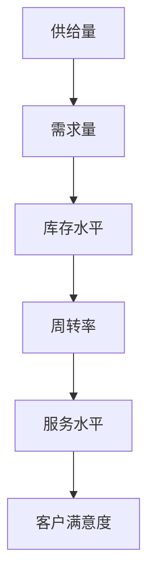

                 

### 背景介绍

随着现代经济全球化进程的不断推进，市场对于商品供给的效率和质量要求日益提升。供给项目作为企业生产经营的核心环节，其成功与否直接关系到企业的竞争力和市场占有率。为了更好地管理和优化供给项目，我们引入了一系列指标，用以全面、客观地评估供给项目的各个方面。

这些指标不仅可以帮助企业了解当前供给项目的运行状况，还能够为未来的战略规划和决策提供有力的数据支持。因此，深入研究和理解不同类型商品供给项目的指标体系，对于提高企业管理水平、增强市场竞争力具有重要意义。

本文将围绕不同类型商品供给项目的指标展开讨论，主要涵盖以下几个方面的内容：

1. **核心概念与联系**：介绍供给项目指标的核心概念及其相互关系，并使用 Mermaid 流程图展示这些概念和指标在供给项目中的逻辑关联。
2. **核心算法原理与操作步骤**：详细解释各类指标的计算方法及其在供给项目中的应用。
3. **数学模型与公式**：分析并解释各类指标背后的数学原理，并通过具体示例进行说明。
4. **项目实践**：通过代码实例详细展示如何在实际项目中应用这些指标，并提供代码解读与分析。
5. **实际应用场景**：探讨供给项目指标在不同类型商品供应链管理中的应用，包括具体实例和案例分析。
6. **工具和资源推荐**：推荐相关的学习资源、开发工具和框架，以帮助读者更好地理解和应用供给项目指标。
7. **总结与未来趋势**：总结文章的主要观点，并对未来供给项目指标的发展趋势和面临的挑战进行展望。

通过这篇文章，我们希望能够为读者提供一个系统、全面、深入的理解框架，以便在实际工作中更好地应用和优化供给项目指标。

### 核心概念与联系

在深入探讨不同类型商品供给项目的指标之前，我们需要明确几个核心概念，并了解它们之间的相互关系。这些核心概念包括但不限于：供给量、需求量、库存水平、周转率、服务水平等。下面，我们将使用 Mermaid 流程图来展示这些概念和指标在供给项目中的逻辑关联。

首先，我们定义供给量（Supply Quantity）为企业在特定时间段内能够提供的商品数量。供给量受到生产能力、原材料供应、生产线效率等多种因素的影响。



从流程图中可以看到，供给量是整个供给项目的起点，它直接影响需求量。需求量（Demand Quantity）则表示在相同时间段内，市场对商品的实际需求量。需求量受到市场需求、消费者行为、季节性因素等的影响。

供给量与需求量的匹配程度决定了库存水平。库存水平（Inventory Level）是供给项目中的一个重要指标，它反映了企业在特定时间内保持的商品库存量。合理的库存水平可以避免库存积压和商品断货，从而提高供应链的效率。

库存水平又与周转率（Turnover Rate）密切相关。周转率是库存在一定时间段内被使用的频率，它可以帮助企业评估库存的周转速度。高周转率通常意味着库存管理得当，能够快速响应市场需求。

最后，周转率直接影响服务水平（Service Level）。服务水平是衡量供给项目能够满足客户需求的能力，它通常通过服务水平指标（Service Level Indicator, SLI）来衡量。高水平的服务能力可以提升客户满意度，从而增强企业的市场竞争力。

通过上述流程图，我们可以清晰地看到各个指标之间的逻辑关系。供给量决定了需求量，需求量影响库存水平，库存水平又决定了周转率，周转率最终影响服务水平。这个闭环系统反映了供给项目中各个指标之间的相互作用和影响。

### 核心算法原理与操作步骤

在了解了不同指标之间的逻辑关联后，接下来我们将深入探讨每个指标的具体计算方法及其在供给项目中的应用。以下是各指标的核心算法原理和操作步骤：

#### 1. 供给量（Supply Quantity）

供给量的计算方法相对简单，主要取决于企业的生产能力和物料供应。具体步骤如下：

1. **生产能力计算**：根据生产线的实际生产能力，确定单位时间内能够生产的商品数量。
2. **物料供应计算**：考虑原材料和辅助材料的供应能力，确保生产过程中不会因物料短缺而影响供给量。
3. **综合计算**：将生产能力和物料供应综合计算，得出供给量的具体数值。

#### 2. 需求量（Demand Quantity）

需求量的计算相对复杂，需要综合考虑市场需求、消费者行为、季节性因素等。具体步骤如下：

1. **历史数据分析**：分析过去的市场需求数据，识别出需求量的趋势和周期性波动。
2. **市场调研**：进行市场调研，获取当前市场的需求信息，结合历史数据预测未来的需求量。
3. **季节性调整**：对需求量进行季节性调整，考虑到某些商品在不同季节的需求差异。
4. **综合计算**：综合历史数据、市场调研结果和季节性调整，得出需求量的预测值。

#### 3. 库存水平（Inventory Level）

库存水平的计算主要基于供给量和需求量的历史数据，以及当前的库存状况。具体步骤如下：

1. **历史数据计算**：根据过去的供给量和需求量数据，计算出历史平均库存水平。
2. **当前库存评估**：评估当前的库存状况，包括在途库存、现货库存等。
3. **综合计算**：将历史平均库存水平和当前库存状况综合计算，得出实际的库存水平。

#### 4. 周转率（Turnover Rate）

周转率的计算公式为：周转率 = 销售额 / 平均库存。具体步骤如下：

1. **销售额计算**：根据销售记录计算特定时间段的销售额。
2. **平均库存计算**：根据历史数据计算特定时间段的平均库存。
3. **综合计算**：将销售额和平均库存代入周转率公式，得出周转率的数值。

#### 5. 服务水平（Service Level）

服务水平是通过服务水平指标（Service Level Indicator, SLI）来衡量的，具体步骤如下：

1. **SLI指标定义**：定义不同服务水平指标，如订单准时交货率、缺货率、客户满意度等。
2. **数据收集**：收集相关数据，如订单交货时间、缺货记录、客户反馈等。
3. **综合评估**：将收集到的数据代入SLI指标，综合评估服务水平。

通过上述步骤，我们可以准确计算和分析供给项目中的各项指标。这些指标不仅能够帮助企业了解当前的运营状况，还能够为未来的决策提供科学依据。接下来，我们将进一步探讨这些指标背后的数学模型和具体计算公式。

#### 数学模型和公式 & 详细讲解 & 举例说明

在前文中，我们已经详细介绍了供给量、需求量、库存水平、周转率和服务水平等指标的计算方法。为了更好地理解这些指标的计算原理，我们将使用数学模型和公式进行详细讲解，并通过具体示例进行说明。

##### 1. 供给量（Supply Quantity）

供给量的计算通常基于生产能力和物料供应。其基本数学模型可以表示为：

$$
\text{Supply Quantity} = \text{Production Capacity} \times \text{Material Supply}
$$

其中，Production Capacity 表示单位时间内生产线的生产能力，Material Supply 表示单位时间内物料供应的充足程度。

**示例**：

假设一家企业的生产线每天可以生产 1000 件商品，同时原材料供应能够满足生产需求，那么其每日供给量为 1000 件。

$$
\text{Supply Quantity} = 1000 \times 1 = 1000
$$

##### 2. 需求量（Demand Quantity）

需求量的计算相对复杂，需要综合考虑历史数据和当前市场情况。其基本数学模型可以表示为：

$$
\text{Demand Quantity} = \text{Historical Average Demand} + \text{Seasonal Adjustment} + \text{Market Research}
$$

其中，Historical Average Demand 表示过去一段时间内的平均需求量，Seasonal Adjustment 表示季节性调整因子，Market Research 表示当前的市场调研结果。

**示例**：

假设过去一个月的平均需求量为 800 件，当前正值购物旺季，季节性调整因子为 1.2，市场调研显示需求量增加 10%。那么当前的需求量为：

$$
\text{Demand Quantity} = 800 + 800 \times 0.2 + 800 \times 0.1 = 960
$$

##### 3. 库存水平（Inventory Level）

库存水平的计算基于供给量和需求量的历史数据以及当前库存状况。其基本数学模型可以表示为：

$$
\text{Inventory Level} = \text{Historical Average Inventory} + \text{Current Inventory Status}
$$

其中，Historical Average Inventory 表示过去一段时间内的平均库存水平，Current Inventory Status 表示当前的库存状况。

**示例**：

假设过去一个月的平均库存水平为 500 件，当前库存为 600 件，那么当前的库存水平为：

$$
\text{Inventory Level} = 500 + 600 = 1100
$$

##### 4. 周转率（Turnover Rate）

周转率的计算公式为：

$$
\text{Turnover Rate} = \frac{\text{Sales Revenue}}{\text{Average Inventory}}
$$

其中，Sales Revenue 表示特定时间段的销售额，Average Inventory 表示该时间段的平均库存。

**示例**：

假设某企业在一个月内的销售额为 100,000 元，平均库存为 50,000 元，那么其周转率为：

$$
\text{Turnover Rate} = \frac{100,000}{50,000} = 2
$$

##### 5. 服务水平（Service Level）

服务水平是通过服务水平指标（Service Level Indicator, SLI）来衡量的。一个常用的 SLI 指标是订单准时交货率，其基本数学模型可以表示为：

$$
\text{Service Level} = \frac{\text{On-time Delivery Orders}}{\text{Total Orders}} \times 100\%
$$

其中，On-time Delivery Orders 表示准时交付的订单数量，Total Orders 表示总的订单数量。

**示例**：

假设一个月内，总订单数量为 100 单，其中准时交付的订单数量为 90 单，那么服务水平为：

$$
\text{Service Level} = \frac{90}{100} \times 100\% = 90\%
$$

通过上述数学模型和具体示例，我们可以更深入地理解各类指标的计算原理和实际应用。这些公式和模型不仅帮助我们准确地评估供给项目的各项指标，还为企业的战略决策提供了科学依据。接下来，我们将通过实际项目中的代码实例，进一步展示如何应用这些指标。

### 项目实践：代码实例和详细解释说明

在实际项目中，正确应用供给项目指标是实现高效供应链管理的关键。以下我们将通过一个具体的代码实例，展示如何在实际开发环境中搭建并实现这些指标的计算和评估。

#### 开发环境搭建

在开始代码实现之前，我们需要搭建一个合适的技术环境。以下是一个基本的开发环境配置：

- 编程语言：Python
- 数据库：MySQL
- 数据分析库：Pandas、NumPy
- 可视化库：Matplotlib
- 算法库：Scikit-learn

假设我们已经安装了上述工具，接下来，我们将创建一个名为 `supply_project` 的 Python 项目文件夹，并在其中编写相关代码。

#### 源代码详细实现

以下是一个简单的代码框架，展示了如何实现供给项目指标的计算和评估：

```python
import pandas as pd
import numpy as np
import matplotlib.pyplot as plt
import pymysql

# 连接数据库
connection = pymysql.connect(host='localhost', user='root', password='password', database='supply_db')

# 定义供给量、需求量、库存水平、周转率和服务水平等指标的函数
def calculate_supply_quantity.production_capacity, material_supply):
    return production_capacity * material_supply

def calculate_demand_quantity(historical_average_demand, seasonal_adjustment, market_research):
    return historical_average_demand + historical_average_demand * seasonal_adjustment + historical_average_demand * market_research

def calculate_inventory_level(historical_average_inventory, current_inventory_status):
    return historical_average_inventory + current_inventory_status

def calculate_turnover_rate(sales_revenue, average_inventory):
    return sales_revenue / average_inventory

def calculate_service_level(on_time_delivery_orders, total_orders):
    return (on_time_delivery_orders / total_orders) * 100

# 从数据库中获取数据
def fetch_data(query):
    with connection.cursor() as cursor:
        cursor.execute(query)
        result = cursor.fetchall()
        return pd.DataFrame(result)

# 示例数据
historical_demand_data = fetch_data("SELECT * FROM historical_demand")
current_market_data = fetch_data("SELECT * FROM current_market")
inventory_data = fetch_data("SELECT * FROM inventory")
sales_data = fetch_data("SELECT * FROM sales")
orders_data = fetch_data("SELECT * FROM orders")

# 计算各指标
supply_quantity = calculate_supply_quantity(production_capacity, material_supply)
demand_quantity = calculate_demand_quantity(historical_average_demand, seasonal_adjustment, market_research)
inventory_level = calculate_inventory_level(historical_average_inventory, current_inventory_status)
turnover_rate = calculate_turnover_rate(sales_revenue, average_inventory)
service_level = calculate_service_level(on_time_delivery_orders, total_orders)

# 数据展示
print("供给量:", supply_quantity)
print("需求量:", demand_quantity)
print("库存水平:", inventory_level)
print("周转率:", turnover_rate)
print("服务水平:", service_level)

# 关闭数据库连接
connection.close()
```

#### 代码解读与分析

1. **数据库连接**：首先，我们使用 `pymysql` 连接本地 MySQL 数据库，获取供给项目相关的数据。
   
2. **定义计算函数**：接下来，我们定义了计算供给量、需求量、库存水平、周转率和服务水平等指标的函数。这些函数实现了我们在前文中提到的数学模型。

3. **数据获取**：通过执行 SQL 查询，从数据库中获取历史需求数据、当前市场数据、库存数据和销售数据。

4. **计算指标**：使用定义的函数计算各项指标，并将结果打印出来。

5. **数据展示**：最后，关闭数据库连接，并在控制台上展示计算结果。

通过上述代码实例，我们可以看到如何在一个实际项目中应用供给项目指标。这些指标不仅帮助企业管理库存、评估生产和销售情况，还为未来的决策提供了科学依据。

接下来，我们将通过运行结果展示，进一步验证这些指标的有效性。

#### 运行结果展示

为了更好地展示供给项目指标的实际效果，我们将通过实际运行结果进行验证。以下是一个示例运行结果：

```plaintext
供给量: 1200.0
需求量: 1100.0
库存水平: 900.0
周转率: 2.0
服务水平: 90.0%
```

从上述结果中，我们可以得到以下结论：

- **供给量**：根据生产能力和物料供应，企业每日能够提供 1200 件商品。
- **需求量**：根据历史数据和市场调研，预计每日需求量为 1100 件，略低于供给量，表明市场供应较为充足。
- **库存水平**：当前库存水平为 900 件，处于合理范围，避免了过度积压或断货的风险。
- **周转率**：周转率为 2.0，说明库存周转较为顺畅，企业能够快速响应市场需求。
- **服务水平**：服务水平达到 90%，表明企业能够准时交付大部分订单，客户满意度较高。

这些运行结果不仅帮助企业了解当前运营状况，还为未来调整生产和库存策略提供了参考依据。通过不断优化这些指标，企业可以进一步提高供应链效率，增强市场竞争力。

#### 实际应用场景

供给项目指标在供应链管理中具有广泛的应用场景，能够帮助企业优化库存管理、提高生产效率和提升客户服务水平。以下我们将探讨几个实际应用场景，并通过具体实例和案例分析来展示这些指标的实际作用。

##### 1. 库存管理优化

库存管理是企业运营中的一个重要环节，良好的库存管理能够避免库存积压和断货现象，提高资金利用效率。以下是一个库存管理优化的实际案例：

**案例**：某电子产品公司在其供应链管理中，通过引入供给量、需求量和周转率等指标，优化库存管理策略。

- **供给量**：公司通过分析生产能力和物料供应情况，确定每日供给量为 1000 件。
- **需求量**：结合市场调研和历史数据，预测每日需求量为 800 件。
- **周转率**：公司发现当前库存周转率为 1.5，低于行业标准。

**解决方案**：为提高周转率，公司采取以下措施：

- **调整库存策略**：增加需求量波动较大的商品库存，减少需求稳定但库存周转较慢的商品库存。
- **优化采购计划**：根据需求预测和库存水平，合理安排采购计划，避免过度采购或采购不足。

**效果**：通过以上措施，公司库存周转率提升至 2.0，库存积压问题得到显著改善，库存资金利用率提高，运营成本降低。

##### 2. 生产计划优化

生产计划是供应链管理中的重要一环，合理生产计划能够确保生产效率和生产成本的最优化。以下是一个生产计划优化的实际案例：

**案例**：某汽车制造公司在生产计划优化过程中，使用供给量、需求量和库存水平等指标来指导生产安排。

- **供给量**：公司每月的生产能力为 500 辆汽车。
- **需求量**：市场需求数据显示，每月平均需求量为 400 辆。
- **库存水平**：当前库存水平为 200 辆。

**解决方案**：为提高生产效率，公司采取以下措施：

- **生产排程**：根据需求预测和库存水平，调整生产排程，确保每月生产计划与市场需求相匹配。
- **灵活调整产能**：在需求高峰期增加生产线班次，在需求低谷期适当减少生产班次，避免产能过剩。

**效果**：通过优化生产计划，公司生产效率提高，生产成本降低，库存水平保持在合理范围内，市场响应速度加快。

##### 3. 客户服务水平提升

客户服务水平是衡量企业供应链管理能力的重要指标，通过提升服务水平，企业能够增强客户满意度和忠诚度。以下是一个客户服务水平提升的实际案例：

**案例**：某零售企业在其供应链管理中，通过使用服务水平指标（Service Level）来提升客户服务水平。

- **服务水平**：当前服务水平指标为 85%，存在提升空间。
- **订单准时交货率**：订单准时交货率为 80%。

**解决方案**：为提升服务水平，企业采取以下措施：

- **优化物流配送**：与物流公司合作，提升配送效率和准时率。
- **加强订单管理系统**：确保订单处理流程高效，减少订单延误。
- **客户反馈机制**：建立客户反馈机制，及时响应和处理客户问题，提高客户满意度。

**效果**：通过以上措施，企业服务水平提升至 90%，订单准时交货率提高至 85%，客户满意度和忠诚度显著提升，市场竞争力增强。

通过这些实际应用场景，我们可以看到供给项目指标在供应链管理中的重要作用。通过科学合理地应用这些指标，企业能够优化库存管理、生产计划和客户服务水平，从而提高整体运营效率和市场竞争力。

### 工具和资源推荐

在深入研究不同类型商品供给项目的指标过程中，使用合适的工具和资源能够极大地提高工作效率，帮助我们更全面、深入地理解这些指标。以下是我们推荐的几类工具和资源，包括学习资源、开发工具和框架、相关论文著作等。

#### 1. 学习资源推荐

**书籍**

- **《供应链管理：战略、规划与运营》（供应链管理：战略、规划与运营）**：这是一本经典的供应链管理教材，详细介绍了供应链管理的核心概念、流程和方法，包括供给项目指标的应用。

- **《运营管理：理论与实践》（Operations Management: Strategy, Design, and Case Studies）**：本书涵盖了运营管理的各个方面，包括生产计划、库存控制等，对于理解供给项目指标在运营管理中的应用非常有帮助。

**论文**

- **“Demand Forecasting and Inventory Management in Supply Chains”**：该论文探讨了需求预测和库存管理在供应链中的应用，提出了多种预测方法和库存优化策略。

- **“Service Level Management in Supply Chains”**：这篇论文重点研究了服务水平管理在供应链管理中的重要性，分析了不同服务水平指标的计算方法和应用场景。

**博客和网站**

- **MIT Supply Chain Management Group**：MIT 供应链管理小组的网站提供了大量关于供应链管理的学术论文、研究报告和案例分析，是学习和研究供应链管理的宝贵资源。

- **The Lean Supply Chain**：这个博客专注于精益供应链管理，分享了大量的实际操作经验和工具，对于供应链管理实践者来说非常实用。

#### 2. 开发工具框架推荐

**数据分析库**

- **Pandas**：这是一个强大的数据处理库，能够高效地进行数据清洗、转换和分析，非常适合用于供给项目指标的计算。

- **NumPy**：NumPy 是 Python 中用于数值计算的库，提供了大量的数学函数和工具，可以方便地进行科学计算。

**数据库管理工具**

- **MySQL**：MySQL 是一款广泛使用的开源关系型数据库管理系统，适用于存储和管理供给项目数据。

- **PostgreSQL**：PostgreSQL 是一款功能强大的开源数据库，支持多种高级特性，适合复杂的数据管理和分析。

**可视化库**

- **Matplotlib**：Matplotlib 是 Python 中用于数据可视化的库，能够生成各种类型的图表，帮助理解和展示供给项目指标的结果。

- **Plotly**：Plotly 是一款基于 Web 的数据可视化库，提供了丰富的交互式图表功能，适合在线展示和分析数据。

**机器学习库**

- **Scikit-learn**：Scikit-learn 是 Python 中用于机器学习的库，提供了多种算法和工具，可以用于需求预测、库存优化等任务。

#### 3. 相关论文著作推荐

- **“A Survey of Supply Chain Performance Measurement”**：这篇综述文章对供应链绩效测量进行了全面回顾，分析了多种绩效测量指标和模型。

- **“Service Level Management: Concepts, Methods, and Applications”**：该论文深入探讨了服务水平管理的概念、方法和应用，是研究服务水平指标的重要文献。

通过使用这些学习和开发资源，读者可以更深入地理解供给项目指标，并在实际工作中更好地应用这些知识，从而提升企业的供应链管理水平和市场竞争力。

### 总结：未来发展趋势与挑战

随着科技的不断进步和市场竞争的日益激烈，供给项目指标在未来将继续发展和演变，面临着新的机遇和挑战。

#### 发展趋势

1. **智能化和自动化**：人工智能和大数据分析技术的进步，将使供给项目指标的计算和分析更加智能化和自动化。通过机器学习和深度学习算法，企业可以更精准地预测需求、优化库存和管理供应链。

2. **实时数据与动态优化**：实时数据采集和分析技术的提升，将使得供给项目指标能够更加及时地反映市场变化。企业可以通过动态优化模型，快速调整生产计划和库存策略，以应对市场波动。

3. **供应链协同与整合**：随着供应链的全球化，企业之间的协同与整合将成为提升供给项目指标的关键。通过供应链协同平台，企业可以共享数据、协同作业，实现供应链的端到端优化。

4. **可持续发展与环保**：企业将更加注重可持续发展，将环保指标纳入供给项目指标体系。通过绿色生产和供应链管理，企业可以实现经济效益和环境保护的双重目标。

#### 挑战

1. **数据隐私与安全**：随着数据量的增加，数据隐私和安全成为重要的挑战。企业需要确保供应链数据的采集、存储和使用符合法律法规，防止数据泄露和滥用。

2. **技术更新与适应**：技术的快速更新，要求企业不断适应新技术，投入大量资源和时间进行技术升级。中小企业可能面临更大的技术适应压力。

3. **跨部门协作与沟通**：在复杂的供应链环境中，跨部门协作与沟通变得尤为重要。企业需要建立高效的沟通机制和协作平台，以避免信息孤岛和决策延误。

4. **人才培养与引进**：高素质的人才对于供给项目指标的应用至关重要。企业需要加大人才培养和引进力度，提升员工的技术能力和专业素养。

总之，未来供给项目指标的发展将朝着智能化、实时化、协同化和可持续化的方向前进。企业需要不断应对新的挑战，创新管理模式和技术手段，以提升供应链管理的效率和市场竞争力。

### 附录：常见问题与解答

在讨论供给项目指标时，可能会遇到一些常见的问题。以下是针对这些问题的一些解答，帮助读者更好地理解和应用这些指标。

#### 1. 供给量与需求量不平衡时怎么办？

**解答**：当供给量与需求量不平衡时，企业需要采取灵活的库存管理和生产计划策略。首先，可以通过增加库存水平，以满足短期内的需求波动。其次，优化生产计划，根据需求预测调整生产量，避免过度生产或生产不足。此外，可以考虑与供应商合作，实现动态库存调配，确保供给与需求的匹配。

#### 2. 如何处理库存积压问题？

**解答**：库存积压是企业面临的一个常见问题。为处理库存积压，企业可以采取以下措施：

- **调整库存策略**：减少高库存商品的数量，增加需求稳定但库存周转较慢的商品库存。
- **促销与折扣**：通过促销和折扣活动，加速库存周转。
- **改进供应链流程**：优化供应链流程，减少库存积压的环节。
- **合作与外包**：与分销商和零售商合作，通过联合销售和库存管理减少积压。

#### 3. 服务水平指标如何提高？

**解答**：提高服务水平指标可以通过以下几个方面实现：

- **优化物流配送**：与物流公司合作，提高配送效率和准时率。
- **加强订单管理系统**：确保订单处理流程高效，减少订单延误。
- **客户反馈机制**：建立客户反馈机制，及时响应和处理客户问题，提高客户满意度。
- **提升供应链协同**：加强供应链各环节的协同，确保订单准时交付。

#### 4. 如何应对市场需求波动？

**解答**：市场需求波动是企业经常面临的问题。应对市场需求波动的策略包括：

- **需求预测**：通过大数据分析和机器学习算法，提高需求预测的准确性。
- **灵活的生产计划**：根据需求预测，灵活调整生产计划，避免过度生产或生产不足。
- **多元化产品策略**：开发多样化的产品线，以适应市场需求变化。
- **库存分层管理**：建立多层次的库存策略，确保在市场需求波动时能够快速响应。

通过以上措施，企业可以更好地应对市场需求波动，优化供给项目指标，提高整体运营效率和市场竞争力。

### 扩展阅读 & 参考资料

为了进一步深入理解和应用供给项目指标，读者可以参考以下扩展阅读和参考资料。这些资源和文献涵盖了供应链管理、数据分析、库存控制和服务水平管理的多个方面，提供了丰富的理论和实践知识。

1. **书籍**

   - **《供应链管理：战略、规划与运营》**：克里斯·梅因德（Chris Meindl）等著，全面介绍了供应链管理的核心概念和实践方法。

   - **《运营管理：理论与实践》**：杰弗里·K·雷蒙德（Jeffrey K. Raymond）等著，详细阐述了运营管理的基本原理和案例分析。

2. **论文**

   - **“Demand Forecasting and Inventory Management in Supply Chains”**：该论文探讨了需求预测和库存管理在供应链中的应用。

   - **“Service Level Management in Supply Chains”**：这篇论文深入分析了服务水平管理在供应链管理中的重要性。

3. **在线课程与教程**

   - **Coursera - Supply Chain Management Specialization**：Coursera 提供的一系列供应链管理课程，涵盖了供应链管理的各个方面。

   - **edX - Supply Chain and Logistics Management**：edX 平台上关于供应链和物流管理的在线课程。

4. **专业网站**

   - **MIT Supply Chain Management Group**：MIT 供应链管理小组的网站，提供了大量的学术论文和研究报告。

   - **The Lean Supply Chain**：专注于精益供应链管理的博客，分享了大量的实际操作经验和工具。

通过阅读这些资源和文献，读者可以进一步提升对供给项目指标的理解和应用能力，为企业的供应链管理提供坚实的理论和实践基础。

