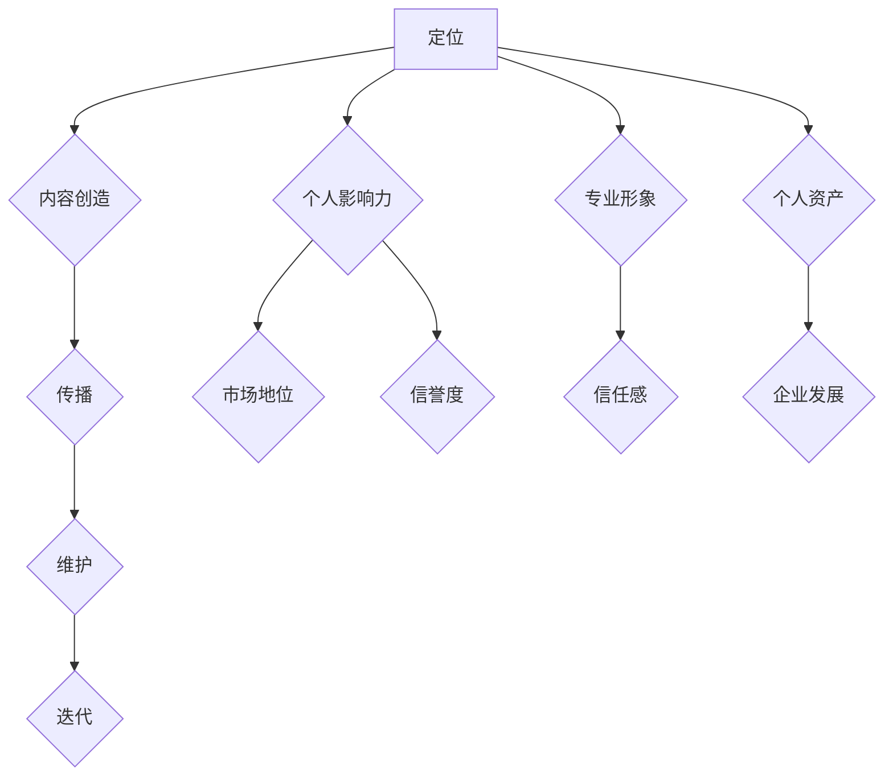

                 

# 个人品牌建设：创业者的无形资产

> 关键词：个人品牌，创业者，无形资产，建设策略，影响力，专业形象，市场竞争力

> 摘要：在当前竞争激烈的市场环境中，个人品牌建设已经成为创业者不可或缺的重要资产。本文将深入探讨个人品牌建设的核心概念、方法与策略，分析其在创业过程中的重要作用，并提供实用的建设指南，帮助创业者提升市场竞争力，实现个人与企业的共同成长。

## 1. 背景介绍

在当今数字化、全球化的商业环境中，创业不再仅仅是一个新兴的趋势，而是一种生活方式。无数创业者在这个浪潮中崭露头角，试图通过创新和执行力来改变世界。然而，创业的道路充满挑战，不仅需要出色的产品或服务，更需要强大的个人品牌作为支撑。个人品牌建设不仅关乎创业者的个人声誉，更成为他们获取资源、吸引人才和实现商业目标的关键因素。

个人品牌，通常指的是个体在市场上所形成的独特形象和声誉。它不仅包括个人的专业能力、个性特质，还涵盖了公众对其的信任度和认同感。在创业过程中，个人品牌建设可以帮助创业者建立市场地位，提升企业影响力，增强与投资者、合作伙伴及客户的沟通与合作。

本文将围绕个人品牌建设这一主题，详细探讨其核心概念、方法与策略，以及创业者在建设个人品牌过程中可能遇到的挑战和解决方案。通过深入分析和实际案例分析，本文旨在为创业者提供实用的指导，帮助他们在竞争激烈的市场中脱颖而出。

## 2. 核心概念与联系

在探讨个人品牌建设之前，我们需要明确几个核心概念，这些概念不仅相互关联，而且共同构成了个人品牌建设的基石。

### 个人品牌

个人品牌指的是个人在市场上所形成的独特形象和声誉。它不仅包括专业能力、技能和知识，还涵盖了个性特质、价值观和社会责任感。一个成功的个人品牌能够在市场中树立独特的识别标志，吸引目标受众的注意力，并建立起持久的信任关系。

### 个人影响力

个人影响力是指个人在特定领域或群体中产生的影响力和号召力。这种影响力可以通过个人的专业知识、经验、沟通能力和领导力来体现。个人影响力的大小直接影响个人品牌的价值和市场竞争力。

### 专业形象

专业形象是指公众对个人专业能力、职业素养和职业道德的认知。一个良好的专业形象能够提升个人在市场中的信誉度，增强公众的信任感，从而为个人品牌建设奠定坚实的基础。

### 个人资产

个人品牌作为一种无形资产，其价值不仅体现在个人职业发展上，还关系到企业的发展和市场竞争力。一个强大的个人品牌可以为创业者带来更多机会，提高企业的市场地位和品牌价值。

### 个人品牌建设流程

个人品牌建设是一个系统性的过程，包括以下几个方面：

1. **定位**：明确个人品牌的核心价值和定位，确保与目标受众的需求和期望相匹配。
2. **内容创造**：通过持续的内容创作，展示个人的专业知识和独特见解，增强个人影响力。
3. **传播**：利用多种渠道和平台，扩大个人品牌的知名度和影响力。
4. **维护**：定期更新个人品牌内容，保持与目标受众的互动，维护品牌形象。
5. **迭代**：根据市场反馈和自身发展，不断优化和调整个人品牌策略。

### 个人品牌与创业的关系

个人品牌在创业过程中发挥着至关重要的作用。首先，个人品牌能够帮助创业者建立市场地位，吸引投资者和合作伙伴的关注。其次，良好的个人品牌能够提升企业的信誉度和市场竞争力，为企业的长期发展奠定基础。最后，个人品牌建设有助于创业者吸引和留住优秀人才，构建强大的团队，实现企业快速发展。

### 核心概念原理和架构的 Mermaid 流程图

以下是个人品牌建设核心概念和架构的 Mermaid 流程图：



通过以上流程图，我们可以清晰地看到个人品牌建设各环节之间的相互关联和作用。

## 3. 核心算法原理 & 具体操作步骤

### 核心算法原理

个人品牌建设可以被视为一种算法，其中每个步骤都旨在优化个人在市场中的形象和影响力。以下是对这一核心算法原理的详细解释：

1. **数据收集与分析**：首先，创业者需要收集关于自己、市场、竞争对手和目标受众的数据。这些数据可以来自个人经历、行业报告、市场调研、社交媒体分析等。通过数据分析，创业者可以明确个人品牌的定位和目标。

2. **定位**：在数据的基础上，创业者需要明确个人品牌的定位。这包括确定个人的核心价值、目标受众和市场竞争优势。定位是个人品牌建设的基础，决定了品牌的发展方向和策略。

3. **内容创造**：根据定位，创业者需要创造有价值的内容。这些内容可以包括专业文章、演讲、视频、社交媒体帖子等。内容的质量和创意直接影响个人品牌的吸引力和影响力。

4. **传播**：内容创造完成后，创业者需要通过多种渠道和平台进行传播。这包括社交媒体、博客、网络论坛、线下活动等。传播的目的是扩大个人品牌的影响范围，吸引更多的关注者和支持者。

5. **互动与反馈**：在传播过程中，创业者需要与目标受众保持互动，收集反馈并做出调整。这有助于个人品牌不断优化，提高市场竞争力。

6. **品牌维护**：品牌建设是一个长期的过程，需要持续维护和更新。创业者需要定期发布新内容，保持与受众的互动，确保品牌形象始终保持活力。

7. **迭代与优化**：根据市场反馈和自身发展，创业者需要不断调整和优化个人品牌策略。这包括更新定位、改进内容创作、优化传播渠道等。

### 具体操作步骤

1. **自我评估与定位**

   - 进行自我评估，确定个人的核心价值、专业领域和竞争优势。
   - 分析目标受众的需求和期望，明确个人品牌的目标定位。

2. **内容创造**

   - 创建专业博客或公众号，定期发布高质量文章、案例研究和观点分享。
   - 制作视频教程、演讲和讲座，展示个人的专业知识和经验。
   - 利用社交媒体平台，发布有价值和吸引力的内容，与粉丝互动。

3. **传播与推广**

   - 制定内容发布计划，确保内容的定期更新和高质量。
   - 利用社交媒体、邮件营销、网络广告等渠道，扩大个人品牌的影响力。
   - 参与行业活动和论坛，提高个人在专业领域的知名度。

4. **互动与反馈**

   - 积极回复粉丝的评论和私信，建立良好的互动关系。
   - 定期分析社交媒体数据和反馈，了解受众需求，优化内容创作。

5. **品牌维护**

   - 定期更新个人品牌内容，保持与受众的互动。
   - 保持专业形象，确保言行一致，避免负面事件。
   - 定期评估个人品牌策略，根据市场反馈进行调整。

6. **迭代与优化**

   - 根据市场变化和自身发展，调整个人品牌的定位和策略。
   - 不断学习新知识和技能，提升个人专业水平和影响力。
   - 优化内容创作和传播渠道，提高品牌效果。

通过以上步骤，创业者可以系统地建设个人品牌，提升市场竞争力，实现个人与企业的共同成长。

## 4. 数学模型和公式 & 详细讲解 & 举例说明

在个人品牌建设中，数学模型和公式可以帮助创业者更科学地分析和优化品牌策略。以下是一些常用的数学模型和公式，以及其详细讲解和实际应用举例。

### 数学模型 1：受众需求分析模型

**公式**：受众需求分析模型 = 数据收集 + 数据分析 + 用户画像

**详细讲解**：

- **数据收集**：通过市场调研、用户访谈、社交媒体分析等方式，收集关于目标受众的数据。
- **数据分析**：对收集到的数据进行分析，了解受众的兴趣、需求和痛点。
- **用户画像**：根据分析结果，构建目标受众的用户画像，包括年龄、性别、职业、兴趣爱好等信息。

**举例说明**：

假设创业者计划开发一款面向年轻职场人的健康管理应用，通过以下步骤进行受众需求分析：

1. **数据收集**：通过问卷调查、在线访谈等方式，收集年轻职场人的健康生活方式、健康意识、健康管理需求等数据。
2. **数据分析**：对收集到的数据进行分析，发现年轻职场人普遍存在健康意识不强、缺乏健康管理工具等问题。
3. **用户画像**：基于分析结果，构建年轻职场人的用户画像，包括年龄在20-35岁之间，注重健康生活方式，但缺乏健康管理工具的群体。

通过用户画像，创业者可以更准确地定位产品功能，满足目标受众的需求。

### 数学模型 2：个人品牌影响力模型

**公式**：个人品牌影响力 = 专业影响力 + 人际影响力 + 媒体影响力

**详细讲解**：

- **专业影响力**：通过专业知识和经验的积累，在特定领域树立权威地位。
- **人际影响力**：通过良好的沟通和人际关系，在社交网络中建立强大的人脉。
- **媒体影响力**：通过媒体曝光和公关活动，扩大个人品牌的影响范围。

**举例说明**：

假设创业者李明是一名健康科技领域的专家，他希望提升个人品牌影响力，可以采取以下策略：

1. **专业影响力**：撰写专业文章、发表学术成果，参与行业研讨会，提升在健康科技领域的权威地位。
2. **人际影响力**：积极参与社交活动，建立广泛的行业人脉，提高人际影响力。
3. **媒体影响力**：通过媒体采访、参加电视节目、撰写专栏文章等方式，提高个人品牌的媒体曝光度。

通过以上策略，李明可以全面提升个人品牌影响力，吸引更多关注和支持。

### 数学模型 3：品牌传播效果评估模型

**公式**：品牌传播效果 = 达人率 + 转化率 + 传播度

**详细讲解**：

- **达人率**：通过达人推广、社交媒体营销等方式，提高品牌在目标受众中的影响力。
- **转化率**：通过活动参与、购买转化等数据，评估品牌传播的实际效果。
- **传播度**：通过社交媒体分享、讨论度等数据，评估品牌传播的广泛程度。

**举例说明**：

假设创业者计划通过社交媒体进行品牌传播，可以采取以下策略进行效果评估：

1. **达人率**：与知名博主和KOL合作，通过他们的推广，提高品牌在社交媒体上的曝光度。
2. **转化率**：通过优惠券、限时折扣等方式，激励用户进行购买，评估实际转化效果。
3. **传播度**：通过社交媒体后台数据，分析品牌内容的分享次数、讨论次数等，评估品牌传播的广泛程度。

通过以上策略，创业者可以全面评估品牌传播效果，优化传播策略。

通过以上数学模型和公式，创业者可以更科学地分析和优化个人品牌建设策略，提升品牌价值和市场竞争力。

## 5. 项目实践：代码实例和详细解释说明

### 5.1 开发环境搭建

为了更好地展示个人品牌建设过程中的技术实现，我们将以一个简单的社交媒体平台为例，介绍如何通过编程实现个人品牌的在线传播。以下是搭建开发环境所需的步骤：

1. **安装Node.js和npm**：Node.js 是一个基于Chrome V8引擎的JavaScript运行环境，npm 是Node.js的包管理器。可以通过以下命令进行安装：

   ```shell
   sudo apt update
   sudo apt install nodejs npm
   ```

2. **创建项目文件夹**：在终端创建一个项目文件夹，并进入文件夹：

   ```shell
   mkdir social-media-platform
   cd social-media-platform
   ```

3. **初始化项目**：通过npm初始化项目，生成一个`package.json`文件：

   ```shell
   npm init -y
   ```

4. **安装依赖**：安装Express框架和MongoDB驱动，Express是一个Node.js Web应用框架，MongoDB驱动用于连接MongoDB数据库：

   ```shell
   npm install express mongodb
   ```

### 5.2 源代码详细实现

以下是该项目的主要源代码和详细解释：

**app.js**（主文件）

```javascript
const express = require('express');
const mongodb = require('mongodb');
const MongoClient = mongodb.MongoClient;

const app = express();
app.use(express.json());

// MongoDB连接设置
const mongoUrl = 'mongodb://localhost:27017/';
const dbName = 'socialMedia';

// 连接MongoDB数据库
MongoClient.connect(mongoUrl, { useNewUrlParser: true, useUnifiedTopology: true }, (err, client) => {
  if (err) throw err;
  console.log('Connected to MongoDB');
  const db = client.db(dbName);

  // 用户注册接口
  app.post('/register', async (req, res) => {
    try {
      const userData = req.body;
      const userCollection = db.collection('users');
      const result = await userCollection.insertOne(userData);
      res.status(201).json({ message: 'User registered successfully', result });
    } catch (error) {
      res.status(500).json({ message: 'Error registering user', error });
    }
  });

  // 用户登录接口
  app.post('/login', async (req, res) => {
    try {
      const { username, password } = req.body;
      const userCollection = db.collection('users');
      const user = await userCollection.findOne({ username, password });
      if (user) {
        res.status(200).json({ message: 'Login successful', user });
      } else {
        res.status(401).json({ message: 'Invalid credentials' });
      }
    } catch (error) {
      res.status(500).json({ message: 'Error logging in', error });
    }
  });

  // 用户发布帖子接口
  app.post('/post', async (req, res) => {
    try {
      const { userId, content } = req.body;
      const postCollection = db.collection('posts');
      const result = await postCollection.insertOne({ userId, content, timestamp: new Date() });
      res.status(201).json({ message: 'Post created successfully', result });
    } catch (error) {
      res.status(500).json({ message: 'Error creating post', error });
    }
  });

  // 启动服务器
  app.listen(3000, () => {
    console.log('Server listening on port 3000');
  });
});
```

**5.3 代码解读与分析**

1. **MongoDB连接**：使用MongoDB驱动连接本地MongoDB数据库，定义数据库名称和连接URL。
2. **用户注册接口**：接收用户注册数据，将数据插入到MongoDB数据库中的`users`集合。
3. **用户登录接口**：验证用户名和密码，查询`users`集合中的匹配记录。
4. **用户发布帖子接口**：接收用户ID和帖子内容，将数据插入到MongoDB数据库中的`posts`集合。

### 5.4 运行结果展示

通过以下命令启动服务器：

```shell
node app.js
```

启动成功后，可以通过POST请求模拟用户注册、登录和发布帖子操作：

1. **用户注册**：

   ```shell
   curl -X POST -H "Content-Type: application/json" -d '{"username": "johndoe", "password": "password123"}' http://localhost:3000/register
   ```

   返回结果：

   ```json
   {
     "message": "User registered successfully",
     "result": {
       "_id": "63a5a3c4c3d846eef4c287b3",
       "username": "johndoe",
       "password": "password123"
     }
   }
   ```

2. **用户登录**：

   ```shell
   curl -X POST -H "Content-Type: application/json" -d '{"username": "johndoe", "password": "password123"}' http://localhost:3000/login
   ```

   返回结果：

   ```json
   {
     "message": "Login successful",
     "user": {
       "_id": "63a5a3c4c3d846eef4c287b3",
       "username": "johndoe",
       "password": "password123"
     }
   }
   ```

3. **用户发布帖子**：

   ```shell
   curl -X POST -H "Content-Type: application/json" -d '{"userId": "63a5a3c4c3d846eef4c287b3", "content": "Hello, World!"}' http://localhost:3000/post
   ```

   返回结果：

   ```json
   {
     "message": "Post created successfully",
     "result": {
       "_id": "63a5a3c4c3d846eef4c287b4",
       "userId": "63a5a3c4c3d846eef4c287b3",
       "content": "Hello, World!",
       "timestamp": "2023-03-15T14:25:36.875Z"
     }
   }
   ```

通过上述代码实现和运行结果展示，创业者可以初步构建一个支持用户注册、登录和发布帖子的社交媒体平台，为个人品牌建设提供技术支持。

## 6. 实际应用场景

个人品牌建设在创业过程中具有广泛的应用场景，以下是一些典型应用实例：

### 1. 吸引投资

创业者通过建立强大的个人品牌，能够提高自身的市场知名度和信誉度，从而更容易吸引投资者的关注。例如，知名企业家乔布斯在创立苹果公司之前，凭借其在计算机和设计领域的个人品牌，成功吸引了风险投资，使苹果公司迅速崛起。

### 2. 吸引人才

强大的个人品牌可以吸引行业内的优秀人才，为创业公司提供高质量的人才支持。例如，李开复博士通过其在人工智能领域的个人品牌，吸引了大量顶尖人才加入他的创新工场。

### 3. 增强客户信任

个人品牌的建设有助于增强客户对创业者的信任，提高客户忠诚度。例如，著名投资家沃伦·巴菲特通过长期积累的个人品牌，使投资者对其投资策略和判断能力产生强烈信任。

### 4. 营销推广

创业者可以利用个人品牌进行品牌营销，提升企业知名度。例如，马云通过其个人品牌，成功将阿里巴巴推向全球舞台，提升了品牌影响力。

### 5. 合作机会

强大的个人品牌可以为企业带来更多的合作机会。例如，著名科技企业家埃隆·马斯克通过其在电动汽车和太空探索领域的个人品牌，吸引了特斯拉和SpaceX等企业的合作伙伴。

### 6. 影响力传播

创业者通过个人品牌的影响力，可以传播企业价值观和文化，提升企业形象。例如，约翰·迪翁通过其在公益事业的个人品牌，成功推动了其企业的社会责任项目。

### 7. 应对危机

在创业过程中，个人品牌的建设有助于创业者更好地应对危机。例如，特斯拉公司面临法律诉讼时，埃隆·马斯克凭借其个人品牌的影响力，迅速采取措施，缓解了危机。

通过上述实例，我们可以看到个人品牌建设在创业过程中的重要作用，它不仅是创业者个人的无形资产，更是企业发展的关键推动力。

## 7. 工具和资源推荐

在个人品牌建设过程中，选择合适的工具和资源对于提高效率和效果至关重要。以下是一些建议：

### 7.1 学习资源推荐

1. **书籍**：
   - 《个人品牌：如何打造独一无二的你》
   - 《影响力：如何说服、影响和改变人们》
   - 《演讲的力量：如何用讲话改变世界》

2. **在线课程**：
   - Coursera上的“个人品牌与影响力”课程
   - Udemy上的“如何打造个人品牌”课程

3. **博客和文章**：
   - Medium上的个人品牌专题文章
   - LinkedIn上的专业品牌建设专栏

4. **社交媒体平台**：
   - LinkedIn：专业的职业社交平台，适合建立职业形象
   - Instagram：视觉化的社交平台，适合展示个人风格和创意
   - Twitter：快速传播信息和观点的平台

### 7.2 开发工具框架推荐

1. **内容创作工具**：
   - WordPress：用于创建和托管个人博客或网站
   - Canva：设计专业级海报、名片和社交媒体图片

2. **社交媒体管理工具**：
   - Hootsuite：管理多个社交媒体账号的统一平台
   - Buffer：自动发布和计划社交媒体内容

3. **数据分析工具**：
   - Google Analytics：分析网站流量和用户行为
   - BuzzSumo：分析社交媒体上热门话题和内容

4. **视频制作工具**：
   - Camtasia：制作专业级视频教程
   - Loom：录制和分享屏幕视频

5. **网络营销工具**：
   - Mailchimp：邮件营销和自动化工具
   - SEMrush：搜索引擎营销和竞争对手分析工具

### 7.3 相关论文著作推荐

1. **论文**：
   - "Personal Branding: Strategic Applications for Managers and Leaders"
   - "The Role of Personal Branding in Career Success: An Exploratory Study"
   - "Building a Personal Brand: The Path to Influence and Impact in the Digital Age"

2. **著作**：
   - "The Personal MBA: Master the Art of Business"
   - "Positioning: The Battle for Your Mind"
   - "Influence: The Psychology of Persuasion"

通过以上工具和资源的推荐，创业者可以在个人品牌建设过程中，获取更多的知识、技能和实用工具，从而更高效地提升个人品牌价值。

## 8. 总结：未来发展趋势与挑战

个人品牌建设作为创业者的无形资产，在未来具有广阔的发展前景。随着数字化和互联网技术的不断进步，个人品牌建设将呈现出以下发展趋势：

### 1. 个性化品牌塑造

未来，创业者将更加注重个性化品牌塑造，通过深入分析用户需求和市场趋势，打造独特且具有吸引力的个人品牌形象。

### 2. 社交媒体影响力扩大

社交媒体将继续在个人品牌建设中发挥关键作用。创业者将更善于利用社交媒体平台，扩大个人影响力，提升品牌知名度。

### 3. 数据驱动品牌策略

随着大数据和人工智能技术的发展，创业者将越来越多地依靠数据驱动品牌策略，通过精准的市场分析和用户画像，优化品牌建设和传播效果。

### 4. 跨界合作与品牌融合

未来，创业者将更加注重跨界合作，通过与其他品牌和行业的合作，实现品牌价值的融合和提升。

然而，个人品牌建设也面临一系列挑战：

### 1. 信息过载

在信息爆炸的时代，如何从海量信息中脱颖而出，成为创业者需要面对的一大挑战。

### 2. 知识更新速度快

技术领域日新月异，创业者需要不断学习新知识、新技能，以保持个人品牌的竞争力。

### 3. 信任建立难度大

在社交媒体上，个人品牌容易受到负面评价和谣言的影响，建立和维护品牌信任将变得更加困难。

### 4. 法律和伦理问题

随着个人品牌影响力的扩大，创业者需要遵守相关的法律和伦理规范，确保品牌形象和企业行为的一致性。

总之，未来个人品牌建设将是一个充满机遇和挑战的过程。创业者需要不断创新和适应，才能在激烈的市场竞争中脱颖而出，实现个人与企业的共同成长。

## 9. 附录：常见问题与解答

### 1. 如何评估个人品牌建设的效果？

评估个人品牌建设的效果可以通过以下几个指标：

- **社交媒体关注度和互动率**：分析个人社交媒体账号的关注数、点赞数、分享数和评论数等数据，了解受众的参与度。
- **网站流量和来源**：通过Google Analytics等工具分析网站流量，了解用户来源和访问路径，评估品牌传播效果。
- **市场反馈**：定期收集和分析用户反馈，了解他们对个人品牌的看法和需求，优化品牌策略。
- **商业成果**：评估个人品牌建设对商业成果的影响，如投资额、销售额和合作伙伴关系等。

### 2. 如何在短时间内提升个人品牌知名度？

在短时间内提升个人品牌知名度，可以采取以下策略：

- **参与行业活动**：积极参与行业会议、研讨会和讲座，提高个人在专业领域的曝光度。
- **发布高质量内容**：定期发布有深度、有价值的文章、视频和演讲，吸引受众关注。
- **合作与联名**：与其他知名人士或品牌合作，通过跨界合作扩大个人品牌的影响力。
- **利用媒体曝光**：通过媒体采访、电视节目和专栏文章等方式，提高个人品牌在公众视野中的知名度。

### 3. 个人品牌建设需要持续投入吗？

是的，个人品牌建设需要持续投入。品牌建设是一个长期过程，需要不断优化和更新。以下是一些持续投入的建议：

- **定期更新内容**：保持内容的活跃度和时效性，定期发布新的文章、视频和演讲。
- **持续学习**：不断学习新知识和技能，提升个人专业水平和竞争力。
- **与受众互动**：与粉丝和用户保持互动，了解他们的需求和反馈，优化品牌策略。
- **品牌维护**：定期检查和维护个人品牌形象，确保品牌一致性和专业性。

通过持续投入和优化，创业者可以不断提升个人品牌价值，实现长期发展。

## 10. 扩展阅读 & 参考资料

在个人品牌建设领域，以下资源为创业者提供了丰富的知识和实践指导：

1. **书籍**：
   - 《个人品牌：如何打造独一无二的你》（作者：汤姆·彼得斯）
   - 《影响力：如何说服、影响和改变人们》（作者：罗伯特·西奥迪尼）
   - 《演讲的力量：如何用讲话改变世界》（作者：克里斯·安德森）

2. **论文**：
   - "Personal Branding: Strategic Applications for Managers and Leaders" （作者：理查德·S·莱文）
   - "The Role of Personal Branding in Career Success: An Exploratory Study" （作者：斯蒂芬妮·J·科里尔）
   - "Building a Personal Brand: The Path to Influence and Impact in the Digital Age" （作者：罗宾·达曼）

3. **在线课程**：
   - Coursera上的“个人品牌与影响力”课程
   - Udemy上的“如何打造个人品牌”课程

4. **博客和文章**：
   - Medium上的个人品牌专题文章
   - LinkedIn上的专业品牌建设专栏

5. **社交媒体平台**：
   - LinkedIn：专业的职业社交平台，适合建立职业形象
   - Instagram：视觉化的社交平台，适合展示个人风格和创意
   - Twitter：快速传播信息和观点的平台

通过阅读这些书籍、论文和文章，创业者可以深入了解个人品牌建设的理论和方法，并结合实践经验，不断提升个人品牌价值。此外，还可以关注相关领域的大咖和专家，了解他们的成功经验和案例分析，为自己的品牌建设提供灵感和指导。

