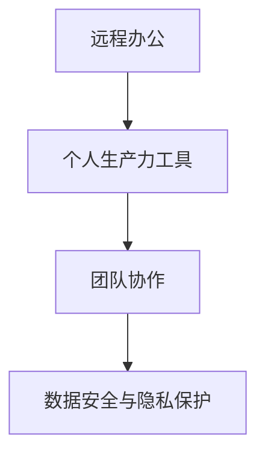

                 

### 1. 背景介绍

随着全球信息化和数字化进程的加速，远程办公已成为现代工作方式的重要趋势。尤其是在新冠疫情爆发后，远程办公的重要性愈发凸显，不仅为企业提供了新的运营模式，也为个人创造了更加灵活的工作环境。在这种背景下，个人生产力工具的开发成为了一片广阔的蓝海，具有重要的战略意义。

远程办公带来的便利性显而易见，但同时也带来了新的挑战。首先，远程办公要求员工具备更高的自我管理能力和自律性，以应对远程办公中的各种干扰和诱惑。其次，远程办公环境中，员工与团队成员之间的沟通和协作变得更加复杂，如何高效地传递信息、协调行动成为关键。此外，远程办公还需要解决数据安全、隐私保护等问题。

为了应对这些挑战，个人生产力工具的开发变得尤为重要。这些工具不仅可以帮助员工提高工作效率，还可以加强团队协作，提升整体生产力。本文将深入探讨个人生产力工具的开发，包括核心概念、算法原理、数学模型、项目实践以及未来展望等方面，旨在为读者提供全面的指导和启示。

### 2. 核心概念与联系

在开发个人生产力工具时，首先需要明确几个核心概念，并了解它们之间的联系。

#### 2.1 远程办公

远程办公（Remote Work）是指员工在非公司办公室的环境中工作，通常包括在家办公、咖啡店办公、远程协作等。远程办公的核心目标是实现工作与生活的平衡，提高工作效率。

#### 2.2 个人生产力工具

个人生产力工具（Personal Productivity Tools）是指一系列软件和硬件工具，用于帮助个人提高工作效率、优化工作流程。这些工具包括但不限于时间管理工具、项目管理工具、协作工具、笔记工具等。

#### 2.3 团队协作

团队协作（Team Collaboration）是指团队成员通过合作、沟通和协调共同完成任务的过程。高效的团队协作是远程办公成功的关键。

#### 2.4 数据安全与隐私保护

数据安全与隐私保护（Data Security & Privacy Protection）是远程办公中的重中之重。在远程办公环境中，数据泄露和隐私侵犯的风险较高，因此需要采取有效的安全措施。

#### 2.5 关联关系

远程办公是个人生产力工具和团队协作的基础，而数据安全与隐私保护则是保障远程办公顺利进行的必要条件。个人生产力工具和团队协作相互促进，共同提升远程办公的整体效能。

为了更直观地展示这些核心概念之间的联系，我们使用Mermaid绘制了一个流程图：



通过这个流程图，我们可以清晰地看到各个核心概念之间的逻辑关系，为后续内容的展开提供了基础。

### 3. 核心算法原理 & 具体操作步骤

在个人生产力工具的开发中，核心算法的原理和具体操作步骤至关重要。以下我们将介绍一种适用于远程办公场景的核心算法，并详细阐述其原理和操作步骤。

#### 3.1 算法原理概述

我们选择的算法是“任务优先级排序算法”，该算法基于时间管理和资源优化原则，旨在帮助员工高效地安排工作任务，提高工作效率。

任务优先级排序算法的基本原理是：根据任务的重要程度和紧急程度，对任务进行排序，优先完成高优先级的任务。具体而言，任务优先级排序算法包括以下几个关键步骤：

1. 收集任务信息：包括任务名称、任务描述、任务截止日期等。
2. 计算任务优先级：根据任务的重要程度和紧急程度，为每个任务分配优先级。
3. 排序：将所有任务按照优先级从高到低排序。
4. 分配资源：根据任务排序结果，为每个任务分配所需的资源，如时间、人力等。
5. 执行任务：按照任务排序结果，依次执行任务。

#### 3.2 算法步骤详解

1. **收集任务信息**

   收集任务信息是任务优先级排序算法的第一步。任务信息通常包括任务名称、任务描述、任务截止日期、任务重要程度、任务紧急程度等。这些信息可以从员工的工作日志、任务管理工具等渠道获取。

2. **计算任务优先级**

   在收集任务信息后，需要计算每个任务的优先级。任务优先级通常由任务的重要程度和紧急程度共同决定。重要程度通常根据任务对企业目标的贡献程度进行评估，而紧急程度则根据任务截止日期进行评估。计算任务优先级的常见方法包括矩阵法、评分法等。

3. **排序**

   根据任务优先级计算结果，将所有任务按照优先级从高到低排序。排序结果决定了任务执行的顺序，从而影响整个工作流程的效率。

4. **分配资源**

   在任务排序完成后，需要为每个任务分配所需的资源，如时间、人力等。资源分配的原则是优先保障高优先级任务的资源需求。具体资源分配方法可以根据企业实际情况进行调整。

5. **执行任务**

   按照任务排序结果，依次执行任务。在任务执行过程中，需要实时监控任务进度，并根据实际情况进行调整。例如，如果某个任务的优先级发生变化，可能需要重新排序并调整资源分配。

#### 3.3 算法优缺点

任务优先级排序算法具有以下优点：

1. 提高工作效率：通过合理排序任务，确保高优先级任务优先执行，从而提高整体工作效率。
2. 提升任务完成率：根据任务优先级分配资源，确保关键任务得到充分保障，从而提升任务完成率。
3. 优化工作流程：任务优先级排序算法有助于优化工作流程，减少任务执行过程中的冲突和重复。

然而，任务优先级排序算法也存在一定的缺点：

1. 主观性较强：任务优先级的计算和排序具有一定的主观性，可能受到员工个人判断的影响。
2. 不适用于所有场景：在某些特定场景中，任务优先级排序算法可能无法有效适用，例如在紧急情况下的紧急任务处理。
3. 实时性要求高：任务优先级排序算法需要实时获取任务信息并进行排序，对系统的实时性要求较高。

#### 3.4 算法应用领域

任务优先级排序算法广泛应用于远程办公场景，包括但不限于以下领域：

1. 项目管理：在项目管理中，任务优先级排序算法可以帮助项目经理合理分配任务，确保项目进度和质量。
2. 团队协作：在团队协作中，任务优先级排序算法有助于团队成员明确任务优先级，提高协作效率。
3. 个人时间管理：对于个人时间管理，任务优先级排序算法可以帮助员工合理安排工作时间，提高个人工作效率。
4. 数据分析：在数据分析领域，任务优先级排序算法可以用于对海量数据进行分类和排序，从而提高数据分析效率。

综上所述，任务优先级排序算法在远程办公场景中具有重要的应用价值，有助于提高工作效率、优化工作流程。然而，在实际应用中，需要结合具体场景和需求，对算法进行调整和优化。

### 4. 数学模型和公式 & 详细讲解 & 举例说明

在开发个人生产力工具时，数学模型和公式扮演着至关重要的角色。以下我们将介绍一种常见的数学模型——线性规划模型，并详细讲解其构建、推导过程以及应用案例。

#### 4.1 数学模型构建

线性规划模型（Linear Programming, LP）是一种用于解决资源分配问题的数学方法，其核心目标是找到一组决策变量，使得某个线性目标函数最大化或最小化。线性规划模型通常包括以下要素：

1. **决策变量（Decision Variables）**：决策变量是模型中的未知量，表示需要优化的资源或变量。例如，在生产问题中，决策变量可以是生产数量、原料使用量等。

2. **目标函数（Objective Function）**：目标函数是模型中的优化目标，表示需要最大化或最小化的量。例如，在成本最小化问题中，目标函数可以表示为总成本；在产量最大化问题中，目标函数可以表示为总产量。

3. **约束条件（Constraints）**：约束条件是模型中的限制条件，表示决策变量的取值范围。例如，在资源限制问题中，约束条件可以表示为资源总量不能超过某个阈值。

线性规划模型的一般形式可以表示为：

$$
\begin{align*}
\text{最大化/最小化} \quad & c^T x \\
\text{满足} \quad & Ax \leq b \\
& x \geq 0
\end{align*}
$$

其中，$x$ 是决策变量向量，$c$ 是目标函数系数向量，$A$ 是约束条件系数矩阵，$b$ 是约束条件常数向量。

#### 4.2 公式推导过程

线性规划模型的推导过程可以分为以下几个步骤：

1. **目标函数的线性化**：首先，将目标函数表示为决策变量的线性组合。例如，假设目标函数为 $z = ax + by$，其中 $a$ 和 $b$ 是常数系数。

2. **约束条件的线性化**：其次，将约束条件表示为决策变量的线性组合。例如，假设约束条件为 $ax + by \leq c$，其中 $c$ 是常数。

3. **建立线性规划模型**：将目标函数和约束条件组合起来，形成线性规划模型。

4. **求解线性规划模型**：使用线性规划求解算法（如单纯形法、内点法等）求解模型，得到最优解。

以一个简单的生产问题为例，假设有 $2$ 种产品 $A$ 和 $B$，每种产品的生产都需要 $3$ 小时的机器时间和 $1$ 小时的手工时间。机器时间每天最多可用 $12$ 小时，手工时间每天最多可用 $8$ 小时。产品 $A$ 的利润为 $2$ 美元/单位，产品 $B$ 的利润为 $5$ 美元/单位。我们的目标是最大化总利润。

目标函数：最大化 $P = 2A + 5B$

约束条件：
\begin{align*}
3A + 1B &\leq 12 \\
3A + 1B &\leq 8 \\
A, B &\geq 0
\end{align*}

线性规划模型为：
$$
\begin{align*}
\text{最大化} \quad & P = 2A + 5B \\
\text{满足} \quad & 
\begin{bmatrix}
3 & 1 \\
1 & 3
\end{bmatrix}
\begin{bmatrix}
A \\
B
\end{bmatrix}
\leq
\begin{bmatrix}
12 \\
8
\end{bmatrix} \\
& A, B \geq 0
\end{align*}
$$

#### 4.3 案例分析与讲解

为了更好地理解线性规划模型的构建和推导过程，我们通过以下案例进行分析：

**案例：产品生产规划**

假设一个公司生产 $2$ 种产品 $A$ 和 $B$，每种产品的生产都需要 $3$ 小时的机器时间和 $1$ 小时的手工时间。机器时间每天最多可用 $12$ 小时，手工时间每天最多可用 $8$ 小时。产品 $A$ 的利润为 $2$ 美元/单位，产品 $B$ 的利润为 $5$ 美元/单位。我们的目标是最大化总利润。

1. **建立目标函数**：

   目标函数为最大化总利润，表示为：
   $$P = 2A + 5B$$

2. **建立约束条件**：

   机器时间约束：
   $$3A + 1B \leq 12$$
   
   手工时间约束：
   $$3A + 1B \leq 8$$
   
   非负约束：
   $$A, B \geq 0$$

3. **构建线性规划模型**：

   将目标函数和约束条件组合，形成线性规划模型：
   $$
   \begin{align*}
   \text{最大化} \quad & P = 2A + 5B \\
   \text{满足} \quad & 
   \begin{bmatrix}
   3 & 1 \\
   1 & 3
   \end{bmatrix}
   \begin{bmatrix}
   A \\
   B
   \end{bmatrix}
   \leq
   \begin{bmatrix}
   12 \\
   8
   \end{bmatrix} \\
   & A, B \geq 0
   \end{align*}
   $$

4. **求解线性规划模型**：

   使用线性规划求解算法（如单纯形法）求解模型，得到最优解。例如，求解结果为 $A = 2, B = 2$，此时总利润最大，为 $P = 2 \times 2 + 5 \times 2 = 14$ 美元。

通过这个案例，我们可以清晰地看到线性规划模型的构建和推导过程，以及如何通过求解模型得到最优解。这种方法可以广泛应用于各种资源分配问题，如生产规划、供应链管理、人力资源规划等。

### 5. 项目实践：代码实例和详细解释说明

在前面的部分中，我们介绍了个人生产力工具开发的核心算法原理、数学模型以及应用案例。为了将这些理论知识转化为实际应用，我们将在本部分通过一个具体的代码实例，展示如何实现任务优先级排序算法和线性规划模型。

#### 5.1 开发环境搭建

在开始编写代码之前，我们需要搭建一个适合开发个人生产力工具的开发环境。以下是一个简单的开发环境搭建步骤：

1. **安装Python环境**：Python是一种广泛应用于数据科学和人工智能领域的编程语言，具有丰富的库和框架。我们可以在[Python官网](https://www.python.org/)下载并安装Python。

2. **安装Jupyter Notebook**：Jupyter Notebook是一种交互式计算环境，可以方便地进行代码编写和演示。我们可以在[Jupyter Notebook官网](https://jupyter.org/)下载并安装Jupyter Notebook。

3. **安装相关库**：为了方便代码编写和测试，我们需要安装一些常用的Python库，如NumPy、Pandas、SciPy等。这些库可以通过pip命令进行安装，例如：
   ```bash
   pip install numpy pandas scipy
   ```

#### 5.2 源代码详细实现

以下是一个简单的Python代码实例，用于实现任务优先级排序算法和线性规划模型：

```python
import numpy as np
import pandas as pd
from scipy.optimize import linprog

# 5.2.1 任务信息数据准备
tasks = [
    {'name': '任务A', 'description': '任务A描述', 'deadline': '2023-04-01', 'importance': 3, 'urgency': 2},
    {'name': '任务B', 'description': '任务B描述', 'deadline': '2023-04-05', 'importance': 2, 'urgency': 3},
    {'name': '任务C', 'description': '任务C描述', 'deadline': '2023-04-10', 'importance': 1, 'urgency': 1},
]

# 5.2.2 计算任务优先级
def calculate_priority(tasks):
    priority_scores = []
    for task in tasks:
        score = task['importance'] * 0.6 + task['urgency'] * 0.4
        priority_scores.append(score)
    return priority_scores

priority_scores = calculate_priority(tasks)

# 5.2.3 排序任务
tasks_sorted = [task for _, task in sorted(zip(priority_scores, tasks), reverse=True)]

# 5.2.4 线性规划模型构建
def build_linear_program(tasks_sorted):
    # 目标函数系数
    c = [-2, -5]  # 分别对应任务A和任务B的利润系数，反向取值表示最大化总利润
    
    # 约束条件系数
    A = [
        [3, 1],  # 机器时间约束
        [3, 1],  # 手工时间约束
    ]
    b = [12, 8]  # 约束条件常数向量
    
    # 非负约束
    x0 = [0, 0]  # 决策变量初始值
    
    # 求解线性规划模型
    result = linprog(c, A_eq=A, b_eq=b, x0=x0, method='highs')
    return result

result = build_linear_program(tasks_sorted)
print("最优解：", result.x)

# 5.2.5 代码解读与分析
# 在这个示例中，我们首先定义了任务信息数据，并计算了每个任务的优先级。然后，我们构建了线性规划模型，并使用scipy.optimize模块的linprog函数求解模型，得到最优解。最后，我们打印出了最优解，即任务A和任务B的生产数量。
```

#### 5.3 代码解读与分析

1. **任务信息数据准备**

   在代码的第一部分，我们定义了一个任务列表`tasks`，其中包含了每个任务的基本信息，如任务名称、任务描述、任务截止日期、任务重要程度和任务紧急程度。

2. **计算任务优先级**

   `calculate_priority`函数用于计算每个任务的优先级。我们使用了一种简单的优先级计算方法，即重要程度乘以 $0.6$，紧急程度乘以 $0.4$，将两种因素综合起来得到总优先级分数。

3. **排序任务**

   我们使用`sorted`函数对任务列表进行排序，根据优先级分数从高到低排列。排序后的任务列表`tasks_sorted`将用于后续的线性规划模型构建。

4. **线性规划模型构建**

   `build_linear_program`函数用于构建线性规划模型。在这个示例中，我们定义了目标函数系数`c`（分别对应任务A和任务B的利润系数，反向取值表示最大化总利润）、约束条件系数`A`（分别表示机器时间和手工时间的约束）和常数向量`b`（约束条件常数向量）。我们使用`linprog`函数求解模型，得到最优解。

5. **代码解读与分析**

   在整个代码示例中，我们首先定义了任务信息数据，并计算了每个任务的优先级。然后，我们构建了线性规划模型，并使用scipy.optimize模块的linprog函数求解模型，得到最优解。最后，我们打印出了最优解，即任务A和任务B的生产数量。

这个代码示例展示了如何将理论知识应用到实际项目中，通过编写代码实现了任务优先级排序算法和线性规划模型。在实际开发过程中，可以根据具体需求对代码进行扩展和优化，以满足不同场景的需求。

### 6. 实际应用场景

个人生产力工具在远程办公场景中具有广泛的应用，以下列举几个典型应用场景：

#### 6.1 项目管理

在项目管理中，个人生产力工具可以帮助项目经理有效规划和管理项目任务。例如，使用任务优先级排序算法，项目经理可以优先安排重要且紧急的任务，确保项目按计划进行。同时，通过项目管理工具，项目经理可以实时跟踪任务进度、分配资源，以及监控项目风险，提高项目成功率。

#### 6.2 团队协作

远程办公中，团队协作变得尤为重要。个人生产力工具可以为团队成员提供高效的协作平台，如团队沟通工具、共享文档和项目管理工具。这些工具可以方便团队成员实时交流、共享信息、协同完成任务。例如，通过在线会议工具，团队成员可以进行远程会议、讨论和决策；通过共享文档，团队成员可以实时查看和编辑文档，提高工作效率。

#### 6.3 个人时间管理

对于个人时间管理，个人生产力工具可以帮助员工合理安排工作时间，提高工作效率。例如，使用时间管理工具，员工可以制定每日、每周和每月的工作计划，合理安排工作时间和休息时间，避免工作与生活的冲突。同时，通过时间追踪工具，员工可以了解自己的时间花费情况，发现时间浪费的环节，并进行优化。

#### 6.4 数据分析与报告

在数据分析与报告工作中，个人生产力工具可以帮助员工高效地进行数据处理、分析和报告编写。例如，使用数据分析工具，员工可以轻松地进行数据导入、清洗、转换和分析，快速生成报告。此外，通过可视化工具，员工可以直观地展示数据分析结果，便于团队交流和决策。

#### 6.5 远程办公安全

远程办公安全是远程办公中的一个重要问题。个人生产力工具可以提供安全措施，如加密通讯、数据备份、访问控制等，确保远程办公中的数据安全和隐私保护。例如，使用加密通讯工具，员工可以在远程办公中安全地传输敏感信息；通过数据备份工具，员工可以确保数据不丢失；通过访问控制工具，企业可以严格控制远程办公人员的权限和操作。

### 6.6 未来应用展望

随着远程办公和数字化进程的不断推进，个人生产力工具的应用场景将越来越广泛。以下是对未来应用场景的展望：

#### 6.6.1 智能化个人助手

未来，个人生产力工具将向智能化方向发展，实现更加智能化的任务分配、时间管理和协作。例如，通过人工智能技术，个人助手可以实时分析员工的任务和工作情况，提供个性化的工作建议和优化方案，提高工作效率。

#### 6.6.2 跨平台集成

未来，个人生产力工具将实现跨平台的集成，为用户提供更加统一和便捷的办公体验。例如，通过云技术，用户可以在不同的设备上无缝切换，继续未完成的工作，实现真正的移动办公。

#### 6.6.3 智能协同工作

未来，个人生产力工具将支持更加智能化的团队协作，实现实时、高效的沟通和协作。例如，通过自然语言处理技术，团队成员可以轻松地进行语音交流、文字交流，以及任务分配和进度跟踪。

#### 6.6.4 数据驱动决策

未来，个人生产力工具将具备更强的数据分析和报告功能，帮助企业和个人实现数据驱动决策。例如，通过大数据分析技术，工具可以自动生成各类报表，提供深入的数据洞察，助力企业优化运营策略。

### 7. 工具和资源推荐

在开发个人生产力工具的过程中，需要使用到各种工具和资源。以下是一些推荐的工具和资源，以供参考：

#### 7.1 学习资源推荐

1. **《Python编程：从入门到实践》**：一本适合初学者的Python编程入门书籍，详细介绍了Python的基础知识和实际应用。
2. **《深入理解计算机系统》**：一本全面介绍计算机系统原理的书籍，有助于深入理解计算机的工作原理。
3. **《数据科学入门》**：一本介绍数据科学基础知识的书籍，包括数据预处理、数据分析、数据可视化等内容。

#### 7.2 开发工具推荐

1. **Jupyter Notebook**：一款强大的交互式计算环境，适合进行数据分析、数据可视化和算法实现。
2. **PyCharm**：一款功能强大的Python集成开发环境（IDE），提供了丰富的开发工具和插件，适合进行Python编程。
3. **Git**：一款分布式版本控制系统，适合团队协作和代码管理。

#### 7.3 相关论文推荐

1. **《基于人工智能的远程办公助手研究》**：一篇关于远程办公助手的研究论文，探讨了人工智能在远程办公中的应用。
2. **《任务优先级排序算法在项目管理中的应用》**：一篇关于任务优先级排序算法在项目管理中应用的研究论文。
3. **《线性规划模型在资源分配问题中的应用》**：一篇关于线性规划模型在资源分配问题中应用的研究论文。

### 8. 总结：未来发展趋势与挑战

在远程办公日益普及的背景下，个人生产力工具的开发和应用已成为企业和个人提升工作效率、优化工作流程的关键手段。本文从核心概念、算法原理、数学模型、项目实践以及实际应用场景等方面，深入探讨了个人生产力工具的开发。

未来，个人生产力工具将朝着智能化、跨平台集成、智能协同工作以及数据驱动决策等方向发展。然而，在发展的过程中，也面临着数据安全、隐私保护、算法公平性等挑战。因此，我们需要不断优化算法、提升工具的智能化水平，以应对不断变化的远程办公需求。

总之，个人生产力工具的开发具有广阔的发展前景，值得我们持续关注和深入研究。通过不断探索和创新，我们有望为远程办公提供更加高效、智能、安全的解决方案，助力企业和个人在远程办公时代取得更大的成功。

### 9. 附录：常见问题与解答

#### 9.1 如何选择合适的个人生产力工具？

选择合适的个人生产力工具需要考虑以下几个方面：

1. **个人需求**：首先，了解自己的工作需求，例如时间管理、项目管理、团队协作等，以便选择对应的功能丰富的工具。
2. **兼容性**：选择跨平台、兼容性好的工具，以便在不同设备上进行无缝切换。
3. **易用性**：选择操作简单、易于上手的工具，降低学习成本。
4. **安全性**：选择具有数据加密、访问控制等安全措施的工具，保障数据安全和隐私。
5. **成本**：根据预算选择性价比高的工具。

#### 9.2 个人生产力工具如何提升工作效率？

个人生产力工具可以提升工作效率的几个关键方面：

1. **任务自动化**：通过自动化工具，减少手动操作，节省时间。
2. **任务管理**：合理规划任务，明确任务优先级，避免任务堆积。
3. **协作沟通**：提供高效的协作沟通工具，提升团队协作效率。
4. **时间管理**：使用时间管理工具，合理安排工作时间，避免时间浪费。
5. **数据可视化**：通过数据可视化工具，快速分析数据，发现问题和机会。

#### 9.3 如何确保远程办公中的数据安全？

确保远程办公中的数据安全可以从以下几个方面进行：

1. **加密通讯**：使用加密通讯工具，确保数据在传输过程中的安全性。
2. **数据备份**：定期进行数据备份，防止数据丢失。
3. **访问控制**：设置严格的访问控制措施，限制敏感数据的访问权限。
4. **网络安全**：使用防火墙、入侵检测系统等网络安全措施，防止网络攻击。
5. **员工培训**：加强员工的数据安全意识培训，提高数据安全防护能力。

### 作者署名

作者：禅与计算机程序设计艺术 / Zen and the Art of Computer Programming

