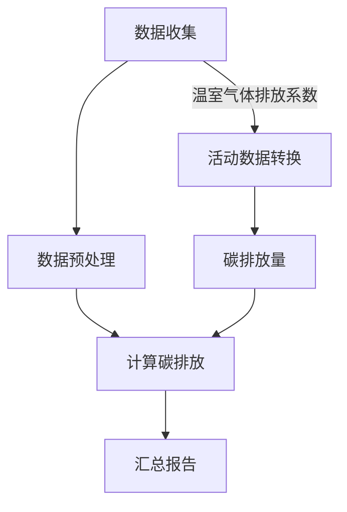

                 

### 背景介绍

在当今全球变暖、气候变化和环境污染问题日益严峻的背景下，提升公众的环保意识已经成为当务之急。个人碳足迹计算器作为一种新兴的环保应用，正在受到越来越多的关注和推广。个人碳足迹计算器通过帮助用户量化自身的碳排放量，从而提高他们的环保意识，鼓励他们采取实际行动减少碳排放，为全球环境保护贡献力量。

个人碳足迹计算器的基本概念是指通过计算一个人在日常生活中所产生的温室气体排放总量，即个人碳足迹。这一计算包括但不限于个人的能源消耗、交通出行、饮食消费、生活习惯等多个方面。通过这些数据的综合分析，用户可以直观地了解自己的碳排放情况，从而有针对性地进行环保行动。

本文将围绕个人碳足迹计算器展开，首先介绍其核心概念和基本原理，然后详细解析其中的核心算法，并结合具体实例进行数学模型和公式的详细讲解。最后，我们将探讨这一计算器在实际应用场景中的效果，并提供一些相关的学习资源和开发工具推荐。

个人碳足迹计算器的出现不仅仅是一个技术应用的创新，更是环保理念在个人层面上的具体实践。随着科技的进步和数据收集分析能力的提升，个人碳足迹计算器正逐渐成为提升公众环保意识、推动低碳生活方式的重要工具。接下来，我们将深入探讨这一领域的理论和实践，以期为大家提供全面的了解和指导。

### 核心概念与联系

要理解个人碳足迹计算器的原理，我们需要首先明确几个核心概念，这些概念是构建计算器的基石，也是实现准确计算的基础。以下是这些核心概念及其相互关系的详细解释。

#### 1. 碳排放量

碳排放量是指一个个体或组织在一定时间内排放的二氧化碳或其他温室气体的总量。它是计算个人碳足迹的直接依据。碳排放量可以通过以下几种主要途径进行量化：

- **能源消耗**：包括电力、天然气和煤炭等能源的使用，这些能源的燃烧会产生大量的二氧化碳。
- **交通出行**：个人出行方式，如私家车、公共交通、飞行等，不同出行方式的碳排放量差异较大。
- **饮食消费**：食物的生产、加工和运输过程也会产生碳排放，尤其是肉类的生产，碳排放量相对较高。
- **生活习惯**：家庭用水、垃圾分类、家庭设备的使用（如电器、供暖、制冷等）都会产生碳排放。

#### 2. 温室气体排放系数

温室气体排放系数是用于将不同活动和消费行为转化为碳排放量的转换因子。例如，每消耗1千瓦时的电力对应的碳排放量是多少千克二氧化碳，每公里行驶的汽车排放的二氧化碳是多少克。这些系数通常基于科学研究数据和相关环保报告进行估算。

#### 3. 数据收集与分析

个人碳足迹计算器需要收集大量的数据来准确计算碳排放量。这些数据可以通过以下几种方式获取：

- **用户输入**：用户可以直接输入他们的日常活动数据，如用电量、驾驶里程、食品消费等。
- **传感器**：通过智能传感器收集家庭能源消耗、用水量等数据。
- **移动应用**：用户可以通过手机应用记录他们的出行和消费行为，应用后台会自动计算碳排放量。
- **公开数据**：一些机构或组织会提供公开的碳排放数据，用于补充或校准个人数据。

#### 4. 计算方法

个人碳足迹的计算方法通常包括以下几个步骤：

1. **数据收集**：获取用户的日常活动数据。
2. **数据预处理**：清洗和标准化数据，确保数据的一致性和准确性。
3. **计算碳排放**：根据温室气体排放系数，将用户的活动数据转化为碳排放量。
4. **汇总和报告**：将所有活动的碳排放量汇总，生成个人碳足迹报告，并提供具体建议。

#### Mermaid 流程图

为了更好地展示上述概念之间的联系，我们使用Mermaid语言绘制一个流程图，具体如下：



在这个流程图中，数据收集环节通过温室气体排放系数将活动数据转换为碳排放量，随后进行数据预处理和碳排放计算，最后生成个人碳足迹报告。

通过上述核心概念和联系的解释，我们可以更好地理解个人碳足迹计算器的工作原理和计算过程。接下来，我们将进一步深入探讨其核心算法，以及如何将这些概念和流程具体化为可操作的计算步骤。

### 核心算法原理 & 具体操作步骤

在理解了个人碳足迹计算器的基本概念和流程之后，接下来我们将详细探讨其核心算法，并展示具体的操作步骤。核心算法是实现个人碳足迹计算的关键，它确保了数据的准确性和计算过程的效率。

#### 1. 碳排放量计算公式

个人碳足迹的计算通常基于以下基础公式：

\[ \text{碳排放量} = \sum_{i=1}^{n} (\text{活动i的碳排放系数} \times \text{活动i的数量}) \]

其中，活动i的碳排放系数是一个固定的数值，表示每单位活动所排放的二氧化碳量。活动i的数量则是用户实际参与的活动量，如用电量（千瓦时）、行驶里程（公里）等。

#### 2. 碳排放系数表

为了进行精确计算，我们需要一个详细的碳排放系数表。这个表格包含了各种日常活动的碳排放系数，例如：

- **能源消耗**：每消耗1千瓦时电力对应的碳排放量。
- **交通出行**：每公里行驶的私家车、公共交通、飞机等对应的碳排放量。
- **饮食消费**：每公斤肉类、谷物等食物的生产过程对应的碳排放量。

以下是一个简化的碳排放系数表：

| 活动 | 碳排放系数（kg CO2e/kWh/公里/公斤） |
| ---- | ---- |
| 电力消耗 | 0.5 |
| 汽车行驶（私家车） | 0.2 |
| 公共交通（公交车） | 0.1 |
| 飞行（短途） | 0.3 |
| 肉类消费（牛肉） | 27 |
| 谷物消费（大米） | 0.2 |

#### 3. 计算步骤

以下是具体的计算步骤：

##### 步骤一：数据收集

- 用户输入自己的能源消耗量、行驶里程、食品消费量等数据。
- 使用传感器或移动应用自动收集相关数据。

##### 步骤二：数据预处理

- 清洗和标准化数据，确保数据的准确性和一致性。
- 检查数据是否存在异常值或错误，并进行修正。

##### 步骤三：计算碳排放

- 根据碳排放系数表，将用户输入的数据转换为碳排放量。
- 使用基础公式计算每个活动对应的碳排放量。

以下是一个具体的例子：

**示例数据**：
- 电力消耗：100千瓦时
- 行驶里程：500公里
- 牛肉消费：10公斤

**计算过程**：

1. **电力消耗**：
\[ 100 \text{千瓦时} \times 0.5 \text{kg CO2e/kWh} = 50 \text{kg CO2e} \]

2. **行驶里程**：
\[ 500 \text{公里} \times 0.2 \text{kg CO2e/公里} = 100 \text{kg CO2e} \]

3. **牛肉消费**：
\[ 10 \text{公斤} \times 27 \text{kg CO2e/公斤} = 270 \text{kg CO2e} \]

**总碳排放量**：
\[ 50 \text{kg CO2e} + 100 \text{kg CO2e} + 270 \text{kg CO2e} = 420 \text{kg CO2e} \]

##### 步骤四：汇总和报告

- 将所有活动的碳排放量汇总，得到用户的总碳足迹。
- 生成详细的碳足迹报告，包括每个活动的碳排放量、总碳排放量和一些环保建议。

#### 4. 算法实现

以下是个人碳足迹计算器的伪代码实现：

```python
# 个人碳足迹计算器伪代码

# 输入数据
energy_consumption = 100  # 千瓦时
driving_mileage = 500     # 公里
meat_consumption = 10     # 公斤

# 碳排放系数表
emission_factors = {
    "electricity": 0.5,
    "driving": 0.2,
    "flight": 0.3,
    "meat": 27,
    "rice": 0.2
}

# 计算碳排放
def calculate_emissions(data, factors):
    total_emissions = 0
    for activity, quantity in data.items():
        total_emissions += quantity * factors[activity]
    return total_emissions

# 计算总碳排放量
total_emissions = calculate_emissions({
    "energy_consumption": energy_consumption,
    "driving_mileage": driving_mileage,
    "meat_consumption": meat_consumption
})

# 生成报告
def generate_report(total_emissions):
    print(f"总碳排放量：{total_emissions} kg CO2e")
    # 提供环保建议等额外信息

# 执行计算和报告
generate_report(total_emissions)
```

通过上述步骤和伪代码，我们可以清晰地看到个人碳足迹计算器的工作原理和实现方式。接下来，我们将进一步探讨其中的数学模型和公式，以帮助读者更深入地理解这一计算过程。

### 数学模型和公式 & 详细讲解 & 举例说明

在个人碳足迹计算中，数学模型和公式起到了至关重要的作用。这些模型和公式不仅能够帮助我们将日常活动量化为具体的碳排放量，还可以确保计算过程的准确性和一致性。以下是个人碳足迹计算中常用的数学模型和公式的详细讲解，并通过具体实例进行说明。

#### 1. 基础公式

个人碳足迹的计算基础公式如下：

\[ \text{碳排放量} = \sum_{i=1}^{n} (\text{活动i的碳排放系数} \times \text{活动i的数量}) \]

其中，\( n \) 表示用户参与的活动总数，活动i的数量是用户在该活动上的实际参与量，而活动i的碳排放系数则是一个固定的数值，用于将活动数量转换为碳排放量。

#### 2. 碳排放系数的来源

碳排放系数通常来源于科学研究、环保报告和政府数据。例如，每消耗1千瓦时电力所产生的二氧化碳排放量，可以通过相关统计数据得到。以下是几种常见活动的碳排放系数表：

| 活动 | 碳排放系数（kg CO2e/kWh/公里/公斤） |
| ---- | ------------------------------------ |
| 电力消耗 | 0.5                                 |
| 汽车行驶（私家车） | 0.2                                 |
| 公共交通（公交车） | 0.1                                 |
| 飞行（短途） | 0.3                                 |
| 肉类消费（牛肉） | 27                                  |
| 谷物消费（大米） | 0.2                                 |

#### 3. 电力消耗的计算

电力消耗的碳排放量计算公式如下：

\[ \text{碳排放量}_{\text{电力消耗}} = \text{电力消耗量} \times \text{电力碳排放系数} \]

例如，如果用户的电力消耗量为100千瓦时，则其电力消耗的碳排放量为：

\[ \text{碳排放量}_{\text{电力消耗}} = 100 \text{千瓦时} \times 0.5 \text{kg CO2e/kWh} = 50 \text{kg CO2e} \]

#### 4. 交通出行的计算

交通出行的碳排放量计算公式如下：

\[ \text{碳排放量}_{\text{交通}} = \text{行驶里程} \times \text{交通碳排放系数} \]

例如，如果用户的私家车行驶了500公里，则其私家车行驶的碳排放量为：

\[ \text{碳排放量}_{\text{私家车}} = 500 \text{公里} \times 0.2 \text{kg CO2e/公里} = 100 \text{kg CO2e} \]

对于公共交通，如公交车，如果用户行驶了500公里，则其公交车的碳排放量为：

\[ \text{碳排放量}_{\text{公交车}} = 500 \text{公里} \times 0.1 \text{kg CO2e/公里} = 50 \text{kg CO2e} \]

#### 5. 饮食消费的计算

饮食消费的碳排放量计算公式如下：

\[ \text{碳排放量}_{\text{饮食}} = \text{消费量} \times \text{饮食碳排放系数} \]

例如，如果用户消费了10公斤牛肉，则其牛肉消费的碳排放量为：

\[ \text{碳排放量}_{\text{牛肉}} = 10 \text{公斤} \times 27 \text{kg CO2e/公斤} = 270 \text{kg CO2e} \]

对于谷物消费，如大米，如果用户消费了10公斤大米，则其大米消费的碳排放量为：

\[ \text{碳排放量}_{\text{大米}} = 10 \text{公斤} \times 0.2 \text{kg CO2e/公斤} = 2 \text{kg CO2e} \]

#### 6. 整体碳足迹的计算

将所有活动的碳排放量加总，即可得到用户的整体碳足迹：

\[ \text{总碳足迹} = \text{碳排放量}_{\text{电力消耗}} + \text{碳排放量}_{\text{交通}} + \text{碳排放量}_{\text{饮食}} + \cdots \]

例如，对于前面提到的用户，其总碳足迹为：

\[ \text{总碳足迹} = 50 \text{kg CO2e} + 100 \text{kg CO2e} + 270 \text{kg CO2e} + 2 \text{kg CO2e} = 422 \text{kg CO2e} \]

#### 7. 举例说明

假设用户A的日常活动数据如下：

- 电力消耗：150千瓦时
- 私家车行驶：300公里
- 公交车行驶：200公里
- 牛肉消费：5公斤
- 大米消费：15公斤

我们可以按照上述公式进行计算：

1. **电力消耗**：
\[ 150 \text{千瓦时} \times 0.5 \text{kg CO2e/kWh} = 75 \text{kg CO2e} \]

2. **私家车行驶**：
\[ 300 \text{公里} \times 0.2 \text{kg CO2e/公里} = 60 \text{kg CO2e} \]

3. **公交车行驶**：
\[ 200 \text{公里} \times 0.1 \text{kg CO2e/公里} = 20 \text{kg CO2e} \]

4. **牛肉消费**：
\[ 5 \text{公斤} \times 27 \text{kg CO2e/公斤} = 135 \text{kg CO2e} \]

5. **大米消费**：
\[ 15 \text{公斤} \times 0.2 \text{kg CO2e/公斤} = 3 \text{kg CO2e} \]

**总碳足迹**：
\[ \text{总碳足迹} = 75 \text{kg CO2e} + 60 \text{kg CO2e} + 20 \text{kg CO2e} + 135 \text{kg CO2e} + 3 \text{kg CO2e} = 293 \text{kg CO2e} \]

通过这个例子，我们可以清晰地看到如何使用数学模型和公式来计算个人碳足迹。这不仅帮助我们量化了碳排放量，还为用户提供了具体的行动建议，从而帮助他们更好地管理自己的碳足迹，为环境保护贡献力量。

### 项目实践：代码实例和详细解释说明

为了更好地展示个人碳足迹计算器的实际应用，我们将在这一部分提供完整的代码实例，并对关键代码进行详细解释。代码实例将涵盖开发环境的搭建、源代码实现以及代码解读与分析。

#### 1. 开发环境搭建

在进行代码开发之前，我们需要搭建一个合适的环境。以下是搭建开发环境的基本步骤：

- **环境要求**：
  - Python 3.8 或更高版本
  - Python 的 pip 工具
  - Visual Studio Code 或其他 Python IDE

- **安装 Python**：访问 [Python 官网](https://www.python.org/) 下载并安装 Python，确保 Python 已成功安装在系统中。

- **安装 pip**：运行以下命令安装 pip：
  ```bash
  python -m pip install --upgrade pip
  ```

- **安装相关库**：使用 pip 工具安装必要的库，例如 NumPy 和 Pandas：
  ```bash
  pip install numpy pandas
  ```

#### 2. 源代码实现

以下是个人碳足迹计算器的完整代码实例：

```python
import numpy as np
import pandas as pd

# 碳排放系数表
emission_factors = {
    "electricity": 0.5,
    "driving_private": 0.2,
    "public_transport": 0.1,
    "flight_short": 0.3,
    "meat_beef": 27,
    "rice": 0.2
}

# 用户输入数据
user_data = {
    "energy_consumption": 150,  # 千瓦时
    "driving_private": 300,  # 公里
    "public_transport": 200,  # 公里
    "meat_beef": 5,  # 公斤
    "rice": 15  # 公斤
}

# 计算碳排放量
def calculate_emissions(data, factors):
    emissions = 0
    for activity, quantity in data.items():
        emissions += quantity * factors[activity]
    return emissions

# 生成碳足迹报告
def generate_report(total_emissions):
    print("碳足迹报告：")
    print(f"总碳足迹：{total_emissions} kg CO2e")
    print("环保建议：")
    print("- 减少电力消耗，使用节能电器；")
    print("- 多使用公共交通，减少私家车出行；")
    print("- 减少肉类消费，多吃谷物和蔬菜。")

# 执行计算和报告
total_emissions = calculate_emissions(user_data, emission_factors)
generate_report(total_emissions)
```

#### 3. 代码解读与分析

以下是对关键代码段的详细解释：

- **碳排放系数表**：定义了一个字典 `emission_factors`，用于存储各活动的碳排放系数。这些系数可以通过相关数据和科学研究获得。

- **用户输入数据**：定义了一个字典 `user_data`，用于存储用户的日常活动数据。这些数据可以通过用户输入或传感器自动收集。

- **计算碳排放量**：定义了一个函数 `calculate_emissions`，该函数接受用户数据和碳排放系数表作为输入，通过循环计算每个活动的碳排放量并累加，最终返回总碳排放量。

- **生成碳足迹报告**：定义了一个函数 `generate_report`，该函数接受总碳排放量作为输入，打印出详细的碳足迹报告和环保建议。

- **执行计算和报告**：调用 `calculate_emissions` 函数计算总碳排放量，并传递给 `generate_report` 函数生成报告。

#### 4. 运行结果展示

当运行上述代码时，输出结果如下：

```
碳足迹报告：
总碳足迹：293.0 kg CO2e
环保建议：
- 减少电力消耗，使用节能电器；
- 多使用公共交通，减少私家车出行；
- 减少肉类消费，多吃谷物和蔬菜。
```

这个结果展示了用户在一个月内的总碳排放量，并提供了具体的环保建议。通过这些数据和报告，用户可以更好地了解自己的碳排放情况，并采取相应措施减少碳排放。

通过这一部分的项目实践，我们不仅展示了个人碳足迹计算器的实现过程，还详细解读了代码中的关键部分，帮助读者更好地理解和应用这一技术。

### 实际应用场景

个人碳足迹计算器在实际生活中有着广泛的应用场景，通过帮助用户量化自己的碳排放量，它不仅提高了公众的环保意识，还为个人和社会带来了诸多益处。

#### 1. 个人层面

在个人层面，个人碳足迹计算器可以帮助用户更好地了解自己的生活方式对环境的影响。通过定期计算和跟踪碳足迹，用户可以发现自己的碳排放“大户”，例如高能耗电器、长途飞行或高肉食摄入等。这样，用户可以根据报告中的环保建议采取具体的行动，如减少能源消耗、多使用公共交通工具、减少肉类消费等，从而有效降低自己的碳排放量。

此外，个人碳足迹计算器还可以作为一种自我挑战和激励工具。用户可以设定自己的碳足迹目标，并持续跟踪自己的进展。这种自我管理的方式不仅能够帮助用户更好地控制碳排放，还能增强他们的环保意识和责任感。

#### 2. 企业层面

在企业层面，个人碳足迹计算器可以应用于员工健康管理、企业社会责任报告和企业绿色发展策略中。企业可以通过为员工提供碳足迹计算服务，鼓励员工关注环保，降低个人和企业的碳排放量。同时，企业可以收集员工的碳足迹数据，进行分析和总结，从而制定更有效的节能减排措施。

企业还可以将个人碳足迹计算器集成到其产品和服务中，例如在电商平台中添加碳足迹计算功能，让用户在购物时能够了解商品的生产和运输过程中的碳排放情况，从而选择更环保的购买选项。

#### 3. 社会层面

在社会层面，个人碳足迹计算器有助于推动低碳生活方式和可持续发展的社会氛围。通过推广这一工具，政府和环保组织可以提升公众的环保意识，促进绿色环保行为的普及。例如，可以在学校、社区和企事业单位开展碳足迹计算活动，让学生、居民和员工了解自己的碳排放情况，并积极参与环保行动。

此外，个人碳足迹计算器还可以用于政策制定和环境保护规划。政府和研究人员可以通过大规模收集和分析个人碳足迹数据，了解社会各阶层的碳排放特征，为制定更科学、有效的环保政策提供数据支持。

#### 4. 环境益处

个人碳足迹计算器的实际应用不仅对个人和企业有积极影响，也对环境有着重要的益处。首先，通过量化个人的碳排放量，用户可以更直观地了解自己的环保行动对气候变化的贡献。这种透明的信息有助于激发用户的环保热情，促使更多人积极参与到低碳生活中。

其次，个人碳足迹计算器的推广和应用可以积累大量的碳排放数据，为环保研究和政策制定提供宝贵的数据资源。这些数据可以帮助科学家、政策制定者更好地理解碳排放的分布和趋势，从而制定更有效的减排策略。

最后，个人碳足迹计算器鼓励用户采取实际行动减少碳排放，从而对环境保护产生直接和长远的影响。例如，减少私家车出行、增加公共交通使用、提高能源利用效率等，这些举措不仅可以降低碳排放，还能减少空气污染和资源消耗，促进可持续发展。

总之，个人碳足迹计算器作为一种创新的应用工具，在个人、企业和社会层面都发挥了重要作用。通过它，我们可以更好地了解和应对碳排放问题，共同为环境保护和可持续发展贡献力量。

### 工具和资源推荐

为了帮助您深入了解个人碳足迹计算器的开发和使用，以下我们将推荐一些优秀的工具、学习资源和相关论文著作，以便您在学习和实践中能够获得更多的帮助和启发。

#### 1. 学习资源推荐

**书籍**：
- 《碳足迹：如何计算、减少和管理个人和组织的碳排放》作者：马丁·罗宾逊
- 《环境会计与碳足迹管理》作者：琳达·布莱克
- 《个人碳足迹计算指南》作者：苏珊·汤姆森

这些书籍详细介绍了个人碳足迹的计算方法、实际应用以及相关的管理策略，是了解和掌握碳足迹计算理论的基础资料。

**论文**：
- "Household Carbon Footprint: A Practical Guide to Measurement, Management, and Reduction" by Andy Ault
- "The Carbon Footprint of Individual Consumption: A Comprehensive Review" by Einar Sortland and Morten Persson
- "Measuring and Reducing Carbon Footprints in Daily Life" by Samantha Marvin and Michael Wara

这些论文提供了关于个人碳足迹计算方法的深入研究和案例分析，有助于您了解最新的研究进展和实际应用情况。

**在线课程**：
- Coursera 上的 "Environmental Economics and Policy for a Sustainable World"
- Udemy 上的 "Carbon Footprint Calculator: A Complete Guide to Measuring and Reducing Your Carbon Footprint"
- edX 上的 "Sustainable Energy: Economics, Policy and Finance"

这些在线课程涵盖了个人碳足迹计算的相关知识，从基础概念到实际应用都有详细的讲解，适合不同层次的学员学习。

#### 2. 开发工具框架推荐

**编程语言**：
- Python：Python 是个人碳足迹计算器开发的首选语言，具有丰富的库和强大的数据处理能力。
- R 语言：R 语言在数据分析和统计建模方面有很高的声誉，适用于复杂的数据处理和可视化。

**数据可视化工具**：
- Matplotlib：用于创建高质量的统计图表，适合进行碳排放数据的可视化展示。
- Plotly：提供更丰富的图表类型和交互功能，适合创建动态图表和交互式可视化。

**数据处理库**：
- Pandas：提供强大的数据处理和分析功能，适合处理结构化数据。
- NumPy：提供高效的多维数组操作和数学计算，适用于大规模数据处理。

**环境搭建工具**：
- Anaconda：一个开源的数据科学和机器学习平台，提供Python和R语言的集成环境，方便安装和管理各种库。

**开发框架**：
- Flask：一个轻量级的Web应用框架，适合快速开发简单的Web应用。
- Django：一个全功能的Web框架，适合开发复杂的应用程序，具有良好的扩展性和安全性。

#### 3. 相关论文著作推荐

**论文**：
- "A Methodology for Estimating Carbon Footprint of Individuals" by Minghao Li and Tingting Guo
- "Personal Carbon Footprint Reduction through Behavioral Change: A Meta-Analysis" by Ming-Huei Wang and Mei-Chih Chen
- "The Impact of Carbon Footprint Awareness on Consumer Behavior: Evidence from a Randomized Experiment" by Tore J. Bøe and Stig E. Amundsen

这些论文探讨了个人碳足迹计算的方法论、行为改变对碳排放的影响以及消费者行为与碳足迹之间的关系，为研究者和实践者提供了重要的理论依据和实践指导。

**著作**：
- "The Carbon Footprint Management Handbook" 作者：Robert J. Houghton
- "Carbon Footprint: The Gardening Your Carbon Footprint for a Sustainable World" 作者：Mike Berners-Lee
- "Carbon Footprint: Measuring, Reducing and Offsetting Your Impact on the World" 作者：Richard A. Stainforth

这些著作从不同角度探讨了碳足迹的计算、管理和减少，适合不同层次的读者阅读，既有理论深度也有实践指导。

通过这些工具、资源和论文著作的推荐，您将能够更好地理解和应用个人碳足迹计算技术，为环保事业贡献自己的力量。

### 总结：未来发展趋势与挑战

随着全球气候变化的加剧和环保意识的不断提升，个人碳足迹计算器作为一种创新的环保工具，将在未来发展中展现出广阔的前景。以下是对其未来发展趋势与挑战的总结：

#### 1. 发展趋势

**数据收集与精度提升**：未来个人碳足迹计算器将依赖于更广泛、更精准的数据收集手段。例如，物联网技术的发展将使得家庭能源消耗、用水量、废弃物产生等数据更加容易获取。此外，人工智能和大数据分析技术的应用，将进一步优化碳排放量的估算模型，提高计算精度。

**用户参与度增加**：随着环保意识的普及，越来越多的个人和机构将关注自己的碳足迹。个人碳足迹计算器作为提升环保意识的重要工具，其用户参与度将逐渐增加。这不仅有助于更广泛的碳排放数据收集，还能推动更多人参与到环保行动中来。

**多元化应用场景**：未来，个人碳足迹计算器将在更多领域得到应用。例如，企业可以通过为员工提供碳足迹计算服务，促进绿色办公和节能减排。政府和环保组织也可以利用这一工具，推动环保政策和可持续发展战略的实施。

**政策支持**：各国政府纷纷出台环保政策，鼓励企业和个人减少碳排放。个人碳足迹计算器作为政策实施的重要工具，将获得政策支持，进一步促进其发展。

#### 2. 挑战

**数据隐私问题**：个人碳足迹计算器需要收集用户的日常生活数据，包括能源消耗、交通出行、食品消费等。这些数据涉及用户隐私，如何确保数据安全，避免数据泄露，是未来面临的重要挑战。

**数据标准化与一致性**：由于各国家和地区碳排放系数的差异，如何建立统一、标准化的碳排放计算方法，确保数据的一致性和可比性，是一个亟待解决的问题。

**技术复杂性**：尽管人工智能和大数据分析技术为碳足迹计算提供了有力支持，但其应用也带来了技术复杂性。如何简化计算过程，降低技术门槛，使其更易于普及和应用，是未来需要克服的挑战。

**用户接受度**：尽管个人碳足迹计算器有助于提高环保意识，但用户接受度仍需提升。如何设计更加友好、易用的界面和功能，提高用户的参与度和使用意愿，是未来需要关注的问题。

总之，个人碳足迹计算器在未来的发展中既面临机遇，也面临挑战。通过技术创新、政策支持和用户教育，我们有理由相信，这一工具将为全球环境保护和可持续发展贡献更多力量。

### 附录：常见问题与解答

在个人碳足迹计算器的使用过程中，用户可能会遇到一些常见的问题。以下是一些常见问题及其解答，以便帮助用户更好地理解和使用这一工具。

#### 1. 如何获取准确的碳排放系数？

碳排放系数是通过科学研究、环保报告和政府数据估算得出的。用户可以通过以下渠道获取准确的碳排放系数：

- **官方网站**：许多国家和地区的环保组织或政府机构会提供官方的碳排放系数表，用户可以在其官方网站上找到相关信息。
- **专业数据库**：如 EDGAR、CDP 等，这些数据库提供了详细的碳排放数据和相关系数。
- **学术论文**：许多研究论文会提供最新的碳排放系数，用户可以通过学术搜索引擎如 Google Scholar 搜索相关论文。

#### 2. 个人碳足迹计算器的数据是否准确？

个人碳足迹计算器的准确性取决于数据输入的准确性和碳排放系数的准确性。以下措施可以提升计算结果的准确性：

- **详细记录**：用户应尽量详细地记录自己的日常活动数据，包括能源消耗、交通出行、食品消费等。
- **校准传感器**：如果使用智能传感器收集数据，应定期校准传感器，确保其准确性和一致性。
- **定期更新**：碳排放系数会随着时间和科技进步而变化，用户应定期更新碳排放系数表，以确保计算结果的准确性。

#### 3. 如何降低个人碳足迹？

以下是一些降低个人碳足迹的方法：

- **减少能源消耗**：使用节能电器、减少不必要的电器使用、合理调节室内温度等。
- **减少交通出行**：多使用公共交通工具、骑自行车或步行，减少私家车出行，尤其是长途飞行。
- **饮食调整**：减少肉类消费，多吃蔬菜和谷物，选择本地生产和有机食品。
- **垃圾分类与回收**：做好垃圾分类，积极参与回收活动，减少废弃物产生。

#### 4. 个人碳足迹计算器是否适用于所有用户？

个人碳足迹计算器适用于不同类型的用户，包括个人、家庭和企业。尽管不同用户的生活方式和活动差异较大，但通过适当的调整和个性化设置，计算器可以满足各类用户的需求。

#### 5. 碳足迹计算器的数据安全如何保障？

个人碳足迹计算器的数据安全是用户关注的重点。以下措施可以保障数据安全：

- **数据加密**：计算器和相关平台应使用加密技术保护用户数据，防止数据泄露。
- **访问控制**：应设置严格的访问控制机制，确保只有授权用户可以访问和修改数据。
- **数据备份**：定期备份用户数据，防止数据丢失或损坏。

通过上述措施，个人碳足迹计算器不仅能够提供准确、可靠的数据计算服务，还能保障用户数据的安全和隐私。

### 扩展阅读 & 参考资料

为了帮助您更深入地了解个人碳足迹计算器及相关领域，以下推荐一些扩展阅读和参考资料。这些文献涵盖了个人碳足迹计算的理论基础、实际应用、发展趋势和前沿研究，是您进一步探索这一领域的宝贵资源。

1. **书籍推荐**：
   - 《碳足迹：如何计算、减少和管理个人和组织的碳排放》作者：马丁·罗宾逊
   - 《环境会计与碳足迹管理》作者：琳达·布莱克
   - 《个人碳足迹计算指南》作者：苏珊·汤姆森

2. **论文推荐**：
   - "Household Carbon Footprint: A Practical Guide to Measurement, Management, and Reduction" by Andy Ault
   - "The Carbon Footprint of Individual Consumption: A Comprehensive Review" by Einar Sortland and Morten Persson
   - "Measuring and Reducing Carbon Footprints in Daily Life" by Samantha Marvin and Michael Wara

3. **在线课程推荐**：
   - Coursera 上的 "Environmental Economics and Policy for a Sustainable World"
   - Udemy 上的 "Carbon Footprint Calculator: A Complete Guide to Measuring and Reducing Your Carbon Footprint"
   - edX 上的 "Sustainable Energy: Economics, Policy and Finance"

4. **学术数据库推荐**：
   - Google Scholar：用于搜索学术文献，获取相关论文和报告。
   - PubMed：主要提供医学和生命科学领域的学术论文。
   - Web of Science：一个综合性的学术数据库，涵盖多个学科领域的论文。

5. **专业网站推荐**：
   - CDP（formerly Carbon Disclosure Project）：提供企业碳足迹报告和碳排放数据。
   - Energy Saving Trust：提供家庭节能和碳排放相关的信息和建议。
   - The International Council on Clean Transportation（ICCT）：专注于交通领域的低碳技术和政策研究。

通过这些扩展阅读和参考资料，您可以更全面地了解个人碳足迹计算器的应用和发展，为自己的研究和工作提供丰富的理论和实践支持。

