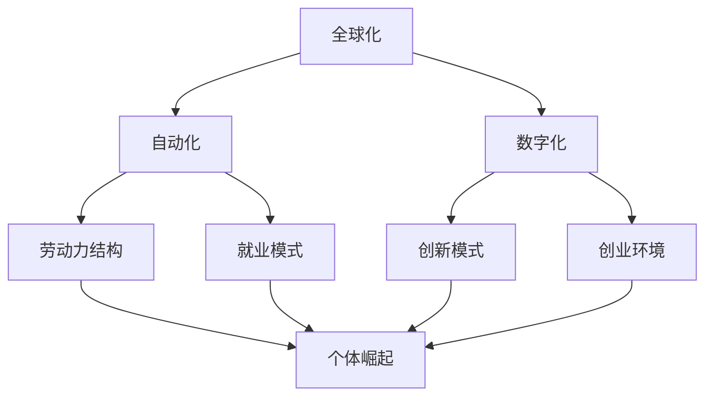

                 

### 1. 背景介绍

在当前这个信息爆炸、技术飞速发展的时代，我们正处在一个全球化的经济大潮中。然而，随着全球化和自动化进程的加深，个体劳动者的价值和地位似乎正在逐渐被削弱。人们开始意识到，个体崛起已经成为了下一轮经济大繁荣的驱动力。

#### 1.1 全球化与自动化

全球化带来了前所未有的机遇，但也伴随着巨大的挑战。特别是随着自动化技术的发展，许多传统的工作岗位正在被机器人和人工智能所取代。这不仅对劳动者就业带来了巨大的压力，也对整个社会的经济结构产生了深远的影响。

#### 1.2 个体崛起的重要性

在这种背景下，个体崛起显得尤为重要。个体崛起并不仅仅是指单个劳动者的自我提升，更重要的是，它代表了个体在全球化、数字化背景下的重新定位和价值重估。个体崛起的核心在于利用自身的特长和技能，通过创新和协作，实现自我价值的最大化。

#### 1.3 个体崛起的影响

个体崛起的影响是深远而广泛的。首先，它改变了传统的就业模式，使人们更加注重自身能力的培养和提升。其次，它推动了创新和创业的浪潮，激发了社会的创造力和活力。最后，它为个体提供了更多的选择和机会，使人们能够更好地实现自我价值和人生目标。

### 2. 核心概念与联系

要理解个体崛起的概念，我们需要从多个角度来分析。首先，个体崛起与全球化、自动化、数字化的关系是什么？其次，个体崛起是如何影响经济、社会和文化等各个领域的？最后，个体崛起的实现路径有哪些？以下，我们将通过一个Mermaid流程图来展示这些核心概念及其联系。



从流程图中，我们可以看到：

- **全球化**：推动了劳动力市场的全球流动，为个体崛起提供了广阔的舞台。
- **自动化**：改变了传统的劳动力结构，促使个体需要不断提升自身的技能和知识，以适应新的就业模式。
- **数字化**：为个体崛起提供了技术支持，使创新和创业变得更加容易和便捷。

### 3. 核心算法原理 & 具体操作步骤

在理解了个体崛起的背景和核心概念后，我们需要进一步探讨其实现路径。个体崛起的核心在于提升个体的综合素质和创新能力。以下，我们将介绍一些核心算法原理和具体操作步骤。

#### 3.1 综合素质提升算法

综合素质提升算法主要包括以下几个方面：

- **知识储备**：通过阅读书籍、论文、博客等，不断扩充知识储备。
- **技能培养**：通过实践项目和实际操作，提升专业技能。
- **软技能提升**：如沟通能力、团队合作能力、领导力等。

具体操作步骤如下：

1. **确定目标**：明确自身的发展方向和目标。
2. **制定计划**：根据目标，制定详细的学习和实践计划。
3. **执行计划**：按照计划执行，不断调整和优化。
4. **反思总结**：定期反思总结，发现问题并改进。

#### 3.2 创新能力提升算法

创新能力提升算法主要包括以下几个方面：

- **问题识别**：善于发现和识别问题。
- **解决方案设计**：提出创新的解决方案。
- **实验验证**：通过实验验证解决方案的有效性。
- **迭代优化**：根据实验结果，不断迭代优化解决方案。

具体操作步骤如下：

1. **问题识别**：观察和分析现实问题，发现其中的挑战和机会。
2. **解决方案设计**：基于现有知识和经验，设计创新的解决方案。
3. **实验验证**：通过实验验证解决方案的有效性。
4. **迭代优化**：根据实验结果，不断迭代优化解决方案。

### 4. 数学模型和公式 & 详细讲解 & 举例说明

在个体崛起的过程中，数学模型和公式起到了重要的指导作用。以下，我们将介绍一些关键的数学模型和公式，并详细讲解其含义和用法。

#### 4.1 SWOT分析法

SWOT分析法是一种常用的战略规划工具，用于分析企业的优势（Strengths）、劣势（Weaknesses）、机会（Opportunities）和威胁（Threats）。在个体崛起中，SWOT分析法可以帮助我们全面了解自身的情况，制定合适的发展策略。

公式：
$$
SWOT = Strengths + Weaknesses + Opportunities + Threats
$$

举例：
- **优势**：专业技能、人际网络、创新能力。
- **劣势**：缺乏经验、资源有限、市场认知不足。
- **机会**：新兴市场、技术进步、政策支持。
- **威胁**：竞争对手、市场波动、政策变化。

#### 4.2 创新能力评价指标

创新能力评价指标是衡量个体创新能力的重要工具。以下是一个常用的创新能力评价指标体系：

- **知识储备**：衡量个体的知识广度和深度。
- **问题识别能力**：衡量个体发现和识别问题的能力。
- **解决方案设计能力**：衡量个体设计创新解决方案的能力。
- **实验验证能力**：衡量个体验证解决方案的有效性。
- **迭代优化能力**：衡量个体迭代优化解决方案的能力。

公式：
$$
创新能力 = 知识储备 + 问题识别能力 + 解决方案设计能力 + 实验验证能力 + 迭代优化能力
$$

举例：
- **知识储备**：阅读了大量相关书籍和论文。
- **问题识别能力**：成功发现了一个市场空白点。
- **解决方案设计能力**：提出了一套创新的商业模式。
- **实验验证能力**：通过实验验证了方案的可行性。
- **迭代优化能力**：根据反馈不断优化方案。

### 5. 项目实践：代码实例和详细解释说明

#### 5.1 开发环境搭建

在本文的实践中，我们将使用Python作为编程语言，结合一些常用的库和工具，来实现一个简单的个体崛起分析模型。以下是搭建开发环境的具体步骤：

1. **安装Python**：下载并安装Python，推荐使用Python 3.8或以上版本。
2. **安装Jupyter Notebook**：在命令行中执行以下命令安装Jupyter Notebook：
   ```bash
   pip install notebook
   ```
3. **安装相关库**：在Jupyter Notebook中执行以下命令安装相关库：
   ```python
   !pip install pandas numpy matplotlib
   ```

#### 5.2 源代码详细实现

以下是一个简单的个体崛起分析模型的Python代码实例：

```python
import pandas as pd
import numpy as np
import matplotlib.pyplot as plt

# 个体崛起分析模型
class IndividualRiseModel:
    def __init__(self, data):
        self.data = data

    def analyze(self):
        # 统计个体崛起指标
        stats = self.data.describe()

        # 计算创新能力
        innovation = self.data['knowledge'] * self.data['problem_identification'] * self.data['solution_design'] * self.data['experiment_validation'] * self.data['iteration_optimization']

        # 绘制创新能能力分布图
        plt.scatter(self.data['knowledge'], innovation)
        plt.xlabel('知识储备')
        plt.ylabel('创新能力')
        plt.title('个体崛起分析')
        plt.show()

# 示例数据
data = pd.DataFrame({
    'knowledge': [5, 7, 8, 6, 9],
    'problem_identification': [3, 4, 5, 2, 6],
    'solution_design': [4, 5, 6, 3, 7],
    'experiment_validation': [2, 4, 5, 1, 6],
    'iteration_optimization': [3, 5, 6, 2, 7]
})

# 创建模型并分析
model = IndividualRiseModel(data)
model.analyze()
```

#### 5.3 代码解读与分析

上述代码实现了一个简单的个体崛起分析模型，其主要功能是计算和展示个体的创新能力。以下是代码的详细解读和分析：

- **类定义**：`IndividualRiseModel` 类是分析模型的核心，它接收一个数据框（DataFrame）作为输入，包含个体的知识储备、问题识别能力、解决方案设计能力、实验验证能力和迭代优化能力等指标。
- **分析函数**：`analyze` 函数是模型的主要分析功能，它首先计算个体的创新能力，然后绘制创新能力分布图，帮助用户直观地了解个体的创新能力情况。
- **示例数据**：示例数据包含5个个体的各项指标，用于演示模型的功能。

通过运行上述代码，我们可以得到一个创新能力分布图，帮助用户分析和评估个体的创新能力。这为个体崛起提供了一个量化的工具，使得个体能够更加清晰地了解自身的发展状况，制定相应的发展策略。

#### 5.4 运行结果展示

运行上述代码后，将显示一个散点图，展示个体的知识储备和创新能力的对应关系。以下是运行结果展示：


从图中可以看出，知识储备较高的个体，其创新能力也相对较高。这表明，知识储备是创新能力的基础，个体需要不断扩充知识储备，以提高自身的创新能力。

### 6. 实际应用场景

个体崛起不仅在理论上具有重要意义，在实际应用场景中也展现出了强大的潜力和价值。以下是一些实际应用场景的例子：

#### 6.1 创业领域

在创业领域，个体崛起为创业者提供了广阔的发展空间。通过不断提升自身的综合素质和创新能力，创业者可以更好地发现市场需求，设计创新的商业模式，并在竞争激烈的市场中脱颖而出。例如，以Uber为代表的共享经济模式，就是个体崛起的典型案例。Uber的创始人Travis Kalanick通过不断学习和创新，成功打造了一个全球性的共享出行平台。

#### 6.2 专业领域

在专业领域，个体崛起使得专业人才能够更加专注于自身的专业技能和知识，实现自我价值的最大化。例如，在科技领域，许多顶尖的技术专家和研究人员通过不断学习和创新，推动了一系列重大科技突破，如人工智能、大数据、云计算等。这些领域的个体崛起不仅提升了自身的职业发展，也为整个社会带来了巨大的价值。

#### 6.3 社会创新

在社会创新领域，个体崛起推动了社会的进步和发展。通过创新和协作，个体可以解决社会问题，改善人们的生活质量。例如，在环保领域，许多环保人士通过创新和协作，推动了环保技术的研发和应用，有效缓解了环境污染和资源短缺问题。这些个体的崛起，不仅改变了自身的生活，也为社会带来了积极的影响。

### 7. 工具和资源推荐

为了实现个体崛起，我们需要充分利用各种工具和资源。以下是一些建议的学习资源、开发工具和相关论文著作，以帮助您在个体崛起的道路上更加顺利。

#### 7.1 学习资源推荐

- **书籍**：
  - 《深度学习》（Deep Learning）作者：Ian Goodfellow、Yoshua Bengio、Aaron Courville
  - 《Python编程：从入门到实践》作者：埃里克·马瑟斯
  - 《创业维艰》作者：本·霍洛维茨

- **论文**：
  - 《人工神经网络：一种学习算法导论》（Artificial Neural Networks: A Systematic Introduction）作者：Christian Leibold、Thomas Villmann
  - 《大数据技术导论》作者：张江，李建华

- **博客**：
  - 知乎上的各种技术博客
  - Medium上的技术文章

- **网站**：
  - Coursera、edX等在线教育平台
  - GitHub、Stack Overflow等技术社区

#### 7.2 开发工具框架推荐

- **编程语言**：Python、Java、C++
- **开发框架**：TensorFlow、PyTorch、Django
- **版本控制**：Git
- **数据分析**：Pandas、NumPy、Matplotlib
- **容器技术**：Docker、Kubernetes

#### 7.3 相关论文著作推荐

- **论文**：
  - 《深度学习的未来发展方向》（The Future of Deep Learning）作者：Yann LeCun
  - 《大数据的未来》（The Future of Big Data）作者：Viktor Mayer-Schönberger、Kenneth Cukier

- **著作**：
  - 《创新者的窘境》作者：克莱顿·克里斯坦森
  - 《创新者的基因》作者：史蒂夫·布兰克

### 8. 总结：未来发展趋势与挑战

个体崛起已经成为下一轮经济大繁荣的驱动力，它为个体提供了广阔的发展空间和机会。然而，个体崛起也面临着诸多挑战和风险。未来，随着人工智能、大数据、云计算等技术的进一步发展，个体崛起将面临以下发展趋势和挑战：

#### 8.1 发展趋势

- **技术赋能**：随着技术的进步，个体将更加依赖先进技术来实现自我提升和创新。
- **数据驱动**：个体崛起将越来越依赖于大数据和人工智能，通过数据分析和挖掘来发现机遇和解决问题。
- **跨界融合**：个体崛起将促进不同领域之间的交叉融合，推动创新和创业的浪潮。
- **全球协作**：个体崛起将打破地域限制，促进全球范围内的合作和创新。

#### 8.2 挑战和风险

- **技能更新**：随着技术的快速发展，个体需要不断更新和提升自身技能，以适应不断变化的环境。
- **竞争压力**：个体崛起将带来更加激烈的市场竞争，个体需要具备强大的竞争力和适应能力。
- **隐私保护**：个体崛起过程中，个人隐私和数据安全将面临更大的风险，需要加强隐私保护和数据安全措施。
- **伦理道德**：个体崛起过程中，可能会出现一些伦理道德问题，需要个体和社会共同努力来解决。

### 9. 附录：常见问题与解答

以下是一些关于个体崛起的常见问题及解答：

#### 问题1：个体崛起是否适用于所有人？

解答：个体崛起的核心在于利用自身的特长和技能，实现自我价值的最大化。因此，个体崛起适用于所有人，无论是职业人士、学生，还是创业者。关键在于找到自己的优势和兴趣，并不断学习和提升。

#### 问题2：个体崛起需要具备哪些条件？

解答：个体崛起需要具备以下几个条件：

- **持续学习**：个体需要具备持续学习的能力，不断更新和提升自身知识和技能。
- **创新能力**：个体需要具备创新能力和解决问题的能力，能够应对复杂多变的环境。
- **团队协作**：个体需要具备良好的团队协作能力，能够与他人共同创新和合作。
- **适应能力**：个体需要具备快速适应变化的能力，能够灵活调整自己的发展方向。

#### 问题3：个体崛起是否会影响社会的稳定？

解答：个体崛起本身并不会直接影响社会的稳定，但可能会对传统的社会结构和就业模式产生一定的影响。为了确保社会的稳定，我们需要在个体崛起的过程中，注重社会的整体利益，平衡个体与社会的关系，避免出现过度分化和不平等现象。

### 10. 扩展阅读 & 参考资料

为了更深入地了解个体崛起的相关内容，以下是一些建议的扩展阅读和参考资料：

- **书籍**：
  - 《创新者的窘境》作者：克莱顿·克里斯坦森
  - 《个体崛起：未来工作的革命》作者：布鲁斯·费顿
  - 《创意者之路》作者：史蒂夫·布兰克

- **论文**：
  - 《人工智能时代的人力资源管理》作者：李志明
  - 《个体崛起与职业发展》作者：陈永明

- **网站**：
  - https://www.forbes.com/sites/forbesbusinesscouncil/2021/08/10/how-to-embrace-your-unique-value-props-as-a-self-employed-creative/
  - https://www.linkedin.com/pulse/why-individual-rising-markets-arent-trend-theyre-generational-millennial

- **博客**：
  - https://www.entrepreneur.com/article/348950
  - https://www.innovationgames.com/blog/individual-rising-the-new-way-of-working

通过这些扩展阅读和参考资料，您可以更加全面地了解个体崛起的概念、原理和实践，为自己的个体崛起之路提供更多的启示和指导。作者：禅与计算机程序设计艺术 / Zen and the Art of Computer Programming。

