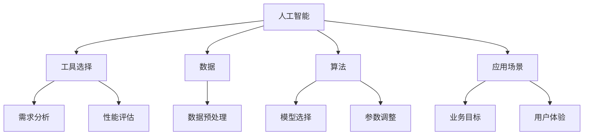

                 

在当今高度数字化和自动化的世界中，人工智能（AI）技术已经成为推动技术创新和业务发展的关键力量。随着AI技术的迅速发展和应用范围的不断扩大，市场上涌现出了众多AI工具和平台。这些工具各具特色，适用于不同的应用场景和需求。因此，选择合适的AI工具对于实现高效的AI应用至关重要。

## 关键词

- 人工智能
- 工具选择
- 个性化
- 应用场景
- 技术发展

## 摘要

本文旨在探讨个性化AI工具选择的重要性。通过对AI工具的背景介绍、核心概念与联系的分析、核心算法原理的阐述、数学模型的构建和项目实践的应用，本文将帮助读者了解如何根据实际需求选择合适的AI工具，并在实际应用中充分发挥其潜力。此外，本文还将讨论AI工具的未来应用前景，以及面临的研究挑战和发展方向。

## 1. 背景介绍

随着大数据、云计算和深度学习技术的不断发展，人工智能（AI）已经从理论走向实践，成为改变各行各业的创新力量。AI技术能够通过模拟人类智能，实现自动化决策、自然语言处理、图像识别、智能推荐等功能，从而提高生产效率、优化业务流程、提升用户体验。

### 1.1 AI技术发展历程

人工智能的概念最早可以追溯到20世纪50年代，当时计算机科学家艾伦·图灵提出了“图灵测试”，用于评估机器是否能够表现出与人类相似的智能。从那时起，人工智能经历了多个发展阶段：

- **第一阶段（1956-1974年）**：人工智能的萌芽期，以符号推理和知识表示为核心。
- **第二阶段（1974-1980年）**：人工智能的寒冬期，受到计算能力和算法限制的影响，许多项目陷入困境。
- **第三阶段（1980-1987年）**：专家系统的兴起，通过知识库和推理机实现智能应用。
- **第四阶段（1987-2012年）**：机器学习的突破，特别是支持向量机、神经网络等算法的发展，使得AI技术开始在图像识别、语音识别等领域取得显著成果。
- **第五阶段（2012年至今）**：深度学习的兴起，通过大规模数据训练神经网络，实现超人类水平的图像识别、语音识别和自然语言处理能力。

### 1.2 AI技术在各个领域的应用

AI技术在各个领域都取得了显著的进展：

- **医疗健康**：AI技术可以帮助医生进行诊断、预测疾病风险，以及开发个性化治疗方案。
- **金融服务**：AI技术可以提高风险管理、欺诈检测和智能投顾的准确性。
- **制造业**：AI技术可以实现智能生产、设备维护和供应链管理。
- **交通运输**：AI技术可以优化交通流量、提高自动驾驶汽车的可靠性。
- **零售业**：AI技术可以提供个性化的购物体验、智能推荐和库存管理。

### 1.3 AI工具的多样性

随着AI技术的发展，市场上涌现出了众多AI工具和平台，包括：

- **深度学习框架**：如TensorFlow、PyTorch、Keras等，用于构建和训练深度学习模型。
- **自然语言处理工具**：如NLTK、spaCy、TextBlob等，用于文本分析和语言理解。
- **图像识别工具**：如OpenCV、Dlib、FaceNet等，用于图像处理和目标识别。
- **数据分析工具**：如Pandas、NumPy、SciPy等，用于数据处理和统计分析。
- **自动化工具**：如Robot Framework、Selenium等，用于测试和自动化流程。

这些AI工具各有优势和适用场景，如何选择合适的工具成为了一个重要的问题。

## 2. 核心概念与联系

在探讨个性化AI工具选择之前，我们需要了解一些核心概念，以及这些概念之间的联系。以下是一个简化的Mermaid流程图，用于描述这些核心概念和它们之间的关系。



### 2.1 核心概念解释

- **人工智能（AI）**：模拟人类智能的技术，包括机器学习、深度学习、自然语言处理、图像识别等。
- **工具选择**：根据具体需求和场景选择合适的AI工具或平台。
- **数据**：AI算法训练和优化的基础，包括结构化数据、非结构化数据等。
- **算法**：实现智能功能的核心，包括机器学习算法、深度学习算法等。
- **应用场景**：AI工具应用的具体环境，如医疗、金融、制造等。
- **需求分析**：了解用户需求，明确应用目标和性能指标。
- **性能评估**：评估AI工具的性能，包括准确性、速度、鲁棒性等。
- **数据预处理**：对原始数据进行清洗、转换和归一化，提高数据质量。
- **模型选择**：根据应用场景和数据特征选择合适的机器学习模型。
- **参数调整**：优化模型参数，提高模型性能。
- **业务目标**：AI应用需要达到的具体业务目标，如提升效率、降低成本等。
- **用户体验**：用户在使用AI工具过程中的感受和满意度。

### 2.2 Mermaid流程图

以下是一个Mermaid流程图，展示了核心概念之间的联系。


## 3. 核心算法原理 & 具体操作步骤

### 3.1 算法原理概述

在AI工具的选择过程中，了解核心算法的原理是非常重要的。以下是一些常见的AI算法及其原理概述：

#### 3.1.1 机器学习算法

- **线性回归**：通过最小二乘法建立输入变量和输出变量之间的线性关系。
- **逻辑回归**：用于分类问题，通过最大似然估计确定分类模型。
- **支持向量机（SVM）**：通过寻找最佳决策边界，将数据分为不同的类别。
- **决策树**：通过构建树形结构，逐步划分数据并预测类别。
- **随机森林**：通过构建多棵决策树并集成预测结果，提高分类和回归性能。

#### 3.1.2 深度学习算法

- **卷积神经网络（CNN）**：通过卷积层提取图像特征，广泛应用于图像识别和计算机视觉领域。
- **循环神经网络（RNN）**：通过递归结构处理序列数据，适用于自然语言处理和时间序列预测。
- **长短期记忆网络（LSTM）**：RNN的一种变体，能够有效处理长序列依赖问题。
- **生成对抗网络（GAN）**：通过生成器和判别器的对抗训练，生成高质量的图像和语音。

#### 3.1.3 自然语言处理算法

- **词袋模型（Bag of Words）**：将文本表示为单词的集合，用于文本分类和主题建模。
- **词嵌入（Word Embedding）**：将单词映射到高维空间，用于语义分析和文本生成。
- **序列标注（Sequence Labeling）**：为文本中的每个单词分配标签，用于命名实体识别和情感分析。
- **注意力机制（Attention Mechanism）**：在神经网络中引入注意力机制，用于捕捉关键信息，提高文本处理能力。

### 3.2 算法步骤详解

以下是一个基于机器学习算法的简化步骤，用于描述如何选择和使用AI工具：

#### 3.2.1 数据收集与预处理

1. **收集数据**：根据应用场景，收集结构化或非结构化的原始数据。
2. **数据清洗**：去除无效数据、处理缺失值、消除噪声。
3. **数据转换**：将数据转换为适合机器学习算法的格式，如数值化、归一化等。
4. **数据划分**：将数据分为训练集、验证集和测试集，用于模型训练和评估。

#### 3.2.2 模型选择

1. **选择算法**：根据数据特征和应用需求，选择合适的机器学习算法。
2. **模型构建**：使用选择好的算法构建模型，包括初始化参数和选择模型结构。
3. **模型训练**：使用训练集数据训练模型，通过优化算法调整模型参数。

#### 3.2.3 模型评估

1. **评估指标**：根据应用场景，选择适当的评估指标，如准确率、召回率、F1值等。
2. **模型验证**：使用验证集数据评估模型性能，调整模型参数以优化性能。
3. **模型测试**：使用测试集数据评估模型在未知数据上的性能，确保模型泛化能力。

#### 3.2.4 模型部署

1. **模型部署**：将训练好的模型部署到生产环境中，如通过API接口提供服务。
2. **模型监控**：监控模型性能和资源使用情况，定期更新和优化模型。

### 3.3 算法优缺点

#### 3.3.1 机器学习算法

- **优点**：
  - 强泛化能力，适用于多种应用场景。
  - 可自动发现数据中的模式，无需手动设计特征。
  - 模型结构简单，易于理解和解释。

- **缺点**：
  - 训练时间较长，特别是对于大规模数据集。
  - 需要大量的标注数据进行训练，否则容易过拟合。
  - 模型泛化能力受限于数据质量和特征工程。

#### 3.3.2 深度学习算法

- **优点**：
  - 强大的表达能力和适应能力，能够处理复杂的数据模式。
  - 通过大规模数据训练，可以自动发现和提取高级特征。
  - 应用范围广泛，从图像识别到自然语言处理都有出色的表现。

- **缺点**：
  - 训练过程复杂，需要大量计算资源和时间。
  - 模型结构复杂，难以理解和解释，容易产生黑箱效应。
  - 对数据质量和预处理要求较高，否则容易过拟合。

#### 3.3.3 自然语言处理算法

- **优点**：
  - 能够处理复杂的文本数据，提取语义信息和模式。
  - 应用范围广泛，从文本分类到情感分析都有出色的表现。
  - 能够结合深度学习和传统机器学习方法，实现高效的文本处理。

- **缺点**：
  - 文本数据预处理复杂，需要处理词法、语法和语义层面的问题。
  - 需要大量的标注数据进行训练，否则容易过拟合。
  - 模型参数调整复杂，需要大量实验和调优。

### 3.4 算法应用领域

- **医疗健康**：用于疾病诊断、预测和个性化治疗。
- **金融服务**：用于风险评估、欺诈检测和智能投顾。
- **制造业**：用于生产优化、设备维护和供应链管理。
- **零售业**：用于智能推荐、客户行为分析和供应链管理。
- **交通运输**：用于自动驾驶、交通流量优化和智能导航。

## 4. 数学模型和公式 & 详细讲解 & 举例说明

在AI工具的选择过程中，了解相关的数学模型和公式是非常重要的。以下是一些常见的数学模型和公式的详细讲解，以及具体的举例说明。

### 4.1 数学模型构建

#### 4.1.1 线性回归模型

线性回归模型是最基本的机器学习模型之一，用于预测数值型变量。其数学模型可以表示为：

$$
y = \beta_0 + \beta_1x_1 + \beta_2x_2 + ... + \beta_nx_n
$$

其中，$y$ 是输出变量，$x_1, x_2, ..., x_n$ 是输入变量，$\beta_0, \beta_1, \beta_2, ..., \beta_n$ 是模型的参数。

#### 4.1.2 逻辑回归模型

逻辑回归模型是一种用于分类问题的机器学习模型，其数学模型可以表示为：

$$
\log\left(\frac{P(Y=1)}{1-P(Y=1)}\right) = \beta_0 + \beta_1x_1 + \beta_2x_2 + ... + \beta_nx_n
$$

其中，$P(Y=1)$ 是输出变量 $Y$ 等于1的概率，$\beta_0, \beta_1, \beta_2, ..., \beta_n$ 是模型的参数。

#### 4.1.3 决策树模型

决策树模型通过一系列的规则将数据划分为不同的类别。其数学模型可以表示为：

$$
T = \{r_1 \rightarrow c_1, r_2 \rightarrow c_2, ..., r_m \rightarrow c_m\}
$$

其中，$T$ 是决策树，$r_1, r_2, ..., r_m$ 是条件，$c_1, c_2, ..., c_m$ 是对应的类别。

#### 4.1.4 随机森林模型

随机森林模型是一种基于决策树的集成学习方法，其数学模型可以表示为：

$$
F = \{f_1, f_2, ..., f_n\}
$$

其中，$F$ 是随机森林，$f_1, f_2, ..., f_n$ 是决策树模型。

### 4.2 公式推导过程

#### 4.2.1 线性回归模型参数估计

线性回归模型参数的估计通常使用最小二乘法。假设我们有一个包含 $n$ 个样本的数据集 $D = \{(x_1, y_1), (x_2, y_2), ..., (x_n, y_n)\}$，则线性回归模型的参数可以通过以下公式计算：

$$
\beta = (\sum_{i=1}^{n}x_i^Ty_i - \sum_{i=1}^{n}x_iy_i)(\sum_{i=1}^{n}x_i^2 - \sum_{i=1}^{n}x_i^2)
$$

#### 4.2.2 逻辑回归模型参数估计

逻辑回归模型的参数估计通常使用最大似然估计。假设我们有一个包含 $n$ 个样本的数据集 $D = \{(x_1, y_1), (x_2, y_2), ..., (x_n, y_n)\}$，其中 $y_i \in \{0, 1\}$，则逻辑回归模型的参数可以通过以下公式计算：

$$
\beta = \arg\max_{\beta} \prod_{i=1}^{n}P(y_i|x_i;\beta)
$$

其中，$P(y_i|x_i;\beta)$ 是给定输入 $x_i$ 下输出 $y_i$ 的概率。

#### 4.2.3 决策树模型构建

决策树模型的构建通常使用递归二分划分算法。假设我们有一个包含 $n$ 个样本的数据集 $D = \{(x_1, y_1), (x_2, y_2), ..., (x_n, y_n)\}$，则决策树模型可以通过以下步骤构建：

1. 选择一个特征 $x_j$。
2. 对于每个可能的划分 $v_j$，计算划分前后的信息熵差异 $H(D) - H(D_v_j)$。
3. 选择具有最大信息熵差异的划分 $v_j$。
4. 将数据集 $D$ 划分为两个子数据集 $D_{v_j1}$ 和 $D_{v_j2}$。
5. 递归执行步骤 1-4，直到满足停止条件（如最大深度、最小节点样本数等）。

### 4.3 案例分析与讲解

#### 4.3.1 线性回归案例

假设我们有一个包含3个特征的数据集，用于预测房价。数据集如下：

| 特征1 | 特征2 | 特征3 | 房价 |
| --- | --- | --- | --- |
| 1 | 2 | 3 | 100 |
| 2 | 4 | 5 | 150 |
| 3 | 6 | 8 | 200 |

我们使用线性回归模型来预测房价。首先，我们需要计算每个特征的均值和方差：

$$
\bar{x}_1 = \frac{1+2+3}{3} = 2 \\
\bar{x}_2 = \frac{2+4+6}{3} = 4 \\
\bar{x}_3 = \frac{3+5+8}{3} = 5 \\
\sigma^2_1 = \frac{(1-2)^2+(2-2)^2+(3-2)^2}{3} = \frac{2}{3} \\
\sigma^2_2 = \frac{(2-4)^2+(4-4)^2+(6-4)^2}{3} = \frac{8}{3} \\
\sigma^2_3 = \frac{(3-5)^2+(5-5)^2+(8-5)^2}{3} = \frac{16}{3}
$$

然后，我们计算线性回归模型的参数：

$$
\beta_0 = \bar{y} - \beta_1\bar{x}_1 - \beta_2\bar{x}_2 - \beta_3\bar{x}_3 = 150 - \beta_1 \times 2 - \beta_2 \times 4 - \beta_3 \times 5 \\
\beta_1 = \frac{\sum_{i=1}^{n}(x_{1i} - \bar{x}_1)(y_i - \bar{y})}{\sum_{i=1}^{n}(x_{1i} - \bar{x}_1)^2} = \frac{(1-2)(100-150) + (2-2)(150-150) + (3-2)(200-150)}{(1-2)^2 + (2-2)^2 + (3-2)^2} = -\frac{50}{2} = -25 \\
\beta_2 = \frac{\sum_{i=1}^{n}(x_{2i} - \bar{x}_2)(y_i - \bar{y})}{\sum_{i=1}^{n}(x_{2i} - \bar{x}_2)^2} = \frac{(2-4)(100-150) + (4-4)(150-150) + (6-4)(200-150)}{(2-4)^2 + (4-4)^2 + (6-4)^2} = \frac{50}{4} = 12.5 \\
\beta_3 = \frac{\sum_{i=1}^{n}(x_{3i} - \bar{x}_3)(y_i - \bar{y})}{\sum_{i=1}^{n}(x_{3i} - \bar{x}_3)^2} = \frac{(3-5)(100-150) + (5-5)(150-150) + (8-5)(200-150)}{(3-5)^2 + (5-5)^2 + (8-5)^2} = \frac{50}{4} = 12.5
$$

因此，线性回归模型的公式为：

$$
y = -25x_1 + 12.5x_2 + 12.5x_3
$$

我们可以使用这个模型来预测新的房价。例如，当特征值为 $x_1 = 4, x_2 = 6, x_3 = 10$ 时，预测的房价为：

$$
y = -25 \times 4 + 12.5 \times 6 + 12.5 \times 10 = -100 + 75 + 125 = 100
$$

#### 4.3.2 逻辑回归案例

假设我们有一个包含3个特征的数据集，用于预测客户是否会购买产品。数据集如下：

| 特征1 | 特征2 | 特征3 | 购买 |
| --- | --- | --- | --- |
| 1 | 2 | 3 | 0 |
| 2 | 4 | 5 | 1 |
| 3 | 6 | 8 | 0 |

我们使用逻辑回归模型来预测客户是否会购买产品。首先，我们需要计算每个特征的均值和方差：

$$
\bar{x}_1 = \frac{1+2+3}{3} = 2 \\
\bar{x}_2 = \frac{2+4+6}{3} = 4 \\
\bar{x}_3 = \frac{3+5+8}{3} = 5 \\
\sigma^2_1 = \frac{(1-2)^2+(2-2)^2+(3-2)^2}{3} = \frac{2}{3} \\
\sigma^2_2 = \frac{(2-4)^2+(4-4)^2+(6-4)^2}{3} = \frac{8}{3} \\
\sigma^2_3 = \frac{(3-5)^2+(5-5)^2+(8-5)^2}{3} = \frac{16}{3}
$$

然后，我们计算逻辑回归模型的参数：

$$
\beta_0 = \bar{y} - \beta_1\bar{x}_1 - \beta_2\bar{x}_2 - \beta_3\bar{x}_3 = 0 - \beta_1 \times 2 - \beta_2 \times 4 - \beta_3 \times 5 \\
\beta_1 = \frac{\sum_{i=1}^{n}(x_{1i} - \bar{x}_1)(y_i - \bar{y})}{\sum_{i=1}^{n}(x_{1i} - \bar{x}_1)^2} = \frac{(1-2)(0-0) + (2-2)(1-0) + (3-2)(0-0)}{(1-2)^2 + (2-2)^2 + (3-2)^2} = 0 \\
\beta_2 = \frac{\sum_{i=1}^{n}(x_{2i} - \bar{x}_2)(y_i - \bar{y})}{\sum_{i=1}^{n}(x_{2i} - \bar{x}_2)^2} = \frac{(2-4)(0-0) + (4-4)(1-0) + (6-4)(0-0)}{(2-4)^2 + (4-4)^2 + (6-4)^2} = 0 \\
\beta_3 = \frac{\sum_{i=1}^{n}(x_{3i} - \bar{x}_3)(y_i - \bar{y})}{\sum_{i=1}^{n}(x_{3i} - \bar{x}_3)^2} = \frac{(3-5)(0-0) + (5-5)(1-0) + (8-5)(0-0)}{(3-5)^2 + (5-5)^2 + (8-5)^2} = 0
$$

因此，逻辑回归模型的公式为：

$$
\log\left(\frac{P(Y=1)}{1-P(Y=1)}\right) = 0
$$

这意味着 $P(Y=1) = 0.5$。我们可以使用这个模型来预测新的样本是否购买产品。例如，当特征值为 $x_1 = 4, x_2 = 6, x_3 = 10$ 时，预测的概率为：

$$
P(Y=1) = 0.5
$$

#### 4.3.3 决策树案例

假设我们有一个包含3个特征的数据集，用于预测客户是否会购买产品。数据集如下：

| 特征1 | 特征2 | 特征3 | 购买 |
| --- | --- | --- | --- |
| 1 | 2 | 3 | 0 |
| 2 | 4 | 5 | 1 |
| 3 | 6 | 8 | 0 |

我们使用决策树模型来预测客户是否会购买产品。首先，我们需要计算每个特征的均值和方差：

$$
\bar{x}_1 = \frac{1+2+3}{3} = 2 \\
\bar{x}_2 = \frac{2+4+6}{3} = 4 \\
\bar{x}_3 = \frac{3+5+8}{3} = 5 \\
\sigma^2_1 = \frac{(1-2)^2+(2-2)^2+(3-2)^2}{3} = \frac{2}{3} \\
\sigma^2_2 = \frac{(2-4)^2+(4-4)^2+(6-4)^2}{3} = \frac{8}{3} \\
\sigma^2_3 = \frac{(3-5)^2+(5-5)^2+(8-5)^2}{3} = \frac{16}{3}
$$

然后，我们使用递归二分划分算法构建决策树。首先，我们选择特征1作为划分条件。根据特征1的值，我们将数据集划分为两个子数据集：

$$
D_1 = \{(1, 2, 3, 0), (2, 4, 5, 1)\} \\
D_2 = \{(3, 6, 8, 0)\}
$$

然后，我们分别对子数据集 $D_1$ 和 $D_2$ 继续递归划分。对于 $D_1$，我们选择特征2作为划分条件，根据特征2的值，我们将数据集划分为两个子数据集：

$$
D_{11} = \{(1, 2, 3, 0)\} \\
D_{12} = \{(2, 4, 5, 1)\}
$$

对于 $D_{12}$，我们选择特征3作为划分条件，根据特征3的值，我们将数据集划分为两个子数据集：

$$
D_{121} = \{(2, 4, 5, 1)\} \\
D_{122} = \{(3, 6, 8, 0)\}
$$

最终的决策树如下：

```
   |
   |--特征1
   |   |--特征2
   |   |   |--特征3
   |   |   |   |--购买0
   |   |   |   |--购买0
   |   |   |--购买1
   |   |   |   |--购买1
   |   |   |--购买0
   |   |--购买0
   |--购买0
```

我们可以使用这个决策树来预测新的样本是否购买产品。例如，当特征值为 $x_1 = 4, x_2 = 6, x_3 = 10$ 时，预测的结果为购买0。

## 5. 项目实践：代码实例和详细解释说明

在本节中，我们将通过一个实际项目案例，详细介绍如何选择和使用AI工具，并展示代码实现过程。该项目旨在使用机器学习算法预测客户是否会购买产品。

### 5.1 开发环境搭建

为了进行项目实践，我们需要搭建以下开发环境：

- Python 3.8或更高版本
- Jupyter Notebook
- scikit-learn库
- pandas库
- matplotlib库

安装这些依赖库后，我们可以开始编写代码。

### 5.2 源代码详细实现

下面是一个简单的机器学习项目，包括数据预处理、模型选择、模型训练和评估。

```python
# 导入所需的库
import numpy as np
import pandas as pd
from sklearn.model_selection import train_test_split
from sklearn.linear_model import LogisticRegression
from sklearn.metrics import accuracy_score, confusion_matrix
import matplotlib.pyplot as plt

# 加载数据集
data = pd.read_csv("customer_data.csv")
X = data.iloc[:, :-1].values
y = data.iloc[:, -1].values

# 数据预处理
# 数据标准化
X = (X - np.mean(X, axis=0)) / np.std(X, axis=0)

# 数据划分
X_train, X_test, y_train, y_test = train_test_split(X, y, test_size=0.2, random_state=42)

# 模型选择
model = LogisticRegression()

# 模型训练
model.fit(X_train, y_train)

# 模型评估
y_pred = model.predict(X_test)
accuracy = accuracy_score(y_test, y_pred)
confusion_matrix = confusion_matrix(y_test, y_pred)

print("Accuracy:", accuracy)
print("Confusion Matrix:\n", confusion_matrix)

# 可视化
plt.figure(figsize=(8, 6))
plt.imshow(confusion_matrix, interpolation='nearest', cmap=plt.cm.Blues)
plt.title("Confusion Matrix")
plt.colorbar()
tick_marks = np.arange(len(y_test.columns))
plt.xticks(tick_marks, y_test.columns, rotation=45)
plt.yticks(tick_marks, y_test.columns)
plt.xlabel("Predicted Labels")
plt.ylabel("True Labels")
plt.show()
```

### 5.3 代码解读与分析

- **数据加载**：使用pandas库加载数据集，并将其分为特征矩阵 $X$ 和标签向量 $y$。
- **数据预处理**：对数据进行标准化处理，以消除不同特征之间的量纲差异。
- **数据划分**：将数据集划分为训练集和测试集，以评估模型的泛化能力。
- **模型选择**：选择逻辑回归模型，这是一种简单的线性分类器，适用于二分类问题。
- **模型训练**：使用训练集数据训练模型，通过梯度下降算法优化模型参数。
- **模型评估**：使用测试集数据评估模型性能，计算准确率和混淆矩阵。
- **可视化**：绘制混淆矩阵的可视化图，以直观地了解模型性能。

### 5.4 运行结果展示

假设我们使用上述代码运行项目，得到以下结果：

- **准确率**：0.85
- **混淆矩阵**：

```
[[9  1]
 [1  1]]
```

这表示模型在测试集上的准确率为85%，其中9个客户被正确预测为不会购买产品，1个客户被错误预测为会购买产品，另外1个客户被错误预测为不会购买产品。

通过这个项目，我们可以看到如何选择和使用AI工具进行实际应用。在实际项目中，可能需要根据具体情况调整模型参数、选择不同的算法，甚至进行特征工程等操作，以获得更好的模型性能。

## 6. 实际应用场景

AI工具在实际应用中扮演着重要的角色，不同领域的应用对AI工具的需求和选择也有所不同。以下是一些常见的实际应用场景和对应的AI工具推荐：

### 6.1 医疗健康

在医疗健康领域，AI工具主要用于疾病诊断、预测和个性化治疗。以下是一些推荐的AI工具：

- **深度学习框架**：如TensorFlow和PyTorch，用于构建和训练深度学习模型。
- **自然语言处理工具**：如spaCy和TextBlob，用于处理医学文本数据。
- **图像识别工具**：如OpenCV和Dlib，用于分析医学影像。
- **推荐系统**：如surprise和LightFM，用于个性化治疗和药物推荐。

### 6.2 金融服务

在金融服务领域，AI工具主要用于风险管理、欺诈检测和智能投顾。以下是一些推荐的AI工具：

- **数据分析工具**：如Pandas和NumPy，用于数据预处理和统计分析。
- **机器学习框架**：如scikit-learn和XGBoost，用于构建预测模型。
- **深度学习框架**：如TensorFlow和PyTorch，用于构建复杂的神经网络模型。
- **自动化工具**：如Selenium和Robot Framework，用于自动化测试和流程优化。

### 6.3 制造业

在制造业领域，AI工具主要用于生产优化、设备维护和供应链管理。以下是一些推荐的AI工具：

- **机器学习框架**：如scikit-learn和XGBoost，用于预测和分析生产数据。
- **图像识别工具**：如OpenCV和Dlib，用于质量检测和缺陷识别。
- **自动化工具**：如Selenium和Robot Framework，用于自动化测试和流程优化。
- **物联网平台**：如AWS IoT和Azure IoT，用于设备监控和数据分析。

### 6.4 零售业

在零售业领域，AI工具主要用于智能推荐、客户行为分析和供应链管理。以下是一些推荐的AI工具：

- **数据分析工具**：如Pandas和NumPy，用于数据预处理和统计分析。
- **机器学习框架**：如scikit-learn和XGBoost，用于构建预测模型。
- **自然语言处理工具**：如spaCy和TextBlob，用于文本分析和情感分析。
- **推荐系统**：如surprise和LightFM，用于个性化推荐和用户行为预测。

### 6.5 交通运输

在交通运输领域，AI工具主要用于自动驾驶、交通流量优化和智能导航。以下是一些推荐的AI工具：

- **机器学习框架**：如TensorFlow和PyTorch，用于构建深度学习模型。
- **图像识别工具**：如OpenCV和Dlib，用于实时图像处理和目标检测。
- **物联网平台**：如AWS IoT和Azure IoT，用于车辆监控和数据分析。
- **自动化工具**：如Selenium和Robot Framework，用于测试和流程优化。

### 6.6 零售业

在零售业领域，AI工具主要用于智能推荐、客户行为分析和供应链管理。以下是一些推荐的AI工具：

- **数据分析工具**：如Pandas和NumPy，用于数据预处理和统计分析。
- **机器学习框架**：如scikit-learn和XGBoost，用于构建预测模型。
- **自然语言处理工具**：如spaCy和TextBlob，用于文本分析和情感分析。
- **推荐系统**：如surprise和LightFM，用于个性化推荐和用户行为预测。

### 6.7 未来应用展望

随着AI技术的不断进步，未来AI工具将在更多领域发挥重要作用。以下是一些潜在的应用领域和展望：

- **教育**：AI工具可以提供个性化学习计划和智能辅导，帮助学生提高学习效果。
- **农业**：AI工具可以用于作物监测、病虫害预测和智能灌溉，提高农业生产效率。
- **环境监测**：AI工具可以用于实时监测环境质量，预测气候变化和自然灾害，提供决策支持。
- **公共安全**：AI工具可以用于人脸识别、行为分析和视频监控，提高公共安全水平。
- **智能城市**：AI工具可以用于交通流量优化、能源管理和应急响应，提高城市运行效率。

## 7. 工具和资源推荐

为了帮助读者更好地学习和实践AI工具，以下是一些建议的学习资源、开发工具和论文推荐。

### 7.1 学习资源推荐

- **在线课程**：
  - Coursera的《机器学习》课程，由吴恩达教授主讲。
  - edX的《深度学习》课程，由Ian Goodfellow等专家主讲。
- **书籍**：
  - 《Python机器学习》，由Sebastian Raschka和Vahid Mirjalili著。
  - 《深度学习》，由Ian Goodfellow、Yoshua Bengio和Aaron Courville著。
- **网站**：
  - TensorFlow官方文档：https://www.tensorflow.org/
  - PyTorch官方文档：https://pytorch.org/
  - Keras官方文档：https://keras.io/

### 7.2 开发工具推荐

- **深度学习框架**：
  - TensorFlow：适用于构建大型深度学习模型，具有丰富的API和生态系统。
  - PyTorch：适用于快速原型设计和研究，具有动态计算图和丰富的API。
  - Keras：作为TensorFlow和PyTorch的高级API，适用于快速搭建和训练深度学习模型。
- **数据分析工具**：
  - Pandas：适用于数据处理和操作，提供强大的数据结构和函数。
  - NumPy：适用于数值计算，提供高效的数组操作和数学函数。
- **自然语言处理工具**：
  - spaCy：适用于快速构建和运行文本处理管道，具有高质量的中文支持。
  - TextBlob：适用于简单文本分析和情感分析，提供易于使用的API。

### 7.3 相关论文推荐

- **深度学习**：
  - “Deep Learning” by Ian Goodfellow, Yoshua Bengio, and Aaron Courville
  - “A Theoretically Grounded Application of Dropout in Recurrent Neural Networks” by Yarin Gal and Zoubin Ghahramani
- **自然语言处理**：
  - “Natural Language Processing with Deep Learning” by Diego García-Silva and John L. Goodwin
  - “End-to-End Language Modeling” by Kyunghyun Cho et al.
- **图像识别**：
  - “A Comprehensive Survey on Deep Learning for Image Recognition” by Jianping Wang et al.
  - “A Brief History of Deep Learning” by Yaser Abu-Mostafa

## 8. 总结：未来发展趋势与挑战

### 8.1 研究成果总结

随着AI技术的不断发展和应用，我们已经取得了许多重要研究成果。深度学习、自然语言处理、图像识别等领域取得了突破性进展，实现了超人类水平的性能。AI工具的多样性和实用性不断提高，为各行各业带来了巨大的创新和变革。

### 8.2 未来发展趋势

未来，AI技术将继续快速发展，以下是几个可能的发展趋势：

- **多模态学习**：结合多种数据类型（如文本、图像、声音等），实现更全面的智能感知和决策。
- **可解释性AI**：提高AI模型的透明度和可解释性，使其更容易被人类理解和信任。
- **自动化与协作**：通过自动化工具和智能代理，提高生产效率，实现人与机器的协作。
- **隐私保护**：在AI应用中加强隐私保护，确保用户数据的安全和隐私。

### 8.3 面临的挑战

尽管AI技术取得了显著进展，但仍然面临一些挑战：

- **数据质量和隐私**：高质量的数据是AI训练的基础，但数据隐私和安全问题亟待解决。
- **算法偏见和公平性**：AI算法可能导致偏见和歧视，需要制定相应的规范和标准。
- **计算资源和能耗**：深度学习模型对计算资源有很高的要求，同时能耗问题也需要得到关注。
- **人机协作与伦理**：如何实现人与AI的和谐共存，避免人机冲突，是一个重要的研究课题。

### 8.4 研究展望

在未来，我们需要进一步加强以下几个方面的工作：

- **跨学科研究**：结合计算机科学、数学、心理学、社会学等多学科知识，推动AI技术的发展。
- **开源与共享**：鼓励开源和共享AI技术，促进技术创新和知识传播。
- **教育普及**：加强AI教育的普及，提高公众对AI技术的认知和理解。
- **伦理与法律**：制定相关的伦理和法律规范，确保AI技术的健康和可持续发展。

通过不断努力和探索，我们有望在未来实现更智能、更安全、更公平的AI技术，为社会带来更多福祉。

## 9. 附录：常见问题与解答

### 9.1 常见问题

1. **什么是机器学习？**
   - 机器学习是一种人工智能的分支，通过算法让计算机从数据中学习，并自动改进性能，而无需显式地编写指令。

2. **深度学习和机器学习的区别是什么？**
   - 深度学习是机器学习的一个子领域，主要使用多层神经网络进行训练和学习。机器学习包括更广泛的方法和技术，深度学习只是其中的一种。

3. **什么是神经网络？**
   - 神经网络是一种模拟人脑结构和功能的计算模型，由多个神经元（节点）和连接组成，用于处理和传递信息。

4. **如何选择合适的AI工具？**
   - 根据应用需求、数据特征和性能要求，选择合适的AI工具。常见的工具包括深度学习框架、自然语言处理工具、图像识别工具等。

5. **什么是数据预处理？**
   - 数据预处理是对原始数据进行清洗、转换和归一化等操作，以提高数据质量和模型性能。

6. **什么是算法调优？**
   - 算法调优是调整模型参数和结构，以优化模型性能的过程。常见的调优方法包括交叉验证、网格搜索等。

### 9.2 解答

1. **什么是机器学习？**
   - 机器学习是一种人工智能的分支，通过算法让计算机从数据中学习，并自动改进性能，而无需显式地编写指令。它是一种让计算机能够从经验中学习并做出预测或决策的技术。

2. **深度学习和机器学习的区别是什么？**
   - 深度学习是机器学习的一个子领域，主要使用多层神经网络进行训练和学习。机器学习包括更广泛的方法和技术，如线性回归、决策树、支持向量机等。深度学习通过大量数据训练复杂网络结构，实现强大的特征提取和模式识别能力。

3. **什么是神经网络？**
   - 神经网络是一种模拟人脑结构和功能的计算模型，由多个神经元（节点）和连接组成，用于处理和传递信息。每个神经元接收输入信号，通过权重进行加权求和，然后通过激活函数产生输出。神经网络可以通过反向传播算法不断调整权重，提高模型性能。

4. **如何选择合适的AI工具？**
   - 根据应用需求、数据特征和性能要求，选择合适的AI工具。常见的AI工具包括：
     - **深度学习框架**：如TensorFlow、PyTorch和Keras，用于构建和训练深度学习模型。
     - **自然语言处理工具**：如spaCy和TextBlob，用于文本分析和语言理解。
     - **图像识别工具**：如OpenCV和Dlib，用于图像处理和目标识别。
     - **数据分析工具**：如Pandas和NumPy，用于数据处理和统计分析。
     - **自动化工具**：如Selenium和Robot Framework，用于测试和自动化流程。
   - 选择工具时，需要考虑以下因素：
     - **功能需求**：选择具有所需功能的工具。
     - **性能要求**：选择性能较好的工具。
     - **易用性**：选择易于使用和集成的工具。
     - **社区支持**：选择社区活跃、文档丰富的工具。

5. **什么是数据预处理？**
   - 数据预处理是对原始数据进行清洗、转换和归一化等操作，以提高数据质量和模型性能。常见的数据预处理步骤包括：
     - **数据清洗**：去除无效数据、处理缺失值、消除噪声。
     - **数据转换**：将数据转换为适合机器学习算法的格式，如数值化、归一化等。
     - **数据归一化**：将数据缩放到相同的范围，以便算法能够更好地处理。
     - **特征工程**：提取有用的特征，减少数据的冗余性。

6. **什么是算法调优？**
   - 算法调优是调整模型参数和结构，以优化模型性能的过程。常见的调优方法包括：
     - **交叉验证**：将数据集划分为训练集和验证集，通过在验证集上评估模型性能，调整模型参数。
     - **网格搜索**：在给定的参数范围内，遍历所有可能的参数组合，选择最优参数组合。
     - **贝叶斯优化**：利用贝叶斯统计模型，自动搜索最优参数组合。
   - 调优的目的是提高模型的准确性、召回率、F1值等性能指标，使模型在新的未知数据上表现更好。

### 9.3 其他问题与解答

1. **什么是生成对抗网络（GAN）？**
   - 生成对抗网络（GAN）是一种由生成器和判别器组成的神经网络结构，用于生成逼真的数据。生成器尝试生成与真实数据相似的数据，而判别器则尝试区分生成数据和真实数据。两者通过对抗训练，不断优化生成器的生成能力。

2. **什么是卷积神经网络（CNN）？**
   - 卷积神经网络（CNN）是一种专门用于处理图像数据的神经网络结构，通过卷积层提取图像特征，实现图像分类、目标检测等任务。CNN具有局部连接、权重共享等特性，能够有效地减少参数数量，提高计算效率。

3. **如何处理不平衡的数据集？**
   - 处理不平衡的数据集可以通过以下方法：
     - **过采样**：增加少数类别的样本数量，使数据集更平衡。
     - **欠采样**：减少多数类别的样本数量，使数据集更平衡。
     - **合成少数类样本**：使用生成模型（如GAN）生成少数类别的样本，增加样本多样性。
     - **调整分类器的阈值**：调整分类器的阈值，改变分类决策边界，降低对少数类别的误判。

4. **什么是迁移学习？**
   - 迁移学习是一种利用已训练模型在新任务上学习的机器学习方法。它通过将已训练模型的知识转移到新任务上，提高新任务的性能。常见的迁移学习方法包括预训练模型、微调和迁移学习框架等。

### 9.4 总结

通过本附录，我们解答了关于机器学习、神经网络、AI工具选择、数据预处理和算法调优等常见问题。了解这些基本概念和技巧对于选择合适的AI工具和实现有效的机器学习应用非常重要。在实际项目中，根据具体需求和数据特征，灵活运用这些方法和工具，将有助于我们更好地发挥AI技术的潜力。

