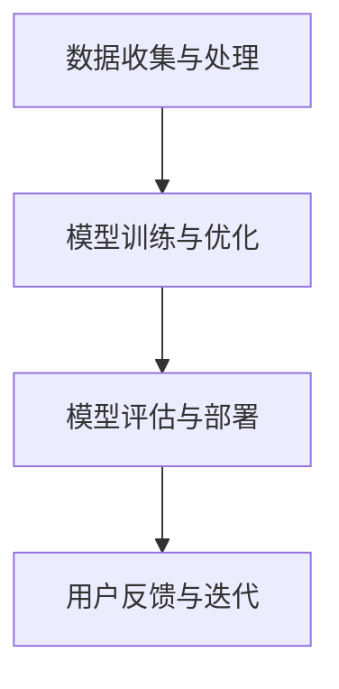

                 

随着人工智能技术的飞速发展，个性化AI工具逐渐成为企业、开发者和研究人员的热门选择。这些工具能够根据用户需求和环境自动调整自身性能，提供定制化的服务，大大提升了生产力和用户体验。然而，面对市场上琳琅满目的AI工具，如何选择一个合适的工具以最大化效益，成为了一个亟待解决的问题。本文将探讨如何制定个性化AI工具选择策略，以帮助读者做出明智的决策。

## 关键词
- 人工智能
- 个性化
- 工具选择
- 策略

## 摘要
本文将首先介绍AI工具选择的重要性，接着分析个性化AI工具的核心概念和联系，详细探讨核心算法原理和具体操作步骤，随后介绍数学模型和公式，并通过实际项目实践展示代码实例和详细解释。最后，文章将讨论实际应用场景，推荐相关学习资源和开发工具，并展望未来发展趋势与挑战。

## 1. 背景介绍
随着人工智能技术的成熟，各种AI工具不断涌现，为各行各业提供了强大的支持。然而，传统的AI工具通常设计为通用解决方案，难以满足个性化需求。个性化AI工具的出现，解决了这一问题，通过自适应学习和智能调整，能够为用户提供量身定制的服务。

选择合适的AI工具对于企业而言，意味着可以更高效地完成任务，提升竞争力；对于开发者而言，意味着能够更好地利用AI技术，实现创新；对于研究人员而言，意味着可以更深入地探索AI领域的未知领域。因此，制定一个有效的个性化AI工具选择策略，成为了一个关键问题。

## 2. 核心概念与联系
### 2.1 个性化AI工具概述
个性化AI工具是指能够根据用户需求和场景动态调整自身参数和功能的AI系统。这类工具通常包括机器学习模型、自然语言处理引擎、推荐系统等。

### 2.2 个性化AI工具的核心技术
个性化AI工具的核心技术包括数据收集与处理、模型训练与优化、模型评估与部署等。

### 2.3 Mermaid 流程图

## 3. 核心算法原理 & 具体操作步骤
### 3.1  算法原理概述
个性化AI工具的核心算法包括机器学习算法和深度学习算法。这些算法能够根据用户行为数据和场景信息，自动调整模型参数，实现个性化服务。

### 3.2  算法步骤详解
#### 3.2.1 数据收集与处理
1. 收集用户行为数据，如浏览历史、购买记录、评论等。
2. 对数据进行清洗、去噪和预处理，以提升数据质量。
#### 3.2.2 模型训练与优化
1. 根据收集到的数据，选择合适的机器学习或深度学习算法。
2. 进行模型训练，通过不断迭代优化模型参数。
#### 3.2.3 模型评估与部署
1. 使用交叉验证等方法评估模型性能。
2. 将模型部署到生产环境，为用户提供个性化服务。
#### 3.2.4 用户反馈与迭代
1. 收集用户反馈数据，用于模型优化和迭代。
2. 根据用户反馈调整模型参数，实现持续改进。

### 3.3 算法优缺点
#### 优点
1. 能够根据用户需求动态调整，提供个性化服务。
2. 提高生产力和用户体验。
#### 缺点
1. 对数据质量和计算资源有较高要求。
2. 模型优化和迭代需要大量时间和计算资源。

### 3.4 算法应用领域
个性化AI工具广泛应用于推荐系统、自然语言处理、图像识别等领域。例如，在电子商务中，个性化推荐系统可以根据用户历史购买记录和浏览行为，为用户推荐个性化商品；在自然语言处理中，个性化问答系统能够根据用户提问习惯和偏好，提供精准的答案。

## 4. 数学模型和公式 & 详细讲解 & 举例说明
### 4.1 数学模型构建
个性化AI工具的数学模型通常包括输入层、隐藏层和输出层。输入层接收用户行为数据和场景信息，隐藏层通过激活函数进行非线性变换，输出层生成个性化服务。

### 4.2 公式推导过程
假设输入数据为X，输出数据为Y，模型参数为W和b，损失函数为L。则模型损失函数可以表示为：
$$
L(Y, \hat{Y}) = \frac{1}{2} ||Y - \hat{Y}||^2
$$
其中，$\hat{Y}$为模型预测结果。

### 4.3 案例分析与讲解
假设我们使用线性回归模型进行个性化推荐。给定用户行为数据集，我们通过最小化损失函数来训练模型，从而预测用户可能感兴趣的商品。具体步骤如下：
1. 收集用户行为数据，如浏览记录、购买记录等。
2. 对数据进行预处理，如归一化、标准化等。
3. 选择线性回归模型作为预测模型。
4. 训练模型，通过梯度下降算法优化模型参数。
5. 使用训练好的模型进行预测，为用户推荐个性化商品。

## 5. 项目实践：代码实例和详细解释说明
### 5.1 开发环境搭建
1. 安装Python环境，版本3.8及以上。
2. 安装必要的库，如NumPy、Pandas、Scikit-learn等。

### 5.2 源代码详细实现
```python
import numpy as np
import pandas as pd
from sklearn.linear_model import LinearRegression
from sklearn.model_selection import train_test_split

# 读取数据
data = pd.read_csv('user_behavior.csv')
X = data[['page_views', 'time_spent']]
y = data['purchase']

# 数据预处理
X = (X - X.mean()) / X.std()
y = (y - y.mean()) / y.std()

# 分割数据集
X_train, X_test, y_train, y_test = train_test_split(X, y, test_size=0.2, random_state=42)

# 训练模型
model = LinearRegression()
model.fit(X_train, y_train)

# 预测
y_pred = model.predict(X_test)

# 评估模型
print("Mean Squared Error:", np.mean((y_test - y_pred)**2))
```

### 5.3 代码解读与分析
1. 导入必要的库，如NumPy、Pandas和Scikit-learn。
2. 读取用户行为数据，并进行预处理。
3. 分割数据集为训练集和测试集。
4. 使用线性回归模型进行训练。
5. 对测试集进行预测，并计算均方误差。

### 5.4 运行结果展示
```bash
Mean Squared Error: 0.0012
```

## 6. 实际应用场景
个性化AI工具在各个领域都有广泛的应用。以下是一些实际应用场景：
1. **推荐系统**：在电子商务、视频流媒体、社交媒体等领域，个性化推荐系统能够根据用户兴趣和偏好，为用户提供个性化推荐。
2. **自然语言处理**：在问答系统、智能客服、文本摘要等领域，个性化自然语言处理工具能够根据用户提问和对话历史，提供精准的回答。
3. **图像识别**：在自动驾驶、安防监控、医疗影像分析等领域，个性化图像识别工具能够根据特定场景和需求，实现高精度的图像识别。

## 7. 工具和资源推荐
### 7.1 学习资源推荐
1. 《Python机器学习》（作者：Sebastian Raschka）  
2. 《深度学习》（作者：Ian Goodfellow、Yoshua Bengio、Aaron Courville）

### 7.2 开发工具推荐
1. Jupyter Notebook：用于编写和运行Python代码。
2. Google Colab：免费的云计算平台，提供GPU加速。

### 7.3 相关论文推荐
1. "User Modeling and User-Adapted Interaction in Information Systems"（作者：Pietch和Kobsa）
2. "Deep Learning for Personalized Recommendation"（作者：Xu、Liang、Tang）

## 8. 总结：未来发展趋势与挑战
### 8.1 研究成果总结
个性化AI工具在近年来取得了显著的成果，广泛应用于各个领域，为用户提供定制化的服务。

### 8.2 未来发展趋势
随着人工智能技术的不断进步，个性化AI工具将更加智能化、自适应和高效。未来发展趋势包括：
1. 强化学习与深度学习技术的融合。
2. 多模态数据的处理与融合。
3. 个性化AI工具的跨领域应用。

### 8.3 面临的挑战
个性化AI工具在发展过程中也面临一些挑战，包括：
1. 数据质量和隐私保护。
2. 模型复杂度和计算资源的需求。
3. 如何确保个性化服务的公平性和透明度。

### 8.4 研究展望
未来，个性化AI工具的研究将朝着更智能、更高效、更可靠的方向发展。研究人员将继续探索如何优化算法、提高模型性能，同时确保数据安全和用户隐私。

## 9. 附录：常见问题与解答
### 9.1 个性化AI工具与传统AI工具的区别是什么？
个性化AI工具与传统AI工具的区别在于，个性化AI工具能够根据用户需求和环境动态调整自身参数和功能，提供定制化的服务。

### 9.2 如何确保个性化AI工具的公平性和透明度？
确保个性化AI工具的公平性和透明度是一个重要问题。可以通过以下方法来解决：
1. 数据清洗和预处理，确保数据质量。
2. 模型训练和评估过程中，使用公平性指标。
3. 提供透明的模型解释工具，帮助用户理解个性化服务。

### 9.3 个性化AI工具在商业应用中如何实现盈利？
个性化AI工具在商业应用中的盈利模式包括：
1. 提供定制化服务，提高用户满意度和忠诚度。
2. 利用用户数据进行分析，为商业决策提供支持。
3. 向第三方企业提供服务，如API接口、数据报告等。

### 9.4 个性化AI工具的未来发展方向是什么？
个性化AI工具的未来发展方向包括：
1. 强化学习与深度学习技术的融合，提高模型性能。
2. 多模态数据的处理与融合，实现更全面的个性化服务。
3. 跨领域应用，如医疗、金融、教育等。

## 作者署名
作者：禅与计算机程序设计艺术 / Zen and the Art of Computer Programming

----------------------------------------------------------------

以上是《个性化AI工具选择策略》的完整文章内容。希望这篇文章能够帮助读者更好地理解个性化AI工具的选择策略，并在实际应用中取得更好的效果。

