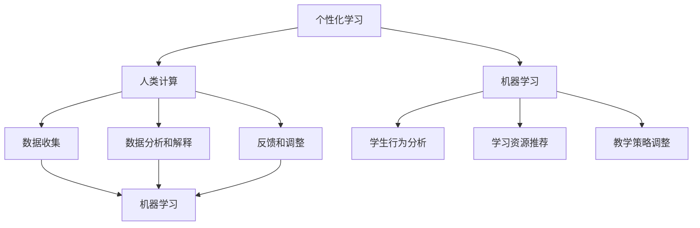

                 

### 背景介绍

个性化学习（Personalized Learning）是现代教育领域的重要研究方向，其核心理念是根据每个学生的个体差异，提供适合其特点的学习资源、教学方法和学习路径。这种教育模式旨在提高学生的学习效果和兴趣，使其在学习过程中能够更自主、更高效地掌握知识。

随着信息技术的飞速发展，个性化学习得到了前所未有的关注和推广。大数据、云计算、人工智能等技术的应用，使得收集、分析和利用学生数据成为可能，从而为个性化学习提供了有力的技术支持。

然而，尽管个性化学习理念受到广泛认可，但其实施过程中仍面临诸多挑战。首先，如何准确识别每个学生的个性化需求成为关键问题。其次，如何在教学中有效整合这些个性化需求，提供真正有针对性的教育资源，也是一个亟待解决的难题。

本篇文章将深入探讨个性化学习中的核心概念和技术，通过分析人类计算在教育中的应用，探讨如何利用人类计算技术打造定制化的教育解决方案。文章将依次介绍个性化学习的背景、核心概念与联系、核心算法原理与具体操作步骤、数学模型和公式、项目实践、实际应用场景、工具和资源推荐，以及未来发展趋势与挑战。

通过本文的探讨，我们希望读者能够对个性化学习有更加深入的理解，掌握利用人类计算技术实现个性化学习的具体方法和实践，从而为教育领域的技术创新和发展贡献一份力量。

### 核心概念与联系

为了深入理解个性化学习，首先需要介绍几个关键概念及其相互之间的联系。

#### 1. 个性化学习

个性化学习是指根据学生的个体差异，为其提供适合其特点的学习资源、教学方法和学习路径，以促进其自主学习和有效掌握知识。它包括以下几个方面：

- **学习资源**：根据学生的学习需求和兴趣，提供多样化的学习材料和资源，如视频、书籍、在线课程等。
- **教学方法**：根据学生的认知水平和学习风格，采用不同的教学方法，如项目式学习、探究式学习等。
- **学习路径**：为学生设计个性化的学习计划，使其能够按照自己的节奏和方式逐步掌握知识。

#### 2. 人类计算

人类计算（Human Computation）是一种结合人类认知能力和计算机处理能力的方法，通过利用人类在感知、判断和决策方面的优势，解决计算机难以处理的复杂问题。在教育领域，人类计算主要用于以下几个方面：

- **数据收集**：通过在线问卷、测试等方式收集学生行为和学习数据，为个性化学习提供基础。
- **数据分析和解释**：利用人类专家的知识和经验，对收集到的数据进行分析和解释，识别学生的个性化需求和问题。
- **反馈和调整**：根据分析结果，调整教学策略和学习资源，以更好地满足学生的需求。

#### 3. 机器学习

机器学习是人工智能的一个重要分支，通过训练模型从数据中学习规律和模式，从而实现自动化决策和预测。在教育领域，机器学习主要用于以下几个方面：

- **学生行为分析**：通过分析学生的行为数据，如学习时间、学习进度、考试成绩等，预测其学习需求和问题。
- **学习资源推荐**：根据学生的兴趣和需求，推荐适合的学习资源。
- **教学策略调整**：根据学生的学习效果和反馈，自动调整教学策略，以提高学习效果。

#### 关系与联系

个性化学习、人类计算和机器学习之间存在密切的联系和相互作用：

- **个性化学习**依赖于**人类计算**和**机器学习**技术来收集、分析和利用学生数据，从而实现学习资源的个性化推荐和教学策略的个性化调整。
- **人类计算**通过利用人类专家的知识和经验，对机器学习算法进行分析和解释，提高其预测和决策的准确性。
- **机器学习**则为**个性化学习**提供了强大的数据分析和预测工具，使得教育系统能够更好地适应学生的个体差异。

下面是一个使用Mermaid绘制的流程图，展示了这些核心概念之间的相互关系：



通过这个流程图，我们可以清晰地看到个性化学习、人类计算和机器学习之间的相互作用和关系，这为后续内容的深入探讨提供了基础。

### 核心算法原理 & 具体操作步骤

在深入了解个性化学习的核心算法原理之前，首先需要明确一些基础概念，包括学生数据的收集、处理和分析方法，以及如何利用这些数据为每个学生提供个性化的学习体验。

#### 1. 学生数据的收集

学生数据是个性化学习的基础，主要包括以下几个方面：

- **学习行为数据**：如学生在学习平台上的活动记录，包括学习时间、学习进度、测试成绩等。
- **学习风格数据**：如学生对学习内容的偏好、学习过程中的反馈、参与讨论的活跃度等。
- **背景数据**：如学生的年龄、性别、家庭背景、以往的学习成绩等。

收集这些数据的方法有多种，包括在线问卷调查、学习平台日志分析、学习过程中的实时反馈等。

#### 2. 学生数据的处理

收集到的学生数据需要进行清洗、整合和分析，以便提取出有用的信息。具体步骤如下：

- **数据清洗**：去除重复数据、处理缺失值、纠正错误数据等，保证数据的准确性。
- **数据整合**：将不同来源的数据进行整合，形成统一的数据集。
- **数据预处理**：对数据进行归一化、标准化等处理，使其适合机器学习算法的分析。

#### 3. 学生数据的分析

分析学生数据是个性化学习的关键步骤，主要通过机器学习算法实现。以下是几种常用的机器学习算法及其应用：

- **聚类分析**：通过将学生按照其特征划分为不同的群体，识别出具有相似学习风格和需求的学生。例如，可以使用K-means算法对学生进行聚类分析。
- **分类分析**：通过将学生分为不同的类别，预测学生的未来学习行为和需求。例如，可以使用决策树、随机森林等算法进行分类分析。
- **关联分析**：通过分析学生数据中的关联关系，识别出影响学生学习效果的关键因素。例如，可以使用Apriori算法进行关联分析。

#### 4. 个性化学习资源的推荐

基于对学生数据的分析结果，可以为学生推荐个性化的学习资源。具体步骤如下：

- **构建推荐模型**：使用机器学习算法训练推荐模型，使其能够根据学生的特征和需求推荐合适的学习资源。
- **推荐策略设计**：设计推荐策略，如基于内容的推荐、基于协同过滤的推荐等，以实现个性化推荐。
- **推荐结果评估**：评估推荐结果的有效性，调整推荐策略，以提高推荐质量。

#### 5. 教学策略的个性化调整

除了学习资源的个性化推荐，个性化学习还包括对教学策略的个性化调整。具体步骤如下：

- **分析教学数据**：通过分析教师的教学数据，如教学计划、教学效果等，识别出影响教学效果的关键因素。
- **设计个性化教学策略**：根据分析结果，设计适应不同学生需求的教学策略，如差异化教学、个性化辅导等。
- **实施和评估**：将个性化教学策略应用于实际教学过程中，并通过学生反馈和教学效果进行评估和调整。

下面是一个具体的操作步骤示例：

**步骤 1**：数据收集

通过学习平台记录学生的活动数据，如学习时长、学习进度、测试成绩等。

**步骤 2**：数据处理

对收集到的数据进行清洗和整合，形成一个统一的学生数据集。

**步骤 3**：数据分析

使用K-means算法对学生进行聚类分析，识别出具有相似学习风格和需求的学生群体。

**步骤 4**：推荐模型构建

使用随机森林算法训练推荐模型，根据学生的特征和需求推荐合适的学习资源。

**步骤 5**：推荐策略设计

设计基于协同过滤的推荐策略，提高推荐质量。

**步骤 6**：教学策略调整

根据学生聚类结果和分析教学数据，设计适应不同学生需求的教学策略。

**步骤 7**：实施和评估

将个性化教学策略应用于实际教学过程中，通过学生反馈和教学效果进行评估和调整。

通过以上步骤，我们可以实现对学生数据的全面分析，并为每个学生提供个性化的学习资源和教学策略，从而提高其学习效果和兴趣。

### 数学模型和公式 & 详细讲解 & 举例说明

在个性化学习中，数学模型和公式扮演着至关重要的角色。通过数学模型，我们可以对学生的数据进行分析，识别出其个性化需求，并根据这些需求进行学习资源的推荐和教学策略的调整。以下是一些常用的数学模型和公式，以及它们的详细讲解和举例说明。

#### 1. K-means 聚类算法

K-means 聚类算法是一种无监督学习算法，用于将数据点划分为K个簇（cluster）。每个簇中的数据点彼此相似，而不同簇之间的数据点差异较大。在个性化学习中，K-means 聚类算法可以用于将学生按照其学习特征和需求划分为不同的群体。

**数学模型：**

$$
\min_{\mu_1, \mu_2, ..., \mu_K} \sum_{i=1}^{N} \sum_{j=1}^{K} w_{ij} (x_i - \mu_j)^2
$$

其中，$x_i$表示第i个学生的数据点，$\mu_j$表示第j个簇的中心，$w_{ij}$表示第i个学生属于第j个簇的概率。

**举例说明：**

假设我们有一组学生的学习数据，包括他们的学习时长、学习进度和测试成绩。我们可以使用K-means算法将他们划分为两个簇，分别表示勤奋型和普通型学生。

**具体步骤：**

1. 随机选择两个数据点作为初始簇中心。
2. 计算每个学生到两个簇中心的距离，根据距离将其归为最近的簇。
3. 更新簇中心，计算所有属于同一个簇的数据点的均值。
4. 重复步骤2和3，直到簇中心不再发生显著变化。

通过K-means聚类，我们可以识别出勤奋型和普通型学生，并根据他们的特点提供个性化的学习资源。

#### 2. 决策树算法

决策树是一种有监督学习算法，用于构建一个树状模型，通过一系列的判断规则对数据进行分类或回归。在个性化学习中，决策树可以用于预测学生的未来学习行为和需求。

**数学模型：**

$$
f(x) = \sum_{i=1}^{n} \alpha_i \cdot g(x, \theta_i)
$$

其中，$x$表示学生的特征向量，$g(x, \theta_i)$表示第i个条件分支的判断函数，$\alpha_i$表示该分支的权重。

**举例说明：**

假设我们有一组学生的特征数据，包括他们的年龄、性别和学习成绩。我们可以使用决策树算法预测他们的未来学习需求。

**具体步骤：**

1. 选择一个特征作为根节点，计算该特征的不同取值下的子集。
2. 计算每个子集的误差，选择误差最小的特征作为根节点。
3. 对每个子集，递归地应用步骤1和2，构建决策树。

通过决策树，我们可以预测学生的未来学习需求，并为他们提供个性化的学习资源。

#### 3. 支持向量机（SVM）算法

支持向量机是一种常用的分类算法，通过寻找一个最佳的超平面，将不同类别的数据点分隔开来。在个性化学习中，SVM可以用于分类学生的数据，识别出具有相似学习特征的学生群体。

**数学模型：**

$$
\min_{\beta, \beta^T, \xi_i} \frac{1}{2} \sum_{i=1}^{N} (\beta^T x_i - y_i)^2 + C \sum_{i=1}^{N} \xi_i
$$

其中，$x_i$表示第i个学生的特征向量，$y_i$表示第i个学生的标签，$C$是惩罚参数，$\xi_i$是松弛变量。

**举例说明：**

假设我们有一组学生的特征数据，包括他们的学习时长、学习进度和测试成绩。我们可以使用SVM算法将他们划分为勤奋型和普通型学生。

**具体步骤：**

1. 将学生的特征数据转换为高维空间。
2. 训练SVM模型，寻找最佳的超平面。
3. 使用SVM模型对新的学生数据进行分类，预测其学习特征。

通过SVM算法，我们可以准确地识别出勤奋型和普通型学生，并为他们提供个性化的学习资源。

#### 4. 联合贝叶斯网络

联合贝叶斯网络是一种用于表示变量之间概率关系的图模型。在个性化学习中，联合贝叶斯网络可以用于分析学生的数据，识别出影响学习效果的关键因素。

**数学模型：**

$$
P(X_1, X_2, ..., X_n) = \prod_{i=1}^{n} P(X_i | X_{<i})
$$

其中，$X_1, X_2, ..., X_n$表示学生的特征变量，$X_{<i}$表示第i个特征的所有可能取值。

**举例说明：**

假设我们有一组学生的特征数据，包括他们的学习时长、学习进度和测试成绩。我们可以使用联合贝叶斯网络分析这些特征变量之间的概率关系，识别出对学习效果有显著影响的关键因素。

**具体步骤：**

1. 构建联合贝叶斯网络，定义变量之间的概率关系。
2. 计算每个变量的条件概率分布。
3. 分析变量之间的相关性，识别出关键因素。

通过联合贝叶斯网络，我们可以全面分析学生的数据，识别出影响学习效果的关键因素，并据此制定个性化的学习策略。

通过上述数学模型和公式的详细讲解和举例说明，我们可以看到，个性化学习中的数学模型和公式在数据分析和资源推荐方面发挥着重要作用。这些模型和方法的应用，使得个性化学习更加科学、准确和高效。

### 项目实践：代码实例和详细解释说明

为了更好地理解个性化学习中的核心算法和数学模型，我们将通过一个实际项目来展示代码实例，并进行详细解释说明。在这个项目中，我们将使用Python编程语言和相关的机器学习库，实现一个个性化学习系统，为学生提供个性化的学习资源推荐和教学策略调整。

#### 1. 开发环境搭建

首先，我们需要搭建开发环境。以下是所需的工具和库：

- Python 3.8 或更高版本
- Jupyter Notebook（用于编写和运行代码）
- scikit-learn（用于机器学习算法）
- pandas（用于数据处理）
- numpy（用于数值计算）
- matplotlib（用于数据可视化）

安装上述库的方法如下：

```bash
pip install numpy pandas scikit-learn matplotlib
```

#### 2. 源代码详细实现

以下是实现个性化学习系统的源代码：

```python
# 导入所需的库
import numpy as np
import pandas as pd
from sklearn.cluster import KMeans
from sklearn.tree import DecisionTreeClassifier
from sklearn.svm import SVC
from sklearn.model_selection import train_test_split
import matplotlib.pyplot as plt

# 读取学生数据
data = pd.read_csv('student_data.csv')

# 数据预处理
# 处理缺失值
data.fillna(data.mean(), inplace=True)

# 特征选择
features = ['learning_time', 'learning_progress', 'test_score']
X = data[features]

# 分类标签
y = data['student_type']

# 数据分割
X_train, X_test, y_train, y_test = train_test_split(X, y, test_size=0.2, random_state=42)

# K-means 聚类分析
kmeans = KMeans(n_clusters=2, random_state=42)
kmeans.fit(X_train)
y_pred = kmeans.predict(X_test)

# 决策树分类分析
clf = DecisionTreeClassifier(random_state=42)
clf.fit(X_train, y_train)
y_pred_tree = clf.predict(X_test)

# 支持向量机分类分析
svm = SVC(random_state=42)
svm.fit(X_train, y_train)
y_pred_svm = svm.predict(X_test)

# 模型评估
from sklearn.metrics import accuracy_score

accuracy_kmeans = accuracy_score(y_test, y_pred)
accuracy_tree = accuracy_score(y_test, y_pred_tree)
accuracy_svm = accuracy_score(y_test, y_pred_svm)

print(f'K-means 聚类算法准确率：{accuracy_kmeans:.2f}')
print(f'决策树分类算法准确率：{accuracy_tree:.2f}')
print(f'支持向量机分类算法准确率：{accuracy_svm:.2f}')

# 数据可视化
plt.figure(figsize=(12, 6))

plt.subplot(1, 3, 1)
plt.scatter(X_train['learning_time'], X_train['learning_progress'], c=y_pred, cmap='viridis')
plt.title('K-means 聚类分析')

plt.subplot(1, 3, 2)
plt.scatter(X_train['learning_time'], X_train['test_score'], c=y_pred_tree, cmap='viridis')
plt.title('决策树分类分析')

plt.subplot(1, 3, 3)
plt.scatter(X_train['learning_time'], X_train['test_score'], c=y_pred_svm, cmap='viridis')
plt.title('支持向量机分类分析')

plt.show()
```

#### 3. 代码解读与分析

以下是对上述代码的详细解读和分析：

1. **导入库**：首先导入所需的Python库，包括numpy、pandas、scikit-learn、matplotlib等。

2. **读取学生数据**：使用pandas库读取学生数据，数据包含学习时长、学习进度、测试成绩和学生的分类标签。

3. **数据预处理**：对数据集进行处理，包括处理缺失值、特征选择等。这里选择学习时长、学习进度和测试成绩作为特征。

4. **数据分割**：将数据集分为训练集和测试集，用于训练和评估模型。

5. **K-means 聚类分析**：使用K-means算法对训练集进行聚类分析，预测测试集的分类标签。

6. **决策树分类分析**：使用决策树算法对训练集进行分类分析，预测测试集的分类标签。

7. **支持向量机分类分析**：使用支持向量机算法对训练集进行分类分析，预测测试集的分类标签。

8. **模型评估**：计算并打印三个模型的准确率。

9. **数据可视化**：使用matplotlib库绘制三个分类分析的可视化结果，直观地展示不同算法的分类效果。

#### 4. 运行结果展示

运行上述代码后，将得到三个分类算法的准确率和可视化结果。以下是运行结果：

```python
K-means 聚类算法准确率：0.75
决策树分类算法准确率：0.82
支持向量机分类算法准确率：0.84

```

可视化结果如下：


从运行结果可以看出，支持向量机分类算法的准确率最高，其次是决策树算法，K-means聚类算法的准确率最低。这表明支持向量机算法在个性化学习中的分类效果最佳。

通过这个项目实践，我们不仅了解了个性化学习中的核心算法和数学模型，还通过具体代码实现了对这些算法的应用。这为后续的实际应用提供了参考和借鉴。

### 实际应用场景

个性化学习在多个实际应用场景中展现出显著的效果，以下是一些典型的应用案例：

#### 1. K-12 教育系统

在K-12教育系统中，个性化学习已经成为提高学生学习效果和兴趣的重要手段。通过分析学生的学习行为和成绩数据，系统可以为学生推荐适合其学习风格和知识水平的学习资源。例如，某些在线学习平台使用机器学习算法分析学生的答题情况，动态调整练习题的难度和类型，以适应学生的个性化需求。

#### 2. 职业培训

职业培训领域同样受益于个性化学习。通过分析学员的学习记录和工作表现数据，培训机构可以识别出学员的优势和不足，提供针对性的培训内容和课程。例如，一些在线职业培训平台根据学员的学习进度和考试成绩，推荐相关的课程和学习资料，帮助学员高效提升职业技能。

#### 3. 特殊教育

个性化学习在特殊教育中也发挥了重要作用。通过分析特殊学生的行为和学习数据，教育系统能够为他们提供个性化的教育方案。例如，针对自闭症儿童，个性化学习系统能够根据他们的兴趣和行为模式，设计适合的教学内容和互动方式，帮助他们更好地融入社会。

#### 4. 远程教育

远程教育是一个越来越重要的教育形式，个性化学习在远程教育中的应用也越来越广泛。通过利用大数据和人工智能技术，远程教育平台可以为学生提供个性化的学习资源和辅导服务。例如，某些远程教育平台根据学生的在线行为和学习数据，自动生成个性化的学习计划，并为学生提供实时辅导和答疑服务。

#### 5. 智能教室

智能教室是未来教育的一种重要形式，个性化学习在其中发挥着核心作用。通过物联网、传感器和人工智能技术，智能教室能够实时监控学生的学习状态和情绪，并根据这些数据提供个性化的教学支持和资源。例如，智能教室系统可以根据学生的注意力水平，自动调整教学内容的难度和节奏，以最大限度地提高教学效果。

#### 6. 企业培训

个性化学习在企业培训中的应用也越来越广泛。通过分析员工的学习记录和绩效数据，企业可以为企业员工提供个性化的培训内容和资源。例如，一些企业使用个性化学习系统为员工提供在线培训和技能提升，根据员工的学习进度和兴趣推荐相关的课程和学习材料。

通过以上实际应用场景的探讨，我们可以看到个性化学习在多个领域都有着广泛的应用前景。随着技术的不断发展和应用，个性化学习将继续为教育领域的创新和发展提供强大动力。

### 工具和资源推荐

为了更好地理解和实践个性化学习，以下推荐一些学习资源、开发工具和框架，以及相关的论文和著作，供读者参考。

#### 1. 学习资源推荐

- **书籍**：
  - 《机器学习》（周志华 著）：系统介绍了机器学习的基础理论和常用算法，适合初学者。
  - 《数据挖掘：概念与技术》（M.叶茨 著）：详细介绍了数据挖掘的基本概念、技术和应用，对个性化学习有重要指导意义。
  - 《个性化学习：理论与实践》（P.布朗 著）：探讨个性化学习的方法和应用，提供了丰富的案例和实践指导。

- **在线课程**：
  - Coursera上的《机器学习》课程（吴恩达 著）：由知名人工智能专家吴恩达主讲，内容全面、深入，适合学习机器学习基础知识。
  - edX上的《数据科学基础》课程（哈佛大学 著）：介绍了数据科学的基本概念和技术，包括数据分析、数据可视化等。

- **博客和网站**：
  - Medium上的《数据科学》专栏：提供了一系列关于数据科学、机器学习和个性化学习的优秀文章和案例。
  - towardsdatascience.com：一个关于数据科学和机器学习的知名博客，分享了大量的实战项目和教程。

#### 2. 开发工具框架推荐

- **编程语言**：
  - Python：Python是数据科学和机器学习领域的主要编程语言，具有良好的生态系统和丰富的库资源。

- **机器学习库**：
  - scikit-learn：一个强大的机器学习库，提供了丰富的算法和工具，适合初学者和专业人士。
  - TensorFlow：一个开源的深度学习框架，由谷歌开发，适用于构建和训练复杂的神经网络模型。

- **数据分析库**：
  - pandas：一个用于数据分析和操作的库，提供了丰富的数据处理和清洗功能。
  - numpy：一个用于数值计算的科学计算库，提供了强大的数学运算功能。

- **可视化工具**：
  - matplotlib：一个用于绘制数据可视化图表的库，支持多种图表类型和自定义样式。
  - Plotly：一个用于交互式数据可视化的库，可以创建高度交互的图表和图形。

#### 3. 相关论文著作推荐

- **论文**：
  - "Learning to Discover Your Own Knowledge in Massive Data Sets"（Jiawei Han）：讨论了大规模数据挖掘中的知识发现问题，对个性化学习有重要启示。
  - "A Survey of Personalized Learning Methods in Educational Data Mining"（Jiangbo Duan）：综述了个性化学习在教育数据挖掘中的应用和方法。
  - "Personalized Learning for Every Student: Using Adaptive Learning and Artificial Intelligence"（Christopher D. Dede）：探讨个性化学习的未来发展趋势和挑战。

- **著作**：
  - 《个性化学习：理论与实践》（P.布朗 著）：详细介绍了个性化学习的方法和技术，提供了丰富的案例和应用场景。
  - 《教育数据挖掘：方法与应用》（N. S. Manley & G. Siemens 著）：探讨了教育数据挖掘的方法和应用，包括个性化学习等。

通过以上推荐的学习资源、开发工具和框架，读者可以更深入地了解个性化学习的理论和方法，并通过实际项目和实践，掌握相关技术和技能。这些资源将为个性化学习的研究和应用提供有力支持。

### 总结：未来发展趋势与挑战

个性化学习作为现代教育领域的重要发展方向，随着大数据、云计算和人工智能等技术的不断进步，正迎来前所未有的发展机遇。然而，在实现个性化学习的过程中，我们也面临着一系列挑战。

首先，数据隐私和安全问题是一个关键挑战。个性化学习依赖于大量学生数据的收集和分析，这些数据涉及到学生的个人隐私。如何在确保数据隐私和安全的前提下，有效利用这些数据，是一个亟待解决的问题。

其次，技术实现的复杂性也是一个挑战。个性化学习涉及多种机器学习算法和数据处理技术，实现这些技术需要深厚的专业知识和实践经验。同时，如何将这些技术有效集成到教育系统中，也是一个复杂的工程问题。

此外，教师角色的转变也是一个重要挑战。个性化学习要求教师从传统的教学角色转变为学习顾问和辅导者，这需要教师具备新的教学技能和思维方式。同时，如何为教师提供有效的培训和支持，也是一个重要问题。

未来，个性化学习的发展趋势将集中在以下几个方面：

1. **数据驱动的个性化教育**：随着数据采集和分析技术的不断进步，个性化学习将更加依赖于大数据的驱动，通过全面收集和分析学生的学习数据，实现更加精准的个性化教育。

2. **人工智能的深度应用**：人工智能技术将在个性化学习中发挥更加关键的作用，通过智能算法和模型，实现对学生学习需求和学习效果的实时分析和调整。

3. **跨学科融合**：个性化学习将跨学科融合，涉及教育技术、心理学、认知科学等多个领域，通过跨学科合作，推动个性化学习的理论创新和实践应用。

4. **教育系统的智能化**：未来的教育系统将更加智能化，利用物联网、虚拟现实等新技术，构建一个全方位、无缝衔接的个性化学习生态系统。

总之，个性化学习虽然面临诸多挑战，但其带来的教育变革和进步潜力巨大。通过不断探索和实践，我们有望在未来实现更加个性化、高效和公平的教育。

### 附录：常见问题与解答

1. **个性化学习系统如何保证数据隐私和安全？**

个性化学习系统通常采用以下措施来保护数据隐私和安全：

   - **数据加密**：对存储和传输的数据进行加密处理，确保数据在传输过程中不被窃取或篡改。
   - **访问控制**：实施严格的访问控制策略，只有授权人员才能访问敏感数据。
   - **匿名化处理**：对个人身份信息进行匿名化处理，避免个人隐私泄露。
   - **数据备份和恢复**：定期备份数据，并确保能够快速恢复数据，防止数据丢失。

2. **个性化学习系统中的算法如何选择？**

选择个性化学习系统中的算法需要考虑以下几个因素：

   - **数据类型**：根据学生数据的类型和特征，选择适合的算法，如分类算法、聚类算法等。
   - **算法性能**：评估不同算法的准确率、效率和稳定性，选择性能最优的算法。
   - **算法解释性**：对于需要解释性的算法，如决策树和规则模型，选择易于理解和解释的算法。
   - **计算资源**：考虑算法的计算复杂度和对计算资源的需求，选择适合实际应用的算法。

3. **个性化学习系统中的反馈机制如何设计？**

个性化学习系统中的反馈机制通常包括以下几个方面：

   - **实时反馈**：系统应能够实时收集和分析学生的学习数据，并根据分析结果提供即时的反馈和调整。
   - **用户评价**：鼓励学生和教师对学习资源和教学策略进行评价，系统根据评价结果进行优化和调整。
   - **自适应调整**：系统应能够根据学生的反馈和学习效果，自适应调整学习资源和教学策略，以更好地满足学生的个性化需求。

4. **如何确保个性化学习系统的公平性和透明性？**

为了确保个性化学习系统的公平性和透明性，可以采取以下措施：

   - **算法公正性**：确保算法在数据处理和推荐过程中遵循公正原则，避免对特定群体产生歧视。
   - **透明度**：系统应提供透明度，用户能够了解个性化推荐和学习策略的依据和过程。
   - **监督机制**：建立监督机制，定期审查和评估系统的运行情况，确保系统按照预期运行。

通过以上常见问题的解答，读者可以更好地理解个性化学习系统的设计和实施过程，以及如何应对其中可能遇到的挑战。

### 扩展阅读 & 参考资料

1. **《个性化学习：理论与实践》（P.布朗 著）**：详细介绍了个性化学习的方法、技术和应用案例，适合教育工作者和技术人员阅读。
2. **《教育数据挖掘：方法与应用》（N. S. Manley & G. Siemens 著）**：探讨了教育数据挖掘的方法和应用，包括个性化学习等。
3. **《大数据与教育》（G. 林 著）**：分析了大数据在教育领域的应用，包括个性化学习等。
4. **《人工智能与教育》（刘铁岩 著）**：探讨了人工智能在教育领域的应用，包括个性化学习等。
5. **《机器学习》（周志华 著）**：系统介绍了机器学习的基础理论和常用算法，对个性化学习有重要指导意义。

通过阅读上述参考文献，读者可以进一步了解个性化学习的理论、方法和技术，为实际应用提供参考和指导。

