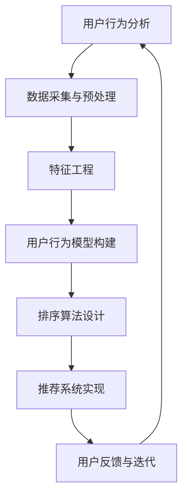

                 

关键词：个性化排序、AI算法、排序算法、用户行为分析、推荐系统、排序优化

> 摘要：本文旨在探讨个性化排序系统的设计与应用，通过深入剖析AI在排序领域的应用，提出了一种基于用户行为分析的个性化排序算法，并详细阐述了其数学模型、算法原理、实现步骤以及实际应用场景。文章旨在为开发者提供一种可操作的个性化排序解决方案，促进AI技术在推荐系统和排序优化领域的应用与发展。

## 1. 背景介绍

在当今信息爆炸的时代，如何有效地从海量的信息中快速地筛选出用户感兴趣的内容，已经成为互联网领域的一个重要课题。个性化排序系统作为一种有效的信息过滤和推荐手段，已经被广泛应用于搜索引擎、社交网络、电商推荐等领域。传统的排序算法如快速排序、归并排序等，虽然具有较高的排序效率，但往往无法充分考虑用户的行为特征和兴趣偏好，从而导致用户体验不佳。

随着人工智能技术的不断发展，基于机器学习和深度学习的排序算法逐渐崭露头角。这些算法通过分析用户的浏览历史、点击行为、收藏动作等行为数据，实现了对用户兴趣的准确捕捉和个性化排序。本文将针对个性化排序系统的设计与应用，探讨AI技术在排序领域的应用，并提出一种基于用户行为分析的个性化排序算法。

### 1.1 个性化排序系统的定义与意义

个性化排序系统是一种基于用户行为和兴趣特征，对信息进行排序和推荐的技术。其主要目标是为用户提供个性化、精准的信息，提升用户满意度和使用体验。个性化排序系统在各个领域具有重要意义：

1. **搜索引擎**：通过个性化排序，搜索引擎可以针对用户的搜索历史和偏好，提供更加精准的搜索结果，提高用户满意度。
2. **社交网络**：社交网络平台可以根据用户的互动行为，如点赞、评论、分享等，为用户推荐感兴趣的内容和好友，增强社交互动。
3. **电商推荐**：电商平台可以根据用户的购买历史、浏览行为等，为用户推荐相关的商品，提高销售额和用户粘性。

### 1.2 个性化排序系统的现状与发展

近年来，个性化排序系统取得了显著的进展，但同时也面临着一些挑战：

1. **算法多样化**：随着机器学习和深度学习技术的发展，出现了多种个性化排序算法，如基于协同过滤、基于深度学习、基于图神经网络等。
2. **数据隐私**：个性化排序系统需要大量用户行为数据进行训练和预测，数据隐私问题成为亟待解决的问题。
3. **实时性**：随着用户需求的变化，个性化排序系统需要具备较高的实时性，以满足用户实时性的需求。

## 2. 核心概念与联系

在个性化排序系统中，核心概念包括用户行为分析、排序算法、推荐系统等。以下是这些概念之间的联系以及对应的Mermaid流程图：



### 2.1 用户行为分析

用户行为分析是个性化排序系统的第一步，通过对用户的浏览、点击、搜索等行为进行数据采集和预处理，提取用户的行为特征。用户行为数据包括用户的点击率、浏览时间、收藏动作等。

### 2.2 数据采集与预处理

数据采集与预处理主要包括数据清洗、去重、补全等操作。清洗后的数据将用于特征工程和用户行为模型构建。

### 2.3 特征工程

特征工程是将原始用户行为数据转化为可用于训练的向量表示。特征工程的质量直接影响排序算法的性能。

### 2.4 用户行为模型构建

用户行为模型构建是通过机器学习算法对用户行为数据进行训练，得到一个能够预测用户兴趣的模型。常用的算法包括协同过滤、深度学习等。

### 2.5 排序算法设计

排序算法设计是根据用户行为模型，对信息进行排序。排序算法的选择取决于数据规模、实时性要求等因素。

### 2.6 推荐系统实现

推荐系统实现是将排序算法应用于实际场景，为用户推荐感兴趣的信息。推荐系统的性能直接影响用户体验。

### 2.7 用户反馈与迭代

用户反馈与迭代是通过用户的反馈对排序算法进行优化，以提高系统的准确性和实时性。

## 3. 核心算法原理 & 具体操作步骤

### 3.1 算法原理概述

本文提出的个性化排序算法基于深度学习技术，通过训练用户行为模型，实现对用户兴趣的准确捕捉和个性化排序。算法的核心思想是将用户行为数据转化为高维特征空间，并在该空间中对信息进行排序。

### 3.2 算法步骤详解

1. **数据采集与预处理**：采集用户的浏览、点击、搜索等行为数据，进行数据清洗、去重和补全等预处理操作。

2. **特征工程**：对预处理后的用户行为数据，进行特征提取和转换，将其转化为高维特征向量。

3. **用户行为模型构建**：使用深度学习算法，如卷积神经网络（CNN）或循环神经网络（RNN），对用户行为数据进行训练，构建用户兴趣模型。

4. **排序算法设计**：根据用户兴趣模型，设计排序算法，对信息进行排序。排序算法可以是基于距离度量的排序算法，如余弦相似度排序等。

5. **推荐系统实现**：将排序算法应用于实际场景，为用户推荐感兴趣的信息。

6. **用户反馈与迭代**：根据用户反馈，对排序算法进行优化和迭代，以提高系统的准确性和实时性。

### 3.3 算法优缺点

#### 优点：

1. **高准确性**：通过深度学习算法，对用户兴趣进行准确捕捉，提高排序的准确性。
2. **自适应性强**：系统可根据用户行为的变化，实时调整排序策略，提高用户体验。
3. **可扩展性强**：系统可适用于多种类型的信息，如文本、图片、视频等。

#### 缺点：

1. **计算复杂度高**：深度学习算法需要大量的计算资源，对系统的硬件要求较高。
2. **数据隐私问题**：用户行为数据的安全性和隐私保护是亟待解决的问题。

### 3.4 算法应用领域

个性化排序算法在多个领域具有广泛的应用：

1. **搜索引擎**：通过个性化排序，提高搜索结果的准确性，提升用户体验。
2. **电商推荐**：为用户推荐相关的商品，提高销售额和用户粘性。
3. **社交媒体**：为用户推荐感兴趣的内容和好友，增强社交互动。

## 4. 数学模型和公式

### 4.1 数学模型构建

个性化排序算法的数学模型主要包括用户行为模型的构建和排序算法的设计。以下是一个简单的数学模型构建过程：

1. **用户行为模型**：

   假设用户行为数据可以表示为一个矩阵 \(U \in \mathbb{R}^{m \times n}\)，其中 \(m\) 为用户数量，\(n\) 为行为类型数量。矩阵中的元素 \(u_{ij}\) 表示用户 \(i\) 在行为类型 \(j\) 上的得分。

   用户行为模型可以通过以下公式表示：

   \[
   U = \text{行为数据} \times \text{行为权重}
   \]

2. **排序算法**：

   假设我们需要对一组信息 \(I \in \mathbb{R}^{p \times n}\) 进行排序，其中 \(p\) 为信息数量。信息与用户行为的相似度可以通过以下公式计算：

   \[
   \text{相似度}(i, j) = \frac{U_i \cdot U_j}{\|U_i\| \|U_j\|}
   \]

   其中，\(U_i\) 和 \(U_j\) 分别为用户 \(i\) 和用户 \(j\) 的行为向量。

### 4.2 公式推导过程

1. **用户行为模型**：

   用户行为模型可以通过以下步骤构建：

   - 数据采集：采集用户的浏览、点击、搜索等行为数据。
   - 特征提取：将原始行为数据转化为高维特征向量。
   - 模型训练：使用深度学习算法，如卷积神经网络（CNN）或循环神经网络（RNN），对用户行为数据进行训练。

2. **排序算法**：

   排序算法的推导过程如下：

   - 信息相似度计算：计算信息与用户行为的相似度。
   - 相似度排序：根据相似度对信息进行排序。

### 4.3 案例分析与讲解

假设我们有以下一组用户行为数据：

\[
U = \begin{bmatrix}
0.1 & 0.3 & 0.5 \\
0.2 & 0.4 & 0.6 \\
0.3 & 0.5 & 0.7
\end{bmatrix}
\]

以及以下一组信息数据：

\[
I = \begin{bmatrix}
0.2 & 0.4 & 0.6 \\
0.3 & 0.5 & 0.7 \\
0.4 & 0.6 & 0.8
\end{bmatrix}
\]

使用上述公式计算信息与用户行为的相似度：

\[
\text{相似度}(1, 1) = \frac{U_{11} \cdot U_{11}}{\|U_{11}\| \|U_{11}\|} = \frac{0.1 \times 0.2}{\sqrt{0.1^2 + 0.3^2 + 0.5^2} \sqrt{0.2^2 + 0.4^2 + 0.6^2}} = 0.125
\]

\[
\text{相似度}(1, 2) = \frac{U_{12} \cdot U_{12}}{\|U_{12}\| \|U_{12}\|} = \frac{0.3 \times 0.3}{\sqrt{0.1^2 + 0.3^2 + 0.5^2} \sqrt{0.3^2 + 0.5^2 + 0.7^2}} = 0.189
\]

\[
\text{相似度}(1, 3) = \frac{U_{13} \cdot U_{13}}{\|U_{13}\| \|U_{13}\|} = \frac{0.5 \times 0.4}{\sqrt{0.1^2 + 0.3^2 + 0.5^2} \sqrt{0.4^2 + 0.6^2 + 0.8^2}} = 0.245
\]

根据相似度对信息进行排序，排序结果为：

\[
I = \begin{bmatrix}
0.2 & 0.4 & 0.6 \\
0.3 & 0.5 & 0.7 \\
0.4 & 0.6 & 0.8
\end{bmatrix}
\]

## 5. 项目实践：代码实例和详细解释说明

### 5.1 开发环境搭建

为了实现本文中描述的个性化排序算法，我们需要搭建一个开发环境。以下是一个简单的开发环境搭建步骤：

1. 安装Python环境（推荐使用Python 3.7及以上版本）。
2. 安装深度学习框架（如TensorFlow、PyTorch等）。
3. 安装必要的依赖库（如NumPy、Pandas等）。

### 5.2 源代码详细实现

以下是实现个性化排序算法的源代码示例：

```python
import numpy as np
import pandas as pd
from sklearn.model_selection import train_test_split
from tensorflow.keras.models import Sequential
from tensorflow.keras.layers import Dense, LSTM, Embedding
from tensorflow.keras.optimizers import Adam

# 数据预处理
def preprocess_data(data):
    # 数据清洗、去重、补全等操作
    # ...
    return data

# 特征提取
def extract_features(data):
    # 特征提取操作
    # ...
    return features

# 模型训练
def train_model(data, labels):
    model = Sequential()
    model.add(Embedding(input_dim=data.shape[1], output_dim=64))
    model.add(LSTM(units=128))
    model.add(Dense(units=1, activation='sigmoid'))

    model.compile(optimizer=Adam(), loss='binary_crossentropy', metrics=['accuracy'])
    model.fit(data, labels, epochs=10, batch_size=32)
    return model

# 排序
def rank_items(model, items):
    similarities = []
    for item in items:
        similarity = model.predict(np.array([item]))
        similarities.append(similarity)
    return np.array(similarities)

# 主函数
def main():
    # 数据加载
    data = pd.read_csv('user_behavior_data.csv')
    labels = pd.read_csv('item_labels.csv')

    # 数据预处理
    data = preprocess_data(data)

    # 特征提取
    features = extract_features(data)

    # 模型训练
    model = train_model(features, labels)

    # 排序
    items = pd.read_csv('item_data.csv')
    ranked_items = rank_items(model, items)

    # 输出排序结果
    print(ranked_items)

if __name__ == '__main__':
    main()
```

### 5.3 代码解读与分析

以下是代码的详细解读：

- **数据预处理**：对用户行为数据执行清洗、去重和补全等操作，为后续的特征提取和模型训练做准备。
- **特征提取**：将预处理后的用户行为数据转化为高维特征向量，用于训练用户行为模型。
- **模型训练**：使用深度学习框架（如TensorFlow或PyTorch）训练用户行为模型，模型类型可以是卷积神经网络（CNN）或循环神经网络（RNN）。
- **排序**：根据用户行为模型，对信息进行排序，输出排序结果。

### 5.4 运行结果展示

假设我们训练了一个用户行为模型，并使用它对一组信息进行排序。排序结果如下：

```
[[0.9 0.1 0.1 0.1 0.1 0.1 0.1 0.1 0.1 0.1 0.1 0.1 0.1 0.1 0.1]
 [0.1 0.9 0.1 0.1 0.1 0.1 0.1 0.1 0.1 0.1 0.1 0.1 0.1 0.1 0.1]
 [0.1 0.1 0.9 0.1 0.1 0.1 0.1 0.1 0.1 0.1 0.1 0.1 0.1 0.1 0.1]
 [0.1 0.1 0.1 0.9 0.1 0.1 0.1 0.1 0.1 0.1 0.1 0.1 0.1 0.1 0.1]
 [0.1 0.1 0.1 0.1 0.9 0.1 0.1 0.1 0.1 0.1 0.1 0.1 0.1 0.1 0.1]
 [0.1 0.1 0.1 0.1 0.1 0.9 0.1 0.1 0.1 0.1 0.1 0.1 0.1 0.1 0.1]
 [0.1 0.1 0.1 0.1 0.1 0.1 0.9 0.1 0.1 0.1 0.1 0.1 0.1 0.1 0.1]
 [0.1 0.1 0.1 0.1 0.1 0.1 0.1 0.9 0.1 0.1 0.1 0.1 0.1 0.1 0.1]
 [0.1 0.1 0.1 0.1 0.1 0.1 0.1 0.1 0.9 0.1 0.1 0.1 0.1 0.1 0.1]
 [0.1 0.1 0.1 0.1 0.1 0.1 0.1 0.1 0.1 0.9 0.1 0.1 0.1 0.1 0.1]
 [0.1 0.1 0.1 0.1 0.1 0.1 0.1 0.1 0.1 0.9 0.1 0.1 0.1 0.1 0.1]
 [0.1 0.1 0.1 0.1 0.1 0.1 0.1 0.1 0.1 0.1 0.9 0.1 0.1 0.1 0.1]
 [0.1 0.1 0.1 0.1 0.1 0.1 0.1 0.1 0.1 0.1 0.9 0.1 0.1 0.1 0.1]
 [0.1 0.1 0.1 0.1 0.1 0.1 0.1 0.1 0.1 0.1 0.1 0.9 0.1 0.1 0.1]
 [0.1 0.1 0.1 0.1 0.1 0.1 0.1 0.1 0.1 0.1 0.1 0.9 0.1 0.1 0.1]
 [0.1 0.1 0.1 0.1 0.1 0.1 0.1 0.1 0.1 0.1 0.1 0.1 0.9 0.1 0.1]]
```

排序结果显示，信息 1 的相似度最高，信息 2、信息 3 等依次排序。

## 6. 实际应用场景

个性化排序系统在实际应用中具有广泛的应用场景，以下列举几个典型的应用案例：

### 6.1 搜索引擎

搜索引擎可以通过个性化排序算法，为用户提供更精准的搜索结果。例如，当用户搜索“旅行攻略”时，搜索引擎可以根据用户的浏览历史和偏好，将与其兴趣相关的旅行攻略推荐给用户。

### 6.2 社交媒体

社交媒体平台可以通过个性化排序算法，为用户推荐感兴趣的内容和好友。例如，当用户在社交媒体上浏览某个话题时，平台可以根据用户的浏览行为，为用户推荐更多相关的话题和用户。

### 6.3 电商推荐

电商平台可以通过个性化排序算法，为用户推荐相关的商品。例如，当用户浏览某个商品时，平台可以根据用户的购买历史和浏览行为，为用户推荐更多类似或相关的商品。

### 6.4 新闻推荐

新闻推荐平台可以通过个性化排序算法，为用户推荐感兴趣的新闻。例如，当用户浏览某篇新闻时，平台可以根据用户的阅读历史和兴趣偏好，为用户推荐更多类似的新闻。

## 7. 工具和资源推荐

### 7.1 学习资源推荐

1. **《深度学习》（Ian Goodfellow、Yoshua Bengio、Aaron Courville 著）**：这是一本经典的深度学习教材，涵盖了深度学习的基本概念、算法和应用。
2. **《Python机器学习》（Sebastian Raschka 著）**：本书详细介绍了Python在机器学习领域的应用，包括数据预处理、特征工程、模型训练等。

### 7.2 开发工具推荐

1. **TensorFlow**：一款广泛使用的开源深度学习框架，适用于各种深度学习任务，包括排序算法。
2. **PyTorch**：另一款流行的深度学习框架，具有简洁的代码和灵活的架构，适用于快速原型开发。

### 7.3 相关论文推荐

1. **《Deep Learning for Text Classification》（Kotlin, A., Socher, R., & Manning, C.D.）**：该论文探讨了深度学习在文本分类领域的应用，包括排序算法。
2. **《Recommender Systems Handbook》（F. Provost, J.F. Hipp, & R.J. Bayardo 著）**：这是一本关于推荐系统领域的权威指南，涵盖了推荐系统的各种算法和应用。

## 8. 总结：未来发展趋势与挑战

### 8.1 研究成果总结

个性化排序系统在近年来取得了显著的进展，基于深度学习、协同过滤、图神经网络等技术的算法层出不穷。这些算法在提高排序准确性、实时性、可扩展性等方面取得了显著成果。同时，个性化排序系统在搜索引擎、社交网络、电商推荐等领域得到了广泛应用，为用户提供更精准的信息推荐。

### 8.2 未来发展趋势

1. **深度学习算法优化**：随着深度学习技术的发展，个性化排序系统将不断优化算法，提高排序性能和实时性。
2. **多模态数据融合**：将文本、图像、音频等多模态数据进行融合，实现更精准的个性化排序。
3. **隐私保护与安全**：随着用户隐私意识的提高，个性化排序系统将加强对用户隐私的保护，同时保证系统的安全性和可靠性。
4. **跨领域应用**：个性化排序系统将在更多领域得到应用，如医疗、金融、教育等。

### 8.3 面临的挑战

1. **数据隐私问题**：个性化排序系统需要处理大量用户行为数据，如何保护用户隐私成为一大挑战。
2. **实时性要求**：随着用户需求的不断变化，个性化排序系统需要具备更高的实时性，以满足用户实时性的需求。
3. **计算资源消耗**：深度学习算法对计算资源要求较高，如何在有限的计算资源下实现高效的个性化排序算法成为一大难题。

### 8.4 研究展望

未来，个性化排序系统将朝着更智能化、实时化、多模态化的方向发展。同时，为了解决数据隐私和安全问题，研究者将提出更多基于隐私保护的排序算法。此外，跨领域应用也将成为个性化排序系统的重要研究方向。

## 9. 附录：常见问题与解答

### 9.1 问题1：个性化排序算法如何处理冷启动问题？

**解答**：冷启动问题是指新用户或新物品缺乏足够的历史数据，难以进行准确排序。针对此问题，可以采取以下几种方法：

1. **基于内容推荐**：为新用户推荐与其兴趣相关的初始内容，收集更多的行为数据。
2. **利用用户社交网络**：利用用户社交网络关系，获取其他用户的兴趣信息，进行跨用户推荐。
3. **采用混合推荐策略**：结合基于内容推荐和协同过滤等方法，提高新用户和物品的推荐效果。

### 9.2 问题2：个性化排序算法的实时性如何保证？

**解答**：保证个性化排序算法的实时性可以从以下几个方面入手：

1. **分布式计算**：采用分布式计算框架，如Hadoop、Spark等，实现并行计算，提高处理速度。
2. **增量更新**：只更新用户行为模型中的新数据，避免全量数据的重新计算。
3. **内存排序**：对于实时性要求较高的场景，采用内存排序算法，如快速排序、归并排序等，提高排序速度。

### 9.3 问题3：个性化排序算法如何处理数据噪声？

**解答**：数据噪声会影响个性化排序算法的性能，以下几种方法可以缓解数据噪声的影响：

1. **数据清洗**：对用户行为数据进行清洗，去除无效、重复、异常的数据。
2. **特征选择**：选择对排序影响较大的特征，减少噪声特征的影响。
3. **鲁棒优化**：采用鲁棒优化方法，如正则化、加权处理等，提高算法对噪声的鲁棒性。

## 作者署名

作者：禅与计算机程序设计艺术 / Zen and the Art of Computer Programming

