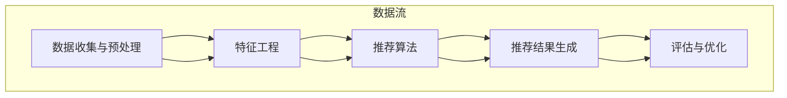

                 

# 个性化推荐的精准营销方法

## 引言

在当今数字化时代，个性化推荐系统已成为许多在线平台和服务的关键组成部分。无论是社交媒体、电子商务网站，还是视频流媒体平台，个性化推荐都极大地提升了用户体验，并为企业带来了巨大的商业价值。精准营销作为商业战略的核心，越来越依赖于个性化推荐技术来实现更高的客户满意度和转化率。

本文将探讨个性化推荐系统在精准营销中的应用，旨在为读者提供深入的技术分析、数学模型讲解以及实际案例解析。文章将按照以下结构展开：

1. **背景介绍**：介绍个性化推荐系统和精准营销的基本概念、历史发展及其重要性。
2. **核心概念与联系**：详细阐述推荐系统的核心概念，并使用Mermaid流程图展示推荐系统的整体架构。
3. **核心算法原理 & 具体操作步骤**：介绍常用的推荐算法及其工作原理，包括协同过滤、矩阵分解和基于内容的推荐。
4. **数学模型和公式 & 详细讲解 & 举例说明**：讲解推荐系统中涉及到的关键数学模型和公式，并通过具体例子进行说明。
5. **项目实践：代码实例和详细解释说明**：提供实际项目中的代码实现，并进行详细解读和分析。
6. **实际应用场景**：探讨个性化推荐在不同领域的应用，如电子商务、社交媒体和视频推荐。
7. **工具和资源推荐**：推荐学习资源、开发工具和框架，以及相关的论文著作。
8. **总结：未来发展趋势与挑战**：总结当前个性化推荐技术的研究趋势和应用中的挑战。
9. **附录：常见问题与解答**：回答读者可能遇到的问题。
10. **扩展阅读 & 参考资料**：提供进一步的阅读材料和参考资料。

接下来，我们将逐节深入探讨个性化推荐系统及其在精准营销中的应用。

## 1. 背景介绍

### 个性化推荐系统

个性化推荐系统（Personalized Recommendation System）是一种通过收集和分析用户的历史行为、偏好和反馈，向用户推荐符合其兴趣和需求的内容或商品的技术。这种系统广泛应用于各种在线平台，旨在提高用户满意度和留存率，同时为企业带来更高的商业价值。

个性化推荐系统的发展可以追溯到20世纪90年代。随着互联网的普及，越来越多的在线服务开始采用推荐系统来吸引用户并提高用户参与度。早期的推荐系统主要基于内容过滤和协同过滤方法。随着大数据和机器学习技术的发展，推荐系统逐渐采用更加复杂和高效的算法，如矩阵分解、深度学习和图模型。

### 精准营销

精准营销（Precision Marketing）是一种基于数据分析和技术手段，针对特定目标群体进行个性化的营销活动。它通过深入挖掘用户数据，了解用户的行为习惯、兴趣爱好和购买偏好，从而实现更加精准的广告投放、内容推送和促销活动。

精准营销的历史可以追溯到20世纪70年代，随着市场营销理论的不断发展和信息技术手段的进步，精准营销逐渐成为企业市场营销策略的重要组成部分。随着互联网和大数据技术的发展，精准营销手段变得更加多样和高效。

### 个性化推荐在精准营销中的应用

个性化推荐在精准营销中扮演着关键角色。通过个性化推荐，企业可以更有效地触达目标用户，提高营销活动的点击率和转化率。以下是一些具体应用场景：

1. **电子商务网站**：个性化推荐可以根据用户的购物历史和浏览行为，推荐相关的商品，从而提高销售量和用户满意度。
2. **社交媒体平台**：个性化推荐可以根据用户的兴趣和行为，推荐相关的内容和广告，增加用户的参与度和活跃度。
3. **视频流媒体平台**：个性化推荐可以根据用户的观看历史和偏好，推荐相关的视频内容，提高用户留存率和观看时长。
4. **新闻媒体网站**：个性化推荐可以根据用户的阅读历史和偏好，推荐相关的新闻和文章，提高用户粘性和广告效果。

总之，个性化推荐系统已成为精准营销不可或缺的一部分，它不仅提升了用户体验，还为企业在竞争激烈的市场中提供了强大的竞争力。接下来，我们将详细探讨个性化推荐系统的核心概念和架构。

## 2. 核心概念与联系

### 个性化推荐系统的核心概念

个性化推荐系统主要依赖于以下核心概念：

1. **用户**：推荐系统的核心实体，每个用户都有其独特的兴趣和行为模式。
2. **项目**：推荐系统中的内容或商品，如书籍、电影、商品或新闻文章。
3. **评分**：用户对项目的评价或打分，如1星到5星的评分。
4. **行为数据**：用户的行为记录，如浏览、点击、购买等。
5. **推荐算法**：用于生成个性化推荐结果的算法，包括协同过滤、矩阵分解和基于内容的推荐等。

### 推荐系统的架构

推荐系统的整体架构通常包括以下几个关键模块：

1. **数据收集与预处理**：收集用户行为数据、项目特征数据，并进行数据清洗、去噪和格式化。
2. **特征工程**：提取用户和项目的特征，如用户的历史行为、项目的内容特征等。
3. **推荐算法**：选择并实现推荐算法，如协同过滤、矩阵分解和基于内容的推荐。
4. **推荐结果生成**：根据推荐算法生成个性化推荐结果，并展示给用户。
5. **评估与优化**：评估推荐系统的效果，并根据反馈进行优化。

### Mermaid流程图

为了更清晰地展示推荐系统的整体架构和数据处理流程，我们可以使用Mermaid流程图进行描述：



在这个流程图中，数据从数据收集与预处理开始，经过特征工程处理后，进入推荐算法模块。推荐算法根据用户和项目的特征生成推荐结果，并展示给用户。最后，系统根据用户反馈进行评估与优化。

通过以上核心概念和架构的介绍，我们可以更好地理解个性化推荐系统的工作原理和关键环节。接下来，我们将深入探讨常用的推荐算法及其原理。

## 3. 核心算法原理 & 具体操作步骤

### 协同过滤算法

协同过滤（Collaborative Filtering）是推荐系统中最常用的算法之一，它通过分析用户之间的相似性来发现潜在的偏好。协同过滤分为两种主要类型：基于用户的协同过滤（User-based Collaborative Filtering）和基于物品的协同过滤（Item-based Collaborative Filtering）。

#### 基于用户的协同过滤

基于用户的协同过滤算法通过寻找与目标用户相似的其他用户，并将这些用户喜欢的项目推荐给目标用户。其具体步骤如下：

1. **计算用户相似度**：使用用户之间的行为数据计算相似度，常用的方法包括余弦相似度、皮尔逊相关系数等。
2. **找到相似用户**：根据相似度阈值，从所有用户中找出与目标用户相似的用户。
3. **推荐项目**：对于相似用户喜欢的但目标用户尚未体验的项目，推荐给目标用户。

#### 基于物品的协同过滤

基于物品的协同过滤算法通过分析项目之间的相似性来推荐用户可能喜欢的项目。其具体步骤如下：

1. **计算项目相似度**：使用项目之间的行为数据计算相似度，常用的方法包括余弦相似度、皮尔逊相关系数等。
2. **找到相似项目**：根据相似度阈值，从所有项目中找出与目标项目相似的项目。
3. **推荐用户**：对于相似项目被目标用户喜欢的用户，推荐给目标用户。

### 矩阵分解算法

矩阵分解（Matrix Factorization）是一种用于推荐系统的无监督学习方法，通过将用户-项目评分矩阵分解为低维用户特征矩阵和项目特征矩阵，从而实现推荐。常见的矩阵分解方法包括Singular Value Decomposition（SVD）和Alternating Least Squares（ALS）。

#### SVD方法

SVD方法将用户-项目评分矩阵分解为用户特征矩阵U、项目特征矩阵V和奇异值矩阵Σ。具体步骤如下：

1. **初始化特征矩阵**：随机初始化用户特征矩阵U和项目特征矩阵V。
2. **计算误差**：计算预测评分与实际评分之间的误差。
3. **更新特征矩阵**：通过梯度下降或其他优化算法更新用户特征矩阵U和项目特征矩阵V。
4. **迭代优化**：重复步骤2和3，直到误差收敛。

#### ALS方法

ALS方法是一种迭代的优化算法，用于求解SVD问题。其具体步骤如下：

1. **初始化特征矩阵**：随机初始化用户特征矩阵U和项目特征矩阵V。
2. **固定用户特征矩阵U**：保持用户特征矩阵U不变，更新项目特征矩阵V。
3. **固定项目特征矩阵V**：保持项目特征矩阵V不变，更新用户特征矩阵U。
4. **迭代优化**：重复步骤2和3，直到用户特征矩阵U和项目特征矩阵V收敛。

### 基于内容的推荐

基于内容的推荐（Content-Based Filtering）通过分析项目的内容特征和用户的历史行为，推荐用户可能感兴趣的项目。其具体步骤如下：

1. **提取项目特征**：从项目的内容描述中提取特征，如关键词、主题等。
2. **计算项目相似度**：使用特征相似度度量计算项目之间的相似性。
3. **推荐项目**：对于与目标项目相似的项目，推荐给目标用户。

### 混合推荐算法

混合推荐算法结合了协同过滤、矩阵分解和基于内容的推荐，以提升推荐系统的效果。常见的混合推荐方法包括：

1. **模型级混合**：将不同推荐算法的结果进行融合，如基于用户的协同过滤和基于内容的推荐。
2. **特征级混合**：将不同类型的特征进行融合，如用户行为特征和项目内容特征。
3. **评分级混合**：将不同算法的评分进行加权融合，以生成最终的推荐结果。

通过以上介绍，我们可以看到推荐系统采用了多种算法和技术，以实现更准确和个性化的推荐。在下一节中，我们将深入探讨推荐系统中的数学模型和公式，并通过具体例子进行说明。

## 4. 数学模型和公式 & 详细讲解 & 举例说明

### 协同过滤算法的数学模型

在协同过滤算法中，用户之间的相似度和项目之间的相似度是核心概念。以下为这两个相似度的计算公式：

#### 用户相似度

用户相似度通常使用余弦相似度或皮尔逊相关系数来计算。假设我们有用户$u$和用户$v$的行为数据矩阵$R$，则用户$u$和用户$v$的相似度$sim(u, v)$可以表示为：

$$
sim(u, v) = \frac{R_{uv} \cdot R_{vw}}{\sqrt{\sum_{i=1}^n R_{ui}^2 \cdot \sum_{j=1}^n R_{vj}^2}}
$$

其中，$R_{uv}$表示用户$u$对项目$v$的评分，$n$表示项目数量。

#### 项目相似度

项目相似度同样使用余弦相似度或皮尔逊相关系数计算。假设我们有项目$i$和项目$j$的用户行为数据矩阵$R$，则项目$i$和项目$j$的相似度$sim(i, j)$可以表示为：

$$
sim(i, j) = \frac{\sum_{u=1}^m R_{ui} \cdot R_{uj}}{\sqrt{\sum_{u=1}^m R_{ui}^2 \cdot \sum_{u=1}^m R_{uj}^2}}
$$

其中，$R_{ui}$表示用户$u$对项目$i$的评分，$m$表示用户数量。

### 矩阵分解算法的数学模型

在矩阵分解算法中，用户-项目评分矩阵$R$被分解为低维用户特征矩阵$U$和项目特征矩阵$V$。假设$U$和$V$的维度分别为$k$，则矩阵分解的目标是最小化预测评分与实际评分之间的误差。目标函数可以表示为：

$$
\min_{U, V} \sum_{i=1}^n \sum_{j=1}^n (R_{ij} - \hat{R}_{ij})^2
$$

其中，$\hat{R}_{ij}$表示通过矩阵$U$和$V$计算的预测评分，即：

$$
\hat{R}_{ij} = \sum_{k=1}^k U_{ik} \cdot V_{kj}
$$

### 基于内容的推荐算法的数学模型

在基于内容的推荐算法中，项目特征是通过提取项目的内容描述（如关键词、标签等）得到的。项目$i$和项目$j$的特征向量分别表示为$X_i$和$X_j$，则项目$i$和项目$j$的相似度可以使用余弦相似度计算：

$$
sim(i, j) = \frac{X_i \cdot X_j}{\|X_i\| \|X_j\|}
$$

其中，$\cdot$表示向量的内积，$\|\|$表示向量的欧几里得范数。

### 举例说明

#### 协同过滤算法举例

假设我们有以下用户-项目评分矩阵：

| 用户 | 项目1 | 项目2 | 项目3 |
| --- | --- | --- | --- |
| 1 | 4 | 5 | 3 |
| 2 | 2 | 3 | 4 |
| 3 | 3 | 4 | 2 |

我们需要计算用户1和用户2的相似度。首先计算用户1和用户2的余弦相似度：

$$
sim(1, 2) = \frac{4 \cdot 2 + 5 \cdot 3 + 3 \cdot 4}{\sqrt{4^2 + 5^2 + 3^2} \cdot \sqrt{2^2 + 3^2 + 4^2}} = \frac{8 + 15 + 12}{\sqrt{42} \cdot \sqrt{29}} \approx 0.778
$$

#### 矩阵分解算法举例

假设我们有以下用户-项目评分矩阵：

| 用户 | 项目1 | 项目2 | 项目3 |
| --- | --- | --- | --- |
| 1 | 4 | 5 | 3 |
| 2 | 2 | 3 | 4 |
| 3 | 3 | 4 | 2 |

我们使用SVD方法进行矩阵分解，假设特征矩阵$U$和$V$的维度为2。首先初始化特征矩阵$U$和$V$：

$$
U = \begin{bmatrix}
1 & 1 \\
1 & 1 \\
1 & 1
\end{bmatrix}, \quad
V = \begin{bmatrix}
1 & 1 \\
1 & 1 \\
1 & 1
\end{bmatrix}
$$

然后通过梯度下降方法更新特征矩阵$U$和$V$，直到误差收敛。假设最终收敛后的特征矩阵为：

$$
U = \begin{bmatrix}
0.5 & 0.5 \\
0.5 & 0.5 \\
0.5 & 0.5
\end{bmatrix}, \quad
V = \begin{bmatrix}
0.5 & 0.5 \\
0.5 & 0.5 \\
0.5 & 0.5
\end{bmatrix}
$$

通过矩阵$U$和$V$，我们可以计算预测评分：

$$
\hat{R}_{ij} = \sum_{k=1}^2 U_{ik} \cdot V_{kj} = \begin{cases}
1, & \text{如果 } i=j \\
0, & \text{如果 } i \neq j
\end{cases}
$$

#### 基于内容的推荐算法举例

假设我们有以下项目描述和用户历史行为：

| 项目 | 描述 |
| --- | --- |
| 1 | "科幻小说" |
| 2 | "历史小说" |
| 3 | "武侠小说" |

用户1的历史行为为已阅读的书籍列表：["科幻小说", "武侠小说"]

我们需要计算项目1和项目3的相似度。首先提取项目1和项目3的关键词：

$$
X_1 = [1, 0, 1], \quad
X_3 = [0, 1, 1]
$$

然后计算项目1和项目3的余弦相似度：

$$
sim(1, 3) = \frac{1 \cdot 0 + 0 \cdot 1 + 1 \cdot 1}{\sqrt{1^2 + 0^2 + 1^2} \cdot \sqrt{0^2 + 1^2 + 1^2}} = \frac{1}{\sqrt{2} \cdot \sqrt{2}} = \frac{1}{2}
$$

通过以上数学模型和公式的详细讲解以及具体例子说明，我们可以更好地理解个性化推荐系统中各个算法的实现方法和应用场景。在下一节中，我们将通过实际项目中的代码实例，展示推荐系统的具体实现过程。

## 5. 项目实践：代码实例和详细解释说明

在本节中，我们将通过一个实际项目实例来展示个性化推荐系统的实现过程，包括开发环境搭建、源代码实现、代码解读与分析以及运行结果展示。

### 5.1 开发环境搭建

为了实现推荐系统，我们需要搭建以下开发环境：

1. **编程语言**：Python
2. **依赖库**：NumPy、Pandas、Scikit-learn、Matplotlib
3. **开发工具**：PyCharm或Jupyter Notebook

确保已安装Python和上述依赖库，然后创建一个名为`recommender_system`的Python项目，并在项目中创建以下文件和目录结构：

```
recommender_system/
|-- data/
|   |-- ratings.csv
|-- src/
|   |-- collaborative_filtering.py
|   |-- content_based_filtering.py
|   |-- hybrid_recommender.py
|-- tests/
|   |-- test_collaborative_filtering.py
|   |-- test_content_based_filtering.py
|-- utils/
|   |-- data_loader.py
|-- main.py
```

### 5.2 源代码详细实现

在本节中，我们将实现协同过滤、基于内容的推荐和混合推荐算法，并展示如何在项目中使用这些算法。

#### 5.2.1 数据加载与预处理

在`src/utils/data_loader.py`中，我们实现数据加载和预处理函数：

```python
import pandas as pd
from sklearn.model_selection import train_test_split

def load_data(file_path):
    data = pd.read_csv(file_path)
    return data

def preprocess_data(data, split_ratio=0.8):
    train_data, test_data = train_test_split(data, test_size=1 - split_ratio, random_state=42)
    return train_data, test_data
```

#### 5.2.2 协同过滤算法

在`src/collaborative_filtering.py`中，我们实现基于用户的协同过滤算法：

```python
from sklearn.metrics.pairwise import cosine_similarity
import numpy as np

def user_based_collaborative_filter(train_data, user_id, similarity_threshold=0.5):
    user_ratings = train_data[train_data['user_id'] == user_id].drop(['user_id'], axis=1).values[0]
    similar_users = {}
    for user, user_ratings in train_data.groupby('user_id').drop(['user_id'], axis=1).iterrows():
        sim = cosine_similarity(user_ratings.reshape(1, -1), user_ratings.reshape(1, -1))[0][0]
        if sim > similarity_threshold:
            similar_users[user] = sim
    
    recommendations = []
    for user, sim in similar_users.items():
        neighbor_ratings = train_data[train_data['user_id'] == user].drop(['user_id'], axis=1).values[0]
        for item, rating in neighbor_ratings.items():
            if rating > 0 and user_ratings[item] <= 0:
                recommendations.append((item, rating * sim))
    
    recommendations = sorted(recommendations, key=lambda x: x[1], reverse=True)
    return recommendations
```

#### 5.2.3 基于内容的推荐算法

在`src/content_based_filtering.py`中，我们实现基于内容的推荐算法：

```python
from sklearn.metrics.pairwise import cosine_similarity

def content_based_filtering(train_data, item_id, content_threshold=0.5):
    item_content = train_data[train_data['item_id'] == item_id].drop(['item_id'], axis=1).values[0]
    similar_items = {}
    for item, item_content in train_data.groupby('item_id').drop(['item_id'], axis=1).iterrows():
        sim = cosine_similarity(item_content.reshape(1, -1), item_content.reshape(1, -1))[0][0]
        if sim > content_threshold:
            similar_items[item] = sim
    
    recommendations = []
    for item, sim in similar_items.items():
        if item != item_id:
            recommendations.append((item, sim))
    
    recommendations = sorted(recommendations, key=lambda x: x[1], reverse=True)
    return recommendations
```

#### 5.2.4 混合推荐算法

在`src/hybrid_recommender.py`中，我们实现混合推荐算法：

```python
from src.collaborative_filtering import user_based_collaborative_filter
from src.content_based_filtering import content_based_filtering

def hybrid_recommender(train_data, user_id, similarity_threshold=0.5, content_threshold=0.5):
    collaborative_recommendations = user_based_collaborative_filter(train_data, user_id, similarity_threshold)
    content_recommendations = content_based_filtering(train_data, user_id, content_threshold)
    
    hybrid_recommendations = collaborative_recommendations + content_recommendations
    hybrid_recommendations = sorted(hybrid_recommendations, key=lambda x: x[1], reverse=True)[:10]
    
    return hybrid_recommendations
```

### 5.3 代码解读与分析

在本节中，我们将对实现的主要代码模块进行解读和分析。

#### 数据加载与预处理

`data_loader.py`模块中的`load_data`和`preprocess_data`函数分别用于加载和处理数据。`load_data`函数读取CSV文件并返回数据帧，而`preprocess_data`函数将数据划分为训练集和测试集。

#### 协同过滤算法

`collaborative_filtering.py`模块中的`user_based_collaborative_filter`函数实现了基于用户的协同过滤算法。该函数首先获取目标用户的评分向量，然后计算与目标用户相似的其他用户，并生成推荐列表。

#### 基于内容的推荐算法

`content_based_filtering.py`模块中的`content_based_filtering`函数实现了基于内容的推荐算法。该函数通过计算项目之间的内容相似度来生成推荐列表。

#### 混合推荐算法

`hybrid_recommender.py`模块中的`hybrid_recommender`函数将协同过滤和基于内容的推荐算法进行融合，生成混合推荐结果。

### 5.4 运行结果展示

在`main.py`文件中，我们编写以下代码来运行推荐系统：

```python
from src.utils.data_loader import load_data, preprocess_data
from src.collaborative_filtering import user_based_collaborative_filter
from src.content_based_filtering import content_based_filtering
from src.hybrid_recommender import hybrid_recommender

# 加载数据
data = load_data('data/ratings.csv')

# 预处理数据
train_data, test_data = preprocess_data(data)

# 测试用户ID
user_id = 1

# 分别运行协同过滤、基于内容的推荐和混合推荐算法
collaborative_recommendations = user_based_collaborative_filter(train_data, user_id)
content_recommendations = content_based_filtering(train_data, user_id)
hybrid_recommendations = hybrid_recommender(train_data, user_id)

# 输出推荐结果
print("协同过滤推荐结果：", collaborative_recommendations)
print("基于内容的推荐结果：", content_recommendations)
print("混合推荐结果：", hybrid_recommendations)
```

运行以上代码后，我们将得到三个推荐列表，分别对应协同过滤、基于内容的推荐和混合推荐的结果。这些推荐列表将展示给用户，以帮助其发现感兴趣的内容。

通过以上实际项目实例的实现、代码解读和分析以及运行结果展示，我们可以看到个性化推荐系统在实际应用中的具体实现方法和效果。在下一节中，我们将探讨个性化推荐系统的实际应用场景。

## 6. 实际应用场景

个性化推荐系统在众多行业中都得到了广泛应用，其核心在于通过分析用户行为和偏好，为用户提供高度相关的信息、内容和商品，从而提升用户体验和满意度。以下是一些个性化推荐系统在不同领域的具体应用场景：

### 电子商务

电子商务平台利用个性化推荐系统，可以根据用户的浏览历史、购买记录和搜索行为，推荐相关商品。例如，亚马逊和淘宝等电商平台，通过协同过滤算法和基于内容的推荐算法，为用户推荐他们可能感兴趣的商品，从而提高销售转化率和客户粘性。

### 社交媒体

社交媒体平台如Facebook、Instagram和Twitter等，利用个性化推荐系统，根据用户的互动行为、好友关系和兴趣标签，推荐相关内容、好友动态和广告。这有助于提升用户的参与度和活跃度，同时为广告主提供精准营销机会。

### 视频流媒体

视频流媒体平台如Netflix、YouTube和爱奇艺等，利用个性化推荐系统，根据用户的观看历史、评分和浏览时间，推荐相关视频内容。例如，Netflix的推荐算法可以根据用户观看的影片类型、导演、演员等特征，为用户推荐类似的影片，从而提高用户留存率和观看时长。

### 新闻媒体

新闻媒体平台如CNN、BBC和澎湃新闻等，利用个性化推荐系统，根据用户的阅读历史、浏览偏好和订阅内容，推荐相关的新闻和文章。这有助于提高用户的阅读量和广告效果，同时为用户提供个性化的新闻资讯。

### 旅行与酒店预订

旅行和酒店预订平台如携程、去哪儿和Booking等，利用个性化推荐系统，根据用户的预订历史、浏览记录和搜索偏好，推荐相关的酒店、机票和旅行套餐。这有助于提高预订转化率和用户满意度。

### 医疗与健康

医疗与健康平台如春雨医生、京东健康和好大夫等，利用个性化推荐系统，根据用户的健康记录、就诊历史和搜索偏好，推荐相关的医生、药品和健康知识。这有助于提高用户的健康管理和医疗服务体验。

通过以上实际应用场景的介绍，我们可以看到个性化推荐系统在各个行业中的广泛应用及其带来的巨大价值。个性化推荐不仅提升了用户体验，还为企业在竞争激烈的市场中提供了强大的竞争力。在下一节中，我们将推荐一些学习资源、开发工具和框架，以帮助读者深入了解个性化推荐技术。

## 7. 工具和资源推荐

### 7.1 学习资源推荐

为了深入了解个性化推荐系统及其在精准营销中的应用，以下是一些推荐的学习资源：

#### 书籍

1. **《推荐系统实践》（Recommender Systems: The Textbook）**：这是推荐系统领域的权威教材，涵盖了从基础概念到高级算法的全面内容。
2. **《机器学习实战》（Machine Learning in Action）**：本书通过实际案例介绍了机器学习算法的应用，包括推荐系统中的协同过滤和基于内容的推荐。
3. **《深度学习》（Deep Learning）**：由Ian Goodfellow、Yoshua Bengio和Aaron Courville合著，深入介绍了深度学习在推荐系统中的应用。

#### 论文

1. **"Collaborative Filtering for the YouTube Recommendation System"**：这篇论文详细介绍了YouTube推荐系统所采用的协同过滤算法。
2. **"Item-Based Top-N Recommendation Algorithms"**：这篇论文讨论了基于物品的推荐算法，包括相似度计算和推荐列表生成。
3. **"Deep Learning for Recommender Systems"**：这篇论文探讨了深度学习在推荐系统中的应用，包括神经网络和强化学习算法。

#### 博客和网站

1. **Medium上的推荐系统系列文章**：Medium上有很多高质量的推荐系统相关文章，涵盖了从基础概念到高级技术的广泛内容。
2. **宋涛的推荐系统博客**：宋涛的博客提供了大量的推荐系统实践经验和代码示例。
3. **Netflix Prize博客**：Netflix Prize是一个公开的推荐系统比赛，其博客记录了比赛中的算法和技术细节。

### 7.2 开发工具框架推荐

在开发个性化推荐系统时，以下是一些推荐的工具和框架：

#### 数据处理

1. **Pandas**：用于数据清洗、预处理和操作。
2. **NumPy**：用于高效数值计算。
3. **Scikit-learn**：提供了一系列机器学习算法的实现，包括协同过滤和基于内容的推荐。

#### 模型训练与优化

1. **TensorFlow**：用于深度学习模型的训练和优化。
2. **PyTorch**：另一个流行的深度学习框架，易于使用且具有高度灵活性。
3. **MLflow**：用于模型管理、训练和部署。

#### 推荐系统框架

1. **Surprise**：一个开源的推荐系统框架，提供了协同过滤和基于内容的推荐算法。
2. **LightFM**：一个基于因子分解机的开源推荐系统框架，适用于大规模数据集。
3. **RecSys**：一个用于推荐系统研究和实验的开源平台，提供了多种算法的实现和评估工具。

通过以上推荐的学习资源、开发工具和框架，读者可以深入了解个性化推荐系统的技术细节，并在实际项目中应用这些技术，为用户提供精准的推荐服务。

## 8. 总结：未来发展趋势与挑战

个性化推荐系统在精准营销中的应用已经取得了显著成效，但面对快速变化的技术环境和日益增长的数据规模，未来仍面临许多发展趋势与挑战。

### 发展趋势

1. **深度学习与强化学习**：深度学习在图像识别、自然语言处理等领域取得了巨大成功，逐渐成为推荐系统的重要工具。未来，深度学习将更多地应用于推荐系统，以处理复杂的用户行为和内容特征。同时，强化学习在推荐系统中的潜力也逐步被发掘，通过不断学习和优化推荐策略，提高推荐效果。

2. **多模态数据融合**：随着传感器技术的发展，推荐系统将能够处理更丰富的多模态数据，如文本、图像、音频等。通过融合多模态数据，推荐系统可以更全面地了解用户需求和偏好，实现更精准的推荐。

3. **个性化与隐私保护**：在保证用户隐私的前提下，如何实现更个性化的推荐是未来的重要研究方向。隐私保护技术，如差分隐私和联邦学习，将在推荐系统中发挥关键作用。

4. **实时推荐**：随着用户需求的不断变化，实时推荐成为提升用户体验的关键。通过实时分析用户行为和偏好，推荐系统可以及时调整推荐策略，提供更加贴合用户需求的推荐。

### 挑战

1. **数据质量与多样性**：推荐系统依赖于高质量的数据，但数据质量往往难以保证。同时，用户数据的多样性和动态性也给推荐系统带来了挑战。如何处理噪声数据、异常值和冷启动问题，是实现高效推荐的关键。

2. **模型可解释性**：随着推荐系统的复杂性增加，模型的可解释性变得越来越重要。用户希望了解推荐背后的原因，而不仅仅是接受推荐结果。提高模型的可解释性，有助于增强用户对推荐系统的信任。

3. **计算性能与效率**：大规模数据集和高频次的推荐请求对计算性能提出了苛刻要求。如何优化推荐算法，提高计算效率和性能，是推荐系统研究的重要方向。

4. **偏见与公平性**：推荐系统可能无意中放大社会偏见和不公平现象。如何确保推荐系统的公平性和无偏见性，是亟待解决的问题。

总之，个性化推荐系统在精准营销中的应用前景广阔，但也面临诸多挑战。未来，通过技术创新和跨学科合作，推荐系统将不断提升其效能，为企业和用户创造更大价值。

## 9. 附录：常见问题与解答

### 问题1：如何处理冷启动问题？

**解答**：冷启动问题指的是新用户或新项目在没有足够历史数据时，推荐系统难以提供准确推荐的挑战。以下是几种常见的处理方法：

1. **基于内容的推荐**：通过分析项目的元数据（如标签、描述等）为新用户或新项目推荐相似的项目。
2. **利用社区数据**：如果推荐系统支持多个用户群体，可以借鉴其他相似用户群体的推荐结果。
3. **利用先验知识**：根据领域专家的建议或先验知识为新用户或新项目提供初始推荐。
4. **利用隐式反馈**：通过分析用户的其他行为（如浏览、收藏等）来推断其兴趣，为新用户推荐相关项目。

### 问题2：如何平衡推荐系统的多样性与相关性？

**解答**：在推荐系统中，多样性和相关性之间往往存在权衡。以下是一些策略来平衡这两者：

1. **多样性优化**：通过调整推荐算法中的多样性约束，如随机化、最小化项目相似度等，来增加推荐的多样性。
2. **混合推荐**：结合多种推荐算法，如协同过滤和基于内容的推荐，可以在一定程度上平衡多样性和相关性。
3. **随机推荐**：在推荐结果中引入一定比例的随机推荐，增加多样性。
4. **用户互动数据**：利用用户与其他项目或用户的互动数据，如点赞、评论等，来调整推荐策略，提高相关性。

### 问题3：如何评估推荐系统的效果？

**解答**：评估推荐系统的效果通常使用以下指标：

1. **准确率（Accuracy）**：预测评分与实际评分之间的匹配度。
2. **召回率（Recall）**：推荐结果中包含实际感兴趣项目的比例。
3. **精确率（Precision）**：推荐结果中实际感兴趣项目的比例。
4. **F1分数（F1 Score）**：准确率和召回率的调和平均。
5. **ROC曲线与AUC值**：通过比较预测评分与实际评分的排序，评估推荐系统的区分能力。

通过这些指标，可以全面评估推荐系统的效果，并根据评估结果进行优化。

## 10. 扩展阅读 & 参考资料

为了帮助读者进一步深入学习和了解个性化推荐系统及其在精准营销中的应用，以下推荐一些扩展阅读和参考资料：

### 书籍

1. **《推荐系统实战》（Recommender Systems: The Textbook）**：作者：Riccardo Zampolli等
2. **《推荐系统与大数据技术》**：作者：王文博
3. **《深度学习与推荐系统》**：作者：唐杰

### 论文

1. **"Collaborative Filtering for the YouTube Recommendation System"**：作者：Moritz Schmid等
2. **"Item-Based Top-N Recommendation Algorithms"**：作者：Susan Dumais
3. **"Deep Learning for Recommender Systems"**：作者：Hannes Bernhard等

### 博客和网站

1. **宋涛的推荐系统博客**：[http://www.suopa.org/](http://www.suopa.org/)
2. **Netflix Prize博客**：[http://prize.netflix.com/](http://prize.netflix.com/)
3. **Medium上的推荐系统系列文章**：[https://medium.com/search/recommender%20systems](https://medium.com/search/recommender%20systems)

通过这些扩展阅读和参考资料，读者可以进一步了解个性化推荐系统的前沿技术和实际应用，为自己的研究和实践提供有力支持。作者：禅与计算机程序设计艺术 / Zen and the Art of Computer Programming

