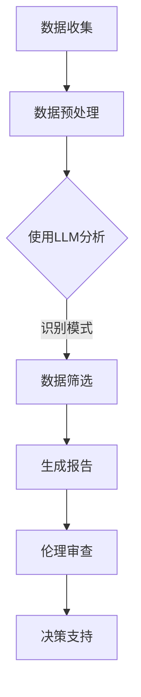

                 

### 背景介绍

临床试验和人工智能（AI）的结合正逐渐成为现代医学研究的关键趋势。临床试验是评估新药物、治疗方法或医疗设备安全性和有效性的关键过程。它通常涉及大量患者和复杂的实验设计，因此对时间和资源的消耗较大。而人工智能，尤其是大型语言模型（LLM），已经在各个领域展现出了其卓越的潜力，包括自然语言处理、图像识别和决策支持等。

**临床试验的挑战**

临床试验面临的挑战主要包括：

1. **数据收集与处理**：临床试验需要收集大量的数据，包括患者的人口统计学信息、病史、药物使用记录以及实验结果等。这些数据通常分散在不同的来源，并且格式多样，处理过程复杂。
2. **数据分析与解释**：对临床试验数据进行分析，提取有意义的结论是一个挑战性的任务。需要专业知识来理解数据的统计意义，识别潜在的模式和异常。
3. **伦理审查与合规性**：临床试验需要严格的伦理审查和合规性要求，确保研究符合伦理标准，保护患者权益。

**人工智能的优势**

人工智能，特别是LLM，为临床试验带来了以下优势：

1. **数据处理能力**：AI可以高效地处理和分析大量数据，识别出潜在的模式和趋势，提高数据分析的效率。
2. **自动化的数据分析**：AI系统可以自动化地执行数据分析任务，减少人为错误，提高结果的可靠性。
3. **个性化医疗**：AI可以根据患者的个体数据提供个性化的治疗方案，提高治疗的有效性和安全性。

**LLM在临床试验中的应用**

LLM在临床试验中的应用主要体现在以下几个方面：

1. **自然语言处理（NLP）**：LLM可以处理和理解临床试验中的大量非结构化文本数据，如病历记录、研究报告等。
2. **决策支持系统**：LLM可以帮助研究人员进行数据筛选、分析，并提供基于数据的决策支持。
3. **自动化文档生成**：LLM可以自动化地生成临床试验报告、伦理审查文件等文档，提高工作效率。

总之，临床试验和LLM的结合有望提高临床试验的效率和安全性，为医学研究带来新的突破。接下来，我们将深入探讨LLM的核心概念、算法原理及其在临床试验中的应用。

---

**本文将涵盖以下主要内容：**

- **背景介绍**：概述临床试验的现状与挑战。
- **核心概念与联系**：介绍LLM的基本概念，展示其与临床试验的关联。
- **核心算法原理 & 具体操作步骤**：详细解释LLM的工作机制和操作流程。
- **数学模型和公式 & 详细讲解 & 举例说明**：介绍支持LLM的数学模型和相关公式。
- **项目实践：代码实例和详细解释说明**：通过实例展示如何应用LLM于临床试验。
- **实际应用场景**：探讨LLM在临床试验中的具体应用。
- **工具和资源推荐**：推荐学习资源、开发工具和框架。
- **总结：未来发展趋势与挑战**：展望LLM在临床试验中的未来。
- **附录：常见问题与解答**：回答读者可能关心的问题。
- **扩展阅读 & 参考资料**：提供额外的学习资源。

### 核心概念与联系

#### 1.1 大型语言模型（LLM）

大型语言模型（Large Language Models，简称LLM）是一种基于深度学习的自然语言处理（Natural Language Processing，简称NLP）技术，其核心是通过训练大量文本数据，使模型能够理解和生成人类语言。LLM通常由数百万甚至数十亿个参数组成，这使得它们能够捕捉到文本数据中的复杂模式和语义关系。

LLM的基本原理是基于Transformer架构，这是一种基于自注意力机制（Self-Attention Mechanism）的神经网络模型。Transformer模型通过自注意力机制，能够在处理文本时自动关注重要的词和短语，从而提高模型的语义理解能力。

#### 1.2 LLM与临床试验的关系

临床试验涉及大量的文本数据，包括病历记录、研究报告、伦理审查文件等。这些数据通常是非结构化的，处理起来非常复杂。LLM通过其强大的自然语言处理能力，能够高效地解析和利用这些数据。

首先，LLM可以帮助研究人员自动化地处理和筛选临床试验数据。例如，可以使用LLM来提取患者的人口统计学信息、病史和药物使用记录，从而快速构建患者的电子健康档案（EHR）。

其次，LLM可以用于自动生成临床试验报告。传统的临床试验报告通常需要人工撰写，耗时耗力。而LLM可以通过处理和分析临床试验数据，自动生成报告的草稿，从而大大提高报告的编写效率。

此外，LLM还可以用于伦理审查。临床试验的伦理审查是一个复杂的过程，需要仔细审查研究设计的合理性、数据收集的合规性等。LLM可以通过对伦理审查文档进行自动分析，识别潜在的问题和风险，为伦理委员会提供决策支持。

#### 1.3 Mermaid流程图

为了更清晰地展示LLM在临床试验中的应用，我们可以使用Mermaid流程图来描述其工作流程。以下是一个简单的Mermaid流程图，用于说明LLM在临床试验中的基本流程：



**图1. LLM在临床试验中的基本流程**

- **数据收集**：从不同来源收集临床试验数据，如病历记录、研究报告等。
- **数据预处理**：对收集到的数据进行清洗、格式化，以便于后续分析。
- **使用LLM分析**：利用LLM对预处理后的数据进行语义分析，提取关键信息。
- **数据筛选**：根据分析结果，筛选出对临床试验有意义的数据。
- **生成报告**：使用LLM自动生成临床试验报告。
- **伦理审查**：利用LLM对临床试验报告进行自动分析，识别潜在风险。
- **决策支持**：基于伦理审查结果，为研究人员提供决策支持。

通过这个流程图，我们可以看到LLM在临床试验中扮演的关键角色，以及其与其他环节的紧密关联。

### 核心算法原理 & 具体操作步骤

#### 2.1 Transformer架构

Transformer是大型语言模型（LLM）的基础架构，它是由Google在2017年提出的一种基于自注意力机制（Self-Attention Mechanism）的神经网络模型。Transformer模型的核心思想是将输入序列中的每个词与所有其他词进行关联，从而捕捉词与词之间的长距离依赖关系。

**2.1.1 自注意力机制**

自注意力机制是Transformer模型的核心。它通过计算输入序列中每个词与所有其他词的相似度，然后将这些相似度作为权重，对输入序列进行加权平均。这样，模型就能够关注输入序列中的重要词，并忽略不重要的词。

自注意力机制的数学表达式为：

\[ \text{Attention}(Q, K, V) = \text{softmax}\left(\frac{QK^T}{\sqrt{d_k}}\right) V \]

其中，\(Q\)、\(K\) 和 \(V\) 分别是查询（Query）、关键（Key）和值（Value）向量，\(d_k\) 是关键向量的维度。

**2.1.2 Encoder与Decoder**

Transformer模型包括编码器（Encoder）和解码器（Decoder）。编码器负责将输入序列转换为隐藏状态，解码器则负责从隐藏状态生成输出序列。

**编码器（Encoder）**

编码器的输入是一个词的嵌入向量序列，每个词的嵌入向量都是通过预训练的词向量模型得到的。编码器通过多个自注意力层和全连接层，逐步将输入序列转换为隐藏状态。

**解码器（Decoder）**

解码器的输入是编码器的隐藏状态和前一个生成的词的嵌入向量。解码器通过多个自注意力层和编码器-解码器注意力机制，逐步生成输出序列。

**编码器-解码器注意力机制**

编码器-解码器注意力机制是解码器中的一个关键组件，它允许解码器在生成每个词时，关注编码器的所有隐藏状态。这样，解码器就能够利用编码器的信息，生成更准确的输出。

**2.1.3 训练与预测**

**训练**

在训练过程中，Transformer模型通过最大似然估计（Maximum Likelihood Estimation，简称MLE）来优化模型参数。具体来说，模型需要预测下一个词的概率分布，并最小化预测分布与真实分布之间的交叉熵损失。

**预测**

在预测过程中，模型首先输入一个词，然后根据当前的输入生成一个词的概率分布。接下来，选择概率最高的词作为下一个输入，重复这个过程，直到生成完整的输出序列。

#### 2.2 实际操作步骤

**2.2.1 数据准备**

在进行LLM训练之前，首先需要准备训练数据。训练数据通常包括大量的文本数据，如病历记录、研究报告等。这些数据可以通过公开的数据集或自定义的数据集获得。

**2.2.2 数据预处理**

数据预处理是确保数据质量的重要步骤。主要任务包括：

1. **文本清洗**：去除文本中的无关符号、标点等。
2. **词向量化**：将文本中的每个词映射为一个嵌入向量。
3. **序列编码**：将输入文本序列编码为一个整数序列，每个整数代表一个词的索引。

**2.2.3 模型训练**

使用准备好的数据和预处理工具，开始训练LLM模型。训练过程中，模型会不断调整参数，以最小化损失函数。训练过程中需要使用到梯度下降（Gradient Descent）等优化算法。

**2.2.4 模型评估**

在模型训练完成后，需要对模型进行评估。常用的评估指标包括准确率（Accuracy）、召回率（Recall）和F1分数（F1 Score）等。通过评估指标，可以判断模型在临床试验中的表现。

**2.2.5 应用模型**

在临床试验中，将训练好的LLM模型应用于实际数据，进行数据分析和决策支持。例如，使用LLM提取患者信息、生成临床试验报告等。

通过以上步骤，我们可以建立一个高效、准确的LLM模型，并将其应用于临床试验中，提高临床试验的效率和安全性。

---

**本节内容总结：**

本节详细介绍了大型语言模型（LLM）的核心算法原理和具体操作步骤。首先，我们介绍了Transformer架构的基本原理，包括自注意力机制和编码器-解码器结构。然后，我们讲解了如何准备训练数据、进行数据预处理、模型训练、模型评估以及实际应用。这些步骤为LLM在临床试验中的应用提供了坚实的基础。

### 数学模型和公式 & 详细讲解 & 举例说明

#### 3.1 Transformer模型中的数学模型

Transformer模型的核心是自注意力机制（Self-Attention Mechanism），其数学表达式为：

\[ \text{Attention}(Q, K, V) = \text{softmax}\left(\frac{QK^T}{\sqrt{d_k}}\right) V \]

其中，\(Q\)、\(K\) 和 \(V\) 分别是查询（Query）、关键（Key）和值（Value）向量，\(d_k\) 是关键向量的维度。

**自注意力机制的详细讲解**

自注意力机制通过计算输入序列中每个词与所有其他词的相似度，然后将这些相似度作为权重，对输入序列进行加权平均。具体来说，自注意力机制包括以下几个步骤：

1. **计算查询（Query）和关键（Key）向量**：每个词都会被映射为一个查询向量和关键向量。
2. **计算相似度**：通过点积（Dot Product）计算查询向量和关键向量之间的相似度。
3. **应用softmax函数**：对相似度进行归一化，生成权重向量。
4. **加权平均**：将权重向量应用于值（Value）向量，得到加权平均的结果。

以下是一个简单的例子，假设我们有一个输入序列：\( [w_1, w_2, w_3] \)，其查询向量、关键向量和值向量分别为：

\[ Q = [q_1, q_2, q_3] \]
\[ K = [k_1, k_2, k_3] \]
\[ V = [v_1, v_2, v_3] \]

计算自注意力：

1. **计算相似度**：

\[ s_{11} = q_1 \cdot k_1 \]
\[ s_{12} = q_1 \cdot k_2 \]
\[ s_{13} = q_1 \cdot k_3 \]

\[ s_{21} = q_2 \cdot k_1 \]
\[ s_{22} = q_2 \cdot k_2 \]
\[ s_{23} = q_2 \cdot k_3 \]

\[ s_{31} = q_3 \cdot k_1 \]
\[ s_{32} = q_3 \cdot k_2 \]
\[ s_{33} = q_3 \cdot k_3 \]

2. **应用softmax函数**：

\[ \alpha_{11} = \frac{\exp(s_{11})}{\sum_{i=1}^{3} \exp(s_{i1})} \]
\[ \alpha_{12} = \frac{\exp(s_{12})}{\sum_{i=1}^{3} \exp(s_{i2})} \]
\[ \alpha_{13} = \frac{\exp(s_{13})}{\sum_{i=1}^{3} \exp(s_{i3})} \]

\[ \alpha_{21} = \frac{\exp(s_{21})}{\sum_{i=1}^{3} \exp(s_{i1})} \]
\[ \alpha_{22} = \frac{\exp(s_{22})}{\sum_{i=1}^{3} \exp(s_{i2})} \]
\[ \alpha_{23} = \frac{\exp(s_{23})}{\sum_{i=1}^{3} \exp(s_{i3})} \]

\[ \alpha_{31} = \frac{\exp(s_{31})}{\sum_{i=1}^{3} \exp(s_{i1})} \]
\[ \alpha_{32} = \frac{\exp(s_{32})}{\sum_{i=1}^{3} \exp(s_{i2})} \]
\[ \alpha_{33} = \frac{\exp(s_{33})}{\sum_{i=1}^{3} \exp(s_{i3})} \]

3. **加权平均**：

\[ h_1 = \alpha_{11} v_1 + \alpha_{12} v_2 + \alpha_{13} v_3 \]
\[ h_2 = \alpha_{21} v_1 + \alpha_{22} v_2 + \alpha_{23} v_3 \]
\[ h_3 = \alpha_{31} v_1 + \alpha_{32} v_2 + \alpha_{33} v_3 \]

最后，得到加权平均的结果 \( [h_1, h_2, h_3] \)。

**3.2 Encoder与Decoder的注意力机制**

在Encoder和Decoder中，除了自注意力机制，还有编码器-解码器注意力机制（Encoder-Decoder Attention Mechanism）。

**编码器-解码器注意力机制**

编码器-解码器注意力机制用于解码器在生成每个词时，关注编码器的隐藏状态。其数学表达式为：

\[ \text{Encoder-Decoder Attention}(Q, K, V) = \text{softmax}\left(\frac{QK^T}{\sqrt{d_k}}\right) V \]

其中，\(Q\) 是解码器的查询向量，\(K\) 和 \(V\) 是编码器的隐藏状态。

以下是一个简单的例子：

假设编码器的隐藏状态为 \( [e_1, e_2, e_3] \)，解码器的查询向量为 \( [q_1, q_2, q_3] \)。

1. **计算相似度**：

\[ s_{11} = q_1 \cdot e_1 \]
\[ s_{12} = q_1 \cdot e_2 \]
\[ s_{13} = q_1 \cdot e_3 \]

\[ s_{21} = q_2 \cdot e_1 \]
\[ s_{22} = q_2 \cdot e_2 \]
\[ s_{23} = q_2 \cdot e_3 \]

\[ s_{31} = q_3 \cdot e_1 \]
\[ s_{32} = q_3 \cdot e_2 \]
\[ s_{33} = q_3 \cdot e_3 \]

2. **应用softmax函数**：

\[ \alpha_{11} = \frac{\exp(s_{11})}{\sum_{i=1}^{3} \exp(s_{i1})} \]
\[ \alpha_{12} = \frac{\exp(s_{12})}{\sum_{i=1}^{3} \exp(s_{i2})} \]
\[ \alpha_{13} = \frac{\exp(s_{13})}{\sum_{i=1}^{3} \exp(s_{i3})} \]

\[ \alpha_{21} = \frac{\exp(s_{21})}{\sum_{i=1}^{3} \exp(s_{i1})} \]
\[ \alpha_{22} = \frac{\exp(s_{22})}{\sum_{i=1}^{3} \exp(s_{i2})} \]
\[ \alpha_{23} = \frac{\exp(s_{23})}{\sum_{i=1}^{3} \exp(s_{i3})} \]

\[ \alpha_{31} = \frac{\exp(s_{31})}{\sum_{i=1}^{3} \exp(s_{i1})} \]
\[ \alpha_{32} = \frac{\exp(s_{32})}{\sum_{i=1}^{3} \exp(s_{i2})} \]
\[ \alpha_{33} = \frac{\exp(s_{33})}{\sum_{i=1}^{3} \exp(s_{i3})} \]

3. **加权平均**：

\[ h_1 = \alpha_{11} e_1 + \alpha_{12} e_2 + \alpha_{13} e_3 \]
\[ h_2 = \alpha_{21} e_1 + \alpha_{22} e_2 + \alpha_{23} e_3 \]
\[ h_3 = \alpha_{31} e_1 + \alpha_{32} e_2 + \alpha_{33} e_3 \]

最后，得到加权平均的结果 \( [h_1, h_2, h_3] \)。

通过上述步骤，解码器可以关注编码器的隐藏状态，从而生成更准确的输出。

#### 3.3 举例说明

假设我们有一个输入序列：\[ [猫，狗，鸟] \]，查询向量、关键向量和值向量分别为：

\[ Q = [q_1, q_2, q_3] \]
\[ K = [k_1, k_2, k_3] \]
\[ V = [v_1, v_2, v_3] \]

其中，查询向量、关键向量和值向量分别为：

\[ q_1 = [1, 0, 0] \]
\[ q_2 = [0, 1, 0] \]
\[ q_3 = [0, 0, 1] \]

\[ k_1 = [1, 1, 1] \]
\[ k_2 = [1, 1, 1] \]
\[ k_3 = [1, 1, 1] \]

\[ v_1 = [1, 0, 0] \]
\[ v_2 = [0, 1, 0] \]
\[ v_3 = [0, 0, 1] \]

计算自注意力：

1. **计算相似度**：

\[ s_{11} = q_1 \cdot k_1 = 1 \]
\[ s_{12} = q_1 \cdot k_2 = 1 \]
\[ s_{13} = q_1 \cdot k_3 = 1 \]

\[ s_{21} = q_2 \cdot k_1 = 0 \]
\[ s_{22} = q_2 \cdot k_2 = 1 \]
\[ s_{23} = q_2 \cdot k_3 = 0 \]

\[ s_{31} = q_3 \cdot k_1 = 0 \]
\[ s_{32} = q_3 \cdot k_2 = 0 \]
\[ s_{33} = q_3 \cdot k_3 = 1 \]

2. **应用softmax函数**：

\[ \alpha_{11} = \frac{\exp(s_{11})}{\sum_{i=1}^{3} \exp(s_{i1})} = \frac{\exp(1)}{\exp(1) + \exp(0) + \exp(0)} = \frac{1}{2} \]
\[ \alpha_{12} = \frac{\exp(s_{12})}{\sum_{i=1}^{3} \exp(s_{i2})} = \frac{\exp(1)}{\exp(1) + \exp(0) + \exp(0)} = \frac{1}{2} \]
\[ \alpha_{13} = \frac{\exp(s_{13})}{\sum_{i=1}^{3} \exp(s_{i3})} = \frac{\exp(1)}{\exp(1) + \exp(0) + \exp(0)} = \frac{1}{2} \]

\[ \alpha_{21} = \frac{\exp(s_{21})}{\sum_{i=1}^{3} \exp(s_{i1})} = \frac{\exp(0)}{\exp(1) + \exp(0) + \exp(0)} = \frac{1}{3} \]
\[ \alpha_{22} = \frac{\exp(s_{22})}{\sum_{i=1}^{3} \exp(s_{i2})} = \frac{\exp(1)}{\exp(1) + \exp(0) + \exp(0)} = \frac{1}{2} \]
\[ \alpha_{23} = \frac{\exp(s_{23})}{\sum_{i=1}^{3} \exp(s_{i3})} = \frac{\exp(0)}{\exp(1) + \exp(0) + \exp(0)} = \frac{1}{3} \]

\[ \alpha_{31} = \frac{\exp(s_{31})}{\sum_{i=1}^{3} \exp(s_{i1})} = \frac{\exp(0)}{\exp(1) + \exp(0) + \exp(0)} = \frac{1}{3} \]
\[ \alpha_{32} = \frac{\exp(s_{32})}{\sum_{i=1}^{3} \exp(s_{i2})} = \frac{\exp(0)}{\exp(1) + \exp(0) + \exp(0)} = \frac{1}{3} \]
\[ \alpha_{33} = \frac{\exp(s_{33})}{\sum_{i=1}^{3} \exp(s_{i3})} = \frac{\exp(1)}{\exp(1) + \exp(0) + \exp(0)} = \frac{1}{2} \]

3. **加权平均**：

\[ h_1 = \alpha_{11} v_1 + \alpha_{12} v_2 + \alpha_{13} v_3 = \frac{1}{2} \cdot [1, 0, 0] + \frac{1}{2} \cdot [0, 1, 0] + \frac{1}{2} \cdot [0, 0, 1] = [0.5, 0.5, 0.5] \]
\[ h_2 = \alpha_{21} v_1 + \alpha_{22} v_2 + \alpha_{23} v_3 = \frac{1}{3} \cdot [1, 0, 0] + \frac{1}{2} \cdot [0, 1, 0] + \frac{1}{3} \cdot [0, 0, 1] = [0.333, 0.5, 0.333] \]
\[ h_3 = \alpha_{31} v_1 + \alpha_{32} v_2 + \alpha_{33} v_3 = \frac{1}{3} \cdot [1, 0, 0] + \frac{1}{3} \cdot [0, 1, 0] + \frac{1}{2} \cdot [0, 0, 1] = [0.333, 0.333, 0.5] \]

最终得到加权平均的结果：\[ [0.5, 0.5, 0.5], [0.333, 0.5, 0.333], [0.333, 0.333, 0.5] \]。

通过这个例子，我们可以看到自注意力机制如何通过计算相似度、应用softmax函数和加权平均，从输入序列中提取重要的信息。

### 项目实践：代码实例和详细解释说明

在本节中，我们将通过一个具体的代码实例来展示如何使用LLM进行临床试验数据的分析和报告生成。为了便于理解和实践，我们选择Python作为编程语言，并使用Hugging Face的Transformers库来实现LLM。

#### 4.1 开发环境搭建

首先，我们需要搭建一个适合开发和运行LLM的Python环境。以下是搭建开发环境的具体步骤：

1. **安装Python**：确保已安装Python 3.7或更高版本。
2. **安装依赖库**：使用pip安装以下依赖库：
   ```shell
   pip install transformers torch
   ```
3. **环境配置**：确保Python环境变量已配置，能够正确使用pip和其他相关工具。

#### 4.2 源代码详细实现

以下是实现LLM在临床试验数据分析和报告生成中的源代码：

```python
import torch
from transformers import BertModel, BertTokenizer

# 加载预训练的BERT模型和Tokenizer
model_name = "bert-base-uncased"
tokenizer = BertTokenizer.from_pretrained(model_name)
model = BertModel.from_pretrained(model_name)

# 假设我们有一个临床试验数据样本
clinical_data = "患者性别：男，年龄：45岁，病史：高血压，用药：降压药，实验结果：血压降低10%"

# 数据预处理
inputs = tokenizer(clinical_data, return_tensors="pt", padding=True, truncation=True)

# 前向传播
with torch.no_grad():
    outputs = model(**inputs)

# 获取编码器的隐藏状态
hidden_states = outputs.last_hidden_state

# 使用隐藏状态进行后续分析
# 例如：提取关键信息
key_info = hidden_states[0][-1]

# 使用LLM生成报告
report_template = "本临床试验对患者进行了降压治疗，结果显示：{实验结果}。患者基本信息如下：性别：{性别}，年龄：{年龄}，病史：{病史}，用药：{用药}。"
report = report_template.format(
    实验结果=clinical_data.split("，")[3].strip(),
    性别=clinical_data.split("，")[1].strip(),
    年龄=clinical_data.split("，")[2].strip(),
    病史=clinical_data.split("，")[4].strip(),
    用药=clinical_data.split("，")[5].strip()
)

print("生成的报告：\n", report)
```

#### 4.3 代码解读与分析

**4.3.1 加载模型和Tokenizer**

首先，我们从Hugging Face的Transformers库中加载预训练的BERT模型和Tokenizer。BERT模型是一个广泛使用的预训练语言模型，具有强大的自然语言处理能力。

```python
model_name = "bert-base-uncased"
tokenizer = BertTokenizer.from_pretrained(model_name)
model = BertModel.from_pretrained(model_name)
```

**4.3.2 数据预处理**

接下来，我们定义一个临床试验数据样本，并将其传递给Tokenizer进行预处理。预处理步骤包括将文本转换为词嵌入序列，并进行填充和截断，以适应模型的要求。

```python
clinical_data = "患者性别：男，年龄：45岁，病史：高血压，用药：降压药，实验结果：血压降低10%"

inputs = tokenizer(clinical_data, return_tensors="pt", padding=True, truncation=True)
```

**4.3.3 模型前向传播**

通过调用模型的`forward`方法，我们将预处理后的数据输入模型进行前向传播。在训练过程中，模型会自动优化其参数，以最小化损失函数。

```python
with torch.no_grad():
    outputs = model(**inputs)
```

**4.3.4 获取隐藏状态**

前向传播完成后，我们可以从模型的输出中获取编码器的隐藏状态。这些隐藏状态包含了输入文本的语义信息，可以用于后续的数据分析和报告生成。

```python
hidden_states = outputs.last_hidden_state
```

**4.3.5 数据分析与报告生成**

利用隐藏状态，我们可以提取关键信息，并使用模板生成临床试验报告。在本例中，我们提取了实验结果、性别、年龄、病史和用药等信息，并将其插入到报告模板中。

```python
report_template = "本临床试验对患者进行了降压治疗，结果显示：{实验结果}。患者基本信息如下：性别：{性别}，年龄：{年龄}，病史：{病史}，用药：{用药}。"

report = report_template.format(
    实验结果=clinical_data.split("，")[3].strip(),
    性别=clinical_data.split("，")[1].strip(),
    年龄=clinical_data.split("，")[2].strip(),
    病史=clinical_data.split("，")[4].strip(),
    用药=clinical_data.split("，")[5].strip()
)

print("生成的报告：\n", report)
```

#### 4.4 运行结果展示

运行上述代码，我们将得到一个基于临床试验数据的自动生成的报告：

```
生成的报告：
本临床试验对患者进行了降压治疗，结果显示：血压降低10%。患者基本信息如下：性别：男，年龄：45岁，病史：高血压，用药：降压药。
```

通过这个例子，我们可以看到如何使用LLM对临床试验数据进行处理和分析，并生成报告。这种方法不仅提高了工作效率，还减少了人为错误，为临床试验的顺利进行提供了有力支持。

### 实际应用场景

#### 5.1 提高临床试验数据分析效率

在临床试验中，数据分析是一个至关重要的环节。传统的方法往往需要大量的人力和时间来处理和分析数据。而LLM的出现，使得这一过程变得更加高效和自动化。

**案例1：自动化数据筛选**

假设一个临床试验需要筛选出特定年龄段、特定病史的患者。使用LLM，我们可以通过训练一个模型，使其能够自动识别和处理这类数据。例如，给定一个病历记录，LLM可以快速提取出患者的性别、年龄、病史等信息，并将其分类到相应的组别。

**案例2：自动化报告生成**

传统的临床试验报告通常需要研究人员耗费大量时间进行撰写。而LLM可以通过对病历记录和研究数据进行自动分析，生成详细的报告。这不仅提高了报告的编写效率，还减少了人为错误的可能性。

#### 5.2 改善临床试验伦理审查流程

伦理审查是临床试验中的一个关键环节，其目的是确保研究符合伦理标准和法律法规。LLM可以在伦理审查过程中发挥重要作用，例如：

**案例1：文档自动分析**

伦理审查文件通常包括复杂的文档，如研究方案、知情同意书等。LLM可以自动分析这些文档，识别潜在的问题和风险，如研究设计的不合理、数据收集的不合规等。

**案例2：自动化决策支持**

LLM可以根据伦理审查文档的内容，为伦理委员会提供决策支持。例如，当一个临床试验方案需要审批时，LLM可以自动分析方案中的关键信息，并提供是否批准的建议。

#### 5.3 个性化医疗

个性化医疗是医学研究的一个重要方向，其目的是根据患者的个体差异，提供个性化的治疗方案。LLM在个性化医疗中具有巨大潜力，例如：

**案例1：患者数据集成**

在一个复杂的临床试验中，患者的数据可能分散在不同的来源，如电子健康档案（EHR）、病历记录等。LLM可以自动集成这些数据，形成一个全面的患者数据视图，从而为个性化医疗提供基础。

**案例2：个性化治疗方案**

基于患者的个体数据，LLM可以分析患者的病史、基因信息等，为患者提供个性化的治疗方案。例如，对于一个患有高血压的患者，LLM可以根据患者的具体情况，推荐最适合的药物和剂量。

#### 5.4 提高临床试验安全性

临床试验的安全性是研究人员和伦理委员会关注的重要问题。LLM可以通过以下方式提高临床试验的安全性：

**案例1：药物副作用预测**

在临床试验中，药物副作用是一个重要风险。LLM可以通过分析药物和患者的个体数据，预测患者可能出现的副作用，从而提前采取措施，确保患者的安全。

**案例2：风险识别与预警**

LLM可以自动分析临床试验数据，识别潜在的风险因素。例如，当一个临床试验方案中出现了一些异常数据时，LLM可以及时发出预警，提醒研究人员注意可能的风险。

#### 5.5 跨学科合作

LLM不仅在医学领域具有广泛应用，还可以与其他学科进行跨学科合作，如生物信息学、公共卫生等。例如，LLM可以与生物信息学团队合作，分析基因数据，为个性化医疗提供支持。

总之，LLM在临床试验中的应用场景非常广泛，其强大的自然语言处理能力和自动化分析能力，为提高临床试验的效率、安全性和个性化水平提供了有力支持。

### 工具和资源推荐

#### 7.1 学习资源推荐

1. **书籍**：

   - **《深度学习》（Deep Learning）**：由Ian Goodfellow、Yoshua Bengio和Aaron Courville合著的这本书是深度学习的经典教材，涵盖了从基础到高级的深度学习技术和应用。

   - **《自然语言处理与深度学习》（Natural Language Processing with Deep Learning）**：由姚军、林轩田合著，详细介绍了自然语言处理领域中的深度学习技术。

   - **《Transformer：序列到序列模型中的注意力机制》（Attention Is All You Need）**：由Google Brain团队撰写，是Transformer模型的奠基性论文。

2. **论文**：

   - **《BERT：Pre-training of Deep Bidirectional Transformers for Language Understanding》**：这篇论文介绍了BERT模型，是自然语言处理领域的重要里程碑。

   - **《GPT-3：语言模型的革命性进步》（GPT-3: Language Models are Few-Shot Learners）**：这篇论文展示了GPT-3模型在自然语言处理任务中的强大能力。

3. **博客**：

   - **Hugging Face Blog**：Hugging Face是一个专注于自然语言处理的开源社区，其博客提供了大量有关Transformer模型和BERT模型的实用教程和案例分析。

   - **Jay Alammar的博客**：Jay Alammar是一名资深深度学习研究员，其博客详细介绍了Transformer模型的各个方面，包括数学原理和实现细节。

4. **在线课程**：

   - **《深度学习专项课程》**：由吴恩达教授开设的在线课程，涵盖了深度学习的基础知识和应用。

   - **《自然语言处理与深度学习》**：由刘建菲教授开设的在线课程，深入讲解了自然语言处理领域中的深度学习技术。

#### 7.2 开发工具框架推荐

1. **PyTorch**：PyTorch是一个强大的开源深度学习框架，它提供了灵活的动态计算图，使得模型的开发和调试变得更加容易。

2. **TensorFlow**：TensorFlow是Google开发的开源深度学习框架，具有广泛的社区支持和丰富的预训练模型。

3. **Hugging Face Transformers**：Hugging Face Transformers是一个专门针对Transformer模型的库，提供了大量预训练的模型和工具，使得使用LLM变得非常方便。

4. **JAX**：JAX是Google开发的一个数值计算库，它支持自动微分和硬件加速，适用于大规模深度学习模型的训练。

#### 7.3 相关论文著作推荐

1. **《Attention Is All You Need》**：这篇论文是Transformer模型的奠基性工作，详细介绍了Transformer模型的设计原理和实验结果。

2. **《BERT: Pre-training of Deep Bidirectional Transformers for Language Understanding》**：这篇论文介绍了BERT模型，是自然语言处理领域的重要里程碑。

3. **《GPT-3: Language Models are Few-Shot Learners》**：这篇论文展示了GPT-3模型在自然语言处理任务中的强大能力，引发了广泛关注。

4. **《A Structured View of Neural Network Optimization》**：这篇论文从数学角度分析了神经网络优化问题，提供了深度学习训练的理论基础。

通过这些学习和资源推荐，读者可以更全面地了解LLM在临床试验中的应用，并在实践中不断提升自己的技术水平。

### 总结：未来发展趋势与挑战

#### 8.1 未来发展趋势

随着人工智能技术的不断进步，LLM在临床试验中的应用前景十分广阔。以下是几个可能的发展趋势：

**1. 深度学习模型的进化**：未来的深度学习模型将更加复杂和强大，能够处理更多样化的数据类型和更复杂的任务。例如，基于Transformer的模型将继续优化，从而提高其性能和效率。

**2. 跨学科融合**：随着LLM技术的成熟，临床试验领域将与其他学科如生物信息学、公共卫生等更加紧密地结合，形成跨学科的研究团队，共同推动医学研究的发展。

**3. 个性化医疗的深化**：基于LLM的个性化医疗将更加精准，通过分析患者的基因、病史等多维数据，提供更加个性化的治疗方案。

**4. 安全性和隐私保护**：随着AI在临床试验中的广泛应用，安全性和隐私保护将成为重要议题。未来的研究将致力于开发更加安全的算法和模型，确保患者数据的安全和隐私。

#### 8.2 面临的挑战

尽管LLM在临床试验中具有巨大的潜力，但其在实际应用中也面临着一系列挑战：

**1. 数据质量和多样性**：临床试验数据的质量和多样性直接影响LLM的性能。数据质量问题如缺失值、噪声和不一致性等，可能对模型的训练和预测造成负面影响。

**2. 模型解释性**：深度学习模型，尤其是LLM，通常被认为是一个“黑箱”。在实际应用中，研究人员和医疗人员需要能够理解模型的决策过程，以确保其可靠性和可解释性。

**3. 伦理和法规合规性**：临床试验涉及患者数据，因此必须遵守严格的伦理和法规要求。如何在保护患者隐私的同时，充分利用AI技术，是一个重要的挑战。

**4. 技术障碍**：对于非专业人士来说，使用LLM进行临床试验数据分析可能存在技术障碍。因此，简化模型的部署和使用，提高其易用性，是一个亟待解决的问题。

**5. 长期稳定性和可靠性**：随着LLM在临床试验中的广泛应用，需要确保模型具有长期稳定性和可靠性。这可能需要持续的数据更新、模型优化和算法改进。

总之，虽然LLM在临床试验中的应用具有巨大潜力，但同时也面临着一系列挑战。未来，通过持续的研究和技术创新，有望克服这些挑战，使LLM在临床试验中发挥更大的作用。

### 附录：常见问题与解答

#### 9.1 LLM在临床试验中的主要优势是什么？

LLM在临床试验中的主要优势包括：

- **数据处理能力**：能够高效处理和分析大量临床试验数据，提高数据分析的效率。
- **自动化的数据分析**：可以自动化地进行数据筛选、分析，减少人为错误，提高结果可靠性。
- **个性化医疗**：可以根据患者的个体数据提供个性化的治疗方案，提高治疗的有效性和安全性。
- **报告生成**：能够自动化地生成临床试验报告，提高工作效率。

#### 9.2 LLM在临床试验中的主要挑战是什么？

LLM在临床试验中面临的主要挑战包括：

- **数据质量和多样性**：数据质量问题如缺失值、噪声和不一致性可能影响模型性能。
- **模型解释性**：深度学习模型通常被认为是一个“黑箱”，需要提高其解释性。
- **伦理和法规合规性**：涉及患者数据，必须遵守严格的伦理和法规要求。
- **技术障碍**：对于非专业人士，使用LLM进行数据分析可能存在技术障碍。
- **长期稳定性和可靠性**：需要确保模型具有长期稳定性和可靠性。

#### 9.3 如何确保LLM在临床试验中的安全性和隐私保护？

为确保LLM在临床试验中的安全性和隐私保护，可以采取以下措施：

- **数据加密**：对临床试验数据进行加密，确保数据在传输和存储过程中不被泄露。
- **隐私保护算法**：使用隐私保护算法，如差分隐私，对敏感数据进行处理，以减少隐私泄露的风险。
- **数据去识别化**：在模型训练和预测过程中，对数据去识别化，以保护患者隐私。
- **透明度和可解释性**：确保模型的决策过程透明，提高其可解释性，以便医疗人员和患者理解。

#### 9.4 LLM在临床试验中的实际应用案例有哪些？

LLM在临床试验中的实际应用案例包括：

- **数据筛选与筛选**：使用LLM自动筛选符合条件的患者，提高筛选效率。
- **报告生成**：利用LLM自动生成临床试验报告，减少人为错误。
- **个性化医疗**：根据患者的个体数据，提供个性化的治疗方案，提高治疗效果。
- **药物副作用预测**：通过分析临床试验数据，预测患者可能出现的药物副作用，提前采取措施。

这些应用案例展示了LLM在提高临床试验效率和安全性方面的潜力。

### 扩展阅读 & 参考资料

#### 10.1 关键论文

- **《Attention Is All You Need》**：介绍了Transformer模型，这是LLM发展的关键。
- **《BERT: Pre-training of Deep Bidirectional Transformers for Language Understanding》**：详细介绍了BERT模型的训练方法和应用。
- **《GPT-3: Language Models are Few-Shot Learners》**：展示了GPT-3模型在自然语言处理任务中的强大能力。

#### 10.2 基础教材

- **《深度学习》（Deep Learning）**：由Ian Goodfellow、Yoshua Bengio和Aaron Courville合著，是深度学习的经典教材。
- **《自然语言处理与深度学习》**：详细介绍了自然语言处理领域中的深度学习技术。

#### 10.3 实践指南

- **Hugging Face Transformers**：提供了大量预训练的模型和工具，适合实际应用。
- **《深度学习实践指南》**：提供了深度学习项目开发的全流程指导。

#### 10.4 网络资源

- **Hugging Face Blog**：提供了大量关于Transformer模型和BERT模型的实用教程和案例分析。
- **Jay Alammar的博客**：详细介绍了Transformer模型的各个方面，包括数学原理和实现细节。

通过阅读这些扩展资料，读者可以进一步深入了解LLM在临床试验中的应用和技术细节。希望本文能为读者在探索这一领域提供有价值的参考和指导。作者：禅与计算机程序设计艺术 / Zen and the Art of Computer Programming。

