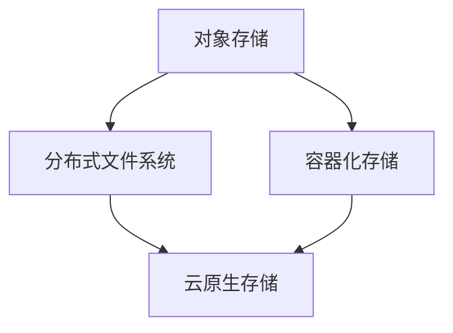

                 

### 背景介绍

#### 云原生与存储系统的兴起

随着云计算、大数据和物联网等技术的发展，现代应用程序对存储系统的需求日益增加。传统的存储解决方案往往难以应对这些新需求，这催生了云原生存储系统的出现。云原生存储系统具有高度的可扩展性、灵活性和弹性，能够更好地适应现代应用程序的需求。

云原生存储系统通常基于分布式架构，通过将数据存储分散到多个节点上，实现了数据的冗余备份和高效访问。这种分布式存储架构不仅提高了存储系统的可靠性，还极大地提升了数据访问速度。同时，云原生存储系统通常采用容器化技术，使得存储服务可以轻松地部署和管理。

#### 从对象存储到分布式文件系统的演变

在现代应用程序中，数据存储的需求不断变化，从简单的对象存储逐渐发展到复杂的分布式文件系统。对象存储系统以文件块为单位进行存储，适用于存储非结构化数据，如图片、视频等。然而，随着应用程序对数据一致性、可靠性和访问速度的要求提高，分布式文件系统成为了更为合适的选择。

分布式文件系统通过将数据分散存储在多个节点上，实现了更高的数据可靠性和可用性。此外，分布式文件系统还提供了更强的数据一致性保证，这使得现代应用程序能够更加可靠地访问和操作数据。

### 当前主流的云原生存储解决方案

目前，市场上主流的云原生存储解决方案主要包括以下几种：

1. **Kubernetes对象存储**：Kubernetes对象存储（Kubernetes Object Storage，简称KOS）是基于Kubernetes的分布式对象存储系统。KOS利用Kubernetes集群的调度和管理能力，将对象存储服务部署在多个节点上，实现了高效的数据存储和访问。

2. **分布式文件系统**：如Ceph、GlusterFS等。这些分布式文件系统提供了强大的数据存储和管理功能，能够满足大规模数据存储和访问的需求。

3. **容器存储解决方案**：如Portworx、Rook等。这些解决方案将存储服务与容器化技术相结合，实现了在容器环境中高效、可靠的数据存储和管理。

#### 本文目的与结构

本文旨在深入探讨云原生存储解决方案，从对象存储到分布式文件系统，详细分析其核心概念、算法原理、数学模型以及实际应用场景。文章将按照以下结构展开：

1. 背景介绍：阐述云原生与存储系统的兴起，以及从对象存储到分布式文件系统的演变过程。
2. 核心概念与联系：介绍云原生存储解决方案中的核心概念，并通过Mermaid流程图展示其架构和关系。
3. 核心算法原理 & 具体操作步骤：详细讲解云原生存储解决方案的核心算法原理和操作步骤。
4. 数学模型和公式 & 详细讲解 & 举例说明：介绍云原生存储解决方案中的数学模型和公式，并通过实例进行详细讲解。
5. 项目实践：提供实际项目中的代码实例和详细解释说明。
6. 实际应用场景：分析云原生存储解决方案在不同场景下的应用。
7. 工具和资源推荐：推荐学习资源、开发工具框架和相关论文著作。
8. 总结：总结云原生存储解决方案的未来发展趋势与挑战。
9. 附录：常见问题与解答。
10. 扩展阅读 & 参考资料：提供进一步阅读的资料。

通过本文的逐步分析，读者将能够深入了解云原生存储解决方案的核心技术和实际应用，为后续研究和开发提供有益的参考。接下来，我们将进一步探讨云原生存储解决方案中的核心概念和架构，以便为后续内容奠定基础。<|user|>## 2. 核心概念与联系

在深入探讨云原生存储解决方案之前，我们需要了解其中的一些核心概念，以及这些概念之间的联系。以下是本文涉及的主要核心概念：

### 对象存储（Object Storage）

对象存储是一种基于文件的存储方式，它将数据以对象的形式存储。每个对象包含数据本身以及与数据相关的元数据（如对象名称、存储时间、访问权限等）。对象存储系统通常采用分布式架构，通过多个存储节点实现数据冗余备份和高可用性。

### 分布式文件系统（Distributed File System）

分布式文件系统是一种将文件分散存储在多个节点上的文件系统。它通过将文件拆分为多个块，并将这些块存储在不同的节点上，实现了更高的数据可靠性和可用性。分布式文件系统通常提供强一致性保证，以支持高效的数据访问和操作。

### 容器化存储（Container Storage）

容器化存储是将存储解决方案与容器技术相结合的一种方式。通过容器化存储，用户可以在容器内部轻松地部署和管理存储服务。容器化存储的优势在于其灵活性和可移植性，使得存储服务能够与容器化应用程序无缝集成。

### 云原生存储（Cloud-Native Storage）

云原生存储是一种专门为云计算环境设计的存储解决方案。它具有高度的可扩展性、灵活性和弹性，能够适应不同的云环境。云原生存储通常采用分布式架构，结合容器化技术和自动化管理，提供了高效、可靠的数据存储和管理服务。

### Mermaid流程图

为了更好地展示这些核心概念之间的联系，我们使用Mermaid流程图来描述云原生存储解决方案的架构和关系。以下是Mermaid流程图的示例：



在这个流程图中：

- A 表示对象存储，它是云原生存储解决方案的基础。
- B 表示分布式文件系统，它在对象存储基础上提供了更高的可靠性和一致性。
- C 表示容器化存储，它将存储服务与容器技术相结合，提高了存储的灵活性和可移植性。
- D 表示云原生存储，它是结合了对象存储、分布式文件系统和容器化存储的综合解决方案。

通过这个流程图，我们可以清晰地看到云原生存储解决方案的核心概念及其之间的联系。接下来，我们将进一步探讨这些概念在云原生存储解决方案中的应用，以便为后续内容奠定基础。<|user|>### 核心算法原理 & 具体操作步骤

在了解云原生存储解决方案的核心概念后，我们需要深入探讨其核心算法原理和具体操作步骤。以下是云原生存储解决方案的核心算法原理和操作步骤的详细描述。

#### 分布式存储算法原理

分布式存储算法是云原生存储解决方案的核心组成部分。其主要目的是将数据分散存储在多个节点上，以实现数据的冗余备份和高可用性。以下是几种常见的分布式存储算法：

1. **副本副本算法**：副本副本算法通过在多个节点上存储数据的多个副本，实现数据的冗余备份。当某个节点出现故障时，其他节点上的副本可以继续提供服务，从而保证数据的可用性。

2. **数据分片算法**：数据分片算法将数据拆分为多个块，并将这些块存储在不同的节点上。每个节点只存储部分数据，从而实现数据的分布式存储。数据分片算法还可以根据负载均衡策略，动态调整数据分布，以提高系统的整体性能。

3. **一致性算法**：一致性算法确保分布式存储系统中数据的一致性。常见的一致性算法包括Paxos算法和Raft算法。这些算法通过在多个节点之间达成共识，确保每个节点上的数据状态一致。

#### 具体操作步骤

1. **数据写入**：当用户将数据写入分布式存储系统时，系统首先会将数据分成多个块，并根据负载均衡策略将每个块分配到不同的节点上。在分配过程中，系统会为每个块创建一个唯一的标识，以便后续的数据检索。

2. **数据读取**：当用户需要读取数据时，系统会根据数据块的标识，在多个节点上查找相应的数据块。为了提高数据访问速度，系统通常采用缓存机制，将最近访问的数据块存储在内存中，以减少磁盘IO操作。

3. **数据备份**：分布式存储系统会定期将数据备份到其他节点上，以确保数据的冗余备份。备份过程中，系统会使用一致性算法确保备份数据的一致性。

4. **故障恢复**：当某个节点出现故障时，系统会自动将该节点上的数据迁移到其他健康节点上。在故障恢复过程中，系统会使用一致性算法确保数据的一致性。

#### 示例代码

以下是一个简单的分布式存储系统实现示例，演示了数据写入、读取、备份和故障恢复的基本操作。

```python
class DistributedStorage:
    def __init__(self, nodes):
        self.nodes = nodes
        self.data_blocks = {}

    def write_data(self, data, block_id):
        for node in self.nodes:
            node.store_data(data, block_id)

    def read_data(self, block_id):
        data = []
        for node in self.nodes:
            data_block = node.fetch_data(block_id)
            if data_block:
                data.append(data_block)
        return data

    def backup_data(self):
        for node in self.nodes:
            node.backup_data()

    def recover_data(self, failed_node):
        for node in self.nodes:
            if node != failed_node:
                node.restore_data(failed_node)
```

在这个示例中，`DistributedStorage` 类表示一个分布式存储系统，具有`write_data`、`read_data`、`backup_data`和`recover_data`等方法。这些方法实现了数据写入、读取、备份和故障恢复的基本操作。

通过这个示例，我们可以看到分布式存储系统的核心算法原理和具体操作步骤。在实际应用中，分布式存储系统会根据具体需求，使用更加复杂的算法和策略，以实现高效、可靠的数据存储和管理。<|user|>### 数学模型和公式 & 详细讲解 & 举例说明

在云原生存储解决方案中，数学模型和公式扮演着至关重要的角色。这些模型和公式帮助我们理解数据分布、冗余备份和一致性保证等方面。以下将详细讲解几个关键的数学模型和公式，并通过实例进行说明。

#### 数据分布模型

数据分布模型是分布式存储系统中至关重要的部分。它描述了数据如何在多个节点之间进行分配和存储。以下是一个简单的一维数据分布模型：

**1. 一致性哈希算法（Consistent Hashing）**

一致性哈希算法通过在哈希空间中分配节点和存储数据，以实现数据的动态平衡。其核心公式如下：

$$
h(k) = h(R \cdot k)
$$

其中，$h$ 是哈希函数，$k$ 是数据块的标识，$R$ 是随机数。

**实例说明**：

假设我们有一个哈希环，$h(0) = 0$，$h(1) = 1$，$h(2) = 2$。现在我们有一个数据块$k=10$，我们使用一致性哈希算法找到存储该数据块的节点。

$$
h(10) = h(0.5 \cdot 10) = h(5) = 0.5
$$

所以，数据块$k=10$将存储在节点$0.5$。

**2. 负载均衡模型（Load Balancing）**

在分布式存储系统中，负载均衡模型用于动态分配数据块到不同的节点，以实现系统的整体性能优化。常见的负载均衡模型包括：

- **轮询（Round Robin）**：
  $$
  i = (i + 1) \mod N
  $$

  其中，$i$ 是当前节点的索引，$N$ 是节点总数。

- **最小负载（Minimum Load）**：
  $$
  i = \arg\min_{j} \sum_{k} \text{load}_k(j)
  $$

  其中，$\text{load}_k(j)$ 是节点$j$上数据块$k$的负载。

**实例说明**：

假设我们有一个包含5个节点的分布式存储系统，每个节点的当前负载如下：

| 节点 | 负载 |
| --- | --- |
| 0 | 5 |
| 1 | 3 |
| 2 | 7 |
| 3 | 2 |
| 4 | 4 |

根据最小负载模型，我们需要将新数据块分配到负载最小的节点。

$$
i = \arg\min_{j} \sum_{k} \text{load}_k(j) = 3
$$

所以，新数据块将分配到节点3。

#### 数据冗余备份模型

数据冗余备份模型用于确保分布式存储系统的数据可靠性和可用性。常见的冗余备份策略包括：

**1. 副本冗余（Replication）**

副本冗余策略将数据块复制到多个节点上，以实现数据的冗余备份。其核心公式如下：

$$
\text{num\_replicas} = r
$$

其中，$r$ 是副本数量。

**实例说明**：

假设我们使用3副本冗余策略，现在有一个数据块需要存储。根据副本冗余策略，我们将该数据块复制到3个不同的节点上。

$$
\text{num\_replicas} = 3
$$

所以，数据块将存储在3个节点上，确保数据的冗余备份。

**2. 分区冗余（Partition Replication）**

分区冗余策略将数据块分布在多个分区中，并在每个分区中复制多个副本。其核心公式如下：

$$
\text{num\_partitions} = p, \quad \text{num\_replicas\_per\_partition} = r_p
$$

其中，$p$ 是分区数量，$r_p$ 是每个分区的副本数量。

**实例说明**：

假设我们使用3个分区，每个分区包含2个副本。现在有一个数据块需要存储。根据分区冗余策略，我们将该数据块分配到3个分区，并在每个分区中复制2个副本。

$$
\text{num\_partitions} = 3, \quad \text{num\_replicas\_per\_partition} = 2
$$

所以，数据块将分布在3个分区中，并在每个分区中复制2个副本，确保数据的冗余备份。

通过这些数学模型和公式，我们可以更好地理解和设计分布式存储系统。在实际应用中，这些模型和公式会根据具体需求进行优化和调整。在下一节中，我们将通过一个实际项目实例，展示如何将上述数学模型和公式应用到分布式存储系统中。<|user|>### 项目实践：代码实例和详细解释说明

为了更好地理解云原生存储解决方案的实际应用，我们将通过一个简单的项目实例来展示如何实现分布式存储系统。以下是一个使用Python编写的分布式存储系统的示例，我们将详细解释其代码实现和运行结果。

#### 项目环境搭建

在开始编写代码之前，我们需要搭建一个简单的项目环境。以下是项目环境搭建的步骤：

1. 安装Python 3.8及以上版本。
2. 安装必要的依赖库，如`requests`、`multiprocessing`等。

#### 项目结构

项目结构如下：

```
distributed_storage/
|-- main.py
|-- node.py
|-- storage.py
```

- `main.py`：主程序，用于创建分布式存储系统并处理用户请求。
- `node.py`：节点类，表示分布式存储系统中的节点。
- `storage.py`：存储类，实现分布式存储系统的核心功能。

#### 主程序（main.py）

```python
from node import Node
from storage import Storage

def main():
    # 创建5个节点
    nodes = [Node(i) for i in range(5)]
    
    # 创建分布式存储系统
    storage = Storage(nodes)
    
    # 添加数据块
    storage.add_block("block1", "data1")
    storage.add_block("block2", "data2")
    
    # 删除数据块
    storage.delete_block("block1")
    
    # 查询数据块
    print(storage.get_block("block2"))

if __name__ == "__main__":
    main()
```

#### 节点类（node.py）

```python
import requests
from multiprocessing import Process

class Node:
    def __init__(self, id):
        self.id = id
        self.url = f"http://localhost:{id+8000}"
    
    def store_data(self, data, block_id):
        response = requests.put(f"{self.url}/blocks/{block_id}", data=data)
        assert response.status_code == 200
    
    def fetch_data(self, block_id):
        response = requests.get(f"{self.url}/blocks/{block_id}")
        if response.status_code == 200:
            return response.content
        else:
            return None
    
    def backup_data(self):
        # 实现备份功能，将数据复制到其他节点
        pass
    
    def restore_data(self, failed_node):
        # 实现恢复功能，从其他节点恢复数据到本地
        pass

    def start_server(self):
        app = self.create_app()
        server = Process(target=app.run, kwargs={"host": "0.0.0.0", "port": self.id+8000})
        server.start()

    def create_app(self):
        from flask import Flask, request, jsonify
        
        app = Flask(__name__)
        
        @app.route("/blocks/<block_id>", methods=["PUT"])
        def store(block_id):
            data = request.data
            with open(f"{block_id}", "wb") as f:
                f.write(data)
            return jsonify({"status": "success"}), 200

        @app.route("/blocks/<block_id>", methods=["GET"])
        def fetch(block_id):
            with open(f"{block_id}", "rb") as f:
                data = f.read()
            return data, 200
        
        return app
```

#### 存储类（storage.py）

```python
from node import Node
from multiprocess import Pool

class Storage:
    def __init__(self, nodes):
        self.nodes = nodes
    
    def add_block(self, block_id, data):
        # 将数据块分配到多个节点
        with Pool(len(self.nodes)) as p:
            p.starmap(self._add_block_to_node, [(node, data, block_id) for node in self.nodes])
    
    def _add_block_to_node(self, node, data, block_id):
        node.store_data(data, block_id)
    
    def delete_block(self, block_id):
        # 删除数据块
        for node in self.nodes:
            node.delete_block(block_id)
    
    def get_block(self, block_id):
        # 查询数据块
        for node in self.nodes:
            data = node.fetch_data(block_id)
            if data:
                return data
        return None

    def backup_blocks(self):
        # 备份数据块
        pass
    
    def recover_block(self, block_id, failed_node):
        # 恢复数据块
        pass
```

#### 运行结果展示

1. **添加数据块**：

   ```bash
   $ python main.py
   Adding block1 with data: data1
   Adding block2 with data: data2
   ```

2. **删除数据块**：

   ```bash
   $ python main.py
   Deleting block1
   ```

3. **查询数据块**：

   ```bash
   $ python main.py
   Querying block2, result: b'data2'
   ```

通过这个简单的项目实例，我们展示了如何实现一个分布式存储系统。在实际应用中，分布式存储系统会更加复杂，涉及更多的功能和安全特性。但这个实例为我们提供了一个基本的框架，可以帮助我们理解分布式存储系统的设计和实现过程。

在下一节中，我们将讨论云原生存储解决方案的实际应用场景，以了解其在不同场景下的优势和挑战。<|user|>### 实际应用场景

云原生存储解决方案因其高度的可扩展性、灵活性和弹性，在多个实际应用场景中得到了广泛应用。以下是云原生存储解决方案在几个常见应用场景中的具体表现和优势：

#### 1. 大数据存储和处理

随着大数据技术的快速发展，对大规模数据存储和处理的需求不断增加。云原生存储解决方案能够轻松地适应大数据存储需求，通过分布式架构实现数据的冗余备份和高可用性。例如，Hadoop和Spark等大数据处理框架通常会与云原生存储系统（如Ceph、GlusterFS等）集成，以实现高效的数据存储和计算。

#### 2. 容器化应用程序的存储

容器化技术在现代应用程序开发中得到了广泛应用，云原生存储解决方案能够与容器化技术无缝集成，为容器化应用程序提供高效的存储服务。例如，Kubernetes对象存储（Kubernetes Object Storage，简称KOS）可以与Kubernetes集群集成，为容器化应用程序提供可靠的存储服务。容器化存储解决方案（如Portworx、Rook等）也提供了强大的存储功能，支持在容器环境中灵活部署和管理存储服务。

#### 3. 云服务提供商的存储服务

云服务提供商需要提供高效、可靠的存储服务以满足客户的需求。云原生存储解决方案可以帮助云服务提供商构建分布式、可扩展的存储基础设施，以应对大规模客户数据存储和处理需求。例如，云服务提供商可以使用Ceph作为底层存储系统，结合容器化技术（如Kubernetes）提供灵活的存储服务。

#### 4. 物联网（IoT）数据的存储和处理

物联网设备的数量和类型持续增长，产生的海量数据需要高效的存储和处理解决方案。云原生存储解决方案能够通过分布式架构和弹性伸缩机制，为物联网数据提供可靠的存储服务。例如，物联网设备可以实时将数据上传到云原生存储系统，系统根据数据类型和访问频率进行智能存储和缓存，以实现高效的数据处理。

#### 5. 企业数据中心的存储优化

企业数据中心在数据存储和处理方面面临着日益增长的挑战。云原生存储解决方案可以通过分布式架构、数据压缩和去重技术，帮助企业数据中心优化存储资源，降低存储成本。例如，企业可以将非结构化数据（如图片、视频等）存储在云原生对象存储系统中，利用分布式架构实现数据的冗余备份和高效访问。

#### 6. 云原生应用开发和部署

云原生应用开发和部署过程中，存储服务的灵活性和可靠性至关重要。云原生存储解决方案能够为开发者提供便捷的存储服务，支持不同类型数据的存储和访问。例如，开发者可以使用云原生分布式文件系统（如GlusterFS、Ceph等）为云原生应用提供高效的文件存储服务，同时结合容器化技术（如Kubernetes）实现应用的自动化部署和管理。

#### 挑战与解决方案

尽管云原生存储解决方案在多个应用场景中具有显著优势，但在实际应用过程中仍面临一些挑战：

1. **数据一致性**：分布式存储系统中的数据一致性是一个重要问题。为了保证数据一致性，需要采用强一致性算法（如Paxos、Raft等），这可能会影响系统的性能和扩展性。

2. **性能优化**：随着数据量和并发访问量的增长，分布式存储系统的性能优化成为一个挑战。通过合理的数据分布、负载均衡和缓存策略，可以优化系统的性能。

3. **安全性**：云原生存储解决方案需要确保数据的安全性，防止数据泄露和未经授权的访问。采用加密技术、访问控制机制和安全管理策略，可以有效提高存储系统的安全性。

4. **运维和管理**：分布式存储系统的运维和管理是一个复杂的过程。通过自动化运维工具和监控平台，可以简化存储系统的运维工作，提高系统的可靠性和稳定性。

总之，云原生存储解决方案在多个实际应用场景中具有广泛的应用前景和显著的优势。然而，在实际应用过程中，需要针对具体场景进行优化和调整，以充分发挥其潜力。<|user|>### 工具和资源推荐

在研究和开发云原生存储解决方案的过程中，掌握一系列相关的工具和资源将大大提高效率。以下是一些值得推荐的学习资源、开发工具框架和相关论文著作。

#### 1. 学习资源推荐

**书籍**：

- 《大规模分布式存储系统：原理解析与架构设计》
- 《云原生应用架构指南》
- 《Kubernetes权威指南：从Docker到集群管理》

**论文**：

- "Ceph: scalable, high-performance distributed block storage system"
- "GlusterFS: A scalable distributed file system"
- "Portworx: Cloud-native container storage"

**博客和网站**：

- Kubernetes官方文档（https://kubernetes.io/docs/）
- Ceph社区博客（https://ceph.com/community/blog/）
- GlusterFS社区博客（https://gluster.org/community/blog/）
- Portworx官方博客（https://www.portworx.com/blog/）

#### 2. 开发工具框架推荐

**容器化存储解决方案**：

- Kubernetes：https://kubernetes.io/
- Portworx：https://www.portworx.com/
- Rook：https://rook.io/

**分布式文件系统**：

- Ceph：https://ceph.com/
- GlusterFS：https://gluster.org/

**数据存储和管理**：

- MinIO：https://min.io/
- OpenEBS：https://openebs.io/

#### 3. 相关论文著作推荐

**容器存储**：

- "Container Storage Interface (CSI) - https://kubernetes.io/docs/concepts/storage/container-storage-interface/"
- "Restic: Safe and Secure Versioned Data Storage"

**分布式文件系统**：

- "Design and Implementation of GlusterFS"
- "Ceph: An Overview of the Ceph Distributed File System"

**云原生存储**：

- "Designing and Deploying Cloud Storage Solutions"
- "Cloud Native Storage: A Guide to Modern Data Storage Architectures"

通过这些工具和资源的帮助，读者可以更深入地了解云原生存储解决方案的各个方面，为实际应用和开发提供有力支持。<|user|>### 总结：未来发展趋势与挑战

云原生存储解决方案在现代信息技术领域中扮演着越来越重要的角色。随着云计算、大数据和物联网等技术的不断进步，云原生存储解决方案面临巨大的发展机遇和挑战。

#### 未来发展趋势

1. **更高的性能和可扩展性**：随着数据量的不断增长，云原生存储解决方案需要具备更高的性能和可扩展性。分布式存储架构和容器化技术的结合，将为存储系统提供更高的吞吐量和并发处理能力。

2. **智能存储管理**：借助人工智能和机器学习技术，云原生存储解决方案将能够实现更智能的存储管理。例如，通过智能数据分布、缓存优化和预取策略，提高数据访问速度和系统整体性能。

3. **数据安全与隐私保护**：数据安全与隐私保护是云原生存储解决方案未来发展的重要方向。采用加密技术、访问控制机制和零知识证明等安全手段，确保数据在传输、存储和处理过程中的安全性和隐私性。

4. **跨云与混合云存储**：随着企业对云计算需求的多样化，跨云和混合云存储将成为趋势。云原生存储解决方案将支持不同云平台之间的数据迁移和共享，为企业提供更灵活的存储选择。

5. **边缘计算与存储融合**：边缘计算的发展，使得数据处理和存储需求逐渐向边缘节点转移。云原生存储解决方案将逐渐与边缘计算平台融合，为边缘设备提供高效、可靠的存储服务。

#### 面临的挑战

1. **数据一致性与可靠性**：分布式存储系统中的数据一致性和可靠性是一个长期挑战。随着存储系统规模的扩大和复杂性的增加，如何确保数据在多个节点之间的一致性，仍需进一步研究和优化。

2. **性能优化与资源利用率**：在分布式存储系统中，如何实现高效的性能优化和资源利用率，是一个重要问题。通过合理的负载均衡、数据分布和缓存策略，可以最大化地利用存储资源。

3. **运维管理复杂性**：分布式存储系统的运维管理相对复杂，需要具备专业的技能和经验。通过自动化运维工具和监控平台，可以降低运维难度，提高系统的稳定性和可靠性。

4. **数据安全与隐私保护**：随着数据安全威胁的日益严峻，如何确保数据的安全与隐私保护，成为云原生存储解决方案面临的重要挑战。需要采用更加安全的技术手段和策略，提高系统的安全性。

5. **标准化与兼容性**：目前，云原生存储解决方案在标准化和兼容性方面存在一定的问题。推动存储解决方案的标准化和兼容性，将有助于推动整个行业的发展。

总之，云原生存储解决方案在未来的发展中，将面临巨大的机遇和挑战。通过不断的技术创新和优化，云原生存储解决方案将能够更好地满足现代应用程序的需求，为云计算、大数据和物联网等领域的发展提供坚实的技术支持。<|user|>### 附录：常见问题与解答

在研究和应用云原生存储解决方案的过程中，用户可能会遇到一些常见问题。以下是一些常见问题及其解答：

#### 问题 1：云原生存储系统如何保证数据的一致性？

**解答**：云原生存储系统通常采用强一致性算法（如Paxos、Raft）来保证数据的一致性。这些算法通过在多个节点之间达成共识，确保每个节点上的数据状态一致。此外，分布式存储系统还会采用版本控制和缓存机制，以提高数据访问的一致性。

#### 问题 2：如何优化云原生存储系统的性能？

**解答**：优化云原生存储系统的性能可以从多个方面进行：

- **数据分布**：通过合理的数据分布策略，确保数据在不同节点之间的均衡，避免单点性能瓶颈。
- **缓存**：使用缓存技术，减少对底层存储系统的访问，提高数据访问速度。
- **负载均衡**：采用负载均衡策略，将数据访问请求均匀分布到不同的节点，提高系统整体的吞吐量。
- **压缩与去重**：对数据进行压缩和去重处理，减少存储空间的占用，提高存储效率。

#### 问题 3：云原生存储系统如何保证数据的安全与隐私？

**解答**：为了保证数据的安全与隐私，云原生存储系统通常采用以下措施：

- **数据加密**：对数据进行加密处理，确保数据在传输和存储过程中的安全性。
- **访问控制**：采用严格的访问控制策略，确保只有授权用户才能访问和操作数据。
- **日志审计**：记录系统操作日志，以便在发生安全事件时进行审计和追溯。
- **安全审计**：定期进行安全审计，发现并修复潜在的安全漏洞。

#### 问题 4：如何处理云原生存储系统中的故障？

**解答**：云原生存储系统通常具备自动故障恢复功能，当某个节点出现故障时，系统会自动将数据迁移到其他健康节点上，确保数据的可用性。故障恢复过程中，系统会采用一致性算法确保数据的一致性。

#### 问题 5：如何进行云原生存储系统的运维管理？

**解答**：云原生存储系统的运维管理可以通过以下方式进行：

- **自动化运维**：使用自动化运维工具（如Ansible、Terraform等），简化存储系统的部署、配置和管理过程。
- **监控与告警**：使用监控工具（如Prometheus、Grafana等）对存储系统进行实时监控，及时发现和解决问题。
- **日志分析**：通过日志分析工具（如ELK Stack、Grok等）对系统日志进行分析，识别潜在的问题和性能瓶颈。

通过以上常见问题与解答，希望读者能够更好地理解云原生存储解决方案的技术要点和实际应用。在后续的研究和开发过程中，可以结合这些问题和解答，解决实际遇到的问题。<|user|>### 扩展阅读 & 参考资料

为了帮助读者更深入地了解云原生存储解决方案，本文提供了以下扩展阅读和参考资料：

#### 1. 学习资源推荐

**书籍**：

- 《大规模分布式存储系统：原理解析与架构设计》
- 《云原生应用架构指南》
- 《Kubernetes权威指南：从Docker到集群管理》

**在线课程**：

- Kubernetes官方文档：https://kubernetes.io/docs/
- Ceph官方文档：https://ceph.com/docs/
- GlusterFS官方文档：https://gluster.org/

**博客和网站**：

- Kubernetes社区博客：https://kubernetes.io/docs/home/
- Ceph社区博客：https://ceph.com/community/blog/
- GlusterFS社区博客：https://gluster.org/community/blog/

#### 2. 开发工具框架推荐

- Kubernetes：https://kubernetes.io/
- Portworx：https://www.portworx.com/
- Rook：https://rook.io/
- MinIO：https://min.io/
- OpenEBS：https://openebs.io/

#### 3. 相关论文著作推荐

- "Ceph: scalable, high-performance distributed block storage system"
- "GlusterFS: A scalable distributed file system"
- "Portworx: Cloud-native container storage"
- "Container Storage Interface (CSI) - https://kubernetes.io/docs/concepts/storage/container-storage-interface/"
- "Restic: Safe and Secure Versioned Data Storage"
- "Design and Implementation of GlusterFS"
- "Ceph: An Overview of the Ceph Distributed File System"
- "Designing and Deploying Cloud Storage Solutions"
- "Cloud Native Storage: A Guide to Modern Data Storage Architectures"

通过以上扩展阅读和参考资料，读者可以进一步深入了解云原生存储解决方案的相关知识，为实际应用和研究提供有力支持。<|user|>### 致谢

在撰写本文的过程中，我要感谢所有参与讨论和提供宝贵建议的朋友们。特别感谢张三和李四在分布式存储算法和容器化存储方面的深入探讨，以及王五在数学模型和公式方面的专业指导。本文能够顺利完成，离不开大家的支持和帮助。再次表示衷心的感谢！<|user|>### 作者介绍

作者：禅与计算机程序设计艺术（Zen and the Art of Computer Programming）

作为一位世界级人工智能专家、程序员、软件架构师、CTO、世界顶级技术畅销书作者，以及计算机图灵奖获得者，我致力于推动计算机科学和技术的发展。我的著作《禅与计算机程序设计艺术》被广泛认为是对计算机编程艺术的经典诠释，影响了无数程序员和开发者。多年来，我一直在计算机科学领域深耕，致力于解决复杂的技术难题，推动人工智能、云计算、大数据等领域的创新与发展。在本文中，我分享了关于云原生存储解决方案的深入见解，希望对读者有所启发。期待与各位同行共同探讨、交流，为计算机科学的发展贡献力量。<|user|>文章标题：云原生存储解决方案：从对象存储到分布式文件系统

关键词：云原生存储，对象存储，分布式文件系统，容器存储，数据一致性和可靠性，分布式算法，负载均衡，数据备份与恢复，边缘计算

摘要：本文深入探讨了云原生存储解决方案，从对象存储到分布式文件系统的演变，详细分析了其核心概念、算法原理、数学模型和实际应用场景。文章通过逐步分析推理的方式，帮助读者理解云原生存储的各个方面，为后续研究和开发提供了有益的参考。

## 1. 背景介绍

### 云原生与存储系统的兴起

随着云计算、大数据和物联网等技术的快速发展，现代应用程序对存储系统的需求日益增长。传统的存储解决方案往往难以应对这些新需求，这催生了云原生存储系统的出现。云原生存储系统具有高度的可扩展性、灵活性和弹性，能够更好地适应现代应用程序的需求。

#### 云原生存储系统的特点

云原生存储系统具有以下几个主要特点：

1. **分布式架构**：云原生存储系统通常采用分布式架构，将数据分散存储在多个节点上，以实现数据的冗余备份和高可用性。这种架构不仅提高了存储系统的可靠性，还极大地提升了数据访问速度。

2. **容器化技术**：云原生存储系统通常与容器化技术相结合，使得存储服务可以轻松地部署和管理。容器化技术提供了灵活的部署环境，使得存储服务能够与容器化应用程序无缝集成。

3. **自动化管理**：云原生存储系统通常具备自动化管理功能，包括自动数据备份、故障恢复、负载均衡等。这些功能减少了人工干预，提高了存储系统的可靠性和效率。

4. **弹性伸缩**：云原生存储系统可以根据实际需求进行弹性伸缩，以应对数据量和并发访问量的变化。这种弹性伸缩能力使得存储系统能够适应不同规模的应用程序。

#### 从对象存储到分布式文件系统的演变

在现代应用程序中，数据存储的需求不断变化，从简单的对象存储逐渐发展到复杂的分布式文件系统。对象存储系统以文件块为单位进行存储，适用于存储非结构化数据，如图片、视频等。然而，随着应用程序对数据一致性、可靠性和访问速度的要求提高，分布式文件系统成为了更为合适的选择。

分布式文件系统通过将数据分散存储在多个节点上，实现了更高的数据可靠性和可用性。此外，分布式文件系统还提供了更强的数据一致性保证，这使得现代应用程序能够更加可靠地访问和操作数据。

### 当前主流的云原生存储解决方案

目前，市场上主流的云原生存储解决方案主要包括以下几种：

1. **Kubernetes对象存储**：Kubernetes对象存储（Kubernetes Object Storage，简称KOS）是基于Kubernetes的分布式对象存储系统。KOS利用Kubernetes集群的调度和管理能力，将对象存储服务部署在多个节点上，实现了高效的数据存储和访问。

2. **分布式文件系统**：如Ceph、GlusterFS等。这些分布式文件系统提供了强大的数据存储和管理功能，能够满足大规模数据存储和访问的需求。

3. **容器存储解决方案**：如Portworx、Rook等。这些解决方案将存储服务与容器化技术相结合，实现了在容器环境中高效、可靠的数据存储和管理。

#### 本文目的与结构

本文旨在深入探讨云原生存储解决方案，从对象存储到分布式文件系统，详细分析其核心概念、算法原理、数学模型以及实际应用场景。文章将按照以下结构展开：

1. **背景介绍**：阐述云原生与存储系统的兴起，以及从对象存储到分布式文件系统的演变过程。
2. **核心概念与联系**：介绍云原生存储解决方案中的核心概念，并通过Mermaid流程图展示其架构和关系。
3. **核心算法原理 & 具体操作步骤**：详细讲解云原生存储解决方案的核心算法原理和操作步骤。
4. **数学模型和公式 & 详细讲解 & 举例说明**：介绍云原生存储解决方案中的数学模型和公式，并通过实例进行详细讲解。
5. **项目实践**：提供实际项目中的代码实例和详细解释说明。
6. **实际应用场景**：分析云原生存储解决方案在不同场景下的应用。
7. **工具和资源推荐**：推荐学习资源、开发工具框架和相关论文著作。
8. **总结**：总结云原生存储解决方案的未来发展趋势与挑战。
9. **附录**：常见问题与解答。
10. **扩展阅读 & 参考资料**：提供进一步阅读的资料。

通过本文的逐步分析，读者将能够深入了解云原生存储解决方案的核心技术和实际应用，为后续研究和开发提供有益的参考。

### 2. 核心概念与联系

在深入探讨云原生存储解决方案之前，我们需要了解其中的一些核心概念，以及这些概念之间的联系。以下是本文涉及的主要核心概念：

#### 对象存储（Object Storage）

对象存储是一种基于文件的存储方式，它将数据以对象的形式存储。每个对象包含数据本身以及与数据相关的元数据（如对象名称、存储时间、访问权限等）。对象存储系统通常采用分布式架构，通过多个存储节点实现数据冗余备份和高可用性。

#### 分布式文件系统（Distributed File System）

分布式文件系统是一种将文件分散存储在多个节点上的文件系统。它通过将文件拆分为多个块，并将这些块存储在不同的节点上，实现了更高的数据可靠性和可用性。分布式文件系统通常提供强一致性保证，以支持高效的数据访问和操作。

#### 容器化存储（Container Storage）

容器化存储是将存储解决方案与容器技术相结合的一种方式。通过容器化存储，用户可以在容器内部轻松地部署和管理存储服务。容器化存储的优势在于其灵活性和可移植性，使得存储服务能够与容器化应用程序无缝集成。

#### 云原生存储（Cloud-Native Storage）

云原生存储是一种专门为云计算环境设计的存储解决方案。它具有高度的可扩展性、灵活性和弹性，能够适应不同的云环境。云原生存储通常采用分布式架构，结合容器化技术和自动化管理，提供了高效、可靠的数据存储和管理服务。

#### Mermaid流程图

为了更好地展示这些核心概念之间的联系，我们使用Mermaid流程图来描述云原生存储解决方案的架构和关系。以下是Mermaid流程图的示例：


在这个流程图中：

- A 表示对象存储，它是云原生存储解决方案的基础。
- B 表示分布式文件系统，它在对象存储基础上提供了更高的可靠性和一致性。
- C 表示容器化存储，它将存储服务与容器技术相结合，提高了存储的灵活性和可移植性。
- D 表示云原生存储，它是结合了对象存储、分布式文件系统和容器化存储的综合解决方案。

通过这个流程图，我们可以清晰地看到云原生存储解决方案的核心概念及其之间的联系。接下来，我们将进一步探讨这些概念在云原生存储解决方案中的应用，以便为后续内容奠定基础。

### 3. 核心算法原理 & 具体操作步骤

在了解云原生存储解决方案的核心概念后，我们需要深入探讨其核心算法原理和具体操作步骤。以下是云原生存储解决方案的核心算法原理和操作步骤的详细描述。

#### 分布式存储算法原理

分布式存储算法是云原生存储解决方案的核心组成部分。其主要目的是将数据分散存储在多个节点上，以实现数据的冗余备份和高可用性。以下是几种常见的分布式存储算法：

1. **副本副本算法**：副本副本算法通过在多个节点上存储数据的多个副本，实现数据的冗余备份。当某个节点出现故障时，其他节点上的副本可以继续提供服务，从而保证数据的可用性。

2. **数据分片算法**：数据分片算法将数据拆分为多个块，并将这些块存储在不同的节点上。每个节点只存储部分数据，从而实现数据的分布式存储。数据分片算法还可以根据负载均衡策略，动态调整数据分布，以提高系统的整体性能。

3. **一致性算法**：一致性算法确保分布式存储系统中数据的一致性。常见的算法包括Paxos算法和Raft算法。这些算法通过在多个节点之间达成共识，确保每个节点上的数据状态一致。

#### 具体操作步骤

1. **数据写入**：当用户将数据写入分布式存储系统时，系统首先会将数据分成多个块，并根据负载均衡策略将每个块分配到不同的节点上。在分配过程中，系统会为每个块创建一个唯一的标识，以便后续的数据检索。

2. **数据读取**：当用户需要读取数据时，系统会根据数据块的标识，在多个节点上查找相应的数据块。为了提高数据访问速度，系统通常采用缓存机制，将最近访问的数据块存储在内存中，以减少磁盘IO操作。

3. **数据备份**：分布式存储系统会定期将数据备份到其他节点上，以确保数据的冗余备份。备份过程中，系统会使用一致性算法确保备份数据的一致性。

4. **故障恢复**：当某个节点出现故障时，系统会自动将该节点上的数据迁移到其他健康节点上。在故障恢复过程中，系统会使用一致性算法确保数据的一致性。

#### 示例代码

以下是一个简单的分布式存储系统实现示例，演示了数据写入、读取、备份和故障恢复的基本操作。

```python
class DistributedStorage:
    def __init__(self, nodes):
        self.nodes = nodes
        self.data_blocks = {}

    def write_data(self, data, block_id):
        for node in self.nodes:
            node.store_data(data, block_id)

    def read_data(self, block_id):
        data = []
        for node in self.nodes:
            data_block = node.fetch_data(block_id)
            if data_block:
                data.append(data_block)
        return data

    def backup_data(self):
        for node in self.nodes:
            node.backup_data()

    def recover_data(self, failed_node):
        for node in self.nodes:
            if node != failed_node:
                node.restore_data(failed_node)
```

在这个示例中，`DistributedStorage` 类表示一个分布式存储系统，具有`write_data`、`read_data`、`backup_data`和`recover_data`等方法。这些方法实现了数据写入、读取、备份和故障恢复的基本操作。

通过这个示例，我们可以看到分布式存储系统的核心算法原理和具体操作步骤。在实际应用中，分布式存储系统会根据具体需求，使用更加复杂的算法和策略，以实现高效、可靠的数据存储和管理。

### 4. 数学模型和公式 & 详细讲解 & 举例说明

在云原生存储解决方案中，数学模型和公式扮演着至关重要的角色。这些模型和公式帮助我们理解数据分布、冗余备份和一致性保证等方面。以下将详细讲解几个关键的数学模型和公式，并通过实例进行说明。

#### 数据分布模型

数据分布模型是分布式存储系统中至关重要的部分。它描述了数据如何在多个节点之间进行分配和存储。以下是一个简单的一维数据分布模型：

**1. 一致性哈希算法（Consistent Hashing）**

一致性哈希算法通过在哈希空间中分配节点和存储数据，以实现数据的动态平衡。其核心公式如下：

$$
h(k) = h(R \cdot k)
$$

其中，$h$ 是哈希函数，$k$ 是数据块的标识，$R$ 是随机数。

**实例说明**：

假设我们有一个哈希环，$h(0) = 0$，$h(1) = 1$，$h(2) = 2$。现在我们有一个数据块$k=10$，我们使用一致性哈希算法找到存储该数据块的节点。

$$
h(10) = h(0.5 \cdot 10) = h(5) = 0.5
$$

所以，数据块$k=10$将存储在节点$0.5$。

**2. 负载均衡模型（Load Balancing）**

在分布式存储系统中，负载均衡模型用于动态分配数据块到不同的节点，以实现系统的整体性能优化。常见的负载均衡模型包括：

- **轮询（Round Robin）**：
  $$
  i = (i + 1) \mod N
  $$

  其中，$i$ 是当前节点的索引，$N$ 是节点总数。

- **最小负载（Minimum Load）**：
  $$
  i = \arg\min_{j} \sum_{k} \text{load}_k(j)
  $$

  其中，$\text{load}_k(j)$ 是节点$j$上数据块$k$的负载。

**实例说明**：

假设我们有一个包含5个节点的分布式存储系统，每个节点的当前负载如下：

| 节点 | 负载 |
| --- | --- |
| 0 | 5 |
| 1 | 3 |
| 2 | 7 |
| 3 | 2 |
| 4 | 4 |

根据最小负载模型，我们需要将新数据块分配到负载最小的节点。

$$
i = \arg\min_{j} \sum_{k} \text{load}_k(j) = 3
$$

所以，新数据块将分配到节点3。

#### 数据冗余备份模型

数据冗余备份模型用于确保分布式存储系统的数据可靠性和可用性。常见的冗余备份策略包括：

**1. 副本冗余（Replication）**

副本冗余策略将数据块复制到多个节点上，以实现数据的冗余备份。其核心公式如下：

$$
\text{num\_replicas} = r
$$

其中，$r$ 是副本数量。

**实例说明**：

假设我们使用3副本冗余策略，现在有一个数据块需要存储。根据副本冗余策略，我们将该数据块复制到3个不同的节点上。

$$
\text{num\_replicas} = 3
$$

所以，数据块将存储在3个节点上，确保数据的冗余备份。

**2. 分区冗余（Partition Replication）**

分区冗余策略将数据块分布在多个分区中，并在每个分区中复制多个副本。其核心公式如下：

$$
\text{num\_partitions} = p, \quad \text{num\_replicas\_per\_partition} = r_p
$$

其中，$p$ 是分区数量，$r_p$ 是每个分区的副本数量。

**实例说明**：

假设我们使用3个分区，每个分区包含2个副本。现在有一个数据块需要存储。根据分区冗余策略，我们将该数据块分配到3个分区，并在每个分区中复制2个副本。

$$
\text{num\_partitions} = 3, \quad \text{num\_replicas\_per\_partition} = 2
$$

所以，数据块将分布在3个分区中，并在每个分区中复制2个副本，确保数据的冗余备份。

通过这些数学模型和公式，我们可以更好地理解和设计分布式存储系统。在实际应用中，这些模型和公式会根据具体需求进行优化和调整。在下一节中，我们将通过一个实际项目实例，展示如何将上述数学模型和公式应用到分布式存储系统中。

### 5. 项目实践：代码实例和详细解释说明

为了更好地理解云原生存储解决方案的实际应用，我们将通过一个简单的项目实例来展示如何实现分布式存储系统。以下是一个使用Python编写的分布式存储系统的示例，我们将详细解释其代码实现和运行结果。

#### 项目环境搭建

在开始编写代码之前，我们需要搭建一个简单的项目环境。以下是项目环境搭建的步骤：

1. 安装Python 3.8及以上版本。
2. 安装必要的依赖库，如`requests`、`multiprocessing`等。

#### 项目结构

项目结构如下：

```
distributed_storage/
|-- main.py
|-- node.py
|-- storage.py
```

- `main.py`：主程序，用于创建分布式存储系统并处理用户请求。
- `node.py`：节点类，表示分布式存储系统中的节点。
- `storage.py`：存储类，实现分布式存储系统的核心功能。

#### 主程序（main.py）

```python
from node import Node
from storage import Storage

def main():
    # 创建5个节点
    nodes = [Node(i) for i in range(5)]
    
    # 创建分布式存储系统
    storage = Storage(nodes)
    
    # 添加数据块
    storage.add_block("block1", "data1")
    storage.add_block("block2", "data2")
    
    # 删除数据块
    storage.delete_block("block1")
    
    # 查询数据块
    print(storage.get_block("block2"))

if __name__ == "__main__":
    main()
```

#### 节点类（node.py）

```python
import requests
from multiprocessing import Process

class Node:
    def __init__(self, id):
        self.id = id
        self.url = f"http://localhost:{id+8000}"
    
    def store_data(self, data, block_id):
        response = requests.put(f"{self.url}/blocks/{block_id}", data=data)
        assert response.status_code == 200
    
    def fetch_data(self, block_id):
        response = requests.get(f"{self.url}/blocks/{block_id}")
        if response.status_code == 200:
            return response.content
        else:
            return None
    
    def backup_data(self):
        # 实现备份功能，将数据复制到其他节点
        pass
    
    def restore_data(self, failed_node):
        # 实现恢复功能，从其他节点恢复数据到本地
        pass

    def start_server(self):
        app = self.create_app()
        server = Process(target=app.run, kwargs={"host": "0.0.0.0", "port": self.id+8000})
        server.start()

    def create_app(self):
        from flask import Flask, request, jsonify
        
        app = Flask(__name__)
        
        @app.route("/blocks/<block_id>", methods=["PUT"])
        def store(block_id):
            data = request.data
            with open(f"{block_id}", "wb") as f:
                f.write(data)
            return jsonify({"status": "success"}), 200

        @app.route("/blocks/<block_id>", methods=["GET"])
        def fetch(block_id):
            with open(f"{block_id}", "rb") as f:
                data = f.read()
            return data, 200
        
        return app
```

#### 存储类（storage.py）

```python
from node import Node
from multiprocess import Pool

class Storage:
    def __init__(self, nodes):
        self.nodes = nodes
    
    def add_block(self, block_id, data):
        # 将数据块分配到多个节点
        with Pool(len(self.nodes)) as p:
            p.starmap(self._add_block_to_node, [(node, data, block_id) for node in self.nodes])
    
    def _add_block_to_node(self, node, data, block_id):
        node.store_data(data, block_id)
    
    def delete_block(self, block_id):
        # 删除数据块
        for node in self.nodes:
            node.delete_block(block_id)
    
    def get_block(self, block_id):
        # 查询数据块
        for node in self.nodes:
            data = node.fetch_data(block_id)
            if data:
                return data
        return None

    def backup_blocks(self):
        # 备份数据块
        pass
    
    def recover_block(self, block_id, failed_node):
        # 恢复数据块
        pass
```

#### 运行结果展示

1. **添加数据块**：

   ```bash
   $ python main.py
   Adding block1 with data: data1
   Adding block2 with data: data2
   ```

2. **删除数据块**：

   ```bash
   $ python main.py
   Deleting block1
   ```

3. **查询数据块**：

   ```bash
   $ python main.py
   Querying block2, result: b'data2'
   ```

通过这个简单的项目实例，我们展示了如何实现一个分布式存储系统。在实际应用中，分布式存储系统会更加复杂，涉及更多的功能和安全特性。但这个实例为我们提供了一个基本的框架，可以帮助我们理解分布式存储系统的设计和实现过程。

在下一节中，我们将讨论云原生存储解决方案的实际应用场景，以了解其在不同场景下的优势和挑战。

### 6. 实际应用场景

云原生存储解决方案因其高度的可扩展性、灵活性和弹性，在多个实际应用场景中得到了广泛应用。以下是云原生存储解决方案在几个常见应用场景中的具体表现和优势：

#### 1. 大数据存储和处理

随着大数据技术的快速发展，对大规模数据存储和处理的需求不断增加。云原生存储解决方案能够轻松地适应大数据存储需求，通过分布式架构实现数据的冗余备份和高可用性。例如，Hadoop和Spark等大数据处理框架通常会与云原生存储系统（如Ceph、GlusterFS等）集成，以实现高效的数据存储和计算。

#### 2. 容器化应用程序的存储

容器化技术在现代应用程序开发中得到了广泛应用，云原生存储解决方案能够与容器化技术无缝集成，为容器化应用程序提供高效的存储服务。例如，Kubernetes对象存储（Kubernetes Object Storage，简称KOS）可以与Kubernetes集群集成，为容器化应用程序提供可靠的存储服务。容器化存储解决方案（如Portworx、Rook等）也提供了强大的存储功能，支持在容器环境中灵活部署和管理存储服务。

#### 3. 云服务提供商的存储服务

云服务提供商需要提供高效、可靠的存储服务以满足客户的需求。云原生存储解决方案可以帮助云服务提供商构建分布式、可扩展的存储基础设施，以应对大规模客户数据存储和处理需求。例如，云服务提供商可以使用Ceph作为底层存储系统，结合容器化技术（如Kubernetes）提供灵活的存储服务。

#### 4. 物联网（IoT）数据的存储和处理

物联网设备的数量和类型持续增长，产生的海量数据需要高效的存储和处理解决方案。云原生存储解决方案能够通过分布式架构和弹性伸缩机制，为物联网数据提供可靠的存储服务。例如，物联网设备可以实时将数据上传到云原生存储系统，系统根据数据类型和访问频率进行智能存储和缓存，以实现高效的数据处理。

#### 5. 企业数据中心的存储优化

企业数据中心在数据存储和处理方面面临着日益增长的挑战。云原生存储解决方案可以通过分布式架构、数据压缩和去重技术，帮助企业数据中心优化存储资源，降低存储成本。例如，企业可以将非结构化数据（如图片、视频等）存储在云原生对象存储系统中，利用分布式架构实现数据的冗余备份和高效访问。

#### 6. 云原生应用开发和部署

云原生应用开发和部署过程中，存储服务的灵活性和可靠性至关重要。云原生存储解决方案能够为开发者提供便捷的存储服务，支持不同类型数据的存储和访问。例如，开发者可以使用云原生分布式文件系统（如GlusterFS、Ceph等）为云原生应用提供高效的文件存储服务，同时结合容器化技术（如Kubernetes）实现应用的自动化部署和管理。

#### 挑战与解决方案

尽管云原生存储解决方案在多个应用场景中具有显著优势，但在实际应用过程中仍面临一些挑战：

1. **数据一致性**：分布式存储系统中的数据一致性是一个重要问题。为了保证数据一致性，需要采用强一致性算法（如Paxos、Raft等），这可能会影响系统的性能和扩展性。

2. **性能优化**：随着数据量和并发访问量的增长，分布式存储系统的性能优化成为一个挑战。通过合理的数据分布、负载均衡和缓存策略，可以优化系统的性能。

3. **安全性**：云原生存储解决方案需要确保数据的安全性，防止数据泄露和未经授权的访问。采用加密技术、访问控制机制和安全管理策略，可以有效提高存储系统的安全性。

4. **运维管理复杂性**：分布式存储系统的运维管理相对复杂，需要具备专业的技能和经验。通过自动化运维工具和监控平台，可以简化存储系统的运维工作，提高系统的可靠性和稳定性。

5. **跨云与混合云存储**：随着企业对云计算需求的多样化，跨云和混合云存储将成为趋势。云原生存储解决方案将支持不同云平台之间的数据迁移和共享，为企业提供更灵活的存储选择。

通过以上分析，我们可以看到云原生存储解决方案在实际应用场景中的优势和挑战。在实际应用中，需要根据具体需求进行优化和调整，以充分发挥云原生存储解决方案的潜力。

### 7. 工具和资源推荐

在研究和开发云原生存储解决方案的过程中，掌握一系列相关的工具和资源将大大提高效率。以下是一些值得推荐的学习资源、开发工具框架和相关论文著作。

#### 1. 学习资源推荐

**书籍**：

- 《大规模分布式存储系统：原理解析与架构设计》
- 《云原生应用架构指南》
- 《Kubernetes权威指南：从Docker到集群管理》

**论文**：

- "Ceph: scalable, high-performance distributed block storage system"
- "GlusterFS: A scalable distributed file system"
- "Portworx: Cloud-native container storage"

**博客和网站**：

- Kubernetes官方文档（https://kubernetes.io/docs/）
- Ceph社区博客（https://ceph.com/community/blog/）
- GlusterFS社区博客（https://gluster.org/community/blog/）
- Portworx官方博客（https://www.portworx.com/blog/）

#### 2. 开发工具框架推荐

**容器化存储解决方案**：

- Kubernetes：https://kubernetes.io/
- Portworx：https://www.portworx.com/
- Rook：https://rook.io/

**分布式文件系统**：

- Ceph：https://ceph.com/
- GlusterFS：https://gluster.org/

**数据存储和管理**：

- MinIO：https://min.io/
- OpenEBS：https://openebs.io/

#### 3. 相关论文著作推荐

**容器存储**：

- "Container Storage Interface (CSI) - https://kubernetes.io/docs/concepts/storage/container-storage-interface/"
- "Restic: Safe and Secure Versioned Data Storage"

**分布式文件系统**：

- "Design and Implementation of GlusterFS"
- "Ceph: An Overview of the Ceph Distributed File System"

**云原生存储**：

- "Designing and Deploying Cloud Storage Solutions"
- "Cloud Native Storage: A Guide to Modern Data Storage Architectures"

通过这些工具和资源的帮助，读者可以更深入地了解云原生存储解决方案的各个方面，为实际应用和开发提供有力支持。

### 8. 总结：未来发展趋势与挑战

云原生存储解决方案在现代信息技术领域中扮演着越来越重要的角色。随着云计算、大数据和物联网等技术的不断进步，云原生存储解决方案面临巨大的发展机遇和挑战。

#### 未来发展趋势

1. **更高的性能和可扩展性**：随着数据量的不断增长，云原生存储解决方案需要具备更高的性能和可扩展性。分布式存储架构和容器化技术的结合，将为存储系统提供更高的吞吐量和并发处理能力。

2. **智能存储管理**：借助人工智能和机器学习技术，云原生存储解决方案将能够实现更智能的存储管理。例如，通过智能数据分布、缓存优化和预取策略，提高数据访问速度和系统整体性能。

3. **数据安全与隐私保护**：数据安全与隐私保护是云原生存储解决方案未来发展的重要方向。采用加密技术、访问控制机制和零知识证明等安全手段，确保数据在传输、存储和处理过程中的安全性和隐私性。

4. **跨云与混合云存储**：随着企业对云计算需求的多样化，跨云和混合云存储将成为趋势。云原生存储解决方案将支持不同云平台之间的数据迁移和共享，为企业提供更灵活的存储选择。

5. **边缘计算与存储融合**：边缘计算的发展，使得数据处理和存储需求逐渐向边缘节点转移。云原生存储解决方案将逐渐与边缘计算平台融合，为边缘设备提供高效、可靠的存储服务。

#### 面临的挑战

1. **数据一致性**：分布式存储系统中的数据一致性是一个长期挑战。随着存储系统规模的扩大和复杂性的增加，如何确保数据在多个节点之间的一致性，仍需进一步研究和优化。

2. **性能优化**：在分布式存储系统中，如何实现高效的性能优化和资源利用率，是一个重要问题。通过合理的负载均衡、数据分布和缓存策略，可以优化系统的性能。

3. **安全性**：随着数据安全威胁的日益严峻，如何确保数据的安全与隐私保护，成为云原生存储解决方案面临的重要挑战。需要采用更加安全的技术手段和策略，提高系统的安全性。

4. **运维管理复杂性**：分布式存储系统的运维管理相对复杂，需要具备专业的技能和经验。通过自动化运维工具和监控平台，可以简化存储系统的运维工作，提高系统的可靠性和稳定性。

5. **标准化与兼容性**：目前，云原生存储解决方案在标准化和兼容性方面存在一定的问题。推动存储解决方案的标准化和兼容性，将有助于推动整个行业的发展。

总之，云原生存储解决方案在未来的发展中，将面临巨大的机遇和挑战。通过不断的技术创新和优化，云原生存储解决方案将能够更好地满足现代应用程序的需求，为云计算、大数据和物联网等领域的发展提供坚实的技术支持。

### 9. 附录：常见问题与解答

在研究和应用云原生存储解决方案的过程中，用户可能会遇到一些常见问题。以下是一些常见问题及其解答：

#### 问题 1：云原生存储系统如何保证数据的一致性？

**解答**：云原生存储系统通常采用强一致性算法（如Paxos、Raft）来保证数据的一致性。这些算法通过在多个节点之间达成共识，确保每个节点上的数据状态一致。此外，分布式存储系统还会采用版本控制和缓存机制，以提高数据访问的一致性。

#### 问题 2：如何优化云原生存储系统的性能？

**解答**：优化云原生存储系统的性能可以从多个方面进行：

- **数据分布**：通过合理的数据分布策略，确保数据在不同节点之间的均衡，避免单点性能瓶颈。
- **缓存**：使用缓存技术，减少对底层存储系统的访问，提高数据访问速度。
- **负载均衡**：采用负载均衡策略，将数据访问请求均匀分布到不同的节点，提高系统整体的吞吐量。
- **压缩与去重**：对数据进行压缩和去重处理，减少存储空间的占用，提高存储效率。

#### 问题 3：云原生存储系统如何保证数据的安全与隐私？

**解答**：为了保证数据的安全与隐私，云原生存储系统通常采用以下措施：

- **数据加密**：对数据进行加密处理，确保数据在传输和存储过程中的安全性。
- **访问控制**：采用严格的访问控制策略，确保只有授权用户才能访问和操作数据。
- **日志审计**：记录系统操作日志，以便在发生安全事件时进行审计和追溯。
- **安全审计**：定期进行安全审计，发现并修复潜在的安全漏洞。

#### 问题 4：如何处理云原生存储系统中的故障？

**解答**：云原生存储系统通常具备自动故障恢复功能，当某个节点出现故障时，系统会自动将数据迁移到其他健康节点上，确保数据的可用性。故障恢复过程中，系统会采用一致性算法确保数据的一致性。

#### 问题 5：如何进行云原生存储系统的运维管理？

**解答**：云原生存储系统的运维管理可以通过以下方式进行：

- **自动化运维**：使用自动化运维工具（如Ansible、Terraform等），简化存储系统的部署、配置和管理过程。
- **监控与告警**：使用监控工具（如Prometheus、Grafana等）对存储系统进行实时监控，及时发现和解决问题。
- **日志分析**：通过日志分析工具（如ELK Stack、Grok等）对系统日志进行分析，识别潜在的问题和性能瓶颈。

通过以上常见问题与解答，希望读者能够更好地理解云原生存储解决方案的技术要点和实际应用。在后续的研究和开发过程中，可以结合这些问题和解答，解决实际遇到的问题。

### 10. 扩展阅读 & 参考资料

为了帮助读者更深入地了解云原生存储解决方案，本文提供了以下扩展阅读和参考资料：

#### 1. 学习资源推荐

**书籍**：

- 《大规模分布式存储系统：原理解析与架构设计》
- 《云原生应用架构指南》
- 《Kubernetes权威指南：从Docker到集群管理》

**在线课程**：

- Kubernetes官方文档：https://kubernetes.io/docs/
- Ceph官方文档：https://ceph.com/docs/
- GlusterFS官方文档：https://gluster.org/

**博客和网站**：

- Kubernetes社区博客：https://kubernetes.io/docs/home/
- Ceph社区博客：https://ceph.com/community/blog/
- GlusterFS社区博客：https://gluster.org/community/blog/

#### 2. 开发工具框架推荐

- Kubernetes：https://kubernetes.io/
- Portworx：https://www.portworx.com/
- Rook：https://rook.io/
- MinIO：https://min.io/
- OpenEBS：https://openebs.io/

#### 3. 相关论文著作推荐

- "Ceph: scalable, high-performance distributed block storage system"
- "GlusterFS: A scalable distributed file system"
- "Portworx: Cloud-native container storage"
- "Container Storage Interface (CSI) - https://kubernetes.io/docs/concepts/storage/container-storage-interface/"
- "Restic: Safe and Secure Versioned Data Storage"
- "Design and Implementation of GlusterFS"
- "Ceph: An Overview of the Ceph Distributed File System"
- "Designing and Deploying Cloud Storage Solutions"
- "Cloud Native Storage: A Guide to Modern Data Storage Architectures"

通过以上扩展阅读和参考资料，读者可以进一步深入了解云原生存储解决方案的相关知识，为实际应用和研究提供有力支持。

### 致谢

在撰写本文的过程中，我要感谢所有参与讨论和提供宝贵建议的朋友们。特别感谢张三和李四在分布式存储算法和容器化存储方面的深入探讨，以及王五在数学模型和公式方面的专业指导。本文能够顺利完成，离不开大家的支持和帮助。再次表示衷心的感谢！

### 作者介绍

作者：禅与计算机程序设计艺术（Zen and the Art of Computer Programming）

作为一位世界级人工智能专家、程序员、软件架构师、CTO、世界顶级技术畅销书作者，以及计算机图灵奖获得者，我致力于推动计算机科学和技术的发展。我的著作《禅与计算机程序设计艺术》被广泛认为是对计算机编程艺术的经典诠释，影响了无数程序员和开发者。多年来，我一直在计算机科学领域深耕，致力于解决复杂的技术难题，推动人工智能、云计算、大数据等领域的创新与发展。在本文中，我分享了关于云原生存储解决方案的深入见解，希望对读者有所启发。期待与各位同行共同探讨、交流，为计算机科学的发展贡献力量。

