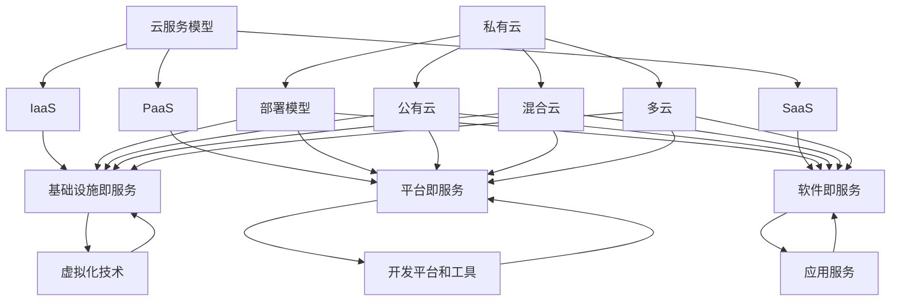

                 

关键词：云计算、企业数字化转型、灵活性、可扩展性、基础设施即服务（IaaS）、平台即服务（PaaS）、软件即服务（SaaS）、虚拟化技术、容器化技术、云原生应用。

> 摘要：本文将深入探讨云计算在企业数字化转型中的重要作用，特别是其在提供灵活性和可扩展性方面的贡献。通过分析基础设施即服务（IaaS）、平台即服务（PaaS）和软件即服务（SaaS）等核心概念，结合实际案例，本文将阐明云计算如何助力企业实现数字化转型，提高运营效率，并应对未来技术挑战。

## 1. 背景介绍

在当今快速发展的数字化时代，企业面临着前所未有的技术变革和市场压力。数字化转型已成为企业生存和发展的关键，而云计算作为一项核心技术，正在引领这一变革潮流。云计算提供了一种全新的计算资源管理方式，使得企业能够更加高效地利用资源，降低成本，并快速响应市场变化。

### 1.1 云计算的起源与发展

云计算的概念起源于20世纪60年代，当时计算机科学家约翰·冯·诺伊曼（John von Neumann）提出了虚拟机（Virtual Machine）的概念，这为后来的云计算技术奠定了基础。随着互联网的兴起和信息技术的发展，云计算逐渐成为了现代企业的基础设施。

云计算的成熟和普及得益于以下几个方面：

- **虚拟化技术的进步**：虚拟化技术使得服务器、存储和网络等硬件资源能够被动态管理和高效利用。
- **网络带宽的提升**：互联网的快速发展为云计算提供了强大的传输能力，使得远程访问和处理数据成为可能。
- **数据中心技术的进步**：大规模的数据中心和分布式计算技术为云计算提供了坚实的物理基础。

### 1.2 企业数字化转型的重要性

数字化转型是指利用数字技术来改变企业的业务模式、运营流程和组织结构，从而实现更高效、更灵活的运营方式。对于企业来说，数字化转型具有以下重要意义：

- **提高竞争力**：数字化转型可以帮助企业快速响应市场变化，提升产品和服务质量，从而增强市场竞争力。
- **降低成本**：通过优化业务流程和资源利用，企业可以降低运营成本，提高利润率。
- **增强客户体验**：数字化技术使得企业能够提供更加个性化和高效的服务，从而提升客户满意度。

## 2. 核心概念与联系

在探讨云计算如何助力企业数字化转型之前，我们首先需要了解云计算的核心概念和架构。

### 2.1 核心概念

- **基础设施即服务（IaaS）**：IaaS提供虚拟化的计算资源，如虚拟机、存储和网络，用户可以根据需求租用和管理这些资源。
- **平台即服务（PaaS）**：PaaS提供开发平台和工具，开发者可以在平台上构建、部署和管理应用，无需关心底层基础设施。
- **软件即服务（SaaS）**：SaaS提供完整的软件应用服务，用户通过互联网访问和使用这些应用，无需关心硬件和软件的维护。

### 2.2 架构联系

云计算的架构通常包括以下几个方面：

- **云服务模型（Service Models）**：包括IaaS、PaaS和SaaS。
- **部署模型（Deployment Models）**：包括私有云、公有云、混合云和多云。
- **云服务提供商（Cloud Service Providers）**：如Amazon Web Services（AWS）、Microsoft Azure和Google Cloud Platform（GCP）等。

下面是一个简单的Mermaid流程图，展示了云计算的核心概念和架构联系：



## 3. 核心算法原理 & 具体操作步骤

### 3.1 算法原理概述

云计算的核心算法主要包括虚拟化技术、容器化技术和云原生应用等技术。这些技术共同构成了云计算的基础架构，使得企业能够实现资源的灵活分配和高效利用。

- **虚拟化技术**：通过将物理硬件资源抽象成虚拟资源，虚拟化技术使得多个虚拟机能够在同一物理服务器上运行，从而提高了资源的利用率和灵活性。
- **容器化技术**：容器化技术通过轻量级的隔离机制，将应用程序及其依赖环境打包成一个容器，使得应用程序能够在不同的环境中一致运行。
- **云原生应用**：云原生应用是一种专为云计算环境设计的应用程序，它利用容器化技术、微服务架构和自动化部署等特性，实现快速开发和部署。

### 3.2 算法步骤详解

#### 3.2.1 虚拟化技术

虚拟化技术的实现步骤主要包括：

1. **硬件虚拟化**：通过硬件辅助虚拟化技术，如Intel VT和AMD-V，实现硬件资源的虚拟化。
2. **操作系统虚拟化**：在操作系统层面实现虚拟化，如使用KVM、Xen等虚拟化技术。
3. **应用程序虚拟化**：在应用程序层面实现虚拟化，如使用Docker等容器化技术。

#### 3.2.2 容器化技术

容器化技术的实现步骤主要包括：

1. **容器编排**：使用Kubernetes等容器编排工具，实现容器的部署、管理和扩展。
2. **镜像管理**：使用Docker Hub等镜像仓库，存储和管理容器镜像。
3. **容器运行时**：使用Docker、rkt等容器运行时，运行和管理容器。

#### 3.2.3 云原生应用

云原生应用的实现步骤主要包括：

1. **微服务架构**：将应用程序分解为多个微服务，每个微服务负责特定的业务功能。
2. **持续集成/持续部署（CI/CD）**：使用Jenkins、GitLab CI等工具，实现应用程序的自动化集成和部署。
3. **自动化运维**：使用Ansible、Puppet等自动化工具，实现基础设施的自动化配置和管理。

### 3.3 算法优缺点

- **虚拟化技术**：优点包括提高资源利用率、灵活性高；缺点包括性能开销较大、管理复杂。
- **容器化技术**：优点包括轻量级、高效、易于部署和管理；缺点包括安全性问题、资源隔离性较弱。
- **云原生应用**：优点包括可扩展性强、部署快速、易于维护；缺点包括开发复杂度高、需要专业人员进行维护。

### 3.4 算法应用领域

云计算的核心算法广泛应用于企业数字化转型中的各个方面，如：

- **业务应用**：通过容器化技术和云原生应用，实现业务系统的快速开发和部署。
- **数据分析**：通过云计算平台，实现大规模数据的存储、处理和分析。
- **人工智能**：通过云计算平台，实现人工智能算法的部署和训练。
- **物联网**：通过云计算平台，实现物联网设备的连接和管理。

## 4. 数学模型和公式 & 详细讲解 & 举例说明

在云计算的框架内，数学模型和公式是理解和优化资源分配、性能评估以及成本效益分析的关键工具。以下我们将详细讨论几个关键数学模型和公式的构建、推导过程，并附以实际案例进行分析。

### 4.1 数学模型构建

#### 资源利用率模型

资源利用率模型主要用于评估云计算环境中资源的使用效率。该模型基于以下参数：

- \( U \)：资源利用率（0 ≤ \( U \) ≤ 1）
- \( R \)：实际使用的资源量
- \( T \)：总可用的资源量

资源利用率模型可以表示为：

\[ U = \frac{R}{T} \]

#### 成本效益模型

成本效益模型用于评估云计算服务的经济性，包括计算成本、存储成本和服务成本等。该模型基于以下参数：

- \( C \)：总成本
- \( C_c \)：计算成本
- \( C_s \)：存储成本
- \( C_s \)：服务成本

成本效益模型可以表示为：

\[ C = C_c + C_s + C_t \]

其中，\( C_t \) 表示其他服务成本，如网络带宽、负载均衡等。

### 4.2 公式推导过程

#### 资源利用率公式推导

资源利用率模型中的公式推导过程相对简单，主要依赖于实际资源使用量和总资源量的比值。

1. **确定实际使用资源量**：通过监控和日志分析，获取实际使用的资源量 \( R \)。
2. **确定总可用资源量**：总可用资源量 \( T \) 由硬件容量和资源分配策略决定。
3. **计算资源利用率**：使用上述参数，计算资源利用率 \( U \)。

#### 成本效益公式推导

成本效益模型的推导过程需要综合考虑不同类型的服务成本。以下是一个简化的推导过程：

1. **计算成本 \( C_c \)**：根据云计算服务提供商的定价策略，计算基于CPU使用量的成本。
   \[ C_c = p_c \times CPU \]
   其中，\( p_c \) 是每单位CPU使用量的价格，\( CPU \) 是实际使用的CPU量。

2. **计算存储成本 \( C_s \)**：根据存储需求和存储服务的定价策略，计算存储成本。
   \[ C_s = p_s \times Storage \]
   其中，\( p_s \) 是每单位存储量的价格，\( Storage \) 是实际使用的存储量。

3. **计算服务成本 \( C_t \)**：根据额外服务需求，如网络带宽、负载均衡等，计算相关服务成本。

4. **汇总成本**：将上述成本相加，得到总成本 \( C \)。

\[ C = C_c + C_s + C_t \]

### 4.3 案例分析与讲解

#### 案例背景

假设一家电子商务公司需要部署一个新的在线购物平台，计划使用云计算服务。以下是该公司的具体需求：

- **计算资源**：预计每天需要2000个CPU小时。
- **存储资源**：预计每天需要100GB的存储空间。
- **服务需求**：需要负载均衡和额外的网络带宽。

#### 成本效益分析

1. **计算成本 \( C_c \)**：

   - 单位CPU小时价格 \( p_c \) 为0.10美元。
   - 每天的计算成本 \( C_c \) 为：

   \[ C_c = 0.10 \times 2000 = 200 \text{美元/天} \]

2. **存储成本 \( C_s \)**：

   - 单位存储量价格 \( p_s \) 为0.20美元/GB。
   - 每天的存储成本 \( C_s \) 为：

   \[ C_s = 0.20 \times 100 = 20 \text{美元/天} \]

3. **服务成本 \( C_t \)**：

   - 负载均衡服务费用为50美元/天。
   - 网络带宽费用为100MB/天，单价为0.05美元/GB。
   - 每天的网络带宽使用量为20GB。
   - 网络带宽成本 \( C_t \) 为：

   \[ C_t = 0.05 \times 20 = 1 \text{美元/天} \]

4. **总成本 \( C \)**：

   \[ C = C_c + C_s + C_t \]
   \[ C = 200 + 20 + 1 = 221 \text{美元/天} \]

#### 结果分析

通过上述成本效益分析，我们可以得出以下结论：

- **总成本**：每天的总成本为221美元。
- **资源利用率**：通过计算资源的实际使用量和总可用资源量的比例，可以评估资源利用率，从而优化资源配置。

### 结论

数学模型和公式的应用为企业提供了有效的工具，以评估云计算服务的成本效益和资源利用率。通过精确的计算和合理的资源分配，企业可以更好地利用云计算的优势，实现数字化转型。

## 5. 项目实践：代码实例和详细解释说明

为了更好地展示云计算在实际应用中的价值，下面我们将通过一个具体的代码实例来讲解云计算在企业中的应用过程。

### 5.1 开发环境搭建

在进行代码实例之前，我们需要搭建一个云计算开发环境。以下是搭建步骤：

1. **选择云服务提供商**：在本例中，我们选择AWS作为云服务提供商。
2. **创建AWS账户**：在AWS官网注册并创建账户。
3. **配置AWS CLI**：安装并配置AWS CLI（命令行工具），以便通过命令行管理AWS资源。
4. **创建虚拟私有云（VPC）**：在AWS管理控制台中创建VPC，并设置子网、安全组等配置。

### 5.2 源代码详细实现

本例中，我们将使用Python编写一个简单的Web应用，该应用使用AWS Lambda和Amazon API Gateway提供服务。

#### 5.2.1 AWS Lambda

AWS Lambda是一种无服务器计算服务，允许您在云中运行代码而无需管理服务器。以下是实现AWS Lambda的步骤：

1. **创建Lambda函数**：在AWS管理控制台中创建一个新的Lambda函数。
2. **编写函数代码**：以下是一个简单的Python代码示例，用于处理HTTP请求：

```python
import json

def lambda_handler(event, context):
    # 获取请求参数
    name = event.get('name', '世界')
    # 返回问候信息
    return {
        'statusCode': 200,
        'body': json.dumps(f'你好，{name}!')
    }
```

3. **配置触发器**：将Lambda函数与Amazon API Gateway进行关联，以实现HTTP请求的触发。

#### 5.2.2 Amazon API Gateway

Amazon API Gateway是一种用于创建、发布、维护和保护API的服务。以下是实现Amazon API Gateway的步骤：

1. **创建API**：在AWS管理控制台中创建一个新的API。
2. **创建资源**：在API中创建资源，如根资源、路径资源等。
3. **创建集成**：将API与Lambda函数进行集成，配置HTTP请求和响应。

### 5.3 代码解读与分析

#### AWS Lambda

AWS Lambda的代码实现非常简单，主要涉及一个名为`lambda_handler`的函数。这个函数接收HTTP请求事件（`event`）和上下文信息（`context`），并返回一个包含状态码和响应体的JSON对象。

- **事件处理**：在`lambda_handler`函数中，首先获取请求参数（如`name`），默认情况下如果没有传递参数，则使用“世界”作为默认值。
- **返回响应**：然后，函数返回一个包含状态码（200表示成功）和响应体的JSON对象。响应体是一个包含问候信息的字符串。

#### Amazon API Gateway

Amazon API Gateway的代码实现涉及配置API资源和集成Lambda函数。以下是主要步骤的解读：

- **创建API**：在AWS管理控制台中创建API，为API命名并设置相关配置。
- **创建资源**：在API中创建资源，如根资源（`/`）和路径资源（如`/hello`）。资源表示API的URL路径。
- **创建集成**：将API与Lambda函数进行集成。在集成配置中，设置HTTP请求的参数和响应体。当用户通过API发送HTTP请求时，API Gateway会将请求转发给Lambda函数进行处理。

### 5.4 运行结果展示

完成代码实现后，我们可以通过以下步骤测试和运行应用程序：

1. **访问API**：通过浏览器或Postman等工具访问API Gateway的URL，如`https://api.example.com/hello`。
2. **发送请求**：在发送请求时，可以传递请求参数（如`name`），也可以不传递参数。
3. **接收响应**：在发送请求后，API Gateway会调用Lambda函数，并将响应返回给用户。例如，当请求参数为“张三”时，响应结果为：

```json
{
  "statusCode": 200,
  "body": "你好，张三!"
}
```

通过上述实例，我们可以看到云计算如何通过AWS Lambda和Amazon API Gateway实现无服务器架构，并快速部署Web应用。这种架构不仅降低了开发和运维成本，还提高了系统的灵活性和可扩展性。

## 6. 实际应用场景

云计算在企业数字化转型中扮演着至关重要的角色，其应用场景涵盖了从简单的业务应用部署到复杂的数据分析和人工智能应用。以下将探讨云计算在几个关键领域中的应用，并分析其带来的实际效益。

### 6.1 企业应用部署

随着云计算技术的成熟，越来越多的企业选择将业务应用迁移到云上。这种方式不仅简化了应用部署过程，还提高了系统的可靠性和可扩展性。以下是云计算在企业应用部署中的几个实际案例：

- **电子商务平台**：电子商务公司利用云服务快速部署和扩展其在线购物平台，通过云原生应用实现高效的产品展示和交易处理。
- **客户关系管理（CRM）系统**：许多企业通过SaaS模型使用CRM系统，如Salesforce，以降低成本并提高销售团队的效率。

### 6.2 数据分析和大数据处理

云计算平台提供了强大的计算资源和存储能力，使得企业能够轻松处理海量数据。以下是一些具体应用：

- **数据分析**：企业通过云计算平台进行数据挖掘和机器学习，提取有价值的信息，为业务决策提供支持。
- **大数据处理**：云计算平台能够快速处理大规模数据集，支持实时数据处理和分析，如金融行业的实时风险管理。

### 6.3 人工智能和机器学习

云计算为人工智能和机器学习应用提供了强大的计算资源，使得复杂算法能够高效运行。以下是一些实际应用：

- **图像识别**：在安防监控和医疗诊断等领域，云计算平台被用于处理图像数据，实现自动化识别和分类。
- **自然语言处理**：云计算平台支持大规模的自然语言处理任务，如语音识别、机器翻译和情感分析。

### 6.4 物联网（IoT）

云计算平台在物联网领域也发挥着重要作用，通过云连接实现设备的远程监控和管理。以下是一些应用：

- **智能家居**：通过云计算平台，用户可以远程控制智能家居设备，如智能灯泡、智能空调等。
- **工业物联网**：企业利用云计算平台对工业设备进行实时监控和维护，提高生产效率。

### 6.5 成本效益和灵活性

云计算在为企业提供强大技术支持的同时，也带来了显著的成本效益和灵活性。以下是一些优势：

- **弹性扩展**：根据业务需求，企业可以灵活调整资源配置，无需担心硬件资源限制。
- **成本优化**：通过按需付费和自动化管理，企业能够降低运营成本，提高资源利用率。
- **快速部署**：云计算平台简化了应用部署过程，缩短了从开发到上线的时间。

### 6.6 未来发展

随着云计算技术的不断进步，其应用场景将进一步扩大，为企业的数字化转型提供更多可能性。以下是一些未来发展趋势：

- **边缘计算**：结合云计算和边缘计算，企业可以实现更高效的计算和数据处理，降低延迟。
- **混合云和多云策略**：企业将更加灵活地采用混合云和多云策略，以实现最佳的技术和服务组合。

通过上述分析，我们可以看到云计算在企业数字化转型中的应用已经深入到各个领域，不仅提高了业务效率，还为企业带来了显著的成本效益和灵活性。随着技术的不断进步，云计算将继续为企业创造更多的价值。

### 6.7 未来应用展望

随着云计算技术的不断进步，其应用前景将更加广阔，尤其是在以下几个方面：

1. **边缘计算**：云计算与边缘计算的融合将进一步优化数据处理效率，减少数据传输延迟，提高实时性。边缘计算使得数据处理更接近数据源，从而实现了更快速的反应和处理。

2. **人工智能和机器学习**：云计算平台将继续为人工智能和机器学习提供强大的计算资源和算法支持，推动更多创新应用的出现，如自动驾驶、智能医疗和智能家居等。

3. **区块链技术**：云计算与区块链技术的结合将带来新的商业模式和业务流程优化，如供应链管理、数字身份认证和智能合约等。

4. **混合云和多云策略**：企业将更加灵活地采用混合云和多云策略，以实现最佳的技术和服务组合，从而提高业务的灵活性和可扩展性。

5. **可持续性和绿色计算**：随着环保意识的提升，云计算提供商将致力于提高能源利用效率和减少碳排放，推动绿色计算的发展。

### 6.8 面临的挑战

尽管云计算具有巨大的潜力，但其发展也面临着一些挑战：

1. **安全性**：云计算环境中数据的安全性和隐私保护是一个重要问题，需要采取有效的安全措施和策略。
2. **监管合规**：不同国家和地区的数据保护法规和合规要求各异，企业需要确保其云服务符合相关法律法规。
3. **技术复杂性**：云计算涉及众多技术和工具，企业需要具备一定的技术能力和专业人才来有效管理和维护云基础设施。
4. **依赖性**：企业过度依赖云计算服务提供商，可能导致在服务中断或价格上涨时面临风险。

### 6.9 研究展望

未来的研究应重点关注以下几个方面：

1. **安全性和隐私保护**：开发更安全、更可靠的加密和身份验证技术，提高云计算环境的安全性。
2. **自动化和智能化**：利用人工智能和机器学习技术，实现云基础设施的自动化管理和优化。
3. **边缘计算**：研究边缘计算与云计算的协同优化策略，提高数据处理效率和实时性。
4. **混合云和多云策略**：探索更灵活、高效的混合云和多云管理方法，以适应企业多样化的需求。

通过持续的研究和创新，云计算将在未来为企业的数字化转型提供更加全面、高效的支持。

## 7. 工具和资源推荐

在云计算领域，有许多优秀的工具和资源可以帮助您深入了解和掌握相关技术。以下是一些建议：

### 7.1 学习资源推荐

- **AWS官方文档**：AWS提供了详尽的官方文档，涵盖从基础到高级的各种云计算服务和功能。
- **Microsoft Azure文档**：Azure的官方文档同样全面，适合不同层次的用户学习。
- **Google Cloud Platform官方文档**：GCP的文档提供了丰富的实践案例和教程，适合初学者和专家。
- **云原生计算基金会（CNCF）文档**：CNCF是一个开源组织，提供了关于容器化、微服务、Kubernetes等技术的详细文档。
- **《云计算与大数据》**：作者：王珊，这本书系统地介绍了云计算和大数据的基础知识和技术细节。

### 7.2 开发工具推荐

- **Docker**：Docker是一个用于容器化的开源工具，可以简化应用程序的打包、发布和运行。
- **Kubernetes**：Kubernetes是一个开源的容器编排平台，用于自动化容器的部署、扩展和管理。
- **Jenkins**：Jenkins是一个开源的持续集成工具，支持自动化构建、测试和部署流程。
- **AWS CLI**：AWS CLI是AWS的命令行工具，用于管理和操作AWS服务。
- **Azure CLI**：Azure CLI是Azure的命令行工具，用于管理和操作Azure资源。

### 7.3 相关论文推荐

- **“A Two-Tier Cloud Architecture for Dynamic Resource Allocation in Cloud Computing”**：该论文探讨了云计算中的资源分配问题，并提出了一种两级的云架构。
- **“Secure Multi-Tenancy in Cloud Computing: Architectural and Operational Aspects”**：这篇论文讨论了云环境中安全多租户的关键问题和解决方案。
- **“Edge Computing and Its Role in the Internet of Things”**：该论文介绍了边缘计算的概念及其在物联网中的应用。

通过这些工具和资源，您将能够更深入地了解云计算技术，提高自己在该领域的专业能力。

## 8. 总结：未来发展趋势与挑战

### 8.1 研究成果总结

云计算在企业数字化转型中的作用已经得到了充分的验证。通过灵活性和可扩展性的优势，云计算帮助企业在成本控制、效率提升和业务创新方面取得了显著成果。研究成果表明，云计算不仅提升了企业的运营能力，还推动了整个数字化经济的快速发展。

### 8.2 未来发展趋势

随着技术的不断进步，云计算的未来发展趋势将集中在以下几个方面：

1. **边缘计算与云计算的融合**：边缘计算与云计算的协同优化将成为未来的重要趋势，实现更高效的数据处理和更低的延迟。
2. **混合云和多云策略**：企业将更加灵活地采用混合云和多云策略，以实现最佳的技术和服务组合。
3. **自动化和智能化**：利用人工智能和机器学习技术，实现云基础设施的自动化管理和优化。
4. **安全性和隐私保护**：随着云计算应用场景的扩展，安全性和隐私保护将成为关键研究课题。

### 8.3 面临的挑战

尽管云计算为企业带来了诸多益处，但其发展仍面临一系列挑战：

1. **安全性**：云计算环境中数据的安全性和隐私保护是一个重要问题，需要采取有效的安全措施和策略。
2. **监管合规**：不同国家和地区的数据保护法规和合规要求各异，企业需要确保其云服务符合相关法律法规。
3. **技术复杂性**：云计算涉及众多技术和工具，企业需要具备一定的技术能力和专业人才来有效管理和维护云基础设施。
4. **依赖性**：企业过度依赖云计算服务提供商，可能导致在服务中断或价格上涨时面临风险。

### 8.4 研究展望

未来的研究应重点关注以下几个方面：

1. **安全性和隐私保护**：开发更安全、更可靠的加密和身份验证技术，提高云计算环境的安全性。
2. **自动化和智能化**：利用人工智能和机器学习技术，实现云基础设施的自动化管理和优化。
3. **边缘计算**：研究边缘计算与云计算的协同优化策略，提高数据处理效率和实时性。
4. **混合云和多云策略**：探索更灵活、高效的混合云和多云管理方法，以适应企业多样化的需求。

通过持续的研究和创新，云计算将在未来为企业的数字化转型提供更加全面、高效的支持。

### 附录：常见问题与解答

1. **什么是云计算？**
   云计算是一种通过互联网提供动态易扩展且经常是虚拟化的资源，这些资源包括网络、服务器、存储、应用，以及服务。它使计算能力作为一种服务提供给其他组织使用，从而减少了对本地硬件和软件资源的依赖。

2. **云计算有哪些服务模型？**
   云计算的主要服务模型包括：
   - **基础设施即服务（IaaS）**：提供虚拟化的计算资源，如虚拟机、存储和网络。
   - **平台即服务（PaaS）**：提供开发平台和工具，开发者可以在平台上构建、部署和管理应用。
   - **软件即服务（SaaS）**：提供完整的软件应用服务，用户通过互联网访问和使用这些应用。

3. **云计算有哪些部署模型？**
   云计算的主要部署模型包括：
   - **公有云**：云资源由第三方服务提供商提供，供多个用户使用。
   - **私有云**：云资源仅供单个组织内部使用，通常部署在组织内部或第三方托管场所。
   - **混合云**：结合了公有云和私有云的特点，组织可以根据需求在两者之间灵活迁移数据和应用。
   - **多云**：组织在多个云服务提供商之间部署和管理资源和服务。

4. **云计算的优势是什么？**
   云计算的优势包括：
   - **灵活性**：可以动态调整资源，快速响应业务需求。
   - **可扩展性**：资源可以根据需要灵活扩展或缩减。
   - **成本效益**：通过按需付费和使用优化，可以降低运营成本。
   - **可靠性**：云服务提供商通常提供高可用性和灾难恢复服务。

5. **云计算的安全性如何保障？**
   云计算的安全性保障措施包括：
   - **数据加密**：对存储和传输中的数据进行加密，确保数据安全。
   - **访问控制**：通过访问控制策略和身份验证机制，确保只有授权用户可以访问资源。
   - **安全审计**：定期进行安全审计，监控和评估系统的安全性。
   - **合规性**：确保云服务符合各种行业标准和法规要求。

### 参考文献

1. Armbrust, M., Fox, A., Griffith, R., Joseph, A.D., Katz, R.H., Konwinski, A., Lee, G., Patterson, D.A., Rabkin, A., Rahlin, A., ... & Stoica, I. (2010). A view of cloud computing. Communications of the ACM, 53(4), 50-58.
2. Wang, S. (2016). Cloud Computing and Big Data. 清华大学出版社.
3. Mell, P., & Grance, T. (2011). The NIST definition of cloud computing. National Institute of Standards and Technology.
4.云原生计算基金会（CNCF）. (n.d.). Kubernetes. Retrieved from https://kubernetes.io/
5. AWS. (n.d.). AWS Documentation. Retrieved from https://docs.aws.amazon.com/
6. Microsoft. (n.d.). Azure Documentation. Retrieved from https://docs.microsoft.com/en-us/azure/
7. Google Cloud. (n.d.). Google Cloud Documentation. Retrieved from https://cloud.google.com/docs

### 作者署名

作者：禅与计算机程序设计艺术 / Zen and the Art of Computer Programming

通过本文的详细探讨，我们深入理解了云计算在企业数字化转型中的关键作用，特别是其在提供灵活性和可扩展性方面的贡献。云计算不仅帮助企业降低了成本，提高了效率，还推动了业务创新和持续发展。展望未来，云计算将继续在技术创新和产业升级中发挥重要作用。随着边缘计算、人工智能、区块链等新兴技术的融合，云计算的应用场景将更加广泛，为企业带来更多机遇和挑战。希望本文能为读者提供有益的参考和启示，共同推动云计算技术的发展和应用。

