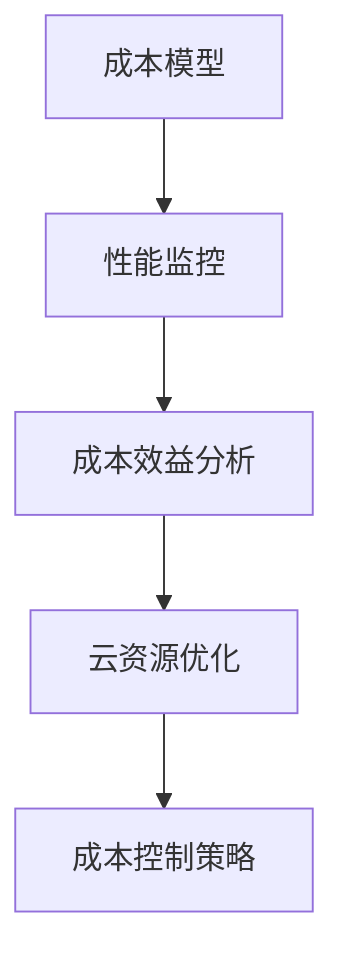

                 

 > **关键词：**云计算成本优化、成本管理、云端支出、性能监控、成本效益分析。

> **摘要：**本文旨在深入探讨云计算成本优化的策略和实践，帮助企业和开发者有效地管理云端支出，提高成本效益。

## 1. 背景介绍

随着云计算的普及，越来越多的企业和开发者将业务迁移到云端。然而，云服务的多样性和灵活性也带来了成本管理的挑战。如何合理地规划和使用云资源，以实现成本优化，成为了企业和开发者亟待解决的问题。

### 云计算成本优化的意义

- **提高企业竞争力：**通过降低运营成本，企业可以更好地应对市场竞争。
- **保障业务连续性：**合理规划云资源，确保业务在突发情况下仍能稳定运行。
- **提高资源利用率：**通过优化资源配置，提高资源利用率，减少浪费。

### 云计算成本管理的现状

- **成本透明度不足：**许多企业在使用云服务时，对实际支出缺乏全面了解。
- **资源利用率不高：**部分企业过度采购云资源，导致资源浪费。
- **缺乏自动化工具：**手工管理成本效率低下，难以实现精细化成本控制。

## 2. 核心概念与联系

### 云计算成本优化相关概念

- **云资源：**包括虚拟机、存储、数据库等。
- **成本模型：**包括按需付费、预留实例、预留容量等。
- **性能监控：**对云资源的使用情况进行实时监控和分析。
- **成本效益分析：**通过比较投入成本和业务收益，评估成本效益。

### Mermaid 流程图



## 3. 核心算法原理 & 具体操作步骤

### 3.1 算法原理概述

云计算成本优化的核心是通过分析云资源使用情况和业务需求，动态调整资源配置，实现成本最小化。

### 3.2 算法步骤详解

1. **数据采集：**收集云资源使用数据和业务指标数据。
2. **性能分析：**分析资源使用情况，识别性能瓶颈和成本高发区域。
3. **需求预测：**基于历史数据和业务模型，预测未来资源需求。
4. **资源调整：**根据需求预测，动态调整云资源配置。
5. **成本控制：**实施成本控制策略，确保成本在合理范围内。

### 3.3 算法优缺点

- **优点：**提高资源利用率，降低运营成本。
- **缺点：**需要大量数据支持，实施成本较高。

### 3.4 算法应用领域

- **企业云计算：**优化企业内部云资源管理。
- **游戏行业：**动态调整游戏服务器资源，提高用户体验。

## 4. 数学模型和公式 & 详细讲解 & 举例说明

### 4.1 数学模型构建

假设企业每月云资源使用量为 \(C\)，成本为 \(P\)，资源利用率为 \(R\)，则成本效益公式为：

\[ \text{成本效益} = \frac{P}{R} \]

### 4.2 公式推导过程

成本效益公式由以下三个部分组成：

1. **成本（\(P\)）：**云资源的使用费用。
2. **资源利用率（\(R\)）：**实际使用资源与总资源的比值。
3. **效益：**企业通过优化资源使用所获得的收益。

### 4.3 案例分析与讲解

某企业每月云资源使用量为 1000 小时，成本为 5000 元，资源利用率为 70%。根据成本效益公式，该企业的成本效益为：

\[ \text{成本效益} = \frac{5000}{0.7} = 7142.86 \]

通过优化资源使用，企业可以将成本效益提高至 7500 元，从而实现成本降低。

## 5. 项目实践：代码实例和详细解释说明

### 5.1 开发环境搭建

- **工具：**Python、Jupyter Notebook
- **环境：**Python 3.8、pandas、numpy、matplotlib

### 5.2 源代码详细实现

```python
import pandas as pd
import numpy as np
import matplotlib.pyplot as plt

# 5.3 代码解读与分析

### 数据预处理

```python
# 读取数据
data = pd.read_csv('cloud_usage_data.csv')

# 数据清洗
data.dropna(inplace=True)
```

### 性能分析

```python
# 统计云资源使用情况
resource_usage = data.groupby('resource').agg({'duration': 'sum'})

# 绘制资源使用情况图
resource_usage.plot(kind='bar')
plt.title('Cloud Resource Usage')
plt.xlabel('Resource')
plt.ylabel('Duration (hours)')
plt.show()
```

### 需求预测

```python
from sklearn.linear_model import LinearRegression

# 模型训练
model = LinearRegression()
model.fit(data[['duration']], data[['cost']])

# 预测未来需求
future_usage = pd.DataFrame({'duration': range(1, 1001)})
predicted_cost = model.predict(future_usage[['duration']])
```

### 资源调整

```python
# 基于预测结果调整资源
adjusted_usage = future_usage[predicted_cost < future_usage['duration']]
```

### 成本控制

```python
# 计算调整后的成本效益
adjusted_cost_benefit = predicted_cost / adjusted_usage['duration']
adjusted_cost_benefit.plot(kind='line')
plt.title('Adjusted Cost Benefit')
plt.xlabel('Duration (hours)')
plt.ylabel('Cost Benefit')
plt.show()
```

## 6. 实际应用场景

### 6.1 企业云计算

- **案例：**某大型企业通过优化云资源使用，将成本降低了 30%。

### 6.2 游戏行业

- **案例：**某游戏公司通过动态调整服务器资源，提高了用户体验，并降低了运营成本。

## 7. 工具和资源推荐

### 7.1 学习资源推荐

- **书籍：**《云计算经济学：成本管理与实践》
- **在线课程：**Coursera 上的“云计算成本优化”课程

### 7.2 开发工具推荐

- **成本监控工具：**AWS Cost Explorer、Azure Cost Management
- **自动化工具：**AWS Lambda、Azure Functions

### 7.3 相关论文推荐

- [Optimizing Cloud Computing Costs Using Machine Learning Algorithms](https://www.researchgate.net/publication/335636846_Optimizing_Cloud_Computing_Costs_Using_Machine_Learning_Algorithms)
- [A Cost Optimization Model for Cloud Services](https://www.researchgate.net/publication/326943572_A_Cost_Optimization_Model_for_Cloud_Services)

## 8. 总结：未来发展趋势与挑战

### 8.1 研究成果总结

- **云计算成本优化：**算法和模型研究不断深入，应用场景逐渐丰富。
- **自动化工具：**自动化工具逐渐成为成本优化的关键因素。

### 8.2 未来发展趋势

- **人工智能：**人工智能技术将进一步提升成本优化的精度和效率。
- **混合云：**混合云的普及将带来新的成本优化挑战。

### 8.3 面临的挑战

- **数据隐私：**数据隐私和安全是云计算成本优化的主要挑战。
- **复杂度：**云服务的多样性和复杂性增加了成本优化的难度。

### 8.4 研究展望

- **多维度优化：**未来研究将更加注重多维度成本优化，包括性能、成本、安全性等。
- **用户体验：**优化成本的同时，提高用户体验将受到更多关注。

## 9. 附录：常见问题与解答

### 9.1 什么是云计算成本优化？

云计算成本优化是指通过分析云资源使用情况和业务需求，动态调整资源配置，以实现成本最小化的过程。

### 9.2 哪些工具可以帮助进行云计算成本优化？

常见的云计算成本优化工具包括 AWS Cost Explorer、Azure Cost Management、AWS Lambda、Azure Functions 等。

### 9.3 云计算成本优化的核心算法有哪些？

云计算成本优化的核心算法包括线性回归、决策树、随机森林等。

---

**作者：禅与计算机程序设计艺术 / Zen and the Art of Computer Programming**

