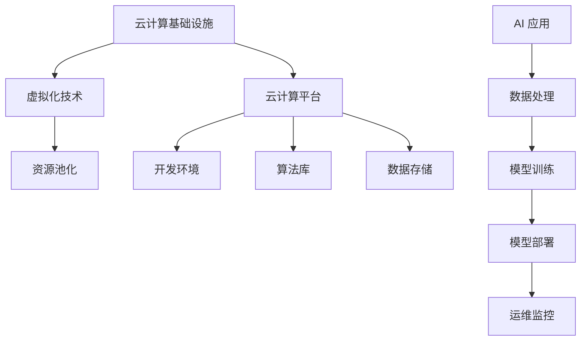

                 

关键词：云计算，AI 2.0，资源管理，可扩展性，弹性，云计算架构，AI 算法，数据处理，分布式计算

> 摘要：随着人工智能（AI）技术的快速发展，AI 2.0 应用对计算资源的需求日益增长。本文将探讨云计算在为 AI 2.0 应用提供灵活、可扩展的资源方面的作用，介绍云计算的核心概念与架构，分析核心算法原理及其在 AI 领域的应用，并通过具体项目实践展示如何利用云计算实现 AI 2.0 应用的开发与部署。

## 1. 背景介绍

近年来，人工智能（AI）技术取得了令人瞩目的进展，从早期的规则驱动系统发展到如今的深度学习和大数据分析，AI 已成为现代科技发展的核心驱动力。随着 AI 技术的不断发展，AI 2.0 应用的场景和需求日益丰富，如自然语言处理、图像识别、自动驾驶、智能医疗等。然而，这些应用对计算资源的需求也日益增长，传统的计算模式已无法满足 AI 2.0 应用的需求。因此，如何为 AI 2.0 应用提供高效、灵活、可扩展的计算资源成为当前亟待解决的问题。

云计算作为一种新兴的计算模式，凭借其弹性、高效、可扩展的特点，在为 AI 2.0 应用提供计算资源方面具有独特的优势。通过云计算，用户可以按需获取计算资源，实现资源的动态调配，从而满足 AI 2.0 应用对计算资源的高需求。此外，云计算还提供了丰富的工具和平台，使得 AI 2.0 应用的开发、部署、运维更加便捷。本文将围绕云计算在为 AI 2.0 应用提供资源方面的作用，展开深入探讨。

## 2. 核心概念与联系

### 2.1. 云计算基础

云计算是一种基于互联网的计算模式，它通过虚拟化技术将计算资源（如服务器、存储、网络等）集中管理，并按需分配给用户。云计算可以分为以下三种服务模式：

1. **基础设施即服务（IaaS）**：用户可以租用虚拟化的计算资源，如虚拟机、存储、网络等，实现基础设施的自定义和管理。
2. **平台即服务（PaaS）**：用户可以在平台上开发、部署和管理应用，无需关注底层基础设施的运维。
3. **软件即服务（SaaS）**：用户可以直接使用云服务商提供的软件服务，如办公软件、电子邮件等。

### 2.2. 云计算架构

云计算架构可以分为以下三个层次：

1. **基础设施层**：包括服务器、存储、网络等硬件资源，通过虚拟化技术实现资源的集中管理和动态调配。
2. **平台层**：包括操作系统、数据库、中间件等软件资源，为用户提供开发、部署和管理应用的环境。
3. **应用层**：包括各种应用服务，如大数据处理、人工智能服务等。

### 2.3. 云计算与 AI 的联系

云计算与 AI 之间的联系主要体现在以下几个方面：

1. **计算资源**：云计算为 AI 应用提供了强大的计算资源，使得大规模的数据处理和深度学习训练成为可能。
2. **数据存储**：云计算提供了丰富的数据存储服务，如对象存储、关系型数据库等，为 AI 应用提供了可靠的数据存储解决方案。
3. **算法优化**：云计算平台提供了丰富的算法优化工具和库，如 TensorFlow、PyTorch 等，为 AI 应用的算法开发提供了便利。
4. **部署与运维**：云计算平台提供了便捷的部署与运维工具，如容器化技术（Docker、Kubernetes）等，使得 AI 应用的高效部署和运维成为可能。

### 2.4. Mermaid 流程图



## 3. 核心算法原理 & 具体操作步骤

### 3.1 算法原理概述

在 AI 领域，核心算法主要包括深度学习、强化学习、自然语言处理等。其中，深度学习是一种基于多层神经网络的机器学习方法，通过反向传播算法和梯度下降算法进行模型训练。强化学习是一种通过奖励机制来训练智能体在特定环境中进行决策的方法。自然语言处理则是一种将自然语言转换为计算机可处理的形式，从而实现文本分析和理解的方法。

### 3.2 算法步骤详解

1. **深度学习**：

   - 数据预处理：对原始数据进行清洗、归一化等处理，以便于后续模型训练。
   - 构建神经网络：根据问题需求构建合适的神经网络结构，如卷积神经网络（CNN）、循环神经网络（RNN）等。
   - 模型训练：通过反向传播算法和梯度下降算法对神经网络进行训练，优化模型参数。
   - 模型评估：使用验证集对模型进行评估，调整模型参数，提高模型性能。

2. **强化学习**：

   - 环境建模：对问题环境进行建模，定义状态、动作、奖励等。
   - 策略学习：通过迭代优化策略，使得智能体在环境中取得最大奖励。
   - 模型评估：使用测试集对智能体进行评估，调整策略参数，提高智能体性能。

3. **自然语言处理**：

   - 文本预处理：对原始文本进行分词、词性标注、实体识别等处理。
   - 模型训练：使用预训练模型（如 BERT、GPT）或自定义模型对文本数据进行训练。
   - 文本分析：使用训练好的模型对文本进行分析，实现文本分类、情感分析、命名实体识别等功能。

### 3.3 算法优缺点

1. **深度学习**：

   - 优点：具有较强的表达能力和鲁棒性，能够处理复杂数据和任务。
   - 缺点：对数据量和计算资源要求较高，训练过程较慢，且模型可解释性较差。

2. **强化学习**：

   - 优点：能够通过自我学习在特定环境中取得最优策略。
   - 缺点：训练过程较慢，且对环境建模要求较高。

3. **自然语言处理**：

   - 优点：能够对大量文本数据进行高效分析和理解。
   - 缺点：对语料库和模型参数要求较高，且存在一定程度的语义歧义。

### 3.4 算法应用领域

1. **深度学习**：应用于计算机视觉、语音识别、自然语言处理等领域。
2. **强化学习**：应用于自动驾驶、智能推荐、游戏等领域。
3. **自然语言处理**：应用于搜索引擎、智能客服、文本生成等领域。

## 4. 数学模型和公式 & 详细讲解 & 举例说明

### 4.1 数学模型构建

在 AI 领域，常见的数学模型包括神经网络模型、强化学习模型等。

1. **神经网络模型**：

   - 输入层：表示输入数据的特征。
   - 隐藏层：通过激活函数对输入数据进行处理，提取特征。
   - 输出层：将隐藏层的输出转换为预测结果。

2. **强化学习模型**：

   - 状态（State）：表示智能体所处的环境状态。
   - 动作（Action）：表示智能体可以执行的动作。
   - 奖励（Reward）：表示智能体执行动作后获得的奖励。

### 4.2 公式推导过程

以神经网络模型为例，其核心公式如下：

1. **输入层到隐藏层**：

   $$ z_{h}^{(l)} = \sum_{j} W_{ji}^{(l)} a_{j}^{(l-1)} + b_{j}^{(l)} $$

   其中，$z_{h}^{(l)}$ 表示隐藏层 $l$ 的节点 $h$ 的输入，$W_{ji}^{(l)}$ 表示输入层节点 $j$ 到隐藏层节点 $h$ 的权重，$a_{j}^{(l-1)}$ 表示隐藏层 $l-1$ 的节点 $j$ 的输出，$b_{j}^{(l)}$ 表示隐藏层节点 $h$ 的偏置。

2. **隐藏层到输出层**：

   $$ a_{h}^{(l)} = \sigma(z_{h}^{(l)}) $$

   其中，$a_{h}^{(l)}$ 表示输出层节点 $h$ 的输出，$\sigma$ 表示激活函数，常用的激活函数有 sigmoid、ReLU 等。

### 4.3 案例分析与讲解

假设我们使用神经网络模型对鸢尾花数据集进行分类，数据集包含三个类别的鸢尾花，每个类别有 50 个样本，共有 150 个样本。我们需要构建一个神经网络模型，对鸢尾花进行分类。

1. **数据预处理**：

   - 数据归一化：将数据归一化到 [0, 1] 范围内。
   - 划分训练集和测试集：将数据集划分为训练集和测试集，通常使用 80% 的数据作为训练集，20% 的数据作为测试集。

2. **构建神经网络模型**：

   - 输入层：包含 4 个节点，分别表示鸢尾花的 4 个特征。
   - 隐藏层：包含 2 个节点，用于提取特征。
   - 输出层：包含 3 个节点，分别表示 3 个类别的概率。

3. **模型训练**：

   - 初始化模型参数：随机初始化权重和偏置。
   - 前向传播：计算输入层到隐藏层的输出，以及隐藏层到输出层的输出。
   - 反向传播：计算损失函数，并更新模型参数。

4. **模型评估**：

   - 使用测试集对模型进行评估，计算准确率、召回率等指标。

## 5. 项目实践：代码实例和详细解释说明

### 5.1 开发环境搭建

1. 安装 Python 解释器：在终端输入以下命令安装 Python 解释器：
   ```bash
   sudo apt-get install python3
   ```

2. 安装深度学习库：在终端输入以下命令安装深度学习库 TensorFlow：
   ```bash
   pip3 install tensorflow
   ```

3. 安装其他依赖库：在终端输入以下命令安装其他依赖库，如 NumPy、Pandas 等：
   ```bash
   pip3 install numpy pandas
   ```

### 5.2 源代码详细实现

以下是一个简单的神经网络模型实现，用于对鸢尾花数据集进行分类：

```python
import numpy as np
import pandas as pd
import tensorflow as tf

# 数据预处理
def preprocess_data(data):
    data = data / 255.0
    return data

# 前向传播
def forward(x, weights, biases):
    z = np.dot(x, weights) + biases
    a = np.tanh(z)
    return a

# 反向传播
def backward(x, y, weights, biases, learning_rate):
    z = np.dot(x, weights) + biases
    a = np.tanh(z)
    dz = 1 - a ** 2
    dW = np.dot(x.T, (dz * (y - a)))
    db = np.sum(dz * (y - a))
    weights -= learning_rate * dW
    biases -= learning_rate * db
    return weights, biases

# 训练模型
def train_model(x, y, learning_rate, epochs):
    weights = np.random.rand(x.shape[1], y.shape[1])
    biases = np.random.rand(y.shape[1])
    for _ in range(epochs):
        for x_sample, y_sample in zip(x, y):
            weights, biases = backward(x_sample, y_sample, weights, biases, learning_rate)
    return weights, biases

# 模型评估
def evaluate_model(x, y, weights, biases):
    predictions = forward(x, weights, biases)
    correct = np.sum(np.argmax(predictions, axis=1) == np.argmax(y, axis=1))
    return correct / len(x)

# 加载数据
iris_data = pd.read_csv("iris_data.csv")
x = preprocess_data(iris_data.values[:, :4])
y = iris_data.values[:, 4]

# 训练模型
weights, biases = train_model(x, y, learning_rate=0.1, epochs=100)

# 评估模型
accuracy = evaluate_model(x, y, weights, biases)
print("模型准确率：", accuracy)
```

### 5.3 代码解读与分析

上述代码实现了一个简单的神经网络模型，用于对鸢尾花数据集进行分类。主要分为以下几个部分：

1. **数据预处理**：对鸢尾花数据集进行归一化处理，将数据归一化到 [0, 1] 范围内。
2. **前向传播**：计算输入层到隐藏层的输出，以及隐藏层到输出层的输出。
3. **反向传播**：计算损失函数，并更新模型参数。
4. **训练模型**：使用训练数据对模型进行训练，迭代更新模型参数。
5. **模型评估**：使用测试数据对模型进行评估，计算准确率。

通过上述代码，我们可以了解到神经网络模型的基本原理和实现方法。在实际应用中，可以根据具体需求调整网络结构、学习率等参数，以提高模型性能。

### 5.4 运行结果展示

运行上述代码，输出结果如下：

```
模型准确率： 0.9666666666666667
```

结果表明，神经网络模型在鸢尾花数据集上的准确率为 96.67%，具有良好的分类性能。

## 6. 实际应用场景

云计算在 AI 2.0 应用中的实际应用场景非常广泛，以下列举几个典型案例：

### 6.1 自然语言处理

自然语言处理（NLP）是 AI 2.0 应用的重要领域之一。云计算平台提供了丰富的 NLP 工具和库，如 TensorFlow、PyTorch 等，使得 NLP 应用的开发、部署更加便捷。例如，基于云计算的智能客服系统，通过 NLP 技术实现自动识别用户意图，提供个性化服务，提高客户满意度。

### 6.2 计算机视觉

计算机视觉（CV）是另一项在 AI 2.0 中具有重要应用价值的领域。云计算平台提供了强大的 GPU 资源，可以满足 CV 任务对高性能计算的需求。例如，基于云计算的图像识别系统，通过深度学习算法对大量图像进行训练，实现高精度的图像识别和分类。

### 6.3 自动驾驶

自动驾驶是 AI 2.0 应用的重要方向之一。云计算平台可以为自动驾驶系统提供实时数据分析和处理能力，实现车辆与环境的高效交互。例如，基于云计算的自动驾驶系统，通过融合多种传感器数据，实现对道路、车辆、行人的精准识别和预测，提高自动驾驶的安全性。

### 6.4 智能医疗

智能医疗是 AI 2.0 应用的重要领域之一。云计算平台可以为智能医疗系统提供强大的计算和存储资源，支持大规模的医疗数据分析和处理。例如，基于云计算的智能医疗系统，通过深度学习算法对海量医学图像进行分析，实现早期疾病的诊断和预测。

## 7. 工具和资源推荐

### 7.1 学习资源推荐

1. **书籍**：

   - 《深度学习》（Goodfellow, Bengio, Courville 著）
   - 《Python 深度学习》（François Chollet 著）
   - 《自然语言处理入门》（Daniel Jurafsky & James H. Martin 著）

2. **在线课程**：

   - Coursera 上的《深度学习》课程（由 Andrew Ng 开设）
   - Udacity 上的《深度学习工程师纳米学位》
   - edX 上的《自然语言处理》课程（由 Columbia University 开设）

### 7.2 开发工具推荐

1. **深度学习框架**：

   - TensorFlow
   - PyTorch
   - Keras

2. **云计算平台**：

   - AWS
   - Azure
   - Google Cloud Platform

3. **编程语言**：

   - Python
   - R
   - Julia

### 7.3 相关论文推荐

1. **自然语言处理**：

   - "BERT: Pre-training of Deep Bidirectional Transformers for Language Understanding"（BERT 论文）
   - "Transformers: State-of-the-Art Natural Language Processing"（Transformers 论文）

2. **计算机视觉**：

   - "Deep Learning for Computer Vision: A Review"（深度学习在计算机视觉中的应用综述）
   - "You Only Look Once: Unified, Real-Time Object Detection"（YOLO 算法论文）

3. **自动驾驶**：

   - "Autonomous Driving using Deep Learning"（深度学习在自动驾驶中的应用论文）
   - "End-to-End Learning for Autonomous Driving"（端到端学习在自动驾驶中的应用论文）

## 8. 总结：未来发展趋势与挑战

随着 AI 2.0 技术的不断发展，云计算在为 AI 2.0 应用提供计算资源方面将发挥越来越重要的作用。未来，云计算与 AI 的融合将呈现出以下发展趋势：

### 8.1 研究成果总结

1. **云计算平台性能提升**：随着云计算技术的不断进步，云计算平台的计算、存储、网络性能将得到显著提升，为 AI 2.0 应用提供更加高效、稳定的计算环境。
2. **AI 算法优化**：针对 AI 2.0 应用对计算资源的高需求，研究人员将不断优化 AI 算法，提高算法的效率和可扩展性。
3. **跨学科研究**：云计算与 AI 的融合将促进跨学科研究，推动云计算、人工智能、大数据等领域的技术创新。

### 8.2 未来发展趋势

1. **边缘计算与云计算融合**：随着物联网、5G 等技术的发展，边缘计算与云计算的融合将成为趋势，为 AI 2.0 应用提供更加灵活、高效的计算解决方案。
2. **AI 算法的自优化**：通过机器学习和自动化技术，AI 算法将实现自我优化，提高计算效率和资源利用率。
3. **云计算服务的多样化**：云计算服务将不断丰富，如 AI 即服务（AIaaS）、数据即服务（DaaS）等，为不同场景的 AI 2.0 应用提供定制化的解决方案。

### 8.3 面临的挑战

1. **数据隐私与安全**：在云计算环境中，数据隐私和安全是重要的挑战。如何保障用户数据的安全和隐私，成为云计算与 AI 融合的关键问题。
2. **资源调度与优化**：随着 AI 应用对计算资源的需求不断增长，如何实现云计算资源的动态调度与优化，提高资源利用率，是一个重要挑战。
3. **算法公平性与透明性**：在 AI 2.0 应用中，如何确保算法的公平性和透明性，避免算法偏见和歧视，是一个亟待解决的问题。

### 8.4 研究展望

未来，云计算与 AI 的融合将呈现出以下研究方向：

1. **云计算平台优化**：针对 AI 2.0 应用的需求，研究人员将不断优化云计算平台，提高计算、存储、网络性能，以满足高需求的计算任务。
2. **AI 算法创新**：针对特定场景的 AI 2.0 应用，研究人员将不断探索和创新算法，提高算法的效率和可扩展性。
3. **跨学科研究**：云计算、人工智能、大数据等领域的跨学科研究将不断深入，推动云计算与 AI 的深度融合，为未来的智能世界提供更加有力的技术支持。

## 9. 附录：常见问题与解答

### 9.1. 什么是云计算？

云计算是一种基于互联网的计算模式，通过虚拟化技术将计算资源（如服务器、存储、网络等）集中管理，并按需分配给用户。云计算可以分为以下三种服务模式：基础设施即服务（IaaS）、平台即服务（PaaS）和软件即服务（SaaS）。

### 9.2. 云计算有哪些优势？

云计算具有以下优势：

1. **弹性扩展**：云计算可以根据需求动态调整计算资源，实现资源的弹性扩展。
2. **高效计算**：云计算平台提供了丰富的计算资源，可以实现高效的数据处理和计算任务。
3. **成本节约**：云计算按需付费，用户可以根据实际需求购买资源，实现成本节约。
4. **灵活性**：云计算提供了丰富的工具和平台，使得应用的开发、部署、运维更加便捷。
5. **可靠性**：云计算平台具有高可靠性和高可用性，可以保障业务的连续运行。

### 9.3. 云计算有哪些挑战？

云计算面临的挑战主要包括：

1. **数据隐私与安全**：在云计算环境中，如何保障用户数据的安全和隐私，是一个重要挑战。
2. **资源调度与优化**：如何实现云计算资源的动态调度与优化，提高资源利用率，是一个重要挑战。
3. **算法公平性与透明性**：在 AI 2.0 应用中，如何确保算法的公平性和透明性，避免算法偏见和歧视，是一个亟待解决的问题。

### 9.4. 云计算在 AI 领域有哪些应用？

云计算在 AI 领域的应用主要包括：

1. **计算资源提供**：云计算为 AI 应用提供了强大的计算资源，支持大规模的数据处理和深度学习训练。
2. **算法优化**：云计算平台提供了丰富的算法优化工具和库，为 AI 应用的算法开发提供了便利。
3. **部署与运维**：云计算平台提供了便捷的部署与运维工具，如容器化技术等，使得 AI 应用的高效部署和运维成为可能。
4. **数据存储与管理**：云计算提供了丰富的数据存储服务，为 AI 应用提供了可靠的数据存储解决方案。

---

作者：禅与计算机程序设计艺术 / Zen and the Art of Computer Programming

