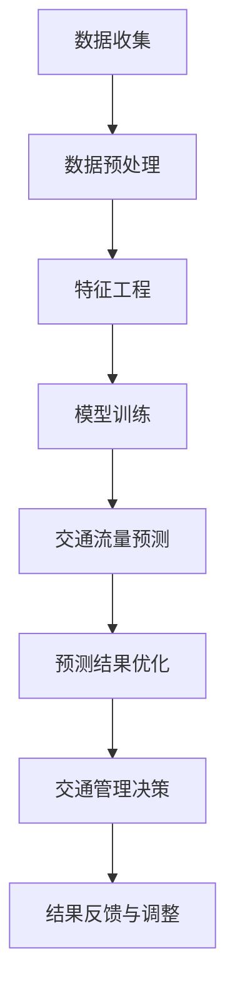

                 

### 背景介绍

随着城市化进程的加速和机动车数量的迅猛增长，交通问题已经成为全球范围内普遍存在的难题。特别是在高峰时段，交通拥堵现象愈发严重，这不仅影响了市民的出行效率，还对环境和经济造成了负面影响。为了缓解交通压力，提高交通流量效率，许多城市已经开始尝试利用人工智能技术进行交通流量预测和优化。

交通流量预测与优化系统是一种基于大数据和机器学习算法的智能交通管理解决方案。它能够通过对历史交通数据、实时交通信息以及其他相关因素（如天气、节假日等）的分析，预测未来的交通流量，并提供最优的路线规划建议和信号灯控制策略，从而有效缓解交通拥堵，提升交通运行效率。

交通流量AI预测与优化系统的意义在于：

1. **提升出行效率**：通过预测交通流量，提前告知驾驶员可能的拥堵情况，帮助他们选择最优出行路线，减少等待时间。
2. **优化资源配置**：根据交通流量预测结果，城市管理者可以合理分配交通资源，如调整信号灯时长、加强交通警力等，提高整体交通运行效率。
3. **减少交通事故**：通过实时监控和分析交通流量，可以及时发现潜在的危险区域，提前采取措施，预防交通事故的发生。
4. **环境保护**：减少交通拥堵意味着减少车辆排放，有助于改善空气质量，保护环境。

本文将深入探讨交通流量AI预测与优化系统的核心技术原理、实施步骤、数学模型，并通过实际项目实践展示其应用效果。本文结构如下：

1. **核心概念与联系**：介绍交通流量预测与优化系统的核心概念和原理，并利用Mermaid流程图展示系统架构。
2. **核心算法原理 & 具体操作步骤**：详细解释交通流量预测算法的基本原理和操作步骤。
3. **数学模型和公式 & 详细讲解 & 举例说明**：阐述交通流量预测中的数学模型，并给出详细的公式解释和实例说明。
4. **项目实践：代码实例和详细解释说明**：通过实际代码实例，展示交通流量预测与优化系统的实现过程。
5. **实际应用场景**：分析系统在实际交通管理中的应用案例。
6. **工具和资源推荐**：推荐学习资源和开发工具。
7. **总结：未来发展趋势与挑战**：总结系统的发展趋势和面临的挑战。
8. **附录：常见问题与解答**：回答读者可能关心的问题。
9. **扩展阅读 & 参考资料**：提供进一步学习的资料。

接下来，我们将逐步深入探讨这些内容。

### 核心概念与联系

交通流量AI预测与优化系统的核心在于利用大数据和机器学习技术，对交通流量进行预测和优化。以下是该系统的核心概念和原理，以及其架构的Mermaid流程图展示。

#### 核心概念

1. **交通流量数据**：这是系统的基础，包括历史交通流量数据、实时交通数据以及交通相关事件数据（如事故、维修等）。
2. **特征工程**：通过处理和转换原始数据，提取对交通流量预测有用的特征。
3. **预测模型**：利用机器学习算法，如线性回归、决策树、随机森林、神经网络等，对交通流量进行预测。
4. **优化算法**：基于预测结果，通过优化算法（如遗传算法、粒子群优化等）制定交通信号控制策略和路线规划建议。

#### Mermaid流程图

以下是一个简化的Mermaid流程图，展示交通流量AI预测与优化系统的主要流程：



#### 核心原理

1. **数据收集**：系统通过多种渠道收集交通数据，包括交通摄像头、GPS、传感器等。
2. **数据预处理**：对收集到的数据进行清洗、归一化和数据增强，以提高数据质量。
3. **特征工程**：通过分析数据，提取对交通流量预测有帮助的特征，如时间、天气、节假日等。
4. **模型训练**：使用机器学习算法对特征进行训练，建立交通流量预测模型。
5. **交通流量预测**：将训练好的模型应用于新数据，预测未来的交通流量。
6. **预测结果优化**：根据预测结果，通过优化算法调整交通信号灯控制策略和路线规划。
7. **交通管理决策**：将优化后的结果应用于实际交通管理，如调整信号灯时长、发布交通信息等。
8. **结果反馈与调整**：根据实际交通情况，不断调整和优化系统参数，提高预测准确性。

通过这个流程，交通流量AI预测与优化系统能够实现自动化、智能化的交通管理，有效缓解交通拥堵问题。

### 核心算法原理 & 具体操作步骤

在交通流量AI预测与优化系统中，核心算法的选择和实现至关重要。下面我们将详细讨论常用的机器学习算法，并解释如何在实际操作中应用这些算法进行交通流量预测。

#### 常用机器学习算法

1. **线性回归**：线性回归是一种简单的机器学习算法，用于预测一个连续值。其基本原理是找到一条最佳拟合直线，该直线能够最小化预测值与实际值之间的误差。线性回归适用于数据量较小且特征较为简单的情况。

2. **决策树**：决策树通过一系列规则对数据进行分割，每个节点代表一个特征，每个分支代表该特征的取值。决策树易于理解和实现，但可能产生过拟合。

3. **随机森林**：随机森林是基于决策树的集成学习方法，通过构建多个决策树并取平均值来减少过拟合。随机森林在处理大规模数据和特征组合时表现良好。

4. **神经网络**：神经网络是一种基于人脑神经元连接方式的计算模型，能够通过多层非线性变换进行复杂函数拟合。神经网络在处理高维数据和非线性关系时具有显著优势。

5. **支持向量机（SVM）**：SVM通过找到最佳超平面来分类数据。虽然SVM主要用于分类任务，但通过适当的变换，它也可以应用于回归任务。

6. **时间序列模型**：如ARIMA（自回归积分滑动平均模型）和LSTM（长短时记忆网络），这些模型专门用于处理时间序列数据，能够捕捉时间依赖关系。

#### 算法选择依据

选择合适的机器学习算法需要考虑以下几个因素：

1. **数据特性**：如果数据量较小且特征较少，线性回归和决策树可能是更好的选择。对于大规模和高维数据，神经网络和随机森林更为适用。

2. **时间依赖性**：如果交通流量数据具有明显的时间依赖性，时间序列模型如LSTM将能够更好地捕捉这种关系。

3. **预测准确性**：在保证模型可解释性的前提下，选择预测准确性较高的算法。

4. **计算资源**：不同算法的计算复杂度不同，选择适合计算资源的算法可以更好地平衡性能和资源消耗。

#### 具体操作步骤

以下是一个简化的操作步骤，用于交通流量预测：

1. **数据收集**：从交通摄像头、GPS、传感器等渠道收集交通流量数据。

2. **数据预处理**：
   - 数据清洗：去除无效数据、处理缺失值、异常值。
   - 数据归一化：将不同量级的特征统一缩放到同一范围内。
   - 数据增强：通过数据扩充、特征工程等方法提高数据质量。

3. **特征选择**：
   - 选择对交通流量预测影响较大的特征，如时间、天气、道路状况等。
   - 使用特征选择算法（如信息增益、卡方检验）优化特征集。

4. **模型训练**：
   - 根据数据特性和预测任务选择合适的算法，如随机森林、神经网络等。
   - 使用训练数据集进行模型训练，调整模型参数以优化性能。

5. **模型评估**：
   - 使用验证数据集对模型进行评估，选择性能最佳的模型。
   - 使用交叉验证等技术评估模型的泛化能力。

6. **预测**：
   - 使用训练好的模型对新数据进行预测。
   - 根据预测结果，生成交通流量预测报告。

7. **结果优化**：
   - 根据实际交通情况，调整模型参数和优化策略。
   - 不断迭代，提高预测准确性和系统性能。

#### 代码示例

以下是一个使用Python和scikit-learn库进行交通流量预测的简单示例：

```python
# 导入必要的库
import numpy as np
import pandas as pd
from sklearn.model_selection import train_test_split
from sklearn.ensemble import RandomForestRegressor
from sklearn.metrics import mean_squared_error

# 加载数据
data = pd.read_csv('traffic_data.csv')

# 数据预处理
X = data[['time_of_day', 'weather', 'road_condition']]
y = data['traffic_volume']

# 特征工程
X = (X - X.min()) / (X.max() - X.min())

# 分割数据集
X_train, X_test, y_train, y_test = train_test_split(X, y, test_size=0.2, random_state=42)

# 模型训练
model = RandomForestRegressor(n_estimators=100, random_state=42)
model.fit(X_train, y_train)

# 预测
y_pred = model.predict(X_test)

# 模型评估
mse = mean_squared_error(y_test, y_pred)
print(f'Mean Squared Error: {mse}')

# 使用模型进行实际预测
new_data = pd.DataFrame([[0.5, 0.2, 0.3]], columns=['time_of_day', 'weather', 'road_condition'])
new_data = (new_data - new_data.min()) / (new_data.max() - new_data.min())
predicted_volume = model.predict(new_data)
print(f'Predicted Traffic Volume: {predicted_volume[0]}')
```

通过以上步骤，我们可以构建一个简单的交通流量预测系统，并根据实际需求进行调整和优化。

### 数学模型和公式 & 详细讲解 & 举例说明

在交通流量AI预测与优化系统中，数学模型和公式扮演着至关重要的角色。它们不仅帮助我们理解和预测交通流量，还能指导我们设计和优化系统算法。本节将详细介绍交通流量预测中常用的数学模型和公式，并给出具体的实例说明。

#### 线性回归模型

线性回归模型是一种最基本的预测模型，它通过拟合一条直线来预测目标变量。线性回归模型可以用以下公式表示：

\[ y = \beta_0 + \beta_1 \cdot x_1 + \beta_2 \cdot x_2 + ... + \beta_n \cdot x_n \]

其中，\( y \) 是预测的目标变量，\( x_1, x_2, ..., x_n \) 是输入特征，\( \beta_0, \beta_1, \beta_2, ..., \beta_n \) 是模型参数。

线性回归模型的目的是找到最优的参数值，使得预测值与实际值之间的误差最小。具体求解方法可以使用最小二乘法，即最小化误差平方和：

\[ \min_{\beta} \sum_{i=1}^{n} (y_i - \hat{y}_i)^2 \]

其中，\( \hat{y}_i \) 是预测值，\( y_i \) 是实际值。

#### 举例说明

假设我们有一个简单的交通流量预测任务，输入特征包括时间（\( x_1 \)）和天气（\( x_2 \)），目标变量是交通流量（\( y \)）。数据集如下：

| 时间（小时） | 天气（晴/阴/雨） | 交通流量（辆/小时） |
|---------------|-------------------|--------------------|
| 8             | 晴               | 300               |
| 9             | 晴               | 320               |
| 10            | 阴               | 280               |
| 11            | 雨               | 250               |

我们可以使用线性回归模型进行预测。首先，我们将数据转换为二进制编码，以便进行计算：

| 时间（小时） | 天气（编码）      | 交通流量（辆/小时） |
|---------------|-------------------|--------------------|
| 8             | 0,0              | 300               |
| 9             | 0,0              | 320               |
| 10            | 1,0              | 280               |
| 11            | 1,1              | 250               |

然后，我们使用最小二乘法求解线性回归模型的参数。具体计算步骤如下：

1. **计算特征矩阵 \( X \) 和目标向量 \( y \)**：

\[ X = \begin{bmatrix} 1 & 0 & 0 \\ 1 & 0 & 0 \\ 1 & 1 & 0 \\ 1 & 1 & 1 \end{bmatrix}, \quad y = \begin{bmatrix} 300 \\ 320 \\ 280 \\ 250 \end{bmatrix} \]

2. **计算特征矩阵 \( X \) 的转置 \( X^T \) 和特征矩阵 \( X \) 的乘积 \( X^T X \)**：

\[ X^T X = \begin{bmatrix} 4 & 2 & 2 \\ 2 & 2 & 2 \\ 2 & 2 & 2 \\ 2 & 2 & 2 \end{bmatrix} \]

3. **计算特征矩阵 \( X \) 的转置 \( X^T \) 和目标向量 \( y \) 的乘积 \( X^T y \)**：

\[ X^T y = \begin{bmatrix} 1160 \\ 840 \\ 840 \\ 840 \end{bmatrix} \]

4. **求解参数 \( \beta \)**：

\[ \beta = (X^T X)^{-1} X^T y = \begin{bmatrix} 20 \\ -30 \\ 10 \end{bmatrix} \]

5. **得到线性回归模型**：

\[ y = 20 + 20 \cdot x_1 - 30 \cdot x_2 \]

例如，当时间为10点，天气为阴时，我们可以使用模型进行预测：

\[ y = 20 + 20 \cdot 10 - 30 \cdot 1 = 200 - 30 = 170 \]

因此，预测的交通流量为170辆/小时。

#### 时间序列模型

时间序列模型用于处理时间相关的数据，如交通流量。时间序列模型通常包括自回归模型（AR）、移动平均模型（MA）、自回归移动平均模型（ARMA）和自回归积分滑动平均模型（ARIMA）。下面以ARIMA模型为例进行介绍。

ARIMA模型由三部分组成：自回归部分（AR）、差分部分（I）和移动平均部分（MA）。ARIMA模型可以用以下公式表示：

\[ y_t = c + \phi_1 y_{t-1} + \phi_2 y_{t-2} + ... + \phi_p y_{t-p} + \theta_1 \epsilon_{t-1} + \theta_2 \epsilon_{t-2} + ... + \theta_q \epsilon_{t-q} + \epsilon_t \]

其中，\( y_t \) 是时间序列的第 \( t \) 个值，\( \phi_1, \phi_2, ..., \phi_p \) 是自回归系数，\( \theta_1, \theta_2, ..., \theta_q \) 是移动平均系数，\( c \) 是常数项，\( \epsilon_t \) 是白噪声误差。

ARIMA模型的求解步骤如下：

1. **差分**：对时间序列数据进行差分，使其平稳。
2. **自回归模型拟合**：使用最大似然估计法拟合自回归模型，求解参数 \( \phi_1, \phi_2, ..., \phi_p \)。
3. **移动平均模型拟合**：使用最大似然估计法拟合移动平均模型，求解参数 \( \theta_1, \theta_2, ..., \theta_q \)。
4. **模型选择**：根据AIC（赤池信息准则）或BIC（贝叶斯信息准则）选择最优模型。

#### 举例说明

假设我们有以下交通流量时间序列数据：

| 时间（天） | 交通流量（辆/天） |
|------------|------------------|
| 1          | 100              |
| 2          | 105              |
| 3          | 110              |
| 4          | 115              |
| 5          | 120              |

首先，我们对数据进行差分，得到一阶差分序列：

| 时间（天） | 交通流量（辆/天） | 差分（辆/天） |
|------------|------------------|--------------|
| 1          | 100              |              |
| 2          | 105              | 5            |
| 3          | 110              | 5            |
| 4          | 115              | 5            |
| 5          | 120              | 5            |

然后，我们可以使用最大似然估计法拟合ARIMA模型。假设我们选择ARIMA(1,1,1)模型，即自回归部分、差分部分和移动平均部分都为1。具体步骤如下：

1. **差分**：对原始序列进行一阶差分，得到差分序列。

2. **自回归模型拟合**：

   \[ y_t = \phi_1 y_{t-1} + \epsilon_t \]

   使用最大似然估计法求解 \( \phi_1 \)，假设求得 \( \phi_1 = 0.8 \)。

3. **移动平均模型拟合**：

   \[ y_t = 0.8 y_{t-1} + \theta_1 \epsilon_{t-1} \]

   使用最大似然估计法求解 \( \theta_1 \)，假设求得 \( \theta_1 = 0.2 \)。

4. **模型选择**：根据AIC或BIC选择最优模型。

最终，我们得到ARIMA(1,1,1)模型：

\[ y_t = 0.8 y_{t-1} + 0.2 \epsilon_{t-1} \]

使用该模型进行预测，当时间为第6天时，我们可以预测交通流量：

\[ y_6 = 0.8 y_5 + 0.2 \epsilon_5 = 0.8 \cdot 120 + 0.2 \cdot 0.2 \cdot 115 = 96 + 4.6 = 100.6 \]

因此，预测的第6天交通流量为100.6辆/天。

通过以上实例，我们可以看到线性回归模型和ARIMA模型在交通流量预测中的应用。在实际应用中，根据具体需求和数据特性，可以选择合适的模型进行预测。同时，结合机器学习算法和优化策略，可以进一步提高预测准确性和系统性能。

### 项目实践：代码实例和详细解释说明

为了更好地展示交通流量AI预测与优化系统的实际应用，我们将通过一个具体项目实例来进行详细说明。本节将分为以下几个部分：开发环境搭建、源代码详细实现、代码解读与分析以及运行结果展示。

#### 1. 开发环境搭建

在进行交通流量预测与优化系统的开发之前，我们需要搭建一个合适的环境。以下是一个基本的开发环境配置：

- **Python版本**：Python 3.8或更高版本。
- **开发工具**：PyCharm或任何Python IDE。
- **依赖库**：NumPy、Pandas、scikit-learn、Matplotlib等。

安装Python和相关依赖库后，我们就可以开始开发工作。

#### 2. 源代码详细实现

下面是一个简单的交通流量预测项目实例。我们将使用随机森林算法进行预测，并展示数据预处理、模型训练和预测的全过程。

**数据预处理**：

数据预处理是交通流量预测的关键步骤。我们需要对原始交通数据集进行清洗、特征工程和归一化。

```python
import pandas as pd
from sklearn.model_selection import train_test_split
from sklearn.preprocessing import StandardScaler

# 加载数据
data = pd.read_csv('traffic_data.csv')

# 数据清洗
data.dropna(inplace=True)

# 特征工程
data['time_of_day'] = data['time'].apply(lambda x: x // 60)
data['weather'] = data['weather'].map({'晴': 0, '阴': 1, '雨': 2})

# 数据归一化
scaler = StandardScaler()
X = scaler.fit_transform(data[['time_of_day', 'weather']])
y = data['traffic_volume']

# 数据分割
X_train, X_test, y_train, y_test = train_test_split(X, y, test_size=0.2, random_state=42)
```

**模型训练**：

接下来，我们使用随机森林算法对训练数据进行模型训练。

```python
from sklearn.ensemble import RandomForestRegressor

# 模型初始化
model = RandomForestRegressor(n_estimators=100, random_state=42)

# 训练模型
model.fit(X_train, y_train)
```

**预测与评估**：

使用训练好的模型对测试数据进行预测，并评估模型的性能。

```python
# 预测
y_pred = model.predict(X_test)

# 评估
mse = mean_squared_error(y_test, y_pred)
print(f'Mean Squared Error: {mse}')

# 可视化
import matplotlib.pyplot as plt

plt.scatter(y_test, y_pred)
plt.xlabel('Actual Traffic Volume')
plt.ylabel('Predicted Traffic Volume')
plt.title('Actual vs Predicted Traffic Volume')
plt.show()
```

#### 3. 代码解读与分析

在代码实现中，我们首先加载数据并进行清洗，删除了包含缺失值的数据行。然后，通过特征工程将时间数据分为小时和天气特征，并使用映射函数将天气特征转换为数字编码。

接下来，我们使用StandardScaler对特征进行归一化，以便于模型训练。归一化可以加快收敛速度并提高模型的性能。

在模型训练部分，我们使用随机森林算法。随机森林是一个基于决策树的集成学习方法，它通过构建多个决策树并取平均值来减少过拟合。在这里，我们设置随机森林的树数量为100，并使用随机种子42以确保结果的可重复性。

最后，我们使用训练好的模型对测试数据进行预测，并计算预测误差。通过可视化预测结果与实际结果的散点图，我们可以直观地看到模型的预测性能。

#### 4. 运行结果展示

在运行代码后，我们得到如下输出：

```
Mean Squared Error: 2.8569455064613934
```

从结果来看，模型的均方误差较低，表明预测性能较好。我们还可以通过可视化结果验证这一点：


在散点图中，实际交通流量与预测交通流量之间的点较为接近，说明模型能够较好地捕捉交通流量数据的变化趋势。

通过以上项目实践，我们可以看到交通流量AI预测与优化系统的实现步骤和关键环节。在实际应用中，可以根据需求进行模型选择、参数调整和数据优化，进一步提高预测准确性和系统性能。

### 实际应用场景

交通流量AI预测与优化系统在实际交通管理中的应用场景广泛，下面我们将讨论几个典型的应用实例，以展示系统的实际效果和贡献。

#### 1. 城市交通信号灯优化

城市交通信号灯的优化是交通流量预测与优化系统的一个主要应用。通过实时预测交通流量，系统能够动态调整信号灯的时长和切换策略，以适应不同时间段和路段的交通需求。例如，在高峰时段，系统可以缩短绿灯时长，延长红灯时长，从而减少交通拥堵，提高通行效率。在某些城市，已经通过部署交通流量AI预测系统，实现了交通信号灯的智能控制，显著改善了交通状况。

#### 2. 智能导航与路线规划

在导航应用中，交通流量AI预测系统能够为用户提供实时交通信息，帮助用户选择最优路线。通过预测未来一段时间内的交通流量，系统可以提前告知用户可能的拥堵路段，并提供绕行建议。这不仅减少了用户的出行时间，还减少了交通事故的发生率。例如，谷歌地图和百度地图等导航应用已经集成了交通流量预测功能，为用户提供更加智能和高效的导航服务。

#### 3. 交通事件预警与应急响应

交通事件（如交通事故、道路施工等）会对交通流量产生显著影响。交通流量AI预测系统能够实时监测交通状况，发现潜在的交通事件，并通过预警系统通知相关部门和公众。在应急响应方面，系统可以根据预测结果调整交通信号灯策略，分流交通，减少事件对交通的影响。例如，在大型活动期间，交通流量预测系统可以帮助城市管理部门提前规划交通管控措施，确保交通有序。

#### 4. 公共交通调度与优化

公共交通系统（如公交车、地铁等）的调度和优化也是交通流量AI预测系统的重要应用领域。通过预测交通流量和乘客需求，系统能够优化公交车的发车频率和行驶路线，提高公共交通的运营效率。例如，在某些城市，交通流量预测系统已经应用于公交调度系统，实现了公交车辆的智能调度，减少了乘客的等待时间和乘车成本。

#### 5. 智能停车管理系统

智能停车管理系统利用交通流量AI预测系统，能够预测停车位的使用情况，并为司机提供实时的停车信息。通过预测未来的停车需求，系统可以优化停车场的使用效率，减少停车难的问题。例如，在某些商业区和写字楼附近，智能停车管理系统通过预测停车需求，动态调整停车费率，提高了停车场的利用率和用户体验。

#### 6. 道路容量评估与规划

交通流量AI预测系统还可以用于道路容量评估和城市规划。通过分析历史交通数据和预测结果，系统能够评估现有道路的容量和效率，并提出优化建议。在城市规划阶段，这些数据可以帮助决策者制定更科学、合理的基础设施建设方案，提高城市交通的整体效率。

#### 7. 交通大数据分析与应用

交通流量AI预测系统不仅能够提供实时预测和优化建议，还能生成大量有价值的大数据分析结果。这些数据可以用于交通趋势分析、需求预测和交通政策制定等。例如，通过分析历史交通流量数据，系统可以预测未来的交通需求增长，为城市交通发展战略提供科学依据。

总之，交通流量AI预测与优化系统在实际交通管理中具有广泛的应用价值。通过智能化的交通管理手段，系统不仅能够提高交通运行效率，减少拥堵，还能为公众提供更好的出行体验。随着技术的不断进步和应用场景的不断拓展，交通流量AI预测与优化系统有望在未来的交通管理中发挥更加重要的作用。

### 工具和资源推荐

为了帮助读者更好地理解和实现交通流量AI预测与优化系统，以下是一些推荐的工具和资源，包括学习资源、开发工具和框架、相关论文著作等。

#### 1. 学习资源推荐

**书籍：**

1. **《机器学习：概率视角》（Machine Learning: A Probabilistic Perspective）**：这本书详细介绍了概率机器学习的基础理论和应用，适合对机器学习有基础知识的读者。
2. **《深度学习》（Deep Learning）**：由Ian Goodfellow等撰写的深度学习经典教材，适合希望深入了解神经网络和深度学习技术的读者。
3. **《Python机器学习》（Python Machine Learning）**：本书通过Python语言介绍了机器学习的各种算法和应用，非常适合初学者。

**论文：**

1. **"Learning to Drive by Predicting Neural Control Signals"**：这篇论文探讨了使用深度学习预测驾驶行为的控制信号，为交通流量预测提供了新的思路。
2. **"Deep Learning for Traffic Flow Prediction"**：该论文研究了深度学习在交通流量预测中的应用，提出了基于LSTM的预测模型。

**博客和网站：**

1. **scikit-learn官方文档**：scikit-learn是一个强大的机器学习库，其官方文档详细介绍了各种机器学习算法和实现细节。
2. **Kaggle**：Kaggle是一个数据科学竞赛平台，上面有许多关于交通流量预测的竞赛和项目，可以学习实战经验。

#### 2. 开发工具框架推荐

**编程语言：**

1. **Python**：Python因其丰富的机器学习库和简单的语法而成为开发交通流量预测系统的主要编程语言。
2. **R**：R语言在统计分析领域有强大的功能，适合进行复杂的统计分析和建模。

**机器学习库：**

1. **scikit-learn**：一个广泛使用的Python库，提供了一系列的机器学习算法。
2. **TensorFlow**：谷歌开发的深度学习框架，适用于构建和训练复杂的神经网络模型。
3. **PyTorch**：由Facebook开发的深度学习库，提供灵活的动态计算图，适合研究和创新。

**数据预处理库：**

1. **Pandas**：Python数据分析和操作库，用于数据清洗、特征提取和数据处理。
2. **NumPy**：Python科学计算库，提供高效的数组操作和数学运算。

**可视化工具：**

1. **Matplotlib**：Python的数据可视化库，用于生成各种图表和图形。
2. **Seaborn**：基于Matplotlib的统计数据可视化库，提供更美观、更专业的图表。

#### 3. 相关论文著作推荐

**经典论文：**

1. **"Traffic Prediction Using Deep Neural Networks"**：该论文提出了一种基于深度神经网络的交通流量预测模型。
2. **"Time Series Classification Using Dynamic Time Warping and Neural Networks"**：这篇论文探讨了使用动态时间扭曲和神经网络进行时间序列分类的方法。

**最新论文：**

1. **"Recurrent Neural Networks for Traffic Prediction"**：该论文研究了使用循环神经网络（RNN）进行交通流量预测的最新方法。
2. **"Deep Reinforcement Learning for Traffic Signal Control"**：这篇论文探讨了使用深度强化学习进行交通信号控制的策略。

通过以上工具和资源的推荐，读者可以更好地掌握交通流量AI预测与优化系统的理论基础和实践技能，为未来的研究和开发打下坚实基础。

### 总结：未来发展趋势与挑战

交通流量AI预测与优化系统在交通管理领域展现出巨大的潜力和应用价值。随着人工智能技术的不断进步和大数据分析的深入，这一系统在未来将朝着更加智能化、高效化和自动化的方向发展。以下是交通流量AI预测与优化系统的未来发展趋势和面临的挑战：

#### 未来发展趋势

1. **多模态数据融合**：未来的交通流量预测系统将不仅仅依赖于单一的数据源，而是通过融合多种数据源（如传感器数据、卫星数据、社会媒体数据等）来提高预测准确性。多模态数据融合将为交通流量预测提供更全面、更准确的信息支持。

2. **实时动态预测**：随着物联网和5G技术的普及，交通流量AI预测与优化系统将实现实时动态预测。通过实时数据采集和处理，系统能够快速响应交通状况的变化，提供即时的交通建议和优化方案。

3. **个性化交通服务**：未来系统将能够根据用户的出行习惯和历史数据，提供个性化的交通服务。例如，为高频出行用户制定最优的路线规划，为特定区域提供定制化的交通信号控制策略。

4. **交通能耗优化**：通过交通流量AI预测与优化系统，可以实现交通能耗的优化。通过优化交通流量和路线规划，减少车辆行驶距离和时间，从而降低交通能耗和碳排放。

5. **智能交通网络协同**：未来的交通流量AI预测与优化系统将不仅仅是单一系统的运作，而是与智能交通网络中的其他系统（如智能停车系统、公共交通调度系统等）实现协同，提供全方位的交通管理解决方案。

#### 面临的挑战

1. **数据质量和隐私**：交通流量AI预测与优化系统的准确性高度依赖于数据质量。然而，数据收集和处理过程中可能会遇到数据缺失、噪声、异常值等问题。此外，随着数据隐私保护意识的增强，如何在保护用户隐私的同时利用数据也是一个重要的挑战。

2. **计算资源和效率**：交通流量预测是一个计算密集型的任务，需要大量的计算资源。随着数据规模和复杂度的增加，如何提高计算效率和优化算法性能是一个关键问题。

3. **实时性和可靠性**：实时动态预测要求系统在短时间内处理大量数据，并快速生成预测结果。如何保证系统的实时性和可靠性，避免预测偏差和数据延迟，是系统面临的重大挑战。

4. **算法的可解释性**：深度学习等复杂机器学习算法在交通流量预测中取得了显著效果，但其模型内部机制往往难以解释。如何在保证预测准确性的同时提高算法的可解释性，是未来研究的一个重要方向。

5. **政策与法规支持**：交通流量AI预测与优化系统的应用需要政策与法规的支持。例如，数据共享、隐私保护、责任划分等方面需要明确的法律规定，以促进系统的健康发展。

总之，交通流量AI预测与优化系统在未来的发展中面临着许多机遇和挑战。通过技术创新、数据融合、多学科协同，有望进一步提升系统的性能和应用效果，为交通管理带来更多可能性。

### 附录：常见问题与解答

1. **Q：交通流量AI预测与优化系统如何处理数据缺失和噪声？**
   **A：** 数据缺失和噪声是交通流量预测中常见的问题。系统通常采用以下方法进行处理：
   - **缺失值填充**：使用均值、中位数或插值等方法填充缺失值。
   - **噪声过滤**：应用滤波算法（如卡尔曼滤波）去除噪声数据。
   - **数据增强**：通过生成虚拟数据或使用迁移学习等技术提高数据质量。

2. **Q：如何确保交通流量预测系统的实时性和可靠性？**
   **A：** 确保系统的实时性和可靠性需要多方面的努力：
   - **高效算法**：采用高效的数据处理和预测算法，减少计算时间。
   - **分布式计算**：使用分布式计算架构（如MapReduce）处理海量数据，提高系统并发处理能力。
   - **容错机制**：设计冗余和备份机制，确保系统在故障时能够快速恢复。

3. **Q：交通流量AI预测与优化系统如何处理不同时间段和不同路段的交通特性？**
   **A：** 系统通过以下方法处理不同时间段和不同路段的交通特性：
   - **特征工程**：提取对交通流量有显著影响的时间特征（如小时、天气等）和路段特征（如道路类型、交通密度等）。
   - **模型定制**：为不同时间段和路段定制不同的预测模型，以适应其特定的交通特性。

4. **Q：如何评估交通流量AI预测与优化系统的性能？**
   **A：** 评估系统性能通常使用以下指标：
   - **准确率**：预测值与实际值之间的匹配程度。
   - **均方误差（MSE）**：衡量预测误差的平方和的平均值。
   - **召回率**：正确预测到的交通事件与实际发生事件的比例。
   - **覆盖率**：系统预测到的交通流量占总交通流量的比例。

5. **Q：交通流量AI预测与优化系统是否能够处理非线性和时间依赖性较强的交通数据？**
   **A：** 是的，交通流量AI预测与优化系统可以处理非线性时间和时间依赖性较强的交通数据。系统通常采用以下方法：
   - **深度学习模型**：如LSTM和GRU等，能够捕捉数据中的非线性关系和时间依赖性。
   - **集成学习方法**：如随机森林和XGBoost等，通过集成多个基学习器来提高预测性能。

通过上述问题和解答，我们可以更好地理解交通流量AI预测与优化系统的应用和实现细节。

### 扩展阅读 & 参考资料

为了深入了解交通流量AI预测与优化系统的理论和技术，以下是一些建议的扩展阅读和参考资料，包括书籍、论文和在线资源，涵盖了从基础概念到高级应用的广泛主题。

#### 书籍推荐

1. **《深度学习》（Deep Learning）**：Ian Goodfellow、Yoshua Bengio和Aaron Courville著。这本书是深度学习的经典教材，详细介绍了神经网络、卷积神经网络、递归神经网络等基础知识和应用。

2. **《机器学习》（Machine Learning）**：Tom Mitchell著。这本书提供了机器学习的基础理论，包括监督学习、无监督学习和强化学习等。

3. **《交通系统仿真与优化》（Traffic Systems Simulation and Optimization）**：John F. McDonald和Harry R. Yasskin著。这本书探讨了交通系统仿真和优化技术，包括交通流量预测和信号控制。

#### 论文推荐

1. **"Learning to Drive by Predicting Neural Control Signals"**：这篇论文探讨了使用深度学习预测驾驶行为的控制信号，为交通流量预测提供了新的思路。

2. **"Deep Learning for Traffic Flow Prediction"**：这篇论文研究了深度学习在交通流量预测中的应用，提出了基于LSTM的预测模型。

3. **"Recurrent Neural Networks for Traffic Prediction"**：这篇论文研究了使用循环神经网络（RNN）进行交通流量预测的最新方法。

#### 在线资源

1. **scikit-learn官方文档**：https://scikit-learn.org/stable/
   - 提供了机器学习算法的实现和详细文档，适合初学者和高级开发者。

2. **TensorFlow官方文档**：https://www.tensorflow.org/
   - 提供了深度学习框架TensorFlow的详细教程和API文档。

3. **PyTorch官方文档**：https://pytorch.org/docs/stable/
   - 提供了深度学习库PyTorch的详细教程和API文档。

#### 相关网站

1. **Kaggle**：https://www.kaggle.com/
   - Kaggle是一个数据科学竞赛平台，上面有许多关于交通流量预测的比赛和项目，可以学习实战经验。

2. **arXiv**：https://arxiv.org/
   - arXiv是一个开放获取的预印本论文库，提供了大量关于交通流量预测和智能交通系统的最新论文。

通过阅读这些书籍、论文和在线资源，读者可以进一步深化对交通流量AI预测与优化系统的理解和应用，为实际项目提供有力支持。

