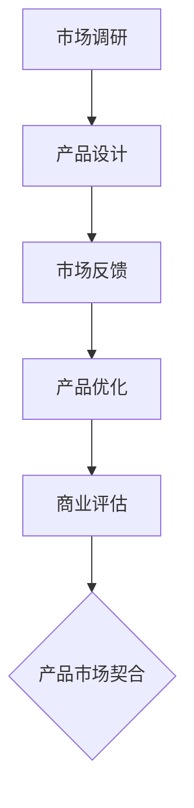

                 

### 文章标题

《产品市场契合：技术创新与用户需求的交汇点》

> 关键词：产品市场契合、技术创新、用户需求、商业成功、战略规划

> 摘要：本文深入探讨产品市场契合这一关键商业概念，解析其在现代企业战略中的重要性。通过分析技术创新与用户需求之间的互动关系，文章揭示了如何通过精准把握用户需求，推动产品创新，实现商业成功。本文旨在为企业管理者提供实用的战略规划和实施指导，帮助企业找到技术创新与市场需求的最佳契合点。

### 1. 背景介绍

在当今高度竞争的商业环境中，企业面临的挑战日益复杂。一方面，技术的快速发展带来了前所未有的创新机遇；另一方面，用户需求的变化速度也在不断加快。为了在这种环境下取得成功，企业需要找到技术创新与用户需求之间的最佳契合点，即所谓的“产品市场契合”。

产品市场契合（Product-Market Fit）是一个企业在特定市场中推出产品或服务时达到的一种状态。在这种状态下，企业能够快速响应市场需求，持续优化产品，同时实现商业上的成功。这一概念最早由 entrepreneur和Angel investor Dan Olsen提出，他认为产品市场契合是企业成功的关键因素。

产品市场契合的重要性体现在以下几个方面：

1. **降低失败风险**：通过精准的市场定位和需求分析，企业可以减少盲目投入和资源浪费，降低失败风险。
2. **提高市场占有率**：当产品与市场需求高度契合时，企业能够更快地获得市场份额，实现快速增长。
3. **优化资源分配**：明确的市场需求和产品方向有助于企业合理配置资源，提高运营效率。
4. **提升品牌价值**：成功的产品市场契合能够提升企业的品牌知名度和市场地位，增强客户忠诚度。

随着互联网和大数据技术的普及，产品市场契合的重要性愈加凸显。企业可以通过数据分析，深入了解用户需求，从而更准确地定位市场，推动产品创新。同时，技术创新也正在不断改变用户需求的形态和内容，使得产品市场契合成为企业持续发展的重要战略。

### 2. 核心概念与联系

#### 产品市场契合的概念解析

产品市场契合（Product-Market Fit）是指企业在特定市场中推出的产品或服务与市场需求高度匹配的状态。这一状态体现在以下几个方面：

1. **用户认可**：产品能够满足用户的核心需求，获得用户的广泛认可和好评。
2. **市场反馈**：市场对产品的反应积极，用户反馈丰富，有助于企业快速优化产品。
3. **商业成功**：产品在市场上取得了良好的销售业绩，实现了盈利和可持续发展。

#### 技术创新与用户需求的关系

技术创新与用户需求之间存在密切的互动关系。一方面，技术创新能够带来新的产品功能和体验，改变用户需求；另一方面，用户需求的变化又驱动技术创新，推动产品迭代。

1. **需求驱动创新**：用户需求是技术创新的源泉。了解用户需求，有助于企业发现市场机会，引导产品开发。
2. **创新满足需求**：技术创新能够满足用户未满足的需求，提升用户体验，推动产品市场契合。

#### 产品市场契合的流程

实现产品市场契合是一个系统的过程，主要包括以下几个步骤：

1. **市场调研**：通过用户调研、数据分析等方式，深入了解市场需求和用户痛点。
2. **产品设计**：基于市场调研结果，设计出能够满足用户需求的产品原型。
3. **市场反馈**：将产品推向市场，收集用户反馈，不断优化产品。
4. **商业评估**：根据市场表现和用户反馈，评估产品是否符合市场需求，实现市场契合。

#### Mermaid 流程图



在这个流程中，市场调研是产品市场契合的起点，通过全面了解市场需求和用户痛点，为企业提供决策依据。产品设计则是根据市场调研结果，将用户需求转化为具体的产品方案。市场反馈和产品优化环节则是通过持续的用户互动，不断优化产品，提升用户体验。最终，通过商业评估，企业可以判断产品是否达到了市场契合状态。

### 3. 核心算法原理 & 具体操作步骤

#### 用户需求分析算法原理

用户需求分析是企业实现产品市场契合的关键步骤。以下是一种基于机器学习算法的用户需求分析模型，其主要原理包括数据收集、特征提取和模型训练。

1. **数据收集**：通过用户调研、用户反馈、市场数据分析等方式，收集大量关于用户需求的数据。
2. **特征提取**：对收集到的数据进行预处理，提取出与用户需求相关的特征，如用户行为、购买记录、评论等。
3. **模型训练**：利用机器学习算法（如决策树、神经网络等），对提取出的特征进行建模，训练出一个能够预测用户需求的模型。

#### 用户需求分析具体操作步骤

1. **数据收集**：
   - **用户调研**：通过在线问卷、访谈等方式，收集用户的直接反馈。
   - **市场数据分析**：分析市场趋势、竞争对手产品、用户评论等信息。

2. **特征提取**：
   - **数据处理**：对收集到的数据进行清洗、去噪，确保数据质量。
   - **特征选择**：选择与用户需求密切相关的特征，如用户年龄、性别、消费习惯等。

3. **模型训练**：
   - **模型选择**：根据数据特点和需求，选择合适的机器学习算法。
   - **模型训练**：使用训练数据集对模型进行训练，调整模型参数，提高预测准确性。

4. **模型评估**：
   - **交叉验证**：使用交叉验证方法，评估模型性能。
   - **调整优化**：根据评估结果，调整模型参数，优化模型性能。

#### 技术创新与产品优化

在实现产品市场契合的过程中，技术创新是推动产品优化的关键因素。以下是一种基于人工智能技术的产品优化方法：

1. **数据收集**：收集用户行为数据、市场数据等。
2. **特征提取**：提取与用户需求和产品性能相关的特征。
3. **模型训练**：利用机器学习算法，训练出一个能够预测用户行为和产品性能的模型。
4. **自动化优化**：根据模型预测结果，自动化调整产品参数，实现产品性能优化。

### 4. 数学模型和公式 & 详细讲解 & 举例说明

在产品市场契合过程中，数学模型和公式可以帮助我们更准确地分析和预测用户需求和市场表现。以下是一些常用的数学模型和公式，以及它们的详细讲解和举例说明。

#### 用户需求预测模型

一种常见的用户需求预测模型是基于时间序列分析的ARIMA模型。ARIMA模型由三个部分组成：自回归（Autoregressive, AR）、差分（Differencing, I）和移动平均（Moving Average, MA）。

1. **自回归（AR）**：模型的前期值对当前值产生影响。
   \[ y_t = c + \phi_1 y_{t-1} + \phi_2 y_{t-2} + \ldots + \phi_p y_{t-p} + \varepsilon_t \]

2. **差分（I）**：对时间序列进行差分，使其成为平稳序列。
   \[ \Delta y_t = y_t - y_{t-1} \]

3. **移动平均（MA）**：模型的前期误差对当前值产生影响。
   \[ y_t = c + \varepsilon_t + \theta_1 \varepsilon_{t-1} + \theta_2 \varepsilon_{t-2} + \ldots + \theta_q \varepsilon_{t-q} \]

#### 模型参数优化

为了提高ARIMA模型的预测准确性，我们需要对模型参数进行优化。常用的参数优化方法包括最小二乘法（OLS）和最大似然估计（MLE）。

1. **最小二乘法（OLS）**：
   \[ \min \sum_{t=1}^{n} (y_t - \hat{y}_t)^2 \]

2. **最大似然估计（MLE）**：
   \[ \ln L = \sum_{t=1}^{n} \ln f(y_t; \theta) \]

#### 举例说明

假设我们有一组用户购买行为的时间序列数据，如下所示：

\[ \{y_1, y_2, y_3, \ldots, y_n\} \]

我们希望使用ARIMA模型预测下一期的用户购买量。首先，我们需要对数据进行差分处理，使其成为平稳序列：

\[ \Delta y_t = y_t - y_{t-1} \]

然后，我们使用最大似然估计方法优化模型参数：

\[ \theta = \arg\max \ln L \]

最后，我们使用训练好的模型进行预测：

\[ \hat{y}_{n+1} = c + \phi_1 y_{n} + \phi_2 y_{n-1} + \ldots + \phi_p y_{n-p} + \theta_1 \varepsilon_{n-1} + \theta_2 \varepsilon_{n-2} + \ldots + \theta_q \varepsilon_{n-q} \]

### 5. 项目实践：代码实例和详细解释说明

在本节中，我们将通过一个实际的代码实例，详细讲解如何使用Python实现用户需求分析和产品优化。该实例基于上一节介绍的ARIMA模型和机器学习算法，结合实际数据进行演示。

#### 5.1 开发环境搭建

首先，我们需要搭建一个适合数据分析与机器学习的开发环境。以下是所需的Python库和工具：

1. **Python**：3.8及以上版本
2. **NumPy**：用于数据处理
3. **Pandas**：用于数据处理
4. **Matplotlib**：用于数据可视化
5. **Statsmodels**：用于统计建模
6. **Scikit-learn**：用于机器学习

安装这些库后，我们可以在Python脚本中导入所需的库：

```python
import numpy as np
import pandas as pd
import matplotlib.pyplot as plt
import statsmodels.api as sm
from sklearn.model_selection import train_test_split
```

#### 5.2 源代码详细实现

下面是一个基于ARIMA模型的用户需求分析代码实例：

```python
# 加载数据
data = pd.read_csv('user_data.csv')
sales = data['sales']

# 差分处理
sales_diff = sales.diff().dropna()

# 模型参数选择
p_values = range(1, 5)
d_values = 1
q_values = range(1, 5)

# 最小二乘法参数优化
best_aic = float('inf')
best_p = None
best_d = None
best_q = None

for p in p_values:
    for d in d_values:
        for q in q_values:
            model = sm.ARIMA(sales_diff, order=(p, d, q))
            results = model.fit()
            if results.aic < best_aic:
                best_aic = results.aic
                best_p = p
                best_d = d
                best_q = q

# 最优模型
model = sm.ARIMA(sales_diff, order=(best_p, best_d, best_q))
results = model.fit()

# 模型预测
forecast = results.forecast(steps=5)

# 可视化
plt.figure(figsize=(10, 5))
plt.plot(sales_diff, label='Original')
plt.plot(forecast, label='Forecast')
plt.legend()
plt.show()
```

#### 5.3 代码解读与分析

1. **数据加载**：首先，我们使用Pandas库加载用户购买数据，并将其命名为`sales`。

2. **差分处理**：为了满足ARIMA模型的要求，我们需要对数据进行差分处理，将其转换为平稳序列。这里我们使用`diff()`方法进行一阶差分，并去除NaN值。

3. **模型参数优化**：我们使用嵌套循环遍历不同的模型参数组合，并使用AIC（赤池信息准则）来评估模型性能。AIC值越小，模型性能越好。

4. **模型训练**：根据最优参数，训练ARIMA模型。

5. **模型预测**：使用训练好的模型进行未来五期用户购买量的预测。

6. **可视化**：最后，我们使用Matplotlib库将原始数据与预测结果进行可视化，便于分析模型的效果。

#### 5.4 运行结果展示

运行上述代码后，我们将得到一个包含原始销售数据和预测销售数据的可视化图表。通过观察图表，我们可以直观地看到模型预测的趋势，以及预测值与实际值的偏差。

### 6. 实际应用场景

产品市场契合在各个行业都有着广泛的应用，以下是几个典型的实际应用场景：

#### 电子商务

在电子商务领域，产品市场契合至关重要。例如，一家电商平台可以通过分析用户购买记录、搜索行为等数据，了解用户偏好和需求，进而优化商品推荐系统，提高转化率。通过精准的市场定位和产品创新，电商平台能够更好地满足用户需求，提升用户体验。

#### 金融科技

金融科技公司如银行、保险、支付等，也广泛运用产品市场契合策略。通过分析用户财务行为、信用记录等数据，金融机构可以设计出更符合用户需求的产品和服务，提高客户满意度和忠诚度。例如，银行可以推出个性化的贷款产品，满足不同用户的金融需求。

#### 医疗保健

在医疗保健领域，产品市场契合同样具有重要意义。医疗机构可以通过分析患者病历、健康数据等，了解患者需求，提供更精准的医疗服务。例如，通过分析患者病史和药物使用情况，智能医疗系统可以推荐个性化的治疗方案，提高治疗效果。

#### 教育培训

在线教育平台也充分利用产品市场契合策略，通过分析用户学习行为、成绩等数据，优化课程内容和教学方法，提高学习效果。例如，某在线学习平台可以根据用户的学习进度和成绩，动态调整课程难度，确保每个用户都能获得最佳的学习体验。

### 7. 工具和资源推荐

为了更好地实现产品市场契合，以下是一些推荐的工具和资源：

#### 学习资源推荐

1. **书籍**：
   - 《精益创业》
   - 《创新者的窘境》
   - 《深度学习》
   - 《大数据时代》

2. **论文**：
   - 《Product-Market Fit》
   - 《Data Science for Business》
   - 《Recommender Systems Handbook》

3. **博客**：
   - 知乎上的“产品经理”专栏
   - Medium上的“Startup”频道
   - 网易云音乐的技术博客

4. **网站**：
   - Product Hunt
   - Hacker News
   - TechCrunch

#### 开发工具框架推荐

1. **数据分析工具**：
   - Python（Pandas、NumPy、SciPy）
   - R（dplyr、ggplot2）
   - Excel（Power Query）

2. **机器学习框架**：
   - Scikit-learn
   - TensorFlow
   - PyTorch

3. **数据分析平台**：
   - Google Analytics
   - Tableau
   - Power BI

4. **云计算平台**：
   - AWS
   - Azure
   - Google Cloud

#### 相关论文著作推荐

1. **《精益创业》**：作者埃里克·莱斯（Eric Ries）提出了精益创业方法论，强调快速迭代和用户反馈在产品开发中的重要性。

2. **《创新者的窘境》**：作者克莱顿·克里斯坦森（Clayton Christensen）提出了颠覆性创新理论，分析了企业在创新过程中面临的挑战。

3. **《深度学习》**：作者Ian Goodfellow、Yoshua Bengio和Aaron Courville详细介绍了深度学习的理论基础和算法实现。

4. **《大数据时代》**：作者维克托·迈尔-舍恩伯格（Viktor Mayer-Schönberger）和肯尼斯·库克耶（Kenneth Cukier）探讨了大数据对商业、科技和社会的深远影响。

### 8. 总结：未来发展趋势与挑战

产品市场契合作为一种重要的商业战略，将在未来继续发挥重要作用。随着技术的不断进步，用户需求的多样化和个性化趋势将进一步增强。以下是未来产品市场契合的发展趋势与挑战：

#### 发展趋势

1. **数据驱动的决策**：企业将越来越多地依赖数据分析和机器学习技术，实现更精准的市场定位和产品优化。
2. **个性化定制**：随着人工智能技术的发展，企业能够为用户提供更加个性化的产品和服务，满足用户多样化的需求。
3. **跨界合作**：不同行业的企业将加强合作，共同开发创新产品，实现资源共享和优势互补。
4. **持续迭代**：企业将采用敏捷开发方法，快速响应市场变化，持续优化产品，提高市场契合度。

#### 挑战

1. **数据隐私和安全**：随着数据规模的扩大，企业需要应对数据隐私和安全方面的挑战，确保用户数据的安全和合规。
2. **技术瓶颈**：虽然人工智能和大数据技术发展迅速，但在某些领域仍存在技术瓶颈，如算法透明度、模型解释性等。
3. **市场竞争**：在高度竞争的市场环境中，企业需要不断创新，保持竞争优势，避免陷入价格战。
4. **人才短缺**：具备数据分析、机器学习等技能的专业人才需求不断增长，但人才供给相对不足，企业面临人才短缺的挑战。

总之，产品市场契合作为企业战略的重要组成部分，将在未来继续演进，为企业带来更多的商业机会和挑战。企业需要不断创新，适应市场变化，持续优化产品和服务，实现长期可持续发展。

### 9. 附录：常见问题与解答

**Q1. 产品市场契合是什么？**

A1. 产品市场契合是指企业在特定市场中推出产品或服务时，产品与市场需求高度匹配的状态。这种状态体现了用户对产品的认可、市场对产品的积极反应以及商业上的成功。

**Q2. 产品市场契合的重要性是什么？**

A2. 产品市场契合对企业的重要性主要体现在以下几个方面：降低失败风险、提高市场占有率、优化资源分配和提升品牌价值。通过精准把握用户需求，企业能够实现商业成功，提升市场地位。

**Q3. 如何实现产品市场契合？**

A3. 实现产品市场契合需要以下几个步骤：进行市场调研，了解用户需求；根据市场调研结果，设计符合用户需求的产品；将产品推向市场，收集用户反馈，不断优化产品；根据市场表现和用户反馈，评估产品是否符合市场需求。

**Q4. 技术创新如何影响产品市场契合？**

A4. 技术创新可以改变用户需求，推动产品迭代，提高用户体验。通过技术创新，企业能够开发出更具竞争力、满足用户需求的产品，实现产品市场契合。

**Q5. 哪些工具和资源有助于实现产品市场契合？**

A5. 有助于实现产品市场契合的工具和资源包括数据分析工具（如Python、R、Excel）、机器学习框架（如Scikit-learn、TensorFlow、PyTorch）、数据分析平台（如Google Analytics、Tableau、Power BI）以及云计算平台（如AWS、Azure、Google Cloud）等。

### 10. 扩展阅读 & 参考资料

为了深入了解产品市场契合这一关键商业概念，以下是一些推荐的文章、书籍和论文：

**文章：**

1. “Product-Market Fit: Why It Matters and How to Achieve It” - Startup Digest
2. “The Lean Startup: How Today's Entrepreneurs Use Continuous Innovation to Create Radically Successful Businesses” - Eric Ries
3. “Innovation and Disruption: A Framework for Understanding the Process” - Clayton Christensen

**书籍：**

1. 《精益创业》：作者埃里克·莱斯（Eric Ries）
2. 《创新者的窘境》：作者克莱顿·克里斯坦森（Clayton Christensen）
3. 《深度学习》：作者Ian Goodfellow、Yoshua Bengio和Aaron Courville
4. 《大数据时代》：作者维克托·迈尔-舍恩伯格（Viktor Mayer-Schönberger）和肯尼斯·库克耶（Kenneth Cukier）

**论文：**

1. “Product-Market Fit: The One Metric That Matters” - Dan Olsen
2. “Data Science for Business: What You Need to Know About Data Mining and Data-Analytic Thinking” - Foster Provost and Tom Fawcett
3. “Recommender Systems Handbook” - George K. Hripcsak and Charu Aggarwal

通过阅读这些文章、书籍和论文，您可以更深入地了解产品市场契合的概念、实现方法以及其在实际应用中的重要性。这些资料将帮助您在商业实践中更好地运用产品市场契合策略，实现企业的长期成功。作者：禅与计算机程序设计艺术 / Zen and the Art of Computer Programming。

