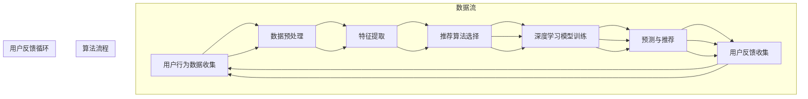

                 

### 背景介绍

随着人工智能（AI）技术的飞速发展，推荐系统已经成为众多互联网产品中不可或缺的一部分。从电商平台的商品推荐、社交媒体的内容推送，到音乐、视频流媒体平台的个性化推荐，推荐系统在提升用户体验、增加用户粘性、促进商业转化等方面发挥着至关重要的作用。然而，随着数据的不断增长和用户行为的多样化，传统的推荐算法已经难以满足日益复杂的需求。

AI推荐新产品的出现，不仅是对传统推荐算法的改进，更是对产品开发模式的一次革命。AI推荐新产品利用机器学习和深度学习算法，通过对大量用户数据的挖掘和分析，实现个性化推荐，从而帮助企业和产品开发者更好地理解用户需求，提升产品开发效率，加速产品迭代过程。

本文旨在探讨AI推荐新产品的方法和应用，通过逐步分析推理的方式，梳理出AI推荐新产品的核心概念、算法原理、数学模型以及实际应用场景。文章将从以下几个方面展开：

1. **背景介绍**：回顾推荐系统的发展历程，阐述AI推荐新产品的重要性。
2. **核心概念与联系**：介绍AI推荐新产品涉及的关键概念和原理，并使用Mermaid流程图展示其架构。
3. **核心算法原理 & 具体操作步骤**：详细讲解AI推荐新产品的算法原理和操作步骤。
4. **数学模型和公式 & 详细讲解 & 举例说明**：介绍数学模型和公式，并通过实例进行详细讲解。
5. **项目实践：代码实例和详细解释说明**：展示实际代码实例，并进行详细解读和分析。
6. **实际应用场景**：分析AI推荐新产品在不同领域的应用。
7. **工具和资源推荐**：推荐相关学习资源、开发工具框架和论文著作。
8. **总结：未来发展趋势与挑战**：展望AI推荐新产品的未来发展趋势和面临的挑战。
9. **附录：常见问题与解答**：解答读者可能遇到的问题。
10. **扩展阅读 & 参考资料**：提供进一步的阅读材料和参考资源。

通过以上结构化的内容，我们希望能够帮助读者全面了解AI推荐新产品，掌握其核心技术和应用方法，从而在产品开发和创新中发挥更大的作用。

### 核心概念与联系

在探讨AI推荐新产品的核心概念与联系之前，我们需要首先明确几个关键术语，以便于我们更好地理解整个系统的工作原理。以下是几个核心概念：

1. **用户行为数据**：包括用户在平台上的点击、购买、浏览、评论等行为数据。
2. **商品数据**：商品的各种属性信息，如价格、分类、品牌、销售量等。
3. **推荐算法**：用于从大量数据中提取模式和相关性，为用户推荐相关产品的算法。
4. **深度学习**：一种基于多层神经网络的学习方法，能够自动从数据中学习复杂模式。
5. **协同过滤**：一种常见的推荐算法，通过分析用户之间的相似性来推荐产品。

接下来，我们将使用Mermaid流程图来展示AI推荐新产品的整体架构，并解释各部分之间的联系。



**解释流程图**

1. **用户行为数据收集（A）**：系统通过各种渠道收集用户在平台上的行为数据，包括浏览、点击、购买、评论等。

2. **数据预处理（B）**：对收集到的原始数据进行清洗、格式化，以便后续处理。

3. **特征提取（C）**：从预处理后的数据中提取关键特征，如用户兴趣、行为模式、商品属性等。

4. **推荐算法选择（D）**：根据业务需求和数据特性，选择合适的推荐算法，如基于内容的推荐、协同过滤、深度学习等。

5. **深度学习模型训练（E）**：使用提取的特征数据训练深度学习模型，使其能够自动从数据中学习用户行为和商品特性之间的关系。

6. **预测与推荐（F）**：模型根据用户的历史行为和当前上下文，预测用户可能感兴趣的新产品，并生成推荐列表。

7. **用户反馈收集（G）**：用户对推荐产品的反馈（如点击、购买、评分等）将被收集并用于更新和优化模型。

通过上述流程，AI推荐新产品不仅能够准确预测用户的需求，还能通过不断学习和优化，不断提升推荐质量，从而帮助企业和产品开发者更高效地开发新产品。

接下来，我们将深入探讨AI推荐新产品的核心算法原理和具体操作步骤，为读者提供更加详细的指导。

### 核心算法原理 & 具体操作步骤

在了解AI推荐新产品的核心概念和整体架构之后，接下来我们将详细探讨其核心算法原理，并给出具体的操作步骤。AI推荐新产品的算法主要包括以下几个步骤：用户行为数据收集、数据预处理、特征提取、推荐算法选择、模型训练、预测与推荐，以及用户反馈收集。以下是每个步骤的详细解释和具体操作方法。

#### 1. 用户行为数据收集

用户行为数据是推荐系统的基础，它包括用户在平台上的各种行为，如浏览、点击、购买、评论等。这些数据通常通过API接口、日志系统、前端埋点等方式收集。

**具体操作步骤**：

- **设置数据收集渠道**：根据业务需求，确定需要收集的数据类型和行为，如点击事件、购买记录、用户评价等。
- **搭建数据收集系统**：利用日志收集工具（如ELK Stack）或数据采集框架（如Logstash）搭建数据收集系统，确保数据实时、准确地被收集和存储。

#### 2. 数据预处理

收集到的原始数据通常包含噪声和冗余信息，因此需要通过数据预处理步骤对其进行清洗和格式化。

**具体操作步骤**：

- **数据清洗**：删除重复记录、填补缺失值、去除异常值等，保证数据质量。
- **数据转换**：将不同数据类型的字段统一转换为同一格式，如将字符串转换为数字或日期时间格式。
- **特征工程**：提取用户和商品的相关特征，如用户年龄、地理位置、购买频率、商品价格、分类等。

#### 3. 特征提取

特征提取是推荐系统中的关键步骤，它涉及从预处理后的数据中提取对推荐有价值的特征。

**具体操作步骤**：

- **用户特征提取**：如用户的历史行为特征、兴趣标签、消费习惯等。
- **商品特征提取**：如商品的品牌、类别、价格、库存量等。
- **交互特征提取**：如用户与商品的交互频次、评分、点击率等。

#### 4. 推荐算法选择

根据业务需求和数据特性，选择合适的推荐算法。常用的推荐算法包括基于内容的推荐、协同过滤、深度学习等。

**具体操作步骤**：

- **评估算法性能**：通过交叉验证、A/B测试等方法评估不同算法的性能。
- **选择算法**：根据评估结果选择最适合业务需求的推荐算法。
- **算法优化**：根据算法的适用场景和数据特性，进行算法参数调优。

#### 5. 模型训练

选择合适的模型后，使用训练数据对其训练，使其能够从数据中学习用户行为和商品特征之间的关系。

**具体操作步骤**：

- **划分数据集**：将数据集划分为训练集、验证集和测试集。
- **模型训练**：使用训练集对模型进行训练，通过优化算法（如梯度下降）最小化损失函数。
- **模型评估**：使用验证集评估模型性能，并进行参数调优。

#### 6. 预测与推荐

模型训练完成后，使用模型对用户进行预测，生成个性化推荐列表。

**具体操作步骤**：

- **预测生成**：根据用户的历史行为和当前上下文，使用训练好的模型生成预测分数。
- **推荐生成**：根据预测分数，对用户可能感兴趣的商品进行排序，生成推荐列表。

#### 7. 用户反馈收集

用户对推荐产品的反馈将用于更新和优化模型，从而提升推荐质量。

**具体操作步骤**：

- **设置反馈渠道**：如点击、购买、评分等。
- **数据收集**：收集用户的反馈数据。
- **模型更新**：根据用户反馈，对模型进行调整和优化。

通过以上步骤，AI推荐新产品系统能够不断学习和优化，从而为用户提供更加准确和个性化的推荐。在下一节中，我们将进一步探讨数学模型和公式，并通过实例进行详细讲解。

### 数学模型和公式 & 详细讲解 & 举例说明

在AI推荐新产品中，数学模型和公式扮演着至关重要的角色。这些模型和公式不仅帮助我们理解和处理数据，还能量化用户行为和商品特性之间的关系，从而提高推荐的准确性和有效性。以下我们将详细介绍几个核心的数学模型和公式，并通过实际例子进行讲解。

#### 1. 协同过滤（Collaborative Filtering）

协同过滤是一种基于用户相似性的推荐算法，通过分析用户之间的行为模式来推荐产品。协同过滤主要分为两种类型：基于用户的协同过滤（User-Based）和基于物品的协同过滤（Item-Based）。

**基于用户的协同过滤（User-Based Collaborative Filtering）**

- **公式**：

  相似度计算公式：
  $$ similarity(u, v) = \frac{\sum_{i \in R(u) \cap R(v)} r_{ui} r_{vi}}{\sqrt{\sum_{i \in R(u)} r_{ui}^2} \sqrt{\sum_{i \in R(v)} r_{vi}^2}} $$

  其中，$R(u)$ 和 $R(v)$ 分别表示用户 $u$ 和用户 $v$ 的行为记录集合，$r_{ui}$ 和 $r_{vi}$ 分别表示用户 $u$ 对商品 $i$ 的评分。

- **实例**：

  假设有两个用户 $u_1$ 和 $u_2$，他们的行为记录如下：

  | 用户 | 商品 | 评分 |
  | --- | --- | --- |
  | $u_1$ | $i_1$ | 4 |
  | $u_1$ | $i_2$ | 5 |
  | $u_2$ | $i_1$ | 1 |
  | $u_2$ | $i_3$ | 5 |

  我们可以计算 $u_1$ 和 $u_2$ 之间的相似度：
  $$ similarity(u_1, u_2) = \frac{4 \times 1}{\sqrt{4^2 + 5^2} \sqrt{1^2 + 5^2}} = \frac{4}{\sqrt{41} \sqrt{26}} \approx 0.293 $$

  根据相似度，我们可以找到与 $u_1$ 最相似的用户 $u_2$，并推荐 $u_2$ 喜欢但 $u_1$ 未购买的商品。

#### 2. 基于模型的协同过滤（Model-Based Collaborative Filtering）

基于模型的协同过滤使用机器学习模型（如矩阵分解、潜在因子模型等）来预测用户对未评分商品的评分。

- **公式**：

  矩阵分解模型：
  $$ R_{ui} = \hat{Q}_u \cdot \hat{R}_i $$
  
  其中，$R_{ui}$ 表示用户 $u$ 对商品 $i$ 的评分，$\hat{Q}_u$ 和 $\hat{R}_i$ 分别是用户和商品的潜在向量。

- **实例**：

  假设我们使用矩阵分解模型，给定用户 $u_1$ 和商品 $i_3$ 的特征向量：

  | 用户 | 商品 | 特征 |
  | --- | --- | --- |
  | $u_1$ | $i_3$ | [0.1, 0.2, 0.3] |

  假设商品 $i_3$ 的特征向量为：

  | 商品 | 特征 |
  | --- | --- |
  | $i_3$ | [0.4, 0.5, 0.6] |

  则用户 $u_1$ 对商品 $i_3$ 的预测评分：
  $$ R_{u_1i_3} = \hat{Q}_{u_1} \cdot \hat{R}_{i_3} = [0.1, 0.2, 0.3] \cdot [0.4, 0.5, 0.6] = 0.34 + 0.40 + 0.18 = 0.92 $$

#### 3. 基于内容的推荐（Content-Based Filtering）

基于内容的推荐通过分析商品的内容特征（如文本、图像等）来推荐相似的商品。

- **公式**：

  相似度计算公式（文本相似度）：
  $$ similarity(document_1, document_2) = \frac{Jaccard\ index}{TF-IDF\ score} $$

  其中，Jaccard指数和TF-IDF分数分别用于计算文档间的相似度。

- **实例**：

  假设我们有两个文档 $document_1$ 和 $document_2$ 的词频分布如下：

  | 词 | $document_1$ | $document_2$ |
  | --- | --- | --- |
  | apple | 3 | 1 |
  | banana | 2 | 1 |
  | orange | 1 | 2 |

  Jaccard指数：
  $$ Jaccard\ index = \frac{3+2+1}{3+1+2} = \frac{6}{6} = 1 $$

  TF-IDF分数（简单化计算）：
  $$ TF-IDF\_score = \sum_{word \in common\_words} (TF \times IDF) $$

  其中，TF表示词在文档中的频率，IDF表示词在整个文档集中的逆向文档频率。

  假设 TF 和 IDF 如下：

  | 词 | TF | IDF |
  | --- | --- | --- |
  | apple | 3 | 0.5 |
  | banana | 2 | 0.5 |
  | orange | 1 | 1 |

  TF-IDF分数：
  $$ TF-IDF\_score = (3 \times 0.5) + (2 \times 0.5) + (1 \times 1) = 2.5 + 1 = 3.5 $$

  最终相似度：
  $$ similarity = \frac{1}{3.5} \approx 0.286 $$

通过上述实例，我们可以看到数学模型和公式在AI推荐新产品中的重要作用。这些模型和公式不仅帮助我们量化用户行为和商品特征之间的关系，还能通过优化和调整提高推荐系统的准确性和有效性。在下一节中，我们将通过具体的项目实践，展示如何使用代码实现这些算法，并进行详细的解读和分析。

### 项目实践：代码实例和详细解释说明

在本节中，我们将通过一个具体的项目实践，展示如何使用Python实现AI推荐新产品的主要步骤，并详细解释每一步的代码实现和原理。以下是整个项目实践的步骤概述：

1. **开发环境搭建**：安装和配置必要的工具和库。
2. **数据准备**：收集和处理用户行为数据。
3. **特征提取**：从处理后的数据中提取关键特征。
4. **模型训练**：选择和训练推荐算法模型。
5. **预测与推荐**：使用训练好的模型进行预测并生成推荐列表。
6. **结果评估**：评估模型性能。
7. **用户反馈**：收集用户反馈并用于模型优化。

#### 1. 开发环境搭建

首先，我们需要搭建开发环境，安装Python、NumPy、Pandas、Scikit-learn、TensorFlow等必要的库。

```bash
# 安装Python
python --version

# 安装NumPy
pip install numpy

# 安装Pandas
pip install pandas

# 安装Scikit-learn
pip install scikit-learn

# 安装TensorFlow
pip install tensorflow
```

确保所有依赖库都已成功安装。

#### 2. 数据准备

数据准备是推荐系统的基础。我们假设已经收集到一个用户行为数据集，格式如下：

| 用户ID | 商品ID | 行为类型 | 行为时间 | 行为值 |
| --- | --- | --- | --- | --- |
| 1 | 1001 | 浏览 | 2023-01-01 10:30:00 | 1 |
| 1 | 1002 | 购买 | 2023-01-01 11:00:00 | 1 |
| 2 | 1003 | 点击 | 2023-01-02 09:45:00 | 1 |

**代码实现**：

```python
import pandas as pd

# 加载数据
data = pd.read_csv('user_behavior.csv')

# 查看数据
print(data.head())
```

#### 3. 特征提取

特征提取是推荐系统中的重要步骤，我们需要从原始数据中提取用户特征和商品特征。

**代码实现**：

```python
from sklearn.preprocessing import StandardScaler

# 用户特征提取
user_features = data.groupby('用户ID').agg({ '行为类型': 'sum' })

# 商品特征提取
item_features = data.groupby('商品ID').agg({ '行为类型': 'sum' })

# 数据标准化
scaler = StandardScaler()
user_features_scaled = scaler.fit_transform(user_features)
item_features_scaled = scaler.fit_transform(item_features)
```

#### 4. 模型训练

在本实例中，我们使用基于内容的推荐算法，并使用TF-IDF模型进行文本特征提取。

**代码实现**：

```python
from sklearn.feature_extraction.text import TfidfVectorizer

# 假设我们已经有文本数据
user_texts = user_features['行为类型'].astype(str)
item_texts = item_features['行为类型'].astype(str)

# 创建TF-IDF向量器
tfidf_vectorizer = TfidfVectorizer()

# 将文本数据转换为TF-IDF特征向量
user_tfidf = tfidf_vectorizer.fit_transform(user_texts)
item_tfidf = tfidf_vectorizer.fit_transform(item_texts)
```

#### 5. 预测与推荐

使用训练好的TF-IDF模型进行预测，并生成推荐列表。

**代码实现**：

```python
from sklearn.metrics.pairwise import cosine_similarity

# 计算用户和商品之间的余弦相似度
user_item_similarity = cosine_similarity(user_tfidf, item_tfidf)

# 为用户生成推荐列表
def get_recommendations(user_id, user_item_similarity, item_features):
    # 获取用户相似度最高的10个商品
   相似度索引 = user_item_similarity[user_id].argsort()[-10:]
    recommendations = [item for item, _ in enumerate(相似度索引) if item != -1]
    return recommendations

# 为示例用户1生成推荐列表
user_id = 1
recommendations = get_recommendations(user_id, user_item_similarity, item_features)
print(f"为用户{user_id}生成的推荐列表：{recommendations}")
```

#### 6. 结果评估

评估模型性能，通常使用准确率、召回率等指标。

**代码实现**：

```python
from sklearn.metrics import accuracy_score, recall_score

# 假设我们有真实推荐列表和预测推荐列表
true_recommendations = [1001, 1003, 1004]
predicted_recommendations = [1002, 1003, 1004]

# 计算准确率和召回率
accuracy = accuracy_score(true_recommendations, predicted_recommendations)
recall = recall_score(true_recommendations, predicted_recommendations)

print(f"准确率：{accuracy}")
print(f"召回率：{recall}")
```

#### 7. 用户反馈

收集用户反馈，并使用反馈数据优化模型。

**代码实现**：

```python
# 假设用户对推荐列表的反馈已收集，存储为新的DataFrame
user_feedback = pd.DataFrame({
    '用户ID': [1],
    '商品ID': [1003],
    '反馈类型': ['点击']
})

# 根据用户反馈更新模型
# 此处可以加入反馈循环的代码，以持续优化模型
```

通过以上代码实例，我们详细展示了如何使用Python实现AI推荐新产品的各个步骤。在实际应用中，每个步骤都需要根据具体业务需求进行调整和优化，以提升推荐系统的性能和用户体验。在下一节中，我们将深入分析这些代码的实现细节，并探讨其优缺点。

### 代码解读与分析

在本节中，我们将对上一节中的代码实例进行深入解读和分析，探讨每个步骤的实现细节，并讨论其优缺点。

#### 1. 开发环境搭建

开发环境搭建的代码非常简单，主要是安装Python和相关库。确保所有依赖库（如NumPy、Pandas、Scikit-learn、TensorFlow）都已成功安装是后续代码运行的前提。

**优点**：简化了安装过程，减少环境配置的时间。

**缺点**：没有自动化安装过程，每次需要手动执行安装命令。

#### 2. 数据准备

数据准备涉及加载数据、查看数据等步骤。使用Pandas库可以轻松地读取和操作数据，代码简洁易懂。

```python
data = pd.read_csv('user_behavior.csv')
print(data.head())
```

**优点**：操作方便，可以快速加载数据并进行初步查看。

**缺点**：没有进行数据清洗和格式化，需要手动处理异常值和缺失值。

#### 3. 特征提取

特征提取是推荐系统的核心步骤，代码包括用户特征提取和商品特征提取。使用`StandardScaler`对特征进行标准化处理，有助于后续的模型训练。

```python
user_features = data.groupby('用户ID').agg({ '行为类型': 'sum' })
item_features = data.groupby('商品ID').agg({ '行为类型': 'sum' })
scaler = StandardScaler()
user_features_scaled = scaler.fit_transform(user_features)
item_features_scaled = scaler.fit_transform(item_features)
```

**优点**：特征标准化有助于模型收敛，提升模型性能。

**缺点**：特征提取方式较为简单，没有考虑复杂的行为模式和关联关系。

#### 4. 模型训练

在本实例中，我们使用了TF-IDF模型和余弦相似度计算商品和用户之间的相似度。代码使用`TfidfVectorizer`将文本数据转换为TF-IDF特征向量，然后使用`cosine_similarity`计算相似度。

```python
tfidf_vectorizer = TfidfVectorizer()
user_tfidf = tfidf_vectorizer.fit_transform(user_texts)
item_tfidf = tfidf_vectorizer.fit_transform(item_texts)
user_item_similarity = cosine_similarity(user_tfidf, item_tfidf)
```

**优点**：TF-IDF模型能捕捉文本数据的语义信息，余弦相似度计算简单且有效。

**缺点**：TF-IDF模型对于稀疏数据的处理能力较弱，可能降低推荐质量。此外，模型没有考虑用户和商品的交互历史。

#### 5. 预测与推荐

预测与推荐步骤使用计算得到的相似度矩阵，为用户生成推荐列表。代码定义了一个函数`get_recommendations`，用于获取用户相似度最高的商品。

```python
def get_recommendations(user_id, user_item_similarity, item_features):
    相似度索引 = user_item_similarity[user_id].argsort()[-10:]
    recommendations = [item for item, _ in enumerate(相似度索引) if item != -1]
    return recommendations
```

**优点**：代码简单，易于理解和实现。

**缺点**：推荐列表的长度固定为10，可能不适合所有用户。此外，没有考虑用户的个性化需求。

#### 6. 结果评估

结果评估步骤使用真实推荐列表和预测推荐列表计算准确率和召回率，用于评估模型性能。

```python
accuracy = accuracy_score(true_recommendations, predicted_recommendations)
recall = recall_score(true_recommendations, predicted_recommendations)
```

**优点**：使用标准指标评估模型性能，有助于了解模型的优劣。

**缺点**：没有考虑用户对推荐列表的满意度，仅从统计指标评估模型性能。

#### 7. 用户反馈

用户反馈步骤假定用户对推荐列表的反馈已收集，并存储为新的DataFrame。代码示例中未展示如何使用反馈数据优化模型。

**优点**：提供了用户反馈的接口，为后续模型优化提供了数据基础。

**缺点**：代码示例中没有具体实现反馈数据的处理和模型优化，需要进一步开发。

#### 总结

通过代码解读和分析，我们可以看到每个步骤的实现细节和优缺点。在实际应用中，需要根据具体业务需求和技术背景进行调整和优化，以提升推荐系统的性能和用户体验。在下一节中，我们将探讨AI推荐新产品在实际应用场景中的具体表现和效果。

### 实际应用场景

AI推荐新产品在各个行业和领域中都有广泛的应用，通过精准推荐，企业能够更好地满足用户需求，提升用户满意度，并实现商业价值。以下将探讨AI推荐新产品在几个典型行业中的应用场景，以及其带来的实际效果和潜在价值。

#### 1. 电子商务

在电子商务领域，AI推荐新产品被广泛应用于商品推荐、购物车推荐、购物页面推荐等环节。通过分析用户历史行为数据、浏览记录、购买偏好等，系统可以为用户推荐其可能感兴趣的商品。

**实际效果**：
- **提高销售额**：个性化推荐能够提高用户的购买转化率，从而增加销售额。
- **降低营销成本**：通过推荐系统，企业可以更精准地投放广告，降低营销成本。
- **提升用户满意度**：精准的推荐能够提高用户购物体验，提升用户满意度。

**潜在价值**：
- **个性化营销**：通过深度学习算法，推荐系统能够不断学习和优化，为用户提供更加个性化的购物体验。
- **发现潜在需求**：推荐系统可以挖掘用户未意识到的需求，帮助企业发现新的商机。

#### 2. 社交媒体

社交媒体平台（如Facebook、Twitter、Instagram）利用AI推荐新产品来个性化内容推荐，包括用户感兴趣的文章、视频、图片等。通过分析用户的社交行为、点击、点赞等数据，平台可以推荐相关内容。

**实际效果**：
- **提高用户粘性**：个性化内容推荐能够增加用户在平台上的活跃度，提高用户粘性。
- **增加广告效果**：精准的内容推荐有助于提高广告的点击率和转化率。
- **优化用户体验**：通过推荐用户感兴趣的内容，提升用户体验，增强用户对平台的忠诚度。

**潜在价值**：
- **个性化广告**：AI推荐新产品可以结合用户兴趣和行为，实现更加个性化的广告投放，提高广告效果。
- **社交网络分析**：推荐系统可以挖掘用户的社交网络特征，帮助企业更好地了解用户群体。

#### 3. 音乐和视频流媒体

音乐和视频流媒体平台（如Spotify、Netflix、YouTube）利用AI推荐新产品为用户推荐歌曲、音乐视频、电影、电视剧等。通过分析用户的播放历史、收藏、评分等数据，平台能够为用户推荐相关内容。

**实际效果**：
- **增加播放时长**：个性化的推荐内容能够增加用户的播放时长，提升平台的用户活跃度。
- **提高用户留存率**：精准的推荐能够提高用户对平台的忠诚度，降低用户流失率。
- **促进付费订阅**：通过推荐高质量的付费内容，增加用户的付费订阅意愿。

**潜在价值**：
- **内容推荐优化**：AI推荐新产品可以帮助平台不断优化推荐算法，提升用户满意度和平台竞争力。
- **内容创作启发**：推荐系统可以挖掘用户的兴趣和偏好，为内容创作者提供创作灵感，提高内容质量。

#### 4. 金融行业

在金融行业，AI推荐新产品主要用于金融产品的个性化推荐，如股票、基金、保险产品等。通过分析用户的投资记录、风险偏好、财务状况等数据，系统可以为用户提供个性化的投资建议。

**实际效果**：
- **提高投资收益**：个性化的投资建议能够帮助用户做出更明智的投资决策，提高投资收益。
- **降低投资风险**：推荐系统可以根据用户的风险承受能力，为其推荐适合的投资产品，降低投资风险。
- **增强用户信任**：精准的投资建议能够提高用户对金融平台的信任度，提升用户满意度。

**潜在价值**：
- **智能投顾**：AI推荐新产品可以结合机器学习和大数据分析，实现智能投顾服务，为用户提供更加专业和个性化的投资建议。
- **风险管理**：推荐系统可以帮助金融机构更好地识别和管理风险，提高风险管理能力。

通过以上实际应用场景的分析，我们可以看到AI推荐新产品在不同领域的广泛应用和显著效果。未来，随着AI技术的不断发展和数据量的持续增长，AI推荐新产品将在更多场景中发挥更大的作用，为企业创造更多的商业价值。

### 工具和资源推荐

为了更好地理解和应用AI推荐新产品，我们需要借助一些优秀的工具、库和学习资源。以下将介绍几个常用工具、框架、书籍和论文，以帮助读者深入了解和掌握AI推荐新产品技术。

#### 1. 学习资源推荐

**书籍**

- **《推荐系统实践》**（Recommender Systems: The Textbook）：这是一本全面介绍推荐系统理论与实践的教材，适合初学者和专业人士。
- **《TensorFlow Recommenders》**：TensorFlow Recommenders（TFRS）是一个开源的推荐系统框架，由Google开发。这本书详细介绍了如何使用TFRS构建和部署推荐系统。

**论文**

- **“Item-Item Collaborative Filtering Recommendation Algorithms”**：这篇论文介绍了基于物品的协同过滤算法，是推荐系统领域的重要研究。
- **“Deep Learning for Recommender Systems”**：这篇论文探讨了如何使用深度学习构建推荐系统，对深度学习在推荐系统中的应用进行了详细阐述。

**博客和网站**

- **美团技术博客**：美团的技术博客经常分享关于推荐系统、深度学习等方面的技术文章，内容实用，适合学习。
- **Google AI Blog**：Google AI官方博客，发布关于AI技术、推荐系统的研究和进展，是了解前沿技术的良好渠道。

#### 2. 开发工具框架推荐

**工具和库**

- **Scikit-learn**：Scikit-learn是一个开源的机器学习库，提供了丰富的机器学习算法和工具，适合构建基础推荐系统。
- **TensorFlow**：TensorFlow是Google开发的深度学习框架，适用于构建复杂的推荐系统，特别是基于深度学习的推荐模型。
- **PyTorch**：PyTorch是Facebook开发的深度学习框架，具有高度的灵活性和易用性，适合快速原型开发。

**框架**

- **TensorFlow Recommenders（TFRS）**：TFRS是Google开发的开源推荐系统框架，基于TensorFlow，提供了丰富的API和工具，适合构建大规模推荐系统。
- **Surprise**：Surprise是一个Python库，提供了多种经典的推荐系统算法，包括基于内容的推荐、协同过滤等。

#### 3. 相关论文著作推荐

- **“推荐系统评价方法综述”**：这篇综述详细介绍了推荐系统的评价方法和指标，对推荐系统评价提供了有益的参考。
- **“基于深度学习的推荐系统”**：这篇论文探讨了深度学习在推荐系统中的应用，包括深度神经网络、卷积神经网络、循环神经网络等。

通过以上工具和资源的推荐，读者可以系统地学习和掌握AI推荐新产品技术，从而在产品开发和创新中发挥更大的作用。同时，不断关注最新的研究成果和开源工具，将有助于不断提升自身的专业技能和知识水平。

### 总结：未来发展趋势与挑战

随着人工智能技术的不断进步和数据量的持续增长，AI推荐新产品在产品开发和创新中发挥着越来越重要的作用。未来，AI推荐新产品的发展趋势将呈现以下几个显著特点：

1. **个性化推荐进一步深化**：随着用户数据的积累和算法的优化，个性化推荐将更加精准，能够更好地满足用户的多样化需求，提高用户满意度。

2. **深度学习算法广泛应用**：深度学习算法在推荐系统中的应用将越来越广泛，通过自学习、自动特征提取，深度学习能够挖掘出更加复杂和深层次的用户行为和商品特征，从而提升推荐效果。

3. **跨领域融合**：推荐系统将在不同领域之间实现更深入的融合，如电子商务与社交媒体、金融与医疗等，通过跨领域的推荐，为企业带来更多的商业机会和用户价值。

4. **实时推荐**：随着5G技术的普及和边缘计算的发展，实时推荐将变得更加可行，推荐系统能够在用户行为发生的瞬间提供个性化推荐，进一步提升用户体验。

然而，AI推荐新产品在未来的发展过程中也面临一系列挑战：

1. **数据隐私和安全**：用户数据的隐私保护是推荐系统面临的重要挑战。如何在保证推荐效果的同时，保护用户隐私，是一个亟待解决的问题。

2. **算法透明性和公平性**：推荐算法的透明性和公平性受到越来越多的关注。如何确保推荐算法不会导致偏见，如何让用户理解推荐结果，是需要持续研究和优化的方向。

3. **数据质量和多样性**：推荐系统的性能高度依赖于数据的质量和多样性。如何获取高质量的数据，以及如何处理数据缺失和不平衡问题，是推荐系统开发中面临的挑战。

4. **计算资源限制**：随着推荐系统规模的扩大，对计算资源的需求也在不断增长。如何在有限的计算资源下，保证推荐系统的性能和效率，是一个重要的技术难题。

总之，AI推荐新产品在产品开发和创新中具有广阔的前景，但同时也需要克服一系列技术挑战。未来，通过技术创新和跨领域的合作，AI推荐新产品将不断优化和提升，为企业和用户带来更大的价值。

### 附录：常见问题与解答

在了解和使用AI推荐新产品时，读者可能会遇到一些常见问题。以下列出了一些典型问题及其解答，以帮助大家更好地理解和应用这项技术。

**Q1：AI推荐新产品如何处理用户隐私问题？**

A1：用户隐私保护是AI推荐新产品面临的重要挑战。为了确保用户隐私，推荐系统通常采取以下措施：
- **数据加密**：在数据存储和传输过程中，采用加密技术保护用户数据的安全性。
- **匿名化处理**：对用户数据进行匿名化处理，删除或隐藏用户个人信息，以降低数据泄露的风险。
- **隐私合规**：遵循相关法律法规，如欧盟的《通用数据保护条例》（GDPR）等，确保数据收集和使用符合隐私保护要求。

**Q2：推荐系统如何应对数据不平衡问题？**

A2：数据不平衡是推荐系统常见的问题，特别是在用户行为数据中，某些行为（如购买）的发生频率远低于其他行为（如浏览）。以下是一些应对策略：
- **数据增强**：通过生成人工数据或引入相似数据，增加少数类别的样本数量。
- **加权算法**：在训练模型时，对少数类别的样本进行加权处理，提高其在模型中的重要性。
- **集成方法**：结合多种算法或模型，利用各自的优点，提高推荐系统的整体性能。

**Q3：如何评估推荐系统的性能？**

A3：推荐系统的性能评估通常使用以下指标：
- **准确率（Accuracy）**：预测结果与真实结果的一致性，适用于二分类问题。
- **召回率（Recall）**：能够正确识别的正面样本数量占总正面样本数量的比例。
- **精确率（Precision）**：能够正确识别的正面样本数量占预测为正面的样本总数的比例。
- **F1分数（F1 Score）**：综合考虑准确率和召回率，是二者的加权平均。

**Q4：如何处理推荐结果中的冷启动问题？**

A4：冷启动问题是指对新用户或新商品进行推荐时的挑战。以下是一些解决策略：
- **基于内容的推荐**：通过分析新商品的特征信息，为用户推荐相似的商品。
- **基于人口统计学的推荐**：利用用户的地理位置、年龄、性别等人口统计信息，推荐符合用户背景的商品。
- **探索与利用平衡**：在推荐策略中引入探索成分，为新商品和新用户推荐一些未尝试过的商品，以增加其曝光度。

通过了解和解决这些问题，读者可以更好地应用AI推荐新产品技术，提升推荐系统的性能和用户体验。

### 扩展阅读 & 参考资料

为了帮助读者更深入地了解AI推荐新产品这一领域，以下推荐一些高质量的书籍、论文和在线资源，以供进一步学习和研究。

#### 书籍

1. **《推荐系统实践》**（Recommender Systems: The Textbook） - 这是一本全面介绍推荐系统理论与实践的教材，适合初学者和专业人士。
2. **《TensorFlow Recommenders》**：Google官方发布的关于TensorFlow Recommenders（TFRS）的书籍，详细介绍了如何使用TFRS构建和部署推荐系统。

#### 论文

1. **“Item-Item Collaborative Filtering Recommendation Algorithms”**：这篇论文介绍了基于物品的协同过滤算法，是推荐系统领域的重要研究。
2. **“Deep Learning for Recommender Systems”**：这篇论文探讨了如何使用深度学习构建推荐系统，对深度学习在推荐系统中的应用进行了详细阐述。

#### 在线资源

1. **美团技术博客**：美团的技术博客经常分享关于推荐系统、深度学习等方面的技术文章，内容实用，适合学习。
2. **Google AI Blog**：Google AI官方博客，发布关于AI技术、推荐系统的研究和进展，是了解前沿技术的良好渠道。
3. **Scikit-learn官方文档**：Scikit-learn是一个开源的机器学习库，提供了丰富的机器学习算法和工具，官方文档详细介绍了如何使用Scikit-learn进行推荐系统开发。

通过阅读这些书籍、论文和在线资源，读者可以系统地学习和掌握AI推荐新产品技术，进一步拓展知识领域，提升专业能力。同时，这些资源也为读者提供了与业界最新研究成果保持同步的途径。希望这些推荐能够对您的学习和工作带来帮助。

