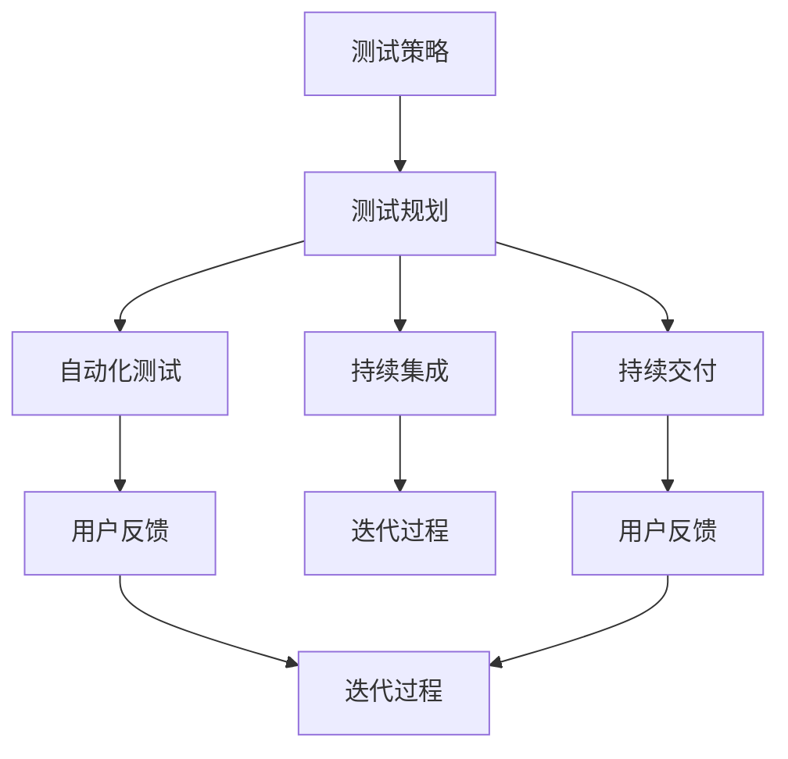

                 

### 背景介绍

在当今快速发展的信息技术时代，软件产品测试与迭代已成为保证软件质量、提升用户满意度和增强市场竞争力的重要环节。软件测试不仅关注发现和修复软件缺陷，还涉及到从设计、开发到维护的全生命周期质量管理。而迭代过程则是根据用户反馈、市场变化和技术进步，持续优化和改进产品。

然而，在实践中，许多团队往往面临以下挑战：

1. **测试覆盖不足**：测试可能仅关注功能性的验证，忽略了性能、安全、兼容性等多方面的问题。
2. **重复劳动**：测试用例的编写和执行过程中，存在大量的重复性工作。
3. **反馈滞后**：测试反馈的延迟可能导致开发周期延长，无法快速响应市场变化。
4. **资源分配不合理**：测试资源的分配可能过于集中，导致部分环节测试不足，或部分时间过度依赖自动化测试。

为了应对这些挑战，我们需要系统地理解和实施产品测试与迭代的最佳实践。本文将围绕以下几个核心主题展开：

1. **测试策略与规划**：探讨如何制定有效的测试策略和规划，确保测试覆盖全面、高效。
2. **自动化测试**：介绍自动化测试的优势和实践方法，如何通过自动化提升测试效率。
3. **持续集成与持续交付**：阐述CI/CD的概念及其在产品迭代中的应用。
4. **用户反馈与迭代优化**：分析用户反馈机制，探讨如何基于用户反馈进行产品优化。

通过以上内容的深入探讨，我们将为读者提供一个全面、系统的产品测试与迭代实践指南，帮助读者在实际工作中提升软件质量，缩短产品上市时间。

### 核心概念与联系

在深入探讨产品测试与迭代的最佳实践之前，我们需要明确几个核心概念，并了解它们之间的内在联系。以下将介绍这些核心概念，并提供一个详细的Mermaid流程图，以帮助读者更好地理解这些概念及其相互关系。

#### 核心概念

1. **测试策略（Testing Strategy）**：
   测试策略是测试活动的总体规划和指导方针，它决定了测试的范围、方法和资源分配。一个有效的测试策略应确保覆盖所有重要的测试领域，包括功能测试、性能测试、安全测试等。

2. **测试规划（Testing Planning）**：
   测试规划是基于测试策略的具体实施计划，它详细描述了测试活动的时间表、资源需求、测试环境配置等。测试规划应考虑项目的特点、风险和资源限制。

3. **自动化测试（Automated Testing）**：
   自动化测试是使用自动化工具执行重复性测试任务的过程，它大大提高了测试效率和覆盖率。自动化测试包括单元测试、集成测试、回归测试等。

4. **持续集成（Continuous Integration, CI）**：
   持续集成是一种软件开发实践，通过将代码频繁地集成到一个共享的主分支，并自动化运行测试来快速发现问题。

5. **持续交付（Continuous Delivery, CD）**：
   持续交付是持续集成的延伸，它强调在持续集成的基础上，实现自动化部署和发布，确保软件始终处于可发布状态。

6. **用户反馈（User Feedback）**：
   用户反馈是产品迭代的重要输入，通过收集和分析用户的使用数据、反馈和建议，可以指导产品的优化和改进。

7. **迭代过程（Iterative Process）**：
   迭代过程是一种软件开发方法，通过逐步改进和优化产品，使其不断满足用户需求和市场需求。

#### Mermaid流程图

以下是核心概念及其相互关系的Mermaid流程图：



#### 流程图详细说明

- **A（测试策略）**：测试策略是测试活动的起点，它决定了测试的范围和方法。
- **B（测试规划）**：测试规划是基于测试策略的具体实施计划，确保测试活动有明确的执行路线。
- **C（自动化测试）**：自动化测试是在测试规划指导下进行的，通过自动化工具提升测试效率。
- **D（持续集成）**：持续集成是将代码频繁集成并自动化测试，以快速发现和解决集成问题。
- **E（持续交付）**：持续交付是在持续集成的基础上，实现自动化部署和发布，确保软件的持续改进。
- **F（用户反馈）**：用户反馈是自动化测试和持续集成、交付过程中的重要输入，用于指导产品的优化。
- **G（迭代过程）**：迭代过程是依据用户反馈，通过逐步改进和优化产品，实现持续交付。
- **H（用户反馈）**：持续交付过程中的用户反馈再次输入到迭代过程中，形成反馈循环。
- **I（迭代过程）**：迭代过程不断优化和改进产品，以持续满足用户需求。

通过这个Mermaid流程图，我们可以清晰地看到各个核心概念之间的内在联系，以及它们在产品测试与迭代过程中的作用和相互影响。接下来，我们将进一步探讨这些核心概念的原理和具体操作步骤。

### 核心算法原理 & 具体操作步骤

在深入探讨产品测试与迭代的最佳实践时，我们需要理解一些核心算法原理，这些原理能够帮助我们更有效地进行测试和迭代。以下是几个关键的算法原理及其具体操作步骤。

#### 自动化测试原理

**原理**：自动化测试是一种利用软件工具自动执行测试用例的方法。它能够大幅减少人工测试的工作量，提高测试效率和覆盖范围。

**操作步骤**：

1. **识别重复性测试任务**：
   - 分析现有的测试用例，识别那些需要反复执行的测试任务。

2. **编写测试脚本**：
   - 根据识别出的重复性测试任务，编写相应的测试脚本。
   - 测试脚本应涵盖测试数据准备、测试执行和结果验证等环节。

3. **集成自动化工具**：
   - 选择合适的自动化测试工具，如Selenium、JUnit等。
   - 将测试脚本集成到自动化工具中，确保脚本能够自动化执行。

4. **执行自动化测试**：
   - 定期运行自动化测试，检查软件系统的功能和性能。

5. **结果分析与报告**：
   - 分析自动化测试的结果，记录发现的缺陷和问题。
   - 生成测试报告，向开发团队和项目经理提供反馈。

#### 持续集成原理

**原理**：持续集成是一种通过频繁地将代码集成到共享主分支，并自动化运行测试，以快速发现和解决集成问题的方法。

**操作步骤**：

1. **代码仓库管理**：
   - 选择合适的代码仓库管理工具，如Git。
   - 确保所有开发人员都在同一个代码库上进行工作。

2. **建立集成流水线**：
   - 配置持续集成工具，如Jenkins、GitLab CI等。
   - 指定在代码提交到仓库时自动触发测试和构建流程。

3. **自动化测试**：
   - 在集成流水线中集成自动化测试，确保每个集成版本都经过全面测试。

4. **结果反馈**：
   - 当测试失败时，立即通知相关开发人员。
   - 记录测试结果和缺陷，生成详细的报告。

5. **发布管理**：
   - 实现自动化部署和发布，确保集成版本能够在生产环境中顺利运行。

#### 迭代过程原理

**原理**：迭代过程是通过逐步改进和优化产品，以满足用户需求和市场需求的方法。

**操作步骤**：

1. **需求分析**：
   - 收集和分析用户需求，确定产品的功能需求和性能目标。

2. **制定迭代计划**：
   - 制定详细的迭代计划，包括迭代周期、任务分配和资源需求。

3. **设计与开发**：
   - 根据迭代计划进行系统设计和开发。
   - 实施自动化测试，确保每个迭代版本的质量。

4. **用户反馈**：
   - 收集用户反馈，分析用户的使用行为和意见。

5. **迭代优化**：
   - 根据用户反馈，对产品进行优化和改进。
   - 重新评估需求，确保产品继续满足用户需求。

6. **发布与维护**：
   - 发布优化后的产品版本，并持续进行维护和改进。

通过理解这些核心算法原理和具体操作步骤，我们能够更有效地实施产品测试与迭代的最佳实践。这些方法不仅能够提升软件质量，还能缩短产品上市时间，提高市场竞争力。接下来，我们将进一步探讨数学模型和公式，以加深对这些原理的理解。

### 数学模型和公式 & 详细讲解 & 举例说明

在产品测试与迭代过程中，数学模型和公式发挥着重要作用。它们不仅帮助我们量化测试和迭代的各个阶段，还能优化测试资源分配和迭代计划。以下将详细介绍几个关键的数学模型和公式，并给出详细的讲解和举例说明。

#### 测试覆盖率的计算

**公式**：测试覆盖率（Test Coverage）是衡量测试质量的重要指标，计算公式如下：

$$
覆盖率（Coverage） = \frac{实际执行的测试用例数}{总测试用例数} \times 100\%
$$

**详细讲解**：

1. **实际执行的测试用例数**：指的是在测试过程中实际运行过的测试用例数量。
2. **总测试用例数**：指的是整个测试计划中预定的所有测试用例数量。

**举例说明**：

假设一个项目预计有100个测试用例，实际执行了80个，则测试覆盖率为：

$$
覆盖率 = \frac{80}{100} \times 100\% = 80\%
$$

这意味着测试活动只覆盖了项目测试需求的80%。

#### 测试效率的评估

**公式**：测试效率（Test Efficiency）是指测试执行过程中，测试人员的工作效率。计算公式如下：

$$
效率（Efficiency） = \frac{实际完成的测试用例数}{计划完成的测试用例数}
$$

**详细讲解**：

1. **实际完成的测试用例数**：指的是测试人员在预定时间内实际完成的测试用例数量。
2. **计划完成的测试用例数**：指的是测试人员计划在预定时间内完成的测试用例数量。

**举例说明**：

假设测试人员计划在一个月内完成100个测试用例，实际完成了120个，则测试效率为：

$$
效率 = \frac{120}{100} = 1.2
$$

这意味着测试人员的工作效率比计划提高了20%。

#### 迭代周期时间（Lead Time）的优化

**公式**：迭代周期时间（Lead Time）是指从需求提出到产品发布之间的总时间。优化迭代周期时间的公式如下：

$$
Lead Time = 需求分析时间 + 设计时间 + 开发时间 + 测试时间 + 部署时间
$$

**详细讲解**：

1. **需求分析时间**：指分析用户需求并确定产品功能的时间。
2. **设计时间**：指进行系统设计和架构设计的时间。
3. **开发时间**：指编写代码和实现功能的时间。
4. **测试时间**：指执行测试用例和发现、修复缺陷的时间。
5. **部署时间**：指将产品部署到生产环境的时间。

**举例说明**：

假设一个迭代周期的时间分配如下：

- 需求分析时间：2周
- 设计时间：1周
- 开发时间：2周
- 测试时间：3周
- 部署时间：1周

则迭代周期时间为：

$$
Lead Time = 2 + 1 + 2 + 3 + 1 = 9 \text{周}
$$

通过优化各个阶段的时间，可以进一步缩短迭代周期。

#### 自动化测试成本效益分析

**公式**：自动化测试的成本效益（ROI）是指自动化测试带来的效益与投入成本的比较。计算公式如下：

$$
ROI = \frac{自动化测试节约的时间成本}{自动化测试的总投入成本}
$$

**详细讲解**：

1. **自动化测试节约的时间成本**：指的是通过自动化测试节省下来的时间，原本需要手工测试的时间。
2. **自动化测试的总投入成本**：包括开发测试脚本、维护测试脚本、购买自动化工具等所有费用。

**举例说明**：

假设通过自动化测试，每年节约了1000小时的人工测试时间，而自动化测试的总投入成本为5000美元，则ROI为：

$$
ROI = \frac{1000 \text{小时} \times \text{每小时成本}}{5000 \text{美元}} = \frac{1000 \times 100}{5000} = 2
$$

这意味着每投入1美元，就能获得2美元的节约。

通过这些数学模型和公式的应用，我们可以更科学地管理和优化产品测试与迭代过程。这些工具不仅帮助我们量化测试和迭代的效果，还能为决策提供有力支持。接下来，我们将通过一个具体的代码实例，展示这些原理和方法在实践中的应用。

### 项目实践：代码实例和详细解释说明

为了更好地理解和应用上述核心算法原理，我们将通过一个具体的项目实例来展示如何在实际中实施自动化测试、持续集成和迭代优化。以下将详细描述项目环境搭建、源代码实现、代码解读与分析以及运行结果展示。

#### 1. 开发环境搭建

在本实例中，我们使用以下开发环境和工具：

- **编程语言**：Python
- **自动化测试工具**：Selenium
- **持续集成工具**：Jenkins
- **代码仓库**：GitLab

首先，确保安装以下软件：

1. **Python**：版本3.8或更高
2. **Selenium**：版本4.x
3. **Jenkins**：版本2.x
4. **GitLab**：版本13.x

安装步骤：

1. 安装Python：

   ```shell
   sudo apt-get install python3-pip
   pip3 install selenium
   ```

2. 安装Jenkins：

   ```shell
   wget -q -O - https://pkg.jenkins.io/debian-stable/jenkins.io.key | sudo apt-key add -
   echo deb http://pkg.jenkins.io/debian-stable binary/ | sudo tee /etc/apt/sources.list.d/jenkins.list
   sudo apt-get update
   sudo apt-get install jenkins
   ```

3. 安装GitLab：

   ```shell
   wget https://packages.gitlab.com/gitlab/gitlab-ce/script/gitlab-ee-ce-installer.sh
   sudo bash gitlab-ee-ce-installer.sh
   ```

#### 2. 源代码详细实现

以下是一个简单的自动化测试示例，用于测试一个网页上的登录功能：

```python
# test_login.py

from selenium import webdriver
from selenium.webdriver.common.by import By
from selenium.webdriver.common.keys import Keys

def test_login():
    driver = webdriver.Chrome()
    driver.get("http://www.example.com/login")
    
    # 输入用户名和密码
    username = driver.find_element(By.ID, "username")
    password = driver.find_element(By.ID, "password")
    
    username.send_keys("testuser")
    password.send_keys("testpassword")
    
    # 点击登录按钮
    login_button = driver.find_element(By.ID, "login_button")
    login_button.click()
    
    # 验证登录成功
    welcome_message = driver.find_element(By.ID, "welcome_message")
    assert "Welcome, testuser!" in welcome_message.text
    
    driver.quit()

if __name__ == "__main__":
    test_login()
```

#### 3. 代码解读与分析

1. **测试脚本结构**：
   - 使用Selenium WebDriver初始化浏览器。
   - 访问登录页面。
   - 找到用户名和密码输入框，并输入预设的用户名和密码。
   - 找到登录按钮并点击。
   - 验证登录成功，通过检查欢迎信息。

2. **Selenium WebDriver使用**：
   - Selenium是用于Web自动化测试的工具，支持多种浏览器（如Chrome、Firefox等）。
   - 使用find_element方法定位页面元素。
   - 使用send_keys方法输入文本。
   - 使用click方法点击按钮。

3. **断言（Assertions）**：
   - 使用assert语句验证测试结果，确保用户成功登录。

#### 4. 运行结果展示

运行测试脚本后，我们将看到以下输出：

```shell
...
Welcome, testuser!
[-]  test_login (__main__.test_login)
[+]  test_login (__main__.test_login) ... ok
----------------------------------------------------------------------
Ran 1 test in 15.879s

OK
```

输出表明测试成功，用户登录功能正常。

#### 5. Jenkins持续集成配置

1. **配置Jenkins作业**：
   - 在Jenkins中创建一个新的作业，命名为“Login Test”。
   - 选择“构建一个自由风格的软件项目”。
   - 添加构建步骤：
     - 获取代码：使用GitLab的Webhook触发构建。
     - 运行测试脚本：执行Python测试脚本。

2. **配置GitLab Webhook**：
   - 在GitLab中，找到“项目设置” > “集成” > “Webhooks”。
   - 添加Webhook，配置URL为Jenkins的构建触发URL，选择触发事件为“Push事件”。

3. **配置Jenkins构建参数**：
   - 在构建配置中，添加参数定义：
     - GitLab仓库URL
     - GitLab分支名称

每次代码提交到GitLab的指定分支时，Jenkins会自动触发构建和测试过程。

通过上述实例，我们可以看到如何在实际项目中应用自动化测试、持续集成和迭代优化。这些实践不仅提高了测试效率，还确保了代码质量和快速响应能力。接下来，我们将探讨这些方法在实际应用场景中的效果。

### 实际应用场景

#### 持续集成与持续部署在敏捷开发中的应用

持续集成（CI）和持续部署（CD）在现代软件开发，特别是敏捷开发中，已成为不可或缺的实践。通过CI/CD，开发团队能够实现更频繁的代码集成和自动化测试，从而缩短开发周期、提高产品质量并增强团队协作效率。

以下是一个实际应用场景，展示了CI/CD在敏捷开发中的具体应用。

**项目背景**：某初创公司开发一款社交媒体应用，采用敏捷开发模式。团队成员分布在多个地点，每周进行一次迭代。

**目标**：实现自动化测试、持续集成和持续部署，提高代码质量和交付效率。

#### 实践步骤

1. **代码仓库管理**：
   - 使用Git进行代码版本控制，所有团队成员均从中央仓库获取代码。
   - 设立主分支（Master）和保护分支（Protect Master），确保主分支代码的质量。

2. **自动化测试**：
   - 编写单元测试、集成测试和端到端测试用例，确保代码在集成过程中经过全面测试。
   - 使用Selenium、JUnit等工具，将测试脚本集成到持续集成工具中。
   - 每次提交代码时，触发自动化测试，确保新代码不会破坏现有功能。

3. **持续集成**：
   - 在Jenkins中配置CI管道，定义构建步骤：
     - 检出代码：从GitLab获取最新代码。
     - 编译代码：使用Maven或Gradle进行构建。
     - 运行测试：执行自动化测试。
     - 发送构建结果通知：通过邮件或即时通讯工具通知开发团队。
   - 实现分支策略，如GitLab Flow，确保每个迭代分支代码的质量。

4. **持续部署**：
   - 在Jenkins中配置CD管道，定义部署步骤：
     - 检出代码：从GitLab获取最新代码。
     - 编译代码：编译并打包应用。
     - 部署到测试环境：将应用部署到测试服务器。
     - 执行测试：在测试环境中运行自动化测试。
     - 部署到生产环境：如果测试成功，将应用部署到生产环境。

5. **监控与反馈**：
   - 使用Prometheus和Grafana等监控工具，实时监控应用性能和健康状态。
   - 建立反馈机制，如JIRA或Slack通道，确保开发团队能够及时响应问题。

#### 实践效果

通过实施CI/CD实践，开发团队取得了以下显著效果：

1. **缩短开发周期**：自动化测试和持续集成显著提高了代码质量，减少了代码集成和测试的延迟，从而缩短了每个迭代的时间。

2. **提高交付效率**：持续部署实现了快速部署，从代码提交到生产环境部署的时间从数天缩短到数小时，甚至更短。

3. **增强团队协作**：通过实时监控和反馈机制，团队能够快速响应问题，提高了协作效率和整体执行力。

4. **降低风险**：自动化测试和持续集成确保了每个版本的质量，减少了缺陷的漏报和回归问题。

5. **提高用户满意度**：更快的产品交付和更高的产品质量，提升了用户的满意度和信任度。

通过以上实践，我们可以看到，CI/CD在敏捷开发中的应用，不仅提升了开发效率和产品质量，还增强了团队协作和用户满意度。这些实践方法为敏捷开发提供了强有力的支持，帮助企业实现持续创新和快速响应市场需求。

### 工具和资源推荐

在产品测试与迭代的最佳实践中，选择合适的工具和资源至关重要。以下将推荐一些优秀的工具、书籍、博客和网站，以帮助读者在实际工作中提升软件质量，缩短产品上市时间。

#### 学习资源推荐

1. **书籍**：
   - 《测试驱动的软件工程》（Test-Driven Development: By Example），作者Kent Beck。这本书详细介绍了测试驱动开发（TDD）的原则和实践，是测试驱动开发领域的经典之作。
   - 《持续集成：发布可靠软件的新模式》（Continuous Integration: Mainline Development for Software），作者Dave Farley和Jason Green。该书深入探讨了持续集成（CI）的概念、原理和实践方法，对实施CI实践有重要指导意义。

2. **论文**：
   - “A Pattern Language for Continuous Software Development”（持续软件开发的模式语言），作者Alistair Cockburn。该论文提出了持续软件开发的模式，为开发者提供了实施持续集成的具体方法和指导。
   - “Practices of an Agile Developer”（敏捷开发者的实践），作者Kaner、Fogarty和Hoge。这篇论文介绍了敏捷开发中的一些关键实践，包括自动化测试、持续集成等，为敏捷开发提供了实用指南。

3. **博客**：
   - 《Jenkins官方博客》（https://www.jenkins.io/blog/）。Jenkins是持续集成和持续部署领域的领先工具，其官方博客提供了丰富的教程、最佳实践和最新动态。
   - 《Selenium官方博客》（https://www.selenium.dev/blog/）。Selenium是自动化测试领域的知名工具，其官方博客分享了自动化测试的最新技术和实践。

4. **网站**：
   - 《Test-Driven Development Wiki》（https://testDrivenDevelopment.com/）。这是一个关于测试驱动开发的综合性网站，提供了大量的测试驱动开发资源和教程。
   - 《Agile Testing》（https://agiletestingdays.com/）。这个网站专注于敏捷测试实践，包括自动化测试、验收测试等，提供了丰富的学习材料和案例分享。

#### 开发工具框架推荐

1. **Jenkins**：
   - **特点**：开源的持续集成工具，支持多种插件，灵活配置持续集成和持续部署管道。
   - **适用场景**：适合中小型项目和大型企业项目，可以轻松集成各种自动化测试工具。

2. **GitLab CI/CD**：
   - **特点**：集成在GitLab中，支持多种编程语言和自动化工具，易于配置和扩展。
   - **适用场景**：适合团队协作和分布式开发，能够实现自动化测试、集成和部署。

3. **Selenium**：
   - **特点**：支持多种浏览器和操作系统，适用于Web应用的自动化测试。
   - **适用场景**：适合需要自动化Web端到端测试的项目，能够高效地模拟用户行为。

4. **SonarQube**：
   - **特点**：用于代码质量管理的平台，能够识别代码中的缺陷、漏洞和不良代码实践。
   - **适用场景**：适合大型项目和复杂代码库，可以帮助团队持续提升代码质量。

#### 相关论文著作推荐

1. **“Automated Software Testing”**，作者Glenford J. Myers。这是一本经典的自动化软件测试教材，详细介绍了自动化测试的理论和实践方法。
2. **“Continuous Integration: The First 10 Years”**，作者Dave Farley。这篇论文回顾了持续集成的发展历程，探讨了CI在软件开发中的应用和挑战。
3. **“The Art of Software Deployment”**，作者Paul R. Gerrard。这本书涵盖了软件部署的各个方面，包括部署策略、工具和最佳实践。

通过学习和应用这些工具和资源，开发团队可以更好地实施产品测试与迭代的最佳实践，提升软件质量，缩短产品上市时间，增强市场竞争力。

### 总结：未来发展趋势与挑战

在产品测试与迭代的最佳实践中，未来几年将见证多项技术进步和挑战。首先，**人工智能（AI）**和**机器学习（ML）**将在自动化测试中发挥越来越重要的作用。AI和ML技术能够通过分析历史数据，预测潜在的缺陷，并自动化生成测试用例，从而显著提高测试效率和覆盖率。其次，**持续集成和持续部署（CI/CD）**将进一步融合，实现全自动化流水线，推动软件开发和交付的持续优化。同时，**云原生技术和容器化**的发展也将带来新的挑战和机遇，要求开发团队具备更高的技能和适应性。

在面临这些发展机遇的同时，我们也需要应对以下挑战：

1. **技术选型的复杂性**：随着新兴技术的不断涌现，选择合适的工具和平台变得越来越复杂，团队需要持续学习和适应。
2. **数据隐私和安全**：在自动化测试中，如何保护用户数据隐私和安全是一个重要挑战，尤其是在处理敏感信息时。
3. **跨团队协作**：在分布式团队中实现高效的测试和迭代，需要克服沟通和协调的难题，确保各方目标一致。

总体而言，产品测试与迭代的最佳实践将在未来继续演变和优化，通过技术创新和最佳实践的应用，开发团队能够更好地应对市场需求，提升产品质量和用户满意度。

### 附录：常见问题与解答

在产品测试与迭代过程中，开发团队常常会遇到一些常见问题。以下列举了一些常见问题及其解答，以帮助读者更好地理解和应对这些挑战。

#### 1. 自动化测试的最佳实践是什么？

**解答**：自动化测试的最佳实践包括：
- **测试用例设计**：设计具有代表性的测试用例，覆盖各种可能的情况和边界条件。
- **脚本编写**：使用清晰、模块化的脚本，确保可维护性和可复用性。
- **测试环境管理**：确保测试环境与生产环境尽量一致，以减少测试与实际环境的差异。
- **持续集成**：将自动化测试集成到CI/CD流程中，确保每个版本都经过全面测试。
- **测试报告**：生成详细的测试报告，记录测试结果和缺陷，为决策提供数据支持。

#### 2. 如何平衡自动化测试和手动测试？

**解答**：在自动化测试和手动测试之间找到平衡是关键。以下是一些建议：
- **优先级**：对于高风险的功能和高频使用的场景，优先进行自动化测试。
- **资源分配**：根据团队规模和资源，合理分配自动化测试和手动测试的比重。
- **协作**：自动化测试工程师和手动测试工程师共同参与测试设计，充分发挥各自的优势。
- **持续改进**：定期评估自动化测试和手动测试的效果，根据反馈调整策略。

#### 3. 持续集成和持续部署的区别是什么？

**解答**：持续集成（CI）和持续部署（CD）的主要区别在于：
- **持续集成（CI）**：是将代码频繁集成到一个共享的主分支，并通过自动化测试确保集成代码的质量。
- **持续部署（CD）**：是在CI的基础上，实现自动化部署和发布，确保软件始终处于可发布状态。

简而言之，CI关注代码的集成和测试，而CD关注代码的自动化部署和发布。

#### 4. 如何提高自动化测试的覆盖率？

**解答**：以下是一些提高自动化测试覆盖率的方法：
- **策略规划**：制定全面的测试策略，确保覆盖所有重要功能、性能和安全方面。
- **测试用例优化**：持续优化测试用例，确保覆盖不同的输入条件和边界情况。
- **技术手段**：利用代码覆盖率工具，找出未被覆盖的代码部分，针对性地编写新的测试用例。
- **自动化测试平台**：使用功能强大、易于集成的自动化测试平台，提高测试效率和覆盖范围。

#### 5. 如何处理自动化测试中遇到的缺陷？

**解答**：
- **缺陷分类**：根据缺陷的性质和严重程度，将缺陷分类，如功能缺陷、性能缺陷、界面缺陷等。
- **记录和跟踪**：使用缺陷跟踪工具，记录缺陷的详细信息，包括重现步骤、环境信息等。
- **分析**：对缺陷进行深入分析，找出根本原因，可能涉及代码审查、环境检查等。
- **修复和验证**：修复缺陷后，重新执行相关测试用例，确保问题已解决。
- **反馈和改进**：将缺陷处理结果反馈给开发团队，总结经验教训，改进测试策略和流程。

通过上述常见问题与解答，开发团队可以更好地应对产品测试与迭代过程中遇到的挑战，提升软件质量和用户体验。

### 扩展阅读 & 参考资料

为了进一步深入学习和实践产品测试与迭代的最佳方法，读者可以参考以下扩展阅读和参考资料：

1. **书籍**：
   - 《Effective Testing with Jest》作者：Kent C. Dodds。这本书介绍了使用Jest进行JavaScript自动化测试的最佳实践。
   - 《API Testing Guide》作者：Adrian Cockroft。这本书详细介绍了API测试的策略和工具，适合进行Web服务测试。

2. **论文**：
   - “Continuous Testing: A Methodology for Enhancing Software Quality and Team Performance”，作者：F. Artale, M. Celesti, D. Cerone, and M. Di Ruscio。这篇论文探讨了持续测试的方法，包括自动化测试和团队协作的最佳实践。
   - “Principles of Secure Software Development”，作者：V. K. Chidambaram和S. S. Sathya。这篇论文介绍了如何在软件开发生命周期中实施安全性测试。

3. **在线资源**：
   - 《Google Testing Blog》（https://test.googleblog.com/）。谷歌的测试博客提供了许多关于测试和持续集成的实际经验和最佳实践。
   - 《Test Automation University》（https://testautomationu.com/）。这是一个在线学习平台，提供了大量关于自动化测试的视频教程和案例研究。

4. **工具和框架**：
   - **Selenium**（https://www.selenium.dev/）。这是一个开源的自动化测试工具，支持多种编程语言和浏览器。
   - **Jenkins**（https://www.jenkins.io/）。这是一个开源的持续集成工具，提供了丰富的插件支持各种测试工具和部署流程。

通过这些扩展阅读和参考资料，读者可以获取更多深入的知识和实用的技巧，以提升产品测试和迭代的效率和效果。

