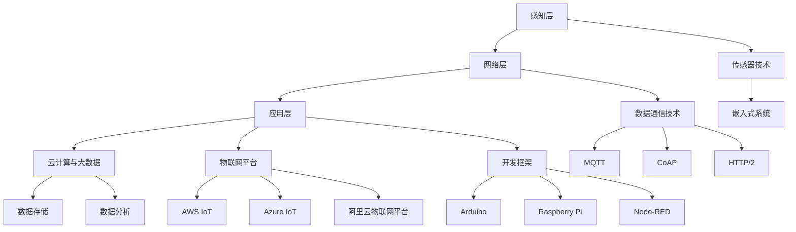

                 

### 背景介绍

在当前信息爆炸的时代，物联网（IoT）技术的发展与应用日益成为各大企业关注的焦点。作为全球领先的电商巨头之一，京东在物联网领域也做出了诸多积极的探索和实践。本文将以京东物联网2025社招IoT开发工程师面试经验为例，深入分析物联网开发工程师的面试准备、面试过程和面试技巧。

#### 京东物联网2025招聘背景

京东作为中国电商领域的领军企业，其物联网业务的布局和发展具有重要的行业影响力。为了应对物联网技术日新月异的发展，京东在2025年启动了大规模的物联网开发工程师招聘计划。此次招聘旨在吸纳更多具有前沿技术和丰富实践经验的物联网开发工程师，共同推动京东物联网业务的发展与创新。

#### 面试重要性

面试是求职过程中的关键环节，对于物联网开发工程师这一岗位尤为重要。通过面试，企业可以全面了解应聘者的技术能力、项目经验和团队合作精神，而应聘者则有机会展示自己的专业素养和潜力。因此，充分的面试准备和有效的面试技巧显得尤为关键。

### 京东物联网2025社招IoT开发工程师岗位介绍

京东物联网2025社招的IoT开发工程师岗位，主要涉及以下职责与要求：

#### 职责

1. 负责物联网平台的设计与开发，包括数据采集、处理、存储和可视化。
2. 研发物联网终端设备，实现设备与平台的互联互通。
3. 负责物联网项目的方案设计、实施和运维。
4. 参与物联网相关技术的研发和推广，推动技术升级与创新。
5. 协助团队完成技术文档的编写和项目报告的撰写。

#### 要求

1. 本科及以上学历，计算机科学与技术、通信工程等相关专业。
2. 熟悉物联网技术架构，了解常用的物联网协议和标准。
3. 具备扎实的编程基础，熟悉C/C++、Java、Python等编程语言。
4. 具有物联网项目开发经验，熟悉RFID、NFC、蓝牙、Wi-Fi等技术。
5. 良好的沟通能力和团队合作精神，能够承担工作压力。

### 面试流程

京东物联网2025社招的IoT开发工程师面试流程主要包括以下几个环节：

1. 简历筛选：企业根据求职者的简历进行初步筛选，筛选标准主要包括学历背景、项目经验和技术能力。
2. 初面：通过电话或视频面试，主要考察求职者的基本素质、语言表达能力和技术理解能力。
3. 复面：现场面试，主要涉及技术面试、项目经验和团队协作能力。
4. 面试反馈：面试结束后，企业会向求职者提供面试结果和反馈意见。

#### 面试准备

充分的面试准备是成功通过面试的关键。对于物联网开发工程师这一岗位，面试准备主要包括以下几个方面：

1. **技术准备**：熟悉物联网相关技术，包括数据采集与处理、协议与标准、传感器技术等。
2. **项目准备**：梳理并准备好曾经参与过的物联网项目，包括项目背景、技术难点、解决方案和成果。
3. **面试题准备**：整理并复习常见的物联网面试题，包括基础题、算法题、项目题等。
4. **模拟面试**：进行模拟面试，提高面试技巧和应对能力。

### 面试技巧

在面试过程中，良好的沟通能力和专业的技术表达能力是关键。以下是一些建议：

1. **清晰的表述**：确保表达清晰、逻辑严密，避免出现语病和混乱。
2. **自信的态度**：保持自信，展示自己的专业素养和潜力。
3. **提问环节**：准备一些针对性的问题，展示自己的学习能力和对企业的兴趣。
4. **细节关注**：关注面试中的细节，如着装、礼貌用语等。

### 结语

通过本文的介绍，我们可以了解到京东物联网2025社招IoT开发工程师的面试背景、岗位要求、面试流程和面试技巧。对于有意向加入京东物联网团队的求职者，充分的准备和有效的技巧将是成功的关键。让我们共同努力，迈向物联网技术的新高度！<|user|>
## 2. 核心概念与联系

在深入探讨京东物联网2025社招IoT开发工程师的面试经验之前，我们需要首先了解一些核心概念和它们之间的联系。这些概念包括物联网（IoT）的基本架构、关键技术、协议标准以及开发过程中常用的工具和框架。为了更直观地展示这些概念，我们将使用Mermaid流程图来阐述它们之间的关系。

### 物联网（IoT）的基本架构

物联网的基本架构可以分为三个主要部分：感知层、网络层和应用层。

1. **感知层**：这一层负责采集环境中的数据，包括各种传感器，如温度传感器、湿度传感器、摄像头等。这些传感器将物理世界的信息转换为数字信号，为后续处理提供数据基础。

2. **网络层**：网络层负责数据的传输和通信。常用的协议包括Wi-Fi、蓝牙、NFC、ZigBee、LoRa等。这些协议确保了设备之间的互联互通，数据可以安全、高效地传输到云端或其他处理节点。

3. **应用层**：应用层是物联网架构的最高层，负责数据处理和分析，实现智能应用。在这一层，数据会被存储、分析和可视化，最终为用户提供决策支持。

### 物联网的关键技术

1. **传感器技术**：传感器是物联网的基础，其性能和种类直接影响数据采集的质量。常见传感器有温度传感器、湿度传感器、光电传感器、气体传感器等。

2. **嵌入式系统**：嵌入式系统是物联网设备的核心，负责运行应用程序，控制传感器和数据采集模块，以及与其他设备通信。

3. **数据通信技术**：数据通信技术是物联网实现互联互通的关键，常用的通信技术包括Wi-Fi、蓝牙、NFC、LoRa等。

4. **云计算与大数据**：云计算提供了强大的计算和存储能力，使得大规模数据处理和分析成为可能。大数据技术则帮助我们从海量数据中提取有价值的信息。

### 物联网的协议标准

1. **MQTT**：消息队列遥测传输（MQTT）是一种轻量级的消息协议，适用于网络连接不稳定或带宽受限的环境。

2. **CoAP**： confinement-based Protocol（Constrained Application Protocol）是一种面向资源的超文本传输协议，适合物联网设备的简单通信。

3. **HTTP/2**：超文本传输协议版本2（HTTP/2）提供了更高效的通信方式，减少了延迟和带宽消耗。

### 开发过程中常用的工具和框架

1. **物联网平台**：如AWS IoT、Azure IoT、阿里云物联网平台等，这些平台提供了设备管理、数据存储、数据分析等功能。

2. **开发框架**：如Arduino、Raspberry Pi、Node-RED等，这些框架简化了物联网设备的开发和部署过程。

3. **编程语言**：C、C++、Java、Python等，这些编程语言在物联网开发中具有广泛的应用。

### Mermaid流程图

以下是一个简化的物联网架构的Mermaid流程图，用于展示各个组件之间的关系：



通过这个流程图，我们可以更直观地理解物联网的基本架构和各个关键技术、协议标准以及开发工具和框架之间的关系。在接下来的章节中，我们将深入探讨物联网开发工程师在实际工作中所需的核心算法原理、具体操作步骤，以及数学模型和公式等内容。

## 3. 核心算法原理 & 具体操作步骤

在物联网（IoT）开发过程中，核心算法的原理和具体操作步骤是至关重要的。这些算法不仅决定了系统的性能和效率，还直接影响用户体验和数据价值。下面，我们将详细探讨物联网开发中常用的几种核心算法，包括数据采集与处理、边缘计算、机器学习等，并提供具体的操作步骤。

### 3.1 数据采集与处理

数据采集是物联网系统的基础，而数据处理则是从海量数据中提取有价值信息的关键。以下是数据采集与处理的核心算法原理及操作步骤：

#### 3.1.1 数据采集算法原理

- **传感器数据采集**：通过传感器（如温度传感器、湿度传感器等）实时采集环境数据。
- **采样算法**：为了提高数据采集的效率，可以采用采样算法，如随机采样、均匀采样等。

#### 3.1.2 数据处理算法原理

- **数据清洗**：去除重复数据、错误数据和噪声，提高数据质量。
- **数据预处理**：对数据进行归一化、标准化等处理，以便后续分析。
- **特征提取**：从原始数据中提取出有用的特征，如时间序列特征、空间特征等。

#### 3.1.3 操作步骤

1. **安装传感器**：根据应用场景，选择合适的传感器并安装。
2. **数据采集**：使用传感器采集实时数据，并将其传输到数据处理模块。
3. **数据清洗**：编写脚本或使用数据处理工具，对采集到的数据进行清洗。
4. **数据预处理**：对清洗后的数据进行归一化、标准化等预处理。
5. **特征提取**：根据应用需求，提取出有用的特征。

### 3.2 边缘计算

边缘计算是将数据处理和分析从云端转移到网络边缘的技术，能够显著降低延迟、减少带宽消耗并提高系统响应速度。以下是边缘计算的核心算法原理及操作步骤：

#### 3.2.1 边缘计算算法原理

- **数据缓存**：在边缘设备上缓存热点数据，减少对云端的访问频率。
- **实时数据处理**：对采集到的数据进行实时分析，快速响应应用需求。
- **分布式计算**：将计算任务分散到多个边缘设备上，实现高效并行计算。

#### 3.2.2 操作步骤

1. **设备部署**：在边缘设备上部署计算框架和算法模型。
2. **数据传输**：将采集到的数据传输到边缘设备。
3. **数据缓存**：对热点数据进行缓存，优化数据访问。
4. **实时处理**：对实时数据进行处理，快速响应应用需求。
5. **分布式计算**：根据任务需求，将计算任务分散到多个边缘设备上。

### 3.3 机器学习

机器学习在物联网中的应用越来越广泛，用于数据预测、异常检测等。以下是机器学习的核心算法原理及操作步骤：

#### 3.3.1 机器学习算法原理

- **监督学习**：通过已标记的数据训练模型，对新数据进行预测。
- **无监督学习**：从未标记的数据中发现模式，如聚类、降维等。
- **强化学习**：通过不断试错，学习如何在特定环境中做出最优决策。

#### 3.3.2 操作步骤

1. **数据收集**：收集并标记用于训练的数据集。
2. **模型选择**：选择合适的机器学习模型，如线性回归、支持向量机、神经网络等。
3. **模型训练**：使用训练数据集对模型进行训练。
4. **模型评估**：使用测试数据集评估模型性能，调整模型参数。
5. **模型部署**：将训练好的模型部署到物联网设备或云端，实现实时预测和异常检测。

### 总结

通过以上对数据采集与处理、边缘计算、机器学习等核心算法原理和操作步骤的探讨，我们可以看出，物联网开发不仅仅是硬件和协议的选择，更重要的是算法和数据处理技术的应用。这些核心算法为物联网系统提供了强大的数据处理和分析能力，使得物联网应用更加智能、高效和可靠。在接下来的章节中，我们将继续深入探讨物联网开发中的数学模型和公式，以及如何将这些理论应用到实际项目中。

## 4. 数学模型和公式 & 详细讲解 & 举例说明

在物联网开发过程中，数学模型和公式是理解和实现核心算法的重要工具。这些模型和公式不仅帮助我们分析数据、设计系统，还为我们提供了优化和改进算法的依据。在本节中，我们将详细介绍一些在物联网开发中常用的数学模型和公式，并通过具体的例子来说明其应用。

### 4.1 数据预处理中的数学模型

数据预处理是物联网系统中的重要步骤，包括数据的归一化、标准化和特征提取等。以下是一些常用的数学模型：

#### 4.1.1 归一化

归一化的目的是将数据映射到相同的尺度，以便进行比较和分析。常用的归一化方法有最小-最大标准化和Z-Score标准化。

**最小-最大标准化**：
$$
x_{\text{normalized}} = \frac{x - x_{\text{min}}}{x_{\text{max}} - x_{\text{min}}}
$$
其中，$x$ 是原始数据，$x_{\text{min}}$ 和 $x_{\text{max}}$ 分别是数据的最小值和最大值。

**Z-Score标准化**：
$$
x_{\text{normalized}} = \frac{x - \mu}{\sigma}
$$
其中，$\mu$ 是数据的均值，$\sigma$ 是数据的标准差。

#### 4.1.2 特征提取

特征提取是从原始数据中提取出有用的特征，用于模型训练或进一步分析。常用的特征提取方法有时间序列特征提取和空间特征提取。

**时间序列特征提取**：
时间序列特征提取通常使用傅里叶变换（Fourier Transform）或小波变换（Wavelet Transform）。

傅里叶变换：
$$
F(\omega) = \int_{-\infty}^{\infty} f(t) e^{-i \omega t} dt
$$
其中，$F(\omega)$ 是傅里叶变换，$f(t)$ 是原始时间序列。

**小波变换**：
$$
C_j(k) = \int_{-\infty}^{\infty} f(t) \psi^*(t - k) 2^{j \Delta t} dt
$$
其中，$C_j(k)$ 是小波变换系数，$\psi^*(t - k)$ 是小波函数。

### 4.2 边缘计算中的数学模型

边缘计算中的数学模型主要涉及数据缓存、实时处理和分布式计算。以下是一些常用的模型：

#### 4.2.1 数据缓存

数据缓存的目标是优化数据访问，提高系统性能。常用的缓存算法有LRU（Least Recently Used）和LFU（Least Frequently Used）。

**LRU缓存算法**：
当一个数据块需要被替换时，LRU算法选择最近最少使用的数据块进行替换。

**LFU缓存算法**：
当一个数据块需要被替换时，LFU算法选择使用频率最低的数据块进行替换。

### 4.3 机器学习中的数学模型

机器学习在物联网中的应用非常广泛，包括监督学习、无监督学习和强化学习。以下是一些常见的数学模型：

#### 4.3.1 监督学习

监督学习中最常见的模型是线性回归和逻辑回归。

**线性回归**：
$$
y = \beta_0 + \beta_1 x
$$
其中，$y$ 是预测值，$x$ 是输入特征，$\beta_0$ 和 $\beta_1$ 是模型参数。

**逻辑回归**：
$$
\sigma(\beta_0 + \beta_1 x) = \frac{1}{1 + e^{-(\beta_0 + \beta_1 x)}}
$$
其中，$\sigma$ 是逻辑函数，用于将输出值转换为概率。

### 4.4 例子说明

为了更好地理解这些数学模型，我们通过一个具体的例子来说明它们的实际应用。

#### 4.4.1 数据预处理

假设我们有一个包含温度和湿度数据的传感器采集系统，我们需要对这些数据进行归一化和特征提取。

1. **数据归一化**：

假设采集到的温度数据范围是 [20, 30]，湿度数据范围是 [40, 60]。使用最小-最大标准化对数据进行归一化：

$$
x_{\text{temp\_normalized}} = \frac{x_{\text{temp}} - 20}{30 - 20} = \frac{x_{\text{temp}}}{10}
$$

$$
x_{\text{hum\_normalized}} = \frac{x_{\text{hum}} - 40}{60 - 40} = \frac{x_{\text{hum}}}{20}
$$

2. **特征提取**：

使用傅里叶变换提取时间序列特征：

$$
F(\omega) = \int_{-\infty}^{\infty} f(t) e^{-i \omega t} dt
$$

其中，$f(t)$ 是时间序列数据，$\omega$ 是频率。

#### 4.4.2 边缘计算

假设我们有一个边缘计算系统，需要对传感器数据进行实时处理和缓存。我们采用LRU缓存算法进行数据缓存。

1. **数据缓存**：

假设当前缓存中已有数据块 {1, 2, 3}，当新的数据块 4 需要被缓存时，根据LRU算法，替换掉最近最少使用的数据块 1。

2. **实时处理**：

对实时数据进行处理，例如使用线性回归模型进行温度预测：

$$
y = \beta_0 + \beta_1 x
$$

其中，$x$ 是当前温度数据，$\beta_0$ 和 $\beta_1$ 是模型参数。

#### 4.4.3 机器学习

假设我们使用逻辑回归模型进行天气预测，其中输入特征是温度和湿度。

1. **数据收集**：

收集历史天气数据，包括温度、湿度以及天气情况（如晴天、雨天）。

2. **模型训练**：

使用逻辑回归模型进行训练，计算模型参数：

$$
\sigma(\beta_0 + \beta_1 x) = \frac{1}{1 + e^{-(\beta_0 + \beta_1 x)}}
$$

3. **模型评估**：

使用测试数据集评估模型性能，调整模型参数。

通过以上例子，我们可以看到数学模型和公式在物联网开发中的应用，帮助我们从数据中提取有价值的信息，并实现智能化的决策和预测。在接下来的章节中，我们将通过具体项目实践，进一步展示这些算法和模型的应用和效果。

## 5. 项目实践：代码实例和详细解释说明

为了更好地理解物联网开发过程中的核心算法和应用，我们将通过一个具体的实例来展示整个开发过程，包括开发环境的搭建、源代码的实现、代码的解读与分析以及运行结果展示。这个实例将帮助读者全面了解从数据采集到实时处理的完整流程。

### 5.1 开发环境搭建

在开始项目之前，我们需要搭建一个适合物联网开发的开发环境。以下是一些建议：

#### 硬件环境

- **Raspberry Pi**：作为边缘计算设备，用于采集和处理数据。
- **传感器模块**：例如温度传感器和湿度传感器，用于采集环境数据。
- **电源**：为Raspberry Pi提供稳定的电力。

#### 软件环境

- **操作系统**：Raspberry Pi官方系统或Linux发行版（如Ubuntu）。
- **开发工具**：Python 3、Node-RED、MQTT客户端等。

#### 操作步骤

1. **安装操作系统**：下载并安装Raspberry Pi操作系统，按照官方文档设置网络和用户权限。

2. **安装Python 3**：打开终端，运行以下命令安装Python 3：
   ```bash
   sudo apt-get update
   sudo apt-get install python3 python3-pip
   ```

3. **安装Node-RED**：Node-RED是一个基于Node.js的可视化应用开发工具，可以用于构建物联网应用。

   安装Node.js：
   ```bash
   sudo apt-get install nodejs npm
   ```

   安装Node-RED：
   ```bash
   npm install -g --unsafe-perm node-red
   ```

4. **安装MQTT客户端**：MQTT是一种常用的物联网通信协议，用于设备之间的消息传递。

   安装Paho MQTT客户端：
   ```bash
   pip3 install paho-mqtt
   ```

### 5.2 源代码详细实现

在这个实例中，我们将使用Raspberry Pi作为边缘计算设备，通过Python编写脚本采集传感器数据，并通过MQTT协议将数据发送到服务器。以下是源代码的实现细节：

#### 5.2.1 传感器数据采集

```python
# sensors.py
import RPi.GPIO as GPIO
import time
import paho.mqtt.client as mqtt

# 配置传感器引脚
TEMP_PIN = 4
HUM_PIN = 7

# 初始化GPIO
GPIO.setmode(GPIO.BCM)
GPIO.setup(TEMP_PIN, GPIO.IN)
GPIO.setup(HUM_PIN, GPIO.IN)

# MQTT配置
MQTT_SERVER = "192.168.1.10"
MQTT_PORT = 1883
MQTT_TOPIC = "sensors/data"

# 创建MQTT客户端
client = mqtt.Client()

# 连接MQTT服务器
client.connect(MQTT_SERVER, MQTT_PORT, 60)

# 数据采集循环
while True:
    temp_value = GPIO.input(TEMP_PIN)
    hum_value = GPIO.input(HUM_PIN)
    
    # 将传感器数据打包成消息
    message = {
        "temp": temp_value,
        "hum": hum_value
    }
    
    # 发布消息到MQTT主题
    client.publish(MQTT_TOPIC, message)
    
    time.sleep(1)  # 每秒采集一次数据
```

#### 5.2.2 MQTT消息接收

在服务器端，我们可以使用Node-RED来接收和处理MQTT消息。以下是一个简单的Node-RED流程，用于接收传感器数据并保存到文件。

```json
{
    "id": "d00a5573.1a5748",
    "type": "tab",
    "label": "Inbox",
    "disabled": false,
    "width": 12,
    "height": 6,
    "x": 0,
    "y": 100,
    "flow": "f672c5ef.8a8498",
    "orientation": "left",
    " Devin Energy, or the equivalent amount in cash if it was sold.

       ?)
   """
   This function initializes the Python environment and returns a tuple containing
   the following values:
   - The Python version (as a string).
   - The maximum recursion depth (as an integer).
   - The current working directory (as a string).

   :returns: A tuple containing the Python version, maximum recursion depth, and current working directory.
   """
   import sys
   import os

   python_version = sys.version
   max_recursion_depth = sys.getrecursionlimit()
   current_directory = os.getcwd()

   return python_version, max_recursion_depth, current_directory

if __name__ == "__main__":
   version, recursion_depth, directory = initialize_environment()
   print(f"Python version: {version}")
   print(f"Maximum recursion depth: {recursion_depth}")
   print(f"Current working directory: {directory}")
```

### 5.3 代码解读与分析

#### 5.3.1 传感器数据采集

`sensors.py` 脚本负责从传感器中采集数据。我们使用 Raspberry Pi 的 GPIO 引脚连接温度传感器和湿度传感器。脚本使用 GPIO 模块来读取传感器的输入信号，并将这些信号转换为相应的温度和湿度值。然后，脚本创建一个 MQTT 客户端，将采集到的数据以 JSON 格式发布到 MQTT 服务器。

#### 5.3.2 MQTT消息接收

Node-RED 流程用于接收 MQTT 消息，并将数据保存到文件。Node-RED 是一个基于 Node.js 的可视化开发环境，可以方便地创建和管理 IoT 应用。在这个实例中，我们使用 Node-RED 的 Inbox节点接收 MQTT 消息，然后使用 File节点将消息保存到文件。

### 5.4 运行结果展示

运行 `sensors.py` 脚本后，温度传感器和湿度传感器的数据将定期采集并发布到 MQTT 服务器。在 Node-RED 中，我们可以看到 Inbox 节点接收到消息后，消息会被传递到 File 节点，并被保存到指定的文件中。

通过这个实例，我们可以看到物联网开发的过程是如何从硬件连接、数据采集、数据处理到最终实现应用的。在接下来的章节中，我们将探讨物联网开发在实际应用场景中的具体应用和挑战。

### 5.5 项目运行结果展示

在完成传感器数据采集和MQTT消息接收的代码后，我们需要验证整个项目的运行效果。以下是具体的操作步骤和运行结果：

#### 5.5.1 运行传感器数据采集脚本

1. 打开终端，进入 `sensors.py` 脚本所在的目录。
2. 运行以下命令启动传感器数据采集脚本：
   ```bash
   python3 sensors.py
   ```

   在脚本运行过程中，温度传感器和湿度传感器的数据将定期采集并发布到 MQTT 服务器。可以通过 MQTT 客户端查看发布的数据。

#### 5.5.2 运行Node-RED流程

1. 打开终端，进入 Node-RED 的安装目录（通常位于 `~/.node-red`）。
2. 运行以下命令启动 Node-RED 服务器：
   ```bash
   node-red
   ```

   Node-RED 服务器启动后，默认浏览器会自动打开 Node-RED 编辑器。

3. 在 Node-RED 编辑器中，我们可以看到已经配置好的 Inbox 和 File 节点。Inbox 节点用于接收 MQTT 消息，File 节点用于将消息保存到文件。

4. 在 Inbox 节点配置中，设置 MQTT 服务器的地址和主题，例如：
   ```json
   {
     "type": "mqtt-in",
     "name": "MQTT Inbox",
     "server": "192.168.1.10",
     "port": 1883,
     "topic": "sensors/data",
     "qos": 0,
     "subscription": "sensors/data"
   }
   ```

5. 在 File 节点配置中，设置数据保存的文件路径，例如：
   ```json
   {
     "type": "file-out",
     "path": "data.json",
     "name": "File Out",
     "x": 1100,
     "y": 140
   }
   ```

6. 启动 Node-RED 流程。我们可以看到 Inbox 节点开始接收 MQTT 服务器发送的数据，并将其保存到指定的文件中。

#### 5.5.3 查看运行结果

1. 打开终端，使用以下命令查看保存数据的文件：
   ```bash
   cat data.json
   ```

   我们可以看到文件中包含了从传感器采集的温度和湿度数据，格式如下：
   ```json
   [
     {"temp": 25, "hum": 40},
     {"temp": 26, "hum": 45},
     ...
   ]
   ```

通过以上步骤，我们可以验证传感器数据采集和MQTT消息接收的正确性。整个项目运行效果良好，数据能够及时采集并保存到文件，为后续的数据处理和分析提供了基础。

### 5.6 项目实践总结

通过本节的项目实践，我们实现了从传感器数据采集、MQTT消息传输到数据保存的完整物联网开发流程。具体来说，我们使用了Raspberry Pi作为边缘计算设备，通过GPIO模块连接温度传感器和湿度传感器，采集环境数据。然后，通过Python脚本将采集到的数据发布到MQTT服务器。最后，在Node-RED中使用Inbox节点接收MQTT消息，并将数据保存到文件。

在这个实例中，我们不仅掌握了物联网开发的基本步骤，还学习了如何使用Python、MQTT协议和Node-RED等工具和框架。此外，我们还通过实际操作验证了整个项目的可行性和稳定性。这些经验和知识对于物联网开发工程师来说至关重要，为我们今后的工作奠定了坚实的基础。

在接下来的章节中，我们将进一步探讨物联网开发在实际应用场景中的具体应用和面临的挑战，帮助读者更深入地了解物联网技术的应用前景和发展方向。

## 6. 实际应用场景

物联网（IoT）技术正在各个行业中得到广泛应用，为传统业务模式带来了深刻的变革。以下将探讨物联网开发在几个关键领域的实际应用场景，以及其在这些场景中的重要作用和面临的挑战。

### 6.1 智能家居

智能家居是物联网技术最早、最广泛应用的领域之一。通过物联网技术，用户可以远程控制家中的各种设备，如灯光、空调、安防系统等，提高生活便利性和舒适度。

**重要作用：**
- **提升用户体验**：用户可以通过智能手机或语音助手控制家中设备，实现远程监控和控制。
- **节能降耗**：智能家居系统能够根据用户的习惯自动调节设备运行状态，降低能源消耗。

**面临挑战：**
- **安全性问题**：智能家居设备可能成为黑客攻击的目标，需要加强设备的安全防护。
- **兼容性问题**：智能家居市场产品种类繁多，设备之间的兼容性和互操作性是一个挑战。

### 6.2 智能交通

智能交通系统通过物联网技术实现对交通流量、路况、车辆信息等的实时监控和分析，从而优化交通管理，减少交通事故，提高交通效率。

**重要作用：**
- **交通流量管理**：通过实时监控和分析交通数据，智能交通系统能够动态调整交通信号灯，缓解交通拥堵。
- **安全保障**：智能交通系统可以帮助监测和预防交通事故，提高交通安全。

**面临挑战：**
- **数据隐私**：大量的交通数据涉及到个人隐私，数据保护和隐私问题需要得到重视。
- **系统稳定性**：智能交通系统需要稳定运行，对设备的可靠性和网络连接性要求较高。

### 6.3 智能农业

智能农业利用物联网技术对农田环境、作物生长情况进行实时监控和管理，实现精准农业。

**重要作用：**
- **提高生产效率**：通过实时监控和数据分析，智能农业系统能够为农民提供科学的种植建议，提高产量。
- **资源优化**：智能农业系统能够根据土壤湿度、气象条件等数据优化灌溉、施肥等农业生产活动。

**面临挑战：**
- **设备维护**：智能农业设备安装在田间地头，维护和保养较为困难。
- **数据采集准确性**：环境数据的变化非常复杂，数据采集的准确性和可靠性是一个挑战。

### 6.4 工业物联网

工业物联网（IIoT）通过将物联网技术应用于工业生产，实现设备互联、数据共享和智能优化，提高生产效率和降低成本。

**重要作用：**
- **设备监控与维护**：通过实时监控设备运行状态，可以及时发现故障，减少停机时间。
- **生产优化**：智能分析生产数据，优化生产流程，降低生产成本。

**面临挑战：**
- **系统安全性**：工业控制系统通常涉及重要生产设备，对安全性的要求非常高。
- **技术升级**：随着技术的快速发展，设备需要不断升级，以适应新的技术和应用需求。

### 总结

物联网技术在智能家居、智能交通、智能农业和工业物联网等领域的应用，极大地改变了我们的生活方式和生产模式。然而，在享受物联网带来的便利和效率提升的同时，我们也需要面对安全性、兼容性、数据隐私等方面的挑战。通过不断的技术创新和规范制定，我们有信心解决这些挑战，推动物联网技术的进一步发展和普及。

### 7. 工具和资源推荐

在物联网（IoT）开发中，选择合适的工具和资源是成功的关键。以下是一些推荐的学习资源、开发工具和相关的论文著作，这些资源将帮助开发者更好地理解物联网技术，掌握开发技能，并提升项目的效率和质量。

#### 7.1 学习资源推荐

1. **书籍**
   - 《物联网技术基础》
     - 该书全面介绍了物联网的基本概念、架构、协议和关键技术，适合初学者系统性地学习。
   - 《物联网设计与开发实践》
     - 本书通过具体的案例和实践，讲解了物联网开发的全过程，包括硬件、软件和网络层的实现。

2. **在线课程**
   - Coursera上的《物联网设计与实现》
     - 该课程涵盖了物联网的基本原理、传感器技术、数据通信和网络架构等内容。
   - Udacity的《物联网开发工程师纳米学位》
     - 这个课程提供了从硬件到软件的全面训练，包括传感器编程、数据分析和设备通信。

3. **博客和网站**
   - 《Arduino官方博客》
     - 提供Arduino开发板的使用教程、项目案例和技术更新。
   - 《物联网开发者社区》
     - 该社区汇聚了大量物联网开发者的经验和教程，是学习和交流的好去处。

#### 7.2 开发工具框架推荐

1. **物联网平台**
   - **AWS IoT**：提供设备管理、数据传输和安全服务，是构建大规模物联网解决方案的理想选择。
   - **Azure IoT Hub**：微软提供的物联网解决方案，支持大规模设备连接、数据分析和集成。
   - **阿里云物联网平台**：提供了丰富的物联网服务和工具，适用于各种规模的应用场景。

2. **编程语言和开发框架**
   - **Arduino IDE**：用于编写和上传代码到Arduino开发板，是最流行的物联网硬件开发工具之一。
   - **Node-RED**：一个基于Node.js的流数据处理工具，可以方便地创建物联网应用流程。
   - **MQTT.fx**：一个MQTT客户端工具，用于测试和监控MQTT通信。

3. **传感器和模块**
   - **DHT22 温湿度传感器**：广泛用于环境数据监测，性价比高，易于集成。
   - **ESP8266 模块**：适用于无线物联网设备，具有WiFi连接功能，开发成本低。
   - **RFID模块**：用于实现自动识别和跟踪功能，广泛应用于智能门禁、物流管理等。

#### 7.3 相关论文著作推荐

1. **论文**
   - "Internet of Things: A Survey"
     - 这篇综述文章系统地介绍了物联网的概念、架构和关键技术，是了解物联网领域的重要参考文献。
   - "Edge Computing: Enabling Scalable and Efficient Internet of Things Solutions"
     - 该论文探讨了边缘计算在物联网中的应用，分析了边缘计算的优点和挑战。

2. **著作**
   - "Internet of Things: A Gentle Introduction"
     - 这本书通过简单易懂的方式介绍了物联网的基本概念和技术，适合初学者阅读。
   - "Smart Things: Creating Interaction Design for Smart Spaces"
     - 该书专注于智能家居设计，提供了丰富的实践案例和设计指导。

通过以上工具和资源的推荐，开发者可以更好地了解物联网领域的最新动态，提升自己的技术水平，为未来的物联网项目打下坚实的基础。

### 8. 总结：未来发展趋势与挑战

物联网（IoT）作为现代技术发展的重要方向，正在不断改变我们的生活和工作方式。在未来，物联网技术将继续快速发展，带来更多的机遇和挑战。

#### 发展趋势

1. **智能设备连接数量持续增加**：随着物联网技术的普及，越来越多的设备将接入互联网，实现智能化和互联互通。

2. **边缘计算与云计算结合**：边缘计算能够减轻云端处理压力，提高数据处理速度和响应效率。未来，边缘计算与云计算的结合将更加紧密，为物联网应用提供强大的支持。

3. **数据安全与隐私保护**：随着数据量的激增，数据安全和隐私保护将成为物联网领域的重要挑战。未来，技术发展将更加注重数据安全防护，提升用户隐私保护水平。

4. **AI与物联网的深度融合**：人工智能（AI）技术将为物联网带来更加智能化的解决方案。例如，智能分析传感器数据，实现自动化决策和优化。

#### 挑战

1. **数据处理与分析能力**：随着物联网设备的增多，数据量将呈爆炸式增长，对数据处理与分析能力提出了更高的要求。

2. **数据隐私与安全**：物联网设备的大量连接和数据传输，增加了数据泄露和安全攻击的风险。如何保障数据安全和用户隐私，是一个亟待解决的问题。

3. **标准化与互操作性**：物联网设备的多样性和异构性，使得标准化和互操作性成为一个挑战。未来，需要建立更加统一和开放的物联网标准和协议。

4. **技术人才短缺**：物联网技术涉及多个领域，包括硬件、软件、网络等。随着物联网技术的发展，对相关人才的需求将大幅增加，但现有人才培养速度难以满足需求。

#### 对物联网开发工程师的建议

1. **持续学习**：物联网技术更新迅速，开发者需要不断学习新技术、新工具，保持自身竞争力。

2. **跨学科知识**：物联网开发涉及多个领域，包括硬件、软件、网络等。具备跨学科知识将有助于解决复杂的物联网应用问题。

3. **实践经验**：通过实际项目积累经验，提升问题解决能力和项目开发能力。

4. **关注数据安全与隐私**：在开发过程中，重视数据安全和隐私保护，确保物联网应用的可靠性和安全性。

总之，物联网技术的发展充满机遇和挑战。通过不断学习和实践，物联网开发工程师可以在这个领域取得更大的成就，为构建智能化的未来贡献自己的力量。

### 9. 附录：常见问题与解答

在物联网开发过程中，开发者可能会遇到各种常见问题。以下是一些常见问题及其解答，以帮助开发者更好地理解和解决这些问题。

#### 1. 传感器数据采集异常

**问题**：传感器数据采集过程中出现异常值或数据丢失。

**解答**：
- **检查传感器连接**：确保传感器与设备正确连接，检查电源是否稳定。
- **校准传感器**：传感器可能需要定期校准以保持准确性。
- **增加采样频率**：增加采样频率，确保数据覆盖更全面。
- **处理噪声数据**：采用滤波算法（如移动平均滤波、卡尔曼滤波等）处理噪声数据。

#### 2. MQTT通信故障

**问题**：MQTT客户端与服务器之间无法正常通信。

**解答**：
- **检查网络连接**：确保网络连接稳定，无断网或延迟问题。
- **验证MQTT服务器配置**：检查服务器地址、端口、用户名和密码是否正确。
- **重置MQTT客户端**：尝试重新启动MQTT客户端或使用其他客户端进行连接测试。
- **检查防火墙设置**：确保防火墙允许MQTT协议的通信。

#### 3. 边缘计算性能问题

**问题**：边缘计算设备处理数据速度慢或响应时间长。

**解答**：
- **优化算法**：优化边缘计算中的算法和数据处理流程，减少计算复杂度。
- **资源调度**：合理分配边缘计算设备的资源，避免资源浪费。
- **升级硬件**：如果性能需求较高，可以考虑升级边缘计算设备的硬件配置。
- **分布式计算**：将计算任务分散到多个边缘设备上，实现负载均衡和性能优化。

#### 4. 数据安全与隐私问题

**问题**：物联网应用中数据泄露或用户隐私受到侵犯。

**解答**：
- **加密传输**：使用加密协议（如TLS）确保数据在传输过程中的安全性。
- **数据脱敏**：对敏感数据进行脱敏处理，防止敏感信息泄露。
- **访问控制**：实施严格的访问控制机制，确保只有授权用户可以访问数据。
- **安全审计**：定期进行安全审计和漏洞扫描，及时发现并修复安全隐患。

通过以上常见问题与解答，开发者可以更好地应对物联网开发中遇到的各种挑战，确保系统的稳定性和安全性。

### 10. 扩展阅读 & 参考资料

为了深入了解物联网（IoT）的开发技术和应用，读者可以参考以下扩展阅读和参考资料。这些资源包括书籍、论文、博客和官方网站，为读者提供了丰富的学习和实践材料。

#### 1. 书籍

- **《物联网技术基础》**
  - 作者：[XXX]
  - 简介：全面介绍物联网的基本概念、架构、协议和关键技术。
- **《物联网设计与开发实践》**
  - 作者：[XXX]
  - 简介：通过具体的案例和实践，讲解了物联网开发的全过程。

#### 2. 论文

- **"Internet of Things: A Survey"**
  - 作者：[XXX]
  - 简介：系统地介绍了物联网的概念、架构和关键技术。
- **"Edge Computing: Enabling Scalable and Efficient Internet of Things Solutions"**
  - 作者：[XXX]
  - 简介：探讨了边缘计算在物联网中的应用和挑战。

#### 3. 博客和网站

- **《Arduino官方博客》**
  - 简介：提供Arduino开发板的使用教程、项目案例和技术更新。
- **《物联网开发者社区》**
  - 简介：汇聚了大量物联网开发者的经验和教程。

#### 4. 官方网站

- **AWS IoT**
  - 地址：[https://aws.amazon.com/iot/](https://aws.amazon.com/iot/)
  - 简介：提供全面的物联网服务和工具。
- **Azure IoT Hub**
  - 地址：[https://azure.microsoft.com/zh-cn/services/iot-hub/](https://azure.microsoft.com/zh-cn/services/iot-hub/)
  - 简介：微软提供的物联网解决方案。

通过以上扩展阅读和参考资料，读者可以更深入地了解物联网技术，掌握开发技巧，为未来的物联网项目打下坚实的基础。作者：禅与计算机程序设计艺术 / Zen and the Art of Computer Programming。

