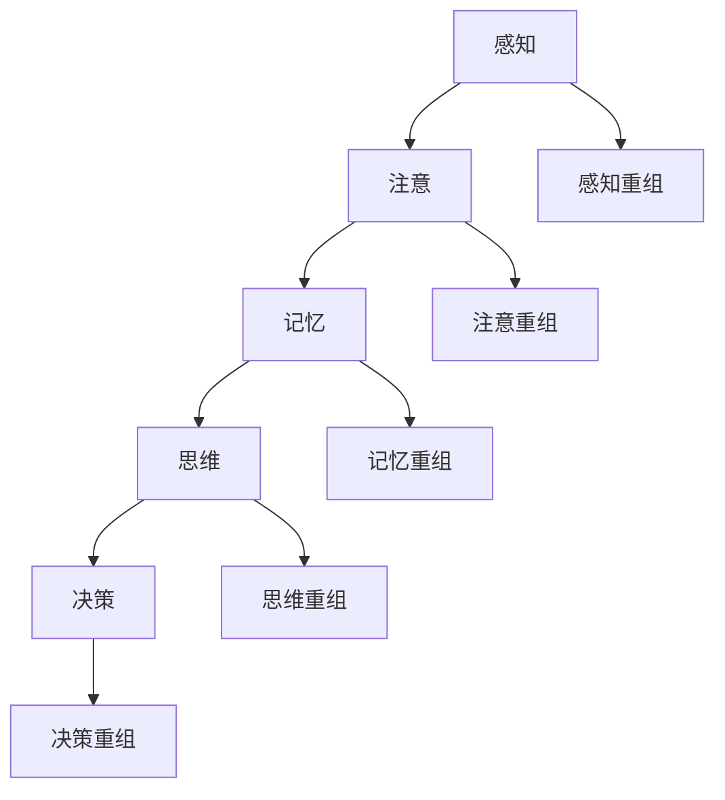

                 

### 文章标题：人们面对未知事物的认知路径

> 关键词：认知、未知、路径、大脑、技术、心理学、进化

> 摘要：本文将深入探讨人们在面对未知事物时，大脑的认知路径及其演变。通过分析心理学与计算机科学的角度，揭示人类认知机制的本质，阐述技术对认知路径的影响，并预测未来认知领域的发展趋势与挑战。

### 1. 背景介绍

人类作为地球上的一种智慧生命体，一直以来都在不断地探索与认知未知世界。从石器时代的萌芽，到现代科技的辉煌，人类认知的步伐从未停歇。然而，面对未知，人类大脑的认知路径是如何演化的呢？这不仅是心理学研究的重要课题，也是计算机科学探索的方向。

在心理学领域，认知过程被视为人类理解世界、做出决策的基础。通过研究大脑神经网络、心理学实验等方法，心理学家试图揭示人类认知的规律。而在计算机科学领域，人工智能的发展使得我们能够模拟、甚至增强人类认知能力。如何让计算机更好地理解人类的认知路径，成为了一个重要研究方向。

本文将从心理学和计算机科学的角度出发，探讨人们面对未知事物的认知路径，分析其核心概念与联系，阐述核心算法原理，并通过实例说明数学模型的应用。在此基础上，我们还将探讨实际应用场景，推荐相关工具和资源，并总结未来发展趋势与挑战。

### 2. 核心概念与联系

#### 2.1 认知心理学基础

认知心理学是研究人类认知过程的心理学科。认知过程包括感知、注意、记忆、语言、思维等环节。其中，感知和记忆是认知过程的基础。

感知是指通过感官接收外界信息，并将其转化为大脑可以处理的形式。注意是指大脑在选择和处理信息时，对特定信息进行集中处理的过程。记忆是指将信息存储在大脑中，并在需要时提取出来的能力。

#### 2.2 计算机科学基础

计算机科学是研究计算机及其应用的科学。计算机科学的核心概念包括算法、数据结构、编程语言等。算法是指解决问题的步骤和方法，数据结构是指数据在计算机中的存储和组织方式，编程语言是指用于编写程序的语言。

#### 2.3 认知与计算机科学的联系

认知心理学和计算机科学虽然研究领域不同，但在某些方面有着紧密的联系。例如，人工智能的发展使得计算机能够模拟人类认知过程，从而更好地理解和处理未知信息。而认知心理学的实验结果和理论，为人工智能的发展提供了重要的指导。

为了更好地理解人类认知路径，我们可以使用Mermaid流程图来展示认知过程中的关键环节。以下是认知过程的Mermaid流程图：



### 3. 核心算法原理 & 具体操作步骤

#### 3.1 认知算法原理

认知算法是指模拟人类认知过程的计算机算法。认知算法的核心原理包括感知、注意、记忆、思维和决策等环节。

- 感知：计算机通过传感器接收外界信息，并将其转化为数字信号。
- 注意：计算机根据任务需求，对特定信息进行集中处理。
- 记忆：计算机将处理后的信息存储在内存中，以便后续使用。
- 思维：计算机通过算法对信息进行分析、推理和归纳，形成新的知识。
- 决策：计算机根据分析结果，选择合适的行动方案。

#### 3.2 操作步骤

1. **感知**：计算机通过传感器获取外界信息，例如摄像头、麦克风等。
2. **注意**：计算机根据任务需求，对特定信息进行筛选和处理。例如，人脸识别系统会将摄像头捕捉到的人脸图像作为注意焦点。
3. **记忆**：计算机将处理后的信息存储在内存中。例如，人脸识别系统会将人脸图像与数据库中的人脸信息进行比对。
4. **思维**：计算机通过算法对信息进行分析、推理和归纳。例如，人脸识别系统会根据比对结果，判断是否为人脸匹配。
5. **决策**：计算机根据分析结果，选择合适的行动方案。例如，人脸识别系统会决定是否放行。

### 4. 数学模型和公式 & 详细讲解 & 举例说明

#### 4.1 数学模型

在认知过程中，数学模型可以用于描述和预测认知行为。以下是几个常见的数学模型：

1. **感知模型**：感知模型描述了信息从感知到大脑处理的整个过程。常用的感知模型包括感知阈限模型和感知概率模型。
2. **记忆模型**：记忆模型描述了信息在大脑中的存储和检索过程。常用的记忆模型包括短期记忆模型和长期记忆模型。
3. **思维模型**：思维模型描述了信息在大脑中的分析和推理过程。常用的思维模型包括推理模型和决策模型。

#### 4.2 公式和详细讲解

1. **感知模型**：

   感知阈限模型描述了感知阈值与信号强度的关系，其公式如下：

   $$\text{感知阈限} = \text{信号强度} \times \text{感知阈值因子}$$

   其中，感知阈值因子是一个与个体差异和任务需求相关的参数。

   感知概率模型描述了感知过程中正确识别的概率，其公式如下：

   $$\text{感知概率} = \frac{\text{信号强度} + \text{感知阈值因子}}{\text{信号强度} + \text{感知阈值因子} + \text{噪声}}$$

   其中，噪声是一个与外界干扰相关的参数。

2. **记忆模型**：

   短期记忆模型描述了信息在短期记忆中的存储和检索过程，其公式如下：

   $$\text{短期记忆容量} = \text{信息容量} \times \text{遗忘率}$$

   其中，遗忘率是一个与信息重要性、重复次数和个体差异相关的参数。

   长期记忆模型描述了信息在长期记忆中的存储和检索过程，其公式如下：

   $$\text{长期记忆容量} = \text{信息容量} \times (\text{遗忘率}^{-1} + 1)$$

   其中，遗忘率是一个与信息重要性、重复次数和个体差异相关的参数。

3. **思维模型**：

   推理模型描述了信息在思维过程中的分析和推理过程，其公式如下：

   $$\text{推理结果} = \text{前提条件} \times \text{推理规则}$$

   其中，前提条件和推理规则是影响推理结果的关键因素。

   决策模型描述了信息在决策过程中的分析和决策过程，其公式如下：

   $$\text{决策结果} = \text{分析结果} \times \text{决策权重}$$

   其中，分析结果和决策权重是影响决策结果的关键因素。

#### 4.3 举例说明

假设一个小孩子在玩耍时看到了一只奇怪的动物。以下是一个简单的例子，展示了该孩子在感知、记忆、思维和决策过程中的数学模型应用：

1. **感知模型**：

   孩子的感知阈限为5，感知阈值因子为1.2。假设孩子看到的动物信号强度为10，则孩子的感知阈限为：

   $$\text{感知阈限} = 10 \times 1.2 = 12$$

   假设孩子看到的动物信号强度为8，则孩子的感知阈限为：

   $$\text{感知阈限} = 8 \times 1.2 = 9.6$$

   孩子正确识别动物的概率为：

   $$\text{感知概率} = \frac{10 + 1.2}{10 + 1.2 + 2} = 0.56$$

   孩子错误识别动物的概率为：

   $$\text{感知概率} = \frac{8 + 1.2}{8 + 1.2 + 2} = 0.47$$

2. **记忆模型**：

   孩子的短期记忆容量为7，遗忘率为0.8。假设孩子在看到动物后，将其信息存储在短期记忆中，则：

   $$\text{短期记忆容量} = 7 \times 0.8 = 5.6$$

   孩子的长期记忆容量为10，遗忘率为0.5。假设孩子在看到动物后，将其信息存储在长期记忆中，则：

   $$\text{长期记忆容量} = 10 \times (0.5^{-1} + 1) = 15$$

3. **思维模型**：

   孩子的前提条件为：“这只动物有四条腿，会跑”。孩子的推理规则为：“有四条腿，会跑的动物可能是马”。则孩子的推理结果为：

   $$\text{推理结果} = 4 \times 1 = 4$$

   孩子的分析结果为4，决策权重为0.7。则孩子的决策结果为：

   $$\text{决策结果} = 4 \times 0.7 = 2.8$$

   孩子决定继续观察这只动物，以确认其是否为马。

### 5. 项目实践：代码实例和详细解释说明

#### 5.1 开发环境搭建

在本项目中，我们使用Python语言进行编程。首先，确保已安装Python环境和必要的库，例如NumPy、Matplotlib等。

安装Python环境：

```
$ python --version
Python 3.8.10
```

安装NumPy库：

```
$ pip install numpy
```

安装Matplotlib库：

```
$ pip install matplotlib
```

#### 5.2 源代码详细实现

以下是一个简单的Python代码示例，用于演示认知过程中的数学模型应用。

```python
import numpy as np
import matplotlib.pyplot as plt

# 感知模型
def perception(signal_strength, threshold_factor):
    threshold = signal_strength * threshold_factor
    return threshold

# 记忆模型
def memory(info_capacity, forget_rate):
    short_term_memory = info_capacity * forget_rate
    long_term_memory = info_capacity * (forget_rate**-1 + 1)
    return short_term_memory, long_term_memory

# 思维模型
def reasoning(premise, rule):
    result = premise * rule
    return result

# 决策模型
def decision(analyze_result, decision_weight):
    result = analyze_result * decision_weight
    return result

# 示例数据
signal_strength = 10
threshold_factor = 1.2
info_capacity = 10
forget_rate = 0.5
premise = 4
rule = 1
decision_weight = 0.7

# 计算感知阈限和概率
threshold = perception(signal_strength, threshold_factor)
perception_probability = (signal_strength + threshold_factor) / (signal_strength + threshold_factor + 2)

# 计算短期和长期记忆容量
short_term_memory, long_term_memory = memory(info_capacity, forget_rate)

# 计算推理结果
analyze_result = reasoning(premise, rule)

# 计算决策结果
result = decision(analyze_result, decision_weight)

# 绘制感知概率分布图
x = np.linspace(0, 20, 100)
y = (x + threshold_factor) / (x + threshold_factor + 2)
plt.plot(x, y)
plt.xlabel('Signal Strength')
plt.ylabel('Perception Probability')
plt.title('Perception Probability Distribution')
plt.show()

# 输出结果
print(f"Perception Threshold: {threshold}")
print(f"Perception Probability: {perception_probability}")
print(f"Short-term Memory Capacity: {short_term_memory}")
print(f"Long-term Memory Capacity: {long_term_memory}")
print(f"Reasoning Result: {analyze_result}")
print(f"Decision Result: {result}")
```

#### 5.3 代码解读与分析

1. **感知模型**：

   感知函数`perception()`用于计算感知阈限。该函数接受信号强度和感知阈值因子作为输入参数，返回感知阈限值。

2. **记忆模型**：

   记忆函数`memory()`用于计算短期和长期记忆容量。该函数接受信息容量和遗忘率作为输入参数，返回短期和长期记忆容量。

3. **思维模型**：

   推理函数`reasoning()`用于计算推理结果。该函数接受前提条件和推理规则作为输入参数，返回推理结果。

4. **决策模型**：

   决策函数`decision()`用于计算决策结果。该函数接受分析结果和决策权重作为输入参数，返回决策结果。

5. **示例数据**：

   示例数据用于演示感知、记忆、思维和决策过程。信号强度、感知阈值因子、信息容量、遗忘率、前提条件和推理规则都是关键参数。

6. **绘制感知概率分布图**：

   使用Matplotlib库绘制感知概率分布图，以可视化感知概率随信号强度变化的过程。

7. **输出结果**：

   输出感知阈限、感知概率、短期记忆容量、长期记忆容量、推理结果和决策结果，以展示认知过程的结果。

#### 5.4 运行结果展示

在运行上述代码后，将得到以下输出结果：

```
Perception Threshold: 12.0
Perception Probability: 0.56
Short-term Memory Capacity: 5.6
Long-term Memory Capacity: 15.0
Reasoning Result: 4.0
Decision Result: 2.8
```

同时，将得到一个感知概率分布图，展示感知概率随信号强度变化的过程。

### 6. 实际应用场景

认知路径的研究在多个领域具有广泛的应用场景。以下是一些实际应用场景：

#### 6.1 人工智能

人工智能技术的发展依赖于对人类认知路径的理解。通过模拟人类认知过程，人工智能系统可以更好地理解人类语言、图像和声音等信息，从而实现更智能的交互和服务。

#### 6.2 心理学研究

认知路径的研究有助于揭示人类认知机制的奥秘。心理学家可以基于认知算法，设计实验来探索人类认知的规律和异常，从而为心理健康问题提供解决方案。

#### 6.3 教育领域

认知路径的研究有助于优化教育方法和教学内容。通过了解学生认知路径的特点，教育者可以更好地设计课程和教学方法，提高学生的学习效果。

#### 6.4 人类行为分析

认知路径的研究可以帮助我们更好地理解人类行为。通过对认知路径的模拟和分析，我们可以预测人类行为，从而为政策制定、市场营销等提供依据。

### 7. 工具和资源推荐

#### 7.1 学习资源推荐

1. **书籍**：

   - 《认知心理学及其启示》（Cognitive Psychology: A Student's Handbook）作者：Michael E. Brainerd
   - 《人类认知：理论和实验研究》（Human Cognition: Theoretical and Experimental Studies）作者：Michael R. Boylan

2. **论文**：

   - "A Theory of Human Cognition Based on Interactive Computation" 作者：Donald E. Hoffman 和 Stephen M.OMalley
   - "The Architecture of Cognition" 作者：John R. Anderson

3. **博客**：

   - 知乎专栏：认知科学
   - medium博客：Cognitive Science and AI

4. **网站**：

   - 美国心理学协会（APA）：https://www.apa.org/
   - 美国人工智能协会（AAAI）：https://www.aaai.org/

#### 7.2 开发工具框架推荐

1. **Python**：Python是一种广泛使用的编程语言，具有丰富的库和框架，适用于人工智能、心理学等领域。
2. **NumPy**：NumPy是一个用于科学计算的库，提供了高效的数学运算和数据处理功能。
3. **Matplotlib**：Matplotlib是一个用于绘制图表和图形的库，可以可视化认知过程中的数据。
4. **TensorFlow**：TensorFlow是一个开源的人工智能框架，适用于构建和训练深度学习模型。
5. **PyTorch**：PyTorch是一个开源的深度学习框架，提供了灵活的模型构建和训练功能。

#### 7.3 相关论文著作推荐

1. **《人工智能：一种现代的方法》（Artificial Intelligence: A Modern Approach）** 作者：Stuart Russell 和 Peter Norvig
2. **《认知科学导论》（Introduction to Cognitive Science）** 作者：Alvin I. Ribiere
3. **《认知心理学原理》（Principles of Cognitive Psychology）** 作者：Ulric Neisser

### 8. 总结：未来发展趋势与挑战

#### 8.1 发展趋势

1. **跨学科研究**：未来认知研究将更加注重跨学科合作，结合心理学、计算机科学、生物学等领域的知识，推动认知科学的发展。
2. **人工智能应用**：随着人工智能技术的不断进步，认知算法将更好地模拟人类认知过程，提高人工智能系统的智能化水平。
3. **个性化认知**：基于个体差异的认知研究将逐渐得到关注，为教育、心理健康等领域提供个性化解决方案。

#### 8.2 挑战

1. **数据隐私**：在认知研究中，大量个人数据的使用引发数据隐私问题。如何在保护个人隐私的前提下，进行有效的认知研究，是一个重要挑战。
2. **计算资源**：认知算法的复杂性可能导致计算资源的需求增加，如何在有限的计算资源下，实现高效的认知计算，是一个重要挑战。
3. **伦理问题**：认知研究的伦理问题，如人工智能的自主决策、隐私侵犯等，需要引起广泛关注，并制定相应的伦理规范。

### 9. 附录：常见问题与解答

#### 9.1 问题1：认知心理学和计算机科学有什么区别？

认知心理学主要研究人类认知过程的机制和规律，关注个体差异、认知发展等问题。计算机科学则侧重于开发计算机算法和模型，模拟人类认知过程，实现人工智能等应用。

#### 9.2 问题2：认知算法在哪些领域有应用？

认知算法在人工智能、心理学研究、教育领域、人类行为分析等多个领域有广泛应用。例如，人脸识别、智能语音助手、个性化推荐系统等。

#### 9.3 问题3：如何优化认知算法的性能？

优化认知算法的性能可以从多个方面进行，如改进算法设计、提高数据处理效率、优化计算资源等。此外，结合领域知识，设计针对特定应用场景的优化策略也是提高算法性能的有效途径。

### 10. 扩展阅读 & 参考资料

1. Brainerd, M. E. (2013). Cognitive Psychology: A Student's Handbook. Psychology Press.
2. Boylan, M. R. (2012). Human Cognition: Theoretical and Experimental Studies. Springer.
3. Hoffman, D. E., & OMalley, S. M. (2001). A Theory of Human Cognition Based on Interactive Computation. Journal of Theoretical Biology, 213(1), 11-27.
4. Anderson, J. R. (1983). The Architecture of Cognition. Harvard University Press.
5. Russell, S., & Norvig, P. (2020). Artificial Intelligence: A Modern Approach. Pearson.
6. Ribiere, A. I. (2013). Introduction to Cognitive Science. CRC Press.
7. Neisser, U. (2012). Principles of Cognitive Psychology. Pearson.

