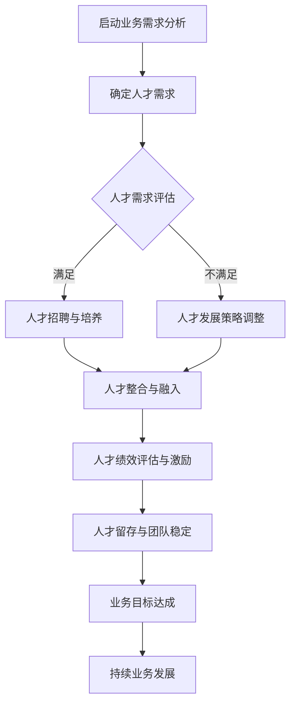

                 

### 1. 背景介绍

在当今快速发展的商业环境中，企业之间的竞争愈发激烈。为了在市场上占据有利位置，企业需要不断地调整自己的战略和运营模式。在这样的背景下，人力资源业务伙伴（HRBP）这一角色应运而生，成为连接企业战略和员工需求的重要桥梁。本文将探讨人力资源业务伙伴在创业环境中的角色，特别是如何支持业务部门的人才需求。

### 2. 核心概念与联系

#### 2.1 人力资源业务伙伴（HRBP）的定义与作用

人力资源业务伙伴（HRBP）是企业中专门负责将人力资源战略与业务战略紧密结合的职位。HRBP不仅具备人力资源管理的基本知识，还需要深入了解业务部门的运营和需求，从而提供更加精准的人力资源服务。

- **定义**：HRBP是人力资源部门与业务部门之间的桥梁，负责将人力资源战略与业务战略相结合，确保企业能够通过有效的人力资源管理实现业务目标。

- **作用**：HRBP在业务部门中扮演了多种角色，包括：
  - **战略伙伴**：与业务部门领导共同制定和调整人力资源战略。
  - **员工支持**：提供员工培训、职业发展、绩效管理等人力资源服务。
  - **问题解决者**：识别和解决业务部门在人力资源管理方面的问题。
  - **数据分析师**：通过数据分析为企业提供人力资源决策支持。

#### 2.2 人才需求与业务发展的关系

人才是企业发展的核心资源。在创业环境中，业务发展速度通常非常快，因此对人才的需求也更加迫切。人才需求与业务发展的关系可以从以下几个方面来理解：

- **人才驱动增长**：优秀的人才能够推动业务创新和增长，帮助企业实现战略目标。
- **适应能力**：快速变化的市场环境要求企业具备快速适应的能力，而人才是企业适应能力的关键。
- **成本与效益**：招聘和培养人才需要投入大量资源，但优秀的人才能够带来更高的产出和效益。
- **团队文化**：优秀的人才能够影响和塑造团队文化，提升整个组织的凝聚力和执行力。

#### 2.3 Mermaid 流程图

以下是描述HRBP在创业环境中支持业务部门人才需求的 Mermaid 流程图：



### 3. 核心算法原理 & 具体操作步骤

#### 3.1 人才需求分析算法

人才需求分析是HRBP支持业务部门人才需求的第一步。以下是具体操作步骤：

1. **数据收集**：收集业务部门的发展规划、项目计划、岗位说明书等相关信息。
2. **需求评估**：分析现有团队的能力结构，评估人才需求，包括数量、质量、技能等方面。
3. **优先级排序**：根据业务优先级和紧迫性，对人才需求进行排序。
4. **方案制定**：制定满足人才需求的招聘、培养、引进等策略。

#### 3.2 人才招聘与培养算法

1. **招聘策略制定**：根据人才需求，制定适合的招聘渠道、招聘流程和选拔标准。
2. **招聘实施**：通过线上招聘、社交媒体、猎头公司等多种渠道进行招聘。
3. **培训与发展**：为新员工提供入职培训、技能培训、职业发展指导等。

#### 3.3 人才绩效评估与激励算法

1. **绩效指标确定**：根据业务目标和岗位要求，确定绩效指标。
2. **绩效评估**：定期对员工进行绩效评估，提供反馈和指导。
3. **激励措施**：根据绩效结果，采取奖金、晋升、培训等激励措施。

### 4. 数学模型和公式 & 详细讲解 & 举例说明

#### 4.1 人才需求评估模型

假设有一个业务部门，其岗位需求为N个，现有员工M个，其中具备所需技能的员工为X个。则人才需求评估模型可以表示为：

$$
D = N - X
$$

其中，D为人才需求量。

#### 4.2 招聘渠道优化模型

假设有K个招聘渠道，每个渠道的招聘成本为C，招聘成功率分别为P1, P2, ..., PK。则招聘渠道优化模型可以表示为：

$$
\max \frac{P \cdot C}{P \cdot C + 1}
$$

其中，P为总招聘成功率。

#### 4.3 绩效评估模型

假设有m个绩效指标，每个指标的权重分别为w1, w2, ..., wm，员工在各个指标上的得分为s1, s2, ..., sm。则绩效评估模型可以表示为：

$$
P = \sum_{i=1}^{m} w_i \cdot s_i
$$

其中，P为绩效得分。

#### 4.4 举例说明

假设有一个业务部门，现有员工10人，其中4人具备所需技能。则人才需求量为6人。

- **招聘渠道优化**：假设有3个招聘渠道，成本分别为5000元、6000元和7000元，成功率分别为0.2、0.3和0.4。则最优招聘渠道为第二个渠道。

- **绩效评估**：假设有3个绩效指标，权重分别为0.3、0.4和0.3，员工在各个指标上的得分分别为0.8、0.9和0.75。则绩效得分为：

$$
P = 0.3 \cdot 0.8 + 0.4 \cdot 0.9 + 0.3 \cdot 0.75 = 0.87
$$

### 5. 项目实践：代码实例和详细解释说明

#### 5.1 代码实例

以下是使用Python实现的HRBP支持业务部门人才需求的代码实例：

```python
# 导入所需库
import pandas as pd
import numpy as np

# 数据准备
data = {
    '岗位需求': [10, 15, 12, 8],
    '现有员工': [4, 6, 5, 3],
    '技能匹配': [4, 5, 4, 2]
}

df = pd.DataFrame(data)

# 人才需求评估
df['人才需求'] = df['岗位需求'] - df['技能匹配']

# 招聘渠道优化
costs = [5000, 6000, 7000]
success_rates = [0.2, 0.3, 0.4]
total_cost = sum(costs)
total_success = sum(success_rates)
max_ratio = max(total_cost / total_success, total_cost / (total_success + 1))

# 绩效评估
weights = [0.3, 0.4, 0.3]
scores = [0.8, 0.9, 0.75]
performance = sum(weights[i] * scores[i] for i in range(len(weights)))

# 打印结果
print("人才需求量：", df['人才需求'])
print("最优招聘渠道：", max_ratio)
print("绩效得分：", performance)
```

#### 5.2 详细解释说明

- **数据准备**：使用Pandas库创建一个数据框（DataFrame），其中包含了岗位需求、现有员工和技能匹配等信息。

- **人才需求评估**：通过计算岗位需求减去技能匹配，得到人才需求量。

- **招聘渠道优化**：计算每个招聘渠道的成本和成功率，使用优化模型选择最优招聘渠道。

- **绩效评估**：根据绩效指标权重和员工得分，计算绩效得分。

### 6. 实际应用场景

#### 6.1 创业公司

创业公司通常面临快速发展的压力，需要大量的人才支持。HRBP在这个阶段可以：

- **人才战略规划**：帮助公司制定长期和短期的人才战略，确保公司有足够的人才储备。
- **招聘与培训**：通过多种招聘渠道快速招聘合适的人才，并提供入职培训和职业发展指导。
- **绩效管理**：建立有效的绩效管理体系，激励员工提升工作效率。

#### 6.2 企业转型

在企业转型的过程中，HRBP可以：

- **人才筛选**：识别和筛选适合转型需求的关键人才，确保团队具备转型所需的技能和经验。
- **团队重组**：根据业务需求对团队进行重组，提高团队的协作效率和创新能力。
- **文化建设**：推动企业文化的变革，帮助员工适应新的业务模式和价值观。

#### 6.3 全球化扩张

在全球化的背景下，HRBP可以：

- **本地化策略**：根据不同国家和地区的市场特点，制定合适的人才招聘和培养策略。
- **跨文化管理**：促进不同文化背景的员工之间的沟通和合作，提高团队的凝聚力和执行力。
- **国际化培训**：提供国际化培训，提升员工的跨文化能力和全球视野。

### 7. 工具和资源推荐

#### 7.1 工具

- **招聘工具**：LinkedIn、智联招聘、猎聘网等在线招聘平台。
- **绩效管理工具**：KPI考核系统、OKR管理系统等。
- **人才发展工具**：学习管理系统（LMS）、在线课程平台等。

#### 7.2 资源

- **书籍**：《人力资源管理》、《招聘与配置》等。
- **在线课程**：Coursera、edX等在线教育平台的相关课程。
- **论坛与社群**：人力资源经理论坛、HRBP社群等。

### 8. 总结：未来发展趋势与挑战

#### 8.1 发展趋势

- **数字化转型**：随着数字化技术的发展，HRBP的职能将进一步数字化，提高人力资源管理效率。
- **大数据应用**：通过大数据分析，HRBP可以更加精准地预测人才需求，优化招聘和绩效管理。
- **人才个性化**：个性化人才管理将成为趋势，HRBP将更加关注员工的个性化需求和职业发展。

#### 8.2 挑战

- **竞争加剧**：随着市场竞争的加剧，HRBP需要不断优化人才策略，以应对快速变化的市场环境。
- **人才流失**：如何留住关键人才，防止人才流失，是HRBP面临的重要挑战。
- **法律法规**：遵守相关法律法规，确保人力资源管理的合法性和合规性。

### 9. 附录：常见问题与解答

#### 9.1 人力资源业务伙伴（HRBP）与传统HR的区别是什么？

- **区别**：
  - **定位不同**：传统HR主要关注人力资源的管理和维护，HRBP更注重将人力资源战略与业务战略相结合，成为业务部门的战略伙伴。
  - **职责不同**：传统HR主要职责包括招聘、培训、薪酬福利等，HRBP则需要深入了解业务需求，提供更加针对性的服务。

#### 9.2 HRBP在创业公司中的作用是什么？

- **作用**：
  - **战略规划**：帮助创业公司制定长期和短期的人才战略，确保公司有足够的人才储备。
  - **招聘与培训**：通过多种招聘渠道快速招聘合适的人才，并提供入职培训和职业发展指导。
  - **绩效管理**：建立有效的绩效管理体系，激励员工提升工作效率。

### 10. 扩展阅读 & 参考资料

- 《人力资源业务伙伴：战略业务伙伴HRBP的实践指南》
- 《创业公司人力资源管理实战》
- 《人力资源管理：战略伙伴视角》

### 作者署名

本文作者：禅与计算机程序设计艺术 / Zen and the Art of Computer Programming
```  
```

