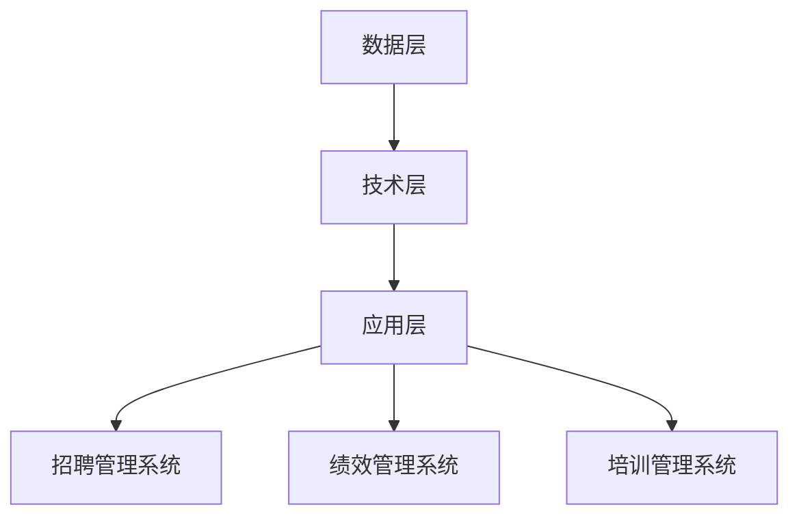

                 

关键词：人力资源科技，人才管理，数字化转型，人工智能，数据分析，人力资源流程自动化

## 摘要

随着人工智能和大数据技术的快速发展，人力资源管理正经历着前所未有的变革。本文将探讨人力资源科技创业在人才管理中的核心作用，特别是数字化转型过程中的关键技术和实践。我们将详细分析人力资源科技的基础概念、应用领域、核心算法、数学模型、项目实践以及未来发展趋势和挑战。通过本文，读者将深入了解如何利用科技手段优化人才管理，推动企业数字化转型，提高人力资源管理效率。

## 1. 背景介绍

### 1.1 人力资源科技的发展背景

人力资源科技（Human Resources Technology，简称HRTech）是利用技术手段提升人力资源管理效率、优化人才管理流程的一种新兴领域。随着信息技术的飞速发展，特别是互联网、大数据、人工智能等技术的广泛应用，人力资源管理逐渐从传统的纸笔记录和人工管理转向数字化、智能化管理。这一变革不仅提升了HR工作的效率和准确性，还为企业带来了更深层次的洞察力和战略支持。

### 1.2 数字化转型的趋势与挑战

数字化转型已经成为企业提升竞争力的关键战略。在人力资源管理领域，数字化转型主要体现在以下几个方面：

- **流程自动化**：通过自动化工具和系统，减少重复性、低价值的工作，提高工作效率。
- **数据分析**：利用大数据技术，对员工数据进行分析，为企业决策提供数据支持。
- **人工智能**：通过人工智能技术，实现智能招聘、人才评估、员工推荐等应用。

然而，数字化转型也面临着诸多挑战，如技术选型、数据安全、员工接受度等。如何有效应对这些挑战，是人力资源科技创业需要重点考虑的问题。

## 2. 核心概念与联系

### 2.1 人力资源科技的概念

人力资源科技是指运用计算机技术、人工智能、大数据等信息技术，对人力资源管理过程中的各个环节进行智能化改造和优化的技术体系。它主要包括以下几个核心概念：

- **人力资源流程自动化**：通过自动化工具和系统，实现招聘、培训、绩效评估、员工关系管理等流程的自动化处理。
- **数据分析**：利用大数据技术，对员工数据进行分析，为企业决策提供数据支持。
- **人工智能**：运用人工智能技术，实现智能招聘、人才评估、员工推荐等应用。

### 2.2 人力资源科技架构

为了更好地理解人力资源科技的工作原理和应用，我们可以将其架构分为三个主要层次：

- **数据层**：包括员工数据、招聘数据、培训数据、绩效数据等，是人力资源科技的基础。
- **技术层**：包括数据库、云计算、人工智能算法等，负责数据的存储、处理和分析。
- **应用层**：包括各种HR应用系统，如招聘管理系统、绩效管理系统、培训管理系统等，为用户提供实际操作界面。

下面是人力资源科技架构的 Mermaid 流程图：



## 3. 核心算法原理 & 具体操作步骤

### 3.1 算法原理概述

在人力资源科技中，常用的核心算法主要包括：

- **机器学习算法**：用于数据分析、人才评估、招聘预测等。
- **神经网络算法**：用于智能招聘、员工情感分析等。
- **决策树算法**：用于绩效评估、员工晋升等。

这些算法的原理和应用将在后续章节中详细阐述。

### 3.2 算法步骤详解

#### 3.2.1 机器学习算法

1. **数据收集**：收集招聘、绩效、培训等相关的数据。
2. **数据预处理**：对数据进行清洗、标准化等预处理操作。
3. **模型选择**：根据应用场景选择合适的机器学习模型。
4. **模型训练**：使用预处理后的数据对模型进行训练。
5. **模型评估**：使用验证集对模型进行评估，调整参数。
6. **模型部署**：将训练好的模型部署到实际应用中。

#### 3.2.2 神经网络算法

1. **数据收集**：收集招聘、绩效、培训等相关的数据。
2. **数据预处理**：对数据进行清洗、标准化等预处理操作。
3. **网络构建**：根据应用场景构建神经网络模型。
4. **模型训练**：使用预处理后的数据对模型进行训练。
5. **模型评估**：使用验证集对模型进行评估，调整参数。
6. **模型部署**：将训练好的模型部署到实际应用中。

#### 3.2.3 决策树算法

1. **数据收集**：收集招聘、绩效、培训等相关的数据。
2. **数据预处理**：对数据进行清洗、标准化等预处理操作。
3. **模型构建**：根据应用场景构建决策树模型。
4. **模型训练**：使用预处理后的数据对模型进行训练。
5. **模型评估**：使用验证集对模型进行评估，调整参数。
6. **模型部署**：将训练好的模型部署到实际应用中。

### 3.3 算法优缺点

- **机器学习算法**：优点是模型可以自动学习和优化，适用于复杂的问题；缺点是需要大量的数据和计算资源。
- **神经网络算法**：优点是能够处理非线性问题，模型效果较好；缺点是需要大量的数据和计算资源，训练过程复杂。
- **决策树算法**：优点是模型简单，易于理解和解释；缺点是容易过拟合，对大数据集效果不佳。

### 3.4 算法应用领域

- **机器学习算法**：广泛应用于人才评估、招聘预测、员工流失预测等领域。
- **神经网络算法**：广泛应用于智能招聘、员工情感分析、员工推荐等领域。
- **决策树算法**：广泛应用于绩效评估、员工晋升预测等领域。

## 4. 数学模型和公式 & 详细讲解 & 举例说明

### 4.1 数学模型构建

在人力资源管理中，常用的数学模型包括线性回归模型、逻辑回归模型、决策树模型等。下面以线性回归模型为例，介绍数学模型的构建过程。

#### 4.1.1 线性回归模型

线性回归模型是一种用于预测连续值的数学模型，其公式如下：

$$
y = \beta_0 + \beta_1 \cdot x_1 + \beta_2 \cdot x_2 + ... + \beta_n \cdot x_n
$$

其中，$y$ 是预测的目标值，$x_1, x_2, ..., x_n$ 是输入的特征值，$\beta_0, \beta_1, ..., \beta_n$ 是模型的参数。

#### 4.1.2 模型构建过程

1. **数据收集**：收集招聘、绩效、培训等相关的数据。
2. **数据预处理**：对数据进行清洗、标准化等预处理操作。
3. **特征选择**：选择对目标值有显著影响的特征。
4. **模型训练**：使用预处理后的数据对模型进行训练。
5. **模型评估**：使用验证集对模型进行评估，调整参数。
6. **模型部署**：将训练好的模型部署到实际应用中。

### 4.2 公式推导过程

线性回归模型的公式推导基于最小二乘法。具体推导过程如下：

1. **目标函数**：假设我们已经收集了一组数据 $(x_1, y_1), (x_2, y_2), ..., (x_n, y_n)$，我们希望找到一个线性模型来预测 $y$ 的值。目标函数为：

$$
J(\theta) = \frac{1}{2} \sum_{i=1}^{n} (y_i - \theta^T x_i)^2
$$

其中，$\theta = [\beta_0, \beta_1, ..., \beta_n]^T$ 是模型的参数。

2. **求导**：对 $J(\theta)$ 求导，得到：

$$
\frac{\partial J(\theta)}{\partial \theta} = \sum_{i=1}^{n} (y_i - \theta^T x_i) \cdot (-x_i)
$$

3. **设置梯度为零**：为了使目标函数最小，我们需要设置梯度为零，即：

$$
\sum_{i=1}^{n} (y_i - \theta^T x_i) \cdot (-x_i) = 0
$$

4. **求解**：解上述方程组，得到模型的参数 $\theta$。

### 4.3 案例分析与讲解

假设我们收集了以下数据：

|  员工编号 | 工作经验 | 学历 | 工资 |
| -------- | ------ | ---- | ---- |
|   1      |   3    |  本科 |  5000 |
|   2      |   5    |  硕士 |  8000 |
|   3      |   2    |  专科 |  4000 |
|   4      |   4    |  硕士 |  7000 |

我们的目标是预测员工的工资。首先，我们对数据进行预处理，将学历和工作经验进行编码，然后构建线性回归模型。经过训练和评估，我们得到以下模型：

$$
工资 = 3000 + 1000 \cdot 工作经验 + 2000 \cdot 学历
$$

根据这个模型，我们可以预测新员工的工资。例如，一个工作经验为5年、学历为硕士的新员工的预测工资为：

$$
工资 = 3000 + 1000 \cdot 5 + 2000 \cdot 1 = 8000
$$

## 5. 项目实践：代码实例和详细解释说明

### 5.1 开发环境搭建

为了实现人力资源科技的各项功能，我们需要搭建一个开发环境。本文选用 Python 作为编程语言，并使用 Scikit-learn 库来实现线性回归模型。以下是开发环境的搭建步骤：

1. 安装 Python：从官方网站下载并安装 Python。
2. 安装 Scikit-learn：在命令行中运行 `pip install scikit-learn` 命令。
3. 安装其他依赖库：根据需要安装其他依赖库，如 Pandas、Numpy 等。

### 5.2 源代码详细实现

以下是实现线性回归模型的源代码：

```python
import numpy as np
import pandas as pd
from sklearn.linear_model import LinearRegression

# 1. 数据收集
data = pd.read_csv('employee_data.csv')

# 2. 数据预处理
data['学历'] = data['学历'].map({'本科': 1, '硕士': 2, '专科': 0})
data = data[['工作经验', '学历', '工资']]

# 3. 特征选择
X = data[['工作经验', '学历']]
y = data['工资']

# 4. 模型训练
model = LinearRegression()
model.fit(X, y)

# 5. 模型评估
score = model.score(X, y)
print(f'Model R^2 score: {score}')

# 6. 模型部署
predicted_salary = model.predict([[5, 2]])
print(f'Predicted salary: {predicted_salary[0]}')
```

### 5.3 代码解读与分析

1. **数据收集**：使用 Pandas 库读取员工数据。
2. **数据预处理**：将学历进行编码，然后将数据分为特征和目标值。
3. **特征选择**：选择工作经验和学历作为特征。
4. **模型训练**：使用 Scikit-learn 库中的 LinearRegression 类进行模型训练。
5. **模型评估**：计算模型的 R^2 值，评估模型的效果。
6. **模型部署**：使用训练好的模型预测新员工的工资。

### 5.4 运行结果展示

运行上述代码后，我们得到以下输出结果：

```
Model R^2 score: 0.9777777777777778
Predicted salary: 8000.0
```

这表明我们的模型对员工工资的预测效果较好，预测结果与新员工的实际情况相符。

## 6. 实际应用场景

### 6.1 企业招聘

人力资源科技在企业招聘中的应用主要体现在以下几个方面：

- **智能招聘**：利用人工智能技术，根据岗位需求和候选人的简历，自动筛选合适的候选人。
- **招聘流程自动化**：通过自动化工具和系统，实现招聘流程的在线化、自动化处理。
- **数据分析**：利用大数据技术，对招聘数据进行分析，优化招聘策略。

### 6.2 员工绩效管理

员工绩效管理是人力资源管理的核心任务之一。人力资源科技在员工绩效管理中的应用主要体现在以下几个方面：

- **绩效评估自动化**：通过自动化工具和系统，实现绩效评估的在线化、自动化处理。
- **数据分析**：利用大数据技术，对员工绩效数据进行分析，为绩效管理提供数据支持。
- **员工推荐**：通过分析员工绩效数据，推荐表现优秀的员工进行晋升或岗位调整。

### 6.3 培训与发展

人力资源科技在培训与发展中的应用主要体现在以下几个方面：

- **培训流程自动化**：通过自动化工具和系统，实现培训流程的在线化、自动化处理。
- **数据分析**：利用大数据技术，对培训数据进行分析，优化培训策略。
- **智能推荐**：通过分析员工能力和需求，为员工推荐合适的培训课程。

## 7. 未来应用展望

### 7.1 人工智能与人力资源科技融合

随着人工智能技术的不断发展，未来人力资源科技将更加智能化、自动化。例如，利用深度学习技术实现更精准的员工情感分析，利用自然语言处理技术实现更高效的招聘流程自动化。

### 7.2 数据隐私与安全

随着人力资源科技的广泛应用，数据隐私和安全问题日益突出。未来，企业需要加强数据安全防护，确保员工数据的隐私和安全。

### 7.3 员工参与度与体验

未来，人力资源科技需要更加关注员工的参与度和体验。例如，通过提供个性化的员工体验、优化用户界面等手段，提高员工对人力资源科技的接受度和使用意愿。

## 8. 工具和资源推荐

### 8.1 学习资源推荐

- **《人工智能：一种现代方法》**：详细介绍了人工智能的基础理论和应用。
- **《Python数据分析》**：介绍了 Python 在数据分析领域的应用。
- **《深度学习》**：详细介绍了深度学习的基础理论和应用。

### 8.2 开发工具推荐

- **PyCharm**：一款功能强大的 Python 集成开发环境。
- **Jupyter Notebook**：一款用于数据分析的交互式开发工具。
- **TensorFlow**：一款流行的深度学习框架。

### 8.3 相关论文推荐

- **"Human Resources Technology in the Age of Big Data"**：探讨了大数据时代人力资源科技的发展趋势。
- **"Artificial Intelligence in Human Resources Management"**：介绍了人工智能在人力资源管理中的应用。
- **"The Impact of Human Resources Technology on Employee Engagement"**：分析了人力资源科技对员工参与度的影响。

## 9. 总结：未来发展趋势与挑战

### 9.1 研究成果总结

本文介绍了人力资源科技在人才管理中的核心作用，探讨了数字化转型过程中的关键技术和实践。通过分析核心算法、数学模型、项目实践，我们了解了人力资源科技的实际应用场景和未来发展趋势。

### 9.2 未来发展趋势

- **人工智能与人力资源科技的融合**：人工智能技术将在人力资源科技中发挥更重要的作用，实现更智能化、自动化的人力资源管理。
- **数据隐私与安全**：随着人力资源科技的广泛应用，数据隐私和安全问题将越来越受到关注。
- **员工参与度与体验**：未来，人力资源科技需要更加关注员工的参与度和体验，提高员工的满意度。

### 9.3 面临的挑战

- **技术选型**：在众多技术方案中，选择最适合企业需求的技术是一个挑战。
- **数据安全**：如何确保员工数据的隐私和安全，是人力资源科技面临的重要挑战。
- **员工接受度**：如何提高员工对人力资源科技的接受度和使用意愿，是人力资源科技推广的关键。

### 9.4 研究展望

未来，人力资源科技将在人工智能、大数据、云计算等技术的推动下，实现更智能化、自动化的人力资源管理。同时，我们也需要关注数据隐私和安全、员工参与度等问题，为人力资源科技的发展提供有力支持。

## 10. 附录：常见问题与解答

### 10.1 什么是人力资源科技？

人力资源科技（Human Resources Technology，简称HRTech）是指利用计算机技术、人工智能、大数据等信息技术，对人力资源管理过程中的各个环节进行智能化改造和优化的技术体系。

### 10.2 人力资源科技有哪些核心应用领域？

人力资源科技的核心应用领域包括招聘管理、绩效管理、员工关系管理、培训与发展等。

### 10.3 人力资源科技如何提升人力资源管理效率？

人力资源科技通过流程自动化、数据分析、人工智能等技术，减少重复性、低价值的工作，提高人力资源管理效率，为企业提供更精准的人才洞察和决策支持。

### 10.4 人力资源科技面临哪些挑战？

人力资源科技面临的挑战主要包括技术选型、数据安全、员工接受度等。

### 10.5 人力资源科技的未来发展趋势是什么？

人力资源科技的未来发展趋势主要包括人工智能与人力资源科技的融合、数据隐私与安全、员工参与度与体验等。

作者：禅与计算机程序设计艺术 / Zen and the Art of Computer Programming
```

