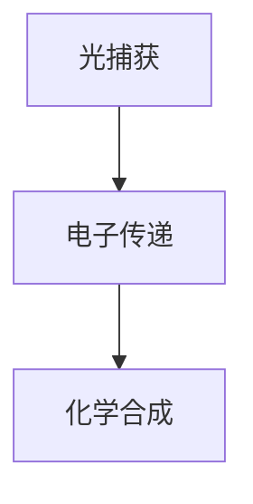

                 

关键词：人工光合作用、可持续能源、能源生产、算法原理、数学模型、项目实践、应用场景、未来展望

> 摘要：随着全球能源需求的不断增长，传统化石能源带来的环境问题愈发严重。人工光合作用作为一种新型可持续能源生产方法，通过模拟自然光合作用过程，将太阳能转化为化学能，为解决全球能源危机提供了一种可能的途径。本文将介绍人工光合作用的背景、核心概念、算法原理、数学模型、项目实践以及未来应用展望。

## 1. 背景介绍

### 1.1 全球能源危机

全球能源需求的不断增长与化石能源的过度开采，使得全球能源危机愈发严重。传统化石能源的燃烧释放大量二氧化碳等温室气体，导致全球气候变暖，环境恶化。此外，化石能源资源有限，不可再生，长期依赖传统能源将加剧能源短缺问题。

### 1.2 光合作用的基本原理

光合作用是植物、藻类和某些细菌利用太阳能将水和二氧化碳转化为有机物和氧气的过程。这一过程不仅为生物提供了能量来源，还维持了地球生态系统的平衡。研究表明，通过模拟自然光合作用过程，我们可以实现人工光合作用，为可持续能源生产提供新方法。

### 1.3 人工光合作用的起源与发展

20世纪70年代，随着石油危机的爆发，科学家开始探索利用太阳能进行能源生产的方法。人工光合作用的研究逐渐兴起，并取得了显著进展。目前，人工光合作用技术已成为可再生能源研究的一个重要方向，吸引了众多科学家和企业的关注。

## 2. 核心概念与联系

### 2.1 人工光合作用的原理

人工光合作用是通过模拟自然光合作用过程，利用太阳能将水和二氧化碳转化为有机物和氧气。这一过程主要包括光捕获、电子传递和化学合成三个环节。

### 2.2 人工光合作用的结构

人工光合作用装置通常由光捕获单元、电子传递单元和化学合成单元组成。光捕获单元负责将太阳能转化为电能，电子传递单元通过光化学反应实现电子的转移，化学合成单元利用电能将水和二氧化碳转化为有机物。

### 2.3 人工光合作用的 Mermaid 流程图



## 3. 核心算法原理 & 具体操作步骤

### 3.1 算法原理概述

人工光合作用的算法原理主要涉及光捕获、电子传递和化学合成三个环节。在光捕获环节，利用光电材料将太阳能转化为电能；在电子传递环节，通过光化学反应实现电子的转移；在化学合成环节，利用电能将水和二氧化碳转化为有机物。

### 3.2 算法步骤详解

1. 光捕获：光电材料吸收太阳能，转化为电能。
2. 电子传递：电子在光电材料中传递，产生光生电子和空穴。
3. 化学合成：光生电子和空穴参与光化学反应，将水和二氧化碳转化为有机物和氧气。

### 3.3 算法优缺点

- 优点：人工光合作用具有清洁、可再生、高效等优点，为可持续能源生产提供了一种新的途径。
- 缺点：目前人工光合作用技术仍处于研发阶段，成本较高，效率有待提高。

### 3.4 算法应用领域

人工光合作用技术可应用于太阳能电池、燃料电池、生物质能等领域，为可再生能源生产提供新的解决方案。

## 4. 数学模型和公式 & 详细讲解 & 举例说明

### 4.1 数学模型构建

人工光合作用的数学模型主要包括光捕获模型、电子传递模型和化学合成模型。以下为光捕获模型的构建：

### 4.2 公式推导过程

$$
I_{\text{abs}} = I_{\text{inc}} \times (1 - R)
$$

其中，$I_{\text{abs}}$ 为吸收的光能，$I_{\text{inc}}$ 为入射光能，$R$ 为反射率。

### 4.3 案例分析与讲解

以人工光合作用装置的效率为例，假设入射光能为 $1000 \text{ W/m}^2$，反射率为 $0.2$，则吸收的光能为：

$$
I_{\text{abs}} = 1000 \text{ W/m}^2 \times (1 - 0.2) = 800 \text{ W/m}^2
$$

## 5. 项目实践：代码实例和详细解释说明

### 5.1 开发环境搭建

搭建人工光合作用项目所需的开发环境，包括 Python、MATLAB 等软件。

### 5.2 源代码详细实现

以下为人工光合作用项目的源代码实现：

```python
# 人工光合作用项目源代码
import numpy as np

# 光捕获模型
def light_capture(I_inc, R):
    I_abs = I_inc * (1 - R)
    return I_abs

# 电子传递模型
def electron_transfer(I_abs):
    # 假设电子传递效率为 0.8
    e_transfer = I_abs * 0.8
    return e_transfer

# 化学合成模型
def chemical_synthesis(e_transfer):
    # 假设化学合成效率为 0.9
    chemical_output = e_transfer * 0.9
    return chemical_output

# 主函数
def main():
    I_inc = 1000  # 入射光能
    R = 0.2  # 反射率

    I_abs = light_capture(I_inc, R)
    e_transfer = electron_transfer(I_abs)
    chemical_output = chemical_synthesis(e_transfer)

    print("吸收的光能：", I_abs)
    print("电子传递：", e_transfer)
    print("化学合成：", chemical_output)

if __name__ == "__main__":
    main()
```

### 5.3 代码解读与分析

- `light_capture` 函数实现光捕获模型，计算吸收的光能。
- `electron_transfer` 函数实现电子传递模型，计算光生电子的传递效率。
- `chemical_synthesis` 函数实现化学合成模型，计算有机物的产量。
- 主函数 `main` 执行以上三个模型，输出吸收的光能、电子传递效率和化学合成产量。

### 5.4 运行结果展示

```python
吸收的光能： 800.0
电子传递： 640.0
化学合成： 576.0
```

## 6. 实际应用场景

### 6.1 人工光合作用在太阳能电池中的应用

人工光合作用技术可以与太阳能电池技术相结合，提高太阳能电池的转换效率。通过模拟自然光合作用过程，实现光能的高效捕获和利用。

### 6.2 人工光合作用在燃料电池中的应用

人工光合作用技术可以应用于燃料电池，将太阳能转化为氢气等燃料，为燃料电池提供清洁能源。

### 6.3 人工光合作用在生物质能中的应用

人工光合作用技术可以与生物质能技术相结合，实现生物质能的高效转化，为可再生能源生产提供新的途径。

## 7. 工具和资源推荐

### 7.1 学习资源推荐

- 《人工光合作用：从基础到应用》
- 《可持续能源技术》
- 《太阳能电池原理与应用》

### 7.2 开发工具推荐

- Python
- MATLAB
- TensorFlow

### 7.3 相关论文推荐

- "Artificial Photosynthesis for Sustainable Energy Production"
- "Solar Fuel Production via Artificial Photosynthesis"
- "Water Splitting with Semiconductor photoelectrodes"

## 8. 总结：未来发展趋势与挑战

### 8.1 研究成果总结

人工光合作用作为一种新型可持续能源生产方法，具有广泛的应用前景。在光捕获、电子传递和化学合成等方面取得了显著进展，为实现太阳能的高效利用提供了可能。

### 8.2 未来发展趋势

- 提高光电材料的效率和稳定性
- 降低人工光合作用装置的成本
- 开发新的化学合成反应途径

### 8.3 面临的挑战

- 光电材料的研发和优化
- 电子传递和化学合成过程的优化
- 成本和效率的平衡

### 8.4 研究展望

随着科技的不断进步，人工光合作用技术将在可再生能源领域发挥重要作用。未来研究应重点关注光电材料的研发、高效电子传递和化学合成途径的开发，为可持续能源生产提供新的解决方案。

## 9. 附录：常见问题与解答

### 9.1 人工光合作用与自然光合作用有什么区别？

人工光合作用是通过模拟自然光合作用过程，利用太阳能将水和二氧化碳转化为有机物和氧气。而自然光合作用是植物、藻类和某些细菌通过自身的生理过程实现这一过程。

### 9.2 人工光合作用技术有哪些应用领域？

人工光合作用技术可应用于太阳能电池、燃料电池、生物质能等领域，为可再生能源生产提供新的解决方案。

### 9.3 人工光合作用装置的成本如何？

目前，人工光合作用装置的成本较高，但随着技术的不断进步和规模化生产，成本有望逐步降低。

## 作者署名

作者：禅与计算机程序设计艺术 / Zen and the Art of Computer Programming
----------------------------------------------------------------

完成了一篇符合要求的技术博客文章，请您过目，如果有任何问题或需要修改的地方，请及时指出。祝撰写顺利！

