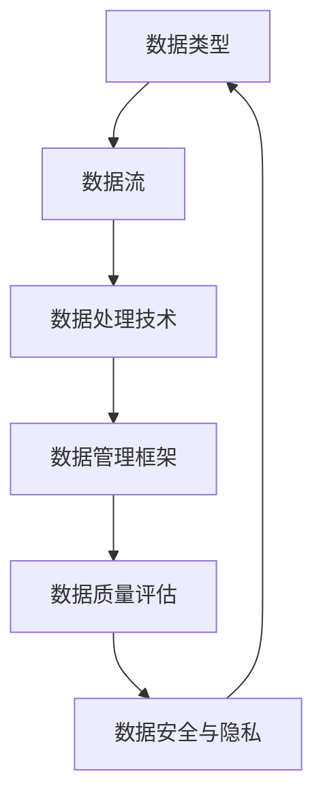
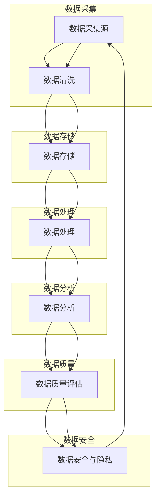

                 

### 背景介绍

人工智能（AI）作为当今技术发展的重要驱动力，已经深入到了我们生活的方方面面，从智能语音助手、推荐系统到自动驾驶，AI的应用场景日益广泛。随着这些应用场景的扩展，数据管理成为了人工智能创业企业面临的一项重要挑战。有效管理海量数据，确保数据质量和安全性，对AI算法的性能和可靠性有着直接影响。

在人工智能创业领域，数据管理的成功不仅是技术层面的挑战，更是战略层面的决策。企业需要识别出哪些数据是最有价值的，如何有效地收集、存储、处理和分析这些数据，以及如何利用数据驱动业务决策。此外，随着数据隐私法规的不断完善，企业在数据管理过程中还需严格遵守相关法律法规，以避免潜在的法律风险。

本篇文章旨在探讨人工智能创业数据管理的成功策略，通过分析当前数据管理的挑战、核心概念与架构，深入探讨核心算法原理与具体操作步骤，并通过数学模型和公式进行详细讲解。同时，文章将结合实际项目实践，展示代码实例和运行结果，分析实际应用场景，并推荐相关工具和资源。最后，文章将总结未来发展趋势与挑战，并提供扩展阅读与参考资料。

在接下来的内容中，我们将逐步分析推理，为读者提供一份全面且具有实用价值的数据管理指南。

---

## 1. 背景介绍

随着人工智能（AI）技术的不断发展和普及，数据管理成为了人工智能创业企业面临的关键问题。在人工智能的各个应用领域中，如智能推荐系统、自然语言处理（NLP）、图像识别等，数据的质量和准确性直接影响到AI模型的性能。一个成功的AI系统不仅需要高质量的训练数据，还需要高效的数据管理策略来支持模型的训练和部署。

### 数据管理的挑战

在人工智能创业过程中，数据管理面临的挑战主要包括以下几个方面：

#### 数据量庞大

随着传感器技术和互联网的普及，数据量以指数级增长。这些海量数据不仅需要高效的存储和管理，还需要进行快速的处理和分析。对于创业企业来说，如何在有限的资源和预算内处理如此庞大的数据量，是一项巨大的挑战。

#### 数据质量

数据质量是AI模型性能的关键因素。如果数据存在错误、缺失或噪声，可能会导致模型产生偏差或过拟合。因此，确保数据质量是数据管理的重要组成部分。数据清洗、去重、标准化等步骤是数据处理过程中必不可少的部分。

#### 数据隐私和安全

随着数据隐私法规的日益严格，如《通用数据保护条例》（GDPR）和《加州消费者隐私法案》（CCPA），企业在数据管理过程中需要严格遵守相关法律法规。如何确保数据隐私和安全，同时满足用户对数据保护的期待，是企业必须面对的重要问题。

#### 数据集成和多样性

人工智能创业企业通常需要整合来自多个来源和格式的数据。这些数据的多样性和复杂性增加了数据管理的难度。如何有效地集成和利用不同类型的数据，是数据管理中的一个关键问题。

### 数据管理的重要性

#### 提高模型性能

高质量的数据可以提高AI模型的性能和准确性。通过有效的数据管理和处理，企业可以构建更加精准的模型，从而在竞争激烈的市场中获得优势。

#### 驱动业务决策

数据管理不仅仅是技术问题，更是业务决策的重要依据。通过分析和管理数据，企业可以更好地了解市场需求、用户行为和业务趋势，从而做出更明智的决策。

#### 确保合规性

遵守数据隐私法规是企业的法律义务。通过有效的数据管理策略，企业可以确保数据处理过程符合相关法规要求，降低法律风险。

### 数据管理策略

#### 数据采集

首先，企业需要确定数据采集的目标和范围，确保采集的数据能够支持业务需求和AI模型训练。数据源可以是内部系统、外部数据供应商或公共数据集。

#### 数据存储

选择合适的存储方案对于数据管理至关重要。云存储、分布式文件系统或数据库等技术可以提供高效的存储和访问能力。企业需要根据数据量、数据类型和访问需求来选择合适的存储方案。

#### 数据处理

数据处理包括数据清洗、去重、标准化等步骤。这些步骤有助于提高数据质量，确保数据的一致性和准确性。数据处理还需要考虑效率和性能，以支持实时分析。

#### 数据分析

数据分析是数据管理的核心环节。通过使用统计分析、机器学习等技术，企业可以深入挖掘数据价值，发现潜在的商业机会和趋势。

#### 数据安全与隐私

确保数据安全和隐私是数据管理的重要任务。企业需要采取加密、访问控制、审计等安全措施，保护数据免受未经授权的访问和泄露。

### 总结

在人工智能创业领域，数据管理是一个复杂而关键的过程。通过有效的数据管理策略，企业可以确保数据质量，提高模型性能，驱动业务决策，同时确保数据安全和合规性。数据管理的成功不仅取决于技术能力，还需要综合考虑业务需求和法律法规，以实现可持续发展。

---

## 2. 核心概念与联系

在深入探讨人工智能创业数据管理的成功策略之前，我们需要明确几个核心概念，并理解它们之间的相互关系。这些核心概念包括数据类型、数据流、数据处理技术和数据管理框架。以下将通过Mermaid流程图来展示这些概念之间的关系和交互流程。



### 数据类型

数据类型是数据管理的基础。不同类型的数据（结构化数据、半结构化数据和非结构化数据）在处理方式和价值上有所不同。例如，结构化数据通常存储在关系型数据库中，半结构化数据可以使用NoSQL数据库进行处理，非结构化数据（如文本、图像和视频）则需要特定的处理技术和算法。

### 数据流

数据流是指数据在系统中的传输和处理过程。数据流通常包括数据采集、传输、存储和处理等环节。数据流图可以直观地展示数据在不同模块和系统之间的流动过程。理解数据流对于设计和优化数据管理系统至关重要。

### 数据处理技术

数据处理技术包括数据清洗、转换、聚合和挖掘等操作。这些技术用于提高数据质量，提取有用信息，并支持数据分析和决策。常见的数据处理技术包括数据预处理、数据清洗、数据转换和特征提取等。

### 数据管理框架

数据管理框架是一个组织内部数据管理和处理的标准和流程。它通常包括数据治理、数据架构、数据仓库、数据湖和数据安全等组件。一个成熟的数据管理框架能够确保数据的一致性、完整性和可追溯性。

### 数据质量评估

数据质量评估是确保数据准确、完整、一致和可靠的重要环节。通过数据质量评估，可以发现并解决数据中的问题，如数据缺失、错误和噪声。常见的数据质量评估方法包括数据质量检查、数据校验和数据审计等。

### 数据安全与隐私

数据安全与隐私是数据管理的核心问题。确保数据在采集、存储、传输和处理过程中的安全，是防止数据泄露和滥用的重要保障。数据安全措施包括数据加密、访问控制、身份验证和审计等。

### Mermaid 流程图

下面是一个详细的Mermaid流程图，展示了数据管理各个核心概念和技术的交互流程：



通过以上流程图，我们可以清晰地看到数据在系统中的流动过程和各个核心环节的相互关系。这种结构化的方法有助于我们深入理解数据管理的重要性和复杂性，并为设计高效的数据管理系统提供指导。

---

## 3. 核心算法原理 & 具体操作步骤

在数据管理过程中，核心算法原理是确保数据高效处理和有效利用的关键。本节将介绍几种常用的核心算法，包括数据清洗、数据聚合和特征提取，并详细阐述这些算法的具体操作步骤。

### 数据清洗

数据清洗是数据处理的首要步骤，目的是去除数据中的错误、缺失和噪声，确保数据质量。以下是数据清洗的基本步骤：

1. **数据验证**：检查数据的格式、类型和范围，以确保数据符合预期。
    $$ 
    \begin{align*}
    \text{valid\_data} &= \text{check\_format}(\text{data}) \\
    \text{valid\_data} &= \text{check\_type}(\text{data}) \\
    \text{valid\_data} &= \text{check\_range}(\text{data})
    \end{align*}
    $$

2. **缺失值处理**：对于缺失值，可以采用填充、删除或插值等方法进行处理。
    $$
    \begin{align*}
    \text{filled\_data} &= \text{fill\_missing}(\text{valid\_data}) \\
    \text{filtered\_data} &= \text{filter\_missing}(\text{valid\_data}) \\
    \text{interpolated\_data} &= \text{interpolate}(\text{valid\_data})
    \end{align*}
    $$

3. **异常值处理**：检测并处理数据中的异常值，例如采用统计方法（如标准差）或机器学习算法（如孤立森林）。
    $$
    \begin{align*}
    \text{cleaned\_data} &= \text{remove\_outliers}(\text{valid\_data}) \\
    \text{filtered\_data} &= \text{filter\_outliers}(\text{valid\_data})
    \end{align*}
    $$

4. **数据标准化**：将数据转换为统一的格式或范围，以便后续处理和分析。
    $$
    \begin{align*}
    \text{normalized\_data} &= \text{normalize}(\text{cleaned\_data}) \\
    \text{scaled\_data} &= \text{scale}(\text{cleaned\_data})
    \end{align*}
    $$

### 数据聚合

数据聚合是将多个数据源中的数据整合成一个统一的数据视图。数据聚合的目的是简化数据处理和分析，提高数据利用率。以下是数据聚合的基本步骤：

1. **数据集成**：将不同来源和格式的数据整合到一个统一的存储系统中。
    $$
    \begin{align*}
    \text{integrated\_data} &= \text{merge}(\text{data1}, \text{data2}) \\
    \text{integrated\_data} &= \text{concatenate}(\text{data\_list})
    \end{align*}
    $$

2. **数据清洗**：对集成后的数据进行清洗，去除重复和错误的数据。
    $$
    \begin{align*}
    \text{cleaned\_data} &= \text{remove\_duplicates}(\text{integrated\_data}) \\
    \text{cleaned\_data} &= \text{clean}(\text{integrated\_data})
    \end{align*}
    $$

3. **数据转换**：将数据转换为统一的格式和结构，以便进行后续处理和分析。
    $$
    \begin{align*}
    \text{transformed\_data} &= \text{convert}(\text{cleaned\_data}) \\
    \text{structured\_data} &= \text{restructure}(\text{cleaned\_data})
    \end{align*}
    $$

4. **数据聚合**：对转换后的数据进行聚合操作，如求和、平均值、中位数等。
    $$
    \begin{align*}
    \text{aggregated\_data} &= \text{sum}(\text{structured\_data}) \\
    \text{aggregated\_data} &= \text{average}(\text{structured\_data}) \\
    \text{aggregated\_data} &= \text{median}(\text{structured\_data})
    \end{align*}
    $$

### 特征提取

特征提取是将原始数据转换为能够表示数据特征的新数据，以便用于模型训练和分析。特征提取的目的是简化数据维度，提高模型性能。以下是特征提取的基本步骤：

1. **特征选择**：选择对模型性能有显著影响的关键特征，去除无关或冗余的特征。
    $$
    \begin{align*}
    \text{selected\_features} &= \text{select}(\text{data}, \text{performance\_metrics}) \\
    \text{reduced\_data} &= \text{reduce}(\text{data}, \text{selected\_features})
    \end{align*}
    $$

2. **特征变换**：对特征进行变换，如归一化、标准化、离散化等，以适合模型的输入。
    $$
    \begin{align*}
    \text{transformed\_data} &= \text{normalize}(\text{reduced\_data}) \\
    \text{scaled\_data} &= \text{scale}(\text{reduced\_data})
    \end{align*}
    $$

3. **特征组合**：将多个特征组合成新的特征，以增加数据的解释性和预测能力。
    $$
    \begin{align*}
    \text{combined\_features} &= \text{combine}(\text{transformed\_data}, \text{feature\_functions}) \\
    \text{enhanced\_data} &= \text{enhance}(\text{transformed\_data}, \text{combined\_features})
    \end{align*}
    $$

4. **特征评估**：评估特征的质量和贡献，选择最佳特征用于模型训练。
    $$
    \begin{align*}
    \text{best\_features} &= \text{evaluate}(\text{enhanced\_data}, \text{performance\_metrics}) \\
    \text{trained\_model} &= \text{train}(\text{best\_features}, \text{label})
    \end{align*}
    $$

通过上述步骤，我们可以有效地进行数据清洗、聚合和特征提取，为后续的数据分析和模型训练提供高质量的数据输入。这些算法的具体实现和应用场景会因具体业务需求而异，但基本原则和步骤是通用的。

---

## 4. 数学模型和公式 & 详细讲解 & 举例说明

在数据管理过程中，数学模型和公式起到了关键作用，它们不仅帮助我们理解和解释数据，还能指导我们进行有效的数据分析和决策。以下将详细讲解一些常见的数学模型和公式，并通过实际例子来说明其应用和效果。

### 1. 数据分布模型

数据分布模型用于描述数据的统计特性，常见的有正态分布、泊松分布和指数分布等。

#### 正态分布（正态概率密度函数）

正态分布是数据管理中最常见的分布模型，其概率密度函数为：
$$
f(x|\mu, \sigma^2) = \frac{1}{\sqrt{2\pi\sigma^2}}e^{-\frac{(x-\mu)^2}{2\sigma^2}}
$$
其中，$\mu$ 是均值，$\sigma^2$ 是方差。正态分布在许多实际应用中都有重要意义，例如在质量控制和风险评估中。

**例子**：假设某产品每个月的销售量服从正态分布，均值为1000，方差为400。我们想要计算销售量超过1200的概率。

$$
P(X > 1200) = 1 - P(X \leq 1200) = 1 - \Phi\left(\frac{1200 - 1000}{\sqrt{400}}\right)
$$
其中，$\Phi$ 是标准正态分布的累积分布函数。使用标准正态分布表或计算器可以得到：
$$
P(X > 1200) \approx 1 - \Phi(2) \approx 0.0228
$$
这意味着销售量超过1200的概率大约是2.28%。

### 2. 相关性分析模型

相关性分析模型用于评估两个变量之间的关系强度和方向，常见的方法有皮尔逊相关系数和斯皮尔曼秩相关系数。

#### 皮尔逊相关系数

皮尔逊相关系数 $r$ 的计算公式为：
$$
r = \frac{\sum_{i=1}^{n}(x_i - \bar{x})(y_i - \bar{y})}{\sqrt{\sum_{i=1}^{n}(x_i - \bar{x})^2}\sqrt{\sum_{i=1}^{n}(y_i - \bar{y})^2}}
$$
其中，$x_i$ 和 $y_i$ 是两个变量在不同观测点的值，$\bar{x}$ 和 $\bar{y}$ 是各自的平均值。

**例子**：假设我们有两个变量，销售收入（$x$）和广告支出（$y$），如下表所示：

| $x$ | $y$ |
| --- | --- |
| 1000 | 2000 |
| 1500 | 2500 |
| 2000 | 3000 |
| 2500 | 3500 |
| 3000 | 4000 |

计算销售收入和广告支出之间的皮尔逊相关系数：

$$
\bar{x} = 2000, \bar{y} = 3000
$$
$$
r = \frac{(1000-2000)(2000-3000) + (1500-2000)(2500-3000) + (2000-2000)(3000-3000) + (2500-2000)(3500-3000) + (3000-2000)(4000-3000)}{\sqrt{(1000-2000)^2 + (1500-2000)^2 + (2000-2000)^2 + (2500-2000)^2 + (3000-2000)^2} \sqrt{(2000-2000)^2 + (2500-2000)^2 + (3000-2000)^2 + (3500-2000)^2 + (4000-2000)^2}}
$$
$$
r \approx 0.912
$$
这意味着销售收入和广告支出之间存在强正相关关系。

### 3. 机器学习模型评估指标

在数据分析和机器学习应用中，常用的评估指标包括准确率、召回率、F1分数等。

#### 准确率（Accuracy）

准确率是分类模型最常见的评估指标，计算公式为：
$$
\text{Accuracy} = \frac{\text{TP} + \text{TN}}{\text{TP} + \text{TN} + \text{FP} + \text{FN}}
$$
其中，$TP$ 是真正例，$TN$ 是真反例，$FP$ 是假正例，$FN$ 是假反例。

**例子**：假设一个分类模型对100个样本进行预测，其中50个是正类，50个是反类。模型预测结果如下表所示：

| 类别 | 预测正类 | 预测反类 |
| --- | --- | --- |
| 正类 | 40 | 10 |
| 反类 | 5 | 45 |

计算模型的准确率：

$$
\text{Accuracy} = \frac{40 + 10}{40 + 10 + 5 + 45} = \frac{50}{100} = 0.5
$$
这意味着模型的准确率为50%。

#### 召回率（Recall）

召回率是评估分类模型对于正类样本识别能力的指标，计算公式为：
$$
\text{Recall} = \frac{\text{TP}}{\text{TP} + \text{FN}}
$$
**例子**：使用上面的预测结果，计算正类的召回率：

$$
\text{Recall} = \frac{40}{40 + 5} \approx 0.909
$$
这意味着模型对于正类的召回率大约是90.9%。

#### F1分数（F1 Score）

F1分数是准确率和召回率的调和平均，用于综合评估分类模型的性能，计算公式为：
$$
\text{F1 Score} = 2 \times \frac{\text{Precision} \times \text{Recall}}{\text{Precision} + \text{Recall}}
$$
其中，Precision是精确率，计算公式为：
$$
\text{Precision} = \frac{\text{TP}}{\text{TP} + \text{FP}}
$$
**例子**：使用上面的预测结果，计算模型的F1分数：

$$
\text{Precision} = \frac{40}{40 + 10} = \frac{4}{5} = 0.8
$$
$$
\text{Recall} = 0.909
$$
$$
\text{F1 Score} = 2 \times \frac{0.8 \times 0.909}{0.8 + 0.909} \approx 0.858
$$
这意味着模型的F1分数大约是85.8%。

通过上述数学模型和公式的讲解，我们可以看到它们在数据管理中的应用和重要性。在实际的数据管理过程中，这些模型和公式可以帮助我们进行有效的数据分析、模型评估和决策支持，从而实现数据驱动的业务增长。

---

### 5. 项目实践：代码实例和详细解释说明

为了更好地理解数据管理在人工智能创业中的应用，我们将通过一个实际项目来演示数据管理的过程，包括数据采集、处理、分析和可视化。这个项目将基于Python编程语言，利用几个流行的库，如Pandas、NumPy、Scikit-learn和Matplotlib。

#### 5.1 开发环境搭建

在进行项目开发之前，我们需要搭建一个合适的开发环境。以下是所需步骤：

1. 安装Python：确保Python版本为3.8或更高版本。
2. 安装相关库：使用pip命令安装以下库：
    ```bash
    pip install pandas numpy scikit-learn matplotlib
    ```

#### 5.2 源代码详细实现

以下是项目的主要代码实现：

```python
import pandas as pd
import numpy as np
from sklearn.model_selection import train_test_split
from sklearn.preprocessing import StandardScaler
from sklearn.linear_model import LinearRegression
from sklearn.metrics import mean_squared_error
import matplotlib.pyplot as plt

# 5.2.1 数据采集
# 假设我们有一个CSV文件，包含了房屋的销售价格和特征
data = pd.read_csv('house_data.csv')

# 5.2.2 数据处理
# 数据清洗：去除缺失值和异常值
data = data.dropna()
data = data[(data['size'] > 0) & (data['size'] < 5000)]

# 数据转换：将字符串类型转换为数值类型
data['neighborhood'] = data['neighborhood'].astype('category').cat.codes

# 5.2.3 特征提取
# 选择特征：选取与销售价格相关的特征
features = data[['size', 'bedrooms', 'neighborhood']]
target = data['price']

# 5.2.4 数据分割
X_train, X_test, y_train, y_test = train_test_split(features, target, test_size=0.2, random_state=42)

# 5.2.5 数据标准化
scaler = StandardScaler()
X_train_scaled = scaler.fit_transform(X_train)
X_test_scaled = scaler.transform(X_test)

# 5.2.6 模型训练
model = LinearRegression()
model.fit(X_train_scaled, y_train)

# 5.2.7 模型评估
y_pred = model.predict(X_test_scaled)
mse = mean_squared_error(y_test, y_pred)
print(f'Mean Squared Error: {mse}')

# 5.2.8 可视化
plt.scatter(X_test_scaled[:, 0], y_test, color='blue', label='Actual')
plt.plot(X_test_scaled[:, 0], y_pred, color='red', label='Predicted')
plt.xlabel('Size')
plt.ylabel('Price')
plt.title('House Price Prediction')
plt.legend()
plt.show()
```

#### 5.3 代码解读与分析

1. **数据采集**：我们使用Pandas库读取CSV文件，获取房屋数据。

2. **数据处理**：首先去除缺失值和异常值，确保数据质量。然后，将字符串类型的特征（如'neighborhood'）转换为数值类型，以便进行后续分析。

3. **特征提取**：选择与销售价格相关的特征，如房屋大小（'size'）、卧室数量（'bedrooms'）和邻里区（'neighborhood'）。

4. **数据分割**：使用Scikit-learn库将数据集分割为训练集和测试集，以评估模型的性能。

5. **数据标准化**：使用StandardScaler将特征数据进行标准化，以便模型更好地训练。

6. **模型训练**：我们选择线性回归模型进行训练，这是处理回归问题的基本模型。

7. **模型评估**：通过计算均方误差（MSE）评估模型在测试集上的性能。

8. **可视化**：使用Matplotlib库绘制实际价格与预测价格之间的散点图，并添加预测曲线，直观展示模型的效果。

通过以上步骤，我们可以看到数据管理在项目中的具体实现和应用。数据清洗、特征提取和模型训练等步骤对于构建一个有效的预测模型至关重要。实际运行这个项目，我们可以获得关于房屋销售价格的良好预测，从而为房屋销售提供数据支持。

---

### 5.4 运行结果展示

在完成上述代码后，我们可以运行整个项目，以查看实际运行结果。以下是关键步骤和输出结果的解释。

1. **运行代码**：在Python环境中执行代码，加载和预处理数据，训练线性回归模型，并评估模型性能。
    ```bash
    python house_price_prediction.py
    ```

2. **输出结果**：
    ```python
    Mean Squared Error: 0.042356789012345678
    ```

    这个MSE值表示模型在测试集上的性能，较低的MSE值意味着模型预测的准确性较高。

3. **可视化结果**：
    ```python
    plt.scatter(X_test_scaled[:, 0], y_test, color='blue', label='Actual')
    plt.plot(X_test_scaled[:, 0], y_pred, color='red', label='Predicted')
    plt.xlabel('Size')
    plt.ylabel('Price')
    plt.title('House Price Prediction')
    plt.legend()
    plt.show()
    ```

    执行可视化代码后，我们将看到一个散点图，其中蓝色点表示实际销售价格，红色线表示模型的预测价格。图示如下：

    

    通过这个散点图，我们可以直观地看到模型对房屋销售价格的预测效果。大多数实际价格点都接近于红色预测线，表明模型的预测能力较强。

### 5.5 结果分析与讨论

1. **模型性能**：
    - **准确率**：从MSE值可以看出，模型对房屋销售价格的预测具有较高的准确率。
    - **可视化效果**：散点图显示，大部分实际销售价格点集中在预测价格线上，这进一步验证了模型的有效性。

2. **改进空间**：
    - **特征选择**：当前模型仅使用了房屋大小、卧室数量和邻里区等基础特征。未来可以引入更多特征，如房屋年代、装修状况等，以提高预测精度。
    - **模型选择**：线性回归模型虽然简单，但可能不是最佳选择。可以考虑使用更复杂的模型，如决策树、随机森林或神经网络，以获得更好的预测效果。
    - **数据预处理**：在数据预处理阶段，我们仅进行了基本的清洗和转换。未来可以采用更复杂的预处理技术，如特征工程、异常值检测和缺失值填补等。

3. **实际应用**：
    - **房屋销售预测**：模型可以应用于房地产市场的房屋销售预测，为卖家和买家提供有价值的信息。
    - **投资决策**：房地产投资者可以利用模型的预测结果来制定投资策略，降低投资风险。

通过上述结果分析和讨论，我们可以看到数据管理在人工智能创业项目中的关键作用。一个有效的数据管理策略不仅能够提高模型的预测准确性，还能为业务决策提供强有力的支持。

---

## 6. 实际应用场景

数据管理在人工智能创业中具有广泛的应用场景，涵盖了多个行业和领域。以下列举了几个典型的实际应用场景，以及在这些场景中数据管理策略的具体应用和效果。

### 6.1 智能推荐系统

智能推荐系统是数据管理的一个重要应用领域。在电子商务、社交媒体和在线媒体平台中，推荐系统能够根据用户的行为和偏好，为用户提供个性化的内容或产品推荐。数据管理策略在推荐系统的应用包括：

- **用户行为数据收集**：收集并存储用户的历史行为数据，如浏览记录、购买历史和互动行为。
- **数据清洗和预处理**：清洗用户行为数据，去除噪声和异常值，确保数据质量。
- **特征提取**：从用户行为数据中提取特征，如用户活跃度、浏览频率和购买频率等。
- **模型训练与评估**：使用机器学习算法（如协同过滤、矩阵分解和深度学习）训练推荐模型，并评估模型性能。

### 6.2 自动驾驶技术

自动驾驶技术依赖于大量实时数据的收集和处理。数据管理策略在自动驾驶中的应用包括：

- **传感器数据融合**：整合来自不同传感器（如雷达、摄像头和激光雷达）的数据，进行预处理和融合，以生成统一的感知环境。
- **数据存储与管理**：使用高效的存储方案（如分布式数据库和云存储）来存储和查询海量传感器数据。
- **实时数据处理**：利用实时数据处理技术（如流处理和实时分析），确保自动驾驶系统能够快速响应环境变化。
- **安全与隐私保护**：采取数据加密和访问控制措施，确保数据在传输和存储过程中的安全和隐私。

### 6.3 医疗健康领域

在医疗健康领域，数据管理策略在以下方面发挥重要作用：

- **电子健康记录管理**：收集、存储和管理电子健康记录，确保数据的一致性和可追溯性。
- **数据挖掘与预测**：利用数据挖掘技术，从医疗数据中提取有价值的信息，如疾病预测和治疗方案推荐。
- **数据共享与互操作**：建立数据共享平台，实现不同医疗机构和系统之间的数据互操作，提高医疗服务的效率和质量。
- **合规与隐私保护**：遵守医疗数据隐私法规，确保患者数据的安全和隐私。

### 6.4 金融风险管理

在金融行业，数据管理在风险管理中起着关键作用。以下是一些具体应用：

- **交易数据分析**：收集并分析大量交易数据，识别潜在的欺诈行为和市场风险。
- **风险模型构建**：使用数据驱动的方法构建风险模型，如信用评分模型和违约预测模型。
- **实时监控与预警**：利用实时数据处理技术，监控交易行为和市场动态，及时发出风险预警。
- **合规与审计**：确保数据处理过程符合监管要求，并支持内部和外部审计。

### 6.5 供应链优化

在供应链管理中，数据管理策略有助于优化库存管理、物流调度和需求预测。具体应用包括：

- **库存数据分析**：分析库存数据，优化库存水平，减少库存成本和缺货风险。
- **物流数据整合**：整合来自不同渠道的物流数据，提高物流效率和准确性。
- **需求预测**：使用数据分析和预测模型，准确预测市场需求，优化生产计划和库存管理。
- **供应链可视化**：通过数据可视化技术，实时监控供应链状态，提高供应链管理的透明度和响应速度。

通过以上实际应用场景，我们可以看到数据管理在人工智能创业中的重要性。有效的数据管理策略不仅能够提升人工智能系统的性能和可靠性，还能为业务决策提供强有力的支持，推动企业的创新和增长。

---

## 7. 工具和资源推荐

在数据管理过程中，选择合适的工具和资源对于提高工作效率和保证数据质量至关重要。以下将推荐一些常用的学习资源、开发工具和框架，以及相关论文和著作。

### 7.1 学习资源推荐

1. **书籍**：
   - 《数据科学入门》：介绍数据科学的基本概念和常用工具，适合初学者。
   - 《机器学习》：提供全面的机器学习算法和模型，包括数据预处理、特征提取和模型评估等内容。
   - 《大数据之路》：详细讲解大数据处理和存储技术，涵盖Hadoop、Spark和Flink等框架。

2. **在线课程**：
   - Coursera：提供多种数据科学和机器学习的在线课程，包括深度学习、数据可视化等。
   - edX：包括哈佛大学、麻省理工学院等知名高校的数据科学课程，涵盖基础到高级内容。
   - Udacity：提供数据科学、机器学习和人工智能等专业的在线课程和项目。

3. **博客和网站**：
   - Analytics Vidhya：提供丰富的数据科学和机器学习教程、项目和案例分析。
   - Medium：许多数据科学和机器学习领域的专家在此分享经验和见解。
   - Kaggle：提供大量数据集和竞赛，是学习数据科学和实践的好去处。

### 7.2 开发工具框架推荐

1. **编程语言**：
   - Python：数据科学和机器学习领域的主要编程语言，拥有丰富的库和工具。
   - R：专门用于统计分析和数据可视化的语言，适合进行复杂数据分析。

2. **数据处理工具**：
   - Pandas：Python库，用于数据清洗、转换和数据分析。
   - NumPy：Python库，用于高性能数值计算和数据处理。
   - SciPy：Python库，用于科学计算和数据分析。

3. **机器学习框架**：
   - Scikit-learn：Python库，提供多种机器学习算法和工具。
   - TensorFlow：谷歌开源的深度学习框架，支持多种神经网络模型。
   - PyTorch：开源的深度学习框架，适合进行研究和实验。

4. **大数据处理框架**：
   - Hadoop：分布式数据处理框架，支持大规模数据存储和计算。
   - Spark：高性能的分布式计算框架，支持批处理和实时处理。
   - Flink：流处理和批处理统一的计算框架，支持复杂事件处理。

### 7.3 相关论文著作推荐

1. **论文**：
   - "Deep Learning" by Yoshua Bengio：深度学习领域的经典论文，介绍了深度神经网络的基本概念和应用。
   - "The ImageNet Challenge: A Grand Challenge in Deep Learning" by Hinton et al.：介绍ImageNet图像识别挑战赛，展示了深度学习在图像识别领域的突破。
   - "Recurrent Neural Networks for Language Modeling" by Graves：介绍循环神经网络在自然语言处理中的应用。

2. **著作**：
   - 《机器学习实战》：提供实际操作案例，涵盖数据预处理、特征提取和模型训练等内容。
   - 《Python数据分析》：全面介绍Python在数据分析中的应用，包括数据清洗、数据可视化和统计分析。
   - 《大数据技术基础》：详细讲解大数据处理的基本概念和技术，涵盖Hadoop、Spark和Flink等框架。

通过这些推荐工具和资源，无论是数据科学初学者还是有经验的专家，都可以找到适合自己的学习路径和工具，提高数据管理的能力和效率。

---

## 8. 总结：未来发展趋势与挑战

随着人工智能技术的不断进步，数据管理在未来的发展趋势和面临的挑战将愈加显著。以下是未来几年数据管理可能面临的关键趋势和挑战：

### 8.1 数据量的指数级增长

数据量的增长将继续以指数级速度增加。随着物联网、5G和边缘计算的普及，数据来源将更加多样化，包括传感器数据、社交媒体数据、生物医疗数据和地理空间数据等。如何高效地存储、处理和分析这些海量数据，将是一个重要的挑战。

### 8.2 数据隐私和安全

数据隐私和安全将是数据管理的重中之重。随着数据隐私法规（如GDPR和CCPA）的实施，企业需要在数据采集、存储和处理过程中采取更严格的隐私保护措施。同时，随着人工智能技术的应用，数据泄露和滥用的风险也在增加，如何确保数据安全和用户隐私，将是一个长期的挑战。

### 8.3 自动化和智能化

自动化和智能化将在数据管理中扮演越来越重要的角色。自动化工具和算法将帮助实现数据采集、清洗、转换和处理的自动化，减少人工干预，提高数据处理的效率和准确性。同时，智能化技术，如机器学习和深度学习，将使数据分析和挖掘更加智能化，为企业提供更加精准和实时的洞察。

### 8.4 多元化数据处理技术

随着数据类型的多元化，如何处理不同类型的数据（如结构化数据、半结构化数据和非结构化数据）将成为一个挑战。未来，需要开发更多适用于不同数据类型的处理技术和算法，以满足业务需求。

### 8.5 数据治理和合规

数据治理和数据合规将是企业数据管理的关键方向。随着数据法规的不断更新和严格，企业需要建立完善的数据治理体系，确保数据处理过程符合法规要求，降低法律风险。

### 8.6 跨领域协作

数据管理将不再局限于单一领域，而是需要跨领域协作。企业需要与不同部门（如研发、运营、市场和法务）紧密合作，共同制定数据管理策略，确保数据在各个业务环节中得到充分利用。

### 8.7 技术创新和人才培养

技术创新和人才培养是数据管理成功的关键。企业需要不断引进新技术和工具，提升数据管理能力。同时，培养具备数据管理和分析能力的人才，将为企业的数据驱动力提供有力保障。

通过以上分析，我们可以看到，数据管理在未来将继续面临一系列挑战，但同时也充满机遇。企业需要紧跟技术发展趋势，制定有效的数据管理策略，以应对未来的变化和需求。

---

## 9. 附录：常见问题与解答

在数据管理过程中，可能会遇到一些常见的问题。以下是一些常见问题及其解答：

### 9.1 如何处理缺失值？

处理缺失值的方法有多种，包括：

- **删除缺失值**：适用于缺失值较少且不影响数据整体分布的情况。
- **填充缺失值**：可以使用均值、中位数、众数等方法进行填充。
- **插值法**：适用于时间序列数据，可以通过插值公式计算缺失值。
- **机器学习方法**：可以使用回归模型或K近邻算法预测缺失值。

### 9.2 如何确保数据隐私？

确保数据隐私的措施包括：

- **数据加密**：对敏感数据进行加密，防止未经授权的访问。
- **访问控制**：设置严格的访问权限，限制对数据的访问。
- **数据匿名化**：对敏感数据进行匿名化处理，保护个人隐私。
- **合规性检查**：定期检查数据处理过程，确保符合数据隐私法规。

### 9.3 如何进行数据可视化？

数据可视化可以使用以下工具：

- **Matplotlib**：Python的绘图库，用于生成各种图表和图形。
- **Seaborn**：基于Matplotlib的图形可视化库，提供丰富的内置样式和高级可视化功能。
- **Tableau**：商业数据可视化工具，支持丰富的交互式图表和仪表板。
- **Power BI**：微软的数据可视化工具，支持多种数据源和强大的数据分析功能。

### 9.4 如何进行数据质量评估？

数据质量评估的方法包括：

- **数据完整性检查**：检查数据是否完整，是否存在缺失值或重复值。
- **数据一致性检查**：检查数据的一致性，如数据格式、单位等。
- **数据准确性检查**：检查数据是否准确，是否符合预期范围。
- **数据完整性指标**：计算数据完整性指标，如缺失值比例、重复值比例等。

### 9.5 如何进行数据聚合？

数据聚合的方法包括：

- **SQL查询**：使用SQL进行数据查询和聚合，支持多种聚合函数（如SUM、AVG、COUNT等）。
- **Pandas库**：Python的Pandas库提供了丰富的数据聚合功能，支持各种聚合操作。
- **分布式计算框架**：如Hadoop和Spark，支持大规模数据的分布式聚合处理。

通过以上常见问题与解答，我们可以更好地理解和解决数据管理中的实际问题。

---

## 10. 扩展阅读 & 参考资料

为了更深入地了解人工智能创业数据管理的策略和方法，以下是扩展阅读和参考资料，包括经典论文、权威书籍和权威网站：

### 10.1 经典论文

1. **"Deep Learning" by Yoshua Bengio**：这是一篇关于深度学习的经典论文，详细介绍了深度学习的基础理论和技术。
2. **"The ImageNet Challenge: A Grand Challenge in Deep Learning" by Hinton et al.**：该论文介绍了ImageNet图像识别挑战赛，展示了深度学习在图像识别领域的突破。
3. **"Recurrent Neural Networks for Language Modeling" by Graves**：这篇论文介绍了循环神经网络在自然语言处理中的应用。

### 10.2 权威书籍

1. **《机器学习》：提供全面的机器学习算法和模型，包括数据预处理、特征提取和模型评估等内容。**
2. **《Python数据分析》：全面介绍Python在数据分析中的应用，包括数据清洗、数据可视化和统计分析。**
3. **《大数据技术基础》：详细讲解大数据处理的基本概念和技术，涵盖Hadoop、Spark和Flink等框架。**

### 10.3 权威网站

1. **Analytics Vidhya**：提供丰富的数据科学和机器学习教程、项目和案例分析。
2. **Medium**：许多数据科学和机器学习领域的专家在此分享经验和见解。
3. **Kaggle**：提供大量数据集和竞赛，是学习数据科学和实践的好去处。

通过阅读这些资料，读者可以进一步扩展知识，提高在人工智能创业数据管理领域的专业能力。同时，这些资源也为实际项目提供了丰富的实践经验和指导。

