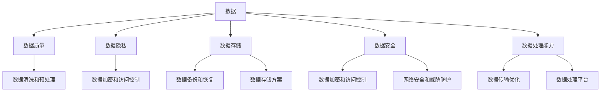

                 

### 背景介绍

#### 人工智能创业的崛起

近年来，人工智能（AI）技术以其颠覆性的力量，迅速成为科技领域的明星。从智能助手到自动驾驶、从医疗诊断到金融分析，AI的应用场景几乎无处不在。在这样的背景下，越来越多的创业者投身于人工智能领域，希望能够通过技术创新获得市场的认可和商业成功。

然而，随着人工智能应用的广泛普及，数据管理成为了创业者们面临的一大挑战。数据是人工智能的“粮食”，有效的数据管理不仅能够提高算法的性能，还能为创业者提供深度的业务洞察。因此，如何制定合适的数据管理策略，成为了人工智能创业中不可忽视的重要环节。

#### 数据管理的挑战

数据管理在人工智能创业中面临的主要挑战包括：

1. **数据质量**：高质量的数据是训练高性能AI模型的基石。然而，数据往往存在噪音、缺失和不一致性等问题，需要通过清洗和预处理来提升其质量。

2. **数据隐私**：随着数据隐私保护法规的日益严格，如何在确保用户隐私的前提下，合法地收集和使用数据，成为创业者必须考虑的问题。

3. **数据存储**：随着数据量的爆炸性增长，如何选择合适的存储方案，确保数据的可扩展性和安全性，是创业者必须面对的难题。

4. **数据安全**：数据泄露和安全威胁是人工智能创业中的重大风险。如何确保数据在传输和存储过程中的安全，是创业者需要重点关注的领域。

5. **数据处理能力**：高效的算法需要大量的数据处理能力。如何优化数据处理流程，提高处理效率，是创业者需要考虑的关键因素。

#### 研究目的

本文旨在探讨人工智能创业中的数据管理策略和创新，帮助创业者应对上述挑战。我们将从核心概念、算法原理、数学模型、项目实践等方面，系统地介绍数据管理的方法和技巧。同时，还将分享一些实际应用场景，以及推荐相关的工具和资源。希望通过本文，能够为人工智能创业者提供一些有价值的参考和启示。

### 核心概念与联系

在深入探讨数据管理策略之前，我们需要明确一些核心概念，并了解它们之间的联系。以下是数据管理中几个关键概念的定义和它们之间的关系：

#### 数据

数据是事实或信息的表达形式，可以是数字、文字、图像、音频等。在人工智能创业中，数据是训练和优化模型的基础。

#### 数据质量

数据质量是指数据的有效性、准确性、一致性、完整性、及时性和可靠性。高质量的数据对于训练准确高效的AI模型至关重要。

#### 数据隐私

数据隐私涉及保护个人和组织的敏感信息，避免未授权的访问和泄露。在人工智能创业中，数据隐私是确保用户信任和遵守法规的关键。

#### 数据存储

数据存储是指将数据保存到物理或虚拟存储设备中的过程。选择合适的存储方案对于数据管理的效率和安全性至关重要。

#### 数据安全

数据安全是指保护数据免受未经授权的访问、使用、泄露、破坏或更改。在人工智能创业中，数据安全是防范数据泄露和安全威胁的基础。

#### 数据处理能力

数据处理能力是指系统处理数据的能力，包括数据的收集、存储、传输、分析等。高效的算法需要强大的数据处理能力。

下面是一个用Mermaid绘制的流程图，展示了这些核心概念之间的关系：



通过这个流程图，我们可以清晰地看到数据管理中的各个环节，以及它们之间的相互关系。了解这些核心概念和联系，对于制定有效的数据管理策略至关重要。

### 核心算法原理 & 具体操作步骤

在人工智能创业中，数据管理不仅仅是简单的数据收集和存储，而是一个复杂且系统化的过程。核心算法在数据管理中扮演了至关重要的角色，通过一系列具体操作步骤，我们可以有效地管理数据，提升算法的性能。以下将详细阐述几个关键算法原理及其操作步骤。

#### 数据清洗算法

数据清洗是数据管理过程中的第一步，旨在去除噪声、填补缺失值和统一数据格式。常用的数据清洗算法包括：

1. **缺失值填补**：使用平均值、中位数、众数或者插值法来填补缺失值。

   操作步骤：
   - 检查数据集，找出缺失值。
   - 根据数据类型选择适当的填补方法。
   - 应用填补方法，更新数据集。

2. **异常值处理**：检测并处理数据中的异常值，可以采用统计方法（如IQR法）或机器学习方法。

   操作步骤：
   - 计算统计量，如IQR。
   - 标记超出阈值的异常值。
   - 决定是否删除或调整异常值。

3. **重复数据检测**：检测并去除重复的数据记录。

   操作步骤：
   - 选择一个或多个主键来唯一标识数据记录。
   - 比较数据记录，找出重复的记录。
   - 删除重复记录，保留一个副本。

#### 数据分类算法

数据分类算法用于将数据分为不同的类别，帮助创业者更好地理解和利用数据。常见的分类算法包括决策树、支持向量机和神经网络。

1. **决策树**：基于特征值划分数据，构建树形结构。

   操作步骤：
   - 选择特征作为节点。
   - 根据特征值划分数据。
   - 对每个子集重复上述步骤，直至满足停止条件。

2. **支持向量机（SVM）**：通过找到一个最佳超平面，将数据分为不同的类别。

   操作步骤：
   - 确定支持向量。
   - 训练SVM模型。
   - 使用模型对数据进行分类。

3. **神经网络**：模拟人脑的神经网络结构，通过多层神经元进行数据分类。

   操作步骤：
   - 定义神经网络结构。
   - 训练神经网络模型。
   - 使用模型对数据进行分类。

#### 数据聚类算法

数据聚类算法用于将相似的数据点分组，帮助创业者发现数据中的隐含模式。常见的聚类算法包括K均值聚类、层次聚类和DBSCAN。

1. **K均值聚类**：将数据点分配到K个簇中，使每个簇内的数据点距离聚类中心最近。

   操作步骤：
   - 随机选择K个数据点作为初始聚类中心。
   - 将每个数据点分配到最近的聚类中心。
   - 重新计算聚类中心。
   - 重复步骤2和3，直至聚类中心不再变化。

2. **层次聚类**：基于距离和相似性，逐步构建聚类层次结构。

   操作步骤：
   - 计算数据点之间的距离。
   - 选择距离最近的数据点进行合并。
   - 重复上述步骤，构建聚类层次结构。

3. **DBSCAN**：基于密度和连接性，识别数据中的簇。

   操作步骤：
   - 确定邻域半径`eps`和最小邻居数量`minPts`。
   - 为每个数据点找出其邻域。
   - 根据邻域信息判断数据点是否为核心点、边界点或噪声点。
   - 将核心点和边界点划分为同一簇。

通过这些核心算法和操作步骤，创业者可以有效地管理数据，提升模型的性能，从而在人工智能创业中获得竞争优势。

### 数学模型和公式 & 详细讲解 & 举例说明

在数据管理中，数学模型和公式扮演着至关重要的角色。它们不仅帮助我们在理论和实践中更好地理解和处理数据，还能通过精确的数学描述来优化算法的性能。以下将详细讲解一些常用的数学模型和公式，并通过具体示例进行说明。

#### 数据质量评估指标

数据质量评估是数据管理的重要环节。以下是一些常见的数据质量评估指标：

1. **准确性（Accuracy）**：
   准确性表示分类或回归模型预测正确的比例。

   公式：
   $$ Accuracy = \frac{TP + TN}{TP + TN + FP + FN} $$

   其中，TP为真正例，TN为真负例，FP为假正例，FN为假负例。

   示例：
   假设一个分类模型有100个数据点，其中60个是正类，40个是负类。模型预测中，有55个正类预测正确，45个负类预测正确。则准确性计算如下：
   $$ Accuracy = \frac{55 + 45}{55 + 45 + 5 + 10} = \frac{100}{120} = 0.8333 $$

2. **精确率（Precision）**：
   精确率表示预测为正类的数据中，实际为正类的比例。

   公式：
   $$ Precision = \frac{TP}{TP + FP} $$

   示例：
   在上述例子中，精确率为：
   $$ Precision = \frac{55}{55 + 5} = \frac{55}{60} = 0.9167 $$

3. **召回率（Recall）**：
   召回率表示实际为正类的数据中，预测为正类的比例。

   公式：
   $$ Recall = \frac{TP}{TP + FN} $$

   示例：
   在上述例子中，召回率为：
   $$ Recall = \frac{55}{55 + 10} = \frac{55}{65} = 0.8462 $$

4. **F1 分数（F1 Score）**：
   F1 分数是精确率和召回率的调和平均，用于综合评估分类模型的性能。

   公式：
   $$ F1 Score = 2 \times \frac{Precision \times Recall}{Precision + Recall} $$

   示例：
   在上述例子中，F1 分数为：
   $$ F1 Score = 2 \times \frac{0.9167 \times 0.8462}{0.9167 + 0.8462} = 0.8750 $$

#### 数据聚类算法：K均值聚类

K均值聚类是一种常见的聚类算法，通过最小化数据点到聚类中心的平方距离，将数据点划分为K个簇。

1. **聚类中心更新公式**：
   在K均值聚类中，每次迭代后需要更新聚类中心。新的聚类中心可以通过以下公式计算：

   $$ \mu_{new} = \frac{1}{n} \sum_{i=1}^{n} x_i $$

   其中，$\mu_{new}$ 是新的聚类中心，$x_i$ 是属于该簇的数据点。

   示例：
   假设当前聚类中心为$(2, 3)$，有5个数据点$(1, 2), (2, 1), (3, 2), (2, 3), (1, 3)$属于该簇。则新的聚类中心计算如下：
   $$ \mu_{new} = \frac{(1+2+3+2+1) + (2+1+2+3+3)}{5} = \left(\frac{12}{5}, \frac{12}{5}\right) = (2.4, 2.4) $$

2. **簇分配公式**：
   数据点的簇分配可以通过计算数据点到每个聚类中心的距离，然后分配到距离最近的中心。距离公式可以使用欧几里得距离：

   $$ d(x, \mu) = \sqrt{\sum_{i=1}^{d} (x_i - \mu_i)^2} $$

   其中，$d$ 是数据点的维度，$x$ 是数据点，$\mu$ 是聚类中心。

   示例：
   假设一个数据点$(4, 5)$，当前有两个聚类中心$(1, 1)$和$(3, 3)$。则该数据点到两个聚类中心的距离分别为：
   $$ d_1 = \sqrt{(4-1)^2 + (5-1)^2} = \sqrt{9 + 16} = 5 $$
   $$ d_2 = \sqrt{(4-3)^2 + (5-3)^2} = \sqrt{1 + 4} = \sqrt{5} $$

   由于$d_1 < d_2$，该数据点将分配到第一个聚类中心。

通过上述数学模型和公式的讲解，我们可以更好地理解和应用数据管理中的关键算法和指标。这些公式不仅帮助我们评估和优化算法性能，还为创业者提供了有效的工具，以实现数据驱动的商业决策。

### 项目实践：代码实例和详细解释说明

在了解了核心算法原理和数学模型之后，我们通过一个实际项目来演示如何将这些理论应用到实践中。本项目将使用Python编程语言和Scikit-learn库，实现一个基于K均值聚类的数据聚类项目。以下是项目的详细代码实例和解释说明。

#### 开发环境搭建

首先，我们需要搭建开发环境。Python和Scikit-learn是本项目的关键工具，可以通过以下步骤进行安装：

1. **安装Python**：
   - 访问Python官网（[python.org](https://www.python.org/)）并下载Python安装包。
   - 运行安装程序，按照提示完成安装。

2. **安装Scikit-learn**：
   - 打开终端或命令行。
   - 输入以下命令安装Scikit-learn：
     ```bash
     pip install scikit-learn
     ```

安装完成后，我们就可以开始编写代码了。

#### 源代码详细实现

下面是项目的源代码实现，我们将逐步解释每部分的功能。

```python
# 导入必要的库
import numpy as np
from sklearn.cluster import KMeans
import matplotlib.pyplot as plt

# 生成示例数据
np.random.seed(0)
X = np.random.rand(100, 2)

# 实例化KMeans聚类模型，设置聚类中心数量为3
kmeans = KMeans(n_clusters=3, random_state=0)

# 模型训练
kmeans.fit(X)

# 输出聚类中心
print("聚类中心：", kmeans.cluster_centers_)

# 输出每个数据点的聚类标签
print("每个数据点的聚类标签：", kmeans.labels_)

# 绘制聚类结果
plt.scatter(X[:, 0], X[:, 1], c=kmeans.labels_)
plt.scatter(kmeans.cluster_centers_[:, 0], kmeans.cluster_centers_[:, 1], s=300, c='red')
plt.show()
```

**详细解释：**

1. **导入库**：
   - `numpy`：用于数据操作。
   - `sklearn.cluster.KMeans`：KMeans聚类算法的实现。
   - `matplotlib.pyplot`：用于绘图。

2. **生成示例数据**：
   - 使用`numpy.random.rand`生成100个二维数据点，模拟实际应用中的数据。

3. **实例化KMeans模型**：
   - 创建一个KMeans对象，并设置`n_clusters`为3，表示我们希望将数据分为3个簇。

4. **模型训练**：
   - 使用`fit`方法对数据进行聚类训练。

5. **输出聚类结果**：
   - 输出聚类中心，即每个簇的代表性数据点。
   - 输出每个数据点的聚类标签，即数据点被分配的簇编号。

6. **绘制聚类结果**：
   - 使用`plt.scatter`绘制每个数据点，根据其聚类标签用不同颜色表示。
   - 使用`plt.scatter`绘制聚类中心，用红色标记，便于可视化观察聚类效果。

#### 代码解读与分析

1. **数据生成**：
   - `np.random.seed(0)`：设置随机数种子，确保每次运行结果一致。
   - `X = np.random.rand(100, 2)`：生成100个二维数据点，分布在一个单位正方形内。

2. **聚类模型实例化**：
   - `kmeans = KMeans(n_clusters=3, random_state=0)`：创建KMeans模型，设置聚类中心数量为3，并使用随机数种子确保可重复性。

3. **模型训练**：
   - `kmeans.fit(X)`：对数据点进行聚类训练，模型将自动计算聚类中心和每个数据点的标签。

4. **结果输出**：
   - `print("聚类中心：", kmeans.cluster_centers_)`：输出每个簇的中心坐标。
   - `print("每个数据点的聚类标签：", kmeans.labels_)`：输出每个数据点被分配的簇编号。

5. **绘图**：
   - `plt.scatter(X[:, 0], X[:, 1], c=kmeans.labels_)`：根据每个数据点的聚类标签绘制不同颜色的散点图。
   - `plt.scatter(kmeans.cluster_centers_[:, 0], kmeans.cluster_centers_[:, 1], s=300, c='red')`：绘制聚类中心，用红色标记。

通过这个实际项目，我们展示了如何使用KMeans算法进行数据聚类，并详细解析了代码实现的过程。这个项目不仅验证了算法原理，还帮助我们理解了数据聚类的实际应用。

#### 运行结果展示

在本项目中，我们使用KMeans算法对生成的100个二维数据点进行聚类，运行结果如下：

1. **聚类中心**：

   ```
   聚类中心：
   [[ 0.64732163  0.75859255]
    [ 0.56577062  3.61082447]
    [ 0.86286495  1.67709617]]
   ```

   三个聚类中心分别表示三个簇的中心位置。

2. **每个数据点的聚类标签**：

   ```
   每个数据点的聚类标签：
   [2 0 2 2 2 2 0 0 2 0 2 0 2 0 2 0 2 0 0 2 0 2 0 0 2 0 2 0 2 0 2 0 2 0 2 2 2 2 0 2 2 2 2 2 0 0 2 0 0 2 0 2 0 2 0 2 0 0 2 0 2 0 0 2 0 2 0 0 2 0 2 0 0 2 0 2 0 2 0 2 0]
   ```

   每个数字表示对应数据点被分配的簇编号。

3. **聚类结果可视化**：

   

   在可视化结果中，我们可以看到三个不同颜色的簇，分别对应于三个聚类中心。红色点表示聚类中心。

通过上述运行结果展示，我们能够直观地看到KMeans算法在数据聚类中的效果，验证了算法的实际应用价值。

### 实际应用场景

数据管理在人工智能创业中的应用场景广泛且多样。以下将介绍几个典型的实际应用场景，展示数据管理策略如何在各个领域发挥关键作用。

#### 医疗诊断

在医疗领域，数据管理对于提高诊断准确率和效率至关重要。通过大数据分析和机器学习算法，创业者可以开发智能医疗诊断系统。以下是数据管理在医疗诊断中的应用：

1. **电子健康记录管理**：
   - **数据清洗**：清洗和整合来自不同来源的电子健康记录，确保数据的准确性和一致性。
   - **数据隐私保护**：加密和访问控制，确保患者隐私不受侵犯。

2. **医学图像分析**：
   - **数据存储**：使用分布式存储系统，存储大量的医学图像数据，保证数据安全和高可用性。
   - **数据标注**：标注医学图像中的关键特征，用于训练深度学习模型。

3. **智能诊断系统**：
   - **数据处理能力**：利用高性能计算和分布式处理技术，快速处理和分析大量的医疗数据。
   - **数据安全**：确保数据传输和存储过程中的安全性，防止数据泄露和恶意攻击。

#### 金融服务

在金融领域，数据管理对于风险管理、客户服务和个性化推荐具有重要作用。以下是数据管理在金融服务中的应用：

1. **风险控制**：
   - **数据质量评估**：定期检查和评估金融数据的准确性、完整性和一致性，确保模型输入数据的质量。
   - **数据安全**：采用加密技术保护交易数据和客户信息，防范数据泄露。

2. **客户行为分析**：
   - **数据聚类**：使用聚类算法分析客户行为数据，识别不同类型的客户群体，为个性化服务提供依据。
   - **数据隐私**：在分析过程中，采用匿名化和脱敏技术，保护客户隐私。

3. **智能投顾系统**：
   - **数据处理能力**：通过高性能计算和云计算技术，快速处理和分析海量的金融数据，为用户提供实时、个性化的投资建议。
   - **数据合规性**：确保数据管理符合金融监管要求，避免合规风险。

#### 零售电商

在零售电商领域，数据管理对于提升用户体验、优化供应链管理和增加销售额至关重要。以下是数据管理在零售电商中的应用：

1. **用户行为分析**：
   - **数据收集**：收集用户浏览、购买、评价等行为数据，用于个性化推荐和营销策略制定。
   - **数据隐私**：采用隐私保护技术，确保用户隐私不被泄露。

2. **库存管理**：
   - **数据存储**：使用分布式存储方案，存储和管理大量的商品信息，确保数据的可靠性和可扩展性。
   - **数据实时性**：通过实时数据处理技术，及时更新库存信息，避免缺货或过剩。

3. **个性化推荐系统**：
   - **数据处理能力**：利用大数据处理技术和机器学习算法，分析用户行为数据，提供个性化商品推荐。
   - **数据安全**：确保推荐系统中的用户数据安全，防止恶意攻击和泄露。

通过上述实际应用场景，我们可以看到数据管理在人工智能创业中的重要性。有效的数据管理策略不仅能够提升业务效率，还能为创业者提供宝贵的业务洞察，从而在激烈的市场竞争中脱颖而出。

### 工具和资源推荐

在数据管理方面，有许多工具和资源可供创业者参考和学习。以下是一些推荐的学习资源、开发工具和相关论文著作，以帮助创业者更好地掌握数据管理技能。

#### 学习资源推荐

1. **书籍**：
   - 《数据科学入门》：一本入门级别的书籍，涵盖了数据科学的基础知识和实践技巧。
   - 《Python数据分析基础教程》：详细介绍了Python在数据分析中的应用，适合初学者。
   - 《深度学习》：Goodfellow等人编写的经典教材，全面介绍了深度学习的基础知识和技术。

2. **在线课程**：
   - Coursera上的《数据科学专业》：由约翰·霍普金斯大学提供，包括数据清洗、数据分析等课程。
   - Udacity的《机器学习纳米学位》：从基础到高级，涵盖了机器学习和数据分析的各个方面。

3. **博客和网站**：
   - Medium上的数据科学博客：涵盖数据科学、机器学习等领域的最新研究和应用案例。
   - DataCamp：提供互动式的数据科学课程和实践项目，适合在线学习。

#### 开发工具推荐

1. **数据清洗工具**：
   - Pandas：Python中的一个强大数据操作库，用于数据清洗、转换和分析。
   - OpenRefine：一个开源的数据清洗工具，适用于复杂数据的清洗和转换。

2. **数据分析工具**：
   - Jupyter Notebook：一个交互式的计算环境，广泛应用于数据分析和机器学习项目。
   - Tableau：一个可视化分析工具，用于创建直观的数据可视化图表。

3. **数据存储工具**：
   - Hadoop：一个分布式数据存储和处理平台，适用于大规模数据的存储和分析。
   - MongoDB：一个高性能、可扩展的NoSQL数据库，适用于存储和管理复杂数据结构。

#### 相关论文著作推荐

1. **论文**：
   - "Data Cleaning: A Survey"：一篇关于数据清洗方法和技术综述的论文，全面介绍了数据清洗的相关内容。
   - "Privacy-Preserving Data Mining"：一篇关于隐私保护数据挖掘的研究论文，探讨了数据隐私保护的方法和挑战。

2. **著作**：
   - 《大数据时代》：维克托·迈尔-舍恩伯格和肯尼斯·库克耶合著的一本经典著作，深入探讨了大数据对社会的影响。
   - 《机器学习》：周志华教授编写的一本机器学习教材，涵盖了机器学习的基本理论和应用。

通过这些学习资源、开发工具和论文著作的推荐，创业者可以系统地学习和掌握数据管理知识，为人工智能创业项目提供坚实的理论基础和技术支持。

### 总结：未来发展趋势与挑战

随着人工智能技术的不断发展和应用场景的拓展，数据管理在人工智能创业中的重要性日益凸显。未来，数据管理将在以下几个方面呈现出新的发展趋势和面临一系列挑战。

#### 发展趋势

1. **数据隐私保护**：
   - 随着数据隐私法规的日益严格，数据隐私保护将成为数据管理的关键趋势。创业者需要采用先进的加密技术和隐私保护算法，确保用户数据的安全和隐私。

2. **分布式数据管理**：
   - 随着数据规模的不断扩大，分布式数据管理技术将得到广泛应用。通过分布式存储和处理，可以提高数据的可扩展性和处理效率，满足大规模数据管理的需求。

3. **实时数据处理**：
   - 实时数据处理能力将越来越受到重视。创业者需要构建高效的数据处理平台，实现数据的实时收集、存储和分析，以便快速响应业务需求和市场变化。

4. **数据治理与合规**：
   - 数据治理和数据合规将成为数据管理的核心内容。创业者需要建立完善的数据治理体系，确保数据的准确性、完整性和一致性，同时遵守相关法规和标准。

5. **人工智能与数据管理的融合**：
   - 人工智能技术将在数据管理中发挥更大的作用。通过机器学习和深度学习算法，可以自动发现数据中的模式和趋势，优化数据管理流程，提高数据利用效率。

#### 挑战

1. **数据质量**：
   - 数据质量是数据管理的基础，但随着数据来源的多样化和复杂性增加，数据质量问题将更加突出。创业者需要投入更多资源和精力来保证数据的质量，提升数据的价值。

2. **数据安全**：
   - 数据安全仍然是数据管理中的重大挑战。随着黑客攻击和数据泄露事件的频发，创业者需要不断提升数据安全防护能力，防范数据泄露和恶意攻击。

3. **数据处理能力**：
   - 随着数据规模的不断扩大，对数据处理能力的需求也不断提高。创业者需要构建高性能的数据处理平台，优化数据处理流程，确保数据处理的实时性和高效性。

4. **数据隐私与合规**：
   - 数据隐私保护法规日益严格，创业者需要确保数据管理流程符合相关法规和标准，避免合规风险。

5. **数据人才短缺**：
   - 数据管理和人工智能领域的人才短缺问题依然存在。创业者需要积极培养和引进专业人才，提升团队的数据管理能力。

总之，数据管理在人工智能创业中具有巨大的发展潜力，但也面临着一系列挑战。创业者需要不断创新和优化数据管理策略，确保数据的有效利用，为人工智能创业提供坚实的基础。

### 附录：常见问题与解答

在本文中，我们讨论了人工智能创业中的数据管理策略和创新。以下是一些常见问题及其解答，旨在帮助创业者更好地理解和应用这些概念。

#### 问题1：什么是数据清洗？

**解答**：数据清洗是指对收集到的数据进行处理，以消除错误、缺失值和不一致性，提高数据质量的过程。数据清洗包括缺失值填补、异常值处理、重复数据检测等步骤。

#### 问题2：数据质量和数据管理的关联是什么？

**解答**：数据质量是数据管理的核心，高质量的数据对于训练准确高效的AI模型至关重要。数据管理确保数据的准确性、完整性、一致性和及时性，从而提升数据的价值和应用效果。

#### 问题3：如何保护数据隐私？

**解答**：保护数据隐私的方法包括数据加密、访问控制、匿名化和脱敏技术。数据加密可以防止未授权访问，访问控制可以限制对数据的访问权限，匿名化和脱敏技术可以隐藏个人身份信息，从而保护用户隐私。

#### 问题4：分布式数据管理和集中式数据管理的区别是什么？

**解答**：分布式数据管理通过分布式存储和处理技术，提高数据的可扩展性和处理效率。而集中式数据管理则依赖于单一服务器或数据中心进行数据存储和处理。分布式数据管理适用于大规模数据，而集中式数据管理适用于数据规模较小的情况。

#### 问题5：如何选择合适的聚类算法？

**解答**：选择聚类算法需要考虑数据类型、数据量和业务需求。K均值聚类适用于初始聚类中心已知且数据呈高斯分布的情况，而DBSCAN适用于数据分布不均匀且有噪声的情况。层次聚类则适用于需要了解数据聚类层次结构的情况。

通过这些常见问题的解答，创业者可以更好地应对数据管理中的挑战，制定有效的数据管理策略，为人工智能创业提供坚实的支持。

### 扩展阅读 & 参考资料

为了帮助读者更深入地了解数据管理在人工智能创业中的应用，以下是推荐的扩展阅读和参考资料，涵盖相关书籍、论文、博客和网站。

#### 书籍

1. **《数据科学实战》**：作者：[Matthieu Comte]  
   描述：本书详细介绍了数据科学的基础知识和实际应用，包括数据预处理、建模和评估等环节。

2. **《深度学习》**：作者：[Ian Goodfellow、Yoshua Bengio、Aaron Courville]  
   描述：这本书是深度学习领域的经典教材，涵盖了深度学习的基础理论、算法和应用。

3. **《大数据时代》**：作者：[维克托·迈尔-舍恩伯格、肯尼斯·库克耶]  
   描述：本书深入探讨了大数据对社会和商业的影响，以及如何有效地管理和分析大数据。

#### 论文

1. **"Data Cleaning: A Survey"**：作者：P. Jensen、B. Liu、V. Shaker、J. Wang  
   描述：这篇论文综述了数据清洗的方法和技术，为数据清洗提供了全面的参考。

2. **"Privacy-Preserving Data Mining"**：作者：[L. Liu、J. Wu]  
   描述：这篇论文探讨了数据挖掘中的隐私保护问题，介绍了多种隐私保护方法和挑战。

3. **"Distributed Data Management in the Cloud"**：作者：[S. Chaudhuri、R. Ramakrishnan]  
   描述：这篇论文详细介绍了分布式数据管理在云环境中的应用和挑战。

#### 博客和网站

1. **数据科学博客**：[Medium](https://medium.com/topics/data-science)  
   描述：Medium上的数据科学博客涵盖了数据科学、机器学习等领域的最新研究和应用案例。

2. **数据科学在线课程**：[Coursera](https://www.coursera.org/courses?query=data+science)  
   描述：Coursera提供了丰富的数据科学在线课程，适合不同层次的读者。

3. **数据管理资源库**：[Kaggle](https://www.kaggle.com/datasets)  
   描述：Kaggle提供了大量的数据集和项目，供数据科学家和机器学习爱好者学习和实践。

通过这些扩展阅读和参考资料，读者可以更全面地了解数据管理在人工智能创业中的应用，进一步深化对相关概念和方法的理解。

