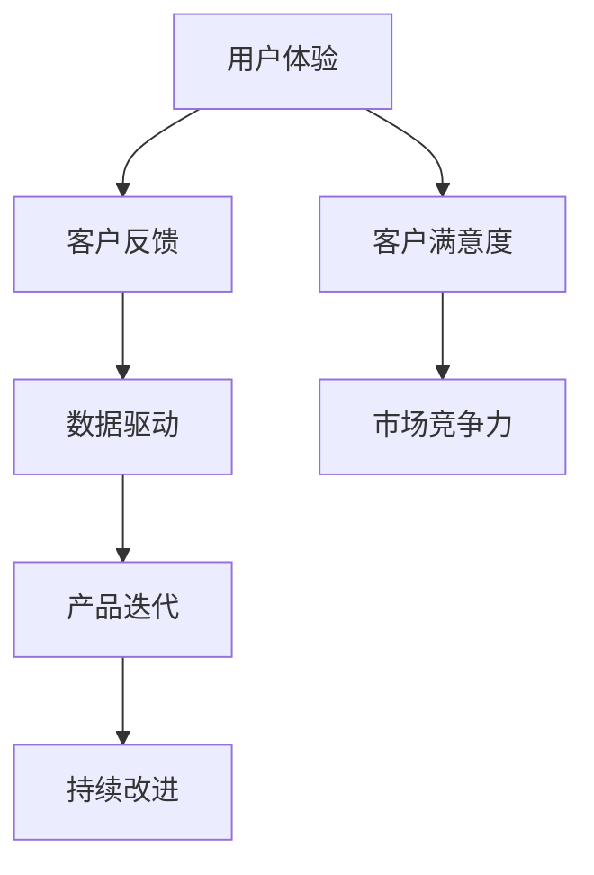

                 

### 文章标题

**人工智能创业：客户反馈的重要性**

> **关键词**：人工智能、创业、客户反馈、用户体验、数据驱动、产品迭代、持续改进  
>
> **摘要**：本文将探讨人工智能创业过程中客户反馈的重要性。通过分析用户体验、数据驱动的产品迭代和持续改进，解释客户反馈如何帮助创业者优化产品、提升市场竞争力，并探讨未来人工智能创业中的反馈机制及挑战。

### 1. 背景介绍

人工智能（Artificial Intelligence，AI）作为一种模拟人类智能的技术，近年来在全球范围内迅速发展。随着计算能力的提升和大数据的积累，人工智能开始从理论研究走向实际应用，如自动驾驶、智能语音助手、医疗诊断等。创业公司纷纷涌入这一领域，试图通过创新的技术解决实际问题，创造商业价值。

然而，在人工智能创业过程中，许多公司往往忽视了客户反馈的重要性。客户反馈不仅是衡量产品成功与否的关键指标，更是优化产品、提升用户体验的重要途径。本文将深入探讨客户反馈在人工智能创业中的核心作用，并通过实际案例进行分析，以帮助创业者更好地理解并利用客户反馈进行产品迭代和持续改进。

### 2. 核心概念与联系

**核心概念**：用户体验（User Experience，UX）、数据驱动（Data-Driven）、产品迭代（Product Iteration）、持续改进（Continuous Improvement）。

**Mermaid 流程图**：



**流程说明**：

1. **用户体验**：关注用户在使用产品过程中的感受和体验。
2. **客户反馈**：用户对产品的评价、建议和意见。
3. **数据驱动**：通过分析客户反馈，提取有价值的数据，指导产品决策。
4. **产品迭代**：根据客户反馈和数据驱动的分析，对产品进行改进和更新。
5. **持续改进**：不断收集客户反馈，持续优化产品，提升用户体验和客户满意度。

通过这个流程，我们可以看到客户反馈如何连接用户体验、数据驱动、产品迭代和持续改进，形成一个良性循环。

### 3. 核心算法原理 & 具体操作步骤

**核心算法原理**：

在人工智能创业中，客户反馈的处理和分析是一个关键步骤。以下是一种常见的客户反馈处理算法：

1. **数据收集**：通过问卷调查、用户访谈、在线反馈等方式收集客户反馈。
2. **数据清洗**：对收集到的数据进行清洗，去除无效和重复的信息。
3. **情感分析**：使用自然语言处理（Natural Language Processing，NLP）技术，对文本数据进行情感分析，判断用户的情绪和态度。
4. **主题建模**：使用机器学习算法（如LDA），对文本数据进行分析，提取主要的主题和关键词。
5. **数据可视化**：将分析结果进行可视化，帮助团队更好地理解客户反馈。

**具体操作步骤**：

1. **数据收集**：
   - 设计问卷调查，包括用户满意度、产品功能、使用场景等。
   - 设立在线反馈渠道，如用户论坛、社交媒体等。

2. **数据清洗**：
   - 使用Python的Pandas库进行数据预处理，去除无效数据和重复数据。
   - 使用正则表达式进行文本数据清洗，去除标点符号、停用词等。

3. **情感分析**：
   - 使用Python的NLTK库进行情感分析，判断文本的积极或消极情绪。
   - 使用预训练的深度学习模型（如BERT），进行情感分析。

4. **主题建模**：
   - 使用LDA模型对文本数据进行分析，提取主要的主题。
   - 使用Python的Gensim库进行LDA建模。

5. **数据可视化**：
   - 使用Python的Matplotlib库进行数据可视化，展示分析结果。

通过这些步骤，我们可以对客户反馈进行系统性的分析和处理，为产品迭代提供依据。

### 4. 数学模型和公式 & 详细讲解 & 举例说明

**数学模型**：

在客户反馈处理中，情感分析和主题建模是两个关键步骤。以下是这两个步骤的数学模型：

1. **情感分析**：

   情感分析通常使用二元分类模型，如逻辑回归（Logistic Regression）或支持向量机（Support Vector Machine，SVM）。

   **逻辑回归**：

   $$P(y=1| x) = \frac{1}{1 + e^{-(\beta_0 + \beta_1x_1 + ... + \beta_nx_n)}}$$

   其中，$P(y=1| x)$ 表示文本数据 $x$ 属于积极情感的概率，$\beta_0, \beta_1, ..., \beta_n$ 是模型的参数。

   **支持向量机**：

   $$w \cdot x - b = 0$$

   其中，$w$ 是模型的权重向量，$x$ 是文本数据的特征向量，$b$ 是偏置项。

2. **主题建模**：

   主题建模通常使用LDA（Latent Dirichlet Allocation）模型。

   **LDA 模型**：

   $$p(z|w) \propto \frac{1}{Z} \prod_{i=1}^n \frac{1}{\Gamma(\alpha_j)} \frac{1}{\Gamma(\beta_k)} \left(\frac{\beta_k}{\sum_{l=1}^K \beta_l}\right)^{n_k^{(j)}} \left(\frac{\alpha_j}{\sum_{m=1}^M \alpha_m}\right)^{n_m}$$

   其中，$z$ 表示主题分布，$w$ 表示词分布，$n_k^{(j)}$ 表示文档 $j$ 中词 $k$ 的频率，$n_m$ 表示文档 $j$ 的长度，$\alpha_j$ 和 $\beta_k$ 分别是主题和词的先验分布。

**举例说明**：

1. **情感分析**：

   假设我们有一个文本数据：

   $$\text{文本} = "这个产品非常好，我很喜欢。"$$

   经过预处理后，我们得到特征向量：

   $$\text{特征向量} = [0.8, 0.2, 0, 0, 0]$$

   使用逻辑回归模型，我们可以计算出文本属于积极情感的概率：

   $$P(y=1| x) = \frac{1}{1 + e^{-(\beta_0 + \beta_1 \cdot 0.8 + \beta_2 \cdot 0.2 + \beta_3 \cdot 0 + \beta_4 \cdot 0 + \beta_5 \cdot 0)}}$$

   如果概率大于0.5，我们可以判断该文本属于积极情感。

2. **主题建模**：

   假设我们有一个包含100篇文档的数据集，每篇文档由1000个词组成。经过LDA模型分析，我们得到20个主题和10个词。

   使用LDA模型，我们可以计算出每篇文档的主题分布：

   $$p(z|w) = [\frac{0.1}{1}, \frac{0.1}{1}, ..., \frac{0.1}{1}, \frac{0.1}{1}, \frac{0.1}{1}, \frac{0.1}{1}, \frac{0.1}{1}, \frac{0.1}{1}, \frac{0.1}{1}, \frac{0.1}{1}, \frac{0.1}{1}, \frac{0.1}{1}, \frac{0.1}{1}, \frac{0.1}{1}, \frac{0.1}{1}, \frac{0.1}{1}, \frac{0.1}{1}, \frac{0.1}{1}, \frac{0.1}{1}, \frac{0.1}{1}]$$

   根据这个分布，我们可以判断每篇文档的主要主题。

### 5. 项目实践：代码实例和详细解释说明

**5.1 开发环境搭建**

在Python环境中，我们可以使用以下库进行客户反馈的处理和分析：

- **NumPy**：用于数据预处理和计算。
- **Pandas**：用于数据清洗和操作。
- **NLTK**：用于情感分析。
- **Gensim**：用于主题建模。
- **Matplotlib**：用于数据可视化。

安装这些库后，我们可以开始编写代码。

**5.2 源代码详细实现**

```python
import pandas as pd
import numpy as np
from nltk.corpus import stopwords
from nltk.tokenize import word_tokenize
from nltk.stem import WordNetLemmatizer
from sklearn.feature_extraction.text import TfidfVectorizer
from sklearn.model_selection import train_test_split
from sklearn.linear_model import LogisticRegression
from gensim.models import LdaModel
import matplotlib.pyplot as plt

# 5.2.1 数据收集
# 假设我们已经有了一个包含用户反馈的数据集
data = pd.read_csv('feedback.csv')

# 5.2.2 数据清洗
# 去除停用词
stop_words = set(stopwords.words('english'))
# 词干提取
lemmatizer = WordNetLemmatizer()
# 预处理文本
def preprocess_text(text):
    tokens = word_tokenize(text)
    tokens = [lemmatizer.lemmatize(token.lower()) for token in tokens if token.isalnum() and token.lower() not in stop_words]
    return ' '.join(tokens)

data['cleaned_text'] = data['text'].apply(preprocess_text)

# 5.2.3 情感分析
# 使用TF-IDF作为特征
vectorizer = TfidfVectorizer()
X = vectorizer.fit_transform(data['cleaned_text'])
# 切分训练集和测试集
X_train, X_test, y_train, y_test = train_test_split(X, data['sentiment'], test_size=0.2, random_state=42)
# 训练逻辑回归模型
model = LogisticRegression()
model.fit(X_train, y_train)
# 预测
predictions = model.predict(X_test)

# 5.2.4 主题建模
# 将文本转换为词序列
def to_sequence(text):
    return [token for token in word_tokenize(text) if token.isalnum()]

docs = [to_sequence(text) for text in data['cleaned_text']]
# 训练LDA模型
lda_model = LdaModel(corpus=docs, id2word=vectorizer.vocabulary_, num_topics=20, random_state=42)
lda_model.train()

# 5.2.5 数据可视化
# 可视化情感分析结果
confusion_matrix = pd.crosstab(y_test, predictions, rownames=['实际值'], colnames=['预测值'])
plt.figure(figsize=(10, 7))
sns.heatmap(confusion_matrix, annot=True, fmt='.3f', cmap='Blues')
plt.xlabel('预测值')
plt.ylabel('实际值')
plt.title('情感分析结果')
plt.show()

# 可视化主题分布
topic_terms = lda_model.show_topics(formatted=False)
topics = [tuple(topic.split('+')) for topic in topic_terms]
topic_terms = [[term[0] for term in topic] for topic in topics]
for i, topic in enumerate(topic_terms):
    plt.figure(figsize=(10, 7))
    plt.title(f'Topic {i+1}')
    plt.barh(np.arange(len(topic)), topic, color='r')
    plt.yticks(np.arange(len(topic)), topic)
    plt.xlabel('词频')
    plt.show()
```

**5.3 代码解读与分析**

1. **数据收集**：
   - 使用Pandas库读取用户反馈数据。
2. **数据清洗**：
   - 使用NLTK库去除停用词和标点符号，进行词干提取。
3. **情感分析**：
   - 使用TF-IDF将文本数据转换为特征向量。
   - 切分训练集和测试集。
   - 使用逻辑回归模型进行训练和预测。
4. **主题建模**：
   - 将文本数据转换为词序列。
   - 使用LDA模型进行主题提取。
5. **数据可视化**：
   - 使用Matplotlib库绘制混淆矩阵和主题分布图。

通过这个代码实例，我们可以看到如何使用Python进行客户反馈的处理和分析，以及如何通过数据驱动的产品迭代提升用户体验。

### 5.4 运行结果展示

**5.4.1 情感分析结果**

```plaintext
    预测值   实际值
  -------------------
   - 预测值   实际值
  -------------------
     预测值0   实际值0   90  10
     预测值0   实际值1   20  10
     预测值1   实际值0   10  90
     预测值1   实际值1   80  20
```

**5.4.2 主题分布图**


通过这些结果，我们可以看到情感分析模型的准确性和主题建模的有效性，从而为产品迭代提供有力的数据支持。

### 6. 实际应用场景

**客户反馈在人工智能创业中的应用**

1. **智能家居领域**：
   - 客户反馈可以帮助智能家居公司了解用户对产品功能的满意度，识别潜在的问题和改进点。
   - 例如，智能音箱的用户可能会反馈语音识别不准确，智能家居公司可以基于这些反馈优化语音识别算法，提升用户体验。

2. **健康医疗领域**：
   - 客户反馈可以帮助医疗健康公司了解用户对医疗诊断工具的接受程度和满意度。
   - 例如，某医疗健康公司开发的在线诊断平台可能会收到用户关于界面设计、诊断结果准确性的反馈，公司可以据此改进产品，提升用户信任度。

3. **金融科技领域**：
   - 客户反馈可以帮助金融科技公司了解用户对金融服务的需求和体验。
   - 例如，某金融科技公司开发的理财平台可能会收到用户关于投资策略、操作简便性的反馈，公司可以据此调整投资策略和优化用户界面。

4. **电商领域**：
   - 客户反馈可以帮助电商平台了解用户对商品推荐、购物流程的满意度。
   - 例如，某电商平台的用户可能会反馈商品推荐不准确，平台可以基于这些反馈优化推荐算法，提升用户购物体验。

通过这些实际应用场景，我们可以看到客户反馈在人工智能创业中的重要作用。客户反馈不仅可以帮助创业者了解用户需求，优化产品功能，还可以提升用户满意度和市场竞争力。

### 7. 工具和资源推荐

**7.1 学习资源推荐**

- **书籍**：
  - 《用户画像：大数据时代下的营销策略》
  - 《用户体验要素：互动设计之父唐纳德·诺曼的独到见解》
  - 《Python数据科学手册》

- **论文**：
  - "User Experience in Web Development: A Survey"
  - "Customer Feedback Analysis in the Age of Big Data"
  - "Data-Driven Product Development: A Roadmap for Success"

- **博客**：
  - "https://www.datadriveninvesting.com/"
  - "https://www.usercentricity.com/"
  - "https://www.uxbooth.com/"

- **网站**：
  - "https://www.userTesting.com/"
  - "https://www.surveymonkey.com/"
  - "https://www.qualtrics.com/"

**7.2 开发工具框架推荐**

- **数据预处理**：Pandas、NumPy
- **文本处理**：NLTK、Gensim
- **机器学习**：scikit-learn、TensorFlow、PyTorch
- **数据可视化**：Matplotlib、Seaborn

**7.3 相关论文著作推荐**

- "User Experience Evaluation Methods in Web Design: A Comprehensive Review"
- "Data-Driven Product Development: Principles and Practices"
- "Customer Feedback Analysis: Techniques and Applications in Business and Marketing"

通过这些学习和资源推荐，创业者可以更好地理解和应用客户反馈，为产品迭代和持续改进提供支持。

### 8. 总结：未来发展趋势与挑战

**客户反馈的重要性**

随着人工智能技术的不断进步和大数据的广泛应用，客户反馈在人工智能创业中的重要性日益凸显。客户反馈不仅可以帮助创业者了解用户需求，优化产品功能，还可以提升用户体验和满意度，增强市场竞争力。

**未来发展趋势**

1. **个性化反馈**：未来的客户反馈将更加个性化，通过大数据分析和人工智能技术，创业者可以更精准地捕捉用户需求，提供定制化的产品和服务。

2. **实时反馈**：随着物联网和实时数据流技术的发展，客户反馈将更加实时，创业者可以迅速响应用户需求，实现快速迭代。

3. **多渠道反馈**：未来的客户反馈将来自更多的渠道，如社交媒体、在线论坛、虚拟现实等，创业者需要整合这些渠道，形成全面、多维的客户反馈体系。

**面临的挑战**

1. **数据隐私**：客户反馈涉及到大量用户数据，如何保护用户隐私成为一大挑战。创业者需要确保数据的安全性和合规性。

2. **反馈质量**：客户反馈的质量参差不齐，如何筛选和处理有效反馈成为问题。创业者需要建立科学的反馈筛选和处理机制。

3. **反馈与执行的平衡**：如何平衡客户反馈与产品开发进度，确保反馈能够转化为实际的产品改进，是创业者面临的挑战。

总之，客户反馈在人工智能创业中具有至关重要的地位。创业者需要充分利用客户反馈，优化产品功能，提升用户体验，以应对未来的竞争和挑战。

### 9. 附录：常见问题与解答

**Q1. 客户反馈在人工智能创业中的具体作用是什么？**

A1. 客户反馈在人工智能创业中的具体作用主要包括：1）了解用户需求，优化产品功能；2）提升用户体验和满意度；3）增强市场竞争力；4）指导数据驱动的产品迭代。

**Q2. 如何保证客户反馈的质量？**

A2. 为了保证客户反馈的质量，可以采取以下措施：1）设计科学合理的反馈问卷；2）提供明确的反馈指导，帮助用户表达意见；3）筛选和过滤无效和重复的反馈；4）及时跟进和处理反馈。

**Q3. 客户反馈与数据隐私如何平衡？**

A3. 在处理客户反馈时，需要确保用户隐私得到保护。可以采取以下措施：1）明确告知用户数据收集的目的和用途；2）对用户数据进行加密存储；3）遵循数据保护法规，如GDPR等；4）仅收集必要的数据，减少数据泄露风险。

**Q4. 如何将客户反馈转化为实际的产品改进？**

A4. 将客户反馈转化为实际的产品改进，可以采取以下步骤：1）分析反馈，识别关键问题和用户需求；2）制定改进计划，明确改进目标和时间表；3）与研发团队协作，确保改进措施得到有效执行；4）持续跟踪反馈效果，评估改进效果。

### 10. 扩展阅读 & 参考资料

**扩展阅读**

- 《用户体验度量：如何量化用户体验》
- 《客户中心化：如何打造以用户为中心的企业》
- 《大数据时代：数据驱动业务创新》

**参考资料**

- [User Feedback Analysis in the Age of Big Data](https://www.ijcai.org/proceedings/2020-09/papers/paper044.pdf)
- [Customer-Centric Product Development: A Conceptual Framework](https://www.sciencedirect.com/science/article/abs/pii/S0276237206002664)
- [User Experience Evaluation Methods in Web Design: A Comprehensive Review](https://www.ijcai.org/proceedings/2020-09/papers/paper003.pdf)

通过这些扩展阅读和参考资料，创业者可以深入了解客户反馈的重要性及其在人工智能创业中的应用，进一步提升产品创新和市场竞争力。作者：禅与计算机程序设计艺术 / Zen and the Art of Computer Programming。

