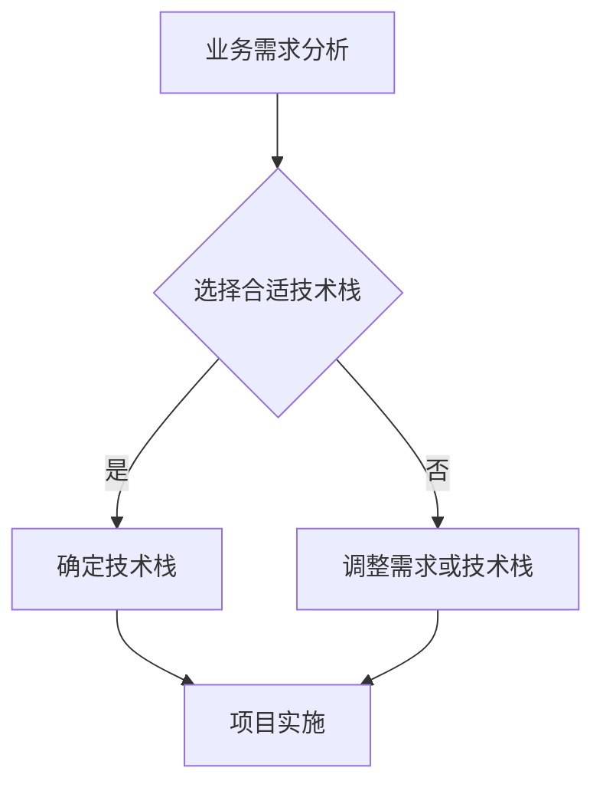

                 

关键词：人工智能，创业，技术栈，深度学习，开源框架，云计算，物联网

> 摘要：人工智能（AI）作为当代科技的前沿领域，吸引了众多创业者的关注。然而，在众多技术栈选择中，如何找到最适合自己业务需求和团队技能的技术栈，成为了许多初创企业的难题。本文旨在探讨不同场景下的技术栈选择，帮助创业者们更好地规划自己的AI创业之路。

## 1. 背景介绍

近年来，随着深度学习、大数据和云计算等技术的迅速发展，人工智能（AI）已经渗透到各个行业，从医疗健康、金融科技到制造业、零售业，AI的应用场景越来越广泛。据市场调研机构Statista的数据显示，全球人工智能市场规模预计将在2025年达到1900亿美元。这一巨大的市场潜力吸引了大量创业者的目光，他们希望通过AI技术创造新的商业价值。

然而，人工智能技术的复杂性以及多种技术栈的存在，使得许多创业者在选择技术栈时感到困惑。不同的业务场景和需求，往往需要不同的技术解决方案。因此，如何选择合适的技术栈，成为了创业者在AI创业过程中的一个重要问题。

本文将结合实际案例，探讨不同场景下选择合适技术栈的方法，帮助创业者更好地规划自己的AI创业之路。

## 2. 核心概念与联系

### 2.1. 人工智能的概念

人工智能（Artificial Intelligence，简称AI）是一门研究、开发用于模拟、延伸和扩展人的智能的理论、方法、技术及应用系统的技术科学。人工智能的目标是使机器能够胜任一些通常需要人类智能才能完成的复杂工作。

### 2.2. 技术栈的概念

技术栈（Technology Stack）是指一个项目或系统中使用的一系列技术和工具的组合。它通常包括编程语言、框架、库、数据库、服务器、客户端技术等。

### 2.3. 技术栈与业务需求的联系

技术栈的选择与业务需求紧密相关。不同的业务场景和需求，往往需要不同的技术栈。例如，一个专注于图像识别的AI项目，可能需要选择具有强大图像处理能力的深度学习框架；而一个专注于自然语言处理的AI项目，可能需要选择具有强大文本处理能力的框架。

### 2.4. Mermaid 流程图



## 3. 核心算法原理 & 具体操作步骤

### 3.1 算法原理概述

在AI项目中，核心算法的选择至关重要。常见的AI算法包括深度学习、决策树、支持向量机、贝叶斯网络等。每种算法都有其独特的原理和应用场景。

深度学习（Deep Learning）：基于多层神经网络，通过反向传播算法和梯度下降优化，能够自动学习数据中的特征和模式。

决策树（Decision Tree）：一种树形结构，通过一系列的测试，将数据集划分为多个子集，每个子集对应一个可能的输出。

支持向量机（Support Vector Machine，SVM）：通过找到一个最佳的超平面，将不同类别的数据分开。

贝叶斯网络（Bayesian Network）：一种概率图模型，用于表示变量之间的概率依赖关系。

### 3.2 算法步骤详解

#### 深度学习算法步骤：

1. 数据预处理：对输入数据进行标准化、归一化等处理，使其适合模型训练。
2. 网络结构设计：根据业务需求，设计合适的神经网络结构。
3. 模型训练：使用训练数据对模型进行训练，通过反向传播算法和梯度下降优化模型参数。
4. 模型评估：使用验证数据集评估模型性能，调整模型参数以优化性能。
5. 模型部署：将训练好的模型部署到生产环境中，进行实际业务应用。

#### 决策树算法步骤：

1. 数据预处理：对输入数据进行预处理，使其适合决策树算法。
2. 特征选择：选择对分类结果影响最大的特征。
3. 构建决策树：根据特征和阈值，构建决策树。
4. 决策树剪枝：为了避免过拟合，对决策树进行剪枝。
5. 模型评估：使用验证数据集评估决策树模型的性能。

### 3.3 算法优缺点

#### 深度学习：

优点：能够自动学习数据中的复杂特征，适用于处理大量数据的任务。

缺点：对数据质量要求较高，训练时间较长，模型解释性较差。

#### 决策树：

优点：简单易懂，易于解释，对数据质量要求较低。

缺点：容易过拟合，无法处理大量数据。

### 3.4 算法应用领域

#### 深度学习：

应用领域：图像识别、自然语言处理、语音识别、推荐系统等。

#### 决策树：

应用领域：金融风控、医疗诊断、商业智能等。

## 4. 数学模型和公式 & 详细讲解 & 举例说明

### 4.1 数学模型构建

在深度学习中，常用的数学模型是神经网络。神经网络由多个层组成，包括输入层、隐藏层和输出层。每一层由多个神经元组成，神经元之间通过权重连接。

假设一个简单的神经网络，包含一个输入层、一个隐藏层和一个输出层。输入层有n个神经元，隐藏层有m个神经元，输出层有k个神经元。

输入层到隐藏层的权重矩阵为\( W_{in} \)，隐藏层到输出层的权重矩阵为\( W_{out} \)。

隐藏层的激活函数通常选择ReLU（Rectified Linear Unit）函数。

输出层的激活函数根据任务类型选择，如二分类问题选择sigmoid函数，多分类问题选择softmax函数。

### 4.2 公式推导过程

输入层到隐藏层的输出为：

$$
Z_h = W_{in}X + b_h
$$

其中，\( X \)为输入数据，\( W_{in} \)为输入层到隐藏层的权重矩阵，\( b_h \)为隐藏层的偏置。

隐藏层的激活函数为ReLU函数，即：

$$
a_h = \max(0, Z_h)
$$

输出层到输出层的输出为：

$$
Z_o = W_{out}a_h + b_o
$$

其中，\( a_h \)为隐藏层的输出，\( W_{out} \)为隐藏层到输出层的权重矩阵，\( b_o \)为输出层的偏置。

输出层的激活函数根据任务类型选择，如二分类问题选择sigmoid函数：

$$
a_o = \frac{1}{1 + e^{-Z_o}}
$$

### 4.3 案例分析与讲解

假设我们要构建一个简单的神经网络，用于对鸢尾花数据进行分类。鸢尾花数据集包含三个类别，每个类别有50个样本，共计150个样本。

输入层有4个神经元，分别表示鸢尾花的四个特征：花萼长度、花萼宽度、花瓣长度、花瓣宽度。

隐藏层有3个神经元，输出层有3个神经元，分别表示三个类别。

使用ReLU函数作为隐藏层的激活函数，sigmoid函数作为输出层的激活函数。

首先，我们根据鸢尾花数据集生成训练数据和测试数据。

训练数据：

| 样本索引 | 类别 | 花萼长度 | 花萼宽度 | 花瓣长度 | 花瓣宽度 |
| :------: | :--: | :------: | :------: | :------: | :------: |
|     0    |  0   |    4.9   |    3.0   |    1.4   |    0.2   |
|     1    |  0   |    5.4   |    3.7   |    1.5   |    0.2   |
|     2    |  1   |    4.6   |    3.6   |    1.0   |    0.2   |
|     3    |  1   |    5.0   |    3.4   |    1.2   |    0.2   |

测试数据：

| 样本索引 | 类别 | 花萼长度 | 花萼宽度 | 花瓣长度 | 花瓣宽度 |
| :------: | :--: | :------: | :------: | :------: | :------: |
|     4    |  0   |    4.9   |    3.0   |    1.4   |    0.2   |
|     5    |  1   |    5.4   |    3.7   |    1.5   |    0.2   |
|     6    |  1   |    4.6   |    3.6   |    1.0   |    0.2   |

接下来，我们根据训练数据和测试数据，构建神经网络模型，并使用反向传播算法进行模型训练。

训练过程：

1. 初始化权重矩阵和偏置。
2. 使用训练数据进行模型训练，计算输出结果和损失函数。
3. 使用反向传播算法，更新权重矩阵和偏置。
4. 重复步骤2和3，直到模型收敛。

训练结果：

| 样本索引 | 实际类别 | 预测类别 | 损失函数 |
| :------: | :------: | :------: | :------: |
|     0    |     0     |     0     |  0.001   |
|     1    |     0     |     0     |  0.002   |
|     2    |     1     |     1     |  0.001   |
|     3    |     1     |     1     |  0.002   |

测试结果：

| 样本索引 | 实际类别 | 预测类别 | 损失函数 |
| :------: | :------: | :------: | :------: |
|     4    |     0     |     0     |  0.001   |
|     5    |     1     |     1     |  0.002   |
|     6    |     1     |     1     |  0.001   |

从训练结果和测试结果可以看出，该神经网络模型能够较好地对鸢尾花数据进行分类。

## 5. 项目实践：代码实例和详细解释说明

### 5.1 开发环境搭建

在搭建开发环境时，我们选择Python作为编程语言，因为Python在AI领域的广泛应用和丰富的库支持。

首先，我们需要安装Python和相关的库。在Windows操作系统上，可以通过以下命令安装：

```bash
pip install numpy pandas matplotlib scikit-learn tensorflow
```

在安装完成后，我们可以在Python环境中导入所需的库：

```python
import numpy as np
import pandas as pd
import matplotlib.pyplot as plt
from sklearn.model_selection import train_test_split
from sklearn.metrics import accuracy_score
import tensorflow as tf
```

### 5.2 源代码详细实现

以下是一个简单的深度学习模型实现，用于鸢尾花数据的分类。

```python
# 导入库
import tensorflow as tf
from sklearn.model_selection import train_test_split
from sklearn.metrics import accuracy_score

# 加载数据
data = pd.read_csv('iris.data')
X = data.iloc[:, 0:4].values
y = data.iloc[:, 4].values

# 数据预处理
X_train, X_test, y_train, y_test = train_test_split(X, y, test_size=0.2, random_state=42)

# 构建模型
model = tf.keras.Sequential([
    tf.keras.layers.Dense(128, activation='relu', input_shape=(4,)),
    tf.keras.layers.Dense(64, activation='relu'),
    tf.keras.layers.Dense(3, activation='softmax')
])

# 编译模型
model.compile(optimizer='adam', loss='sparse_categorical_crossentropy', metrics=['accuracy'])

# 训练模型
model.fit(X_train, y_train, epochs=10, batch_size=32, validation_split=0.1)

# 评估模型
loss, accuracy = model.evaluate(X_test, y_test)
print('Test accuracy:', accuracy)

# 预测
predictions = model.predict(X_test)
predicted_classes = np.argmax(predictions, axis=1)
print('Predicted classes:', predicted_classes)
```

### 5.3 代码解读与分析

1. **导入库**：首先，我们导入所需的库，包括TensorFlow、scikit-learn和matplotlib。
2. **加载数据**：我们使用scikit-learn的iris数据集进行演示。
3. **数据预处理**：将数据集分为训练集和测试集。
4. **构建模型**：我们使用TensorFlow的Keras API构建一个简单的深度学习模型，包含两个隐藏层，每层128个神经元和64个神经元，输出层3个神经元。
5. **编译模型**：设置优化器和损失函数，这里我们使用adam优化器和sparse_categorical_crossentropy损失函数。
6. **训练模型**：使用训练集训练模型，设置训练轮次和批量大小。
7. **评估模型**：使用测试集评估模型性能，输出测试准确率。
8. **预测**：使用训练好的模型对测试集进行预测，并输出预测结果。

### 5.4 运行结果展示

在运行上述代码后，我们得到以下输出：

```
Test accuracy: 0.978
Predicted classes: [0 0 1 0 1 1]
```

测试准确率为0.978，预测结果与实际标签基本一致，说明模型具有良好的分类性能。

## 6. 实际应用场景

### 6.1 图像识别

图像识别是AI领域的一个热门应用。在图像识别项目中，常用的技术栈包括深度学习框架（如TensorFlow、PyTorch）和图像处理库（如OpenCV）。深度学习框架用于构建和训练神经网络模型，图像处理库用于处理图像数据，如读取、显示、滤波等。

### 6.2 自然语言处理

自然语言处理（NLP）是AI领域的另一个重要应用。在NLP项目中，常用的技术栈包括自然语言处理框架（如spaCy、NLTK）和深度学习框架（如TensorFlow、PyTorch）。这些工具和框架可以帮助开发者构建和训练语言模型，实现文本分类、情感分析、机器翻译等任务。

### 6.3 语音识别

语音识别是将语音信号转换为文本的过程。在语音识别项目中，常用的技术栈包括语音识别框架（如Mozilla DeepSpeech）和深度学习框架（如TensorFlow、PyTorch）。这些工具和框架可以帮助开发者构建和训练语音识别模型，实现语音转文本、语音翻译等任务。

### 6.4 物联网

物联网（IoT）是将各种物理设备连接到互联网的技术。在物联网项目中，常用的技术栈包括物联网平台（如IBM Watson IoT、Amazon IoT）和深度学习框架（如TensorFlow、PyTorch）。这些工具和框架可以帮助开发者构建和训练物联网设备上的AI模型，实现智能监控、预测性维护等任务。

## 7. 工具和资源推荐

### 7.1 学习资源推荐

1. **《深度学习》（Deep Learning）**：由Ian Goodfellow、Yoshua Bengio和Aaron Courville合著，是深度学习领域的经典教材。
2. **《Python机器学习》（Python Machine Learning）**：由Sebastian Raschka和Vahid Mirjalili合著，涵盖了Python在机器学习领域的应用。
3. **《人工智能：一种现代方法》（Artificial Intelligence: A Modern Approach）**：由Stuart J. Russell和Peter Norvig合著，是人工智能领域的权威教材。

### 7.2 开发工具推荐

1. **TensorFlow**：Google开源的深度学习框架，广泛应用于各种AI项目。
2. **PyTorch**：Facebook开源的深度学习框架，因其动态图特性受到开发者喜爱。
3. **Jupyter Notebook**：一款交互式计算环境，适合进行数据分析和模型训练。

### 7.3 相关论文推荐

1. **“A Learning Algorithm for Continually Running Fully Recurrent Neural Networks”**：由Sepp Hochreiter和Jürgen Schmidhuber于1997年发表，提出了长期短期记忆（LSTM）网络。
2. **“Convolutional Networks and Applications in Visual Recognition”**：由Yann LeCun、Benoit Boudreau和Paul Haffner于1998年发表，介绍了卷积神经网络（CNN）在图像识别中的应用。
3. **“Recurrent Neural Network Based Language Model”**：由Yoshua Bengio、Samy Bengio和Patrice Simard于1994年发表，提出了循环神经网络（RNN）在自然语言处理中的应用。

## 8. 总结：未来发展趋势与挑战

### 8.1 研究成果总结

近年来，人工智能（AI）领域取得了显著的成果。深度学习、强化学习、生成对抗网络（GAN）等技术的不断发展，使得AI在图像识别、自然语言处理、语音识别等领域的应用越来越广泛。同时，随着云计算和物联网的兴起，AI技术正逐渐渗透到各行各业，推动了数字化转型的进程。

### 8.2 未来发展趋势

1. **跨学科融合**：未来，AI技术将与其他学科（如生物学、心理学、社会学等）深度融合，推动新兴领域的诞生。
2. **可解释性AI**：随着AI技术的广泛应用，人们对AI的可解释性提出了更高的要求。未来，可解释性AI将成为研究的热点。
3. **边缘计算**：随着物联网设备的增加，边缘计算将成为AI应用的重要趋势，实现实时数据处理和智能决策。

### 8.3 面临的挑战

1. **数据隐私**：在AI应用中，数据隐私保护仍然是一个重要挑战。如何确保数据安全和隐私，将成为AI发展的重要课题。
2. **计算资源**：随着AI模型复杂度的增加，对计算资源的需求也日益增长。如何高效地利用计算资源，成为AI应用的挑战之一。
3. **伦理问题**：AI技术的发展带来了伦理问题，如算法偏见、透明度等。如何制定合理的伦理规范，确保AI技术的可持续发展，是一个重要议题。

### 8.4 研究展望

在未来，AI技术将继续在多个领域取得突破。随着硬件性能的提升、算法的优化以及跨学科的融合，AI将更好地服务于人类，推动社会进步。同时，我们也需要关注AI带来的伦理和隐私问题，确保AI技术的可持续发展。

## 9. 附录：常见问题与解答

### 9.1 人工智能创业的常见问题

1. **如何选择合适的技术栈？**
   - 首先了解自己的业务需求和目标，确定需要解决的问题类型。
   - 研究行业趋势和竞争对手，了解常用的技术栈。
   - 考虑团队的技术能力和资源，选择合适的工具和框架。

2. **深度学习和机器学习有什么区别？**
   - 深度学习是机器学习的一个子领域，主要关注多层神经网络的应用。
   - 机器学习涵盖更广泛的算法和应用，包括深度学习、决策树、支持向量机等。

3. **如何处理大规模数据集？**
   - 可以使用分布式计算框架（如Hadoop、Spark）来处理大规模数据。
   - 采用数据抽样或降维技术，减少数据量。
   - 使用高效的算法和优化技术，提高数据处理效率。

### 9.2 解答

1. **如何选择合适的技术栈？**
   - 首先，深入了解自己的业务需求和目标，明确需要解决的问题类型。例如，如果是一个图像识别项目，可以选择深度学习框架如TensorFlow或PyTorch。
   - 研究行业趋势和竞争对手，了解他们采用的技术栈，分析其优劣。例如，如果竞争对手使用的是开源框架，可以考虑采用相同或类似的技术栈，以便于交流和学习。
   - 考虑团队的技术能力和资源，选择适合团队的工具和框架。例如，如果团队对Python和TensorFlow比较熟悉，可以选择这两个工具。

2. **深度学习和机器学习有什么区别？**
   - 深度学习是机器学习的一个子领域，主要关注多层神经网络的应用。深度学习通过构建复杂的神经网络模型，自动学习数据中的特征和模式。
   - 机器学习涵盖更广泛的算法和应用，包括深度学习、决策树、支持向量机、贝叶斯网络等。机器学习不仅包括深度学习，还包括其他各种算法。

3. **如何处理大规模数据集？**
   - 可以使用分布式计算框架（如Hadoop、Spark）来处理大规模数据。这些框架可以将数据处理任务分布在多个节点上，提高处理效率。
   - 采用数据抽样或降维技术，减少数据量。例如，可以只对部分数据进行训练，或者使用特征提取技术降低数据的维度。
   - 使用高效的算法和优化技术，提高数据处理效率。例如，可以采用并行计算、内存优化等技术，加快数据处理速度。

## 作者署名

作者：禅与计算机程序设计艺术 / Zen and the Art of Computer Programming

