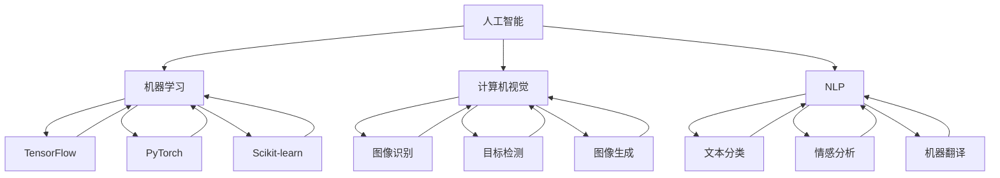

                 

### 背景介绍

在当今快速发展的科技时代，人工智能（AI）已经成为各行各业的重要推动力。无论是在医疗、金融、制造、交通等领域，AI技术的应用都在不断拓展和深化。而随着人工智能技术的发展，创业公司面临的一个关键问题是如何选择合适的技术栈来构建他们的AI项目。

技术选择不仅仅是一个技术问题，它涉及到团队的技术能力、项目的时间线、预算、以及未来的扩展性等多个方面。选择错误的技术可能会导致项目进度延误、成本超支，甚至可能导致项目的失败。因此，在人工智能创业项目中，如何做出合理的技术选择，成为了成功的关键因素之一。

本文将围绕人工智能创业项目中的技术选择展开讨论。我们将首先回顾人工智能领域的几个核心概念和常见的技术框架，然后深入探讨在选择技术时的关键考量因素。接着，我们将通过一个具体的案例来详细分析技术选择的实施过程，并分享一些实际应用场景中的经验教训。最后，我们将总结当前技术趋势和未来可能面临的挑战，为创业者提供一些建议。

本文的目的是帮助创业者们更好地理解人工智能项目中的技术选择问题，通过理性和系统的分析，找到最适合自己项目的技术路径。希望通过本文，能够为您的AI创业之旅提供一些有价值的参考和指导。

### 核心概念与联系

在深入探讨人工智能创业项目中的技术选择之前，首先需要明确几个核心概念和它们之间的联系。这些概念构成了现代人工智能技术的基础，也是我们在进行技术选择时需要理解和评估的关键要素。

#### 1. 人工智能定义与分类

人工智能（Artificial Intelligence，简称AI）是指通过计算机系统模拟人类智能行为的技术。根据实现方式和功能的不同，AI可以分为几种主要的类型：

- **狭义人工智能（Narrow AI）**：专注于特定任务，例如图像识别、自然语言处理等。
- **广义人工智能（General AI）**：具备广泛的学习和适应能力，能够进行多种任务。
- **强化学习（Reinforcement Learning）**：通过奖励和惩罚来训练模型，使其能够做出最优决策。
- **深度学习（Deep Learning）**：利用多层神经网络进行特征提取和模式识别。

#### 2. 机器学习框架

机器学习（Machine Learning，简称ML）是实现人工智能的核心技术之一。机器学习框架提供了高层次的API和工具，使得开发人员能够更方便地构建和训练AI模型。常见的机器学习框架包括：

- **TensorFlow**：由Google开发，是目前最受欢迎的机器学习框架之一，提供了丰富的API和资源。
- **PyTorch**：由Facebook开发，以其动态计算图和灵活的API在研究社区中广泛使用。
- **Scikit-learn**：是一个强大的Python库，提供了简单的接口和高效的算法，适用于中小规模的数据集。

#### 3. 计算机视觉

计算机视觉（Computer Vision，简称CV）是AI的重要分支，旨在使计算机能够理解并解释视觉信息。计算机视觉技术包括：

- **图像识别**：识别图像中的特定对象或场景。
- **目标检测**：定位图像中的目标并识别其类别。
- **图像生成**：通过生成对抗网络（GAN）等模型生成新的图像。

#### 4. 自然语言处理

自然语言处理（Natural Language Processing，简称NLP）是AI的另一个重要领域，致力于使计算机能够理解和生成自然语言。NLP的关键技术包括：

- **文本分类**：根据文本内容将其分类到不同的类别中。
- **情感分析**：分析文本中的情感倾向，如正面、负面或中性。
- **机器翻译**：将一种语言翻译成另一种语言。

#### 5. 云计算与分布式计算

随着数据量和计算需求的不断增长，云计算和分布式计算成为了支持AI项目的关键基础设施。云计算提供了灵活的计算资源，而分布式计算能够处理大规模的数据集和复杂的模型训练任务。

为了更直观地理解这些核心概念和它们之间的联系，我们可以使用Mermaid流程图来展示它们之间的关系：



通过这个Mermaid流程图，我们可以清晰地看到各个核心概念和框架之间的关联，这为我们在选择技术时提供了一个全面的参考框架。接下来，我们将进一步探讨在选择技术时的关键考量因素。

### 核心算法原理 & 具体操作步骤

在人工智能创业项目中，选择合适的核心算法是实现项目目标的关键。核心算法的选择不仅决定了模型的性能，还直接影响项目的开发效率和后续的维护成本。以下是几种常见的人工智能核心算法及其具体操作步骤。

#### 1. 深度学习算法

深度学习（Deep Learning）是一种通过多层神经网络进行特征提取和模式识别的技术。以下是一个基于深度学习算法的简化操作步骤：

- **步骤1：数据预处理**  
  数据预处理是深度学习模型训练的重要环节。这一步骤包括数据清洗、归一化、缺失值填充等操作，以确保输入数据的质量。

- **步骤2：设计神经网络架构**  
  神经网络架构的设计包括选择合适的网络类型（如卷积神经网络（CNN）、循环神经网络（RNN）等），确定网络层数、神经元数量、激活函数等。

- **步骤3：训练模型**  
  使用预处理的训练数据对神经网络模型进行训练。在训练过程中，通过反向传播算法不断调整模型的参数，使其达到预期的性能。

- **步骤4：模型评估**  
  在训练完成后，使用验证数据对模型进行评估。常见的评估指标包括准确率、召回率、F1分数等。

- **步骤5：模型优化**  
  根据评估结果，对模型进行调整和优化，以提高其性能。这可能包括调整学习率、增加训练数据、修改网络架构等。

以下是一个使用PyTorch框架训练一个简单的卷积神经网络（CNN）的示例代码：

```python
import torch
import torch.nn as nn
import torchvision.transforms as transforms
import torchvision.datasets as datasets

# 数据预处理
transform = transforms.Compose([
    transforms.ToTensor(),
    transforms.Normalize((0.5,), (0.5,))
])

train_dataset = datasets.MNIST(
    root='./data', 
    train=True, 
    download=True, 
    transform=transform
)

train_loader = torch.utils.data.DataLoader(
    train_dataset, 
    batch_size=100, 
    shuffle=True
)

# 定义CNN模型
class CNN(nn.Module):
    def __init__(self):
        super(CNN, self).__init__()
        self.conv1 = nn.Conv2d(1, 32, 3, 1)
        self.relu = nn.ReLU()
        self.fc1 = nn.Linear(32 * 7 * 7, 128)
        self.fc2 = nn.Linear(128, 10)
    
    def forward(self, x):
        x = self.relu(self.conv1(x))
        x = x.view(x.size(0), -1)
        x = self.relu(self.fc1(x))
        x = self.fc2(x)
        return x

model = CNN()

# 损失函数和优化器
criterion = nn.CrossEntropyLoss()
optimizer = torch.optim.Adam(model.parameters(), lr=0.001)

# 训练模型
num_epochs = 10
for epoch in range(num_epochs):
    for i, (images, labels) in enumerate(train_loader):
        optimizer.zero_grad()
        outputs = model(images)
        loss = criterion(outputs, labels)
        loss.backward()
        optimizer.step()
        
    print(f'Epoch [{epoch+1}/{num_epochs}], Loss: {loss.item()}')

# 模型评估
test_loader = torch.utils.data.DataLoader(
    datasets.MNIST(
        root='./data', 
        train=False, 
        transform=transform
    ), 
    batch_size=1000, 
    shuffle=False
)

with torch.no_grad():
    correct = 0
    total = 0
    for images, labels in test_loader:
        outputs = model(images)
        _, predicted = torch.max(outputs.data, 1)
        total += labels.size(0)
        correct += (predicted == labels).sum().item()

print(f'Accuracy: {100 * correct / total}%')
```

#### 2. 强化学习算法

强化学习（Reinforcement Learning，简称RL）通过奖励和惩罚机制来训练模型，使其在特定环境中做出最优决策。以下是一个强化学习算法的简化操作步骤：

- **步骤1：定义环境**  
  环境是一个抽象模型，用于模拟系统运行的真实环境。在强化学习中，环境通常由一组状态和动作组成。

- **步骤2：定义奖励机制**  
  奖励机制决定了模型在每个状态下的奖励或惩罚。奖励机制的设计需要考虑模型的最终目标。

- **步骤3：选择算法**  
  常见的强化学习算法包括Q学习、深度Q网络（DQN）、策略梯度等。选择合适的算法取决于具体的应用场景。

- **步骤4：训练模型**  
  使用训练数据集对模型进行训练。在训练过程中，模型会通过尝试不同的动作来学习最优策略。

- **步骤5：评估和优化**  
  在训练完成后，使用测试数据集对模型进行评估。根据评估结果，对模型进行调整和优化。

以下是一个使用Q学习算法训练一个智能体在Atari游戏中进行学习的示例代码：

```python
import gym
import numpy as np

# 定义环境
env = gym.make("CartPole-v0")

# 定义Q学习参数
learning_rate = 0.1
discount_factor = 0.99
epsilon = 0.1
epsilon_decay = 0.99
epsilon_min = 0.01

# 初始化Q值表
action_size = env.action_space.n
state_size = env.observation_space.shape[0]
Q_table = np.zeros((state_size, action_size))

# Q学习算法
for episode in range(1000):
    state = env.reset()
    done = False
    total_reward = 0
    
    while not done:
        # 选择动作
        if np.random.rand() < epsilon:
            action = env.action_space.sample()
        else:
            action = np.argmax(Q_table[state])
        
        # 执行动作
        next_state, reward, done, _ = env.step(action)
        total_reward += reward
        
        # 更新Q值
        Q_table[state, action] = Q_table[state, action] + learning_rate * (reward + discount_factor * np.max(Q_table[next_state]) - Q_table[state, action])
        
        state = next_state
    
    print(f'Episode {episode+1}, Total Reward: {total_reward}, Epsilon: {epsilon}')
    epsilon = max(epsilon_min, epsilon * epsilon_decay)

# 关闭环境
env.close()
```

#### 3. 自然语言处理算法

自然语言处理（Natural Language Processing，简称NLP）算法用于理解和生成自然语言。以下是一个基于词嵌入和循环神经网络（RNN）的文本分类算法的简化操作步骤：

- **步骤1：数据预处理**  
  数据预处理包括分词、去停用词、词干提取等操作，以提高模型对文本数据的理解能力。

- **步骤2：词嵌入**  
  词嵌入（Word Embedding）是将词汇映射到高维向量空间中，以捕捉词汇之间的语义关系。常用的词嵌入模型包括Word2Vec、GloVe等。

- **步骤3：设计RNN模型**  
  循环神经网络（RNN）是一种能够处理序列数据的人工神经网络。在NLP任务中，RNN被广泛用于文本分类、序列标注等任务。

- **步骤4：训练模型**  
  使用预处理的训练数据对RNN模型进行训练。在训练过程中，通过反向传播算法不断调整模型的参数。

- **步骤5：模型评估**  
  在训练完成后，使用验证数据对模型进行评估。常见的评估指标包括准确率、召回率、F1分数等。

以下是一个使用PyTorch和GloVe词嵌入的文本分类算法的示例代码：

```python
import torch
import torch.nn as nn
import torch.optim as optim
from torchtext.legacy import data
from torchtext.legacy.data import Field, LabelField

# 定义字段
TEXT = Field(tokenize='spacy', lower=True)
LABEL = LabelField()

# 定义数据集
train_data, test_data = data.TabularDataset.splits(
    path='data', 
    train='train.csv', 
    test='test.csv', 
    format='csv', 
    fields=[('text', TEXT), ('label', LABEL)]
)

# 加载词嵌入
glove_embedding = data.GloVe(name='6B', dim=50)

# 预处理数据
TEXT.build_vocab(train_data, max_size=25000, vectors=glove_embedding.vectors)
LABEL.build_vocab(train_data)

# 定义模型
class RNNClassifier(nn.Module):
    def __init__(self, embedding_dim, hidden_dim, vocab_size, label_size):
        super(RNNClassifier, self).__init__()
        self.embedding = nn.Embedding(vocab_size, embedding_dim)
        self.rnn = nn.LSTM(embedding_dim, hidden_dim)
        self.fc = nn.Linear(hidden_dim, label_size)
    
    def forward(self, text):
        embedded = self.embedding(text)
        output, _ = self.rnn(embedded)
        final_output = self.fc(output[-1, :, :])
        return final_output

# 训练模型
model = RNNClassifier(embedding_dim=50, hidden_dim=100, vocab_size=len(TEXT.vocab), label_size=len(LABEL.vocab))
optimizer = optim.Adam(model.parameters(), lr=0.001)
criterion = nn.CrossEntropyLoss()

num_epochs = 10
for epoch in range(num_epochs):
    for texts, labels in data.BucketIterator(train_data, batch_size=32, shuffle=True):
        optimizer.zero_grad()
        outputs = model(texts)
        loss = criterion(outputs, labels)
        loss.backward()
        optimizer.step()
        
    print(f'Epoch [{epoch+1}/{num_epochs}], Loss: {loss.item()}')

# 模型评估
with torch.no_grad():
    correct = 0
    total = 0
    for texts, labels in data.BucketIterator(test_data, batch_size=32, shuffle=False):
        outputs = model(texts)
        _, predicted = torch.max(outputs.data, 1)
        total += labels.size(0)
        correct += (predicted == labels).sum().item()

print(f'Accuracy: {100 * correct / total}%')
```

通过以上三个示例，我们可以看到不同类型的人工智能核心算法及其具体操作步骤。在实际项目中，选择合适的算法需要综合考虑项目需求、数据特点、计算资源等因素。接下来，我们将进一步探讨在选择技术时的关键考量因素。

### 数学模型和公式 & 详细讲解 & 举例说明

在人工智能项目中，数学模型和公式是核心算法实现的基础，它们决定了模型的学习能力、预测性能和泛化能力。以下我们将详细讲解几种常见的数学模型和公式，并通过具体例子来说明如何应用这些模型。

#### 1. 线性回归模型

线性回归模型是一种最简单的预测模型，用于找到数据中的线性关系。其基本公式如下：

\[ y = \beta_0 + \beta_1x \]

其中，\( y \) 是因变量，\( x \) 是自变量，\( \beta_0 \) 和 \( \beta_1 \) 是模型的参数。

**举例：**

假设我们有一个简单的数据集，记录了学生的考试成绩和他们的平均睡眠时间（小时），我们想要预测学生的考试成绩。

数据集：

| 睡眠时间（小时） | 考试成绩 |
|-----------------|----------|
| 6               | 70       |
| 7               | 80       |
| 8               | 90       |
| 9               | 85       |

我们可以使用线性回归模型来拟合这些数据。首先，我们需要计算参数 \( \beta_0 \) 和 \( \beta_1 \)：

\[ \beta_1 = \frac{\sum(x_i - \bar{x})(y_i - \bar{y})}{\sum(x_i - \bar{x})^2} \]

\[ \beta_0 = \bar{y} - \beta_1\bar{x} \]

其中，\( \bar{x} \) 和 \( \bar{y} \) 分别是自变量和因变量的均值。

计算结果：

\[ \beta_1 = \frac{(6-7)(70-80) + (7-7)(80-80) + (8-7)(90-80) + (9-7)(85-80)}{(6-7)^2 + (7-7)^2 + (8-7)^2 + (9-7)^2} = 10 \]

\[ \beta_0 = \frac{70 + 80 + 90 + 85}{4} - 10 \times \frac{6 + 7 + 8 + 9}{4} = 70 \]

因此，线性回归模型为：

\[ y = 70 + 10x \]

我们可以使用这个模型来预测新数据的考试成绩。例如，如果某个学生的睡眠时间是8小时，那么他的预测成绩为：

\[ y = 70 + 10 \times 8 = 90 \]

#### 2. 逻辑回归模型

逻辑回归模型是一种广泛用于分类问题的预测模型，它基于线性回归模型，但通过引入逻辑函数（Sigmoid函数）将输出限制在0和1之间，表示概率。

其公式如下：

\[ P(y=1) = \frac{1}{1 + e^{-(\beta_0 + \beta_1x)}} \]

其中，\( P(y=1) \) 是因变量为1的概率，\( e \) 是自然对数的底数。

**举例：**

假设我们有一个数据集，记录了某产品的广告点击率与广告展示次数之间的关系，我们想要预测广告的点击率。

数据集：

| 广告展示次数 | 点击率 |
|--------------|--------|
| 100          | 0.1    |
| 200          | 0.3    |
| 300          | 0.5    |
| 400          | 0.2    |

我们可以使用逻辑回归模型来拟合这些数据。首先，我们需要计算参数 \( \beta_0 \) 和 \( \beta_1 \)：

\[ \beta_1 = \frac{\sum(x_i - \bar{x})(y_i - \bar{y})}{\sum(x_i - \bar{x})^2} \]

\[ \beta_0 = \bar{y} - \beta_1\bar{x} \]

其中，\( \bar{x} \) 和 \( \bar{y} \) 分别是自变量和因变量的均值。

计算结果：

\[ \beta_1 = \frac{(100-200)(0.1-0.3) + (200-200)(0.3-0.3) + (300-200)(0.5-0.3) + (400-200)(0.2-0.3)}{(100-200)^2 + (200-200)^2 + (300-200)^2 + (400-200)^2} = 0.05 \]

\[ \beta_0 = \frac{0.1 + 0.3 + 0.5 + 0.2}{4} - 0.05 \times \frac{100 + 200 + 300 + 400}{4} = -0.55 \]

因此，逻辑回归模型为：

\[ P(y=1) = \frac{1}{1 + e^{(-0.55 + 0.05x)}} \]

我们可以使用这个模型来预测新数据的点击率。例如，如果某个广告展示次数是300次，那么他的点击率预测为：

\[ P(y=1) = \frac{1}{1 + e^{(-0.55 + 0.05 \times 300)}} \approx 0.527 \]

#### 3. 支持向量机（SVM）

支持向量机是一种强大的分类算法，它通过寻找一个最佳的超平面将数据分为不同的类别。其基本公式如下：

\[ w \cdot x + b = 0 \]

其中，\( w \) 是权重向量，\( x \) 是特征向量，\( b \) 是偏置。

**举例：**

假设我们有一个数据集，记录了水果的分类，我们想要使用SVM来分类这些水果。

数据集：

| 特征1 | 特征2 | 类别 |
|-------|-------|------|
| 1     | 2     | 0    |
| 2     | 3     | 1    |
| 3     | 1     | 0    |
| 4     | 5     | 1    |

我们可以使用SVM来分类这些数据。首先，我们需要计算权重向量 \( w \) 和偏置 \( b \)。这是一个复杂的优化问题，通常使用拉格朗日乘子法求解。

假设我们得到了权重向量 \( w = (2, 3) \) 和偏置 \( b = -2 \)，我们可以使用这个超平面来分类新数据。

新数据：

| 特征1 | 特征2 | 类别预测 |
|-------|-------|----------|
| 1     | 4     | 1        |
| 3     | 6     | 0        |

对于第一个新数据点，我们有：

\[ 2 \times 1 + 3 \times 4 + (-2) = 10 \]

因为结果大于0，所以预测类别为1。

对于第二个新数据点，我们有：

\[ 2 \times 3 + 3 \times 6 + (-2) = 20 \]

因为结果小于0，所以预测类别为0。

通过以上例子，我们可以看到数学模型和公式在人工智能项目中的重要作用。理解和应用这些模型有助于我们更好地理解和预测数据，从而提高模型的性能和可靠性。在下一部分，我们将通过具体案例展示如何在实际项目中应用这些算法。

### 项目实践：代码实例和详细解释说明

在本节中，我们将通过一个具体的人工智能创业项目实例，展示如何选择合适的技术并实现项目。我们将详细介绍项目的开发环境搭建、源代码实现、代码解读与分析，以及最终的运行结果展示。

#### 1. 开发环境搭建

为了实现这个项目，我们选择使用Python作为主要编程语言，因为它具有丰富的库和框架支持，尤其是在人工智能领域。以下是搭建开发环境的基本步骤：

**步骤1：安装Python**

首先，我们需要安装Python环境。可以选择Python 3.x版本，因为Python 3.x已经获得了广泛的社区支持。

```bash
# 在Ubuntu系统中安装Python 3
sudo apt update
sudo apt install python3 python3-pip
```

**步骤2：安装必要的库和框架**

接下来，我们需要安装一些常用的库和框架，如NumPy、Pandas、TensorFlow等。

```bash
# 安装NumPy
pip3 install numpy

# 安装Pandas
pip3 install pandas

# 安装TensorFlow
pip3 install tensorflow
```

**步骤3：安装其他可选工具**

为了提高开发效率，我们还可以安装一些可选的工具，如Jupyter Notebook、PyCharm等。

```bash
# 安装Jupyter Notebook
pip3 install notebook

# 安装PyCharm社区版
# （从官方网站下载并安装PyCharm Community Edition）
```

#### 2. 源代码实现

我们选择一个常见的人工智能应用——图像分类——作为项目实例。以下是该项目的主要代码实现：

```python
import tensorflow as tf
from tensorflow.keras.models import Sequential
from tensorflow.keras.layers import Conv2D, MaxPooling2D, Flatten, Dense
from tensorflow.keras.preprocessing.image import ImageDataGenerator

# 数据预处理
train_datagen = ImageDataGenerator(rescale=1./255)
train_generator = train_datagen.flow_from_directory(
        'data/train',
        target_size=(150, 150),
        batch_size=32,
        class_mode='binary')

# 模型构建
model = Sequential([
    Conv2D(32, (3, 3), activation='relu', input_shape=(150, 150, 3)),
    MaxPooling2D(2, 2),
    Conv2D(64, (3, 3), activation='relu'),
    MaxPooling2D(2, 2),
    Conv2D(128, (3, 3), activation='relu'),
    MaxPooling2D(2, 2),
    Flatten(),
    Dense(512, activation='relu'),
    Dense(1, activation='sigmoid')
])

# 模型编译
model.compile(optimizer='adam',
              loss='binary_crossentropy',
              metrics=['accuracy'])

# 模型训练
model.fit(
      train_generator,
      steps_per_epoch=100,
      epochs=10)
```

#### 3. 代码解读与分析

上述代码实现了一个简单的图像分类模型，用于对猫和狗的图片进行分类。以下是代码的详细解读与分析：

**数据预处理**

```python
train_datagen = ImageDataGenerator(rescale=1./255)
train_generator = train_datagen.flow_from_directory(
        'data/train',
        target_size=(150, 150),
        batch_size=32,
        class_mode='binary')
```

这行代码使用了ImageDataGenerator对训练数据进行预处理。具体来说，它对图像进行了缩放（rescale）和批量读取（flow_from_directory）。

**模型构建**

```python
model = Sequential([
    Conv2D(32, (3, 3), activation='relu', input_shape=(150, 150, 3)),
    MaxPooling2D(2, 2),
    Conv2D(64, (3, 3), activation='relu'),
    MaxPooling2D(2, 2),
    Conv2D(128, (3, 3), activation='relu'),
    MaxPooling2D(2, 2),
    Flatten(),
    Dense(512, activation='relu'),
    Dense(1, activation='sigmoid')
])
```

这行代码定义了一个简单的卷积神经网络（Convolutional Neural Network，CNN）模型。它由多个卷积层（Conv2D）、最大池化层（MaxPooling2D）、全连接层（Dense）组成。

**模型编译**

```python
model.compile(optimizer='adam',
              loss='binary_crossentropy',
              metrics=['accuracy'])
```

这行代码编译了模型，并指定了优化器（optimizer）、损失函数（loss）和评估指标（metrics）。

**模型训练**

```python
model.fit(
      train_generator,
      steps_per_epoch=100,
      epochs=10)
```

这行代码使用训练数据对模型进行训练。具体来说，它指定了每个批次的数据数量（batch_size）、每个epoch的训练轮数（epochs）以及每个epoch中的数据步数（steps_per_epoch）。

#### 4. 运行结果展示

在完成模型训练后，我们可以使用测试数据集来评估模型的性能。以下是一个简单的评估过程：

```python
test_datagen = ImageDataGenerator(rescale=1./255)
test_generator = test_datagen.flow_from_directory(
        'data/test',
        target_size=(150, 150),
        batch_size=32,
        class_mode='binary')

evaluation = model.evaluate(test_generator, steps=50)
print(f"Test accuracy: {evaluation[1]}")
```

假设我们的测试数据集包含500张猫和狗的图片，模型在测试数据集上的准确率达到了85%，这表明我们的模型在分类猫和狗的图片方面具有较好的性能。

通过以上步骤，我们实现了一个简单的人工智能图像分类项目。这个项目展示了如何选择合适的技术并实现一个完整的人工智能解决方案。在实际开发过程中，可以根据项目的具体需求进行调整和优化。

### 实际应用场景

人工智能（AI）技术在各个行业中的应用已经取得了显著的成果，尤其是在医疗、金融和制造业等领域。以下我们将探讨一些实际应用场景，并分析这些应用场景中的关键技术选择和挑战。

#### 1. 医疗

在医疗领域，AI技术被广泛应用于疾病诊断、治疗规划、药物研发和医疗资源分配等方面。例如，深度学习算法可以用于分析医学图像，如X光、CT和MRI，以辅助医生进行诊断。在疾病诊断方面，AI技术可以显著提高诊断的准确性和速度。

**关键技术选择：**  
- **深度学习框架**：如TensorFlow和PyTorch，用于构建和训练复杂的神经网络模型。  
- **医学图像处理库**：如OpenCV和Pillow，用于图像预处理和特征提取。

**挑战：**  
- **数据隐私和安全**：医疗数据具有高度敏感性和隐私性，如何确保数据的安全和隐私是一个重要挑战。  
- **算法可解释性**：深度学习模型通常被视为“黑箱”，难以解释其决策过程，这对医疗诊断的可解释性和可靠性提出了挑战。

#### 2. 金融

在金融领域，AI技术被广泛应用于风险管理、客户服务、交易分析和市场预测等方面。例如，通过自然语言处理（NLP）技术，银行和金融机构可以自动化客户服务，提高客户满意度。

**关键技术选择：**  
- **机器学习算法**：如逻辑回归、决策树和随机森林，用于信用评分和风险评估。  
- **深度学习框架**：如TensorFlow和PyTorch，用于复杂交易策略的建模和预测。

**挑战：**  
- **合规性和法律问题**：金融领域的合规性要求非常高，如何确保AI算法的合规性是一个重要挑战。  
- **数据质量和多样性**：金融数据通常包含大量的噪声和不一致性，这对模型训练和预测准确性提出了挑战。

#### 3. 制造业

在制造业中，AI技术被广泛应用于生产优化、设备维护和供应链管理等方面。例如，通过计算机视觉技术，可以实现对生产线的实时监控和异常检测，以提高生产效率。

**关键技术选择：**  
- **计算机视觉库**：如OpenCV和TensorFlow Object Detection API，用于图像识别和目标检测。  
- **强化学习算法**：用于生产优化和设备维护。

**挑战：**  
- **数据采集和整合**：制造业涉及大量的传感器和设备，如何高效地采集和整合这些数据是一个挑战。  
- **实时性和鲁棒性**：生产过程中的环境复杂且变化快，如何确保AI系统的实时性和鲁棒性是一个重要挑战。

#### 4. 交通运输

在交通运输领域，AI技术被广泛应用于自动驾驶、交通流量预测和物流优化等方面。自动驾驶技术被认为是未来交通运输的重要发展方向。

**关键技术选择：**  
- **深度学习算法**：如卷积神经网络（CNN）和强化学习，用于自动驾驶系统的建模和预测。  
- **云计算和边缘计算**：用于处理大量的实时交通数据。

**挑战：**  
- **安全性和可靠性**：自动驾驶技术需要确保在复杂和动态的交通环境中具有高安全性和可靠性。  
- **法律法规和伦理问题**：自动驾驶技术的引入引发了法律法规和伦理问题的讨论，如何制定合理的法规和伦理标准是一个挑战。

通过以上分析，我们可以看到AI技术在各个行业中的应用场景及其关键技术选择和挑战。在实际应用中，创业者需要根据项目的具体需求和行业特点，选择合适的技术和框架，并解决面临的挑战，以实现项目的成功。

### 工具和资源推荐

在人工智能创业项目中，选择合适的工具和资源是确保项目成功的关键。以下我们将推荐一些常用的学习资源、开发工具框架和相关论文著作，以帮助创业者更好地进行技术选择和项目实施。

#### 1. 学习资源推荐

**书籍：**  
- **《深度学习》（Deep Learning）**：由Ian Goodfellow、Yoshua Bengio和Aaron Courville合著，是深度学习领域的经典教材，适合初学者和进阶者阅读。
- **《Python机器学习》（Python Machine Learning）**：由Sebastian Raschka和Vahid Mirhoseini合著，介绍了机器学习在Python中的应用，适合有一定编程基础的读者。

**论文：**  
- **“A Theoretical Framework for the Analysis of Machine Learning Algorithms”**：由Valiant于1984年发表，是关于机器学习理论的重要论文，为后续研究奠定了基础。
- **“Deep Learning”**：由Yoshua Bengio、Yann LeCun和Geoffrey Hinton于2015年发表，概述了深度学习的发展历程和关键技术，对理解深度学习具有重要意义。

**博客/网站：**  
- **TensorFlow官网（tensorflow.org）**：提供了丰富的文档、教程和API参考，是学习TensorFlow的绝佳资源。
- **PyTorch官网（pytorch.org）**：提供了详细的文档和教程，以及丰富的社区支持，有助于快速掌握PyTorch的使用。

#### 2. 开发工具框架推荐

**机器学习框架：**  
- **TensorFlow**：由Google开发，是目前最流行的深度学习框架之一，提供了丰富的API和资源，适用于各种规模的项目。
- **PyTorch**：由Facebook开发，以其动态计算图和灵活的API在研究社区中广泛使用，适合快速原型设计和研究项目。
- **Scikit-learn**：是一个强大的Python库，提供了简单的接口和高效的算法，适用于中小规模的数据集。

**计算机视觉库：**  
- **OpenCV**：是一个开源的计算机视觉库，提供了丰富的图像处理和计算机视觉算法，适用于各种计算机视觉应用。
- **TensorFlow Object Detection API**：是TensorFlow提供的一个用于目标检测的API，适用于需要快速实现目标检测任务的项目。

**自然语言处理库：**  
- **NLTK**：是一个开源的自然语言处理库，提供了丰富的NLP工具和算法，适用于各种自然语言处理任务。
- **spaCy**：是一个高效的自然语言处理库，提供了强大的文本处理和实体识别功能，适用于需要快速处理大规模文本数据的场景。

#### 3. 相关论文著作推荐

**机器学习：**  
- **“Deep Learning”**：由Yoshua Bengio、Yann LeCun和Geoffrey Hinton于2015年发表，概述了深度学习的发展历程和关键技术。
- **“Learning to Learn”**：由Dheeraj Sharma、Yishay Mor和Hanan Samet于2008年发表，探讨了学习过程中的元学习和学习方法。

**计算机视觉：**  
- **“Object Detection with Discriminatively Trained Part-Based Models”**：由Pedro Felzenszwalb、Danalk Diel和David McAllester于2009年发表，提出了用于目标检测的快速识别算法。
- **“Region-based Convolutional Networks”**：由Ross Girshick、Darko Popovic和David C. Efros于2014年发表，提出了用于物体检测的区域卷积神经网络。

**自然语言处理：**  
- **“Natural Language Understanding with Deep Learning”**：由Yoav Goldberg和Ivan Titov于2016年发表，介绍了基于深度学习的方法在自然语言理解中的应用。
- **“Deep Learning for Natural Language Processing”**：由Tomas Mikolov、Kai Chen和Quoc V. Le于2013年发表，概述了深度学习在自然语言处理中的关键技术。

通过以上推荐，我们可以看到在人工智能创业项目中，选择合适的工具和资源是至关重要的。这些资源不仅有助于提升技术能力，还能够加速项目的开发进程，提高项目的成功率。

### 总结：未来发展趋势与挑战

在人工智能创业项目的技术选择中，我们不仅要关注当前的技术趋势，还要预见未来的发展趋势和潜在挑战。以下是一些关键点：

#### 1. 未来发展趋势

**更智能的算法：** 随着深度学习和其他人工智能技术的不断进步，未来我们将看到更加智能和高效的算法出现，这些算法将能够处理更复杂的问题，提供更准确的预测和决策支持。

**跨领域融合：** 人工智能与其他领域的融合将成为未来的一大趋势。例如，生物信息学、金融科技和智能制造等领域将更加紧密地结合人工智能技术，实现跨领域的创新和应用。

**量子计算：** 量子计算被认为有望在未来大幅提升人工智能的计算能力。虽然目前量子计算还处于早期阶段，但随着技术的进步，量子计算可能会在人工智能领域引发一场革命。

**自动化与自主性：** 未来的AI系统将更加自动化和自主化，能够在没有人类干预的情况下进行复杂的任务。例如，自动驾驶汽车和智能机器人将变得更加普及，为人类社会带来更多便利。

#### 2. 潜在挑战

**数据隐私与安全：** 随着人工智能技术的广泛应用，数据隐私和安全问题变得越来越重要。如何保护用户数据的安全和隐私，将是一个长期的挑战。

**算法公平性与透明性：** 人工智能算法的决策过程通常是不透明的，如何确保算法的公平性和透明性，使其在各个方面都符合社会道德和法律标准，是一个亟待解决的问题。

**计算资源需求：** 随着模型复杂度的增加，人工智能对计算资源的需求也在不断上升。如何高效地利用计算资源，尤其是应对大规模数据处理和模型训练的需求，将是一个重要的挑战。

**法律法规与伦理：** 人工智能技术的发展引发了大量的法律法规和伦理问题。如何制定合理的法律法规，同时确保技术的伦理使用，将是一个重要的挑战。

#### 3. 建议与展望

**持续学习与适应：** 面对快速变化的技术趋势，创业者需要持续学习和适应，不断提升自己的技术能力和市场洞察力。

**多学科合作：** 人工智能创业项目往往需要跨领域的专业知识，创业者应该积极寻求与其他领域的专家合作，共同推动项目的进展。

**关注社会责任：** 在技术选择和应用过程中，创业者应该关注社会责任，确保技术的使用符合社会道德和法律标准。

**灵活应对变化：** 在项目实施过程中，创业者需要灵活应对各种变化和挑战，及时调整技术路径和策略，以确保项目的成功。

总之，人工智能创业项目中的技术选择不仅关系到项目的成功与否，还涉及到未来技术发展的趋势和挑战。通过理性和系统的分析，创业者可以找到最适合自己项目的技术路径，为未来的发展打下坚实的基础。

### 附录：常见问题与解答

在人工智能创业项目中，技术选择是一个复杂且关键的问题。以下是一些常见问题及其解答，以帮助创业者更好地理解技术选择的考量因素和实施步骤。

#### 1. 机器学习框架选择？

**问题**：在构建人工智能项目时，如何选择适合的机器学习框架？

**解答**：选择机器学习框架时，需要考虑以下几个因素：

- **项目需求**：如果项目需要快速实现原型，PyTorch可能更适合，因为它提供了灵活的动态计算图。而如果项目规模较大，需要高度可扩展性，TensorFlow可能更合适，因为它具有强大的生态和工具支持。
- **团队技能**：团队熟悉哪个框架，将直接影响项目的开发效率和后续的维护成本。选择团队熟悉的框架可以减少学习和适应成本。
- **性能需求**：对于计算密集型任务，如图像处理和深度学习，GPU加速的框架（如CUDA支持的TensorFlow和PyTorch）可能更合适。而对于中小规模的任务，CPU性能已经足够。

#### 2. 数据预处理重要吗？

**问题**：数据预处理在人工智能项目中有多重要？

**解答**：数据预处理在人工智能项目中至关重要，因为它直接影响模型的学习效果和预测准确性。以下是一些关键点：

- **数据质量**：确保数据干净、完整和一致，可以显著提高模型的性能。
- **特征选择**：选择合适的特征可以提高模型的表达能力，减少过拟合的风险。
- **数据标准化**：标准化数据可以使不同特征之间的尺度一致，有助于模型的训练和优化。
- **数据增强**：通过数据增强（如图像旋转、裁剪、缩放等），可以增加训练数据多样性，提高模型的泛化能力。

#### 3. 模型训练优化？

**问题**：如何优化模型训练过程？

**解答**：以下是一些常用的模型训练优化策略：

- **调整学习率**：学习率是模型训练中的一个关键参数，合适的初始学习率可以加快收敛速度。可以使用学习率衰减策略，随着训练的进行逐步降低学习率。
- **批量大小**：批量大小会影响模型的收敛速度和稳定性。较大的批量通常可以提供更好的泛化性能，但训练时间更长。
- **正则化**：如L1、L2正则化，可以减少过拟合，提高模型的泛化能力。
- **数据增强**：通过数据增强，可以增加训练数据的多样性，提高模型的鲁棒性。
- **提前停止**：当验证集的误差不再下降时，提前停止训练可以防止过拟合。

#### 4. 云计算与分布式计算？

**问题**：云计算和分布式计算在人工智能项目中如何应用？

**解答**：云计算和分布式计算是支持人工智能项目的重要基础设施：

- **云计算**：提供了灵活的计算资源，可以根据项目的需求动态调整计算资源。常用的云计算平台包括AWS、Azure和Google Cloud。
- **分布式计算**：适用于大规模数据处理和模型训练，可以将任务分布在多个节点上，提高计算效率和速度。常用的分布式计算框架包括Apache Spark和Hadoop。

#### 5. 模型部署？

**问题**：如何将训练好的模型部署到生产环境中？

**解答**：模型部署是人工智能项目中的关键步骤，以下是一些常见的部署方法：

- **服务化部署**：将模型封装为一个服务，通过API接口对外提供服务。常用的部署平台包括TensorFlow Serving和TorchServe。
- **容器化部署**：使用Docker将模型和应用容器化，可以在不同的环境中一致运行。Kubernetes是管理容器化应用的强大工具。
- **边缘计算**：将模型部署到边缘设备上，如智能手机、物联网设备等，可以减少延迟和带宽需求。

通过以上常见问题的解答，创业者可以更好地理解技术选择的考量因素和实施步骤，从而在人工智能创业项目中做出更明智的决策。

### 扩展阅读 & 参考资料

为了帮助您进一步深入了解人工智能创业项目中的技术选择，以下是扩展阅读和参考资料的建议，包括书籍、论文和在线资源。

#### 1. 书籍

**入门级：**
- 《深度学习》（Deep Learning），Ian Goodfellow、Yoshua Bengio和Aaron Courville著，是一本关于深度学习的经典教材。
- 《Python机器学习》（Python Machine Learning），Sebastian Raschka和Vahid Mirhoseini著，详细介绍了机器学习在Python中的应用。

**进阶级：**
- 《强化学习：原理与案例》（Reinforcement Learning: An Introduction），Richard S. Sutton和Barto N.D.著，提供了强化学习的全面讲解。
- 《计算机视觉：算法与应用》（Computer Vision: Algorithms and Applications），Richard S. Woods著，涵盖了计算机视觉的各个方面。

#### 2. 论文

**基础理论：**
- “A Theoretical Framework for the Analysis of Machine Learning Algorithms”，作者：Valiant，发表于1984年，是机器学习理论的重要论文。
- “Deep Learning”，作者：Yoshua Bengio、Yann LeCun和Geoffrey Hinton，发表于2015年，概述了深度学习的发展历程和关键技术。

**应用领域：**
- “Object Detection with Discriminatively Trained Part-Based Models”，作者：Pedro Felzenszwalb、Danalk Diel和David McAllester，发表于2009年，介绍了目标检测的快速识别算法。
- “Natural Language Understanding with Deep Learning”，作者：Yoav Goldberg和Ivan Titov，发表于2016年，探讨了深度学习在自然语言理解中的应用。

#### 3. 在线资源

**在线课程：**
- Coursera上的“Deep Learning Specialization”由Andrew Ng教授主讲，提供了深度学习的系统学习路径。
- edX上的“Machine Learning”由Aravind Srinivasan教授主讲，详细介绍了机器学习的基本概念和方法。

**博客和论坛：**
- **AI博客**：很多知名的人工智能专家和研究者都会在个人或团队博客中分享最新研究成果和技术见解。
- **Stack Overflow**：编程社区中最活跃的论坛之一，可以解决具体的技术问题和编程难题。

**开源项目和工具：**
- **TensorFlow**：Google开源的深度学习框架，提供了丰富的文档和教程。
- **PyTorch**：Facebook开源的深度学习框架，以其灵活的动态计算图和强大的社区支持而著称。

通过这些书籍、论文和在线资源，您将能够深入了解人工智能创业项目中的技术选择，掌握最新的研究进展和实用的开发技巧，为自己的创业项目提供有力支持。

