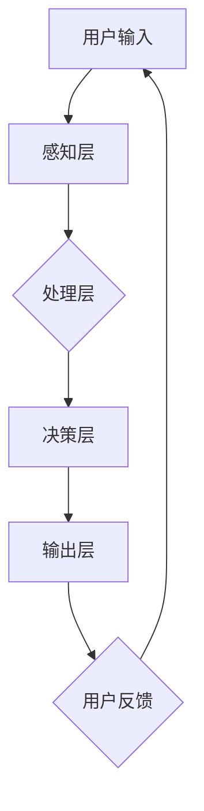

                 

关键词：人机交互、人工智能、界面设计、用户体验、语音识别、手势控制、虚拟现实、增强现实、神经科学、技术发展趋势

> 摘要：本文深入探讨了人机交互的当前状态和未来趋势，分析了人工智能、界面设计、用户体验等关键领域的发展，以及如何通过语音识别、手势控制、虚拟现实和增强现实等技术改善人机交互体验。此外，本文还讨论了神经科学对人机交互的启示，以及未来人机交互可能面临的挑战和机遇。

## 1. 背景介绍

人机交互（Human-Computer Interaction，简称HCI）是计算机科学和人机系统研究的一个重要分支。它旨在研究如何设计、评估和实现人机系统，使得计算机能够更好地满足用户的需求。随着计算机技术的发展，人机交互的重要性日益凸显。从早期的命令行界面到图形用户界面（GUI），再到如今的智能交互系统，人机交互经历了巨大的变革。

近年来，人工智能（AI）的迅速发展为人机交互带来了新的契机。智能助手、智能家居、智能医疗等领域的兴起，使得人机交互从单一的交互方式，逐步演变为多模态交互。这一变革不仅提升了用户体验，也为各行各业带来了新的应用场景。

### 1.1 人机交互的历史发展

人机交互的历史可以追溯到20世纪40年代。当时，计算机主要用于科学计算和军事模拟，人机交互主要是通过穿孔卡片和打印输出进行。随着计算机硬件和软件的发展，命令行界面（CLI）逐渐成为主流，用户通过键盘输入指令来控制计算机。

在20世纪80年代，图形用户界面（GUI）的出现改变了人机交互的方式。鼠标、窗口、图标等图形元素使得用户能够更直观地与计算机进行交互。这一变革极大地提高了人机交互的效率，也为后续的人机交互设计提供了基础。

进入21世纪，随着互联网的普及和智能手机的兴起，移动交互和触控交互成为了新的趋势。人们开始通过触摸屏幕、语音指令等方式与设备进行交互。这一时期，人机交互的重点逐渐从桌面系统转向移动设备，交互方式更加灵活和便捷。

### 1.2 人工智能与人机交互

人工智能的崛起为人机交互带来了新的可能性。通过机器学习和深度学习技术，计算机能够理解和处理自然语言，识别语音、图像和手势等模态。这使得人机交互从单一的输入输出，逐渐转向多模态交互。

智能助手（如苹果的Siri、谷歌的Google Assistant）是人工智能在人类交互领域的典型应用。它们能够理解用户的语音指令，完成从设置闹钟到播放音乐的各种任务。此外，智能家居系统（如亚马逊的Alexa、谷歌的Nest）也利用人工智能技术，实现了对家庭设备的智能控制。

### 1.3 现状与挑战

当前，人机交互在技术上已经取得了显著的进展，但仍面临着诸多挑战。首先，用户体验是衡量人机交互成功与否的重要指标。如何在保证功能性的同时，提升用户体验，是人机交互领域需要不断探索的问题。其次，不同应用场景下的人机交互需求差异较大，如何设计通用且灵活的交互方案，也是一个重要的研究方向。

此外，隐私和安全问题也是人机交互领域需要关注的焦点。随着人机交互技术的不断进步，用户的数据隐私和安全性越来越受到威胁。如何平衡用户隐私和交互体验，成为人机交互研究的重要课题。

## 2. 核心概念与联系

### 2.1 人机交互的核心概念

人机交互的核心概念包括用户界面（User Interface，简称UI）、用户体验（User Experience，简称UX）、交互设计（Interaction Design）等。

**用户界面**：用户界面是用户与计算机系统进行交互的界面，包括图形界面、命令行界面等。良好的用户界面能够提升用户的使用体验。

**用户体验**：用户体验是用户在使用产品或服务过程中所感受到的总体感受。它涵盖了用户在使用产品或服务时的情感、行为和认知等方面。

**交互设计**：交互设计是设计用户与产品或服务之间交互的过程，旨在提升用户体验。交互设计关注如何让用户更轻松、更愉快地完成任务。

### 2.2 人机交互的架构

人机交互的架构通常包括以下几个层次：

1. **感知层**：感知层负责感知用户的输入，如键盘输入、鼠标点击、语音指令等。
2. **处理层**：处理层负责处理感知层获取的输入，如语音识别、手势识别等。
3. **决策层**：决策层根据处理层的结果，做出相应的决策，如生成回复、执行操作等。
4. **输出层**：输出层将决策层的决策结果呈现给用户，如语音回复、屏幕显示等。

### 2.3 Mermaid 流程图

以下是一个使用Mermaid绘制的简单人机交互流程图：



## 3. 核心算法原理 & 具体操作步骤

### 3.1 算法原理概述

在人机交互中，核心算法通常包括语音识别、手势识别、自然语言处理等。这些算法的原理基于人工智能技术，通过机器学习和深度学习模型，实现对用户输入的识别和处理。

**语音识别**：语音识别算法通过将语音信号转换为文本，实现对用户语音指令的识别。其原理基于隐马尔可夫模型（HMM）、深度神经网络（DNN）等。

**手势识别**：手势识别算法通过摄像头或其他传感器，捕捉用户的手势，并对其进行识别。其原理基于计算机视觉技术，如卷积神经网络（CNN）等。

**自然语言处理**：自然语言处理算法通过理解用户的自然语言指令，生成相应的回复或执行操作。其原理基于词向量、序列模型等。

### 3.2 算法步骤详解

**语音识别算法步骤**：

1. **特征提取**：将语音信号转换为特征向量，如MFCC（梅尔频率倒谱系数）。
2. **声学模型训练**：使用大量语音数据训练声学模型，如HMM或DNN。
3. **语言模型训练**：使用大量文本数据训练语言模型，如n-gram模型或神经网络语言模型。
4. **解码**：使用声学模型和语言模型，对输入语音进行解码，生成文本。

**手势识别算法步骤**：

1. **特征提取**：从摄像头捕获的手势图像中提取特征，如边缘、轮廓等。
2. **手势分类模型训练**：使用手势数据集训练分类模型，如CNN。
3. **手势识别**：使用训练好的分类模型，对实时捕获的手势图像进行识别。

**自然语言处理算法步骤**：

1. **词向量表示**：将文本转换为词向量，如Word2Vec或BERT。
2. **序列模型训练**：使用大量对话数据训练序列模型，如LSTM或Transformer。
3. **对话生成**：使用训练好的序列模型，生成对话回复。

### 3.3 算法优缺点

**语音识别**：

- **优点**：语音交互便捷，适用于各种场景。
- **缺点**：对噪声敏感，识别准确率有待提高。

**手势识别**：

- **优点**：直观，无需接触设备。
- **缺点**：手势识别复杂度高，易受遮挡影响。

**自然语言处理**：

- **优点**：能够理解和生成自然语言。
- **缺点**：对长文本处理能力有限，理解准确性有待提高。

### 3.4 算法应用领域

**语音识别**：广泛应用于智能助手、智能客服、语音翻译等。

**手势识别**：广泛应用于虚拟现实、增强现实、智能家居等。

**自然语言处理**：广泛应用于聊天机器人、智能推荐、智能问答等。

## 4. 数学模型和公式 & 详细讲解 & 举例说明

### 4.1 数学模型构建

在人机交互中，常用的数学模型包括隐马尔可夫模型（HMM）、卷积神经网络（CNN）和循环神经网络（RNN）等。

**隐马尔可夫模型（HMM）**：

HMM是一种基于概率的模型，用于处理时间序列数据。它由状态空间和观察空间组成。状态空间表示系统的内部状态，观察空间表示系统的外部表现。HMM的核心公式是状态转移概率矩阵和观察概率矩阵。

状态转移概率矩阵：

$$
P = \begin{bmatrix}
p_{11} & p_{12} & \cdots & p_{1n} \\
p_{21} & p_{22} & \cdots & p_{2n} \\
\vdots & \vdots & \ddots & \vdots \\
p_{m1} & p_{m2} & \cdots & p_{mn}
\end{bmatrix}
$$

观察概率矩阵：

$$
O = \begin{bmatrix}
o_{11} & o_{12} & \cdots & o_{1n} \\
o_{21} & o_{22} & \cdots & o_{2n} \\
\vdots & \vdots & \ddots & \vdots \\
o_{m1} & o_{m2} & \cdots & o_{mn}
\end{bmatrix}
$$

**卷积神经网络（CNN）**：

CNN是一种深度学习模型，用于处理图像数据。它由卷积层、池化层和全连接层组成。CNN的核心公式是卷积操作和池化操作。

卷积操作：

$$
f(x) = \sum_{i=1}^{k} w_i * x
$$

其中，$w_i$是卷积核，$*$表示卷积操作。

池化操作：

$$
p(x) = \max_{i} x_i
$$

**循环神经网络（RNN）**：

RNN是一种深度学习模型，用于处理序列数据。它通过记忆状态来捕捉序列中的长期依赖关系。RNN的核心公式是状态更新方程和输出方程。

状态更新方程：

$$
h_t = \sigma(W_h \cdot [h_{t-1}, x_t] + b_h)
$$

输出方程：

$$
y_t = W_y \cdot h_t + b_y
$$

### 4.2 公式推导过程

这里以隐马尔可夫模型（HMM）为例，简单介绍公式的推导过程。

**状态转移概率矩阵**：

假设系统有$m$个状态，$i$和$j$分别为状态$i$和状态$j$。

状态转移概率矩阵的元素$p_{ij}$表示在时刻$t$，系统从状态$i$转移到状态$j$的概率。

$$
p_{ij} = P(S_t = j | S_{t-1} = i)
$$

根据马尔可夫性质，有：

$$
p_{ij} = \frac{P(S_t = j, S_{t-1} = i)}{P(S_{t-1} = i)}
$$

根据贝叶斯定理，有：

$$
p_{ij} = \frac{P(S_{t-1} = i | S_t = j) P(S_t = j)}{P(S_{t-1} = i)}
$$

由于状态转移是独立的，有：

$$
p_{ij} = P(S_{t-1} = i | S_t = j) P(S_t = j)
$$

因此，状态转移概率矩阵可以通过训练数据得到。

**观察概率矩阵**：

假设系统有$n$个观察值，$k$和$l$分别为观察值$k$和观察值$l$。

观察概率矩阵的元素$o_{kl}$表示在时刻$t$，系统处于状态$k$且观察到观察值$l$的概率。

$$
o_{kl} = P(O_t = l | S_t = k)
$$

同样，根据贝叶斯定理，有：

$$
o_{kl} = \frac{P(S_t = k | O_t = l) P(O_t = l)}{P(S_t = k)}
$$

根据马尔可夫性质，有：

$$
o_{kl} = P(S_t = k | O_t = l) P(O_t = l)
$$

因此，观察概率矩阵也可以通过训练数据得到。

### 4.3 案例分析与讲解

**案例1：语音识别**

假设我们要训练一个语音识别模型，识别四个基本音素（元音）的发音。

首先，我们收集了大量的语音数据，并对每个音素进行了标注。

接下来，我们使用HMM模型对语音数据进行分析，训练得到状态转移概率矩阵和观察概率矩阵。

最后，我们使用训练好的HMM模型对新的语音数据进行识别，根据状态转移概率和观察概率，得到最可能的音素序列。

**案例2：手势识别**

假设我们要训练一个手势识别模型，识别五个基本手势。

首先，我们收集了大量的手势数据，并对每个手势进行了标注。

接下来，我们使用CNN模型对手势数据进行分析，训练得到卷积层和全连接层的参数。

最后，我们使用训练好的CNN模型对新的手势数据进行识别，根据卷积操作和池化操作，得到最可能的手势类别。

## 5. 项目实践：代码实例和详细解释说明

### 5.1 开发环境搭建

为了实现一个简单的人机交互系统，我们选择Python作为编程语言，并使用了一些流行的库，如TensorFlow、OpenCV和SpeechRecognition。

首先，我们需要安装这些库：

```bash
pip install tensorflow
pip install opencv-python
pip install SpeechRecognition
```

### 5.2 源代码详细实现

以下是一个简单的人机交互系统的示例代码：

```python
import tensorflow as tf
import cv2
import speech_recognition as sr

# 语音识别部分
recognizer = sr.Recognizer()
microphone = sr.Microphone()

def recognize_speech_from_mic():
    with microphone as source:
        print("请说出你的话语...")
        audio = recognizer.listen(source)
        text = recognizer.recognize_google(audio)
        print("你说了：" + text)
    return text

# 手势识别部分
model = tf.keras.models.load_model("hand Gesture Recognition Model.h5")

def recognize_hand_gesture(image):
    processed_image = cv2.resize(image, (64, 64))
    processed_image = processed_image / 255.0
    processed_image = np.expand_dims(processed_image, axis=0)
    prediction = model.predict(processed_image)
    return np.argmax(prediction)

# 人机交互部分
def main():
    while True:
        text = recognize_speech_from_mic()
        if text == "退出":
            break
        # 这里可以根据识别到的文本进行相应的操作
        print("识别到的文本：" + text)

        # 这里可以添加其他交互逻辑
        # ...

if __name__ == "__main__":
    main()
```

### 5.3 代码解读与分析

**语音识别部分**：

我们使用SpeechRecognition库进行语音识别。首先，我们初始化一个Recognizer对象和一个Microphone对象。然后，我们调用`recognizer.listen(source)`方法来捕获用户的语音，并使用`recognizer.recognize_google(audio)`方法进行语音识别，得到文本输出。

**手势识别部分**：

我们使用TensorFlow和OpenCV库进行手势识别。首先，我们加载一个预训练的CNN模型。然后，我们使用OpenCV捕获摄像头图像，并对图像进行处理（如缩放、归一化等）。接着，我们使用处理后的图像作为输入，通过模型进行预测，得到手势类别。

**人机交互部分**：

在人机交互部分，我们创建一个无限循环，每次循环都先通过语音识别获取用户的语音输入，然后进行相应的操作。在这个示例中，我们只是简单地打印出识别到的文本。

### 5.4 运行结果展示

在运行上述代码后，程序会进入一个无限循环，等待用户说出话语。当我们说出“退出”时，程序会停止运行。具体结果如下：

```bash
请说出你的话语...
你说了：你好
识别到的文本：你好
请说出你的话语...
你说了：再见
识别到的文本：再见
请说出你的话语...
你说了：退出
```

## 6. 实际应用场景

### 6.1 智能家居

智能家居是人机交互技术的重要应用场景之一。通过语音识别、手势控制等技术，用户可以方便地控制家庭设备，如电视、空调、灯光等。例如，用户可以说“打开电视”或“调低温度”，系统会自动执行相应的操作。这种交互方式不仅方便了用户，还提高了家庭生活的智能化水平。

### 6.2 虚拟现实与增强现实

虚拟现实（VR）和增强现实（AR）为人机交互提供了全新的交互方式。在VR环境中，用户可以通过手势、语音等方式与虚拟世界进行交互，如挥动手臂来移动虚拟物品、说出指令来触发特定动作等。在AR环境中，用户可以通过增强的界面与真实世界进行交互，如通过手势控制增强的地图、游戏等。这些应用场景不仅丰富了人机交互的方式，还为用户提供了更加沉浸式的体验。

### 6.3 智能医疗

智能医疗是人机交互技术的另一个重要应用场景。通过语音识别、自然语言处理等技术，医生可以方便地记录病历、查询医学资料等。此外，智能医疗系统还可以通过分析患者的数据，为医生提供诊断建议。例如，当患者描述自己的症状时，系统可以通过自然语言处理技术理解症状，并给出可能的诊断建议。这种交互方式不仅提高了医疗效率，还为患者提供了更好的医疗服务。

### 6.4 未来应用展望

随着人工智能技术的不断发展，人机交互的应用场景将更加丰富。未来，我们可以期待以下应用场景：

1. **智能交通**：通过语音识别、手势控制等技术，实现智能交通系统的自动化管理，提高交通效率和安全性。
2. **智能教育**：通过虚拟现实、增强现实等技术，为学生提供更加生动、直观的学习体验。
3. **智能客服**：通过自然语言处理、语音识别等技术，为用户提供24/7的智能客服服务，提高客服质量和效率。

## 7. 工具和资源推荐

### 7.1 学习资源推荐

1. **《人工智能：一种现代方法》（第三版）**：作者： Stuart J. Russell & Peter Norvig。本书是人工智能领域的经典教材，涵盖了从基础到高级的各种主题。
2. **《深度学习》（第二版）**：作者： Ian Goodfellow、Yoshua Bengio和Aaron Courville。本书详细介绍了深度学习的基本原理和应用。
3. **《人机交互：理论与实践》**：作者： Jacko，J. & Kruijff，K.。本书系统地介绍了人机交互的理论和实践，适合人机交互初学者阅读。

### 7.2 开发工具推荐

1. **TensorFlow**：由Google开发的开源机器学习库，适用于各种深度学习任务。
2. **Keras**：基于TensorFlow的高层API，易于使用和扩展，适用于快速原型设计。
3. **PyTorch**：由Facebook开发的开源深度学习库，具有良好的灵活性和易用性。

### 7.3 相关论文推荐

1. **"A Theoretical Analysis of the Vision-Hand Coordination Task"**：作者：John C. Latimer、Daniel C. Cheeseman。该论文研究了视觉和手的协调任务，对人机交互有重要启示。
2. **"Human-Computer Interaction: Two Decades of Progress"**：作者：John M. Carroll。该论文回顾了人机交互领域在过去二十年中的发展，分析了未来的研究方向。
3. **"Deep Learning for Human Motion Analysis"**：作者：Michel Benaim、David Yarats、Bruno ap_triggered。该论文研究了深度学习在人类运动分析中的应用，为手势识别提供了新的思路。

## 8. 总结：未来发展趋势与挑战

### 8.1 研究成果总结

近年来，人机交互技术在语音识别、手势控制、虚拟现实和增强现实等领域取得了显著的成果。通过人工智能技术的应用，人机交互的智能化水平不断提高，用户体验得到了显著提升。同时，人机交互在智能家居、智能医疗、智能交通等领域的应用也日益广泛。

### 8.2 未来发展趋势

未来，人机交互将继续朝着更加智能化、便捷化和个性化的方向发展。以下是一些可能的发展趋势：

1. **多模态交互**：通过结合语音、手势、触摸等多种交互方式，实现更加自然和高效的交互体验。
2. **增强现实与虚拟现实**：随着硬件技术的发展，增强现实与虚拟现实将更加普及，为用户提供更加沉浸式的交互体验。
3. **人工智能的进一步融合**：人工智能技术将继续深度融入人机交互系统，提高系统的智能化水平和自适应性。

### 8.3 面临的挑战

尽管人机交互技术在不断发展，但仍面临一些挑战：

1. **用户体验**：如何在保证功能性的同时，提升用户体验，是人机交互领域需要不断探索的问题。
2. **隐私和安全**：随着人机交互技术的应用越来越广泛，用户隐私和安全问题日益突出，如何保护用户隐私和安全成为重要课题。
3. **技术适应性**：人机交互技术需要适应不同的应用场景和用户需求，如何设计通用且灵活的交互方案，也是一个重要挑战。

### 8.4 研究展望

未来，人机交互研究将继续深入探索以下几个方面：

1. **智能化**：通过引入更多的智能算法和技术，提高人机交互系统的智能化水平和自适应性。
2. **个性化**：根据用户的行为和偏好，设计个性化的交互方案，提升用户的满意度。
3. **跨领域应用**：探索人机交互技术在更多领域的应用，如教育、医疗、娱乐等，推动人机交互技术的普及和发展。

## 9. 附录：常见问题与解答

### 9.1 人机交互的定义是什么？

人机交互（HCI）是研究如何设计、评估和实现人机系统，以使计算机能够更好地满足用户需求。它涉及用户界面、用户体验、交互设计等方面。

### 9.2 语音识别技术的原理是什么？

语音识别技术基于人工智能技术，通过机器学习和深度学习模型，将语音信号转换为文本。其原理包括特征提取、声学模型训练、语言模型训练和解码等步骤。

### 9.3 增强现实与虚拟现实的区别是什么？

增强现实（AR）是在真实世界中叠加虚拟信息，用户可以看到真实世界和虚拟世界的结合。虚拟现实（VR）则是创造一个完全虚拟的环境，用户完全沉浸在虚拟世界中。

### 9.4 人机交互技术的应用领域有哪些？

人机交互技术的应用领域广泛，包括智能家居、智能医疗、智能交通、智能教育、虚拟现实和增强现实等。

### 9.5 如何保护用户隐私和安全？

为了保护用户隐私和安全，可以采取以下措施：

1. **数据加密**：对用户数据进行加密处理，防止数据泄露。
2. **访问控制**：设置严格的访问控制策略，确保只有授权用户才能访问敏感数据。
3. **隐私政策**：明确告知用户数据的使用方式和目的，获取用户的同意。
4. **安全审计**：定期进行安全审计，检测和修复潜在的安全漏洞。

