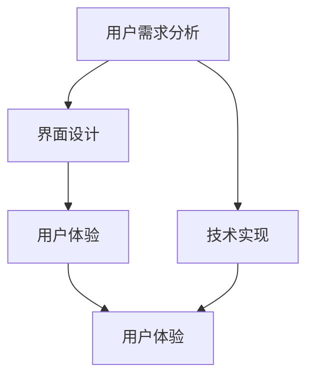

                 

### 文章标题

《人机交互：设计有效的人类计算系统》

> 关键词：人机交互、设计原则、用户体验、计算系统、技术实现

> 摘要：本文将深入探讨人机交互（HCI）在人类计算系统设计中的重要性，从设计原则、用户需求分析、技术实现等多个角度，阐述如何设计一个高效、易用的计算系统。通过分析现有的人机交互模型和算法，结合实际项目案例，提出未来人机交互系统的发展趋势和面临的挑战。

### 1. 背景介绍

人机交互（Human-Computer Interaction，简称HCI）是研究人类与计算机系统之间相互作用的学科。随着计算机技术的飞速发展，人机交互逐渐成为设计计算系统的重要一环。一个设计良好的计算系统不仅能够满足用户的操作需求，还能提高工作效率、降低操作难度，从而提升用户满意度。

人机交互在计算机科学中的应用范围广泛，从早期的命令行界面到如今的图形用户界面（GUI），再到智能语音助手、虚拟现实（VR）、增强现实（AR）等，人机交互技术不断发展，极大地改变了人类与计算机的交互方式。

本文旨在通过分析人机交互的设计原则、用户需求、技术实现等多个方面，探讨如何设计一个有效的人类计算系统。本文结构如下：

- 第1部分：背景介绍
- 第2部分：核心概念与联系
- 第3部分：核心算法原理 & 具体操作步骤
- 第4部分：数学模型和公式 & 详细讲解 & 举例说明
- 第5部分：项目实践：代码实例和详细解释说明
- 第6部分：实际应用场景
- 第7部分：工具和资源推荐
- 第8部分：总结：未来发展趋势与挑战
- 第9部分：附录：常见问题与解答
- 第10部分：扩展阅读 & 参考资料

### 2. 核心概念与联系

在设计人类计算系统时，我们需要了解以下几个核心概念，并理解它们之间的相互联系。

#### 2.1 用户需求分析

用户需求分析是设计计算系统的第一步。了解用户的需求，包括他们的目标、偏好、使用场景等，有助于我们设计出符合用户期望的计算系统。用户需求分析通常包括以下步骤：

1. **需求收集**：通过调查问卷、访谈、用户观察等方式收集用户需求。
2. **需求分类**：将收集到的需求进行分类，如功能需求、性能需求、易用性需求等。
3. **需求优先级排序**：根据用户需求和项目约束，对需求进行优先级排序。

#### 2.2 界面设计

界面设计是用户与计算系统交互的主要途径。一个良好的界面设计应该直观、易用、符合用户习惯。界面设计包括以下方面：

1. **布局设计**：合理安排界面元素的位置，确保用户能够轻松找到所需功能。
2. **色彩搭配**：合理运用色彩，提高界面的视觉效果。
3. **交互设计**：设计用户与界面之间的交互方式，如按钮、菜单、滑动等。

#### 2.3 用户体验

用户体验（UX）是用户在使用计算系统过程中的感受和体验。一个优秀的用户体验能够提高用户满意度，增加用户粘性。用户体验设计包括以下方面：

1. **易用性**：确保用户能够轻松、高效地完成任务。
2. **可用性**：确保计算系统在不同环境下都能正常运行。
3. **满意度**：提高用户的满意度，让用户愿意继续使用计算系统。

#### 2.4 技术实现

技术实现是人机交互的核心，它决定了计算系统的性能和稳定性。技术实现包括以下方面：

1. **前端技术**：如HTML、CSS、JavaScript等，用于实现界面设计和交互。
2. **后端技术**：如数据库、服务器、算法等，用于处理用户请求和数据存储。
3. **硬件支持**：如触摸屏、摄像头、传感器等，用于提供交互设备。

#### 2.5 Mermaid 流程图

为了更好地理解上述核心概念之间的联系，我们可以使用Mermaid流程图来展示它们之间的关系。



### 3. 核心算法原理 & 具体操作步骤

在设计人类计算系统时，核心算法的选择和实现至关重要。以下是一些常见的核心算法及其原理和具体操作步骤：

#### 3.1 决策树算法

决策树算法是一种常用的分类算法，用于根据特征数据对样本进行分类。其原理是基于特征的分割，通过多次分割将数据划分为不同的区域，最终得到分类结果。

**具体操作步骤：**

1. **数据准备**：准备特征数据和标签数据。
2. **特征选择**：选择具有区分度的特征。
3. **构建决策树**：根据特征和标签数据，构建决策树。
4. **预测**：使用构建好的决策树对新的样本进行预测。

#### 3.2 贝叶斯算法

贝叶斯算法是一种基于贝叶斯定理的分类算法，用于根据先验概率和观察到的数据，计算后验概率，从而判断样本的类别。

**具体操作步骤：**

1. **数据准备**：准备特征数据和标签数据。
2. **先验概率计算**：计算每个类别的先验概率。
3. **后验概率计算**：计算每个样本的后验概率。
4. **预测**：选择后验概率最大的类别作为预测结果。

#### 3.3 支持向量机算法

支持向量机（SVM）算法是一种常用的分类算法，用于将数据划分为不同的类别。其原理是找到最优的超平面，使得不同类别之间的距离最大。

**具体操作步骤：**

1. **数据准备**：准备特征数据和标签数据。
2. **特征选择**：选择具有区分度的特征。
3. **模型训练**：使用训练数据训练SVM模型。
4. **预测**：使用训练好的SVM模型对新的样本进行预测。

#### 3.4 神经网络算法

神经网络算法是一种基于模拟人脑神经元连接方式的算法，用于处理复杂的非线性问题。其原理是通过前向传播和反向传播，不断调整权重和偏置，以达到分类或回归的目的。

**具体操作步骤：**

1. **数据准备**：准备特征数据和标签数据。
2. **模型构建**：构建神经网络模型。
3. **模型训练**：使用训练数据训练神经网络。
4. **预测**：使用训练好的神经网络对新的样本进行预测。

### 4. 数学模型和公式 & 详细讲解 & 举例说明

在人机交互系统中，数学模型和公式起着重要的作用，它们帮助我们量化用户行为、优化系统性能、提高用户体验。以下是一些常见的数学模型和公式的详细讲解及举例说明。

#### 4.1 期望最大化（EM）算法

期望最大化（EM）算法是一种用于处理不完全数据的迭代优化算法，广泛应用于聚类、分类等问题。

**数学模型：**

$$
\begin{aligned}
E[\theta|X,Z] &= \arg\max_{\theta} \sum_{z} p(z|x, \theta) \log p(x,z|\theta) \\
M[\theta|X,Z] &= \arg\min_{\theta} \sum_{z} p(z|x, \theta) \log p(x,z|\theta)
\end{aligned}
$$

其中，$X$为观测数据，$Z$为隐含数据，$\theta$为参数。

**具体例子：**

假设我们有一个数据集，包含观测数据$X$和隐含数据$Z$，我们需要估计参数$\theta$。

- $X$：观测数据，如顾客满意度评分。
- $Z$：隐含数据，如顾客购买行为。

我们使用EM算法进行优化，首先初始化参数$\theta$，然后进行期望和最大化迭代，直至收敛。

#### 4.2 卷积神经网络（CNN）的激活函数

卷积神经网络（CNN）是一种用于处理图像数据的神经网络，其核心部分是卷积层和激活函数。

**数学模型：**

$$
a^{(l)}_i = \sigma(z^{(l)}_i)
$$

其中，$a^{(l)}_i$为第$l$层的第$i$个激活值，$z^{(l)}_i$为第$l$层的第$i$个输入值，$\sigma$为激活函数。

**激活函数举例：**

- **Sigmoid函数**：
  $$
  \sigma(z) = \frac{1}{1 + e^{-z}}
  $$

- **ReLU函数**：
  $$
  \sigma(z) = \max(0, z)
  $$

- **Tanh函数**：
  $$
  \sigma(z) = \frac{e^z - e^{-z}}{e^z + e^{-z}}
  $$

#### 4.3 排队论中的服务时间模型

排队论是研究排队系统中性能指标和优化策略的数学理论。以下是一个服务时间模型：

**数学模型：**

$$
\lambda = \frac{\rho}{(1-\rho)^2}
$$

其中，$\lambda$为服务时间，$\rho$为服务强度。

**具体例子：**

假设一个排队系统，服务强度$\rho = 0.8$，我们需要计算服务时间$\lambda$。

$$
\lambda = \frac{0.8}{(1-0.8)^2} = 2.67
$$

### 5. 项目实践：代码实例和详细解释说明

在本节中，我们将通过一个具体的代码实例，展示如何设计和实现一个人机交互系统。以下是一个简单的命令行界面（CLI）应用程序，用于处理用户输入并返回结果。

#### 5.1 开发环境搭建

为了开发这个CLI应用程序，我们需要安装以下工具：

- Python 3.x
- Python的虚拟环境工具（如virtualenv或conda）
- 代码编辑器（如VS Code或PyCharm）

#### 5.2 源代码详细实现

以下是一个简单的Python代码实例：

```python
import argparse

def main():
    # 创建命令行参数解析器
    parser = argparse.ArgumentParser(description='一个简单的人机交互应用程序')

    # 添加参数
    parser.add_argument('name', type=str, help='用户姓名')
    parser.add_argument('-g', '--greet', type=str, default='Hello', help='问候语')

    # 解析参数
    args = parser.parse_args()

    # 打印问候语
    print(f"{args.greet}, {args.name}!")

if __name__ == '__main__':
    main()
```

#### 5.3 代码解读与分析

- **解析器（argparse）**：用于解析命令行参数，包括位置参数和可选参数。
- **添加参数**：定义了两个参数，'name'（必选）和'greet'（可选）。
- **解析参数**：从命令行输入中解析参数，并将解析结果存储在`args`对象中。
- **打印问候语**：根据用户输入的参数，打印问候语。

#### 5.4 运行结果展示

在命令行中运行以下命令：

```
python greet.py John -g "Good morning"
```

输出结果：

```
Good morning, John!
```

### 6. 实际应用场景

人机交互系统在各个领域都有广泛的应用，以下是一些实际应用场景：

#### 6.1 金融服务

在金融服务领域，人机交互系统被用于在线银行、投资顾问、客户服务等方面。通过智能客服系统，用户可以实时获取咨询服务，提高用户体验和满意度。

#### 6.2 健康医疗

在健康医疗领域，人机交互系统被用于患者管理、健康监测、诊断支持等方面。例如，智能语音助手可以帮助患者查询健康信息、预约挂号、获取医疗建议等。

#### 6.3 教育培训

在教育培训领域，人机交互系统被用于在线课程、学习评估、教学支持等方面。通过智能教育平台，学生可以随时随地进行学习，提高学习效果。

#### 6.4 智能家居

在智能家居领域，人机交互系统被用于智能音箱、智能门锁、智能照明等方面。通过语音控制，用户可以轻松地控制家居设备，提高生活便利性。

### 7. 工具和资源推荐

为了更好地设计人机交互系统，以下是一些建议的书籍、工具和资源：

#### 7.1 学习资源推荐

- **《交互设计精髓》**：一本经典的交互设计指南，适合初学者和专业人士。
- **《人机交互心理学》**：一本深入探讨人机交互心理学的书籍，有助于理解用户行为和心理。

#### 7.2 开发工具框架推荐

- **React**：一个用于构建用户界面的JavaScript库，适用于构建复杂的人机交互系统。
- **Vue.js**：一个轻量级的JavaScript框架，适用于构建动态的人机交互界面。

#### 7.3 相关论文著作推荐

- **《人机交互系统设计方法》**：一篇关于人机交互系统设计方法的综述论文。
- **《用户中心设计》**：一篇关于用户中心设计理念的论文，探讨了如何将用户需求融入设计过程中。

### 8. 总结：未来发展趋势与挑战

人机交互系统在未来将继续发展，面临以下趋势和挑战：

#### 8.1 智能化

随着人工智能技术的发展，人机交互系统将更加智能化，能够更好地理解用户需求、提供个性化服务。

#### 8.2 多模态交互

未来的人机交互系统将支持多种交互模式，如语音、手势、眼动等，提供更加丰富和自然的交互体验。

#### 8.3 安全性

随着人机交互系统的广泛应用，安全性问题日益突出。如何保障用户隐私和数据安全将成为一个重要挑战。

#### 8.4 可访问性

为了满足不同用户的需求，人机交互系统需要具备良好的可访问性，支持残障人士和老年人等特殊用户。

### 9. 附录：常见问题与解答

#### 9.1 什么是人机交互？

人机交互（HCI）是研究人类与计算机系统之间相互作用的学科，旨在设计出高效、易用的计算系统。

#### 9.2 人机交互系统有哪些设计原则？

人机交互系统设计应遵循以下原则：易用性、可用性、满意度、一致性、反馈、简洁性等。

#### 9.3 人机交互系统有哪些核心算法？

人机交互系统中常用的核心算法包括决策树、贝叶斯算法、支持向量机、神经网络等。

### 10. 扩展阅读 & 参考资料

- **《人机交互系统设计》**：一本系统介绍人机交互系统设计的书籍，适合初学者和专业人士。
- **《计算机科学中的统计学》**：一本关于统计学在计算机科学中应用的书籍，适合对人机交互系统中的数学模型和公式感兴趣的人。
- **《用户体验要素》**：一本关于用户体验设计的重要著作，适合设计人机交互系统的人阅读。

