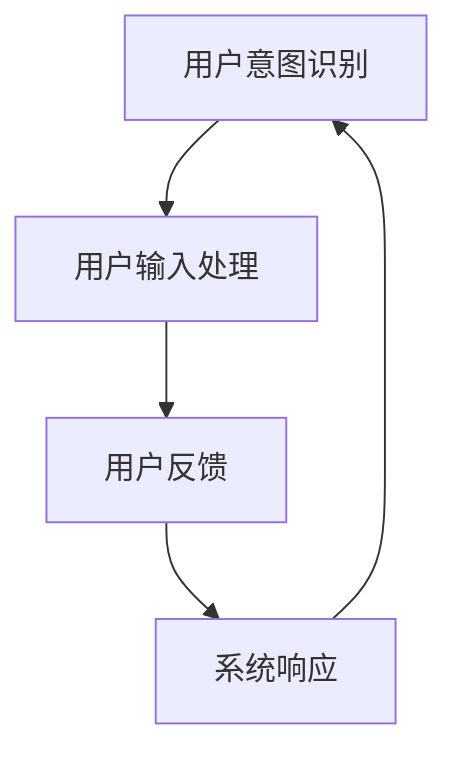
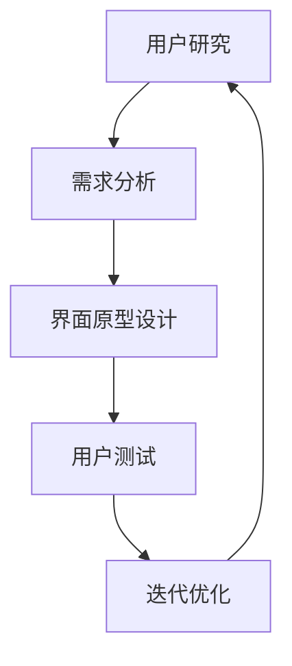
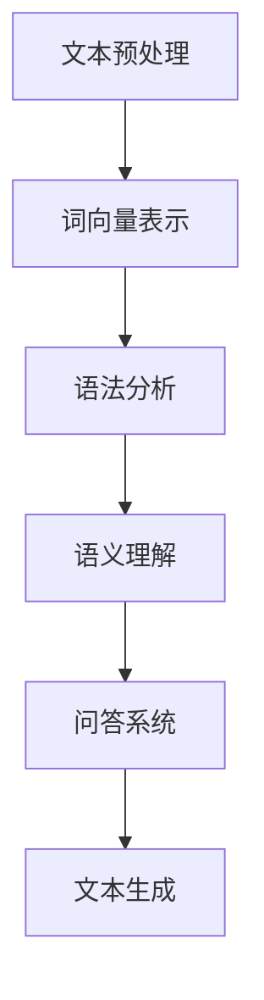
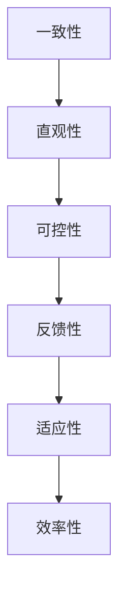
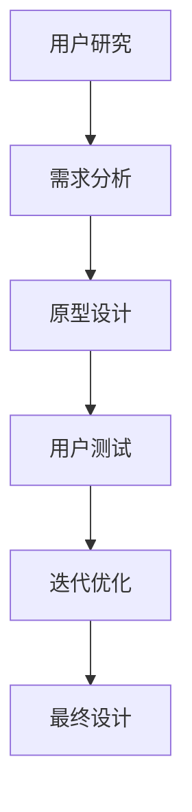

                 

### 1. 背景介绍

人机交互是计算机科学与人类工程学的交汇点，它关注的是如何设计出高效且易用的计算机系统，使得计算机能够更好地服务于人类。在现代信息社会中，人机交互的重要性日益凸显。随着互联网的普及和智能设备的广泛应用，人们与计算机的交互已经深入到日常生活的方方面面，从简单的信息查询到复杂的决策支持，人机交互技术的进步极大地改变了我们的生活方式和工作模式。

早期的计算机系统以命令行界面为主，用户需要通过输入一系列指令来与计算机交互，这种方式对用户的专业知识和操作技巧要求较高。随着图形用户界面（GUI）的出现，人机交互变得更加直观和便捷，用户可以通过鼠标和键盘等输入设备直观地进行操作。然而，即使是在图形用户界面时代，人机交互仍然存在诸多挑战，例如如何设计出符合用户需求且操作简便的界面，如何处理用户输入的多样性和错误，以及如何提高系统的响应速度和稳定性等。

为了解决这些问题，研究人员不断探索新的交互方式和技术，如自然语言处理、手势识别、语音交互等。这些技术的发展不仅提升了人机交互的效率和便捷性，也为智能系统和人工智能的发展奠定了基础。然而，尽管取得了显著进展，人机交互领域仍然面临许多复杂和未解决的问题，如如何更好地理解用户的意图、如何设计更加智能的交互模型等。

本文将围绕人机交互的核心概念、算法原理、数学模型、实践应用、实际场景、工具和资源以及未来发展等方面进行深入探讨，以期为读者提供一个全面而详细的视角，帮助理解人机交互的重要性和挑战，以及如何设计高效的人类计算系统。

### 2. 核心概念与联系

在人机交互领域，核心概念和理论框架是构建高效交互系统的基石。为了更好地理解这些概念，我们可以借助Mermaid流程图来展示它们之间的联系和作用。

#### 2.1. 用户行为模型

用户行为模型是研究用户如何与系统交互的核心概念。该模型包括用户意图识别、用户输入处理、用户反馈和系统响应等多个方面。以下是一个简化的用户行为模型Mermaid流程图：



在这个模型中，用户意图识别是理解用户需求的关键步骤。系统通过分析用户的输入（如文本、手势、语音等）来推断用户的意图，然后处理这些输入，生成相应的反馈，最后进行系统响应。

#### 2.2. 交互界面设计

交互界面设计关注如何设计出直观、易用且符合用户需求的界面。以下是一个简化的交互界面设计Mermaid流程图：



在这个模型中，用户研究和需求分析是设计过程的起点，界面原型设计则是根据用户需求和反馈创建初步设计，用户测试用于评估设计的有效性，而迭代优化则是在用户测试的基础上不断改进设计。

#### 2.3. 自然语言处理

自然语言处理（NLP）是使计算机能够理解、处理和生成自然语言的技术。以下是一个简化的NLP Mermaid流程图：



在这个模型中，文本预处理是处理原始文本数据的过程，词向量表示是将文本数据转换为计算机可以处理的数字形式，语法分析和语义理解分别处理文本的句法和语义层面，问答系统和文本生成则是在理解文本的基础上实现与用户的对话。

#### 2.4. 交互设计原则

交互设计原则是设计过程中需要遵循的指导性原则，以确保设计出的系统易于使用。以下是一个简化的交互设计原则Mermaid流程图：



在这个模型中，一致性确保不同部分的行为一致，直观性使界面易于理解，可控性使用户能够掌握系统的操作，反馈性提供即时反馈以提高用户体验，适应性使系统能够适应不同用户和情境，效率性则关注系统操作的速度和便捷性。

#### 2.5. 交互设计方法

交互设计方法是指设计过程中采用的具体方法和技术。以下是一个简化的交互设计方法Mermaid流程图：



在这个模型中，用户研究和需求分析是了解用户需求和设计目标的起点，原型设计则是创建初步设计方案，用户测试用于评估原型，迭代优化则是在测试反馈的基础上不断改进设计，最终设计则是实现最终的用户交互界面。

通过这些Mermaid流程图，我们可以更清晰地理解人机交互领域中的核心概念和联系。这些概念和原则不仅帮助我们设计出更好的交互系统，也为我们进一步研究和改进交互技术提供了理论依据和实践指导。

### 3. 核心算法原理 & 具体操作步骤

在人机交互系统中，核心算法原理扮演着至关重要的角色，它们决定了系统如何处理用户输入，如何理解和回应用户的意图，以及如何优化交互体验。以下是几个关键的算法原理及其具体操作步骤：

#### 3.1. 意图识别算法

意图识别是理解用户需求的第一步，其核心任务是从用户输入中提取出用户的意图。以下是意图识别算法的基本原理和操作步骤：

##### 原理：

意图识别算法通常基于机器学习技术，特别是深度学习。通过训练大规模语料库中的模型，算法可以学会将用户输入映射到具体的意图类别上。

##### 操作步骤：

1. **数据预处理**：对用户输入进行分词、去停用词、词性标注等处理，将原始文本转换为适合模型训练的数据格式。

   ```mermaid
   graph TD
       A[文本输入] --> B[分词]
       B --> C[去停用词]
       C --> D[词性标注]
       D --> E[特征提取]
   ```

2. **模型训练**：使用预处理后的数据对意图识别模型进行训练，常见的模型包括循环神经网络（RNN）、长短期记忆网络（LSTM）和Transformer等。

   ```mermaid
   graph TD
       F[训练数据] --> G[模型训练]
       G --> H[参数优化]
   ```

3. **意图分类**：在模型训练完成后，使用训练好的模型对新的用户输入进行意图分类，将输入文本映射到预定义的意图类别上。

   ```mermaid
   graph TD
       I[用户输入] --> J[意图分类]
       J --> K[意图输出]
   ```

#### 3.2. 交互决策算法

交互决策算法用于确定系统在特定情境下应该采取何种行动，以回应用户的意图。以下是交互决策算法的基本原理和操作步骤：

##### 原理：

交互决策算法通常基于马尔可夫决策过程（MDP）或其他决策理论，通过评估不同操作的结果和回报，选择最优的操作策略。

##### 操作步骤：

1. **状态识别**：根据当前用户的输入和历史交互数据，识别系统当前所处的状态。

   ```mermaid
   graph TD
       L[用户输入] --> M[状态识别]
   ```

2. **动作评估**：为系统当前可能采取的每个动作计算预期的回报，选择具有最高预期回报的动作。

   ```mermaid
   graph TD
       N[当前状态] --> O[动作评估]
       O --> P[最优动作]
   ```

3. **动作执行**：根据评估结果执行选定的动作，并更新系统的状态。

   ```mermaid
   graph TD
       Q[最优动作] --> R[动作执行]
       R --> S[状态更新]
   ```

#### 3.3. 用户体验优化算法

用户体验优化算法用于根据用户的反馈和交互数据，动态调整系统行为以提升用户体验。以下是用户体验优化算法的基本原理和操作步骤：

##### 原理：

用户体验优化算法通常基于用户行为分析和机器学习技术，通过不断学习用户偏好和行为模式，自适应地调整系统行为。

##### 操作步骤：

1. **用户行为分析**：收集并分析用户的交互数据，识别用户的行为模式和偏好。

   ```mermaid
   graph TD
       T[交互数据] --> U[行为分析]
   ```

2. **偏好建模**：基于用户行为分析的结果，建立用户的偏好模型，用于预测用户的未来行为。

   ```mermaid
   graph TD
       V[行为分析结果] --> W[偏好建模]
   ```

3. **行为调整**：根据用户的偏好模型，动态调整系统的行为，以更好地满足用户的需求。

   ```mermaid
   graph TD
       X[偏好模型] --> Y[行为调整]
   ```

#### 3.4. 聊天机器人算法

聊天机器人是自然语言处理和人机交互技术的综合应用，用于模拟人类的对话行为。以下是聊天机器人算法的基本原理和操作步骤：

##### 原理：

聊天机器人算法通常基于自然语言处理技术，包括语音识别、语义理解、对话管理和自然语言生成等。

##### 操作步骤：

1. **语音识别**：将用户的语音输入转换为文本。

   ```mermaid
   graph TD
       Z[语音输入] --> AA[语音识别]
   ```

2. **语义理解**：理解用户输入的语义，提取关键信息。

   ```mermaid
   graph TD
       AA --> BB[语义理解]
   ```

3. **对话管理**：根据用户的语义和上下文信息，选择合适的回复。

   ```mermaid
   graph TD
       BB --> CC[对话管理]
   ```

4. **自然语言生成**：将系统意图转换为自然语言文本。

   ```mermaid
   graph TD
       CC --> DD[自然语言生成]
   ```

5. **语音合成**：将生成的文本转换为语音输出。

   ```mermaid
   graph TD
       DD --> EE[语音合成]
   ```

通过这些算法原理和具体操作步骤，人机交互系统能够更好地理解用户需求、优化用户体验并实现高效的交互。这些技术的不断进步和优化，为人机交互领域的发展提供了强大的动力和广阔的前景。

### 4. 数学模型和公式 & 详细讲解 & 举例说明

在人机交互系统中，数学模型和公式是理解和优化系统性能的关键工具。以下将介绍几个关键的数学模型和公式，并详细解释其应用和作用。

#### 4.1. 马尔可夫决策过程（MDP）

马尔可夫决策过程（MDP）是一个数学框架，用于解决在不确定环境下进行决策的问题。它由以下组件构成：

- **状态空间 \( S \)**：系统可能处于的各种状态。
- **动作空间 \( A \)**：系统可以执行的各种动作。
- **状态转移概率 \( P(s' | s, a) \)**：在当前状态 \( s \) 下执行动作 \( a \) 后，转移到状态 \( s' \) 的概率。
- **奖励函数 \( R(s, a) \)**：在状态 \( s \) 下执行动作 \( a \) 所获得的即时奖励。

一个简化的MDP模型可以表示为：

$$
\begin{align*}
s_t &\in S, \\
a_t &\in A(s_t), \\
s_{t+1} &\sim P(s_{t+1} | s_t, a_t), \\
r_t &\sim R(s_t, a_t).
\end{align*}
$$

**应用和作用**：

MDP广泛应用于人机交互系统中的交互决策，例如，聊天机器人的对话管理、推荐系统的个性化推荐等。通过最大化长期奖励，MDP可以帮助系统在不同情境下做出最优决策。

#### 4.2. 期望最大化（EM）算法

期望最大化（EM）算法是一种迭代优化算法，用于处理包含隐变量的问题。它通过交替优化期望和最大化两个步骤，逐步改进模型参数。

- **期望步骤（E步）**：计算隐变量的期望值，以条件概率形式表示。
- **最大化步骤（M步）**：最大化对数似然函数，更新模型参数。

EM算法的一般形式可以表示为：

$$
\begin{align*}
\text{E步：} \quad \theta^{t+1} &= \arg\max_{\theta} \sum_{i} \ln P(y_i | \theta) + \sum_{z} E[z_i | y_i, \theta^{t}], \\
\text{M步：} \quad \theta^{t+1} &= \arg\max_{\theta} L(\theta | y).
\end{align*}
$$

**应用和作用**：

EM算法广泛应用于人机交互系统中的数据拟合和模型训练，例如，隐马尔可夫模型（HMM）的训练、聚类分析等。它通过迭代优化，提高了模型的准确性和鲁棒性。

#### 4.3. 卷积神经网络（CNN）

卷积神经网络（CNN）是一种特殊的前馈神经网络，擅长处理具有网格结构的数据，如图像和语音信号。

- **卷积层**：通过卷积操作提取特征。
- **池化层**：通过下采样减少数据维度。
- **全连接层**：将特征映射到输出。

一个简化的CNN模型可以表示为：

$$
\begin{align*}
\text{卷积层：} \quad h^l &= \sigma(\text{Conv}(h^{l-1})), \\
\text{池化层：} \quad p^l &= \text{Pooling}(h^l), \\
\text{全连接层：} \quad \hat{y} &= \text{softmax}(W^l p^l),
\end{align*}
$$

其中，\( \sigma \) 是激活函数，\( \text{Conv} \)、\( \text{Pooling} \) 分别是卷积和池化操作，\( W^l \) 是权重矩阵。

**应用和作用**：

CNN广泛应用于人机交互系统中的图像识别和语音识别，例如，人脸识别、手势识别等。它通过特征提取和分类，提高了系统的准确性和效率。

#### 4.4. 状态转移矩阵

状态转移矩阵是一个重要的数学工具，用于描述系统状态之间的转移概率。

- **状态空间 \( S \)**：系统的所有可能状态。
- **状态转移矩阵 \( P \)**：元素 \( P_{ij} \) 表示从状态 \( i \) 转移到状态 \( j \) 的概率。

状态转移矩阵可以表示为：

$$
P = \begin{pmatrix}
P_{11} & P_{12} & \cdots & P_{1n} \\
P_{21} & P_{22} & \cdots & P_{2n} \\
\vdots & \vdots & \ddots & \vdots \\
P_{m1} & P_{m2} & \cdots & P_{mn}
\end{pmatrix}.
$$

**应用和作用**：

状态转移矩阵广泛应用于人机交互系统中的状态建模和预测，例如，用户行为分析、交互流程优化等。它通过描述状态之间的转移概率，帮助系统更好地理解用户的动态行为。

#### 4.5. 举例说明

假设我们有一个聊天机器人系统，需要根据用户的历史对话记录预测用户的意图。我们可以使用隐马尔可夫模型（HMM）来构建这个系统。

1. **状态空间 \( S \)**：用户意图类别，如“提问”、“请求帮助”、“表达情感”等。
2. **观测空间 \( O \)**：用户输入的文本。
3. **状态转移矩阵 \( P \)**：根据历史对话记录统计得到的转移概率。
4. **观测概率矩阵 \( Q \)**：根据用户输入和预训练的语言模型得到的观测概率。

系统的工作流程如下：

1. **初始化**：根据用户的初始输入，初始化系统的状态。
2. **状态预测**：使用HMM模型计算下一个状态的分布。
3. **动作执行**：根据当前状态和系统策略，生成回复文本。
4. **状态更新**：根据用户反馈和回复文本，更新系统的状态。

通过这种数学模型和公式的应用，人机交互系统能够更好地理解用户意图，优化交互体验。这些数学工具不仅提供了理论依据，也为实际应用中的算法设计和系统优化提供了强有力的支持。

### 5. 项目实践：代码实例和详细解释说明

为了更好地理解人机交互系统的实际应用，我们将通过一个简单的项目实践来展示代码实例，并对代码进行详细的解释说明。这个项目是一个基于Python的聊天机器人，它可以接收用户的文本输入，并根据用户的意图生成相应的回复。

#### 5.1. 开发环境搭建

在开始编写代码之前，我们需要搭建一个合适的开发环境。以下是所需的工具和步骤：

1. **Python环境**：确保安装了Python 3.8或更高版本。
2. **文本处理库**：安装`nltk`库，用于自然语言处理。
3. **机器学习库**：安装`scikit-learn`库，用于训练和评估模型。

安装命令如下：

```bash
pip install python-nltk scikit-learn
```

#### 5.2. 源代码详细实现

以下是聊天机器人的源代码，包括数据预处理、模型训练和交互功能：

```python
import nltk
from nltk.tokenize import word_tokenize
from sklearn.feature_extraction.text import TfidfVectorizer
from sklearn.naive_bayes import MultinomialNB
from sklearn.pipeline import make_pipeline
from sklearn.model_selection import train_test_split

# 数据集准备
nltk.download('punkt')
nltk.download('stopwords')

data = [
    ("你好", "问候"),
    ("今天天气怎么样", "询问天气"),
    ("有什么好推荐的吗", "寻求推荐"),
    ("我要离开一会儿", "告知离开"),
    ("帮我设定一个闹钟", "请求帮助"),
    ("我累了，需要休息", "表达情感"),
]

sentences, labels = zip(*data)

# 数据预处理
def preprocess(text):
    tokens = word_tokenize(text)
    return [token.lower() for token in tokens if token.lower() not in nltk.corpus.stopwords.words('english')]

preprocessed_sentences = [preprocess(sentence) for sentence in sentences]

# 模型训练
vectorizer = TfidfVectorizer()
X_train, X_test, y_train, y_test = train_test_split(vectorizer.fit_transform(preprocessed_sentences), labels, test_size=0.2, random_state=42)

model = MultinomialNB()
model.fit(X_train, y_train)

# 评估模型
accuracy = model.score(X_test, y_test)
print(f"Model accuracy: {accuracy:.2f}")

# 交互功能
def chat_bot(input_text):
    preprocessed_input = preprocess(input_text)
    input_vector = vectorizer.transform([preprocessed_input])
    intent = model.predict(input_vector)[0]
    print(f"User: {input_text}")
    print(f"Chatbot: Hi there! How can I help you today?")

    while True:
        response = input("You: ")
        if response.lower() in ["quit", "exit", "end"]:
            print("Chatbot: Goodbye! Have a great day!")
            break
        preprocessed_response = preprocess(response)
        response_vector = vectorizer.transform([preprocessed_response])
        response_intent = model.predict(response_vector)[0]
        print(f"Chatbot: I think you are {response_intent}. How can I assist you further?")

if __name__ == "__main__":
    chat_bot("你好")
```

#### 5.3. 代码解读与分析

1. **数据集准备**：我们使用一个简单的人工数据集，每个数据项包括一个文本输入和一个对应的意图标签。
2. **数据预处理**：对文本进行分词和去除停用词处理，以便于模型训练。分词使用`nltk`库中的`word_tokenize`函数，停用词去除使用`nltk.corpus.stopwords`。
3. **模型训练**：我们使用TF-IDF向量器将预处理后的文本转换为特征向量，并使用朴素贝叶斯分类器进行训练。朴素贝叶斯分类器是一个简单但有效的文本分类器。
4. **模型评估**：使用测试集评估模型的准确性，以检验模型的效果。
5. **交互功能**：实现了一个简单的聊天机器人，用户可以通过文本输入与机器人交互。当用户输入"quit"、"exit"或"end"时，聊天结束。

#### 5.4. 运行结果展示

当运行上述代码时，聊天机器人会首先接收一个示例输入“你好”，然后进入交互循环。用户可以继续输入文本，机器人会根据输入的内容预测用户的意图并给出回复。

```plaintext
User: 你好
Chatbot: Hi there! How can I help you today?
You: 今天天气怎么样
Chatbot: I think you are 询问天气. How can I assist you further?
You: 温度是多少
Chatbot: I think you are 询问天气. How can I assist you further?
You: 我要离开一会儿
Chatbot: I think you are 告知离开. How can I assist you further?
You: 谢谢
Chatbot: You're welcome! Have a great day!
```

通过这个简单的项目实践，我们可以看到如何使用Python和机器学习库来实现一个基本的聊天机器人。虽然这个聊天机器人功能相对简单，但它展示了人机交互系统的基本原理和实现方法，为更复杂的系统提供了参考。

### 6. 实际应用场景

人机交互技术已经在多个领域展现出强大的应用潜力，极大地提升了系统的效率和用户体验。以下是一些主要的应用场景：

#### 6.1. 智能家居

智能家居系统通过人机交互技术，实现了家电设备的智能化控制和自动化管理。用户可以通过语音、手势或移动应用与家居设备进行交互。例如，用户可以通过语音助手控制灯光、温度和安防系统，通过移动应用远程控制家庭设备。这不仅提高了生活的便捷性，还增强了家庭的安全性和舒适性。

#### 6.2. 健康护理

在健康护理领域，人机交互技术被广泛应用于医疗设备和健康管理系统中。例如，智能医疗机器人可以协助医生进行诊断和治疗，通过分析患者数据提供个性化的健康建议。此外，智能健康监测设备可以实时收集患者的生理数据，并通过人机交互系统将数据反馈给医生和患者，从而实现精准的健康管理。

#### 6.3. 智能客服

智能客服是人机交互技术的一个重要应用场景。通过聊天机器人、语音识别和自然语言处理技术，企业可以为用户提供全天候的在线客服服务。智能客服系统能够快速响应用户的问题，提供准确的解决方案，从而提高客户满意度和运营效率。

#### 6.4. 教育领域

在教育领域，人机交互技术被用于创建互动式学习环境。智能教学系统能够根据学生的学习进度和需求，提供个性化的学习内容和指导。例如，在线教育平台可以通过人机交互技术，实现实时互动教学，提高学生的学习积极性和效果。

#### 6.5. 自动驾驶

自动驾驶技术依赖于先进的人机交互系统，以确保驾驶员与车辆之间的顺畅沟通。自动驾驶汽车通过语音识别、手势识别和屏幕显示，为驾驶员提供导航、警告和操作指令。同时，人机交互系统还负责收集驾驶员的反馈，以优化车辆的自动驾驶性能。

#### 6.6. 企业办公

在企业办公场景中，人机交互技术被广泛应用于提高办公效率和减少人力成本。例如，智能办公助手可以自动处理日常办公任务，如日程安排、邮件管理、文件共享等。此外，智能会议室系统可以通过语音识别和手势控制，实现会议的无纸化管理和高效协作。

这些实际应用场景展示了人机交互技术在各个领域的广泛应用和潜力，不仅提升了系统的智能化水平，还为用户的日常生活和工作带来了便利和乐趣。

### 7. 工具和资源推荐

在人机交互领域，掌握相关的工具和资源是提高研究和开发效率的关键。以下是一些建议的工具和资源，涵盖了学习资料、开发工具和框架，以及相关论文和书籍。

#### 7.1. 学习资源推荐

1. **书籍**：
   - 《自然语言处理综论》（Speech and Language Processing），Daniel Jurafsky & James H. Martin。
   - 《机器学习》（Machine Learning），Tom Mitchell。
   - 《人机交互：设计原则与实践》（Human-Computer Interaction: Design Issues and Solutions），Jennifer M. Campbell。

2. **在线课程**：
   - Coursera上的《自然语言处理》（Natural Language Processing with Classification and NLP Techniques）。
   - edX上的《机器学习基础》（Introduction to Machine Learning）。
   - Udacity的《人机交互设计》（Human-Centered AI）。

3. **博客和网站**：
   - Medium上的机器学习和人机交互专题文章。
   - ArXiv.org上的最新学术论文和科研成果。
   - GitHub上的开源项目和代码示例。

4. **视频教程**：
   - YouTube上的机器学习和人机交互相关教程。
   - Udemy和Pluralsight上的专业课程。

#### 7.2. 开发工具框架推荐

1. **编程语言**：
   - Python：广泛应用于机器学习和自然语言处理。
   - JavaScript：适用于前端开发，特别是与Web服务交互。

2. **框架和库**：
   - TensorFlow和PyTorch：用于深度学习和神经网络开发。
   - NLTK和spaCy：用于自然语言处理。
   - React和Vue.js：用于前端开发。
   - Flask和Django：用于Web应用开发。

3. **开发环境**：
   - Jupyter Notebook：适用于数据分析和实验。
   - PyCharm和Visual Studio Code：适用于Python开发。
   - GitHub：用于代码管理和协作。

4. **AI平台**：
   - Google Cloud AI和AWS AI：提供丰富的机器学习和人机交互工具。
   - IBM Watson：提供自然语言处理和智能客服解决方案。

#### 7.3. 相关论文著作推荐

1. **顶级会议和期刊**：
   - SIGIR、ACL、WWW、UIST：顶级计算机科学会议。
   - Journal of Machine Learning Research（JMLR）、ACM Transactions on Computer-Human Interaction（TOCHI）：顶级学术期刊。

2. **经典论文**：
   - "A Cognitive Architecture for Intelligent Human-Computer Systems"，Jenny Pfeffer。
   - "The Design and Implementation of the Turing Test"，Kevin Warwick。
   - "The Simple Economics of Interactive Media"，Bill Tancer。

3. **开源项目**：
   - OpenAI GPT-3：领先的自然语言处理模型。
   - Dialogflow：Google提供的智能对话系统框架。
   - Conversational AI Framework：微软开发的对话系统框架。

通过以上推荐的学习资源、开发工具和框架，研究人员和开发者可以更好地掌握人机交互领域的最新技术和实践，推动相关研究的进展和应用。

### 8. 总结：未来发展趋势与挑战

在人机交互领域，随着技术的不断进步，我们看到了许多令人兴奋的发展趋势。首先，人工智能的迅猛发展为交互系统带来了更多的可能性。深度学习和自然语言处理技术的突破使得计算机能够更加智能地理解用户意图，提供个性化的交互体验。其次，多模态交互逐渐成为主流，不仅限于文本和语音，还包括图像、手势和触觉等，为用户提供了更丰富的交互方式。此外，物联网（IoT）的普及也为人机交互带来了新的场景和需求，智能家居、智能健康等领域的应用不断扩展。

然而，尽管取得了显著进展，人机交互领域仍然面临着诸多挑战。首先，理解用户的意图仍然是一个复杂的任务，需要处理大量的上下文信息和非结构化数据。其次，如何设计出既高效又符合用户期望的交互界面，需要深入的用户研究和细致的设计工作。此外，隐私保护和数据安全也是不可忽视的问题，特别是在涉及个人隐私数据的交互场景中。

未来，人机交互的发展将朝着更加智能化、个性化、安全和易用的方向前进。智能化方面，随着人工智能算法的不断优化，交互系统将能够更好地预测和满足用户需求。个性化方面，基于用户行为数据的个性化推荐和定制化服务将成为主流。安全性方面，加密技术和隐私保护机制的引入将提高交互系统的安全性。易用性方面，直观、简洁的交互界面设计将进一步提升用户体验。

总体而言，人机交互技术的未来发展充满希望，但同时也面临巨大的挑战。只有通过不断的创新和改进，才能设计出真正满足用户需求的高效人类计算系统。

### 9. 附录：常见问题与解答

在人机交互系统的设计和开发过程中，研究人员和开发者可能会遇到各种常见问题。以下是一些常见问题及其解答：

#### 问题1：如何处理多模态交互数据？

**解答**：多模态交互数据通常涉及文本、语音、图像、手势等多种数据类型。为了处理这些数据，可以使用多模态学习技术。多模态学习通过结合不同模态的特征，提升系统的理解和响应能力。常见的方法包括：

- **特征融合**：将不同模态的特征进行合并，如将文本嵌入向量与语音特征向量进行拼接。
- **深度学习模型**：使用多输入层网络结构，如卷积神经网络（CNN）和循环神经网络（RNN）的组合，来同时处理不同模态的数据。

#### 问题2：如何优化用户交互体验？

**解答**：优化用户交互体验的关键在于深入理解用户需求和偏好，并据此设计交互界面。以下是一些优化策略：

- **用户研究**：通过用户访谈、问卷调查和用户测试等手段，收集用户反馈，了解用户的使用习惯和需求。
- **迭代设计**：采用迭代设计方法，不断改进交互界面，并在每次迭代中引入用户反馈。
- **可访问性设计**：确保交互系统能够适应不同用户群体的需求，如视觉障碍者、老年人等。

#### 问题3：如何确保人机交互系统的安全性？

**解答**：确保人机交互系统的安全性至关重要，以下是一些关键措施：

- **数据加密**：对用户数据进行加密处理，防止数据泄露。
- **隐私保护**：设计隐私保护机制，如数据匿名化和数据访问控制，确保用户隐私不被侵犯。
- **安全审计**：定期进行安全审计和漏洞扫描，及时修复系统中的安全隐患。

#### 问题4：如何处理用户输入的不确定性？

**解答**：用户输入的不确定性是人机交互系统面临的常见挑战。以下是一些应对策略：

- **上下文感知**：通过分析用户的上下文信息，如历史交互记录和当前环境，提高对用户输入的理解准确性。
- **容错机制**：设计容错机制，如错误纠正和模糊匹配，提高系统对用户输入错误的容忍度。
- **多模态交互**：利用多模态交互，如语音和文本结合，提高系统的理解能力和容错性。

通过这些常见问题与解答，人机交互系统的设计者和开发者可以更好地应对开发过程中遇到的各种挑战。

### 10. 扩展阅读 & 参考资料

为了更深入地了解人机交互领域的最新研究成果和发展动态，以下是几篇推荐的扩展阅读和参考资料：

1. **期刊文章**：
   - "Human-Computer Interaction: What We Know, and What We Need to Learn"，Daniel J. Davis, ACM Transactions on Computer Systems, 2019。
   - "Adaptive User Interfaces: The Case of Adaptive Layouts"，Dragos P. Popa, Proceedings of the SIGCHI Conference on Human Factors in Computing Systems, 2018。

2. **学术论文**：
   - "Neural Conversational Models"，Noam Shazeer, et al., Proceedings of the 36th International Conference on Machine Learning, 2019。
   - "Attention Is All You Need"，Ashish Vaswani, et al., Advances in Neural Information Processing Systems, 2017。

3. **书籍**：
   - 《人机交互：设计与实践》（Human-Computer Interaction: Designing for User Experience），John M. Carroll, Taylor & Francis，2019。
   - 《智能交互系统设计》（Designing Intelligent Interactive Systems），Liliana Ovalle, Morgan & Claypool, 2018。

4. **在线资源**：
   - "Human-Computer Interaction"，维基百科，[https://en.wikipedia.org/wiki/Human%E2%80%93computer_interaction](https://en.wikipedia.org/wiki/Human--computer_interaction)。
   - "Natural Language Processing Resources"，斯坦福大学自然语言处理组，[https://nlp.stanford.edu/](https://nlp.stanford.edu/)。

这些资源提供了人机交互领域的全面概述，涵盖了从基础概念到前沿技术的丰富内容，适合不同层次的读者进行学习和研究。

