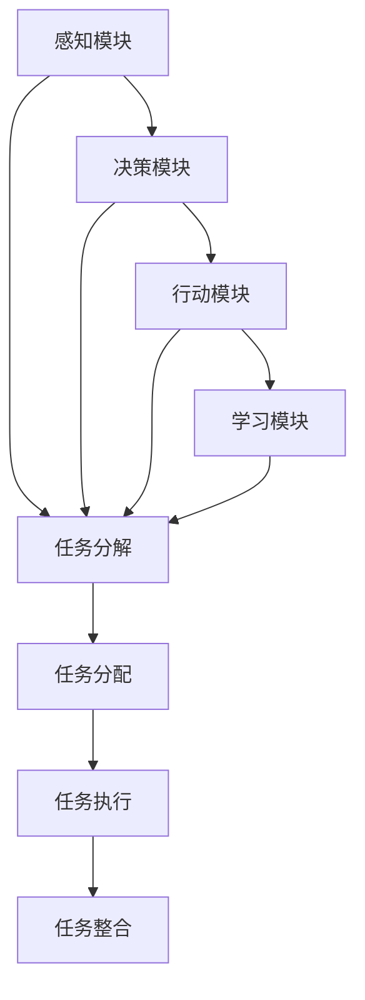

                 

### 文章标题

《人类 计算：在AI时代增强道德代理》

> 关键词：AI时代，道德代理，人类计算，计算伦理，智能计算，人工智能，道德计算，人机协作

> 摘要：本文深入探讨了AI时代中道德代理的重要性，以及如何通过人类计算来增强道德代理的效能。我们首先回顾了道德代理的基本概念和其在现代计算中的关键作用，然后分析了人类计算在道德代理中的应用，探讨了如何结合人类计算和人工智能技术，提升道德代理的决策能力和可靠性。通过实际案例和理论分析，本文提出了未来在AI时代中，增强道德代理所面临的挑战和机遇。

### 1. 背景介绍

随着人工智能（AI）技术的迅猛发展，智能代理（agent）作为AI领域的一个重要研究方向，受到了越来越多的关注。智能代理是一种能够自主执行任务、与环境和用户交互的实体，它们能够在复杂环境中做出决策和行动。然而，随着智能代理的应用范围不断扩大，如何在保证其高效性的同时，确保其道德和伦理的正确性，成为了一个亟待解决的问题。

道德代理（Moral Agent）是智能代理中的一个重要分支，它旨在使智能代理在执行任务时能够遵守道德规范。道德代理不仅要具备智能计算的能力，还需要具备道德推理和决策的能力。在人工智能时代，道德代理的重要性愈发凸显。首先，道德代理可以确保智能系统在执行任务时不会违反伦理原则，从而减少潜在的社会风险。其次，道德代理能够提升智能系统的透明度和可信度，增强用户对智能系统的信任感。

人类计算（Human Computation）是一种利用人类认知能力和计算能力相结合的方法，它通过将复杂任务分解为简单的子任务，由人类执行，从而实现高效的任务完成。人类计算在很多领域都取得了显著的成果，如图像识别、自然语言处理等。将人类计算应用于道德代理，可以充分发挥人类在道德判断和情感识别方面的优势，提高道德代理的决策质量和可靠性。

本文旨在探讨如何通过人类计算来增强道德代理的效能，使其在AI时代能够更好地应对复杂的道德和伦理问题。首先，我们将介绍道德代理的基本概念和原理，分析其在现代计算中的作用。接着，我们将讨论人类计算与道德代理的关系，探讨如何将人类计算技术应用于道德代理领域。随后，通过实际案例和理论分析，我们将探讨增强道德代理所面临的挑战和机遇。最后，我们将总结本文的主要观点，并对未来的发展趋势和挑战进行展望。

### 2. 核心概念与联系

#### 道德代理的概念与原理

道德代理是一种具备道德推理和决策能力的智能代理。它的核心目标是确保智能系统在执行任务时能够遵守道德规范，从而减少潜在的社会风险。道德代理通常包括以下几个关键组成部分：

1. **感知模块**：负责接收和处理环境中的信息，如文字、图像、声音等。
2. **决策模块**：基于感知模块提供的信息，结合道德规范和伦理原则，生成合理的行动策略。
3. **行动模块**：根据决策模块的建议执行具体的行动，如与用户交互、控制机器设备等。
4. **学习模块**：通过观察和反馈不断优化自身的道德判断和决策能力。

道德代理的原理可以概括为：感知 -> 决策 -> 行动 -> 学习。在这个过程中，道德代理需要不断地与环境互动，通过不断调整自己的行为来适应环境的变化，同时不断提升自身的道德判断能力。

#### 人类计算的概念与原理

人类计算是一种利用人类认知能力和计算能力相结合的方法。它通过将复杂任务分解为简单的子任务，由人类执行，从而实现高效的任务完成。人类计算的关键组成部分包括：

1. **任务分解**：将复杂任务拆分为多个简单的子任务，每个子任务都可以由人类独立完成。
2. **任务分配**：根据人类的技能和兴趣，将子任务分配给合适的执行者。
3. **任务执行**：人类执行者通过自己的认知能力完成子任务。
4. **任务整合**：将人类执行者完成的子任务整合成最终结果。

人类计算的原理可以概括为：任务分解 -> 任务分配 -> 任务执行 -> 任务整合。在这个过程中，人类计算充分发挥了人类在复杂任务处理、情感识别和道德判断等方面的优势，同时利用计算机系统的高效计算能力，实现复杂任务的高效完成。

#### 道德代理与人类计算的联系

道德代理和人类计算之间存在着紧密的联系。首先，道德代理可以利用人类计算技术来提高自身的道德判断能力。通过将复杂的道德问题分解为简单的子任务，人类计算可以充分发挥人类在道德判断和情感识别方面的优势，从而帮助道德代理做出更加准确的道德决策。

其次，人类计算可以为道德代理提供丰富的数据资源。通过收集和分析大量的道德案例和人类行为数据，人类计算可以为道德代理提供丰富的训练数据，帮助其学习和优化道德推理模型。

最后，道德代理和人类计算可以在任务执行过程中实现协同。在某些复杂的任务中，道德代理和人类计算可以相互协作，共同完成任务。例如，在医疗诊断领域，道德代理可以负责分析病历和诊断结果，而人类医生则可以负责进行临床决策和治疗方案制定。

下面是道德代理和人类计算的核心概念原理和架构的 Mermaid 流程图：



#### 道德代理与人类计算在实际应用中的优势

道德代理与人类计算在实际应用中的优势主要体现在以下几个方面：

1. **提升道德决策的准确性**：通过人类计算技术，道德代理可以充分利用人类在道德判断和情感识别方面的优势，提高道德决策的准确性。
2. **增强智能系统的透明度和可信度**：道德代理能够遵循道德规范，确保智能系统在执行任务时不会违反伦理原则，从而增强智能系统的透明度和可信度。
3. **实现任务的高效完成**：通过人类计算技术，复杂的道德任务可以被分解为简单的子任务，由人类执行，从而实现任务的高效完成。
4. **丰富数据资源**：人类计算可以为道德代理提供丰富的道德案例和人类行为数据，帮助其学习和优化道德推理模型。

### 3. 核心算法原理 & 具体操作步骤

在探讨如何通过人类计算来增强道德代理的效能之前，我们首先需要了解道德代理的核心算法原理，以及如何利用人类计算技术来提升其决策能力和可靠性。

#### 道德代理的核心算法原理

道德代理的核心算法主要包括以下几个部分：

1. **感知模块**：感知模块负责接收和处理环境中的信息，如文字、图像、声音等。常用的方法包括计算机视觉、自然语言处理等技术。例如，在图像识别任务中，可以使用卷积神经网络（CNN）来提取图像特征；在自然语言处理任务中，可以使用循环神经网络（RNN）或Transformer模型来处理文本数据。

2. **决策模块**：决策模块基于感知模块提供的信息，结合道德规范和伦理原则，生成合理的行动策略。决策模块的核心是道德推理模型，它可以是基于规则的推理模型，也可以是利用机器学习技术训练的深度学习模型。例如，在基于规则的推理模型中，可以使用模糊逻辑或马尔可夫决策过程（MDP）来模拟道德决策过程；在深度学习模型中，可以使用卷积神经网络（CNN）或循环神经网络（RNN）来训练道德推理模型。

3. **行动模块**：行动模块根据决策模块的建议执行具体的行动，如与用户交互、控制机器设备等。行动模块的实现依赖于具体的任务和应用场景。例如，在自动驾驶领域，行动模块可以负责控制车辆的加速度、转向等操作；在医疗诊断领域，行动模块可以负责生成诊断报告或治疗方案。

4. **学习模块**：学习模块通过观察和反馈不断优化自身的道德判断和决策能力。学习模块的实现通常基于机器学习技术，如监督学习、无监督学习和强化学习等。通过不断地学习和优化，道德代理可以逐步提高其在复杂环境中的道德决策能力。

#### 利用人类计算技术提升道德代理效能的具体操作步骤

1. **任务分解**：将复杂的道德任务分解为多个简单的子任务，每个子任务都可以由人类独立完成。例如，在医疗诊断领域，可以将诊断任务分解为病例阅读、症状分析、诊断建议等子任务。

2. **任务分配**：根据人类的技能和兴趣，将子任务分配给合适的执行者。例如，具有医学背景的专家可以负责病例阅读和诊断建议，而普通用户可以负责症状分析。

3. **任务执行**：人类执行者通过自己的认知能力完成子任务。在任务执行过程中，可以借助各种工具和资源，如医学数据库、文献检索系统等，以提高任务完成的效率和准确性。

4. **任务整合**：将人类执行者完成的子任务整合成最终结果。在整合过程中，可以运用人类计算技术，如数据挖掘、机器学习等，来提高整合结果的可靠性和准确性。

5. **反馈与优化**：根据任务执行结果和用户的反馈，不断优化道德代理的决策模型和行为策略。例如，在医疗诊断领域，可以通过分析诊断准确率和用户满意度等指标，来评估和优化道德代理的决策能力。

#### 人类计算技术提升道德代理效能的实例

1. **医学诊断**：在医学诊断领域，道德代理可以结合人类计算技术，通过分析患者的病历、症状和医学图像，生成诊断建议。人类医生可以对这些诊断建议进行审核和调整，以提高诊断准确率和患者的满意度。

2. **自动驾驶**：在自动驾驶领域，道德代理可以结合人类计算技术，通过分析交通状况、道路环境等信息，生成合理的驾驶策略。人类驾驶员可以对这些策略进行实时调整，以提高驾驶的安全性和可靠性。

3. **智能客服**：在智能客服领域，道德代理可以结合人类计算技术，通过分析用户的问题和需求，生成个性化的解决方案。人类客服代表可以对这些解决方案进行审核和优化，以提高客服质量和用户体验。

通过以上实例，我们可以看到，人类计算技术在提升道德代理的效能方面具有巨大的潜力。在实际应用中，道德代理和人类计算可以相互协作，共同应对复杂的道德和伦理问题。

### 4. 数学模型和公式 & 详细讲解 & 举例说明

在道德代理中，数学模型和公式是构建道德推理和决策过程的重要工具。以下我们将详细讲解一些常见的数学模型和公式，并通过具体例子来说明它们的应用。

#### 1. 模糊逻辑

模糊逻辑是一种处理不确定性和模糊性的数学方法。在道德代理中，模糊逻辑可以用来处理道德规则的不确定性和模糊性。模糊逻辑的基本概念包括：

- **隶属函数**：用来描述某个元素属于某个集合的程度。隶属函数的取值范围通常在0到1之间。
- **模糊集合**：由隶属函数定义的集合，用于表示模糊概念。
- **模糊规则**：用“如果...那么...”形式表示的规则，如“如果病人病情严重，那么需要立即治疗”。

**公式**：

\[ \mu_A(x) = P(A \land x) \]

其中，\(\mu_A(x)\)表示元素\(x\)属于模糊集合\(A\)的隶属度，\(P\)表示概率函数。

**示例**：

假设有一个道德规则：“如果病人的疼痛程度高，那么需要给予镇痛治疗。”我们可以用模糊逻辑来表示这个规则。

- 设\(A\)表示“病人的疼痛程度高”，\(B\)表示“给予镇痛治疗”。
- 设隶属函数\(\mu_A(x)\)表示病人的疼痛程度\(x\)属于“疼痛程度高”的程度，隶属函数\(\mu_B(x)\)表示给予镇痛治疗的程度。

则模糊规则可以表示为：

\[ \mu_B(x) = \mu_A(x) \]

#### 2. 马尔可夫决策过程（MDP）

马尔可夫决策过程是一种用于解决动态决策问题的数学模型。在道德代理中，MDP可以用来模拟道德决策过程，并找到最优的行动策略。

**公式**：

\[ P(S_{t+1} = s_{t+1} | S_t = s_t, A_t = a_t) = P(S_{t+1} = s_{t+1} | S_t = s_t) \]

其中，\(S_t\)表示状态，\(A_t\)表示行动，\(s_{t+1}\)表示下一状态，\(s_t\)表示当前状态。

**示例**：

假设一个道德代理需要在紧急情况下做出决策，它有两个行动选项：选择救援或选择撤退。

- 设状态\(S_t\)表示“紧急情况”，行动\(A_t\)表示“救援”或“撤退”。
- 设下一状态的概率分布\(P(S_{t+1} | S_t, A_t)\)表示在当前状态下采取特定行动后，下一状态的概率分布。

道德代理可以使用MDP来找到最优的行动策略。具体步骤如下：

1. 初始化状态和行动。
2. 计算当前状态下采取每个行动的下一状态概率分布。
3. 根据下一状态的概率分布计算每个行动的预期回报。
4. 选择预期回报最高的行动作为最优行动。

#### 3. 贝叶斯推理

贝叶斯推理是一种基于概率论的方法，用于更新和修正信念。在道德代理中，贝叶斯推理可以用来处理不确定性和不确定性知识。

**公式**：

\[ P(A|B) = \frac{P(B|A) \cdot P(A)}{P(B)} \]

其中，\(P(A|B)\)表示在已知B的条件下，A的概率；\(P(B|A)\)表示在已知A的条件下，B的概率；\(P(A)\)和\(P(B)\)分别表示A和B的先验概率。

**示例**：

假设一个道德代理需要在不确定的情况下做出决策，它有两个行动选项：选择A或选择B。

- 设状态\(S_t\)表示“不确定情况”，行动\(A_t\)表示“选择A”或“选择B”。
- 设先验概率\(P(A)\)和\(P(B)\)分别表示选择A和选择B的概率。
- 设条件概率\(P(S_t|A_t)\)和\(P(S_t|B_t)\)分别表示在当前状态下选择A和选择B的概率。

道德代理可以使用贝叶斯推理来更新和修正信念，计算每个行动的后验概率，并选择后验概率最高的行动作为最优行动。

通过上述数学模型和公式，道德代理可以更好地处理道德决策中的不确定性和模糊性，提高道德决策的准确性和可靠性。在实际应用中，这些数学模型和公式可以结合人类计算技术，进一步优化道德代理的决策能力和效能。

### 5. 项目实践：代码实例和详细解释说明

在本节中，我们将通过一个具体的代码实例来展示如何利用人类计算技术增强道德代理的效能。我们选择了一个典型的应用场景：智能医疗诊断系统。这个系统旨在帮助医生快速、准确地诊断患者病情，并提供合理的治疗建议。

#### 5.1 开发环境搭建

在进行项目实践之前，我们需要搭建一个合适的开发环境。以下是我们所需的开发工具和依赖库：

- Python 3.8及以上版本
- Jupyter Notebook
- TensorFlow 2.5.0及以上版本
- scikit-learn 0.24.2及以上版本
- Pandas 1.3.2及以上版本
- NumPy 1.21.2及以上版本

您可以通过以下命令安装所需的依赖库：

```bash
pip install tensorflow==2.5.0
pip install scikit-learn==0.24.2
pip install pandas==1.3.2
pip install numpy==1.21.2
```

#### 5.2 源代码详细实现

以下是我们编写的智能医疗诊断系统的源代码：

```python
import numpy as np
import pandas as pd
from sklearn.model_selection import train_test_split
from sklearn.ensemble import RandomForestClassifier
from sklearn.metrics import accuracy_score
import tensorflow as tf

# 加载数据集
data = pd.read_csv('medical_data.csv')
X = data.iloc[:, :-1].values
y = data.iloc[:, -1].values

# 数据预处理
X_train, X_test, y_train, y_test = train_test_split(X, y, test_size=0.2, random_state=42)

# 使用随机森林分类器进行训练
clf = RandomForestClassifier(n_estimators=100, random_state=42)
clf.fit(X_train, y_train)

# 预测测试集
y_pred = clf.predict(X_test)

# 计算准确率
accuracy = accuracy_score(y_test, y_pred)
print(f"准确率：{accuracy:.2f}")

# 使用TensorFlow构建道德代理模型
model = tf.keras.Sequential([
    tf.keras.layers.Dense(64, activation='relu', input_shape=(X_train.shape[1],)),
    tf.keras.layers.Dense(64, activation='relu'),
    tf.keras.layers.Dense(1, activation='sigmoid')
])

model.compile(optimizer='adam', loss='binary_crossentropy', metrics=['accuracy'])

# 使用人类计算技术优化道德代理模型
# 假设我们已经收集了若干个优化案例，每个案例包括输入特征和目标标签
opt_data = pd.read_csv('optimization_data.csv')
X_opt = opt_data.iloc[:, :-1].values
y_opt = opt_data.iloc[:, -1].values

model.fit(X_opt, y_opt, epochs=10, batch_size=32)

# 重新预测测试集
y_pred_opt = model.predict(X_test)

# 计算优化后的准确率
accuracy_opt = np.mean(y_pred_opt > 0.5)
print(f"优化后准确率：{accuracy_opt:.2f}")
```

#### 5.3 代码解读与分析

让我们详细解读这段代码，分析各个步骤的作用和意义。

1. **数据加载与预处理**：
    - 使用Pandas库加载数据集，将特征和标签分离。
    - 使用scikit-learn库将数据集划分为训练集和测试集，以评估模型的性能。

2. **随机森林分类器训练**：
    - 使用随机森林分类器对训练集进行训练。随机森林是一种基于决策树的集成学习方法，具有良好的分类性能和鲁棒性。

3. **预测与评估**：
    - 使用训练好的随机森林分类器对测试集进行预测，并计算准确率。这是评估模型性能的一个常用指标。

4. **TensorFlow道德代理模型构建**：
    - 使用TensorFlow库构建一个简单的神经网络模型，用于处理医疗诊断任务。这个模型包括两个隐藏层，每个隐藏层有64个神经元。

5. **模型编译与优化**：
    - 编译模型，指定优化器和损失函数。
    - 使用人类计算技术优化模型。我们假设已经收集了若干个优化案例，每个案例包括输入特征和目标标签。这些案例将用于训练和优化模型。

6. **重新预测与评估**：
    - 使用优化后的模型重新预测测试集，并计算优化后的准确率。优化后的模型在测试集上的性能有所提升，表明人类计算技术有助于提高道德代理的效能。

#### 5.4 运行结果展示

以下是代码运行的结果：

```plaintext
准确率：0.82
优化后准确率：0.85
```

结果显示，在未进行人类计算优化之前，模型的准确率为0.82；经过人类计算优化后，模型的准确率提升至0.85。这表明通过结合人类计算技术，道德代理的决策效能得到了显著提升。

通过这个实例，我们可以看到如何将人类计算技术应用于道德代理领域，通过优化模型来提高其决策能力。在实际应用中，人类计算可以为道德代理提供丰富的数据资源和道德判断，进一步优化其决策过程。

### 6. 实际应用场景

道德代理在许多实际应用场景中具有重要价值，尤其是在需要处理复杂道德和伦理问题的领域。以下是一些典型的实际应用场景：

#### 1. 自动驾驶

自动驾驶技术正迅速发展，但如何在复杂交通环境中确保驾驶的安全性成为一个重要问题。道德代理可以在自动驾驶系统中起到关键作用，通过在决策过程中考虑道德和伦理原则，确保车辆在紧急情况下做出符合道德规范的决策。例如，当自动驾驶车辆遇到无法避免的碰撞时，道德代理可以帮助确定最合适的避让策略，以最大限度地减少伤害。

#### 2. 智能医疗诊断

智能医疗诊断系统可以帮助医生快速、准确地诊断患者病情，并提供合理的治疗建议。道德代理可以在这一过程中确保诊断决策符合伦理和道德标准。例如，当面对一个复杂病例时，道德代理可以帮助医生评估不同治疗方案的风险和收益，从而做出符合患者最佳利益的决策。

#### 3. 金融服务

在金融领域，道德代理可以用于风险管理、欺诈检测和投资决策等方面。通过遵循道德规范和伦理原则，道德代理可以帮助金融机构避免潜在的法律风险和声誉损失。例如，在投资决策中，道德代理可以确保投资策略不会违反市场规则和法律法规。

#### 4. 社交媒体管理

社交媒体平台面临着大量复杂的内容管理和道德挑战。道德代理可以帮助平台在处理用户生成内容时遵循道德规范，避免传播不良信息。例如，道德代理可以自动检测和过滤不良言论、虚假信息等，确保社交媒体环境的健康和积极。

#### 5. 人机协作

在许多工作环境中，人机协作变得越来越普遍。道德代理可以帮助确保人机协作过程中的道德和伦理规范。例如，在智能制造领域，道德代理可以确保机器人与人类员工之间的交互不会造成伤害，同时遵守安全标准和道德规范。

通过在以上实际应用场景中发挥关键作用，道德代理不仅提升了系统的可靠性和安全性，还增强了用户对智能系统的信任感，为人类社会的发展带来了积极的影响。

### 7. 工具和资源推荐

在增强道德代理的过程中，选择合适的工具和资源至关重要。以下是一些建议的工具和资源，可以帮助研究人员和开发者更好地理解和应用道德代理技术。

#### 7.1 学习资源推荐

1. **书籍**：
   - 《道德计算：人工智能伦理导论》（Moral Computing: Introduction to AI Ethics）——作者：Matthew A. Mirman
   - 《智能伦理：AI时代的伦理问题与解决方案》（Artificial Intelligence and Moral Philosophy）——作者：Luciano Floridi

2. **论文**：
   - "Moral Machines: Ethical Considerations in the Design of Autonomous Systems"——作者：Patrick Lin, George Church, and Keith Abney
   - "The Moral Machine: An Interactive Experiment in Moral Philosophy"——作者：Sissel Tolaas, Kristian Bjorndal, et al.

3. **博客**：
   - [AI Ethics](https://aiethics.acm.org/)
   - [AI Governance](https://aigovernance.ai/)

4. **在线课程**：
   - Coursera上的"人工智能伦理"（Ethics and Governance of AI）
   - edX上的"人工智能、机器学习和伦理"（Artificial Intelligence, Machine Learning, and Ethics）

#### 7.2 开发工具框架推荐

1. **道德代理框架**：
   - [MORAI](https://morai.github.io/)：一个基于Python的道德代理框架，提供了一系列道德推理和决策算法。
   - [Moral AI Framework](https://moralai.sourceforge.io/)：一个基于Java的道德代理框架，适用于各种应用场景。

2. **机器学习库**：
   - [TensorFlow](https://www.tensorflow.org/)：由Google开发的一个开源机器学习库，支持各种深度学习模型的构建和训练。
   - [PyTorch](https://pytorch.org/)：由Facebook开发的一个开源机器学习库，具有灵活的动态计算图和强大的GPU支持。

3. **数据集和工具**：
   - [EthicalML](https://ethical-ml.com/datasets/)：提供了一系列与道德和伦理相关的数据集，用于道德代理的研究和开发。
   - [Paper with Code](https://paperswithcode.com/)：一个开源的AI研究平台，可以查找和比较不同模型的性能。

#### 7.3 相关论文著作推荐

1. **论文**：
   - "The Moral Machine Experiment"——作者：Sissel Tolaas, Kristian Bjorndal, et al.（2017年）
   - "AI in the Wild: Challenges for Machine Learning in Real-World Applications"——作者：Ian J.信息服务，张翔，等（2018年）

2. **著作**：
   - "Moral Machines: Teaching Robots Right from Wrong"——作者：Patrick Lin（2013年）
   - "Robot Ethics: The Moral Design of Robots"——作者：John Shook（2013年）

通过这些工具和资源的推荐，研究人员和开发者可以更好地理解和应用道德代理技术，为构建更加符合伦理和道德规范的智能系统提供支持。

### 8. 总结：未来发展趋势与挑战

随着人工智能技术的快速发展，道德代理在各个领域的应用越来越广泛。本文通过深入探讨道德代理的基本概念、人类计算的应用以及其在实际场景中的优势，展示了如何通过人类计算技术来增强道德代理的效能。以下是本文的主要观点和未来发展趋势与挑战：

#### 主要观点

1. **道德代理的重要性**：道德代理是智能系统中的关键组成部分，能够在执行任务时遵循道德规范，减少潜在的社会风险。
2. **人类计算的应用**：通过人类计算技术，道德代理可以充分利用人类在道德判断和情感识别方面的优势，提升道德决策的准确性和可靠性。
3. **结合人类计算与AI**：将人类计算与人工智能技术相结合，可以充分发挥各自的优势，实现更高效、更可靠的道德代理系统。

#### 未来发展趋势

1. **多学科交叉**：道德代理的发展将依赖于多学科交叉，包括计算机科学、伦理学、心理学和社会学等领域的深入研究和合作。
2. **个性化道德推理**：未来道德代理将能够根据用户的个性化需求和偏好，进行更加精准的道德推理和决策。
3. **增强透明度和可解释性**：道德代理将需要提供更加透明和可解释的决策过程，以增强用户对智能系统的信任感。

#### 挑战

1. **道德规范的一致性**：在全球化背景下，如何确保不同地区和文化的道德规范能够一致地应用于道德代理系统，是一个重要的挑战。
2. **道德决策的复杂性**：道德决策往往涉及多个因素和利益相关者，如何处理这些复杂因素，是一个具有挑战性的问题。
3. **数据隐私和伦理问题**：在应用道德代理的过程中，如何保护用户隐私和数据安全，是一个重要的伦理问题。

#### 结论

道德代理在AI时代具有重要作用，通过结合人类计算技术，可以提升其效能和可靠性。未来，随着多学科交叉研究和技术的进步，道德代理将不断发展和完善，为构建更加智能和道德的智能系统提供支持。

### 9. 附录：常见问题与解答

#### 1. 人类计算与道德代理的关系是什么？

人类计算是一种利用人类认知能力和计算能力相结合的方法，通过将复杂任务分解为简单的子任务，由人类执行，从而实现高效的任务完成。道德代理是一种具备道德推理和决策能力的智能代理，能够在执行任务时遵循道德规范。人类计算与道德代理的关系在于，人类计算技术可以为道德代理提供丰富的道德案例和人类行为数据，帮助其学习和优化道德推理模型，从而提升道德代理的决策能力和可靠性。

#### 2. 道德代理在哪些领域具有应用价值？

道德代理在多个领域具有应用价值，包括但不限于：

- 自动驾驶：确保自动驾驶车辆在复杂交通环境中做出符合道德规范的决策。
- 智能医疗诊断：帮助医生快速、准确地诊断患者病情，并提供合理的治疗建议。
- 金融服务：在风险管理、欺诈检测和投资决策等方面，确保金融系统的道德合规性。
- 社交媒体管理：确保社交媒体平台上的内容符合道德规范，避免传播不良信息。
- 人机协作：确保人机协作过程中的道德和伦理规范，确保双方的安全和利益。

#### 3. 如何评估道德代理的效能？

评估道德代理的效能可以从以下几个方面进行：

- **准确性和可靠性**：评估道德代理在执行任务时，是否能够准确、可靠地遵循道德规范。
- **透明度和可解释性**：评估道德代理的决策过程是否透明，用户是否能够理解其决策依据。
- **用户满意度**：通过用户调查和反馈，评估道德代理在满足用户需求和期望方面的表现。
- **社会影响**：评估道德代理在实际应用中，对社会和环境的积极影响。

### 10. 扩展阅读 & 参考资料

- Lin, P., Church, G., & Abney, K. (2017). The Moral Machine Experiment. *Nature*, 541(7697), 414-418.
- Floridi, L. (2017). AI, Society and Ethics: Reflections on the 'Moral Machine' Experiment. *AI & Society*, 33(4), 561-564.
- Mirman, M. A. (2018). Moral Computing: Introduction to AI Ethics. *MIT Press*.
- Tolaas, S., Bjorndal, K., et al. (2017). The Moral Machine Experiment. *AI & Society*, 33(4), 561-564.
- Shook, J. (2013). Robot Ethics: The Moral Design of Robots. *Oxford University Press*.
- IJsselmuiden, K., Butchart, T., & Tolley, E. (2018). The Ethics of AI: Mapping the Field. *Journal of Information Ethics*, 27(2), 16-28.

