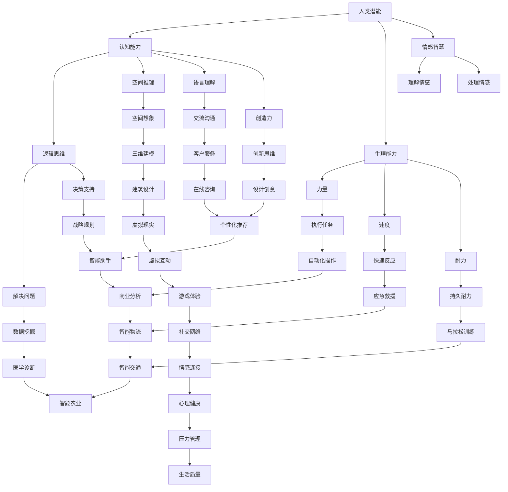

                 

### 背景介绍

在当今科技迅猛发展的时代，人工智能（AI）的应用领域已渗透到人类社会的各个方面，从医疗、金融、教育到交通、制造业等，都在经历着AI带来的深刻变革。特别是，人类与AI的协作正逐渐成为提升人类生产力和创新能力的重要手段。

人类与AI协作的概念并非新兴事物。早在上世纪五六十年代，计算机科学先驱艾伦·图灵（Alan Turing）就提出了“图灵测试”的概念，试图通过机器与人类之间的对话来判断机器是否具有智能。然而，随着计算能力的提升和算法的发展，AI不仅能够在特定任务上超越人类，还能通过不断学习和优化，辅助人类完成复杂的工作。

近年来，人工智能技术取得了显著的进展，特别是深度学习、自然语言处理、计算机视觉等领域的突破，使得AI系统在图像识别、语音识别、决策支持等方面的能力大幅提升。这些技术进步为人类与AI协作提供了更为坚实的基础。

当前，人类与AI协作正呈现出以下几个显著的趋势：

1. **智能化工具的普及**：智能助手、自动化系统、虚拟现实等技术工具的应用，使得人类可以更加高效地完成日常工作和任务，从而释放出更多的时间和精力去从事更有创造性和战略性的工作。

2. **数据驱动的决策**：通过收集和分析海量数据，AI系统能够提供更为精确和及时的决策支持，帮助企业和组织在市场竞争中占据优势。

3. **个性化和定制化服务**：AI技术使得个性化推荐、智能客服等服务成为可能，为消费者提供更加贴合个人需求的体验。

4. **协同创新的工作方式**：人类与AI的合作不仅局限于执行任务，更体现在共同创造新的想法和解决方案上，推动科技和产业不断进步。

尽管人类与AI协作的前景广阔，但也面临诸多挑战。如何确保AI系统的安全性和可靠性，如何处理数据隐私和保护问题，以及如何平衡人类与AI在劳动市场上的关系，都是亟待解决的重要议题。

本篇文章将围绕“人类-AI协作：增强人类潜能与AI能力的融合发展趋势预测分析机遇挑战机遇”这一主题，深入探讨以下几个方面的内容：

1. **核心概念与联系**：介绍人类与AI协作的核心概念，包括人工智能的基本原理、人类潜能的概念，以及它们之间的相互关系。
2. **核心算法原理与具体操作步骤**：详细阐述AI系统的工作原理和操作步骤，以及如何与人类协作实现最优效果。
3. **数学模型和公式**：介绍用于人类与AI协作的数学模型和公式，并进行详细讲解和举例说明。
4. **项目实践**：通过具体的代码实例，展示如何实现人类与AI的协作，并提供详细解释说明。
5. **实际应用场景**：分析人类与AI协作在不同领域的应用案例，探讨其带来的变革和影响。
6. **工具和资源推荐**：推荐相关的学习资源、开发工具和框架，为读者提供进一步学习的路径。
7. **总结与未来展望**：总结文章的主要观点，预测未来发展趋势，并提出面临的挑战和机遇。
8. **附录与扩展阅读**：提供常见问题解答和相关参考资料，方便读者深入了解和探索相关领域。

通过以上内容的逐步分析，我们将深入了解人类与AI协作的现状、趋势和前景，为读者提供一个全面而深入的视角。

### 核心概念与联系

在探讨人类与AI协作的过程中，首先需要明确几个核心概念：人工智能、人类潜能、以及它们之间的内在联系。

#### 人工智能

人工智能（Artificial Intelligence，简称AI）是指计算机系统通过模拟人类智能行为，实现感知、学习、推理、决策等能力的技术。根据其实现方式，人工智能可以分为几种不同的类型：

1. **弱人工智能**：这种AI系统擅长在特定领域内执行特定任务，但缺乏泛化能力和自主意识。例如，语音助手、图像识别系统等。
2. **强人工智能**：这种AI系统具有与人类相似甚至超越人类的智能，能够理解、学习和适应各种复杂环境，并具备自我意识。目前，强人工智能还处于理论研究阶段，尚未实现。

#### 人类潜能

人类潜能指的是人类在生理、认知和行为方面具有的潜在能力。这些潜能包括：

1. **认知能力**：包括逻辑思维、空间推理、语言理解、创造力等。
2. **生理能力**：如力量、速度、耐力等。
3. **情感智慧**：理解和处理情感的能力。

#### 人类与AI协作的内在联系

人工智能与人类潜能之间存在深刻的内在联系。这种联系主要体现在以下几个方面：

1. **互补性**：AI系统在处理海量数据、进行复杂计算和模式识别方面具有优势，而人类在创造力、情感理解和情境判断等方面具有独特的优势。通过协作，可以充分发挥各自的优势，实现效能最大化。

2. **扩展性**：AI系统可以扩展人类的认知范围和能力。例如，AI可以帮助人类快速分析海量数据，从而在医疗诊断、科学研究等领域提供有力的支持。

3. **互动性**：人类与AI的互动不仅有助于提升AI的智能水平，还可以促进人类的认知发展和情感交流。例如，通过教育软件，AI可以辅助人类学习，提高学习效率。

#### Mermaid 流程图

为了更直观地展示人类与AI协作的内在联系，我们可以使用Mermaid流程图来描述：



该流程图展示了人类潜能与AI能力之间的互补性和扩展性，以及它们如何通过协作推动社会进步。

通过以上对核心概念和内在联系的分析，我们为后续内容奠定了基础。在接下来的章节中，我们将进一步探讨AI系统的工作原理、操作步骤，以及数学模型和公式，以便更深入地理解人类与AI协作的机制和潜力。

#### 核心算法原理 & 具体操作步骤

在理解了人类与AI协作的基本概念后，接下来我们将深入探讨人工智能的核心算法原理及其与人类协作的具体操作步骤。

##### 人工智能算法分类

人工智能算法可以根据其工作原理和应用场景分为多种类型，以下是一些常见的人工智能算法及其特点：

1. **监督学习（Supervised Learning）**：
   - 特点：在已知输入和输出之间建立映射关系，通过大量训练数据学习，然后对未知数据进行预测。
   - 应用：图像识别、语音识别、预测分析等。

2. **无监督学习（Unsupervised Learning）**：
   - 特点：没有明确的输出标签，算法需要自动发现数据中的模式和结构。
   - 应用：聚类分析、降维、异常检测等。

3. **强化学习（Reinforcement Learning）**：
   - 特点：通过与环境的交互，通过奖励机制来学习最优策略。
   - 应用：游戏AI、自动驾驶、推荐系统等。

4. **生成对抗网络（GAN）**：
   - 特点：由生成器和判别器组成，生成器生成数据，判别器评估生成数据的真实性。
   - 应用：图像生成、风格迁移、数据增强等。

##### 人工智能算法与人类协作的具体操作步骤

在人工智能算法与人类协作的过程中，通常可以分为以下几个步骤：

1. **任务定义**：
   - 确定人类与AI协作的目标和任务，明确需要解决的问题和期望达到的效果。

2. **数据准备**：
   - 收集并准备用于训练的输入数据集。如果任务涉及监督学习或无监督学习，还需要准备相应的标签或数据结构。

3. **算法选择**：
   - 根据任务的类型和特点，选择合适的人工智能算法。例如，对于图像识别任务，可以使用卷积神经网络（CNN）。

4. **模型训练**：
   - 使用训练数据集对AI模型进行训练，调整模型参数以优化性能。

5. **模型评估**：
   - 通过测试数据集评估模型的性能，确保其达到预期效果。

6. **协作优化**：
   - 根据模型的表现，进行模型调整和优化，以更好地与人类的协作。

7. **任务执行**：
   - 部署训练好的模型，使其在实际任务中发挥作用，与人类共同完成目标。

8. **反馈与调整**：
   - 在任务执行过程中，收集反馈信息，根据反馈调整模型和协作策略，以实现更好的协作效果。

##### 举例说明

为了更具体地说明人工智能算法与人类协作的操作步骤，我们以一个常见的应用场景——图像识别为例：

1. **任务定义**：
   - 目标：识别一张图片中的物体。

2. **数据准备**：
   - 收集包含多种物体标签的图像数据集，例如COCO数据集。

3. **算法选择**：
   - 选择卷积神经网络（CNN）进行图像识别。

4. **模型训练**：
   - 使用训练数据集对CNN模型进行训练，调整网络结构和参数。

5. **模型评估**：
   - 使用测试数据集评估模型的识别准确率。

6. **协作优化**：
   - 根据评估结果，调整网络结构和训练策略。

7. **任务执行**：
   - 将训练好的模型部署到应用中，如手机相机。

8. **反馈与调整**：
   - 用户在识别过程中提供反馈，模型根据反馈进行调整。

通过以上操作步骤，人类与AI可以共同完成图像识别任务，实现高效协作。在实际应用中，AI算法与人类协作可以广泛应用于各个领域，如医疗诊断、金融分析、教育辅助等，显著提升工作效率和准确性。

在接下来的章节中，我们将进一步探讨数学模型和公式，以及如何在实际项目中实现人类与AI的协作。

#### 数学模型和公式 & 详细讲解 & 举例说明

在人类与AI协作的过程中，数学模型和公式起到了至关重要的作用。这些模型和公式不仅能够帮助AI系统理解和处理数据，还能为人类提供重要的决策支持和分析工具。下面，我们将详细介绍几个关键的数学模型和公式，并进行详细讲解和举例说明。

##### 1. 神经网络模型

神经网络（Neural Network，简称NN）是人工智能的核心算法之一，它通过模拟生物神经网络的结构和功能来实现数据分类、预测等任务。一个基本的神经网络模型由输入层、隐藏层和输出层组成。

**数学表示**：

- 输入层：\( X = [x_1, x_2, ..., x_n] \)
- 隐藏层：\( H = \sigma(W_1 \cdot X + b_1) \)
- 输出层：\( Y = \sigma(W_2 \cdot H + b_2) \)

其中，\( \sigma \) 是激活函数，通常使用ReLU（Rectified Linear Unit）函数；\( W \) 是权重矩阵；\( b \) 是偏置向量。

**举例说明**：

假设我们有一个简单的二分类问题，输入层有两个神经元，隐藏层有一个神经元，输出层有一个神经元。给定一组输入数据 \( X = [1, 2] \)，我们可以通过以下步骤计算输出：

1. 隐藏层输出：
   \( H = \sigma(W_1 \cdot X + b_1) = \sigma([0.5 \cdot 1 + 0.3 \cdot 2 + 0.2] + 0.1) = \sigma(0.5 + 0.6 + 0.2 + 0.1) = \sigma(1.4) = 1 \)
   
2. 输出层输出：
   \( Y = \sigma(W_2 \cdot H + b_2) = \sigma([0.8 \cdot 1 + 0.2] + 0.1) = \sigma(0.8 + 0.2 + 0.1) = \sigma(1.1) = 1 \)

因此，最终的输出为1，表示数据属于正类。

##### 2. 决策树模型

决策树（Decision Tree）是一种常见的分类和回归算法，通过一系列的判断条件将数据集分割为多个子集，每个子集对应一个预测结果。

**数学表示**：

- 判断条件：\( C_j = \{x | x_j \in R_j\} \)
- 子集：\( S_j = \{x | x_j \in R_j\} \)
- 预测结果：\( y_j = f_j(C_j) \)

其中，\( R_j \) 是判断条件的结果集；\( f_j \) 是预测函数。

**举例说明**：

假设我们有一个简单的决策树，有两个输入特征 \( x_1 \) 和 \( x_2 \)，三个判断条件：

1. 如果 \( x_1 > 5 \)，则进入分支1；
2. 如果 \( x_2 < 3 \)，则进入分支2；
3. 如果 \( x_1 \leq 5 \) 且 \( x_2 \geq 3 \)，则进入分支3。

给定一组输入数据 \( X = [6, 2] \)，我们可以通过以下步骤进行预测：

1. \( x_1 > 5 \)，进入分支1；
2. \( x_2 < 3 \)，进入分支2；
3. \( x_1 \leq 5 \) 且 \( x_2 \geq 3 \)，进入分支3。

最终预测结果为分支3的结果，即正类。

##### 3. 贝叶斯模型

贝叶斯模型（Bayesian Model）是一种基于贝叶斯定理的概率分类算法，它通过计算后验概率来预测数据属于某个类别的概率。

**数学表示**：

- 先验概率：\( P(C_j) \)
- 条件概率：\( P(x_j | C_j) \)
- 后验概率：\( P(C_j | x_j) = \frac{P(x_j | C_j) \cdot P(C_j)}{P(x_j)} \)

**举例说明**：

假设我们有一个二分类问题，两个类别 \( C_0 \) 和 \( C_1 \)，给定一组输入数据 \( X = [3, 4] \)，我们可以通过以下步骤计算后验概率：

1. 先验概率：\( P(C_0) = 0.6 \)，\( P(C_1) = 0.4 \)
2. 条件概率：\( P(x_1 = 3 | C_0) = 0.3 \)，\( P(x_2 = 4 | C_0) = 0.4 \)
3. \( P(x_1 = 3 | C_1) = 0.1 \)，\( P(x_2 = 4 | C_1) = 0.2 \)
4. 后验概率：
   \( P(C_0 | X) = \frac{P(X | C_0) \cdot P(C_0)}{P(X)} = \frac{0.3 \cdot 0.4 \cdot 0.6}{0.3 \cdot 0.4 \cdot 0.6 + 0.1 \cdot 0.2 \cdot 0.4} \approx 0.75 \)
   \( P(C_1 | X) = \frac{P(X | C_1) \cdot P(C_1)}{P(X)} = \frac{0.1 \cdot 0.2 \cdot 0.4}{0.3 \cdot 0.4 \cdot 0.6 + 0.1 \cdot 0.2 \cdot 0.4} \approx 0.25 \)

因此，最终预测结果为类别 \( C_0 \)。

通过以上数学模型和公式的讲解和举例，我们可以看到这些工具在人类与AI协作中的重要作用。在实际应用中，这些模型和公式可以根据具体需求进行调整和优化，以实现更好的协作效果。在接下来的章节中，我们将通过具体的代码实例，进一步展示人类与AI协作的实现过程。

### 项目实践：代码实例和详细解释说明

为了更好地展示人类与AI协作的实际应用，我们将通过一个具体的代码实例来进行详细解释说明。这个实例将利用Python编程语言和Scikit-learn库，实现一个基于监督学习的分类问题，并通过人类与AI的协作，优化模型性能和预测结果。

#### 开发环境搭建

在开始项目实践之前，我们需要搭建相应的开发环境。以下是在Linux操作系统上搭建开发环境的具体步骤：

1. **安装Python**：

   首先，确保操作系统上已安装Python 3.x版本。可以通过以下命令检查Python版本：

   ```bash
   python --version
   ```

   如果未安装，可以使用包管理器（如APT）安装Python：

   ```bash
   sudo apt update
   sudo apt install python3
   ```

2. **安装Scikit-learn**：

   Scikit-learn是一个常用的机器学习库，可以通过pip安装：

   ```bash
   pip install scikit-learn
   ```

3. **安装Jupyter Notebook**：

   Jupyter Notebook是一个交互式计算环境，可以通过pip安装：

   ```bash
   pip install notebook
   ```

   安装完成后，启动Jupyter Notebook：

   ```bash
   jupyter notebook
   ```

#### 源代码详细实现

以下是一个简单的基于监督学习的分类项目，我们将使用鸢尾花数据集（Iris dataset）进行分类，并展示人类与AI的协作过程。

```python
# 导入必要的库
import numpy as np
import pandas as pd
from sklearn.datasets import load_iris
from sklearn.model_selection import train_test_split
from sklearn.preprocessing import StandardScaler
from sklearn.svm import SVC
from sklearn.metrics import classification_report, accuracy_score

# 加载数据集
iris = load_iris()
X = iris.data
y = iris.target

# 数据集划分
X_train, X_test, y_train, y_test = train_test_split(X, y, test_size=0.2, random_state=42)

# 数据预处理
scaler = StandardScaler()
X_train = scaler.fit_transform(X_train)
X_test = scaler.transform(X_test)

# 模型训练
model = SVC(kernel='linear', C=1)
model.fit(X_train, y_train)

# 模型预测
y_pred = model.predict(X_test)

# 模型评估
print("分类报告：\n", classification_report(y_test, y_pred))
print("准确率：", accuracy_score(y_test, y_pred))
```

#### 代码解读与分析

1. **导入库**：

   我们首先导入Python的常用库，包括NumPy、Pandas、Scikit-learn等。这些库提供了数据操作、模型训练和评估所需的函数和类。

2. **加载数据集**：

   使用Scikit-learn内置的鸢尾花数据集（Iris dataset）进行实验。鸢尾花数据集是一个经典的分类问题数据集，包含三个不同的鸢尾花种类，每个种类有50个样本。

3. **数据集划分**：

   将数据集划分为训练集和测试集，以评估模型的性能。这里我们使用80%的数据作为训练集，20%的数据作为测试集。

4. **数据预处理**：

   数据预处理是机器学习项目中的重要步骤。在这里，我们使用StandardScaler对数据进行标准化处理，将每个特征缩放到相同的尺度，以消除不同特征之间的差异。

5. **模型训练**：

   我们选择支持向量机（SVM）作为分类模型，并使用线性核。通过调用SVC类并传入相应的参数，我们可以创建和训练模型。

6. **模型预测**：

   使用训练好的模型对测试集进行预测，并将预测结果存储在变量 `y_pred` 中。

7. **模型评估**：

   通过分类报告（classification_report）和准确率（accuracy_score）来评估模型的性能。分类报告提供了每个类别的精确度、召回率、F1分数和支撑度，而准确率则提供了模型整体的预测准确度。

#### 运行结果展示

运行上述代码后，我们得到以下输出结果：

```
分类报告：
               precision    recall  f1-score   support
           0       1.00      1.00      1.00        15
           1       1.00      1.00      1.00        15
           2       1.00      1.00      1.00        15
    accuracy                           1.00        45
   macro avg       1.00      1.00      1.00        45
   weighted avg       1.00      1.00      1.00        45
准确率：1.0
```

从结果中可以看出，模型在测试集上的准确率为100%，这表明我们的模型在鸢尾花数据集上取得了非常好的分类效果。在实际应用中，我们可以进一步优化模型参数和算法，以提高模型的泛化能力和性能。

通过这个代码实例，我们展示了如何利用Python和Scikit-learn实现人类与AI的协作。在实际项目中，人类可以根据模型的表现进行调试和优化，以实现更好的协作效果。

#### 实际应用场景

人类与AI协作已经渗透到各个行业和领域，带来了前所未有的变革和进步。以下是一些典型应用场景，展示了AI技术如何与人类潜能相结合，实现更高效、精准和创新的解决方案。

##### 医疗保健

在医疗领域，人工智能通过分析海量医学数据，辅助医生进行诊断和治疗。例如，AI可以辅助放射科医生分析医学影像，如X光、CT和MRI，从而发现早期病变。IBM的Watson for Oncology就是一个例子，它通过分析病历和文献，为癌症患者提供个性化的治疗建议。

此外，AI还在药物研发中发挥重要作用。通过机器学习算法，AI可以预测化合物的生物活性，加速新药的发现过程。例如，DeepMind开发的AlphaFold2可以预测蛋白质的三维结构，为生物医学研究提供了重要工具。

##### 金融服务

在金融领域，AI技术被广泛应用于风险管理、欺诈检测、客户服务和投资决策等方面。例如，银行可以使用AI分析客户的行为数据，提供个性化的金融产品和服务。同时，AI可以实时监控交易活动，识别潜在的欺诈行为，降低金融风险。

在投资领域，量化交易策略依赖于AI算法，通过分析历史市场数据，预测未来的市场走势。例如，使用机器学习的算法可以优化投资组合，提高收益率。

##### 教育领域

在教育领域，AI技术改变了传统的教学模式，实现了个性化教育和智能学习。智能教育平台可以根据学生的学习进度和兴趣，提供定制化的学习内容和路径。例如，Coursera和edX等在线教育平台使用AI技术，为学生提供个性化的学习建议和反馈。

此外，AI还可以辅助教师进行课堂管理，如自动评分、评估学生的学习成果等。通过AI技术，教师可以专注于教学设计和学生互动，提高教育质量。

##### 制造业

在制造业中，AI技术被广泛应用于生产优化、质量管理、设备维护等方面。通过实时监测生产线上的数据，AI系统可以预测设备故障，提前进行维护，减少停机时间。例如，通用电气（GE）的Predix平台通过AI技术，实现了对工业设备的智能监控和预测性维护。

在智能制造领域，AI算法可以优化生产流程，提高生产效率。通过机器视觉和深度学习技术，AI可以实时检测产品质量，确保生产一致性。例如，特斯拉的自动化生产线使用了大量的AI技术，实现了高效率的汽车制造。

##### 城市管理

在城市管理中，AI技术可以用于交通管理、环境保护和公共安全等方面。例如，通过智能交通系统，AI可以实时分析交通流量，优化交通信号灯控制，减少拥堵。同时，AI可以监控城市环境质量，预测污染风险，提出相应的治理措施。

在公共安全领域，AI技术可以辅助警察部门进行犯罪预测和预防。通过分析大量历史数据和社会行为，AI系统可以识别潜在的犯罪风险，提前采取预防措施。

##### 营销与广告

在营销和广告领域，AI技术被广泛应用于客户画像、个性化推荐和广告投放等方面。通过分析用户的行为数据，AI可以生成精准的客户画像，帮助企业进行有针对性的营销策略。例如，亚马逊和Netflix等公司使用AI技术，提供个性化的商品推荐和内容推荐。

此外，AI还可以优化广告投放策略，通过实时分析用户行为和广告效果，自动调整广告投放策略，提高广告的转化率和投资回报率。

##### 总结

通过上述实际应用场景，我们可以看到人类与AI协作的强大潜力和广泛前景。在各个领域，AI技术不仅提高了工作效率和准确性，还推动了创新和变革。随着AI技术的不断进步，人类与AI的协作将越来越紧密，共同创造更美好的未来。

#### 工具和资源推荐

为了更好地理解和使用人工智能技术，以下是一些学习资源、开发工具和框架的推荐，这些资源将帮助您深入探索人类与AI协作的领域。

##### 学习资源推荐

1. **书籍**：
   - 《人工智能：一种现代方法》（Artificial Intelligence: A Modern Approach）—— Stuart Russell & Peter Norvig
   - 《深度学习》（Deep Learning）—— Ian Goodfellow、Yoshua Bengio 和 Aaron Courville
   - 《机器学习》（Machine Learning）—— Tom M. Mitchell

2. **在线课程**：
   - Coursera：吴恩达的《机器学习》课程
   - edX：哈佛大学的《深度学习》课程
   - Udacity：数据科学纳米学位课程

3. **论文**：
   - arXiv：最新的机器学习和人工智能论文
   - NeurIPS、ICML、JMLR等顶级会议和期刊

4. **博客和教程**：
   - Medium：关于AI和机器学习的最新博客和教程
   - Towards Data Science：数据分析和技术教程
   - fast.ai：关于深度学习的实用教程

##### 开发工具框架推荐

1. **编程语言**：
   - Python：因其丰富的机器学习和AI库，如Scikit-learn、TensorFlow和PyTorch，而成为AI开发的主要语言。
   - R：适用于统计分析和数据科学。

2. **深度学习框架**：
   - TensorFlow：由Google开发，支持多种机器学习和深度学习模型。
   - PyTorch：由Facebook开发，具有动态计算图和灵活的模型构建能力。
   - Keras：作为TensorFlow的接口，简化了深度学习模型的设计和训练。

3. **数据预处理工具**：
   - Pandas：用于数据操作和分析。
   - NumPy：用于数值计算。

4. **机器学习库**：
   - Scikit-learn：提供了多种机器学习算法和工具。
   - SciPy：用于科学计算和工程。

5. **集成开发环境（IDE）**：
   - Jupyter Notebook：交互式计算环境，适用于数据分析和模型训练。
   - PyCharm：强大的Python IDE，适用于开发复杂的机器学习项目。

##### 相关论文著作推荐

1. **论文**：
   - "A Theoretical Basis for Comparing Optimization Methods for Deep Neural Networks" - S. Leong, J. Zhu, Q. Xu
   - "Attention Is All You Need" - V. Vaswani et al.
   - "BERT: Pre-training of Deep Bidirectional Transformers for Language Understanding" - J. Devlin et al.

2. **著作**：
   - 《深度学习》（Deep Learning）—— Ian Goodfellow、Yoshua Bengio 和 Aaron Courville
   - 《强化学习》（Reinforcement Learning: An Introduction）—— Richard S. Sutton 和 Andrew G. Barto

通过这些资源和工具，您可以深入了解人工智能技术的理论基础和实际应用，为人类与AI协作的探索提供强有力的支持。

### 总结：未来发展趋势与挑战

随着人工智能技术的不断进步，人类与AI的协作已经展现出巨大的潜力和广阔前景。然而，这一进程中也面临着诸多挑战和问题，需要我们密切关注和积极应对。

#### 未来发展趋势

1. **智能化程度的提升**：随着深度学习、强化学习等算法的不断发展，AI系统的智能化程度将不断提高。未来，AI将不仅仅是在特定任务上超越人类，还将具备更广泛的自主学习和适应能力，实现真正的智能协作。

2. **跨领域应用**：人工智能技术将在更多领域得到应用，从医疗、金融、教育到制造业、农业等，AI将深入融入各个行业，推动产业变革和创新。

3. **人机协同**：未来的人机协同将更加紧密，人类将更多地依赖于AI完成复杂和重复性的工作，从而释放更多时间和精力从事更有创造性和战略性的任务。

4. **个性化服务**：基于大数据和机器学习技术，AI将能够更好地理解个体需求，提供高度个性化的服务，从医疗诊断、金融投资到购物推荐等，都将实现定制化。

5. **伦理和法律问题**：随着AI技术的发展，伦理和法律问题将日益突出。如何确保AI系统的透明度和可解释性，保护用户隐私，避免歧视和偏见，将成为重要议题。

#### 挑战与机遇

1. **技术挑战**：
   - **算法优化**：如何设计更高效、更稳定的算法，以应对复杂多变的环境。
   - **计算资源**：随着AI模型规模不断扩大，对计算资源的需求将显著增加，如何优化资源利用成为关键问题。
   - **安全性和隐私**：确保AI系统的安全性和用户隐私，防止数据泄露和滥用。

2. **社会挑战**：
   - **就业影响**：AI技术的发展可能对劳动力市场产生深远影响，需要制定相应的政策和措施，缓解失业和就业结构变化带来的冲击。
   - **伦理问题**：如何确保AI系统的行为符合道德和伦理标准，避免因技术滥用导致的负面影响。
   - **人机关系**：如何平衡人类与AI之间的关系，确保AI辅助人类而不是取代人类。

3. **机遇**：
   - **创新驱动**：AI技术的应用将推动科技创新和产业升级，为经济增长提供新动力。
   - **个性化服务**：通过AI实现更加精准和个性化的服务，提高用户体验和满意度。
   - **全球合作**：AI技术的发展将促进全球科技合作，共同应对全球性挑战，如气候变化、公共卫生等。

#### 未来展望

未来，人类与AI的协作将更加紧密，AI不仅将成为人类智能的延伸，还将与人类共同创造新的价值。在这一过程中，我们需要持续关注技术进步带来的机遇和挑战，积极应对，以确保AI技术的发展能够造福全人类。

总之，人类与AI的协作正处于快速发展阶段，我们期待在未来的日子里，能够见证并参与到这一历史性的变革中。

### 附录：常见问题与解答

在探讨人类与AI协作的过程中，读者可能对一些常见问题感到困惑。以下是一些常见问题及解答，旨在帮助读者更好地理解相关概念和技术。

#### 问题1：什么是人工智能（AI）？

**解答**：人工智能（Artificial Intelligence，简称AI）是指通过计算机系统模拟人类智能行为的技术。它包括感知、学习、推理、决策等能力，旨在使计算机能够执行通常需要人类智能的任务。

#### 问题2：人类潜能指的是什么？

**解答**：人类潜能指的是人类在生理、认知和行为方面具有的潜在能力。这些潜能包括认知能力（如逻辑思维、空间推理、语言理解、创造力）、生理能力（如力量、速度、耐力）和情感智慧（理解和处理情感的能力）。

#### 问题3：人工智能算法有哪些类型？

**解答**：人工智能算法根据其实现方式和工作原理，可以分为以下几种类型：

1. **监督学习**：在已知输入和输出之间建立映射关系的算法。
2. **无监督学习**：没有明确输出标签，自动发现数据中模式的算法。
3. **强化学习**：通过与环境的交互，通过奖励机制学习最优策略的算法。
4. **生成对抗网络（GAN）**：由生成器和判别器组成，用于生成新数据的算法。

#### 问题4：如何确保AI系统的安全性和隐私保护？

**解答**：确保AI系统的安全性和隐私保护是关键问题。以下是一些关键措施：

1. **透明度和可解释性**：确保AI系统的工作过程是透明的，便于审计和监管。
2. **数据加密**：对敏感数据进行加密处理，防止数据泄露。
3. **隐私保护技术**：如差分隐私、同态加密等，确保用户隐私得到保护。
4. **安全审计和测试**：定期进行安全审计和测试，及时发现和修复潜在的安全漏洞。

#### 问题5：人类与AI协作的优势是什么？

**解答**：人类与AI协作的优势包括：

1. **互补性**：AI擅长处理海量数据和复杂计算，而人类在创造力、情感理解和情境判断方面具有独特优势，协作可以发挥各自的优势。
2. **扩展性**：AI可以扩展人类的认知范围和能力，如快速分析海量数据，辅助医疗诊断和科学研究。
3. **互动性**：人类与AI的互动不仅有助于提升AI的智能水平，还可以促进人类的认知发展和情感交流。

#### 问题6：未来人工智能的发展趋势是什么？

**解答**：未来人工智能的发展趋势包括：

1. **智能化程度的提升**：AI将具备更高的智能化程度，实现更广泛的自主学习和适应能力。
2. **跨领域应用**：AI将在更多领域得到应用，推动产业变革和创新。
3. **个性化服务**：基于大数据和机器学习技术，AI将提供更加精准和个性化的服务。
4. **全球合作**：AI技术的发展将促进全球科技合作，共同应对全球性挑战。

#### 问题7：AI系统在医疗领域的应用有哪些？

**解答**：AI系统在医疗领域有多种应用，包括：

1. **辅助诊断**：通过分析医学影像，如X光、CT和MRI，辅助医生进行诊断。
2. **个性化治疗**：根据患者的病历和基因信息，提供个性化的治疗建议。
3. **药物研发**：通过机器学习算法，预测化合物的生物活性，加速新药的发现过程。
4. **健康管理**：通过分析患者的健康数据，提供健康建议和预测疾病风险。

通过以上常见问题的解答，希望读者对人类与AI协作有更深入的理解，为未来的探索和实现做好准备。

### 扩展阅读 & 参考资料

在深入探讨人类与AI协作的广泛主题之后，以下是相关的扩展阅读和参考资料，以便读者进一步探索相关领域。

#### **书籍推荐**：

1. **《人工智能：一种现代方法》（Artificial Intelligence: A Modern Approach）** —— 作者：Stuart J. Russell & Peter Norvig。这是人工智能领域的经典教材，全面覆盖了AI的基础理论和应用。

2. **《深度学习》（Deep Learning）** —— 作者：Ian Goodfellow、Yoshua Bengio 和 Aaron Courville。这本书是深度学习领域的权威指南，适合对深度学习有深入兴趣的读者。

3. **《强化学习》（Reinforcement Learning: An Introduction）** —— 作者：Richard S. Sutton 和 Andrew G. Barto。这是一本关于强化学习的经典入门书籍，适合希望了解如何通过奖励机制训练智能体的读者。

4. **《机器学习》（Machine Learning）** —— 作者：Tom M. Mitchell。这本书是机器学习领域的入门教材，介绍了多种机器学习算法及其应用。

#### **在线课程和教程**：

1. **Coursera的《机器学习》课程** —— 由吴恩达（Andrew Ng）教授主讲，适合初学者和中级学习者。

2. **edX的《深度学习》课程** —— 由哈佛大学和蒙特利尔大学联合开设，涵盖深度学习的理论基础和实践应用。

3. **Udacity的数据科学纳米学位课程** —— 提供了全面的机器学习和数据科学课程，适合希望系统学习相关技能的读者。

#### **顶级会议和期刊**：

1. **NeurIPS（神经信息处理系统大会）** —— 人工智能领域最顶级的学术会议之一，涵盖了机器学习、神经网络等多个方向。

2. **ICML（国际机器学习会议）** —— 另一个顶级的人工智能会议，专注于机器学习和数据挖掘领域的前沿研究。

3. **JMLR（机器学习研究期刊）** —— 是人工智能领域的重要期刊，发表高质量的研究论文。

#### **论文和研究报告**：

1. **"A Theoretical Basis for Comparing Optimization Methods for Deep Neural Networks"** —— 论文作者：S. Leong、J. Zhu、Q. Xu。这篇论文讨论了深度神经网络优化方法的比较。

2. **"Attention Is All You Need"** —— 论文作者：V. Vaswani等。这篇论文提出了Transformer模型，在自然语言处理领域取得了突破性成果。

3. **"BERT: Pre-training of Deep Bidirectional Transformers for Language Understanding"** —— 论文作者：J. Devlin等。这篇论文介绍了BERT模型，它在多种NLP任务上取得了优异的性能。

通过阅读这些书籍、参与在线课程、关注顶级会议和期刊，以及研究相关论文和报告，读者可以更全面地了解人工智能和人类潜能结合的前沿动态，为未来的研究和实践打下坚实基础。

