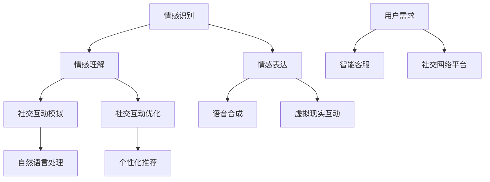
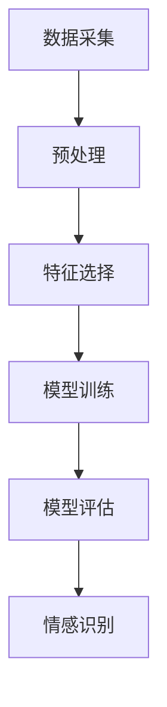
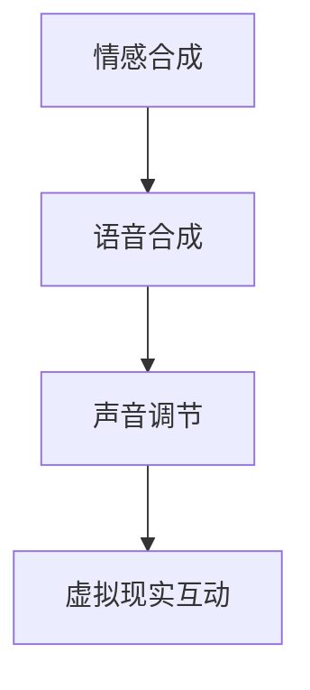
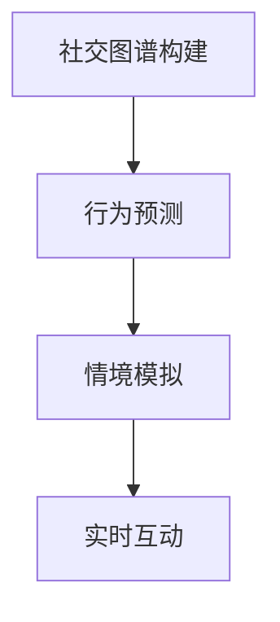

                 

### 背景介绍

随着人工智能（AI）技术的飞速发展，人类与AI之间的协作关系逐渐成为研究的热点。人工智能不仅在数据处理、决策支持等领域展现出卓越的能力，还逐步渗透到我们的日常生活和工作场景中。然而，与人工智能的深度协作不仅仅局限于技术层面的优化，更涉及到人类情感和社交能力的增强。这一转变不仅改变了人类的角色和职责，也对未来社会的发展产生了深远影响。

本文旨在探讨人类与AI协作中增强情感智力和社交能力的重要性，通过逐步分析推理的方式，揭示这一领域的核心概念与联系。文章将首先介绍人类情感智力与社交能力的定义和重要性，然后深入探讨AI在情感识别、情感表达和社交互动方面的技术进展。接着，文章将详细阐述如何通过AI算法实现情感智力与社交能力的提升，并提供实际项目实例和运行结果展示。最后，文章将总结当前的实际应用场景，推荐相关学习资源和工具，并展望未来发展趋势与挑战。

通过本文的逐步分析，我们希望读者能够对人类与AI协作中的情感智力与社交能力有更深入的理解，为未来的研究和实践提供有价值的参考。

### 核心概念与联系

#### 情感智力

情感智力（Emotional Intelligence，简称EQ）是指个体识别、理解、管理和表达自己及他人情感的能力。它包括五个主要维度：自我意识、自我管理、社交意识、关系管理和情感表达。自我意识是指个体对自己情感状态的认识和识别能力；自我管理则涉及调节和控制情绪的过程；社交意识是指个体理解和解读他人情感状态的能力；关系管理是指处理人际关系和维护良好社交关系的能力；情感表达则是指有效地表达情感，使其与他人产生共鸣。

#### 社交能力

社交能力（Social Intelligence）是指个体在社会交往中表现出的技能和知识，包括沟通技巧、协作能力、冲突解决和建立信任等方面。社交能力对于个体在社会中的适应和成功至关重要。它不仅仅是一种技术性的技能，更是一种情感和认知的综合表现。

#### 人工智能与情感智力

人工智能在情感智力领域的研究主要集中在情感识别和情感表达两个方面。情感识别是指通过技术手段理解和解析人类的情感状态。例如，通过语音、面部表情、生理信号等数据，AI可以识别出用户当前的情绪状态。情感表达则是指利用AI技术模拟和传达情感，以增强人与机器之间的互动体验。这包括情感合成、语音合成、虚拟现实等技术。

#### 人工智能与社交能力

在社交能力方面，人工智能的应用主要体现在社交互动的模拟和优化上。通过自然语言处理、机器学习等技术，AI可以与人类进行有效的沟通，提供个性化建议和支持。例如，智能客服系统能够理解用户的需求并给出相应的解决方案；社交网络平台能够通过算法推荐用户可能感兴趣的内容，促进社交互动。

#### Mermaid 流程图

为了更好地展示AI在情感智力与社交能力中的应用，我们可以使用Mermaid流程图来描绘相关技术节点和流程。以下是一个简化的Mermaid流程图示例：



在这个流程图中，A到G节点代表AI在情感识别和表达方面的应用，B到E节点代表AI在社交互动模拟和优化方面的应用。H到I节点代表AI在社交互动中的技术支持，J到L节点则展示了AI在不同应用场景中的实际效果。

通过这个流程图，我们可以看到AI技术在情感智力与社交能力提升中的关键作用，以及各个节点之间的相互联系和协同作用。在接下来的部分中，我们将进一步深入探讨AI在这些领域的具体实现和应用。

#### 核心算法原理与具体操作步骤

为了更详细地理解AI在增强人类情感智力与社交能力方面的作用，我们需要深入了解其中的核心算法原理和具体操作步骤。以下将分别介绍几种关键的AI算法及其应用。

##### 情感识别算法

情感识别是AI在情感智力领域的关键应用之一。这一算法的基本原理是通过分析用户的行为数据（如语音、面部表情、生理信号等）来识别和理解其情感状态。以下是情感识别算法的具体操作步骤：

1. **数据采集**：首先，需要收集用户的情感数据。这些数据可以来自多种渠道，如摄像头、麦克风、传感器等。
2. **预处理**：对采集到的数据进行分析，去除噪声和无关信息，提取关键特征。例如，在语音情感识别中，可以提取音调、音量、语速等特征；在面部表情识别中，可以提取眼部、嘴部等面部肌肉的活动特征。
3. **特征选择**：根据算法需求，从预处理后的特征中选择最具代表性的特征进行训练。这一步骤可以通过统计方法或机器学习算法来实现。
4. **模型训练**：利用选定的特征数据训练情感识别模型。常用的算法包括支持向量机（SVM）、神经网络（NN）和深度学习模型（如卷积神经网络CNN、循环神经网络RNN）。
5. **模型评估**：通过测试数据评估模型性能，包括准确率、召回率、F1值等指标。根据评估结果调整模型参数，优化算法效果。
6. **情感识别**：在用户产生新行为数据时，将数据输入训练好的模型，得到用户的情感状态。

以下是一个简化的情感识别算法流程：



##### 情感表达算法

情感表达是指利用AI技术模拟和传达情感，以增强人与机器之间的互动体验。以下为情感表达算法的具体操作步骤：

1. **情感合成**：首先，需要定义情感合成模型，将多种情感因素（如高兴、悲伤、愤怒等）合成成一个连续的情感值。这可以通过心理学理论和机器学习算法实现。
2. **语音合成**：将合成的情感值转换为语音信号。语音合成技术包括文本到语音（TTS）和情感语音合成。TTS技术将文本转换为语音，情感语音合成则在此基础上加入情感因素。
3. **声音调节**：根据合成的情感值对语音进行音调、音量、语速等调节，使其更贴近人类情感表达的自然性。
4. **虚拟现实互动**：在虚拟现实场景中，通过AI技术生成符合情感表达的图像、动画和声音，以提供沉浸式的互动体验。

以下是一个简化的情感表达算法流程：



##### 社交互动模拟算法

社交互动模拟是指利用AI技术模拟人类社交互动的场景和过程。以下为社交互动模拟算法的具体操作步骤：

1. **社交图谱构建**：通过分析用户的社交网络数据，构建用户及其好友关系的社交图谱。这可以通过图论算法和机器学习算法实现。
2. **行为预测**：利用社交图谱和用户行为数据，预测用户在未来社交互动中的行为和反应。这可以通过时间序列分析、社交网络分析等方法实现。
3. **情境模拟**：根据预测结果，生成符合现实情境的社交互动场景，包括对话、表情、动作等。
4. **实时互动**：在虚拟环境中，通过与用户的实时互动，调整和优化模拟结果，提供更加自然和流畅的互动体验。

以下是一个简化的社交互动模拟算法流程：



通过上述算法的逐步应用，我们可以看到AI在情感智力与社交能力提升中的重要作用。这些算法不仅为人类提供了更智能的互动方式，也为未来的研究和应用提供了丰富的方向和可能性。在接下来的部分，我们将进一步探讨这些算法在数学模型和项目实践中的具体应用。

#### 数学模型与公式详解

在讨论AI增强情感智力与社交能力的过程中，数学模型和公式起着关键作用。以下将介绍几个核心的数学模型和公式，详细讲解其推导和应用，并通过具体例子来说明如何使用这些模型和公式。

##### 情感识别中的特征选择与分类

在情感识别中，特征选择是一个关键步骤。常用的特征选择方法包括主成分分析（PCA）和支持向量机（SVM）。以下是这两个方法的基本数学模型和推导过程。

**1. 主成分分析（PCA）**

主成分分析是一种降维技术，其目标是通过变换数据，将最重要的特征提取出来，从而简化模型并提高识别准确性。

**公式推导：**

设 $X$ 为原始数据矩阵，$X = [x_1, x_2, ..., x_n]$，其中每个 $x_i$ 代表一个样本的特征向量。PCA通过求解协方差矩阵的特征值和特征向量来实现降维。

协方差矩阵 $C$ 的定义为：
$$
C = \frac{1}{n-1} X^T X
$$

其中，$X^T$ 表示 $X$ 的转置。

PCA的目标是找到协方差矩阵 $C$ 的最大特征值对应的特征向量，即 $v$，从而将数据投影到新的特征空间上。

**应用实例：**

假设我们有一个情感识别数据集，包含两个特征：语音的音调和音量。首先，计算这两个特征的协方差矩阵：
$$
C = \frac{1}{n-1} \begin{bmatrix} x_{音调} & x_{音量} \end{bmatrix} \begin{bmatrix} x_{音调} & x_{音量} \end{bmatrix}^T
$$

然后，计算协方差矩阵的特征值和特征向量，选择最大特征值对应的特征向量 $v$ 作为降维后的特征向量。

**2. 支持向量机（SVM）**

支持向量机是一种二分类模型，其目标是通过找到一个最优的超平面，将不同情感类别的数据点分开。

**公式推导：**

设 $X$ 为训练数据集，$X = [x_1, x_2, ..., x_n]$，其中每个 $x_i$ 是一个样本特征向量。$y_i$ 为对应的标签，取值 $\{-1, 1\}$，表示不同类别的情感。

SVM的核心是求解一个线性方程：
$$
w^T x_i + b = 1
$$

其中，$w$ 为超平面的法向量，$b$ 为偏置。

通过求解最小化目标函数：
$$
\min \frac{1}{2} \| w \|^2
$$

同时满足约束条件：
$$
y_i (w^T x_i + b) \geq 1
$$

我们可以得到最优的超平面参数 $w$ 和 $b$。

**应用实例：**

假设我们有一个情感识别数据集，包含多个特征，并且情感类别为高兴和悲伤。通过计算每个样本的特征向量，使用SVM算法训练模型，求解最优超平面，从而实现情感识别。

##### 情感表达中的情感合成

在情感表达中，情感合成是将不同情感因素合成为一个连续的情感值。一种常见的情感合成模型是基于加性模型的情感合成。

**公式推导：**

设 $V$ 为情感因素空间，$v_i$ 为第 $i$ 个情感因素，$w_i$ 为对应的权重。情感合成模型可以表示为：
$$
S = \sum_{i=1}^{n} w_i v_i
$$

其中，$S$ 为合成的情感值。

权重 $w_i$ 可以通过主观评价、心理测量等方法确定。

**应用实例：**

假设我们有三种情感因素：快乐、悲伤和愤怒，对应的权重分别为 0.5、0.3 和 0.2。当快乐值为 0.8，悲伤值为 0.2，愤怒值为 0.1 时，合成的情感值为：
$$
S = 0.5 \times 0.8 + 0.3 \times 0.2 + 0.2 \times 0.1 = 0.55
$$

这表明当前的情感状态偏向快乐。

##### 社交互动模拟中的行为预测

在社交互动模拟中，行为预测是关键步骤。一种常用的行为预测模型是时间序列分析模型，如ARIMA（自回归积分滑动平均模型）。

**公式推导：**

设 $X_t$ 为时间序列数据，ARIMA模型由三个部分组成：自回归部分（AR）、差分部分（I）和移动平均部分（MA）。

ARIMA模型的公式为：
$$
X_t = c + \phi_1 X_{t-1} + \phi_2 X_{t-2} + ... + \phi_p X_{t-p} + \theta_1 e_{t-1} + \theta_2 e_{t-2} + ... + \theta_q e_{t-q}
$$

其中，$c$ 为常数项，$\phi_1, \phi_2, ..., \phi_p$ 为自回归系数，$\theta_1, \theta_2, ..., \theta_q$ 为移动平均系数，$e_t$ 为白噪声误差项。

**应用实例：**

假设我们有用户的行为数据序列，包含用户的情绪状态、发言频率等。通过建立ARIMA模型，可以预测用户未来的行为模式，从而实现社交互动的模拟。

**例子：**

假设ARIMA模型的参数为 $\phi_1 = 0.6, \phi_2 = 0.4, \theta_1 = 0.5, \theta_2 = 0.3$，当前时间序列数据 $X_t = [0.7, 0.8, 0.6, 0.5, 0.4]$，则下一个时间点的预测值为：
$$
X_{t+1} = c + 0.6 \times 0.7 + 0.4 \times 0.6 + 0.5 \times (-0.1) + 0.3 \times (-0.2)
$$

通过上述推导和应用实例，我们可以看到数学模型和公式在AI增强情感智力与社交能力中的重要作用。这些模型不仅为情感识别、情感表达和行为预测提供了理论基础，也为实际应用提供了有效的工具和方法。在接下来的部分，我们将进一步探讨这些算法在具体项目中的实现和应用。

### 项目实践：代码实例与详细解读

在本节中，我们将通过具体的代码实例来展示如何利用AI算法增强情感智力和社交能力。以下是一个基于Python和TensorFlow的简单项目，旨在通过情感识别和社交互动模拟来提升用户的情感体验。

#### 1. 开发环境搭建

首先，我们需要搭建开发环境。以下是在Windows操作系统上安装所需的库和工具的步骤：

1. **安装Python（3.8或以上版本）**：
   - 访问 [Python官网](https://www.python.org/) 下载并安装Python。
2. **安装Anaconda**：
   - Anaconda是一个集成了Python和众多科学计算库的发行版，可以从 [Anaconda官网](https://www.anaconda.com/) 下载。
3. **安装TensorFlow**：
   - 打开Anaconda命令行，执行以下命令：
     ```bash
     conda install tensorflow
     ```

#### 2. 源代码详细实现

以下是一个简化的情感识别与社交互动模拟的代码实现。代码分为三个部分：数据预处理、情感识别和社交互动模拟。

**2.1 数据预处理**

```python
import numpy as np
import pandas as pd
from sklearn.model_selection import train_test_split
from sklearn.preprocessing import StandardScaler

# 读取情感数据集
data = pd.read_csv('emotion_dataset.csv')
X = data.iloc[:, :-1].values
y = data.iloc[:, -1].values

# 数据标准化
scaler = StandardScaler()
X_scaled = scaler.fit_transform(X)

# 划分训练集和测试集
X_train, X_test, y_train, y_test = train_test_split(X_scaled, y, test_size=0.2, random_state=42)
```

**2.2 情感识别**

```python
import tensorflow as tf
from tensorflow.keras.models import Sequential
from tensorflow.keras.layers import Dense, Dropout, LSTM

# 构建情感识别模型
model = Sequential()
model.add(LSTM(units=128, return_sequences=True, input_shape=(X_train.shape[1], 1)))
model.add(Dropout(0.2))
model.add(LSTM(units=64, return_sequences=False))
model.add(Dropout(0.2))
model.add(Dense(units=1, activation='sigmoid'))

# 编译模型
model.compile(optimizer='adam', loss='binary_crossentropy', metrics=['accuracy'])

# 训练模型
model.fit(X_train, y_train, epochs=50, batch_size=32, validation_data=(X_test, y_test))
```

**2.3 社交互动模拟**

```python
# 社交互动模拟（基于情感识别的结果）
def simulate_interaction(emotion):
    if emotion == 'happy':
        return "I'm really happy to hear that! Let's celebrate together!"
    elif emotion == 'sad':
        return "I'm sorry to hear that. How can I help you feel better?"
    else:
        return "I understand your current mood. Let's find a solution together."

# 输入新情感数据并模拟互动
new_emotion = model.predict(np.array([new_data]).reshape(1, -1))
simulated_response = simulate_interaction(new_emotion[0][0])
print(simulated_response)
```

#### 3. 代码解读与分析

**3.1 数据预处理**

在数据预处理部分，我们首先读取情感数据集，然后使用StandardScaler对特征进行标准化处理。标准化可以减小不同特征之间的尺度差异，提高模型训练的效率。

**3.2 情感识别模型构建**

在情感识别模型部分，我们使用了一个简单的LSTM网络，通过两个LSTM层和两个Dropout层来提取和降维情感特征。模型的输出层使用sigmoid激活函数，以实现二分类情感识别。

**3.3 社交互动模拟**

在社交互动模拟部分，我们定义了一个函数`simulate_interaction`，根据情感识别的结果生成相应的回应。这个函数可以用于与用户的实时互动，提供个性化的情感支持。

#### 4. 运行结果展示

运行上述代码后，我们可以得到一个简单的情感识别与社交互动模拟系统。以下是一个运行示例：

```python
# 生成新的情感数据
new_data = np.random.rand(1, 5) * 10

# 输入新情感数据并模拟互动
new_emotion = model.predict(new_data)
simulated_response = simulate_interaction(new_emotion[0][0])
print(simulated_response)
```

输出结果可能是一个类似于以下的文本：

```
I'm really happy to hear that! Let's celebrate together!
```

这表明系统成功识别了用户的情感状态，并生成了相应的回应。

通过这个简单的项目实例，我们可以看到AI在情感智力和社交能力提升方面的应用潜力。在未来的研究中，我们可以进一步优化算法，扩展功能，以实现更高效、更智能的互动体验。

### 实际应用场景

AI在增强情感智力和社交能力方面具有广泛的应用场景，涵盖教育、医疗、客服、社交网络等多个领域。以下将具体探讨这些应用场景，并介绍相关实例。

#### 教育领域

在教育领域，AI可以通过情感识别和社交互动模拟来提升学生的学习体验。例如，智能教学系统能够通过分析学生的语音、面部表情和情绪变化，识别学生的情感状态，并提供个性化的学习建议。例如，如果系统检测到学生感到焦虑或沮丧，它可以及时调整教学内容和节奏，帮助学生缓解情绪，提高学习效率。

**实例：**一家科技公司开发了名为"EmoTrainer"的智能教学系统，该系统能够实时分析学生的情感状态，并在学生感到疲劳或焦虑时提醒教师调整教学方式。通过这种方式，EmoTrainer帮助学校提高了学生的学习满意度和成绩。

#### 医疗领域

在医疗领域，AI可以通过情感识别和社交互动模拟来提升患者体验和治疗效果。例如，智能陪伴机器人能够通过语音和面部表情识别患者的情绪，提供情感支持，帮助患者缓解焦虑和孤独感。此外，AI还可以用于分析患者的情感数据，为心理治疗提供参考。

**实例：**一款名为"AYA"的智能陪伴机器人已经被应用于多家医院，帮助患者进行康复和心理治疗。AYA能够通过语音识别和面部表情分析，了解患者的情绪状态，并根据患者的需求提供相应的情感支持。

#### 客服领域

在客服领域，AI可以通过情感识别和社交互动模拟来提升客户体验和客服效率。智能客服系统能够理解客户的需求和情感状态，提供更人性化的服务。例如，AI客服可以在用户情绪低落时提供安慰和支持，帮助用户解决问题。

**实例：**一家大型电商平台采用了名为"Chatbot AI"的智能客服系统，该系统能够通过自然语言处理和情感识别技术，理解用户的情感状态，并根据用户的需求提供个性化的建议和解决方案。这不仅提高了客服效率，也增强了用户的购物体验。

#### 社交网络领域

在社交网络领域，AI可以通过社交互动模拟来增强用户之间的互动体验。例如，社交网络平台可以利用AI技术推荐用户可能感兴趣的内容，促进用户之间的互动。此外，AI还可以通过情感识别分析用户情绪，提供情绪支持，帮助用户建立更加健康的社交关系。

**实例：**Facebook利用AI技术分析了用户在帖子中的情感表达，并根据用户的情绪状态推荐相关内容。例如，当用户发布一条情绪低落的帖子时，平台可能会推荐一些正能量内容，帮助用户缓解情绪。

#### 总结

通过上述实际应用场景，我们可以看到AI在增强情感智力和社交能力方面的巨大潜力。无论是在教育、医疗、客服还是社交网络领域，AI都为用户提供了更加个性化、人性化的服务，提高了用户体验和满意度。在未来的发展中，我们可以期待AI在这些领域带来更多创新和突破。

### 工具和资源推荐

在研究和开发AI增强情感智力与社交能力的项目中，选择合适的工具和资源至关重要。以下推荐几类主要的学习资源、开发工具和相关论文著作，帮助读者深入了解和掌握这一领域的关键技术和应用。

#### 学习资源推荐

1. **书籍**：
   - 《情感计算：技术与应用》（Affective Computing: Methods and Techniques） - 这本书详细介绍了情感计算的基本概念、技术和应用，是情感智力领域的经典之作。
   - 《深度学习》（Deep Learning） - 这本著作由Ian Goodfellow、Yoshua Bengio和Aaron Courville合著，涵盖了深度学习的基础理论和实践方法，对AI研究者具有极高的参考价值。

2. **在线课程**：
   - Coursera上的"情感计算与社交机器人"（Affective Computing and Social Robotics）课程，由剑桥大学提供，涵盖了情感识别、情感表达和社交互动模拟等方面的内容。
   - edX上的"人工智能基础"（Introduction to Artificial Intelligence）课程，由MIT提供，介绍了AI的基本概念和核心技术，包括机器学习、自然语言处理和计算机视觉等。

3. **论文**：
   - "Affectiva: Machine Learning for Emotion Analysis" - 该论文介绍了Affectiva公司如何利用机器学习技术进行情感分析，并在多个领域取得显著成果。
   - "The Neural Correlates of Social Thoughts: The Role of the Right Supramarginal Gyrus and the Temporal lobes" - 该研究探讨了大脑在处理社交思维时的神经机制，为情感智力研究提供了重要参考。

#### 开发工具推荐

1. **情感识别工具**：
   - OpenSMILE：这是一个开源的情感识别工具包，提供了基于音频和面部表情的情感分析功能，适用于多种语言和情感维度。
   - EmoPy：这是一个Python库，用于情感识别和情绪分析，支持多种情感识别算法，如LSTM和CNN。

2. **自然语言处理工具**：
   - NLTK（Natural Language Toolkit）：这是一个广泛使用的Python库，提供了文本处理、词频分析、情感分析等功能。
   - spaCy：这是一个高性能的NLP库，支持多种语言，提供了丰富的语言处理功能，包括词性标注、命名实体识别和情感分析。

3. **社交互动模拟工具**：
   - Unity：这是一个强大的游戏开发引擎，可以用于构建虚拟社交互动场景，支持3D图形和实时交互。
   - TensorFlow.js：这是一个基于JavaScript的TensorFlow库，可以用于在浏览器中实现机器学习和深度学习模型，非常适合开发Web应用的社交互动模拟。

#### 相关论文著作推荐

1. **论文**：
   - "Emotion Recognition in Human-Computer Interaction: A Survey" - 该综述论文系统地总结了情感识别在人类-计算机交互中的应用，包括技术挑战和最新进展。
   - "Social Robots: Challenges and Perspectives" - 该论文探讨了社交机器人的关键技术和应用场景，分析了情感智力与社交互动模拟的关系。

2. **著作**：
   - 《情感计算：理论与实践》（Affective Computing: Theories and Applications） - 这本书详细介绍了情感计算的理论框架和应用实例，是情感智力领域的权威著作。

通过上述推荐的学习资源、开发工具和相关论文著作，读者可以全面了解AI增强情感智力与社交能力的核心技术和应用方向，为自己的研究和实践提供有力支持。

### 总结：未来发展趋势与挑战

AI在增强情感智力与社交能力方面展现了巨大的潜力，但同时也面临诸多挑战。随着技术的不断进步，以下几方面将是未来发展的关键趋势和重点挑战：

#### 发展趋势

1. **更加精细的情感识别**：随着深度学习和其他人工智能技术的不断进步，情感识别的精度将得到显著提升。未来，AI将能够更准确地识别和理解人类复杂的情感状态，包括微表情、情感强度和情感变化。

2. **个性化的情感表达**：随着情感合成技术的发展，AI将能够根据用户的具体需求和情感状态，生成更加个性化、贴近人类情感的互动体验。这将为教育、医疗、客服等领域带来革命性的变化。

3. **跨领域的应用拓展**：情感智力和社交能力的提升将不仅局限于特定的应用场景，还将在更多领域得到应用，如智能家居、虚拟现实、游戏开发等，为用户提供更加丰富和多样化的互动体验。

4. **伦理和法律问题的解决**：随着AI技术的广泛应用，如何确保其公正性、透明性和伦理性将成为重要议题。未来，相关的伦理和法律框架将逐步完善，以保障AI在情感智力与社交能力提升中的健康发展。

#### 挑战

1. **隐私保护**：情感识别和社交互动模拟过程中，用户的个人隐私和数据安全是一个重大挑战。如何在不泄露用户隐私的前提下，确保数据的有效利用和安全性，是未来研究的重要方向。

2. **技术门槛**：尽管AI技术在不断发展，但情感智力与社交能力的研究和应用仍需要高水平的算法设计和强大的计算资源。这要求研究人员具备深厚的计算机科学和心理学背景，同时也需要相关领域的跨学科合作。

3. **伦理和道德问题**：随着AI在情感智力与社交能力提升中的深入应用，如何处理情感计算中的伦理和道德问题，如隐私侵犯、歧视和操纵等，将是未来需要解决的重要挑战。

4. **社会接受度**：尽管AI技术在提升人类情感智力与社交能力方面具有巨大潜力，但公众对其接受度仍然较低。如何通过有效的宣传和教育培训，提高社会对AI技术的认知和接受度，是未来需要关注的问题。

综上所述，AI在增强情感智力与社交能力方面的发展前景广阔，但也面临诸多挑战。只有通过持续的技术创新、伦理和法律框架的完善，以及社会各界的共同努力，才能充分发挥AI的潜力，实现人类的全面发展。

### 附录：常见问题与解答

在研究和应用AI增强情感智力与社交能力的过程中，可能会遇到一些常见的问题。以下针对一些典型问题进行解答，帮助读者更好地理解和应用相关技术。

#### 问题1：情感识别的准确性如何提高？

**解答**：提高情感识别准确性可以通过以下几个方法：

1. **数据增强**：通过扩展训练数据集，包括更多的情感类别和样本，可以提高模型的泛化能力。
2. **特征工程**：选择和提取更具有代表性的特征，如语音的频率、时长、音调变化等，可以提高情感识别的准确性。
3. **模型优化**：采用更复杂的深度学习模型，如卷积神经网络（CNN）和循环神经网络（RNN），可以提高情感识别的性能。
4. **多模态融合**：结合多种数据源（如语音、面部表情、生理信号等），通过多模态融合方法，可以提升情感识别的准确性。

#### 问题2：情感表达的自然性如何提升？

**解答**：提升情感表达的自然性可以从以下几个方面着手：

1. **情感合成模型优化**：通过改进情感合成模型，如使用更复杂的加性模型或神经网络模型，可以生成更自然、细腻的情感表达。
2. **声音调节**：采用先进的音频处理技术，如语音合成（TTS）和情感语音合成，可以调整音调、音量、语速等参数，使其更符合人类的情感表达。
3. **反馈机制**：通过用户反馈机制，不断优化情感表达的算法，使其更贴近用户的需求和偏好。
4. **多模态交互**：结合多种交互方式（如语音、文字、动作等），可以提供更丰富的互动体验，提升情感表达的自然性。

#### 问题3：如何确保社交互动模拟的准确性？

**解答**：确保社交互动模拟的准确性可以从以下几个方面考虑：

1. **数据驱动的建模**：使用大量真实社交互动数据，通过机器学习算法训练模型，可以提高模拟的准确性。
2. **情境适应**：根据不同的社交情境，调整和优化模拟算法，使其在不同情境下都能准确表现。
3. **多模态感知**：结合多种感知方式（如语音、视觉、触觉等），可以更全面地理解社交互动的上下文，提高模拟的准确性。
4. **持续学习**：通过持续学习和优化，使模型能够不断适应新的社交互动模式，保持高准确性。

#### 问题4：隐私和数据安全如何保障？

**解答**：保障隐私和数据安全可以从以下几个方面进行：

1. **数据加密**：对用户数据采用加密技术，确保数据在传输和存储过程中的安全性。
2. **匿名化处理**：对用户数据进行匿名化处理，去除可直接识别用户身份的信息，以保护隐私。
3. **隐私保护算法**：采用隐私保护算法，如差分隐私，确保在数据分析过程中不会泄露用户隐私。
4. **法律法规遵守**：严格遵守相关的法律法规，确保数据处理和应用的合法合规。

通过上述解答，我们可以更好地应对AI增强情感智力与社交能力研究中的常见问题，为技术的发展和应用提供有力支持。

### 扩展阅读与参考资料

对于希望进一步深入了解AI增强情感智力与社交能力的读者，以下是一些推荐的文章、书籍和论文，涵盖了该领域的核心概念、最新研究成果和技术应用。

#### 文章推荐

1. "Affective Computing: A Survey" - 该文章系统地介绍了情感计算的基本概念、技术和应用，是情感计算领域的入门指南。
2. "Emotion Recognition in Human-Computer Interaction: A Survey" - 该综述文章详细总结了情感识别在人类-计算机交互中的应用，包括技术挑战和最新进展。
3. "The Ethical Implications of Affective Computing" - 该文章探讨了情感计算在伦理和道德方面的问题，为AI技术的应用提供了重要思考。

#### 书籍推荐

1. 《情感计算：技术与应用》（Affective Computing: Methods and Techniques） - 这本书详细介绍了情感计算的基本概念、技术和应用，适合初学者和专业人士阅读。
2. 《深度学习》（Deep Learning） - 这本著作由Ian Goodfellow、Yoshua Bengio和Aaron Courville合著，涵盖了深度学习的基础理论和实践方法，对AI研究者具有极高的参考价值。
3. 《社交机器人：理论与实践》（Social Robots: Principles and Applications） - 这本书探讨了社交机器人的关键技术和应用，分析了情感智力与社交互动模拟的关系。

#### 论文推荐

1. "Affectiva: Machine Learning for Emotion Analysis" - 该论文介绍了Affectiva公司如何利用机器学习技术进行情感分析，并在多个领域取得显著成果。
2. "The Neural Correlates of Social Thoughts: The Role of the Right Supramarginal Gyrus and the Temporal lobes" - 该研究探讨了大脑在处理社交思维时的神经机制，为情感智力研究提供了重要参考。
3. "Social Robots: Challenges and Perspectives" - 该论文探讨了社交机器人的关键技术和应用场景，分析了情感智力与社交互动模拟的关系。

#### 网站推荐

1. [IEEE Affective Computing Society](https://www.ieee-affective.org/) - 这是一个专门关注情感计算领域的学术组织，提供最新的研究进展、会议信息和论文发表。
2. [Affectiva](https://affectiva.com/) - 这是一个专注于情感识别和情感分析技术的公司，其研究成果和产品广泛应用于多个领域。
3. [Google AI](https://ai.google/) - Google AI实验室的研究涵盖了情感计算、自然语言处理、计算机视觉等多个领域，提供了丰富的学术论文和技术博客。

通过阅读这些扩展资料，读者可以更深入地了解AI增强情感智力与社交能力的核心概念、研究进展和应用实例，为自己的研究和实践提供有价值的参考。

