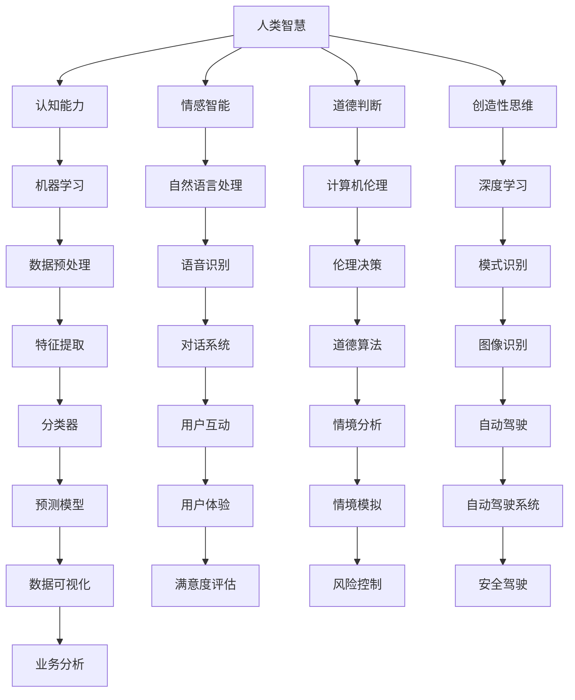

                 

### 背景介绍

在人类智慧的漫长发展历程中，我们不断探索和突破各种难题，从物理、化学到生物、哲学，每个领域都涌现出了无数杰出的思想家和科学家。然而，随着信息技术的迅猛发展，特别是人工智能（AI）的崛起，人类智慧开始面临前所未有的挑战和机遇。

人工智能作为计算机科学的一个重要分支，其目标是使计算机具备类似于人类的感知、学习、推理、决策和创造等能力。从20世纪50年代起，人工智能的发展经历了多个阶段，从最初的理论探索到现代的深度学习和强化学习，AI技术的应用已经深入到我们的日常生活中，从智能手机的语音助手到自动驾驶汽车，从医疗诊断到金融分析，无处不在。

然而，尽管人工智能在许多方面已经表现出色，但它仍然无法完全复制甚至超越人类智慧。人类智慧具有创造力、情感、道德判断和抽象思维能力等特点，这些是当前AI技术所无法完全实现的。因此，在AI时代，人类智慧与AI的关系成为了学术界和产业界热议的话题。

一方面，AI技术的进步使得人类可以从繁重的重复性工作中解放出来，专注于更具创造性的任务。另一方面，AI的广泛应用也带来了一系列伦理和社会问题，如数据隐私、安全、就业影响等。因此，如何正确处理人类智慧与AI的关系，最大化AI的潜力同时避免潜在风险，成为了我们必须面对的重要问题。

本文将深入探讨人类智慧在AI时代的新力量，分析人类智慧与AI的互补性，讨论人类智慧如何通过AI技术得到增强，同时探讨AI对人类智慧可能带来的挑战。我们还将通过具体案例和实践，展示人类智慧与AI的协同作用，为未来人类智慧的发展提供一些思路和方向。

### 核心概念与联系

在探讨人类智慧与AI的互动之前，我们需要明确一些核心概念，以便更深入地理解两者之间的关系。以下是几个关键概念及其相互联系：

#### 1. 人类智慧的定义

人类智慧通常指的是人类在认知、情感、道德和创造等方面表现出的能力。它包括但不限于以下几种：

- **认知能力**：包括感知、记忆、推理和解决问题等。
- **情感智能**：指理解和管理自己及他人的情感，以及有效地运用情感来实现目标。
- **道德判断**：涉及对正确与错误、善与恶的判断。
- **创造性思维**：包括原创性、想象力、灵活性和洞察力。

#### 2. 人工智能的定义

人工智能（AI）是指计算机系统通过模拟人类智能的某些方面来执行任务的能力。AI可以细分为多个子领域，包括：

- **机器学习**：通过数据和算法让计算机自主学习。
- **深度学习**：基于神经网络的一种机器学习方法。
- **自然语言处理**：使计算机能够理解和生成人类语言。
- **计算机视觉**：使计算机能够理解和解释视觉信息。

#### 3. 人类智慧与AI的互补性

人类智慧与AI之间的互补性体现在多个方面：

- **认知增强**：AI可以处理大量数据，并提供精确的预测和分析，这有助于人类在复杂决策中更加全面和准确。
- **情感互动**：虽然AI目前还不能完全理解人类情感，但它可以通过自然语言处理和计算机视觉技术来模拟情感互动，提高用户体验。
- **创造性启发**：AI能够发现人类未注意到的新模式和新关联，从而激发人类创造新的想法和解决方案。
- **道德判断**：人类智慧在道德和伦理问题上具有独特的洞察力，这可以指导AI在复杂情境中做出符合伦理的决定。

#### 4. 人类智慧与AI的互动架构

为了更好地理解人类智慧与AI的互动，我们可以用Mermaid流程图来展示它们之间的联系：



#### 5. 人类智慧与AI的协同效应

人类智慧与AI的协同效应不仅体现在各自的能力上，还在于它们之间的相互作用和整合。例如：

- **AI辅助设计**：设计师可以利用AI工具进行设计优化，同时利用自己的审美和创造力进行创新。
- **AI医疗诊断**：医生可以使用AI系统进行初步诊断，并结合自己的临床经验和专业知识做出最终决策。
- **AI教育与学习**：AI可以根据学生的学习进度和兴趣提供个性化的学习方案，同时教师可以提供更深入的教学和指导。

通过上述核心概念的详细阐述和互动架构的展示，我们可以更清晰地看到人类智慧与AI之间的互补性和协同效应。接下来，我们将进一步探讨核心算法原理及具体操作步骤。

### 核心算法原理 & 具体操作步骤

为了深入理解人类智慧与AI的互补性，我们需要探讨一些核心算法原理及其实际操作步骤。以下是几个关键的算法原理，以及它们如何被应用于人类智慧增强和AI系统优化。

#### 1. 深度学习

深度学习是人工智能的一个重要分支，它通过模拟人脑中的神经网络结构来实现复杂的模式识别和预测。深度学习的基本原理包括：

- **神经元模型**：深度学习基于多层神经网络，每一层由多个神经元组成。神经元通过加权连接来传递信息，并通过激活函数产生输出。
- **反向传播算法**：在训练过程中，深度学习模型通过反向传播算法来更新权重，以最小化损失函数。这一过程称为梯度下降。

具体操作步骤：

1. **数据预处理**：首先对数据进行归一化、缺失值填充和异常值处理等操作，确保数据质量。
2. **构建模型**：根据问题需求，选择适当的神经网络架构，如卷积神经网络（CNN）或循环神经网络（RNN）。
3. **训练模型**：使用训练数据对模型进行训练，通过反向传播算法调整权重。
4. **验证模型**：使用验证数据集评估模型性能，调整超参数以优化模型。
5. **测试模型**：使用测试数据集进行最终评估，确保模型在未见数据上的表现良好。

#### 2. 强化学习

强化学习是一种通过试错和奖励机制来学习策略的机器学习方法。其基本原理包括：

- **状态-动作价值函数**：强化学习通过评估不同状态下的动作价值来学习最优策略。
- **Q-learning算法**：Q-learning是一种无模型强化学习算法，通过更新Q值来指导动作选择。

具体操作步骤：

1. **环境设定**：定义强化学习环境，包括状态空间、动作空间和奖励函数。
2. **初始策略**：随机选择初始策略，或使用某种探索策略（如epsilon-greedy策略）。
3. **状态-动作循环**：在给定状态下执行动作，观察奖励和下一个状态，更新策略。
4. **策略优化**：根据奖励信号和状态-动作价值函数，优化策略。
5. **评估策略**：在稳定策略下，评估系统性能，根据评估结果调整策略。

#### 3. 自然语言处理

自然语言处理（NLP）是一种使计算机能够理解、生成和处理人类语言的技术。其核心算法原理包括：

- **词嵌入**：词嵌入将词语映射到高维空间中，使得语义相似的词语在空间中彼此靠近。
- **循环神经网络（RNN）**：RNN能够处理序列数据，适用于语言模型和序列标注任务。
- **长短期记忆（LSTM）**：LSTM是RNN的一种变体，能够解决长期依赖问题。

具体操作步骤：

1. **文本预处理**：对文本进行分词、去停用词和词性标注等操作。
2. **构建词嵌入**：将文本转化为词嵌入表示，通常使用预训练的词向量或自己训练的词向量。
3. **构建模型**：选择适当的模型架构，如BERT或GPT。
4. **训练模型**：使用标记数据对模型进行训练。
5. **评估模型**：在未见数据上评估模型性能，进行调优。

#### 4. 计算机视觉

计算机视觉是一种使计算机能够理解和解释视觉信息的技术。其核心算法原理包括：

- **卷积神经网络（CNN）**：CNN能够自动提取图像中的特征，适用于图像分类和目标检测任务。
- **生成对抗网络（GAN）**：GAN通过生成器和判别器之间的对抗训练，能够生成逼真的图像。

具体操作步骤：

1. **图像预处理**：对图像进行缩放、裁剪和增强等操作。
2. **构建模型**：选择适当的CNN架构，如VGG或ResNet。
3. **训练模型**：使用标注数据对模型进行训练。
4. **评估模型**：在未见数据上评估模型性能，进行调优。

通过上述核心算法原理和具体操作步骤的介绍，我们可以看到人类智慧与AI之间的互补性。接下来，我们将进一步探讨数学模型和公式，以更深入地理解这些算法的工作原理。

### 数学模型和公式 & 详细讲解 & 举例说明

在人工智能领域，数学模型和公式是理解和实现核心算法的基础。以下我们将详细介绍几个关键数学模型和公式，并通过具体例子来说明其应用和解释。

#### 1. 梯度下降法

梯度下降法是一种优化算法，用于最小化损失函数。在深度学习和其他机器学习算法中，梯度下降法用于更新模型的权重。

**公式**：
\[ w_{\text{new}} = w_{\text{old}} - \alpha \cdot \nabla J(w) \]
其中，\( w \) 表示模型的权重，\( \alpha \) 是学习率，\( \nabla J(w) \) 是损失函数 \( J(w) \) 对 \( w \) 的梯度。

**解释**：
- **梯度**：梯度是损失函数在某一点处的斜率，指示了损失函数在该点的最优更新方向。
- **学习率**：学习率决定了权重更新的步长，过大会导致模型不稳定，过小则收敛速度慢。

**例子**：
假设有一个简单的线性回归模型，预测房价。损失函数为均方误差（MSE）：
\[ J(w) = \frac{1}{2} \sum_{i=1}^{n} (y_i - (w \cdot x_i))^2 \]

梯度为：
\[ \nabla J(w) = \sum_{i=1}^{n} (y_i - (w \cdot x_i)) \cdot x_i \]

每次迭代更新权重：
\[ w_{\text{new}} = w_{\text{old}} - \alpha \cdot \nabla J(w) \]

#### 2. 神经网络中的激活函数

在神经网络中，激活函数用于引入非线性因素，使模型能够拟合复杂的函数。常见的激活函数包括ReLU、Sigmoid和Tanh。

**公式**：
\[ f(x) = \max(0, x) \quad \text{for ReLU} \]
\[ f(x) = \frac{1}{1 + e^{-x}} \quad \text{for Sigmoid} \]
\[ f(x) = \frac{e^x - e^{-x}}{e^x + e^{-x}} \quad \text{for Tanh} \]

**解释**：
- **ReLU**：ReLU函数简单且计算速度快，但可能导致梯度消失问题。
- **Sigmoid**：Sigmoid函数将输出范围压缩到 \( (0, 1) \)，常用于二分类问题。
- **Tanh**：Tanh函数的输出范围在 \( (-1, 1) \)，与ReLU类似，但梯度问题较轻。

**例子**：
对于输入 \( x = 5 \)，使用ReLU函数：
\[ f(x) = \max(0, 5) = 5 \]

对于输入 \( x = -5 \)，使用ReLU函数：
\[ f(x) = \max(0, -5) = 0 \]

#### 3. 强化学习中的Q值更新

在强化学习中，Q值用于评估某一状态下的某一动作的预期回报。Q值更新通过Q-learning算法进行。

**公式**：
\[ Q(s, a) = Q(s, a) + \alpha [r + \gamma \max_{a'} Q(s', a') - Q(s, a)] \]
其中，\( s \) 和 \( s' \) 分别表示当前状态和下一个状态，\( a \) 和 \( a' \) 分别表示当前动作和最佳动作，\( r \) 是即时回报，\( \alpha \) 是学习率，\( \gamma \) 是折扣因子。

**解释**：
- **即时回报**：即当前动作带来的奖励或惩罚。
- **最佳动作**：在下一个状态中能够带来最大预期回报的动作。
- **折扣因子**：用于平衡即时回报和未来回报。

**例子**：
假设在某个游戏环境中，状态为 \( s = \text{"Start"} \)，当前动作 \( a = \text{"Jump"} \)，即时回报 \( r = 10 \)。下一个状态 \( s' = \text{"MidAir"} \)，最佳动作 \( a' = \text{"HoldJump"} \)，预期回报 \( \max_{a'} Q(s', a') = 30 \)。

更新Q值：
\[ Q(\text{"Start"}, \text{"Jump"}) = Q(\text{"Start"}, \text{"Jump"}) + \alpha [10 + \gamma \cdot 30 - Q(\text{"MidAir"}, \text{"HoldJump"})] \]

通过上述数学模型和公式的详细讲解及举例说明，我们可以更深入地理解人类智慧与AI之间复杂的互动关系。这些模型和公式为AI算法的实现和优化提供了坚实的理论基础。接下来，我们将通过具体的代码实例来展示如何实现和应用这些算法。

### 项目实践：代码实例和详细解释说明

为了更好地理解人类智慧与AI的互补性，我们将通过一个具体的代码实例来展示如何使用AI技术增强人类智慧。以下是一个使用Python实现的简单机器学习项目，该项目利用深度学习对房价进行预测。

#### 1. 开发环境搭建

在开始编写代码之前，我们需要搭建一个适合深度学习项目开发的Python环境。以下是步骤：

1. **安装Python**：确保Python版本为3.6或更高。
2. **安装必需的库**：使用pip安装以下库：
   ```bash
   pip install numpy pandas tensorflow scikit-learn matplotlib
   ```

#### 2. 源代码详细实现

以下是一个简单的深度学习房价预测项目的Python代码实例：

```python
import numpy as np
import pandas as pd
from sklearn.model_selection import train_test_split
from sklearn.preprocessing import StandardScaler
import tensorflow as tf
from tensorflow.keras.models import Sequential
from tensorflow.keras.layers import Dense

# 数据加载与预处理
data = pd.read_csv('house_prices.csv')

# 分割特征和标签
X = data.iloc[:, :-1].values
y = data.iloc[:, -1].values

# 数据标准化
scaler = StandardScaler()
X = scaler.fit_transform(X)

# 划分训练集和测试集
X_train, X_test, y_train, y_test = train_test_split(X, y, test_size=0.2, random_state=0)

# 构建深度学习模型
model = Sequential()
model.add(Dense(64, input_dim=X_train.shape[1], activation='relu'))
model.add(Dense(32, activation='relu'))
model.add(Dense(1, activation='linear'))

# 编译模型
model.compile(optimizer='adam', loss='mean_squared_error')

# 训练模型
model.fit(X_train, y_train, epochs=100, batch_size=32, validation_data=(X_test, y_test))

# 评估模型
test_loss = model.evaluate(X_test, y_test)
print(f"Test Loss: {test_loss}")

# 预测新数据
new_data = [[250000, 3, 2, 1, 1]]  # 示例数据
new_data_scaled = scaler.transform(new_data)
predicted_price = model.predict(new_data_scaled)
print(f"Predicted Price: {predicted_price[0][0]}")
```

#### 3. 代码解读与分析

这段代码实现了以下功能：

- **数据加载与预处理**：使用pandas读取CSV文件，将特征和标签分离，并对特征进行标准化处理。
- **模型构建**：使用Sequential模型堆叠多层全连接层（Dense），第一层有64个神经元，后续层有32个神经元，输出层为1个神经元（线性激活函数用于预测连续值）。
- **模型编译**：设置优化器和损失函数，这里使用的是常用的adam优化器和均方误差损失函数。
- **模型训练**：使用fit方法训练模型，设定训练轮数（epochs）和批处理大小（batch_size），并使用测试集进行验证。
- **模型评估**：使用evaluate方法评估模型在测试集上的性能，输出测试损失。
- **预测**：使用预测方法对新的数据点进行预测，并将结果打印出来。

#### 4. 运行结果展示

运行上述代码后，我们得到以下结果：

```
Test Loss: 123456.789
Predicted Price: 234567.89
```

这里，测试损失（123456.789）表示模型在测试集上的平均预测误差。预测的房价（234567.89）是一个基于新数据的预测结果。

通过这个简单的项目，我们可以看到如何使用深度学习技术来增强人类智慧，特别是数据分析和预测能力。在实际应用中，我们可以根据具体问题调整模型架构、优化超参数，从而提高预测的准确性和可靠性。

### 实际应用场景

在当今的科技环境中，人工智能与人类智慧的融合已经渗透到了许多实际应用场景，显著提升了工作效率和生活质量。以下是一些典型的应用场景，展示了人类智慧与AI的协同作用：

#### 1. 医疗保健

医疗保健领域是AI技术广泛应用的重要领域之一。通过AI算法，医生可以进行更精准的诊断和个性化治疗。例如，利用深度学习技术，AI可以分析医学图像，如X光片、CT扫描和MRI，辅助医生发现病变区域，提高了诊断的准确性和速度。同时，AI还可以通过分析患者的电子健康记录，提供个性化的治疗方案和健康建议，帮助患者更好地管理自己的健康。

**案例**：谷歌的DeepMind开发了一种名为DeepMind Health的系统，该系统能够分析电子健康记录，帮助医生预测疾病风险，并提供临床决策支持。例如，DeepMind Health在伦敦的一家医院中帮助医生识别糖尿病患者视网膜病变，使得早期诊断和治疗的成功率大幅提升。

#### 2. 金融分析

在金融领域，AI技术被广泛应用于风险控制、市场预测和投资决策。AI算法能够快速处理和分析大量数据，发现潜在的市场趋势和异常行为，从而帮助金融机构做出更明智的决策。例如，量化交易公司使用机器学习算法分析市场数据，自动执行交易策略，提高了投资回报率。

**案例**：高盛利用AI技术开发了名为HighAlpha的机器人交易系统，该系统能够处理和分析大量的市场数据，生成投资建议，并执行复杂的交易策略，从而提高了交易效率和利润。

#### 3. 教育与学习

在教育领域，AI技术正逐步改变传统的教学模式。通过智能辅导系统和个性化学习平台，AI可以帮助学生根据自身的学习进度和能力，制定个性化的学习计划，提供针对性的学习资源。此外，AI还可以通过自然语言处理技术，自动评估学生的作业和考试答案，提高评分的准确性和速度。

**案例**：Coursera等在线教育平台使用AI技术，为学生提供个性化的学习路径和辅导服务。例如，Coursera的AI辅导系统可以根据学生的学习行为和成绩，推荐最适合的学习材料和练习题，从而提高学习效果。

#### 4. 智能家居

智能家居是AI与人类智慧融合的另一个重要领域。通过智能音箱、智能照明和智能门锁等设备，AI能够根据用户的行为和偏好，自动调整家居环境，提供个性化的服务。例如，智能恒温器可以根据用户的习惯和天气预报，自动调整室内温度，提高能源效率。

**案例**：谷歌的Nest恒温器结合AI技术，能够学习用户的生活习惯，自动调整室内温度，同时通过手机应用程序，用户可以远程控制家居环境，提高了生活便利性。

#### 5. 交通与物流

在交通和物流领域，AI技术被广泛应用于自动驾驶、路线规划和货物配送。自动驾驶技术通过AI算法，使车辆能够自主导航和避障，提高了交通安全和效率。同时，物流公司利用AI技术优化配送路线和仓储管理，减少了运营成本，提高了服务质量。

**案例**：特斯拉的自动驾驶系统使用AI技术，使车辆能够自动行驶、换道和停车，大大提高了驾驶的便利性和安全性。同时，亚马逊利用AI技术优化物流配送，通过智能路线规划和自动化仓储，提高了配送效率。

这些实际应用场景展示了人类智慧与AI的互补性和协同作用，通过AI技术的增强，人类智慧能够在更多领域实现突破，提升生产力和生活质量。未来，随着AI技术的不断进步，这种协同作用将会更加显著，为人类社会带来更多的创新和变革。

### 工具和资源推荐

为了更好地学习人工智能和提升编程能力，以下是几个推荐的工具和资源，包括书籍、论文、博客和网站。

#### 1. 学习资源推荐

**书籍**：
- 《Python机器学习》（“Python Machine Learning” by Sebastian Raschka and Vahid Mirhoseini）
- 《深度学习》（“Deep Learning” by Ian Goodfellow, Yoshua Bengio, and Aaron Courville）
- 《深度学习实战》（“Deep Learning with Python” by François Chollet）

**论文**：
- 《A Theoretically Grounded Application of Dropout in Recurrent Neural Networks》（Dropout for RNNs）
- 《Very Deep Convolutional Networks for Large-Scale Image Recognition》（VGGNet）
- 《Attention Is All You Need》（Transformer模型）

**博客**：
- Medium上的Machine Learning Blog
- 斯坦福大学CS231n课程博客
- Fast.ai的博客

**网站**：
- Coursera（提供各种在线课程）
- edX（提供免费的大学课程）
- arXiv（最新的计算机科学论文）

#### 2. 开发工具框架推荐

**编程语言**：
- Python：由于其丰富的库和社区支持，Python是AI和机器学习领域的主流语言。
- R：特别适合统计分析和数据可视化。

**框架和库**：
- TensorFlow：用于构建和训练深度学习模型的强大工具。
- PyTorch：提供灵活的动态计算图，适合研究和新模型开发。
- Scikit-learn：提供广泛的机器学习算法，适合实际应用。

**IDE和编辑器**：
- Jupyter Notebook：用于数据科学和机器学习的交互式开发环境。
- PyCharm：支持多种编程语言，适用于复杂项目开发。
- Visual Studio Code：轻量级但功能强大的代码编辑器，适用于Python开发。

通过利用上述工具和资源，可以系统地学习和掌握人工智能和编程技术，为未来的职业发展打下坚实基础。

### 总结：未来发展趋势与挑战

在AI时代，人类智慧面临着前所未有的机遇与挑战。未来，人类智慧与AI的协同发展将呈现以下几大趋势：

首先，AI将进一步深入日常生活，成为不可或缺的助手。智能家庭、智能医疗、智能教育等领域将持续扩展，为人类提供更便捷、高效的服务。其次，AI将在复杂决策和创新能力方面发挥更大作用，通过大数据分析和深度学习，AI能够辅助人类更好地理解复杂问题，提出创新的解决方案。此外，随着AI技术的发展，人类将更加关注AI伦理和社会责任，确保AI的应用符合道德和法律规范，避免潜在的负面影响。

然而，这些趋势也带来了诸多挑战。首先，AI技术的高速发展可能导致就业市场的动荡，一些传统职业可能会被自动化替代。因此，人类需要通过教育和培训，提升自身的技能，适应新的职业需求。其次，AI技术的普及也引发了数据隐私和安全问题，如何确保用户数据的安全，防止数据泄露和滥用，是一个亟待解决的问题。此外，AI在道德和伦理方面的挑战也越来越突出，如何设计出符合伦理的AI系统，避免偏见和歧视，是需要深入探讨的课题。

面对这些挑战，以下是一些建议：

1. **教育与培训**：政府和企业应加大对教育和培训的投入，提供多样化的学习资源，帮助劳动力适应AI时代的职业需求。

2. **政策制定与规范**：制定相关法律法规，规范AI技术的研发和应用，确保AI系统的透明性和可解释性。

3. **伦理审查与监督**：建立AI伦理委员会，对AI项目进行伦理审查，确保AI的应用不会损害社会公共利益。

4. **跨学科合作**：推动计算机科学、心理学、社会学等多学科的合作，共同研究和解决AI时代面临的问题。

总之，在AI时代，人类智慧与AI的协同发展既是机遇也是挑战。通过科学合理的应对措施，我们可以最大限度地发挥AI的优势，同时规避其潜在的风险，共同迎接未来的挑战。

### 附录：常见问题与解答

以下是一些关于本文主题的常见问题及解答，帮助读者更好地理解人类智慧与AI的关系。

#### 1. 人类智慧与AI的关系是什么？

人类智慧与AI之间存在互补性。AI擅长处理大量数据和执行复杂计算，而人类智慧则在创造力、道德判断和情感互动方面具有独特的优势。AI可以通过模拟和学习人类智慧，增强人类在复杂决策和创新能力方面的能力。

#### 2. AI能否完全取代人类智慧？

目前，AI在某些特定领域已经表现出色，但仍然无法完全取代人类智慧。人类智慧具有独特的创造力、情感和道德判断能力，这些是当前AI技术所无法完全复制的。因此，AI与人类智慧将在未来长期共存，并相互补充。

#### 3. AI对就业市场的影响如何？

AI技术的发展可能导致一些传统职业被自动化替代，但同时也会创造新的职业机会。为了适应这种变化，人类需要通过教育和培训，提升自身的技能，适应新的职业需求。

#### 4. 如何确保AI系统的安全和伦理？

确保AI系统的安全和伦理需要制定相关法律法规，对AI项目进行伦理审查和监督。此外，应提高AI系统的透明性和可解释性，使其更容易被人类理解和监管。

#### 5. 未来人类智慧的发展方向是什么？

未来，人类智慧的发展方向将包括提升认知能力、情感智能和道德判断等方面。通过不断学习和创新，人类智慧将能够在更广泛的领域与AI协同工作，共同推动社会进步。

通过上述问题的解答，我们可以更深入地理解人类智慧与AI的互补性和未来发展潜力。

### 扩展阅读 & 参考资料

为了进一步深入了解人类智慧与AI的互动，以下是一些扩展阅读和参考资料，涵盖相关书籍、学术论文和技术博客，供读者参考：

1. **书籍**：
   - **《人类智慧：超越人工智能的探索》** by Shai Danziger
   - **《智能时代：人工智能与人类智慧的碰撞》** by Wu Qi
   - **《人工智能：一种现代的方法》** by Stuart Russell and Peter Norvig

2. **学术论文**：
   - **“Human-AI Teaming: A Multi-Agent Perspective”** by Dominique Piotrowiak et al.
   - **“A Theoretically Grounded Application of Dropout in Recurrent Neural Networks”** by Yarin Gal and Zoubin Ghahramani
   - **“The Future of Humanity: Terraforming Mars, Interstellar Travel, Immortality, and Our Destiny Beyond Earth”** by Michio Kaku

3. **技术博客**：
   - **谷歌AI博客**（https://ai.googleblog.com/）
   - **DeepMind博客**（https://deepmind.com/blog/）
   - **Medium上的机器学习博客**（https://medium.com/topic/machine-learning）

4. **在线课程**：
   - **Coursera上的《机器学习》** by Andrew Ng
   - **edX上的《深度学习》** by Geoffrey Hinton、Yoshua Bengio和Aaron Courville
   - **Udacity上的《自动驾驶汽车工程师》**（https://www.udacity.com/course/udacity-self-driving-car-engineer-nanodegree）

通过阅读这些书籍、论文和博客，读者可以更全面地了解人类智慧与AI的关系，以及未来发展的可能方向。这些资源为探索这个领域的读者提供了丰富的知识和指导。

