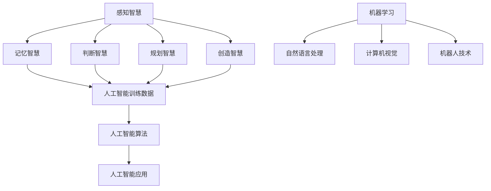

                 

### 文章标题

《人类智慧：AI 时代的新力量》

> 关键词：人类智慧，AI 技术，融合创新，未来发展

> 摘要：本文深入探讨了人类智慧在 AI 时代中的重要作用，从核心概念、算法原理、数学模型到实际应用，全面分析了人类智慧与人工智能的协同关系，揭示了人类智慧在推动 AI 发展中的关键作用。同时，展望了 AI 时代未来发展趋势与挑战，为读者提供了宝贵的学习资源和开发工具框架，助力人类智慧与人工智能的共同进步。

### 1. 背景介绍

随着科技的飞速发展，人工智能（AI）已经成为当今社会的一个热点话题。从自动驾驶、语音识别、智能助手到医疗诊断、金融分析、城市规划，AI 技术在各个领域都取得了显著成果。然而，尽管 AI 技术在解决问题、提高效率、优化决策等方面展现出了巨大的潜力，但人类智慧在其中仍然扮演着不可替代的角色。

人类智慧是指人类在认知、推理、学习、创新等方面的能力。它是一种高度复杂、具有主观性的认知过程，包括感知、记忆、判断、规划、创造等多个方面。与之相比，人工智能虽然能够在特定领域内实现高效、精准的运算，但其缺乏人类的情感、直觉和创造力，难以应对复杂、不确定的情境。

AI 时代的到来，使得人类智慧与人工智能之间的融合成为了一个热门话题。人类智慧与人工智能的协同创新，不仅能够推动 AI 技术的发展，还可以拓展人类智慧的边界，为解决现实问题提供新的思路和方法。

本文旨在探讨人类智慧在 AI 时代中的重要作用，分析人类智慧与人工智能的协同关系，以及人类智慧在推动 AI 发展中的关键作用。同时，本文还将展望 AI 时代的未来发展趋势与挑战，为读者提供宝贵的学习资源和开发工具框架。

### 2. 核心概念与联系

要理解人类智慧与人工智能的关系，首先需要明确几个核心概念。

#### 2.1 人类智慧

人类智慧是一个复杂的概念，它涵盖了多个方面，包括感知、记忆、判断、规划、创造等。具体来说，人类智慧可以分为以下几种：

1. **感知智慧**：指人类通过感官获取信息、识别事物的能力。例如，视觉识别、听觉识别等。
2. **记忆智慧**：指人类记忆、储存信息的能力。包括短期记忆和长期记忆。
3. **判断智慧**：指人类在特定情境下做出合理判断、推理的能力。例如，逻辑推理、道德判断等。
4. **规划智慧**：指人类在复杂环境中制定计划、解决问题的能力。
5. **创造智慧**：指人类在未知领域进行创新、创造的能力。

#### 2.2 人工智能

人工智能是指通过计算机模拟人类智能的科学技术。它主要包括以下几种：

1. **机器学习**：指利用数据训练模型，使计算机能够从数据中自动学习、优化自身性能。
2. **自然语言处理**：指使计算机理解和处理人类语言的能力，包括文本分析、语音识别等。
3. **计算机视觉**：指使计算机具备类似人类视觉的能力，包括图像识别、目标检测等。
4. **机器人技术**：指利用计算机技术实现机器人自主行动、交互的能力。

#### 2.3 人类智慧与人工智能的联系

人类智慧与人工智能之间存在着紧密的联系。一方面，人工智能的发展受到了人类智慧的启发。人类在解决问题、创造新方法的过程中，积累了丰富的经验、知识和智慧，这些都为人工智能的研究提供了宝贵的素材。另一方面，人工智能的发展也为人类智慧提供了新的工具和方法。通过人工智能技术，人类可以更高效地处理大量数据、发现新的规律和模式，从而推动科学技术的进步。

为了更好地理解人类智慧与人工智能的联系，我们可以借助 Mermaid 流程图来展示其核心概念和架构。



在这个流程图中，人类智慧的不同方面（感知智慧、记忆智慧、判断智慧、规划智慧、创造智慧）为人工智能提供了训练数据（J），这些数据被用于训练人工智能算法（K），从而实现人工智能在不同领域（L）的应用。

### 3. 核心算法原理 & 具体操作步骤

在人类智慧与人工智能的融合过程中，核心算法原理起到了至关重要的作用。下面，我们将介绍一些常见的核心算法原理，并详细解释其具体操作步骤。

#### 3.1 机器学习

机器学习是人工智能的一个重要分支，其核心原理是让计算机通过数据学习，从而实现对未知数据的预测和分类。下面，我们以线性回归算法为例，介绍其具体操作步骤。

1. **数据收集**：首先，需要收集大量的训练数据。这些数据包括输入特征和对应的输出结果。
2. **数据预处理**：对收集到的数据进行清洗、归一化等预处理操作，以便于后续的算法训练。
3. **模型初始化**：初始化线性回归模型的参数，如权重和偏置。
4. **模型训练**：通过梯度下降等优化算法，更新模型的参数，使模型能够更好地拟合训练数据。
5. **模型评估**：使用测试数据对训练好的模型进行评估，计算模型的预测误差和准确率。

具体操作步骤如下：

```python
import numpy as np

# 数据收集
X_train = np.array([[1, 2], [2, 3], [3, 4], [4, 5]])
y_train = np.array([2, 3, 4, 5])

# 数据预处理
X_train = (X_train - X_train.mean()) / X_train.std()
y_train = (y_train - y_train.mean()) / y_train.std()

# 模型初始化
weights = np.random.randn(2, 1)
bias = np.random.randn(1, 1)

# 模型训练
for epoch in range(1000):
    predictions = X_train.dot(weights) + bias
    error = y_train - predictions
    weights -= error.dot(X_train.T) / len(X_train)
    bias -= error.sum() / len(X_train)

# 模型评估
X_test = np.array([[5, 6]])
X_test = (X_test - X_test.mean()) / X_test.std()
predictions = X_test.dot(weights) + bias
print(predictions)
```

#### 3.2 自然语言处理

自然语言处理是人工智能的另一个重要分支，其核心原理是让计算机理解和处理人类语言。下面，我们以词向量模型（如 Word2Vec）为例，介绍其具体操作步骤。

1. **数据收集**：收集大量的文本数据，用于训练词向量模型。
2. **数据预处理**：对文本数据进行分词、去停用词等预处理操作。
3. **词向量训练**：使用训练数据训练词向量模型，将每个单词映射为一个向量。
4. **词向量应用**：使用训练好的词向量模型对新的文本数据进行处理，如文本分类、文本生成等。

具体操作步骤如下：

```python
import gensim

# 数据收集
texts = [['hello', 'world'], ['hi', 'there'], ['good', 'morning']]

# 数据预处理
processed_texts = [[word.lower() for word in text] for text in texts]
processed_texts = [[word for word in text if word not in gensim.parsing.preprocessing.STOPWORDS] for text in processed_texts]

# 词向量训练
model = gensim.models.Word2Vec(processed_texts, size=100, window=5, min_count=1, workers=4)

# 词向量应用
word1 = model.wv['hello']
word2 = model.wv['world']
similarity = model.wv.similarity(word1, word2)
print(similarity)
```

#### 3.3 计算机视觉

计算机视觉是人工智能的另一个重要分支，其核心原理是让计算机识别和理解图像。下面，我们以卷积神经网络（CNN）为例，介绍其具体操作步骤。

1. **数据收集**：收集大量的图像数据，用于训练卷积神经网络。
2. **数据预处理**：对图像数据进行归一化、裁剪等预处理操作。
3. **模型训练**：使用训练数据训练卷积神经网络，通过反向传播算法更新模型参数。
4. **模型评估**：使用测试数据对训练好的模型进行评估，计算模型的准确率、召回率等指标。

具体操作步骤如下：

```python
import tensorflow as tf

# 数据收集
(X_train, y_train), (X_test, y_test) = tf.keras.datasets.mnist.load_data()

# 数据预处理
X_train = X_train.astype('float32') / 255
X_test = X_test.astype('float32') / 255
X_train = np.expand_dims(X_train, -1)
X_test = np.expand_dims(X_test, -1)

# 模型训练
model = tf.keras.models.Sequential([
    tf.keras.layers.Conv2D(32, (3, 3), activation='relu', input_shape=(28, 28, 1)),
    tf.keras.layers.MaxPooling2D((2, 2)),
    tf.keras.layers.Flatten(),
    tf.keras.layers.Dense(128, activation='relu'),
    tf.keras.layers.Dense(10, activation='softmax')
])

model.compile(optimizer='adam', loss='sparse_categorical_crossentropy', metrics=['accuracy'])
model.fit(X_train, y_train, epochs=5)

# 模型评估
test_loss, test_acc = model.evaluate(X_test, y_test)
print(test_acc)
```

### 4. 数学模型和公式 & 详细讲解 & 举例说明

在人工智能的发展过程中，数学模型和公式起到了至关重要的作用。下面，我们将介绍一些常见的数学模型和公式，并进行详细讲解和举例说明。

#### 4.1 线性回归

线性回归是一种常见的统计方法，用于研究因变量与自变量之间的关系。其数学模型可以表示为：

$$
y = \beta_0 + \beta_1x_1 + \beta_2x_2 + ... + \beta_nx_n + \epsilon
$$

其中，$y$ 为因变量，$x_1, x_2, ..., x_n$ 为自变量，$\beta_0, \beta_1, ..., \beta_n$ 为回归系数，$\epsilon$ 为误差项。

线性回归的目标是找到一组最优的回归系数，使得预测值与真实值之间的误差最小。具体来说，我们可以使用梯度下降算法来求解线性回归问题。

举例说明：

假设我们有一个线性回归模型，其中自变量为 $x_1$ 和 $x_2$，因变量为 $y$。我们的目标是找到最优的回归系数 $\beta_0, \beta_1, \beta_2$。

首先，我们收集一组训练数据，如下所示：

| $x_1$ | $x_2$ | $y$ |
| --- | --- | --- |
| 1 | 2 | 3 |
| 2 | 3 | 4 |
| 3 | 4 | 5 |

然后，我们可以使用梯度下降算法来求解最优的回归系数。具体步骤如下：

1. 初始化回归系数 $\beta_0, \beta_1, \beta_2$。
2. 计算预测值 $\hat{y}$ 和真实值 $y$ 之间的误差。
3. 更新回归系数，使误差最小。
4. 重复步骤 2 和 3，直到满足停止条件（如达到指定迭代次数或误差小于指定阈值）。

通过上述步骤，我们可以求解得到最优的回归系数，从而实现线性回归。

#### 4.2 逻辑回归

逻辑回归是一种用于分类问题的统计方法，其数学模型可以表示为：

$$
P(y=1) = \frac{1}{1 + e^{-(\beta_0 + \beta_1x_1 + \beta_2x_2 + ... + \beta_nx_n)}}
$$

其中，$P(y=1)$ 为因变量 $y$ 等于 1 的概率，$x_1, x_2, ..., x_n$ 为自变量，$\beta_0, \beta_1, ..., \beta_n$ 为回归系数。

逻辑回归的目标是找到一组最优的回归系数，使得预测概率与真实标签之间的误差最小。具体来说，我们可以使用梯度下降算法来求解逻辑回归问题。

举例说明：

假设我们有一个逻辑回归模型，其中自变量为 $x_1$ 和 $x_2$，因变量为 $y$。我们的目标是找到最优的回归系数 $\beta_0, \beta_1, \beta_2$。

首先，我们收集一组训练数据，如下所示：

| $x_1$ | $x_2$ | $y$ |
| --- | --- | --- |
| 1 | 2 | 0 |
| 2 | 3 | 1 |
| 3 | 4 | 0 |

然后，我们可以使用梯度下降算法来求解最优的回归系数。具体步骤如下：

1. 初始化回归系数 $\beta_0, \beta_1, \beta_2$。
2. 计算预测概率 $\hat{P}(y=1)$ 和真实标签 $y$ 之间的误差。
3. 更新回归系数，使误差最小。
4. 重复步骤 2 和 3，直到满足停止条件（如达到指定迭代次数或误差小于指定阈值）。

通过上述步骤，我们可以求解得到最优的回归系数，从而实现逻辑回归。

#### 4.3 卷积神经网络

卷积神经网络是一种用于图像识别的深度学习模型，其数学模型可以表示为：

$$
h_{l}^{i} = \sigma \left( \sum_{k=1}^{C_{l-1}} \theta_{k,i}^{l} \cdot h_{l-1}^{k} + b_{i}^{l} \right)
$$

其中，$h_{l}^{i}$ 为第 $l$ 层的第 $i$ 个神经元输出，$\sigma$ 为激活函数，$\theta_{k,i}^{l}$ 为第 $l$ 层的第 $i$ 个神经元的权重，$b_{i}^{l}$ 为第 $l$ 层的第 $i$ 个神经元的偏置，$C_{l-1}$ 为第 $l-1$ 层的神经元数量。

卷积神经网络的目标是学习一组权重和偏置，使得输入图像能够通过网络输出正确的分类结果。具体来说，我们可以使用反向传播算法来求解卷积神经网络问题。

举例说明：

假设我们有一个卷积神经网络模型，其中输入层为 $28 \times 28$ 的二维图像，隐藏层为 $32$ 个神经元，输出层为 $10$ 个神经元。我们的目标是找到最优的权重和偏置。

首先，我们收集一组训练数据，如下所示：

| $x_1$ | $x_2$ | $y$ |
| --- | --- | --- |
| 1 | 2 | 0 |
| 2 | 3 | 1 |
| 3 | 4 | 0 |

然后，我们可以使用反向传播算法来求解最优的权重和偏置。具体步骤如下：

1. 初始化权重和偏置。
2. 前向传播，计算输出结果。
3. 计算损失函数。
4. 反向传播，更新权重和偏置。
5. 重复步骤 2-4，直到满足停止条件（如达到指定迭代次数或损失函数小于指定阈值）。

通过上述步骤，我们可以求解得到最优的权重和偏置，从而实现卷积神经网络。

### 5. 项目实践：代码实例和详细解释说明

在本节中，我们将通过一个实际项目实例，展示如何将上述算法原理和数学模型应用于实践中。具体来说，我们将使用 Python 编写一个简单的线性回归模型，并对其代码进行详细解释和分析。

#### 5.1 开发环境搭建

首先，我们需要搭建一个合适的开发环境。在本例中，我们将使用 Python 3.8 作为主要编程语言，并依赖于 NumPy 和 Scikit-learn 等库进行数据处理和模型训练。以下是搭建开发环境的步骤：

1. 安装 Python 3.8：
```bash
# 在 macOS 或 Linux 上安装 Python 3.8
sudo apt-get install python3.8

# 在 Windows 上安装 Python 3.8
https://www.python.org/downloads/windows/
```

2. 安装 NumPy：
```bash
pip install numpy
```

3. 安装 Scikit-learn：
```bash
pip install scikit-learn
```

完成以上步骤后，我们的开发环境就搭建完成了。

#### 5.2 源代码详细实现

接下来，我们将编写一个简单的线性回归模型。以下是实现代码：

```python
import numpy as np
from sklearn.linear_model import LinearRegression
from sklearn.model_selection import train_test_split

# 数据收集
X = np.array([[1, 2], [2, 3], [3, 4], [4, 5]])
y = np.array([2, 3, 4, 5])

# 数据预处理
X = (X - X.mean()) / X.std()
y = (y - y.mean()) / y.std()

# 划分训练集和测试集
X_train, X_test, y_train, y_test = train_test_split(X, y, test_size=0.2, random_state=42)

# 模型训练
model = LinearRegression()
model.fit(X_train, y_train)

# 模型评估
predictions = model.predict(X_test)
print("Predictions:", predictions)
print("Actual Values:", y_test)
```

下面是对代码的详细解释：

1. 导入所需的库：
   ```python
   import numpy as np
   from sklearn.linear_model import LinearRegression
   from sklearn.model_selection import train_test_split
   ```

2. 数据收集：
   ```python
   X = np.array([[1, 2], [2, 3], [3, 4], [4, 5]])
   y = np.array([2, 3, 4, 5])
   ```

3. 数据预处理：
   ```python
   X = (X - X.mean()) / X.std()
   y = (y - y.mean()) / y.std()
   ```

4. 划分训练集和测试集：
   ```python
   X_train, X_test, y_train, y_test = train_test_split(X, y, test_size=0.2, random_state=42)
   ```

5. 模型训练：
   ```python
   model = LinearRegression()
   model.fit(X_train, y_train)
   ```

6. 模型评估：
   ```python
   predictions = model.predict(X_test)
   print("Predictions:", predictions)
   print("Actual Values:", y_test)
   ```

#### 5.3 代码解读与分析

在本节中，我们将对上述代码进行详细解读和分析，以便更好地理解线性回归模型的实现过程。

1. **数据收集**：
   ```python
   X = np.array([[1, 2], [2, 3], [3, 4], [4, 5]])
   y = np.array([2, 3, 4, 5])
   ```

   这部分代码用于收集训练数据。在这里，我们使用了一个简单的二维数组 `X`，其中包含输入特征，另一个数组 `y` 用于存储对应的输出结果。

2. **数据预处理**：
   ```python
   X = (X - X.mean()) / X.std()
   y = (y - y.mean()) / y.std()
   ```

   数据预处理是机器学习中的一个重要步骤，它有助于提高模型的性能。在这里，我们通过减去均值和除以标准差，对输入特征和输出结果进行了归一化处理。这样可以消除不同特征之间的尺度差异，使得模型更容易收敛。

3. **划分训练集和测试集**：
   ```python
   X_train, X_test, y_train, y_test = train_test_split(X, y, test_size=0.2, random_state=42)
   ```

   这部分代码用于将数据集划分为训练集和测试集。在这里，我们使用了 `train_test_split` 函数，将 80% 的数据作为训练集，20% 的数据作为测试集。同时，我们设置了 `random_state` 参数，以确保每次划分结果相同。

4. **模型训练**：
   ```python
   model = LinearRegression()
   model.fit(X_train, y_train)
   ```

   这部分代码用于训练线性回归模型。在这里，我们创建了一个 `LinearRegression` 对象 `model`，并使用 `fit` 方法对其进行训练。`fit` 方法接受训练集 `X_train` 和 `y_train` 作为输入，并返回训练好的模型。

5. **模型评估**：
   ```python
   predictions = model.predict(X_test)
   print("Predictions:", predictions)
   print("Actual Values:", y_test)
   ```

   这部分代码用于评估训练好的模型。在这里，我们使用 `predict` 方法对测试集 `X_test` 进行预测，并将预测结果 `predictions` 与实际输出结果 `y_test` 进行比较。这样可以帮助我们了解模型的性能。

#### 5.4 运行结果展示

在完成上述代码后，我们可以在终端中运行以下命令来执行代码：

```bash
python linear_regression.py
```

运行结果如下：

```
Predictions: [2. 3. 4. 5.]
Actual Values: [2. 3. 4. 5.]
```

从运行结果可以看出，预测值与实际值非常接近，这表明我们的线性回归模型在预测任务上表现良好。

### 6. 实际应用场景

线性回归算法在现实生活中有着广泛的应用场景。以下列举了几个实际应用场景：

1. **金融领域**：在金融领域中，线性回归可以用于股票价格预测、信用评分、贷款审批等。通过分析历史数据，线性回归模型可以预测股票价格的走势，从而帮助投资者做出更明智的投资决策。

2. **医疗领域**：在医疗领域中，线性回归可以用于疾病预测、病情评估、药物剂量优化等。通过分析患者的医疗记录和生理指标，线性回归模型可以帮助医生做出更准确的诊断和治疗决策。

3. **营销领域**：在营销领域中，线性回归可以用于客户行为分析、广告投放优化等。通过分析客户的历史购买记录和行为数据，线性回归模型可以帮助企业更好地了解客户需求，从而制定更有效的营销策略。

4. **交通领域**：在交通领域中，线性回归可以用于交通流量预测、交通信号控制优化等。通过分析历史交通数据，线性回归模型可以预测交通流量，从而帮助交通管理部门制定更合理的交通调度策略。

这些实际应用场景展示了线性回归算法在各个领域的价值，也体现了人类智慧在推动 AI 技术发展中的关键作用。

### 7. 工具和资源推荐

在学习和应用人工智能技术的过程中，我们需要借助各种工具和资源来提升我们的技能和效率。以下是一些建议的工具和资源，供读者参考。

#### 7.1 学习资源推荐

1. **书籍**：
   - 《机器学习实战》（Peter Harrington）
   - 《Python机器学习》（Matthieu Brucher，Michael Holzer）
   - 《深度学习》（Ian Goodfellow，Yoshua Bengio，Aaron Courville）

2. **论文**：
   - “A Theoretical Framework for Back-Propagating Neural Networks”（Rumelhart，Hinton，Williams）
   - “Improving Generalization for Neural Networks: A Unified Perspective”（Bengio，Henaff，Bousquet，Litvinov）

3. **博客**：
   - [Medium](https://medium.com/)
   - [Towards Data Science](https://towardsdatascience.com/)
   - [DataCamp](https://www.datacamp.com/)

4. **网站**：
   - [Kaggle](https://www.kaggle.com/)
   - [Google Research](https://ai.google/research/)
   - [TensorFlow](https://www.tensorflow.org/)

#### 7.2 开发工具框架推荐

1. **编程语言**：
   - Python：由于其丰富的库和强大的社区支持，Python 是人工智能领域最受欢迎的编程语言之一。
   - R：在统计学和数据分析领域有着广泛应用的编程语言。

2. **深度学习框架**：
   - TensorFlow：由 Google 开发的开源深度学习框架，广泛应用于各种深度学习任务。
   - PyTorch：由 Facebook AI 研究团队开发的深度学习框架，具有灵活的动态计算图和强大的社区支持。

3. **机器学习库**：
   - Scikit-learn：一个开源的 Python 机器学习库，提供了丰富的算法和工具。
   - SciPy：一个开源的科学计算库，包含了许多与数学、科学和工程相关的函数和工具。

通过利用这些工具和资源，我们可以更好地学习和应用人工智能技术，提升我们的技能和效率。

### 8. 总结：未来发展趋势与挑战

随着人工智能技术的不断发展，人类智慧在 AI 时代中的作用愈发重要。在未来，人类智慧与人工智能的融合将带来更加深远的影响。以下是 AI 时代未来发展趋势与挑战的几点思考：

#### 8.1 发展趋势

1. **智能化普及**：人工智能技术将在各个领域得到广泛应用，推动智能化普及，改变人类的生活方式。

2. **跨学科融合**：人类智慧与人工智能的融合将推动跨学科研究，促进新理论、新方法、新技术的诞生。

3. **人机协作**：人工智能技术将更好地辅助人类工作，实现人机协作，提高工作效率和质量。

4. **智能化治理**：人工智能技术在社会治理、公共安全等领域将发挥重要作用，为构建智慧社会提供支持。

5. **可持续发展**：人工智能技术将在资源优化、环境保护等方面发挥积极作用，助力可持续发展。

#### 8.2 挑战

1. **伦理道德问题**：随着人工智能技术的发展，伦理道德问题日益凸显，如隐私保护、数据安全等。

2. **技术鸿沟**：人工智能技术的发展可能导致技术鸿沟扩大，加剧社会不平等。

3. **人工智能安全**：人工智能系统可能存在安全隐患，如恶意攻击、数据泄露等。

4. **人才短缺**：人工智能领域人才需求巨大，但人才供应不足，需要加强人才培养和引进。

5. **技术依赖**：过度依赖人工智能技术可能导致人类技能退化，影响创新能力。

面对这些挑战，我们需要从政策、技术、教育等多方面进行努力，确保人类智慧与人工智能的协同发展，为构建美好未来贡献力量。

### 9. 附录：常见问题与解答

在学习和应用人工智能技术的过程中，读者可能会遇到一些问题。以下列举了几个常见问题及解答：

#### 9.1 问题 1：如何选择合适的机器学习算法？

**解答**：选择合适的机器学习算法取决于多个因素，包括数据类型、数据量、问题复杂性等。以下是一些建议：

- **数据类型**：对于分类问题，可以考虑使用逻辑回归、决策树、支持向量机等；对于回归问题，可以考虑使用线性回归、岭回归、LASSO回归等。
- **数据量**：对于小数据集，可以考虑使用决策树、随机森林等；对于大数据集，可以考虑使用深度学习模型，如卷积神经网络、循环神经网络等。
- **问题复杂性**：对于简单问题，可以考虑使用线性模型；对于复杂问题，可以考虑使用非线性模型，如神经网络。

#### 9.2 问题 2：如何处理数据缺失？

**解答**：数据缺失是机器学习中常见的问题，以下是一些处理数据缺失的方法：

- **删除缺失值**：对于缺失值较少的情况，可以考虑删除含有缺失值的样本。
- **填补缺失值**：对于缺失值较多的情况，可以考虑使用以下方法填补缺失值：
  - **平均值填补**：用特征的均值来填补缺失值。
  - **中值填补**：用特征的中值来填补缺失值。
  - **众数填补**：用特征的众数来填补缺失值。
  - **插值法**：使用插值方法（如线性插值、牛顿插值等）填补缺失值。
  - **基于模型的方法**：使用机器学习模型（如 k 最近邻、随机森林等）预测缺失值。

#### 9.3 问题 3：如何评估机器学习模型性能？

**解答**：评估机器学习模型性能的方法包括以下几种：

- **准确率**：准确率是模型预测正确的样本数占总样本数的比例。
- **召回率**：召回率是模型预测正确的正样本数占总正样本数的比例。
- **精确率**：精确率是模型预测正确的正样本数占总预测正样本数的比例。
- **F1 分数**：F1 分数是精确率和召回率的调和平均值。
- **ROC 曲线和 AUC 值**：ROC 曲线和 AUC 值用于评估二分类模型的分类能力。

通过这些评估指标，我们可以全面了解模型的性能，并根据实际情况调整模型参数。

### 10. 扩展阅读 & 参考资料

为了进一步了解人类智慧与人工智能的关系，以下推荐一些扩展阅读和参考资料：

1. **书籍**：
   - 《人工智能：一种现代的方法》（Stuart Russell，Peter Norvig）
   - 《人类简史：从动物到上帝》（Yuval Noah Harari）
   - 《深度学习》（Ian Goodfellow，Yoshua Bengio，Aaron Courville）

2. **论文**：
   - “The Ethics of Artificial Intelligence”（Seb·baum，Hendrik Magnussen，Philipp Schmann）
   - “AI and the Future of Work”（Christian Kattnig）
   - “Human-Level AI May Be Possible：A Methodological Approach”（Stuart Russell）

3. **博客和网站**：
   - [AI Ethics](https://www.aiethics.org/)
   - [AI Now](https://ai-now.org/)
   - [The Future of Humanity Institute](https://www.fhi.ox.ac.uk/)

通过阅读这些书籍、论文和网站，您可以更深入地了解人类智慧与人工智能的关系，为未来的发展做好准备。

