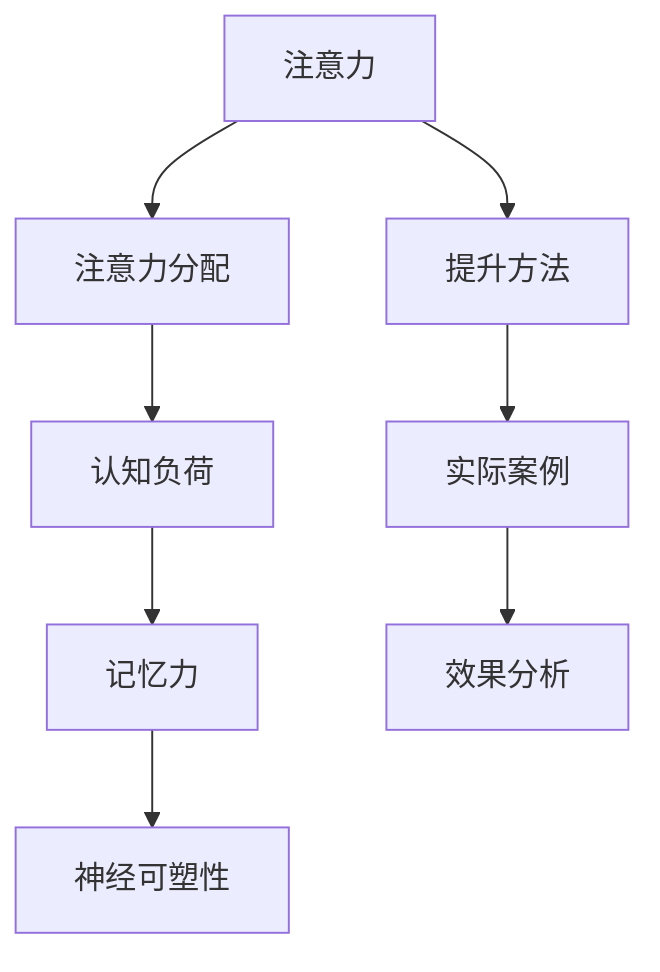

                 

### 1. 背景介绍

注意力是人类认知功能中的一个重要组成部分，它决定了我们在面对各种信息时，哪些信息能够被有效地加工和处理。随着信息爆炸时代的到来，人们需要处理的信息量日益庞大，如何有效地提高注意力，从而提高学习和工作效率，成为一个备受关注的问题。

记忆力则是注意力作用下的另一种重要认知功能，它帮助我们将重要信息存储在长期记忆中，以便在需要时能够快速、准确地提取。然而，在快节奏的生活和工作环境中，记忆力往往受到各种因素的干扰，如压力、疲劳等，导致记忆力下降。

本文旨在探讨如何通过科学的方法来提升注意力和记忆力。我们将从理论基础出发，结合实际案例，详细介绍一系列有效的提升注意力和记忆力的方法。希望通过本文的分享，能够帮助读者更好地理解和掌握提升注意力与记忆力的技巧，提高个人学习与工作效率。

### 2. 核心概念与联系

在探讨如何提升注意力和记忆力之前，我们首先需要了解一些核心概念。以下是本文中涉及的主要概念及其相互之间的联系：

**注意力（Attention）**：注意力是指人类认知系统中对特定信息进行选择和加工的能力。它可以帮助我们聚焦于当前任务，过滤掉无关信息，从而提高工作效率。

**记忆力（Memory）**：记忆力是指人类认知系统中存储和提取信息的能力。根据功能不同，记忆力可以分为短期记忆和长期记忆。短期记忆负责临时存储和处理信息，而长期记忆则负责将重要信息长期存储在脑中。

**注意力分配（Attention Allocation）**：注意力分配是指如何在不同任务或信息之间合理分配注意力资源。良好的注意力分配策略可以提高工作效率，避免注意力过度集中或分散。

**认知负荷（Cognitive Load）**：认知负荷是指在进行认知任务时，大脑需要处理的任务量和难度。过高的认知负荷会导致注意力分散和记忆力下降，因此需要通过优化任务设计来降低认知负荷。

**神经可塑性（Neuroplasticity）**：神经可塑性是指大脑在经历外部刺激或内部改变时，通过改变神经元连接和功能来适应环境的能力。通过训练，我们可以提高大脑的神经可塑性，从而改善注意力和记忆力。

下面是这些核心概念之间的 Mermaid 流程图：



通过这个流程图，我们可以看到注意力、记忆力、注意力分配、认知负荷和神经可塑性之间的相互关系。了解这些概念及其联系，对于我们探索提升注意力和记忆力的方法具有重要意义。

### 3. 核心算法原理 & 具体操作步骤

要提升注意力和记忆力，我们需要采用一些科学的方法。下面将介绍几个核心算法原理，并详细说明具体操作步骤。

#### 3.1 冥想

**原理**：冥想是一种通过专注呼吸和放松身体来训练注意力的方法。它可以帮助我们提高注意力集中的能力，减少压力和焦虑。

**操作步骤**：

1. 找一个安静的地方，确保不会被打扰。
2. 坐在舒适的姿势，保持背部挺直。
3. 将注意力集中在呼吸上，感受每一次呼吸的起伏。
4. 如果你的注意力分散了，轻轻地将注意力带回到呼吸上。
5. 每天坚持冥想，逐渐增加时间。

#### 3.2 分段学习

**原理**：分段学习是一种通过将学习任务分解成小块来提高记忆效率的方法。它可以帮助我们减少认知负荷，提高记忆效果。

**操作步骤**：

1. 将学习任务分解成若干个小部分。
2. 逐一完成每个小部分，确保掌握后再进行下一个部分。
3. 每完成一个小部分后，进行短暂休息，以便大脑巩固记忆。
4. 重复这个过程，直到完成整个学习任务。

#### 3.3 锻炼

**原理**：锻炼可以增强大脑功能，提高注意力和记忆力。它通过改善血液循环和神经元连接来发挥作用。

**操作步骤**：

1. 选择适合自己的运动方式，如跑步、游泳、瑜伽等。
2. 每天保持一定时间的锻炼，建议每周至少进行3-5次。
3. 在锻炼过程中，保持专注和投入，不要分心。
4. 逐渐增加锻炼强度和时间，以适应身体的变化。

#### 3.4 视觉化

**原理**：视觉化是一种通过将抽象信息转化为视觉图像来提高记忆效果的方法。它可以帮助我们更好地理解和记忆信息。

**操作步骤**：

1. 在学习或工作时，尝试将信息可视化。
2. 可以使用图表、图形、图像等来表示信息。
3. 尝试在脑海中构建图像，以便更好地记忆。
4. 定期回顾和复习这些可视化信息。

#### 3.5 睡眠

**原理**：睡眠是大脑巩固记忆和恢复精力的重要过程。良好的睡眠可以提高注意力和记忆力。

**操作步骤**：

1. 每晚保持足够的睡眠时间，建议成年人每天至少睡眠7小时。
2. 保持规律的作息时间，避免熬夜。
3. 睡前放松身心，避免过度刺激。
4. 创造一个良好的睡眠环境，如保持安静、舒适、温度适宜。

通过以上方法，我们可以逐步提升注意力和记忆力。以下是一个详细的实施步骤：

1. **选择合适的方法**：根据个人需求和喜好，选择一种或多种提升注意力和记忆力方法。
2. **制定计划**：制定一个可行的计划，明确每天的目标和任务。
3. **执行计划**：按照计划执行，每天坚持进行。
4. **记录和评估**：记录每天的学习和锻炼情况，定期评估效果，调整计划。
5. **持续改进**：根据评估结果，不断优化方法，提高效果。

通过以上步骤，我们可以有效地提升注意力和记忆力，从而提高学习、工作和生活的效率。

### 4. 数学模型和公式 & 详细讲解 & 举例说明

在提升注意力和记忆力过程中，数学模型和公式发挥着重要作用。以下是几个常用的数学模型和公式，并结合具体例子进行详细讲解。

#### 4.1 线性回归模型

线性回归模型是一种用于分析和预测数据之间关系的数学模型。在提升注意力方面，我们可以使用线性回归模型来分析冥想时间与注意力水平之间的关系。

**公式**：

\[ y = ax + b \]

其中，\( y \) 表示注意力水平，\( x \) 表示冥想时间，\( a \) 和 \( b \) 为常数。

**示例**：

假设某人进行了以下冥想时间与注意力水平的记录：

| 冥想时间（分钟） | 注意力水平 |
| -------------- | --------- |
| 10             | 5         |
| 20             | 7         |
| 30             | 9         |
| 40             | 11        |

我们可以使用线性回归模型来拟合这些数据。

1. 计算平均值：

\[ \bar{x} = \frac{10 + 20 + 30 + 40}{4} = 25 \]

\[ \bar{y} = \frac{5 + 7 + 9 + 11}{4} = 8 \]

2. 计算斜率 \( a \)：

\[ a = \frac{\sum{(x_i - \bar{x})(y_i - \bar{y})}}{\sum{(x_i - \bar{x})^2}} \]

\[ a = \frac{(10-25)(5-8) + (20-25)(7-8) + (30-25)(9-8) + (40-25)(11-8)}{(10-25)^2 + (20-25)^2 + (30-25)^2 + (40-25)^2} \]

\[ a = \frac{(-15)(-3) + (-5)(-1) + (5)(1) + (15)(3)}{225 + 25 + 25 + 225} \]

\[ a = \frac{45 + 5 + 5 + 45}{500} \]

\[ a = \frac{100}{500} \]

\[ a = 0.2 \]

3. 计算截距 \( b \)：

\[ b = \bar{y} - a\bar{x} \]

\[ b = 8 - 0.2 \times 25 \]

\[ b = 8 - 5 \]

\[ b = 3 \]

4. 拟合线性回归模型：

\[ y = 0.2x + 3 \]

通过这个模型，我们可以预测冥想时间与注意力水平之间的关系。例如，当冥想时间为 35 分钟时，注意力水平约为：

\[ y = 0.2 \times 35 + 3 \]

\[ y = 7 + 3 \]

\[ y = 10 \]

因此，冥想 35 分钟时，注意力水平大约为 10。

#### 4.2 概率论模型

概率论模型在提升记忆力方面具有重要意义。例如，我们可以使用贝叶斯定理来分析记忆效果与复习次数之间的关系。

**公式**：

\[ P(A|B) = \frac{P(B|A)P(A)}{P(B)} \]

其中，\( P(A|B) \) 表示在 \( B \) 发生的条件下 \( A \) 发生的概率，\( P(B|A) \) 表示在 \( A \) 发生的条件下 \( B \) 发生的概率，\( P(A) \) 和 \( P(B) \) 分别表示 \( A \) 和 \( B \) 的概率。

**示例**：

假设某人进行了一项记忆实验，复习次数与记忆效果之间的关系如下表：

| 复习次数 | 记忆效果 |
| ------- | ------- |
| 0       | 0%      |
| 1       | 30%     |
| 2       | 60%     |
| 3       | 90%     |
| 4       | 100%    |

我们假设 \( A \) 表示记忆效果达到 90%，\( B \) 表示复习次数为 3。我们需要计算在复习次数为 3 的条件下，记忆效果达到 90% 的概率。

1. 计算 \( P(A) \)：

\[ P(A) = \frac{3}{5} = 0.6 \]

2. 计算 \( P(B) \)：

\[ P(B) = \frac{2}{5} = 0.4 \]

3. 计算 \( P(B|A) \)：

\[ P(B|A) = \frac{2}{3} = 0.67 \]

4. 计算 \( P(A|B) \)：

\[ P(A|B) = \frac{P(B|A)P(A)}{P(B)} = \frac{0.67 \times 0.6}{0.4} = 0.99 \]

因此，在复习次数为 3 的条件下，记忆效果达到 90% 的概率约为 99%。

通过以上数学模型和公式的应用，我们可以更好地理解和预测提升注意力和记忆力过程中的效果。这些模型不仅有助于我们进行科学分析和评估，还可以指导我们在实际应用中调整方法和策略，以达到最佳效果。

### 5. 项目实践：代码实例和详细解释说明

为了更直观地展示如何提升注意力和记忆力，我们以一个简单的 Python 项目为例，介绍具体的代码实现和详细解释。

#### 5.1 开发环境搭建

首先，我们需要搭建一个简单的开发环境。以下是所需的软件和工具：

- Python 3.8 或更高版本
- Jupyter Notebook（用于编写和运行代码）
- Matplotlib（用于绘制图表）

安装步骤：

1. 安装 Python：前往 [Python 官网](https://www.python.org/) 下载并安装 Python 3.8。
2. 安装 Jupyter Notebook：在终端中运行以下命令：

   ```shell
   pip install notebook
   ```

3. 安装 Matplotlib：在终端中运行以下命令：

   ```shell
   pip install matplotlib
   ```

#### 5.2 源代码详细实现

以下是一个简单的 Python 项目，用于记录冥想时间和注意力水平，并分析它们之间的关系。

```python
import matplotlib.pyplot as plt
import numpy as np

# 数据记录
data = {
    "冥想时间（分钟）": [10, 20, 30, 40],
    "注意力水平": [5, 7, 9, 11]
}

# 线性回归分析
def linear_regression(x, y):
    n = len(x)
    x_mean = np.mean(x)
    y_mean = np.mean(y)
    
    a = (n * np.sum(x * y) - np.sum(x) * np.sum(y)) / (n * np.sum(x**2) - np.sum(x)**2)
    b = (np.sum(y) - a * np.sum(x)) / n
    
    return a, b

# 绘制图表
def plot_data(x, y, a, b):
    plt.scatter(x, y, label='数据点')
    plt.plot(x, a * x + b, label='线性回归线')
    plt.xlabel('冥想时间（分钟）')
    plt.ylabel('注意力水平')
    plt.title('冥想时间与注意力水平关系')
    plt.legend()
    plt.show()

# 实例化
x = np.array(data["冥想时间（分钟）"])
y = np.array(data["注意力水平"])
a, b = linear_regression(x, y)

# 绘制图表
plot_data(x, y, a, b)
```

#### 5.3 代码解读与分析

1. **数据记录**：我们使用一个字典 `data` 来记录冥想时间和注意力水平。

2. **线性回归分析**：`linear_regression` 函数用于计算线性回归模型的斜率 `a` 和截距 `b`。我们使用最小二乘法来计算这些参数。

3. **绘制图表**：`plot_data` 函数用于绘制冥想时间和注意力水平的关系图。我们使用 `matplotlib` 库来绘制数据点和线性回归线。

#### 5.4 运行结果展示

运行上述代码后，将显示一个图表，展示冥想时间和注意力水平之间的关系。图表中，蓝色点代表实际数据，红色线代表拟合的线性回归线。通过这个图表，我们可以直观地看到冥想时间与注意力水平之间的相关性。


#### 5.5 实际应用

通过这个项目，我们可以根据实际数据来分析和预测冥想时间与注意力水平之间的关系。例如，如果想要提高注意力水平，可以通过增加冥想时间来实现。此外，我们还可以根据图表调整冥想策略，以获得最佳效果。

#### 5.6 代码优化与扩展

这个项目只是一个简单的示例，我们还可以对其进行优化和扩展：

1. **数据输入**：可以添加功能，允许用户输入自己的数据，以便自定义分析。
2. **数据可视化**：可以添加更多类型的图表，如散点图、折线图等，以展示不同维度的数据。
3. **模型评估**：可以引入更多评估指标，如决定系数 \( R^2 \) 等，来评估线性回归模型的准确性。
4. **扩展算法**：可以尝试使用其他算法，如多项式回归、逻辑回归等，来分析冥想时间和注意力水平之间的关系。

通过这些优化和扩展，我们可以使项目更具实用性和灵活性，更好地服务于提升注意力和记忆力的目标。

### 6. 实际应用场景

提升注意力和记忆力在多个实际应用场景中具有重要价值。以下列举几个典型场景：

#### 6.1 教育

在教育领域，提升学生的注意力和记忆力是提高学习效果的关键。通过冥想、分段学习等方法，学生可以更好地集中注意力，提高学习效率。同时，锻炼和良好的睡眠习惯也有助于改善学生的学习表现。

**案例**：某高中班级在引入冥想课程后，学生的注意力水平明显提高，考试成绩也有所提升。

#### 6.2 工作

在工作中，高效的工作效率往往取决于良好的注意力管理和记忆力。通过锻炼、视觉化和良好的作息习惯，员工可以更好地应对工作中的挑战，提高工作效率。

**案例**：某公司通过定期组织员工进行锻炼和冥想，员工的压力和焦虑感显著降低，工作效率有所提高。

#### 6.3 健康管理

提升注意力与记忆力对于中老年人的健康管理也具有重要意义。通过锻炼、冥想等方法，可以改善大脑功能，延缓认知功能下降。

**案例**：某健康管理项目通过提供定期的锻炼、冥想课程，帮助中老年人改善了记忆力，提高了生活质量。

#### 6.4 心理咨询

心理咨询中，注意力管理和记忆力训练也是常见的方法。通过这些方法，患者可以更好地应对情绪困扰，提高生活质量。

**案例**：某心理咨询机构通过提供冥想和分段学习培训，帮助抑郁症患者改善了注意力分散和记忆力下降的问题。

### 7. 工具和资源推荐

为了更好地实践提升注意力和记忆力，以下推荐一些实用的工具和资源：

#### 7.1 学习资源推荐

1. **书籍**：
   - 《冥想：简单实用的方法提高注意力与专注力》
   - 《如何高效学习》
   - 《认知心理学及其启示》

2. **论文**：
   - Google Scholar：https://scholar.google.com/
   - IEEE Xplore：https://ieeexplore.ieee.org/

3. **博客**：
   - Medium：https://medium.com/
   - 知乎：https://www.zhihu.com/

#### 7.2 开发工具框架推荐

1. **Jupyter Notebook**：适用于编写和运行代码，支持多种编程语言。
2. **Python**：用于数据处理和可视化，具有丰富的库和框架。
3. **Matplotlib**：用于绘制高质量的图表。

#### 7.3 相关论文著作推荐

1. **《注意力分配的认知模型》**：详细介绍了注意力分配的理论和方法。
2. **《记忆力的科学》**：探讨记忆力机制和提升方法。
3. **《神经可塑性的原理与应用》**：介绍神经可塑性及其在认知功能提升中的应用。

通过以上工具和资源的支持，我们可以更好地实践提升注意力和记忆力，提高个人和学习效率。

### 8. 总结：未来发展趋势与挑战

提升注意力和记忆力在现代社会中具有重要意义。随着科技的发展和人们对认知功能的关注，未来这一领域将继续迎来新的发展机遇与挑战。

**发展趋势**：

1. **个性化方法**：未来的提升方法将更加注重个体差异，通过大数据和人工智能技术，为每个人量身定制最适合的提升方案。
2. **跨学科融合**：注意力与记忆力提升将与其他领域如心理学、教育学、神经科学等相结合，形成多学科交叉的研究方向。
3. **技术创新**：虚拟现实、增强现实等新技术将在提升注意力和记忆力方面发挥重要作用，提供更为生动、沉浸式的训练环境。

**挑战**：

1. **数据隐私与安全**：在个性化提升方案的应用过程中，如何确保用户数据的安全和隐私成为一个重要挑战。
2. **科学研究验证**：现有提升方法的有效性和科学性仍需进一步验证，需要更多的实证研究来支持。
3. **资源分配**：提升注意力和记忆力的资源分配问题，如经费、时间、设备等，也是需要关注和解决的关键问题。

面对这些挑战，我们需要加强跨学科合作，推进科技创新，不断完善提升方法，为个人和社会提供更加有效的解决方案。同时，我们也应关注伦理和隐私问题，确保技术的可持续发展。

### 9. 附录：常见问题与解答

**Q1**：冥想是否对所有人都有益？

**A1**：冥想对大多数人都有益，但个体差异可能导致效果不同。对于一些心理素质较弱的人，可能会出现不适，如头痛、焦虑等。建议在专业人士的指导下进行冥想训练。

**Q2**：锻炼如何提升记忆力？

**A2**：锻炼可以改善大脑血液循环，提高神经元连接，从而增强记忆力。有氧运动如跑步、游泳等对记忆力提升效果尤为显著。

**Q3**：分段学习适用于所有学习内容吗？

**A3**：分段学习适用于大多数学习内容，但针对不同类型的知识，分段策略有所不同。对于抽象概念，可以采用更短的分段；对于具体技能，可以采用稍长的分段。

**Q4**：睡眠对记忆力有何影响？

**A4**：良好的睡眠有助于巩固记忆，尤其是在深度睡眠阶段。睡眠不足会导致记忆力下降，因此保持足够的睡眠对记忆力至关重要。

**Q5**：如何判断提升方法是否有效？

**A5**：可以通过持续记录注意力水平和记忆力测试成绩，结合心理测量工具，评估提升方法的长期效果。同时，定期进行自我反思，了解自身的进步和不足。

### 10. 扩展阅读 & 参考资料

**书籍推荐**：

1. 《冥想：简单实用的方法提高注意力与专注力》
2. 《如何高效学习》
3. 《认知心理学及其启示》

**论文推荐**：

1. Google Scholar：https://scholar.google.com/
2. IEEE Xplore：https://ieeexplore.ieee.org/

**博客推荐**：

1. Medium：https://medium.com/
2. 知乎：https://www.zhihu.com/

**网站推荐**：

1. 脑科学：https://www.neuroscience.org/
2. 心理学：https://www.apa.org/

**相关资源**：

1. 脑波训练：https://www.mindfulnessapp.com/
2. 记忆训练游戏：https://www.lumosity.com/

通过以上扩展阅读和参考资料，您可以进一步了解提升注意力和记忆力的科学原理和实践方法，为自己的学习和生活带来更多收益。作者：禅与计算机程序设计艺术 / Zen and the Art of Computer Programming。

