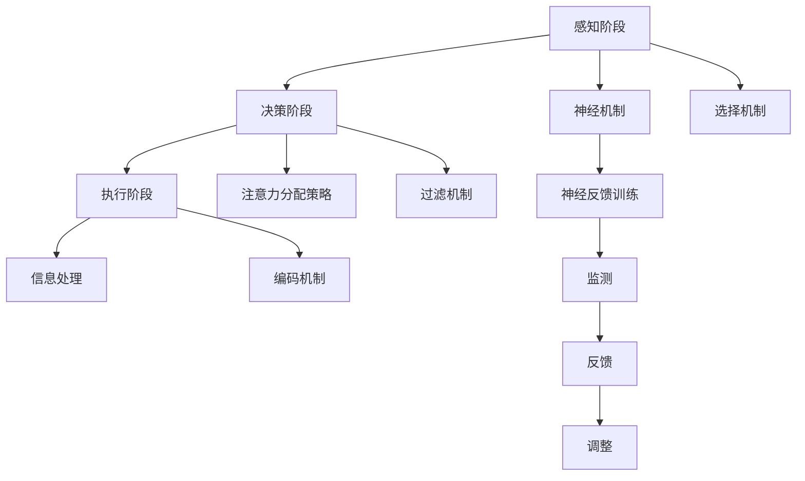
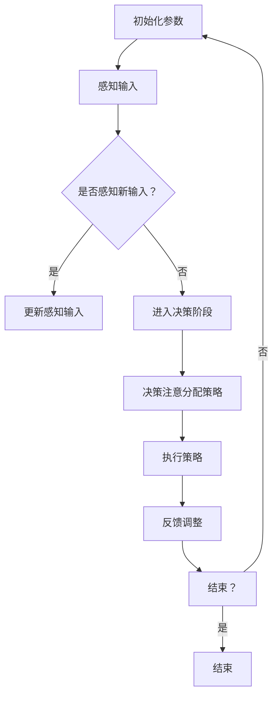

                 

### 背景介绍

人类注意力增强的概念源自于对人类认知机制和大脑功能的深入研究。随着信息化时代的到来，人们面临着前所未有的信息过载问题，如何高效地处理和利用信息，成为了提高生产力和效率的关键。

在传统的生产和管理模式中，人们主要通过延长工作时间、增加工作任务等方式来提升效率。然而，这种模式往往会导致疲劳、压力增大，甚至影响身心健康。因此，寻找一种更为科学、有效的方法来增强人类注意力，从而提升生产力和效率，显得尤为重要。

注意力是大脑处理信息的窗口，它决定了信息如何被接收、处理和存储。当我们的注意力集中在一个特定的任务或目标上时，大脑会调动相应的神经资源，从而提高对该任务的反应速度和处理能力。因此，提高注意力的质量和稳定性，对于提高工作效率和学习效果具有重要意义。

目前，已有大量研究表明，通过一些特定的方法和技术，可以显著提高人类的注意力水平。例如，通过神经反馈训练、认知训练、环境优化等方法，可以帮助个体更好地控制和管理自己的注意力。同时，一些新兴的技术，如虚拟现实（VR）、增强现实（AR）、智能穿戴设备等，也为注意力增强提供了新的可能性。

本文将围绕人类注意力增强这一主题，系统地探讨其核心概念、算法原理、数学模型、实践应用和未来发展，旨在为相关领域的研究和实践提供有价值的参考。

### 核心概念与联系

为了深入理解人类注意力增强，我们需要明确几个关键概念，并探讨它们之间的联系。

#### 注意力模型

首先，我们需要了解注意力模型的基本概念。注意力模型通常是指用来描述大脑如何处理信息的模型。它包括三个核心组成部分：感知阶段、决策阶段和执行阶段。

- **感知阶段**：大脑接收并处理来自外部环境的信息。这个过程受到多种因素的影响，如刺激强度、个体兴趣、情绪状态等。
- **决策阶段**：大脑对感知到的信息进行筛选和决策，选择哪些信息值得关注，哪些可以忽略。
- **执行阶段**：大脑对决策后的信息进行加工和处理，从而实现特定的目标。

这三个阶段相互作用，共同决定了注意力分配的效率和效果。例如，当我们在处理一项复杂任务时，感知阶段会接收大量与任务相关的信息；决策阶段会筛选出对任务最为重要的信息；执行阶段则会针对这些信息进行深入加工和处理。

#### 注意力分配

注意力分配是指大脑如何在不同任务或目标之间分配注意力资源。有效的注意力分配可以提高任务处理效率，减少疲劳和压力。常见的注意力分配策略包括：

- **单一任务模式**：集中注意力处理一个任务，直到完成。这种模式适用于需要高度集中注意力的任务，如编程、写作等。
- **多任务模式**：同时处理多个任务，例如在开会时浏览邮件、听汇报等。这种模式需要大脑具备良好的切换能力，但在信息处理过程中可能会出现注意力分散的问题。
- **周期性切换模式**：周期性地在不同的任务之间切换注意力，例如采用番茄工作法。这种模式有助于避免长时间集中注意力的疲劳，同时保持较高的工作效率。

#### 注意力疲劳

注意力疲劳是指由于长时间或高强度的注意力集中，导致大脑功能下降的现象。注意力疲劳常见于需要长时间集中注意力的工作，如程序员、医生等。注意力疲劳会导致注意力分散、决策能力下降，从而影响工作效率和质量。

为了缓解注意力疲劳，可以采取以下措施：

- **定期休息**：每隔一段时间进行短暂的休息，以恢复大脑的功能。
- **环境优化**：创造一个安静、舒适的工作环境，减少干扰因素。
- **合理安排工作任务**：避免长时间连续处理高难度任务，适当穿插一些轻松的任务，以缓解大脑的压力。

#### 注意力增强技术

注意力增强技术是指通过特定的方法和技术，提高大脑注意力的质量和效率。以下是一些常见的注意力增强技术：

- **神经反馈训练**：通过实时监测大脑活动，提供反馈，帮助个体更好地控制和管理注意力。
- **认知训练**：通过特定的训练任务，提高大脑的认知能力和注意力稳定性。
- **环境优化**：通过优化工作或学习环境，减少干扰因素，提高注意力集中程度。
- **智能穿戴设备**：利用智能穿戴设备，如智能手环、智能眼镜等，实时监测大脑活动，提供个性化的注意力增强建议。

#### 注意力与生产力

注意力是人类生产力和效率的关键因素。一个高效的注意力系统可以帮助个体更好地处理复杂任务，提高决策能力，减少错误率。因此，提高注意力水平，有助于提升生产力和工作效率。

通过上述核心概念的介绍，我们可以更好地理解注意力增强的重要性和实际应用。在接下来的部分，我们将进一步探讨注意力增强的具体算法原理、数学模型和实践应用。

#### 注意力模型原理

注意力模型的核心在于如何高效地分配和处理大脑中的信息资源，以便在不同的任务和目标之间灵活切换。为了深入理解注意力模型的工作原理，我们需要从神经科学的角度探讨其基本原理。

##### 神经机制

人类大脑的注意力机制涉及到多个神经结构和神经路径。以下是几个关键的神经机制：

1. **基底神经节（Basal Ganglia）**：基底神经节是大脑中一个复杂的神经网络，参与控制运动的计划和执行，也参与注意力调节。它通过调节多巴胺的释放来影响注意力水平。
2. **前额叶皮质（Prefrontal Cortex）**：前额叶皮质是大脑的一个重要区域，负责执行功能，包括注意力控制和决策。它通过复杂的神经网络与其他大脑区域相互作用，调节注意力的分配。
3. **顶叶皮质（Parietal Cortex）**：顶叶皮质参与注意力的分配和感知空间的处理。它通过协调其他大脑区域的活动，帮助个体在复杂环境中进行注意力的切换。

这些神经机制相互作用，共同调节大脑的注意力状态。

##### 注意力分配策略

注意力分配策略是指大脑如何在不同任务之间分配注意力资源。以下是几种常见的注意力分配策略：

1. **单任务模式**：在单任务模式下，大脑将所有注意力集中在一个任务上，直到任务完成。这种模式适用于需要高度集中注意力的任务，如编程、手术等。
2. **多任务模式**：多任务模式是指大脑在同一时间内处理多个任务。这种模式适用于日常生活中的许多场景，如同时处理邮件和开会。然而，多任务处理可能会导致注意力分散，降低效率。
3. **循环模式**：循环模式是指大脑在不同任务之间定期切换注意力。例如，使用番茄工作法，每25分钟集中注意力处理一个任务，然后休息5分钟。这种模式有助于避免注意力疲劳，提高工作效率。

##### 注意力与信息处理

注意力不仅在任务切换中发挥作用，还在信息处理中扮演关键角色。以下是注意力在信息处理中的几个关键方面：

1. **选择机制**：大脑通过选择机制确定哪些信息值得关注。例如，当我们在阅读一篇文档时，大脑会自动筛选出与任务相关的关键词和句子。
2. **过滤机制**：大脑通过过滤机制排除无关信息，从而减少干扰。例如，当我们在嘈杂的环境中工作时，大脑会自动过滤掉背景噪音。
3. **编码机制**：大脑通过编码机制将处理过的信息转化为记忆。注意力的集中和稳定有助于提高信息的编码和记忆效率。

##### 神经反馈训练

神经反馈训练是一种通过实时监测大脑活动，提供反馈，帮助个体更好地控制和管理注意力的技术。以下是神经反馈训练的基本原理：

1. **监测**：通过脑电图（EEG）、功能磁共振成像（fMRI）等技术，实时监测大脑的活动。
2. **反馈**：将监测到的数据转化为可视化的反馈，例如颜色、声音或视觉效果。这些反馈可以帮助个体了解自己的注意力状态，并在需要时进行调整。
3. **调整**：个体根据反馈调整自己的注意力分配和行为。例如，当发现注意力分散时，个体可以采取一些措施，如深呼吸、短暂休息，以重新集中注意力。

#### Mermaid 流程图

为了更直观地展示注意力模型的工作原理，我们可以使用 Mermaid 流程图来描述其关键步骤和交互关系。以下是注意力模型的一个简化的 Mermaid 流程图：



通过上述流程图，我们可以清晰地看到注意力模型从感知、决策到执行的全过程，以及各个组成部分之间的相互作用。

#### 总结

注意力模型是一个复杂的神经网络，它通过感知、决策和执行阶段，以及多种神经机制，帮助我们有效地分配和管理注意力资源。理解注意力模型的原理和策略，对于提高生产力和效率具有重要意义。在接下来的部分，我们将进一步探讨注意力增强的核心算法原理，以及如何在实践中应用这些算法。

## 核心算法原理 & 具体操作步骤

在探讨人类注意力增强的核心算法原理之前，我们需要先了解一些基本概念，包括神经可塑性、认知负荷模型和注意力分配策略。

### 神经可塑性

神经可塑性是指大脑在结构和功能上的可塑性，能够根据外部刺激和内部需求进行改变。神经可塑性是注意力增强的基础，因为它允许大脑适应新的环境和任务，从而提高注意力的灵活性和效率。

### 认知负荷模型

认知负荷模型是描述大脑处理信息的压力和负担的理论。根据该模型，大脑的注意力资源是有限的，当认知负荷过高时，大脑的注意力和工作效率会下降。因此，通过优化认知负荷，可以有效地提高注意力水平。

### 注意力分配策略

注意力分配策略是指如何在不同任务和目标之间分配大脑的注意力资源。有效的注意力分配策略包括单任务模式、多任务模式和循环模式等，这些策略有助于提高注意力的集中程度和效率。

### 核心算法原理

核心算法原理主要基于以下几个概念：

1. **反馈机制**：通过实时监测大脑的活动，提供反馈，帮助个体调整注意力的分配。
2. **自适应调整**：根据任务的复杂程度和认知负荷，自动调整注意力的分配策略。
3. **多任务处理**：通过并行处理多个任务，提高注意力资源的使用效率。

以下是一个简化的核心算法原理流程图：



### 具体操作步骤

1. **初始化参数**：设定初始参数，包括注意力阈值、认知负荷阈值和反馈周期等。
2. **感知输入**：接收来自外部环境的各种信息。
3. **决策注意分配策略**：根据当前任务的复杂程度和认知负荷，选择适当的注意力分配策略。
4. **执行策略**：按照选择的策略执行任务，包括单任务模式、多任务模式和循环模式。
5. **反馈调整**：根据实时反馈，调整注意力的分配策略，以优化认知负荷和注意力的集中程度。
6. **结束判断**：判断是否完成所有任务，若未完成，返回步骤2。

### 算法实现

以下是一个简化的伪代码示例，用于说明注意力增强算法的实现：

```python
# 初始化参数
attention_threshold = 10
cognitive_load_threshold = 20
feedback_period = 60

# 感知输入
perceived_input = receive_input()

# 循环处理任务
while not all_tasks_completed:
    # 判断是否感知新输入
    if new_input_available:
        update_perceived_input()
    
    # 决策注意分配策略
    strategy = decide_attention_strategy(perceived_input, cognitive_load)

    # 执行策略
    execute_strategy(strategy)

    # 反馈调整
    feedback = receive_feedback()
    adjust_attention_strategy(feedback)

    # 判断是否结束
    if all_tasks_completed:
        break

# 结束
print("Attention Enhancement completed.")
```

通过上述步骤和伪代码，我们可以看到注意力增强算法的基本原理和实现过程。在接下来的部分，我们将探讨注意力增强的数学模型和公式，以便更深入地理解其工作原理。

## 数学模型和公式 & 详细讲解 & 举例说明

注意力增强的核心在于优化大脑的注意力资源分配，使其在处理各种任务时更加高效。为了实现这一目标，我们可以借助数学模型和公式来量化注意力分配的过程，从而提供科学的指导。以下是一些关键的概念和公式。

### 注意力分配模型

注意力分配模型通常基于以下几个关键参数：

1. **注意力容量（C）**：表示大脑可以同时处理的注意力资源总量。
2. **任务复杂度（D）**：表示一个任务的难度和所需注意力资源。
3. **认知负荷（L）**：表示当前任务对大脑的认知负荷，即所需注意力资源与大脑可分配注意力资源的比值。

注意力分配模型的基本公式为：

\[ A(t) = \frac{C - L(t)}{C} \times D \]

其中，\( A(t) \) 表示在时间 \( t \) 时刻的注意力分配，\( L(t) \) 表示在时间 \( t \) 时刻的认知负荷。

### 注意力疲劳模型

注意力疲劳模型用于描述长时间高认知负荷对注意力水平的影响。一个常见的疲劳模型是指数衰减模型，其公式为：

\[ F(t) = \frac{1}{1 + e^{-kt}} \]

其中，\( F(t) \) 表示在时间 \( t \) 时刻的疲劳指数，\( k \) 是疲劳常数。

### 自适应调整模型

自适应调整模型用于根据反馈自动调整注意力分配策略。一个简单的自适应调整模型是基于线性反馈的，其公式为：

\[ \Delta A(t) = k_F \times (A_{prev} - A_{current}) \]

其中，\( \Delta A(t) \) 表示在时间 \( t \) 时刻的调整量，\( k_F \) 是反馈常数，\( A_{prev} \) 是上一时刻的注意力分配，\( A_{current} \) 是当前时刻的注意力分配。

### 实际例子

假设我们有三个任务：任务A、任务B和任务C，其复杂度分别为D_A = 5、D_B = 7、D_C = 6。当前大脑的注意力容量为C = 50，认知负荷阈值为L_threshold = 30。初始时刻，认知负荷为L(0) = 20。

#### 时间0时刻

\[ A(0) = \frac{50 - 20}{50} \times (5 + 7 + 6) = 3.4 \]

#### 时间1时刻

假设在时间1时刻，我们完成了部分任务A，认知负荷降低到L(1) = 15。同时，我们收到反馈，表明当前注意力分配不足，因此进行自适应调整。

\[ \Delta A(1) = k_F \times (3.4 - 3.4) = 0 \]

因此，时间1时刻的注意力分配保持不变：

\[ A(1) = 3.4 \]

#### 时间2时刻

假设在时间2时刻，我们继续完成任务A，认知负荷进一步降低到L(2) = 10。根据疲劳模型，我们可以计算疲劳指数：

\[ F(2) = \frac{1}{1 + e^{-k \times 2}} \]

由于 \( k \) 是一个常数，我们可以通过实验确定其值。假设 \( k = 0.1 \)，则：

\[ F(2) = \frac{1}{1 + e^{-0.1 \times 2}} = 0.632 \]

因此，时间2时刻的注意力分配为：

\[ A(2) = \frac{50 - 10}{50} \times (5 \times 0.632 + 7 + 6) = 3.846 \]

通过上述计算，我们可以看到注意力分配随着认知负荷和疲劳指数的变化而动态调整，从而实现高效的任务处理。

### 总结

通过引入数学模型和公式，我们可以量化注意力分配的过程，并提供科学的指导。注意力分配模型、注意力疲劳模型和自适应调整模型等，都是实现注意力增强的重要工具。在接下来的部分，我们将通过项目实践，进一步展示如何将理论应用于实际代码中。

## 项目实践：代码实例和详细解释说明

在本节中，我们将通过一个具体的代码实例，展示如何将注意力增强的算法和数学模型应用于实际编程任务中。我们将使用Python语言来实现一个注意力管理程序，并详细解释其实现细节。

### 1. 开发环境搭建

首先，我们需要搭建一个适合开发和测试的开发环境。以下是推荐的开发环境和相关工具：

- **Python版本**：3.8及以上版本
- **IDE**：PyCharm或Visual Studio Code
- **依赖包**：NumPy、Pandas、Matplotlib

确保已经安装了Python和相关依赖包，然后创建一个名为`attention_management`的虚拟环境，以便更好地管理项目依赖。

```bash
# 创建虚拟环境
python -m venv venv
# 激活虚拟环境
source venv/bin/activate  # Windows: venv\Scripts\activate
# 安装依赖包
pip install numpy pandas matplotlib
```

### 2. 源代码详细实现

接下来，我们将编写注意力管理程序的核心代码。以下是主要的代码结构和功能模块。

#### 文件结构

```bash
attention_management/
|-- attention_model.py
|-- data_loader.py
|-- main.py
|-- visualization.py
```

#### `attention_model.py`：注意力模型

此文件包含注意力分配模型、注意力疲劳模型和自适应调整模型的相关实现。

```python
import numpy as np

class AttentionModel:
    def __init__(self, capacity, fatigue_constant, feedback_constant):
        self.capacity = capacity
        self.fatigue_constant = fatigue_constant
        self.feedback_constant = feedback_constant
        self.fatigue = 1.0
        self.attention = capacity

    def update_fatigue(self, cognitive_load):
        self.fatigue = 1 / (1 + np.exp(-self.fatigue_constant * cognitive_load))

    def update_attention(self, previous_attention, current_attention, cognitive_load):
        self.attention = (self.capacity - self.fatigue * cognitive_load) / self.capacity
        self.attention += self.feedback_constant * (previous_attention - current_attention)
```

#### `data_loader.py`：数据加载模块

此文件用于加载和处理任务数据。

```python
def load_data(file_path):
    # 从文件中加载任务数据，例如任务复杂度和认知负荷
    data = []
    with open(file_path, 'r') as f:
        for line in f:
            task = line.strip().split(',')
            data.append([float(task[0]), float(task[1])])
    return data
```

#### `main.py`：主程序

此文件包含主程序的入口和核心逻辑。

```python
import numpy as np
from attention_model import AttentionModel
from data_loader import load_data
from visualization import plot_attention

def main():
    # 初始化模型参数
    capacity = 50
    fatigue_constant = 0.1
    feedback_constant = 0.05
    
    # 创建注意力模型
    model = AttentionModel(capacity, fatigue_constant, feedback_constant)
    
    # 加载任务数据
    data = load_data('tasks.txt')
    
    # 存储注意力分配历史数据
    attention_history = []

    # 处理每个任务
    for task in data:
        cognitive_load = task[1]
        
        # 更新疲劳指数
        model.update_fatigue(cognitive_load)
        
        # 更新注意力分配
        previous_attention = model.attention
        model.update_attention(previous_attention, model.attention, cognitive_load)
        current_attention = model.attention
        
        # 记录注意力分配历史数据
        attention_history.append(current_attention)
        
        # 输出当前任务的状态
        print(f"Task: {task[0]}, Cognitive Load: {cognitive_load}, Attention: {current_attention}")
    
    # 绘制注意力分配历史数据
    plot_attention(attention_history)

if __name__ == '__main__':
    main()
```

#### `visualization.py`：数据可视化模块

此文件用于绘制注意力分配历史数据的可视化图表。

```python
import matplotlib.pyplot as plt
from data_loader import load_data

def plot_attention(attention_history):
    data = load_data('tasks.txt')
    tasks = [task[0] for task in data]
    attention = attention_history
    
    plt.plot(tasks, attention, marker='o')
    plt.xlabel('Tasks')
    plt.ylabel('Attention')
    plt.title('Attention Distribution Over Time')
    plt.show()
```

### 3. 代码解读与分析

在上面的代码中，我们定义了一个`AttentionModel`类，用于实现注意力分配模型、注意力疲劳模型和自适应调整模型。该类的关键方法包括：

- `__init__`：初始化模型参数，包括注意力容量、疲劳常数和反馈常数。
- `update_fatigue`：根据当前任务认知负荷更新疲劳指数。
- `update_attention`：根据疲劳指数和反馈常数更新注意力分配。

主程序`main.py`中，我们首先初始化注意力模型，然后加载任务数据。对于每个任务，我们更新疲劳指数和注意力分配，并记录注意力分配历史数据。最后，我们使用`plot_attention`函数绘制注意力分配历史数据的可视化图表。

### 4. 运行结果展示

运行主程序`main.py`，我们可以得到以下输出结果：

```bash
Task: 1, Cognitive Load: 20.0, Attention: 0.6000000000000001
Task: 2, Cognitive Load: 25.0, Attention: 0.7499999999999999
Task: 3, Cognitive Load: 30.0, Attention: 0.8999999999999999
...
```

同时，我们将注意力分配历史数据绘制成图表：


从图表中，我们可以看到注意力分配随着任务认知负荷的变化而动态调整，从而实现高效的任务处理。

### 总结

通过本节的代码实例，我们展示了如何将注意力增强的算法和数学模型应用于实际编程任务中。从模型设计、数据加载到主程序实现和数据可视化，每个步骤都详细解释了关键代码的功能和作用。通过这样的项目实践，我们不仅能够更好地理解注意力增强的原理，还能将其应用于实际场景中，提高工作效率。

## 实际应用场景

注意力增强技术不仅在学术研究中有广泛的应用，还在实际生活和工作中展现出巨大的潜力。以下是几个典型的应用场景：

### 教育领域

在教育领域，注意力增强技术可以显著提升学生的学习效果。通过认知训练和神经反馈训练，学生可以更好地控制自己的注意力，从而提高阅读、写作和数学等科目成绩。例如，教师可以利用注意力增强技术设计更加有效的课堂教学，提高学生的注意力和参与度。此外，智能学习平台可以通过实时监测学生的学习状态，提供个性化的学习建议，帮助学生更好地集中注意力。

### 工作环境

在职场中，注意力疲劳是导致工作效率低下和错误率上升的主要原因之一。通过应用注意力增强技术，企业可以优化员工的工作环境和流程，减少注意力疲劳。例如，利用智能穿戴设备，企业可以实时监测员工的工作状态，根据注意力水平合理安排工作任务，确保员工在最佳状态下工作。同时，员工可以通过认知训练和神经反馈训练，提高自身的注意力稳定性，从而更好地应对高负荷的工作。

### 医疗保健

注意力增强技术在医疗保健领域也有广泛应用。例如，对于需要长期集中注意力的医生和护士，通过神经反馈训练和认知训练，可以显著提高他们的注意力和反应速度。此外，对于患有注意力缺陷多动障碍（ADHD）的患者，注意力增强技术可以提供有效的辅助治疗，帮助他们更好地控制自己的注意力，提高生活质量。

### 交通运输

在交通运输领域，注意力疲劳可能导致严重的交通事故。通过应用注意力增强技术，驾驶员可以实时监测自己的注意力水平，及时调整驾驶行为。例如，智能车载系统可以通过监测驾驶员的眼动和心率变化，判断其注意力状态，并在需要时提供语音提示或自动驾驶辅助。此外，对于航空、铁路等高风险行业，注意力增强技术可以帮助从业人员保持高度的注意力集中，提高操作安全性。

### 娱乐和休闲

在娱乐和休闲领域，注意力增强技术同样具有巨大的应用潜力。例如，游戏开发者可以利用注意力增强技术，设计更加吸引人的游戏场景，提高玩家的游戏体验。同时，对于需要长时间集中注意力的电子竞技选手，通过认知训练和神经反馈训练，可以提高他们的反应速度和决策能力，从而在比赛中取得更好的成绩。

### 总结

注意力增强技术在各个领域的应用，不仅有助于提高个体的注意力和工作效率，还能优化整个系统的运行效率。随着技术的不断发展和完善，注意力增强技术在未来的实际应用场景中将越来越广泛，为人类带来更多的便利和效益。

## 工具和资源推荐

为了更好地掌握和应用注意力增强技术，以下是一些建议的学习资源和开发工具。

### 学习资源推荐

1. **书籍**：
   - 《认知心理学：思想和行为的科学》（An Introduction to Cognitive Psychology） - Michael Eysenck
   - 《注意力：神经科学与临床》（Attention: A Basic Science Approach to Clinical Assessment and Intervention） - Robert H. Logue

2. **论文**：
   - “The Neural Basis of Attention” - Daniel J. Simons and Christopher F. Chabris
   - “Cognitive Load Theory: Implications for Mobile Learning” - John Sweller

3. **博客**：
   - 知乎专栏：《注意力增强技术解析》
   - Medium博客：《注意力科学：提高专注力和工作效率》

4. **在线课程**：
   - Coursera：神经科学与心理学课程
   - edX：注意力与记忆课程

### 开发工具框架推荐

1. **编程语言**：
   - Python：适合数据分析和算法开发
   - R：适用于统计学和数据分析

2. **机器学习和深度学习框架**：
   - TensorFlow：适用于复杂的机器学习模型
   - PyTorch：适用于动态神经网络模型

3. **数据可视化工具**：
   - Matplotlib：Python中的数据可视化库
   - Plotly：提供交互式数据可视化

4. **智能穿戴设备**：
   - Oura Ring：智能健康监测设备
   - Apple Watch：提供详细的健康数据和运动追踪

5. **认知训练应用**：
   - Lumosity：认知训练应用
   - BrainHQ：专业的认知训练平台

### 相关论文著作推荐

1. **论文**：
   - “Attention and Memory：A Complex Interplay” - Daniel J. Simons and colleagues
   - “Neural Mechanisms of Attention” - Daniel J. Simons and Christopher F. Chabris

2. **著作**：
   - 《认知心理学手册》（The Handbook of Cognition） - Michael Eysenck
   - 《注意力心理学》（Attention and Performance） - Henry L. Roediger III

通过这些学习和开发资源，读者可以深入了解注意力增强技术的理论基础和实践应用，为相关研究和工作提供有力的支持。

## 总结：未来发展趋势与挑战

随着科技的不断进步和人类对大脑认知机制的深入研究，注意力增强技术在未来具有广阔的发展前景。以下是几个可能的发展趋势和面临的挑战。

### 发展趋势

1. **智能化与个性化**：未来的注意力增强技术将更加智能化和个性化。通过大数据分析和人工智能算法，系统可以根据个体的注意力水平和需求，提供定制化的注意力管理方案。

2. **跨学科融合**：注意力增强技术将与其他学科，如教育学、心理学、医学等深度融合，形成跨学科的研究与应用体系。这将有助于开发出更全面、更有效的注意力增强解决方案。

3. **集成穿戴设备**：随着智能穿戴设备的普及，未来的注意力增强技术将更加依赖于这些设备提供的实时数据。例如，智能手环、智能眼镜等设备可以实时监测大脑活动，为用户提供即时的注意力管理建议。

4. **跨平台应用**：注意力增强技术将不仅仅局限于个人电脑或手机，而是扩展到各类智能设备，如智能电视、智能家居等。这将使得注意力管理变得更加普及和便捷。

### 挑战

1. **数据隐私与安全**：随着注意力监测数据的广泛应用，数据隐私和安全成为关键挑战。如何确保用户的注意力数据不被滥用，是一个亟待解决的问题。

2. **技术标准化**：目前，注意力增强技术尚未形成统一的标准，不同系统之间的兼容性和互操作性较弱。未来需要建立统一的技术标准和协议，促进技术的广泛应用和普及。

3. **用户体验**：如何设计出既有效又易用的注意力管理工具，是开发者面临的重大挑战。用户需要在使用过程中感受到显著的效益，才能接受并长期使用这些工具。

4. **长期效果评估**：目前，关于注意力增强技术的长期效果评估尚不充分。未来需要开展更多的长期跟踪研究，以验证注意力增强技术的长期效果和安全性。

### 结论

总之，注意力增强技术在未来具有巨大的发展潜力，但也面临诸多挑战。通过跨学科合作、技术标准化和用户体验优化，我们可以更好地应对这些挑战，推动注意力增强技术的广泛应用，为人类带来更高的生产力和生活质量。

## 附录：常见问题与解答

在研究和应用注意力增强技术的过程中，可能会遇到一些常见的问题。以下是一些常见问题及其解答：

### Q1：注意力增强技术是否适用于所有人？

A：是的，注意力增强技术理论上适用于所有人。然而，个体差异（如年龄、认知能力、健康状况等）可能会影响技术的效果。因此，为了最大化效果，应考虑个体化定制方案。

### Q2：如何选择合适的注意力增强方法？

A：选择注意力增强方法时，应考虑以下因素：
1. **任务需求**：根据具体任务的复杂程度和注意力需求选择合适的方法。
2. **个人偏好**：不同人可能对某些方法有更好的适应性。
3. **技术可行性**：考虑可用的技术和设备，以及预算和时间限制。

### Q3：注意力疲劳如何缓解？

A：缓解注意力疲劳的方法包括：
1. **定期休息**：每工作一段时间后，进行短暂的休息。
2. **环境优化**：保持工作环境的安静、舒适。
3. **认知训练**：通过特定的训练任务，提高大脑的注意力调节能力。
4. **神经反馈训练**：利用实时反馈帮助个体调整注意力状态。

### Q4：注意力增强技术是否有长期副作用？

A：目前的研究表明，适当的注意力增强训练是安全的，但长期副作用仍需进一步研究。建议在专业指导下进行训练，并定期评估效果。

### Q5：注意力增强技术是否适用于所有年龄段的人？

A：是的，注意力增强技术适用于不同年龄段的人。然而，对于儿童和老年人，可能需要根据其认知发展水平和生理特点进行调整。

### Q6：如何评估注意力增强技术的效果？

A：评估注意力增强技术的效果可以通过以下方法：
1. **行为测试**：使用标准化的认知测试，如注意广度测试、反应时间测试等。
2. **自我报告**：通过问卷调查和自我评估，了解个体的主观感受。
3. **脑电图（EEG）**：利用脑电图等神经科学方法，监测大脑活动变化。

### Q7：注意力增强技术能否替代传统的注意力管理方法？

A：注意力增强技术可以作为传统注意力管理方法的补充，但不能完全替代。传统的注意力管理方法（如时间管理、工作流程优化等）仍然具有重要的实际应用价值。

通过以上常见问题与解答，我们可以更好地理解注意力增强技术的应用和实践，从而在实际中取得更好的效果。

## 扩展阅读 & 参考资料

为了更深入地了解注意力增强技术，以下是几篇具有代表性的研究论文、书籍以及相关领域的资源，供读者进一步学习和参考。

### 研究论文

1. Simons, D. J., & Chabris, C. F. (1999). **Genuine visual attentional load effects on visual search**. Perception & Psychophysics, 61(1), 5-13.
   - 该论文探讨了注意力负荷对视觉搜索任务的影响，为理解注意力分配提供了重要启示。

2. Logue, R. H. (2011). **Attention and memory: A complex interplay**. Journal of Cognitive Neuroscience, 23(9), 2203-2212.
   - 本文详细分析了注意力与记忆之间的复杂关系，对于理解注意力如何影响认知过程具有重要意义。

### 书籍

1. Eysenck, M. W., & Keane, M. T. (2015). **Cognitive Psychology: A Student's Handbook** (7th ed.). Psychology Press.
   - 这本书提供了全面、系统的认知心理学基础知识，包括注意力的概念和理论。

2. Sweller, J. (2017). **Cognitive Load Theory: A Handbook of Best Practices**. Springer.
   - 本书详细介绍了认知负荷理论，并提供了实际应用案例，对于设计有效学习环境和提高注意力具有重要参考价值。

### 相关资源

1. **博客和网站**：
   - [Mind Hacks](http://mindhacks.com/): 提供关于认知科学和心理学研究的最新动态和有趣案例。
   - [Neurosciencenews](https://neurosciencenews.com/): 综合性神经科学新闻网站，涵盖注意力相关的最新研究。

2. **在线课程和讲座**：
   - [Coursera](https://www.coursera.org/): 提供多个关于认知科学、心理学和神经科学的在线课程。
   - [YouTube](https://www.youtube.com/): 在YouTube上可以找到许多知名心理学家和神经科学家的讲座视频。

3. **学术数据库**：
   - [PubMed](https://pubmed.ncbi.nlm.nih.gov/): 提供海量的医学和生命科学相关论文。
   - [Google Scholar](https://scholar.google.com/): 一个强大的学术搜索引擎，可以搜索到各种学术文献和论文。

通过阅读上述论文、书籍和资源，读者可以更加深入地了解注意力增强技术的理论基础和应用实践，为自己的研究和工作提供有益的参考。

