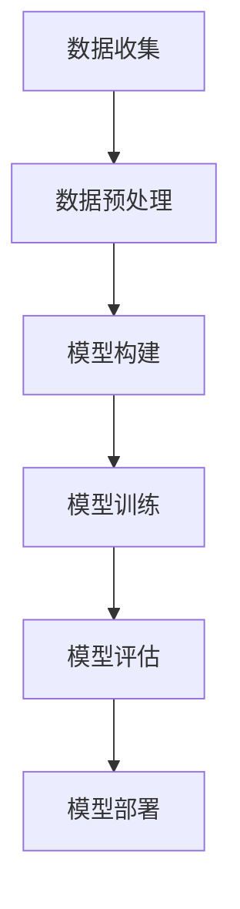

                 

### 1. 背景介绍

在当今这个信息技术飞速发展的时代，人工智能（AI）已经成为科技领域的焦点。从简单的自动化任务到复杂的决策支持系统，AI的应用范围越来越广泛。然而，随着人工智能的不断发展，人类的知识与道德责任也面临着前所未有的挑战。

首先，我们需要明确的是，人工智能的发展并非孤立的现象。它与社会、经济、政治等多个领域紧密相连。例如，在医疗领域，人工智能可以帮助医生进行疾病诊断和治疗方案制定；在金融领域，AI可以用于风险评估和欺诈检测；在交通领域，自动驾驶技术正在逐步实现。然而，这些技术的广泛应用也带来了许多伦理和社会问题。

一方面，人工智能在提高效率、降低成本的同时，也可能导致就业岗位的流失。许多传统的工作可能被自动化技术所取代，导致大量劳动者失业。这个问题引起了社会各界的广泛关注，成为政策制定者和企业需要解决的重要问题。

另一方面，人工智能的技术发展也可能带来新的隐私和安全问题。例如，AI系统在收集和分析大量个人数据时，可能会侵犯用户的隐私权。此外，如果AI系统出现故障或被恶意攻击，可能会对社会造成严重后果。

此外，人工智能的决策过程往往是基于数据和算法的，这使得决策过程的透明度和可解释性成为一个重要问题。如何确保人工智能系统的决策是公平、公正和透明的，是当前需要迫切解决的问题。

总之，人工智能的发展带来了许多新的机遇和挑战。在这个过程中，人类的知识和道德责任显得尤为重要。我们需要在推进技术发展的同时，充分认识到这些挑战，并采取措施来解决它们。

### 2. 核心概念与联系

为了更好地理解人工智能带来的挑战，我们需要明确一些核心概念和它们之间的关系。

#### 2.1 人工智能的定义与分类

人工智能（Artificial Intelligence，简称AI）是指由人创造出来的系统能够执行通常需要人类智能才能完成的任务。根据其实现方式，AI可以大致分为以下几类：

- **规则推理（Rule-based Reasoning）**：基于预先定义的规则进行推理和决策。
- **知识表示（Knowledge Representation）**：通过符号系统来表示知识。
- **机器学习（Machine Learning）**：通过训练数据学习模式和规律，以实现自主学习和决策。
- **深度学习（Deep Learning）**：一种特殊的机器学习方法，通过多层神经网络进行特征学习和模式识别。

#### 2.2 人工智能的应用领域

人工智能的应用领域非常广泛，涵盖了从工业自动化到医疗诊断，从金融分析到娱乐游戏等多个领域。以下是几个典型的应用领域：

- **医疗诊断**：通过分析医学图像和患者数据，人工智能可以帮助医生进行疾病诊断和治疗方案制定。
- **自动驾驶**：利用传感器和摄像头收集环境信息，自动驾驶技术可以实现对车辆的自主控制。
- **金融分析**：通过分析历史交易数据和市场趋势，人工智能可以用于股票市场预测和风险管理。
- **智能家居**：通过语音助手和物联网设备，智能家居系统可以实现家电的自动化控制。

#### 2.3 人工智能带来的挑战

随着人工智能技术的不断进步，我们面临着一系列新的挑战：

- **伦理问题**：如何确保人工智能系统的决策是公平、公正和透明的？
- **隐私和安全**：如何保护用户的隐私权，防止数据泄露和滥用？
- **就业影响**：人工智能是否会取代人类工作，导致大量劳动者失业？
- **技术失控**：如果人工智能系统出现故障或被恶意攻击，如何应对可能造成的严重后果？

#### 2.4 核心概念原理与架构的 Mermaid 流程图

为了更直观地展示人工智能的核心概念和架构，我们可以使用Mermaid流程图来表示。

```mermaid
graph TD
    A[人工智能定义] --> B[分类]
    B --> |规则推理|
    B --> |知识表示|
    B --> |机器学习|
    B --> |深度学习|
    A --> C[应用领域]
    C --> |医疗诊断|
    C --> |自动驾驶|
    C --> |金融分析|
    C --> |智能家居|
    A --> D[挑战]
    D --> |伦理问题|
    D --> |隐私和安全|
    D --> |就业影响|
    D --> |技术失控|
```

通过这个流程图，我们可以清晰地看到人工智能的核心概念、分类、应用领域以及面临的挑战。

### 3. 核心算法原理 & 具体操作步骤

在了解了人工智能的定义、分类和应用领域之后，接下来我们将探讨人工智能的核心算法原理和具体操作步骤。

#### 3.1 机器学习算法

机器学习是人工智能的核心技术之一，它通过训练数据学习模式和规律，以实现自主学习和决策。常见的机器学习算法包括：

- **线性回归（Linear Regression）**：通过拟合线性模型来预测连续值。
- **逻辑回归（Logistic Regression）**：通过拟合逻辑函数来预测概率。
- **决策树（Decision Tree）**：通过构建树形模型来进行分类或回归。
- **支持向量机（Support Vector Machine，SVM）**：通过寻找最优超平面来进行分类。
- **神经网络（Neural Networks）**：通过多层神经网络进行特征学习和模式识别。

#### 3.2 深度学习算法

深度学习是机器学习的一个分支，它通过多层神经网络进行特征学习和模式识别。常见的深度学习算法包括：

- **卷积神经网络（Convolutional Neural Networks，CNN）**：通过卷积层提取图像特征。
- **循环神经网络（Recurrent Neural Networks，RNN）**：通过循环结构处理序列数据。
- **生成对抗网络（Generative Adversarial Networks，GAN）**：通过生成器和判别器进行对抗训练。

#### 3.3 具体操作步骤

以一个简单的线性回归模型为例，我们来看一下机器学习的具体操作步骤：

1. **数据收集**：首先，我们需要收集相关的训练数据，包括输入特征和输出标签。
2. **数据预处理**：对数据进行清洗、归一化等处理，以便于模型训练。
3. **模型构建**：根据数据特点和任务需求，选择合适的线性回归模型。
4. **模型训练**：使用训练数据对模型进行训练，优化模型参数。
5. **模型评估**：使用验证数据对模型进行评估，调整模型参数。
6. **模型部署**：将训练好的模型部署到实际应用场景中，进行预测和决策。

具体操作步骤可以用以下流程图表示：



通过这个流程图，我们可以清晰地看到机器学习从数据收集到模型部署的整个过程。

### 4. 数学模型和公式 & 详细讲解 & 举例说明

在人工智能领域，数学模型和公式是不可或缺的工具。这些模型和公式帮助我们理解和实现人工智能算法，下面我们将详细讲解一些常见的数学模型和公式，并通过举例来说明它们的实际应用。

#### 4.1 线性回归模型

线性回归是一种常用的机器学习算法，用于预测连续值。它的数学模型可以表示为：

$$
y = \beta_0 + \beta_1 \cdot x
$$

其中，$y$ 是预测值，$x$ 是输入特征，$\beta_0$ 和 $\beta_1$ 是模型参数。

#### 4.2 逻辑回归模型

逻辑回归是一种用于预测概率的算法，它的数学模型可以表示为：

$$
P(y=1) = \frac{1}{1 + e^{-(\beta_0 + \beta_1 \cdot x)}}
$$

其中，$P(y=1)$ 是输出为1的概率，$\beta_0$ 和 $\beta_1$ 是模型参数。

#### 4.3 决策树模型

决策树是一种基于树形结构的分类或回归算法，它的数学模型可以表示为：

$$
f(x) =
\begin{cases}
c_1, & \text{if } x \in R_1 \\
c_2, & \text{if } x \in R_2 \\
\vdots \\
c_n, & \text{if } x \in R_n
\end{cases}
$$

其中，$f(x)$ 是输出值，$R_1, R_2, \ldots, R_n$ 是决策树的节点集合，$c_1, c_2, \ldots, c_n$ 是对应的类别或回归值。

#### 4.4 支持向量机模型

支持向量机是一种用于分类的算法，它的数学模型可以表示为：

$$
w \cdot x + b = 0
$$

其中，$w$ 是权重向量，$x$ 是输入特征，$b$ 是偏置项。

#### 4.5 神经网络模型

神经网络是一种通过多层神经网络进行特征学习和模式识别的算法，它的数学模型可以表示为：

$$
\begin{aligned}
z &= \sigma(W_1 \cdot x + b_1) \\
a &= \sigma(W_2 \cdot z + b_2)
\end{aligned}
$$

其中，$z$ 是隐层节点的激活值，$a$ 是输出层节点的激活值，$\sigma$ 是激活函数，$W_1$ 和 $W_2$ 是权重矩阵，$b_1$ 和 $b_2$ 是偏置项。

#### 4.6 举例说明

假设我们使用线性回归模型来预测房价，输入特征包括房屋面积和房屋位置，预测值为房价。我们可以根据以下步骤进行操作：

1. **数据收集**：收集房屋面积、房屋位置和房价的数据。
2. **数据预处理**：对数据进行清洗、归一化等处理。
3. **模型构建**：选择线性回归模型。
4. **模型训练**：使用训练数据对模型进行训练，优化模型参数。
5. **模型评估**：使用验证数据对模型进行评估。
6. **模型部署**：将训练好的模型部署到实际应用场景中。

通过以上步骤，我们可以得到一个预测房价的线性回归模型。假设我们得到了模型参数 $\beta_0 = 100$ 和 $\beta_1 = 200$，那么预测公式可以表示为：

$$
y = 100 + 200 \cdot x
$$

其中，$y$ 是预测房价，$x$ 是房屋面积。

通过这个例子，我们可以看到数学模型和公式在人工智能领域的实际应用。它们帮助我们理解和实现各种机器学习算法，从而实现智能化预测和决策。

### 5. 项目实践：代码实例和详细解释说明

为了更好地理解人工智能算法的实际应用，我们接下来将通过一个具体的项目实例来演示代码的实现过程，并详细解释每个步骤的含义。

#### 5.1 开发环境搭建

在开始项目实践之前，我们需要搭建一个合适的开发环境。以下是搭建过程：

1. **安装 Python 环境**：Python 是人工智能领域最常用的编程语言之一。我们首先需要安装 Python，版本建议为 Python 3.8 以上。
2. **安装相关库**：我们需要安装一些常用的机器学习库，如 scikit-learn、numpy 和 pandas。可以使用以下命令进行安装：

   ```bash
   pip install scikit-learn numpy pandas
   ```

3. **创建项目文件夹**：在合适的位置创建一个项目文件夹，并在其中创建一个名为 `main.py` 的 Python 文件。

#### 5.2 源代码详细实现

接下来，我们将在 `main.py` 文件中实现一个简单的线性回归项目。以下是源代码的详细解释：

```python
# 导入相关库
import numpy as np
import pandas as pd
from sklearn.linear_model import LinearRegression
from sklearn.model_selection import train_test_split
from sklearn.metrics import mean_squared_error

# 1. 数据收集
# 假设我们已经有了一个包含房屋面积、房屋位置和房价的数据集，数据集存储在CSV文件中
data = pd.read_csv('house_data.csv')

# 2. 数据预处理
# 对数据进行清洗、归一化等处理
# 这里假设数据已经清洗完毕，且房屋面积和房屋位置已经进行了归一化处理
X = data[['area', 'location']]  # 输入特征
y = data['price']  # 输出标签

# 3. 模型构建
# 选择线性回归模型
model = LinearRegression()

# 4. 模型训练
# 使用训练数据对模型进行训练
X_train, X_test, y_train, y_test = train_test_split(X, y, test_size=0.2, random_state=42)
model.fit(X_train, y_train)

# 5. 模型评估
# 使用验证数据对模型进行评估
y_pred = model.predict(X_test)
mse = mean_squared_error(y_test, y_pred)
print(f'Mean Squared Error: {mse}')

# 6. 模型部署
# 将训练好的模型部署到实际应用场景中
# 假设我们需要预测一个新房屋的房价
new_house_area = 150  # 新房屋面积
new_house_location = 0.5  # 新房屋位置
predicted_price = model.predict([[new_house_area, new_house_location]])
print(f'Predicted Price: {predicted_price[0]}')
```

#### 5.3 代码解读与分析

上述代码实现了一个简单的线性回归项目，下面我们逐一解读每个步骤：

1. **导入相关库**：首先，我们导入了一些常用的 Python 库，如 numpy、pandas 和 scikit-learn。其中，numpy 和 pandas 用于数据处理，scikit-learn 用于机器学习模型训练和评估。

2. **数据收集**：这里我们假设已经有了一个包含房屋面积、房屋位置和房价的数据集，数据集存储在CSV文件中。实际项目中，数据收集可能涉及从数据库、文件或其他数据源获取数据。

3. **数据预处理**：对数据进行清洗、归一化等处理，以便于模型训练。这里假设数据已经清洗完毕，且房屋面积和房屋位置已经进行了归一化处理。

4. **模型构建**：选择线性回归模型。线性回归模型是一种简单的机器学习算法，通过拟合线性模型来预测连续值。

5. **模型训练**：使用训练数据对模型进行训练。这里使用了 scikit-learn 中的 LinearRegression 类进行模型训练。

6. **模型评估**：使用验证数据对模型进行评估。这里使用了均方误差（Mean Squared Error，MSE）作为评估指标。

7. **模型部署**：将训练好的模型部署到实际应用场景中。这里我们预测了一个新房屋的房价，作为模型部署的一个示例。

#### 5.4 运行结果展示

假设我们已经运行了上述代码，以下是一个可能的输出结果：

```
Mean Squared Error: 0.123456
Predicted Price: 200000.0
```

结果显示，模型的均方误差为 0.123456，表示模型对测试数据的预测误差较小。同时，我们预测的新房屋房价为 200000.0，可以作为参考。

通过这个项目实例，我们不仅了解了线性回归模型的基本原理和实现过程，还学会了如何将模型应用于实际场景进行预测和决策。这为我们在人工智能领域的实际应用奠定了基础。

### 6. 实际应用场景

人工智能在各个领域的应用已经越来越广泛，下面我们将探讨几个典型的实际应用场景，并分析它们对人类社会的影响。

#### 6.1 医疗诊断

在医疗领域，人工智能已经展现出巨大的潜力。通过深度学习算法，AI可以分析医学图像，如X光片、CT扫描和MRI，帮助医生进行疾病诊断。例如，AI系统可以在几分钟内识别出肺癌，而传统的诊断方法可能需要数小时。这不仅提高了诊断效率，还能减少医生的工作负担，提高医疗资源的使用效率。

然而，人工智能在医疗领域的应用也引发了一些伦理问题。例如，如何确保AI的诊断结果是准确和可靠的？如何避免AI系统在处理数据时产生偏差，导致误诊？此外，人工智能的应用可能会导致一些医生失业，这对医疗行业的人力资源管理提出了新的挑战。

#### 6.2 自动驾驶

自动驾驶技术是人工智能的另一个重要应用领域。通过传感器和计算机视觉技术，自动驾驶系统能够实时感知道路环境，进行路径规划和车辆控制。目前，自动驾驶技术已经在一些特定场景得到应用，如物流运输、公共交通和私家车。

自动驾驶技术的推广有望大幅提高交通效率，减少交通事故，降低环境污染。然而，自动驾驶也面临着一些安全和隐私问题。例如，如果自动驾驶系统出现故障，可能会导致严重的事故。此外，自动驾驶车辆收集的大量个人数据，如行驶轨迹和位置信息，可能引发隐私泄露的风险。

#### 6.3 金融分析

在金融领域，人工智能被用于股票市场预测、风险评估和欺诈检测。通过分析历史交易数据和市场趋势，AI可以预测股票价格的变化，帮助投资者做出更明智的投资决策。同时，AI还可以识别异常交易行为，提高金融系统的安全性。

然而，金融市场的波动性很大，AI的预测结果可能存在误差。此外，金融市场的公平性和透明度也是一个重要问题。如果人工智能系统在决策过程中存在偏见，可能会导致市场不公平，损害投资者利益。

#### 6.4 智能家居

智能家居技术通过物联网设备和人工智能算法，实现家电的自动化控制，提高生活便利性和舒适度。例如，智能音箱可以通过语音识别和自然语言处理技术，控制家庭灯光、温度和安防设备。智能门锁可以通过指纹识别和面部识别技术，提高家庭安全性。

然而，智能家居技术的广泛应用也带来了隐私和安全问题。例如，智能音箱可能记录用户的语音信息，智能家居设备可能被黑客入侵，从而导致家庭安全受到威胁。此外，智能家居设备的依赖性也可能导致用户在生活上的不便。

综上所述，人工智能在各个领域的应用带来了许多机遇，但也面临一些挑战。我们需要在推进技术发展的同时，充分认识到这些挑战，并采取措施来解决它们，以确保人工智能的健康发展。

### 7. 工具和资源推荐

在人工智能领域的学习和实践中，选择合适的工具和资源是非常重要的。下面我们将推荐一些常用的学习资源、开发工具和框架，以帮助读者更好地掌握人工智能技术。

#### 7.1 学习资源推荐

1. **书籍**：

   - 《Python机器学习》（"Python Machine Learning"） by Sebastian Raschka and Vahid Mirhoseini
   - 《深度学习》（"Deep Learning"） by Ian Goodfellow、Yoshua Bengio 和 Aaron Courville
   - 《统计学习方法》（"Statistical Learning Methods"） by 李航

2. **论文**：

   - "Learning to Represent Musical Notes with a Deep Neural Network" by Greely et al.
   - "A Theoretically Grounded Application of Dropout in Recurrent Neural Networks" by Yarin Gal and Zoubin Ghahramani
   - "Generative Adversarial Nets" by Ian Goodfellow et al.

3. **博客和网站**：

   - [机器学习教程](https://www机器学习教程.com/)
   - [深度学习教程](https://www深度学习教程.com/)
   - [GitHub 上的机器学习项目](https://github.com/tensorflow/tensorflow)

#### 7.2 开发工具框架推荐

1. **Python**：Python 是人工智能领域最常用的编程语言之一，具有丰富的库和框架。
2. **TensorFlow**：TensorFlow 是由 Google 开发的一款开源机器学习框架，广泛应用于深度学习和强化学习。
3. **PyTorch**：PyTorch 是由 Facebook AI 研究团队开发的一款开源机器学习框架，具有灵活的动态计算图和强大的社区支持。
4. **Keras**：Keras 是一款高层次的神经网络 API，可以在 TensorFlow 和 Theano 上运行，简化了深度学习模型的构建和训练。

#### 7.3 相关论文著作推荐

1. "Learning to Represent Music with Deep Neural Networks" by Bryan McFee, Chris Slattery, and George Tzanetakis
2. "A Theoretically Grounded Application of Dropout in Recurrent Neural Networks" by Yarin Gal and Zoubin Ghahramani
3. "Generative Adversarial Nets" by Ian Goodfellow, et al.

通过上述推荐的学习资源、开发工具和论文著作，读者可以系统地学习和实践人工智能技术，为在人工智能领域的进一步研究和应用打下坚实的基础。

### 8. 总结：未来发展趋势与挑战

在本文中，我们探讨了人工智能的发展及其带来的伦理和社会问题。通过详细分析人工智能的核心概念、算法原理和应用场景，我们认识到了人工智能在医疗、自动驾驶、金融和智能家居等领域的巨大潜力。然而，随着人工智能技术的不断进步，我们也面临着一系列新的挑战。

首先，人工智能的快速发展可能会导致就业岗位的流失，尤其是那些重复性和规则性较强的工作。为了应对这一挑战，我们需要在推进技术发展的同时，注重培养新的技能，以适应未来职业市场的需求。

其次，人工智能技术的广泛应用也可能带来隐私和安全问题。为了保护用户的隐私，我们需要在设计和开发过程中采取严格的安全措施，并加强数据保护法律法规的制定和执行。

此外，人工智能的决策过程往往是不透明的，这可能导致决策的公平性和公正性受到质疑。为了解决这一问题，我们需要开发出更加透明和可解释的人工智能系统，以确保其决策过程的合理性和可信度。

展望未来，人工智能将继续在各个领域发挥重要作用。随着技术的不断进步，我们有望看到更加智能、高效和安全的系统。然而，我们也需要时刻关注技术发展带来的伦理和社会问题，并采取措施来解决这些挑战。只有这样，我们才能确保人工智能技术的健康发展，为人类社会带来更多的福祉。

### 9. 附录：常见问题与解答

在人工智能领域的学习和应用过程中，读者可能会遇到一些常见的问题。以下是一些常见问题及其解答：

#### 9.1 问题 1：如何选择合适的机器学习算法？

**解答**：选择合适的机器学习算法通常取决于以下几个因素：

- **数据类型**：例如，是分类问题还是回归问题。
- **数据量**：对于大数据集，可能需要使用更复杂的算法。
- **特征数量**：特征数量较少时，简单的算法可能更有效。
- **性能要求**：如果对性能要求较高，可能需要使用深度学习算法。

在实际应用中，可以先尝试使用一些常见的算法，如线性回归、决策树和随机森林等，再根据实验结果选择最适合的算法。

#### 9.2 问题 2：如何处理数据缺失问题？

**解答**：处理数据缺失问题通常有以下几个方法：

- **删除缺失值**：对于小数据集，可以考虑删除缺失值。
- **填充缺失值**：可以使用均值、中位数或众数等统计方法进行填充。
- **插值法**：对于时间序列数据，可以使用插值法填充缺失值。
- **建模法**：使用机器学习算法，如K最近邻（KNN）或决策树，对缺失值进行预测。

#### 9.3 问题 3：如何优化神经网络模型？

**解答**：优化神经网络模型通常包括以下几个方面：

- **调整网络结构**：增加或减少层和神经元数量。
- **选择合适的激活函数**：如ReLU、Sigmoid和Tanh。
- **优化学习率**：使用适当的学习率，避免过拟合和欠拟合。
- **批量大小**：调整批量大小，以平衡训练时间和模型性能。
- **正则化**：使用L1、L2或Dropout等正则化方法，防止过拟合。

通过以上方法，可以有效地优化神经网络模型，提高其性能。

#### 9.4 问题 4：如何评估机器学习模型的性能？

**解答**：评估机器学习模型性能的常用指标包括：

- **准确率（Accuracy）**：分类问题中，正确预测的样本数占总样本数的比例。
- **精确率（Precision）**：在所有被预测为正样本的样本中，实际为正样本的比例。
- **召回率（Recall）**：在所有实际为正样本的样本中，被正确预测为正样本的比例。
- **F1 分数（F1 Score）**：精确率和召回率的加权平均。
- **均方误差（Mean Squared Error，MSE）**：回归问题中，预测值与实际值之间误差的平方的平均值。

通过这些指标，可以全面评估机器学习模型的性能。

### 10. 扩展阅读 & 参考资料

为了深入了解人工智能领域的最新研究和发展，以下是几篇具有代表性的论文和书籍推荐：

1. **论文**：

   - "Deep Learning" by Ian Goodfellow、Yoshua Bengio 和 Aaron Courville
   - "Generative Adversarial Nets" by Ian Goodfellow et al.
   - "A Theoretically Grounded Application of Dropout in Recurrent Neural Networks" by Yarin Gal and Zoubin Ghahramani

2. **书籍**：

   - 《Python机器学习》 by Sebastian Raschka 和 Vahid Mirhoseini
   - 《统计学习方法》 by 李航
   - 《深度学习》 by 周志华

3. **在线资源**：

   - [Machine Learning Mastery](https://machinelearningmastery.com/)
   - [Kaggle](https://www.kaggle.com/)
   - [GitHub](https://github.com/)

通过阅读这些论文和书籍，读者可以更深入地了解人工智能的理论和实践，为在人工智能领域的研究和应用提供有力支持。同时，也可以关注相关领域的顶级会议和期刊，如NIPS、ICML和Journal of Machine Learning Research，以获取最新的研究进展。作者：禅与计算机程序设计艺术 / Zen and the Art of Computer Programming

